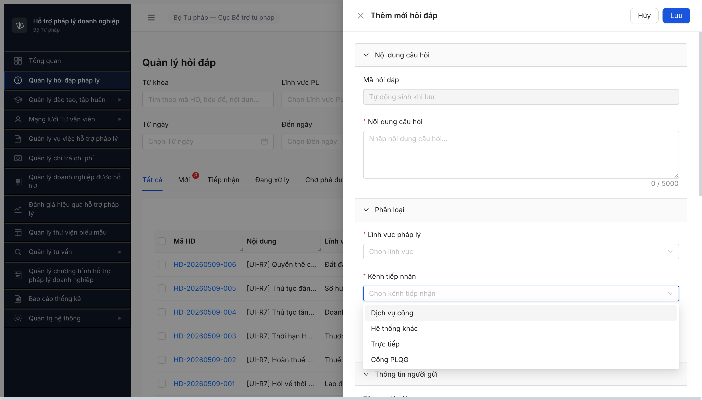
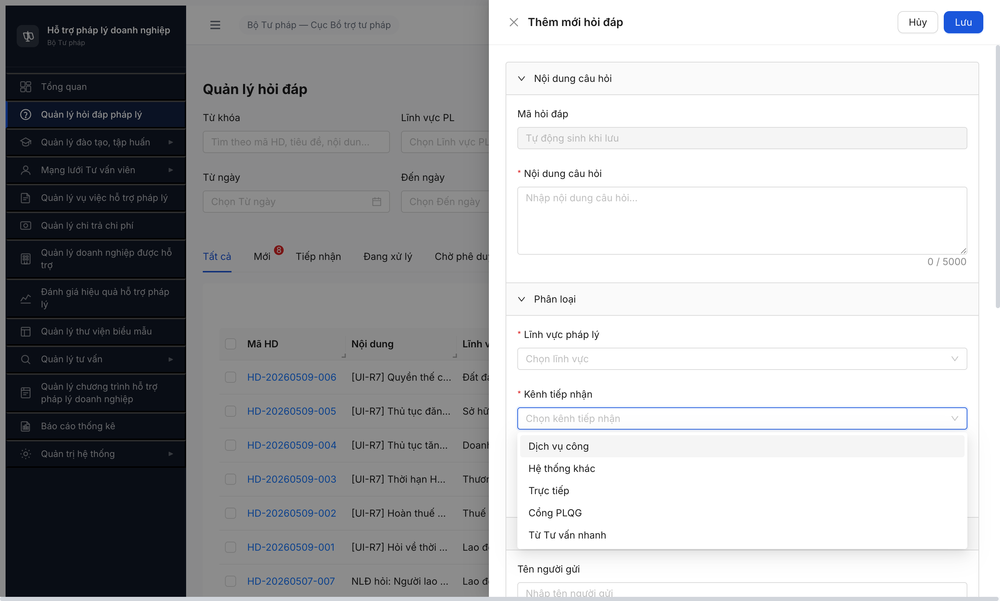

# Bug Report — Form Hỏi đáp expose option TVN_BRIDGE (R7.3.1.TVN feasibility check)

**Ngày phát hiện:** 2026-05-09 13:08:00 • **Tester:** QA huongttt
**Account:** `cb_nv_tw_02` (CB_NV_TW)
**SRS ref:** [srs-fr-02-hoi-dap.md](../../../../input/srs-update-2026-5-5/srs-fr-02-hoi-dap.md) line 86 + line 1071
**SCR:** SCR-II-01 — Form Thêm mới / Chỉnh sửa Hỏi đáp (Drawer)
**Verify 2-source:** ✅ Local grep + ✅ NotebookLM HTPLDN query 2026-05-09 13:00:00 (conversation `6b311936-4b86-4a63-8fc6-c3f846ccf2a3`) — match SRS local 100%.

---

## Bug Summary Table

| BUG-ID | Severity | Title | Status |
|---|:-:|---|:-:|
| ~~BUG-HD-FORM-001~~ | Major | ~~Form Thêm mới Hỏi đáp combobox "Kênh tiếp nhận" expose option `TVN_BRIDGE` ("Từ Tư vấn nhanh") — vi phạm SRS line 86/1071~~ | Closed |

---

## ~~BUG-HD-FORM-001~~ [CLOSED] — Form HD combobox "Kênh tiếp nhận" hiển thị 5 options thay vì 4 (lộ TVN_BRIDGE cho cán bộ nhập tay)

> **Re-test:** 2026-05-09 17:05:30 R8 — ✅ PASS (Closed-verified). UI MCP login `cb_nv_tw_02` → `/hoi-dap` → [+ Thêm mới] → combobox "Kênh tiếp nhận" render `count: 4`, options `["Dịch vụ công","Hệ thống khác","Trực tiếp","Cổng PLQG"]`, KHÔNG còn "Từ Tư vấn nhanh". Filter dropdown ngoài list page vẫn giữ 5 options đúng SRS line 1037 (TVN_BRIDGE chỉ ẩn trong form). Bằng chứng: .

**Severity:** Major • **Reporter:** QA huongttt • **Account test:** `cb_nv_tw_02`

### 1. Mô tả

CB Nghiệp vụ TW mở `/hoi-dap` → bấm `[+ Thêm mới]` → drawer "Thêm mới hỏi đáp" hiển thị combobox "Kênh tiếp nhận \*". Click dropdown thì xuất hiện **5 options** bao gồm "Từ Tư vấn nhanh" — option này tương ứng enum DB `TVN_BRIDGE` mà theo SRS chỉ được hệ thống tự ghi qua FR-13 inbound (không cho cán bộ nhập tay).

### 2. Các bước tái hiện

1. Login `cb_nv_tw_02` / `Secret@123` qua UI → OTP `666666`.
2. Sidebar click "Quản lý hỏi đáp pháp lý" → URL `/hoi-dap`.
3. Bấm button `[+ Thêm mới]` → drawer "Thêm mới hỏi đáp" mở.
4. Click combobox "Kênh tiếp nhận \*" → AntD dropdown render.
5. Quan sát danh sách option.

### 3. Kết quả mong đợi (theo SRS)

Combobox "Kênh tiếp nhận" trong form Thêm mới hiển thị **đúng 4 option**: "Dịch vụ công" (DVC), "Cổng Pháp luật Quốc gia" (CONG_PLQG), "Trực tiếp" (TRUC_TIEP), "Hệ thống khác" (HE_THONG_KHAC). Option "Từ Tư vấn nhanh" (TVN_BRIDGE) **KHÔNG xuất hiện** vì hệ thống tự ghi khi câu hỏi được đẩy từ Tư vấn nhanh sang qua FR-13.

Trích nguyên văn SRS [srs-fr-02-hoi-dap.md line 1071](../../../../input/srs-update-2026-5-5/srs-fr-02-hoi-dap.md#L1071):
> | 44 | form | Kenh tiep nhan \* | select | Bat buoc. **4 option hiển thị** (mã DB → nhãn): DVC → "Dịch vụ công", CONG_PLQG → "Cổng Pháp luật Quốc gia", TRUC_TIEP → "Trực tiếp", HE_THONG_KHAC → "Hệ thống khác". **TVN_BRIDGE KHÔNG hiển thị** trong dropdown form (hệ thống tự ghi khi câu hỏi được đẩy từ Tư vấn nhanh sang — cán bộ không nhập tay được). Auto-fill nếu từ API inbound.

Trích nguyên văn SRS [srs-fr-02-hoi-dap.md line 86](../../../../input/srs-update-2026-5-5/srs-fr-02-hoi-dap.md#L86):
> | 8 | kenh_tiep_nhan | text | Y | DVC / CONG_PLQG / TRUC_TIEP / HE_THONG_KHAC / TVN_BRIDGE (TVN_BRIDGE: hệ thống tự ghi khi câu hỏi được đẩy từ Tư vấn nhanh sang — FR-13; **cán bộ KHÔNG nhập tay được giá trị này**) | — | user input / hệ thống (TVN_BRIDGE) |

### 4. Kết quả thực tế

Combobox render **5 option**, có thêm "**Từ Tư vấn nhanh**" ở vị trí cuối:
1. Dịch vụ công
2. Hệ thống khác
3. Trực tiếp
4. Cổng PLQG
5. **Từ Tư vấn nhanh** ← lộ option TVN_BRIDGE

`evaluate_script` đếm options: `count: 5, has_tu_van_nhanh: true`. Cán bộ có thể chọn option này → submit form → hệ thống tạo HD `kenhTiepNhan=TVN_BRIDGE` mà KHÔNG có `tu_van_nhanh_goc_id` link (vi phạm constraint SRS line 1343 "FK → TU_VAN_NHANH(id); chỉ điền khi `kenh_tiep_nhan='TVN_BRIDGE'`"), tạo data inconsistent + bypass FR-13 inbound flow.

### 5. Bằng chứng



**Console JS verify:**
```js
document.querySelectorAll('.ant-select-dropdown:not(.ant-select-dropdown-hidden) .ant-select-item-option')
// → length: 5
// → ["Dịch vụ công", "Hệ thống khác", "Trực tiếp", "Cổng PLQG", "Từ Tư vấn nhanh"]
```

**API state baseline** (supporting evidence — KHÔNG dùng để repro):
```
GET /api/v1/hoi-daps?pageSize=50 → 13 records
  kenhTiepNhan distribution: TRUC_TIEP=5, HE_THONG_KHAC=4, CONG_PLQG=2, DVC=2, TVN_BRIDGE=0
```
Hiện chưa có HD nào được tạo qua bypass này, nhưng UI cho phép.

### 6. So sánh — Filter vs Form (đối chiếu spec)

| Vùng | SRS | Thực tế | Match |
|---|---|---|:-:|
| Filter-bar `/hoi-dap` (line 1037 SRS) | 5 option (TVN_BRIDGE hiển thị làm tiêu chí lọc) | 5 option đầy đủ | ✅ |
| Form Thêm mới (line 1071 SRS) | **4 option** (TVN_BRIDGE ẩn) | **5 option** (TVN_BRIDGE lộ) | ❌ |

→ FE có thể đã reuse cùng option-list source giữa filter và form thay vì áp filter rule "ẩn TVN_BRIDGE chỉ trong form". Cần FE gate theo context (filter vs form-create/edit).

---

*2026-05-09 13:15:00 — QA log qua UI MCP Chrome DevTools, verify 2-source NotebookLM + SRS local match.*
