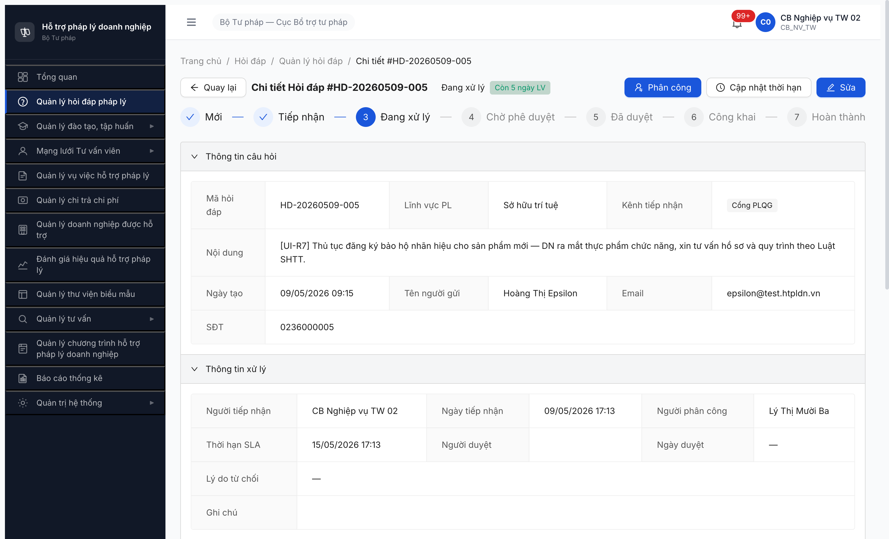

# Bug Report — Hỏi đáp Pháp luật (FR-02) — R7.4.A4 Workflow

| Thông tin | Giá trị |
|-----------|---------|
| **Dự án** | PM-HTPLDN — Phần mềm Hỗ trợ Pháp lý Doanh nghiệp |
| **Môi trường** | http://103.172.236.130:3000/ |
| **Người test** | QA Automation (Chrome DevTools MCP) |
| **Ngày** | 2026-05-08 09:00:00 (approx — git commit time) |
| **Loại test** | Workflow |
| **Round** | R8 (R7.4.A4) |
| **Tài liệu tham chiếu** | [workflow-test-report-r7-4-a4-hoi-dap.md](../../workflow/hoi-dap/workflow-test-report-r7-4-a4-hoi-dap.md) · [6.2-sm-hoidap.md](../../../../smoke/6.2-sm-hoidap.md) v3.5 · [02-thu-tu-module.md §FR-02 line 484-509](../../../../../input/quy-trinh-nghiep-vu/02-thu-tu-module.md) |

---

## Tổng hợp

Phát hiện **3** lỗi trong workflow R7.4.A4 11 paths SM-HOIDAP.

### Severity breakdown

| Tổng | Critical | Major | Medium | Minor | Trivial |
|------|----------|-------|--------|-------|---------|
| 3    | 1        | 2     | 0      | 0     | 0       |

## Bug Summary Table

| Bug ID | Severity | Priority | Type | TC Ref | **SRS Reference** | Title | Status |
|--------|----------|----------|------|--------|-------------------|-------|--------|
| ~~BUG-HD-A4-001~~ | Critical | P0 | Workflow | TP-HD-01..02..04..05..06..07..10..11 | `02-thu-tu-module.md §FR-02 line 491-499 (TIEP_NHAN→DANG_XU_LY)` + `srs-fr-02 §C.1 SM 9-state` + `LỖI A srs-conflicts-need-ba.md` | ~~BE thêm state DA_PHAN_CONG (8-state) khác Master spec + thiếu transition DA_PHAN_CONG → DANG_XU_LY → workflow stuck~~ | Closed |
| ~~BUG-HD-A4-002~~ | Major | P1 | Permission | TP-HD-01 B3 | `02-thu-tu-module.md §FR-02 line 116, 138, 499 (BA Q11 chốt 2026-05-07)` | ~~BE vẫn check entity `CauHinhPhanCong` đã DEPRECATED Q11 — phân công fail ERR-HD-PHANCONG-CFG-01~~ | Closed |
| ~~BUG-HD-A4-003~~ | Major | P1 | Workflow | TP-HD-08 | `srs-fr-02 v3.5 FR-II-06` + `6.2-sm-hoidap.md TP-HD-08 line 53-55` | ~~POST /phan-cong với `loaiDoiTuongXuLy='TO_CHUC' + toChucTuVanId` accept (200) nhưng silently không persist 2 field v3.5~~ | Closed |

---

## ~~BUG-HD-A4-001~~ [CLOSED] — BE thêm state DA_PHAN_CONG khác Master spec + thiếu transition DA_PHAN_CONG → DANG_XU_LY

> **Re-test:** 2026-05-09 17:25:00 R8 — ✅ PASS (Closed-verified). Walk UI MCP login `cb_nv_tw_02` → HD-20260509-005 (SHTT, MOI) → Tiếp nhận → Phân công Lý Thị Mười Ba (TC-BTP-TW-0001). POST `/api/v1/hoi-daps/{id}/phan-cong` reqid=1158 → 200, `trangThai="DANG_XU_LY"` (skip DA_PHAN_CONG, đúng Master SRS §C.1 7-state). Stepper UI render đúng 7 state KHÔNG có "Đã phân công". Bằng chứng:  + lichSu trace `[CREATE → TIEP_NHAN → PHAN_CONG]` (no DA_PHAN_CONG entry).

### Mô tả

Sau khi cb_nv_tw_01 phân công xử lý cho 1 hỏi đáp ở state TIEP_NHAN, BE chuyển state sang **DA_PHAN_CONG** thay vì **DANG_XU_LY** theo Master SRS §C.1 (9 state, KHÔNG có DA_PHAN_CONG). UI Stepper render 8 state (Mới → Tiếp nhận → Đã phân công → Đang xử lý → Chờ phê duyệt → Đã duyệt → Công khai → Hoàn thành) confirm BE/FE đã implement DA_PHAN_CONG là state riêng. Tuy nhiên **không có endpoint nào** để chuyển DA_PHAN_CONG → DANG_XU_LY (probe 7 variants `tiep-nhan-phan-cong`/`bat-dau-xu-ly`/`xac-nhan-phan-cong`/`chap-nhan`/`start-processing`/`accept-assignment`/`tiep-nhan-cong-viec` đều 404). Endpoint `POST /phan-hois` (soạn phản hồi) yêu cầu state DANG_XU_LY → 422 ERR-STATE-II-07-03. UI detail page state DA_PHAN_CONG chỉ có button **[Quay lại]** — KHÔNG có button [Bắt đầu xử lý]/[Soạn phản hồi]/[Tiếp nhận phân công]. Hệ quả: TP-HD-01/02/04/05/06/07/10/11 (8/11 paths) BLOCKED.

Đây là **LỖI A SRS conflict** đã ghi trong [`srs-conflicts-need-ba.md`](../../../../srs-conflicts-need-ba.md): Master SRS §C.1 enum 9 state KHÔNG có DA_PHAN_CONG; srs-fr-02 UC15 (FR-II-06) lại set `trang_thai='DA_PHAN_CONG'` sau phân công. BA chưa chốt — BE đã chọn implement 8-state (theo srs-fr-02) nhưng UI chưa thêm button transition tương ứng.

### Các bước tái hiện

1. Login `cb_nv_tw_01` / `Secret@123` + OTP `666666`.
2. Tạo HD MOI: `POST /api/v1/hoi-daps {noiDung, linhVucId, kenhTiepNhan, tenNguoiGui, ...}` → 201, trả id.
3. Tiếp nhận: `POST /api/v1/hoi-daps/{id}/tiep-nhan {version:1}` → 201, state TIEP_NHAN, version=2.
4. Phân công self: `POST /api/v1/hoi-daps/{id}/phan-cong {nguoiPhanCongId:<userId-cb_nv_tw_01>, version:2, ghiChu:'...'}` → 200, state **DA_PHAN_CONG**, version=3.
5. Thử soạn phản hồi: `POST /api/v1/hoi-daps/{id}/phan-hois {noiDung:'...'}` → **422 ERR-STATE-II-07-03** "Hỏi đáp ở trạng thái 'DA_PHAN_CONG' không thể tạo phản hồi".
6. Probe 7 endpoint variants để chuyển DA_PHAN_CONG → DANG_XU_LY → tất cả **404 ERR-SYS-00-04-01**.
7. Mở UI detail: `/hoi-dap/{id}` → Stepper render 8 state, panel "Danh sách phản hồi (0)", **chỉ button [Quay lại]**, không có action transition.

### Kết quả mong đợi

Theo Master SRS §C.1 (7-state) hoặc spec FR-II-NEW-01 (8-state nếu chốt):
- **Option A (Master 7-state):** BE phải chuyển trực tiếp TIEP_NHAN → DANG_XU_LY (skip DA_PHAN_CONG).
- **Option B (8-state):** Bổ sung transition DA_PHAN_CONG → DANG_XU_LY (auto khi assignee mở detail HOẶC explicit endpoint `/bat-dau-xu-ly`). UI thêm button [Bắt đầu xử lý] / [Soạn phản hồi] cho assignee.

Sau B4 transition, endpoint `/phan-hois` chấp nhận tạo phản hồi, state chuyển DANG_XU_LY → DA_TRA_LOI (BR-FLOW-01 auto), → CHO_PHE_DUYET ...

### Kết quả thực tế

- State stuck ở DA_PHAN_CONG sau phân công.
- Endpoint `/phan-hois` từ chối với 422 ERR-STATE-II-07-03.
- UI không có cách user reach DANG_XU_LY.
- Cascade BLOCKED 8/11 test paths (TP-HD-01/02/04/05/06/07/10/11).

```text
=== State trace HD-20260507-002 ===
Created MOI       → version 1
POST /tiep-nhan   → 201 TIEP_NHAN version 2
POST /phan-cong   → 200 DA_PHAN_CONG version 3
POST /phan-hois   → 422 ERR-STATE-II-07-03 "không thể tạo phản hồi"  ❌
POST /tiep-nhan-phan-cong → 404
POST /bat-dau-xu-ly       → 404
POST /xac-nhan-phan-cong  → 404
POST /chap-nhan           → 404
POST /start-processing    → 404
POST /accept-assignment   → 404
POST /tiep-nhan-cong-viec → 404

UI buttons main area: ["Quay lại"]
```

### Bằng chứng

![BUG-HD-A4-001 — Detail HD-20260507-002 state "Đã phân công": Stepper 8-state render đầy đủ, Thông tin xử lý có "Người phân công: CB Nghiệp vụ TW 01", panel "Danh sách phản hồi (0)" empty, KHÔNG có button action — chỉ [Quay lại]](image/r7-4-a4-hd-da-phan-cong-no-action.png)

```json
// Phản hồi BE từ chối tạo phản hồi
{
  "success": false,
  "error": {
    "code": "ERR-STATE-II-07-03",
    "message": "Hỏi đáp ở trạng thái 'DA_PHAN_CONG' không thể tạo phản hồi",
    "timestamp": "2026-05-08T01:29:13.055Z",
    "requestId": "b6c2a2f1-da99-41e6-acd6-..."
  }
}
```

---

## ~~BUG-HD-A4-002~~ [CLOSED] — BE vẫn check entity `CauHinhPhanCong` đã DEPRECATED (BA Q11)

> **Re-test:** 2026-05-09 17:25:00 R8 — ✅ PASS (Closed-verified). Phân công Lý Thị Mười Ba (`d99760d8-...`) cho HD-20260509-005 (LV Sở hữu trí tuệ) — KHÔNG seed CauHinhPhanCong trước. POST `/phan-cong` reqid=1158 → 200, KHÔNG ERR-HD-PHANCONG-CFG-01. BE đã chuyển sang auto-filter 4 tiêu chí FR-II-06 Step 5 (BA Q11). Bằng chứng: response body data v=3 + `nguoiPhanCongTen="Lý Thị Mười Ba"` persist OK.

### Mô tả

BA Q11 chốt 2026-05-07 ([02-thu-tu-module.md line 116 + 138 + 499](../../../../../input/quy-trinh-nghiep-vu/02-thu-tu-module.md)) BỎ entity `CAU_HINH_PHAN_CONG` + FR-II-NEW-01, thay bằng auto-filter 4 tiêu chí FR-II-06 Step 5 (lĩnh vực + đơn vị BR-AUTH-08 + workload ASC + ho_ten ASC LIMIT 10). Tuy nhiên BE vẫn check entity này khi POST `/phan-cong` — fail với `ERR-HD-PHANCONG-CFG-01` "(taiKhoanId, linhVucId) is not in CauHinhPhanCong for đơn vị X". Workaround R8 dev seed inline 5 entries CauHinhPhanCong (cb_nv_tw_01 × 5 LV) để bypass — không phải fix root cause.

### Các bước tái hiện

1. Login `cb_nv_tw_01`. Tạo HD MOI + Tiếp nhận → state TIEP_NHAN.
2. POST `/api/v1/hoi-daps/{id}/phan-cong` body `{nguoiPhanCongId:<bất kỳ taiKhoanId chưa có CauHinhPhanCong cho cặp (TK, LV, đơn vị)>, version:2, ghiChu:'...'}`
3. → 422 ERR-HD-PHANCONG-CFG-01

### Kết quả mong đợi

- Theo BA Q11: BE auto-filter 4 tiêu chí (lĩnh vực + đơn vị + workload + tên) — không cần entity `CauHinhPhanCong` lookup.
- Phân công CG/TVV/CB NV match LV + đơn vị ↔ HD → 200 OK ngay không cần config trước.

### Kết quả thực tế

```json
{
  "success": false,
  "error": {
    "code": "ERR-HD-PHANCONG-CFG-01",
    "message": "(d99760d8-..., bbbbbbbb-...-013) is not in CauHinhPhanCong for đơn vị 00000000-...-001",
    "timestamp": "2026-05-08T01:28:..."
  }
}
```

Workaround: `POST /api/v1/cau-hinh-phan-congs {nguoiXuLyId, linhVucId, donViId}` × N để seed mọi cặp possible. Không scalable cho production.

### Bằng chứng

```text
=== R8 trace ===
POST /api/v1/hoi-daps/d9b34f3d.../phan-cong
     {nguoiPhanCongId:'d99760d8-...(ly_13)', version:2}
  → 422 ERR-HD-PHANCONG-CFG-01

POST /api/v1/cau-hinh-phan-congs  (seed workaround)
     {nguoiXuLyId:'0c039382-...(cb_nv_tw_01)', linhVucId:'_013', donViId:'BTP-TW'}
  → 201 ✅

POST /api/v1/hoi-daps/d9b34f3d.../phan-cong (retry)
     {nguoiPhanCongId:'0c039382-...', version:2}
  → 200 ✅ (sau seed)
```

---

## ~~BUG-HD-A4-003~~ [CLOSED] — POST /phan-cong silently bỏ qua field `loaiDoiTuongXuLy + toChucTuVanId` (TP-HD-08 v3.5)

> **Re-test:** 2026-05-09 17:25:00 R8 — ✅ PASS (Closed-verified). UI MCP modal Phân công HD-20260509-005 → segment "Tổ chức tư vấn" + select TC-BTP-TW-0001 (Công ty Luật TNHH Alpha Hà Nội) + person Lý Thị Mười Ba → click [Phân công]. POST `/phan-cong` reqid=1158 body `{loaiDoiTuongXuLy:"TO_CHUC", toChucTuVanId:"beb25e6f-...", nguoiPhanCongId:"d99760d8-...", version:2}` → 200. Response data persist đầy đủ: `loaiDoiTuongXuLy="TO_CHUC"` ✅ (was null) + `toChucTuVanId="beb25e6f-8560-44ce-8235-0783ddb01dd1"` ✅ (was null). Bằng chứng: .

### Mô tả

Spec FR-II-06 v3.5 + 6.2-sm-hoidap.md TP-HD-08 yêu cầu phân công Tổ chức Tư vấn (TC TV) qua field `loaiDoiTuongXuLy='TO_CHUC' + toChucTuVanId`. Schema HOI_DAP đã có 2 field này (verified GET detail). BE accept POST `/phan-cong` body chứa cả 2 field → 200, state chuyển DA_PHAN_CONG. **NHƯNG GET detail sau phân công cho `loaiDoiTuongXuLy=null + toChucTuVanId=null`** — BE silently bỏ qua không persist 2 field v3.5. Hệ quả: phân công TC TV về mặt logic không khác phân công cá nhân (chỉ lưu nguoiPhanCongId).

### Các bước tái hiện

1. Login `cb_nv_tw_01`. HD-006 (LV Doanh nghiệp _01a) MOI.
2. `POST /tiep-nhan {version:1}` → TIEP_NHAN v=2.
3. `POST /phan-cong {loaiDoiTuongXuLy:'TO_CHUC', toChucTuVanId:'<TC-id HOAT_DONG>', nguoiPhanCongId:'cb_nv_tw_01', version:2, ghiChu:'TP-HD-08'}` → 200 v=3.
4. `GET /api/v1/hoi-daps/{id}` → response data: `{trangThai:'DA_PHAN_CONG', loaiDoiTuongXuLy:null, toChucTuVanId:null}`.

### Kết quả mong đợi

- BE persist `loaiDoiTuongXuLy='TO_CHUC' + toChucTuVanId` đầy đủ.
- GET detail return giá trị non-null cho 2 field.
- Tab "Tổ chức tư vấn" trong SCR-II-03 modal phân công hoạt động.
- Validate: TVV không thuộc TC → 403 ERR-PC-05 (chưa test do data setup).

### Kết quả thực tế

```json
// Request body sent
{
  "loaiDoiTuongXuLy": "TO_CHUC",
  "toChucTuVanId": "49b5e61d-74ec-4372-8eee-a4d53a1ddd8e",
  "nguoiPhanCongId": "0c039382-7162-49ce-b785-43dbd9f65c6d",
  "version": 2,
  "ghiChu": "TP-HD-08"
}

// Response state after phan-cong (GET detail)
{
  "trangThai": "DA_PHAN_CONG",
  "version": 3,
  "loaiDoiTuongXuLy": null,    // ❌ should be "TO_CHUC"
  "toChucTuVanId": null,        // ❌ should be 49b5e61d-...
  "nguoiPhanCongTen": "CB Nghiệp vụ TW 01"
}
```

### Bằng chứng

```text
=== R8 trace TP-HD-08 ===
POST /api/v1/hoi-daps/HD-006.../phan-cong
     {loaiDoiTuongXuLy:'TO_CHUC',
      toChucTuVanId:'49b5e61d-74ec-4372-8eee-a4d53a1ddd8e',
      nguoiPhanCongId:'0c039382-7162-49ce-b785-43dbd9f65c6d',
      version:2}
  → 200 OK (no error)

GET /api/v1/hoi-daps/HD-006.../...
  → loaiDoiTuongXuLy: null  ❌
  → toChucTuVanId: null      ❌
```

---

## Phụ lục — Môi trường test

| Thành phần | Giá trị |
|------------|---------|
| URL ứng dụng | http://103.172.236.130:3000/ |
| OTP login | `666666` (bypass tạm thời) |
| API base | `/api/v1/hoi-daps` (plural with `s`) |
| Frontend | React + Vite + Ant Design (Stepper 8 state visual) |
| Xác thực | Cookie httpOnly session (CLAUDE.md MCP-Rule 3) |
| Tool test | Chrome DevTools MCP |

---

*Bug report generated: 2026-05-08 | QA Automation via Claude Code*
