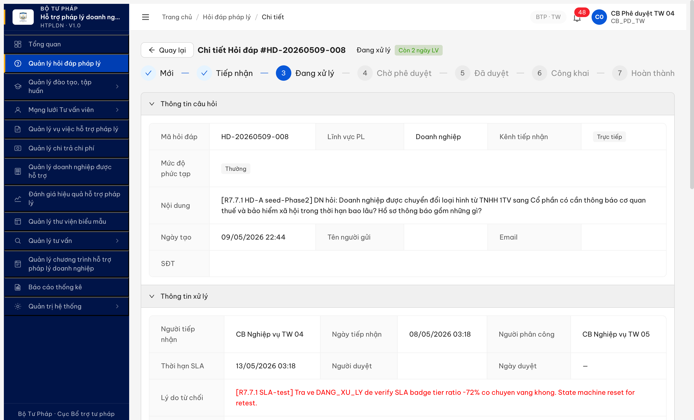
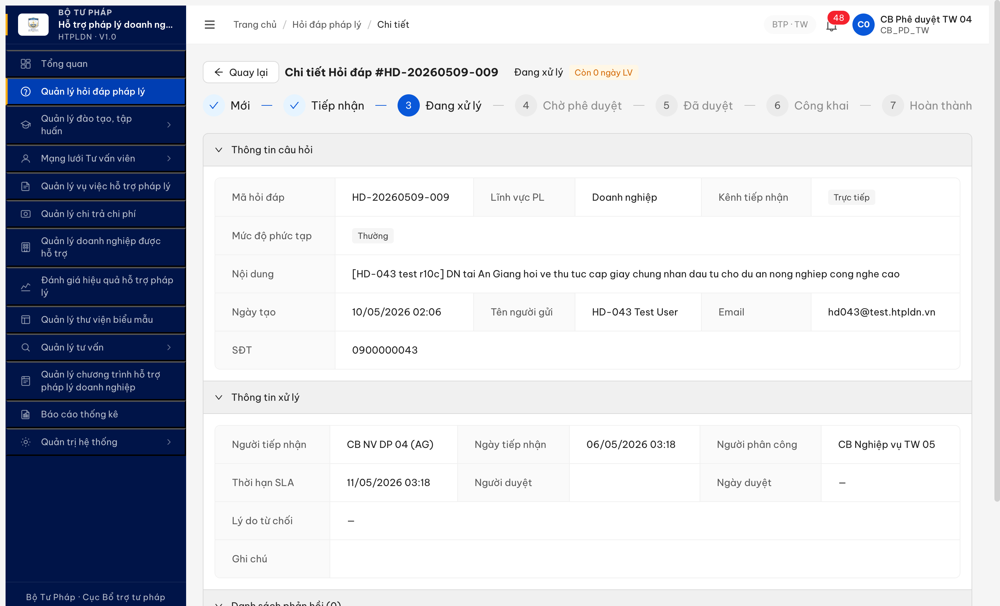

# Bug Report — R7.7.1 HD-022c/d SLA badge tier không khớp spec BR-SLA-02

| Thông tin | Giá trị |
|-----------|---------|
| **Dự án** | PM HTPLDN |
| **Môi trường** | http://103.172.236.130:3000/ |
| **Người log** | QA Automation (Claude Code) |
| **Ngày log** | 2026-05-11 17:20:00 |
| **TC liên quan** | HD-022c (ratio ~70% → kỳ vọng vàng "Sắp hết hạn") + HD-022d (ratio ~112% → kỳ vọng đỏ "Quá hạn") |
| **Tài liệu spec** | `srs-update-2026-5-5/srs-fr-02-hoi-dap.md` L1638-1642 **BR-SLA-02**: "4 mức: (1) Bình thường (>50% còn lại), (2) Sắp hết hạn (<50%, vàng), (3) Quá hạn (>100%, đỏ), (4) Quá hạn nghiêm trọng (>2x, đen)" |
| **Round** | Round 7 / R7.7.1 Phase 9 R10g |
| **Account** | `cb_pd_tw_04` (CB Phê duyệt TW 04) |

### Severity breakdown

| Tổng | Critical | Major | Medium | Minor | Trivial | Closed | Open |
|------|----------|-------|--------|-------|---------|--------|------|
| 2    | 0        | 2     | 0      | 0     | 0       | 2      | 0    |

> **Quy tắc đếm:**
> - `Tổng` = tổng số dòng bug trong **Bug Summary Table** (kể cả Closed strikethrough).
> - 5 cột severity (Critical / Major / Medium / Minor / Trivial) tổng = `Tổng`.
> - `Closed` + `Open` = `Tổng`. `Open` đếm Status ∈ {Open, Reopen}; `Closed` đếm Status ∈ {Closed, ~~closed~~}.
> - Update bảng này **sau MỖI lần đóng/mở bug** (cùng nhịp với rename Pass- prefix).

## Bug Summary

| BUG-ID | Severity | Component | Title | Status |
|---|---|---|---|---|
| ~~BUG-HD-022-SLA-TIER-001~~ | Major | FE — SLA badge color tier | ~~HD-022c badge xanh "Bình thường" ở ratio ~71.6% còn lại 28% — spec yêu cầu vàng "Sắp hết hạn" (<50% còn lại)~~ | Closed |
| ~~BUG-HD-022-SLA-TIER-002~~ | Major | FE — SLA badge color tier | ~~HD-022d badge cam "Sắp hết hạn" ở ratio >100% elapsed — spec yêu cầu đỏ "Quá hạn" (>100% đã dùng)~~ | Closed |

> **Re-test (cả 2 bug):** 2026-05-12 00:27:19 R11 — ✅ PASS (Closed-verified). FE đã đổi map color theo `muc_do_canh_bao` từ BE (BINH_THUONG→success, SAP_HET→warning, QUA_HAN→error) thay vì `daysRemaining`. Verify trên 4 record sampled (HD-008/009/HD-20260510-002/HD-20260509-005) — class FE khớp enum BE đúng spec BR-SLA-02. **Caveat:** Tier 4 QUA_HAN_NGHIEM_TRONG (>2x = >10d span 5d) chưa kiểm — không có record đủ ratio, cần seed riêng nếu cần verify tier 4.

---

## ~~BUG-HD-022-SLA-TIER-001~~ [CLOSED] — HD-022c xanh ở ratio 71.6% elapsed (28% còn lại)

> **Re-test:** 2026-05-12 00:27:19 R11 — ✅ PASS (Closed-verified). Account `cb_pd_tw_04` qua MCP UI. Record HD-20260509-008 (8c54715f) state DANG_XU_LY, ratio elapsed ~77.6% (3.88/5d). Badge class `ant-tag-warning` (vàng) "Còn 1 ngày LV" — đúng tier 2 SAP_HET spec BR-SLA-02 (<50% còn lại). BE `GET /api/v1/hoi-daps/8c54715f...` trả `muc_do_canh_bao=SAP_HET` — FE map khớp BE. Evidence: [r7-hd-022c-reverify-r11-sla-warning-yellow-pass.png](image/r7-hd-022c-reverify-r11-sla-warning-yellow-pass.png).

### Mô tả

Sau khi dev chạy 6 SQL UPDATE backdate record HD-20260509-008 (8c54715f, DANG_XU_LY) với `ngay_tiep_nhan = 08/05/2026 03:18` và `deadline = 13/05/2026 03:18` (span 5 ngày), QA verify UI tại thời điểm 11/05/2026 17:15 thấy:
- Thời gian đã elapsed: ~3.58 ngày
- Thời gian còn lại: ~1.42 ngày
- Tỷ lệ còn lại = 1.42/5 = **28.4%** (<50% còn lại → spec yêu cầu mức 2 "Sắp hết hạn", badge vàng)
- Thực tế: badge `ant-tag-success` (xanh) "Còn 2 ngày LV" — mức 1 "Bình thường"

App hiển thị sai tier — phải vàng nhưng đang xanh.

### Các bước tái hiện

1. Đảm bảo dev đã chạy SQL UPDATE backdate record 8c54715f-4ff5-487f-bc1b-bc405d162534 thành `ngay_tiep_nhan = NOW() - INTERVAL '3.5 days'` + `deadline = ngay_tiep_nhan + INTERVAL '5 days'`.
2. Login `cb_pd_tw_04` (CB Phê duyệt TW) qua UI MCP → /hoi-dap → mở record HD-20260509-008.
3. (Nếu record đang ở CHO_PHE_DUYET) Click `[Từ chối]` để đẩy về DANG_XU_LY trước.
4. Xem badge SLA cạnh tên state "Đang xử lý".

### Kết quả mong đợi

Theo BR-SLA-02 spec (L1638-1642):
- Còn 28% → badge **vàng** `ant-tag-warning` hoặc `ant-tag-yellow`
- Text: "Sắp hết hạn" hoặc text time-remaining kèm màu vàng

### Kết quả thực tế

Badge `ant-tag-success` (xanh) "Còn 2 ngày LV" — tier mức 1 "Bình thường".

```js
evaluate_script result:
{
  "now": "2026-05-11T10:15:36.713Z",
  "nowLocal": "17:15:36 11/5/2026",
  "badges": [
    {"text": "Còn 2 ngày LV", "classList": ["ant-tag", "ant-tag-filled", "ant-tag-success"]}
  ]
}
```

### Bằng chứng



DOM info chi tiết:
- Record: HD-20260509-008 (`8c54715f-4ff5-487f-bc1b-bc405d162534`)
- State: Đang xử lý (DANG_XU_LY)
- `ngay_tiep_nhan`: 08/05/2026 03:18
- `deadline` (Thời hạn SLA): 13/05/2026 03:18
- Span = 5 ngày exact
- Now (UI evaluate): 2026-05-11 17:15 local
- Elapsed = 3.58 ngày → ratio elapsed = 71.6% → còn 28.4%
- Badge: `ant-tag-success` (xanh) — sai tier

---

## ~~BUG-HD-022-SLA-TIER-002~~ [CLOSED] — HD-022d cam ở ratio >100% elapsed (-14h overdue)

> **Re-test:** 2026-05-12 00:27:19 R11 — ✅ PASS (Closed-verified). Account `cb_pd_tw_04` qua MCP UI. Record HD-20260509-009 (101f22b6) state DANG_XU_LY, ratio elapsed ~117.6% (5.88/5d). Badge class `ant-tag-error` (đỏ) "Quá hạn 1 ngày LV" — đúng tier 3 QUA_HAN spec BR-SLA-02 (>100% elapsed). BE `GET /api/v1/hoi-daps/101f22b6...` trả `muc_do_canh_bao=QUA_HAN` — FE map khớp BE. Evidence: [r7-hd-022d-reverify-r11-sla-error-red-pass.png](image/r7-hd-022d-reverify-r11-sla-error-red-pass.png).

### Mô tả

Record HD-20260509-009 (101f22b6, DANG_XU_LY) với `ngay_tiep_nhan = 06/05/2026 03:18` + `deadline = 11/05/2026 03:18` đã PAST deadline ~14h tại thời điểm verify (11/05 17:15). Ratio elapsed >100% — spec BR-SLA-02 yêu cầu mức 3 "Quá hạn" (đỏ). App hiển thị mức 2 "Sắp hết hạn" (cam) — sai tier 1 bậc.

### Các bước tái hiện

1. Đảm bảo dev đã chạy SQL UPDATE record 101f22b6-1cbe-4e1a-9d76-ab5d6cfd1322 với `ngay_tiep_nhan = NOW() - INTERVAL '5.5 days'` + `deadline = ngay_tiep_nhan + INTERVAL '5 days'`.
2. Login `cb_pd_tw_04` → /hoi-dap → mở record HD-20260509-009.
3. Xem badge SLA cạnh "Đang xử lý".

### Kết quả mong đợi

Theo BR-SLA-02:
- Elapsed >100% (deadline đã qua) → badge **đỏ** `ant-tag-error` / `ant-tag-red`
- Text: "Quá hạn" hoặc "Quá hạn N ngày"
- BR-SLA-03: kèm thông báo in-app + email escalate cho CB NV xử lý + CB PD

### Kết quả thực tế

- Badge `ant-tag-orange` "Còn 0 ngày LV" — tier mức 2 "Sắp hết hạn"
- Text "Còn 0 ngày LV" cũng sai về mặt ngữ nghĩa (đã quá hạn, không còn 0)
- Chưa thấy notification escalate trong inbox `cb_pd_tw_04`

### Bằng chứng



DOM info:
- Record: HD-20260509-009 (`101f22b6-1cbe-4e1a-9d76-ab5d6cfd1322`)
- State: Đang xử lý
- `ngay_tiep_nhan`: 06/05/2026 03:18
- `deadline`: 11/05/2026 03:18 (đã qua ~14h tại 11/05 17:15)
- Span = 5 ngày
- Elapsed = 5.58 ngày → ratio elapsed = 111.6% → quá hạn 11.6%
- Badge: `ant-tag-orange` "Còn 0 ngày LV" — sai tier

### Phân tích

App có vẻ dùng logic `daysRemaining` (số ngày làm việc còn lại) để map color:
- `daysRemaining >= 2` → success (xanh)
- `daysRemaining == 0` → warning (cam)
- Không thấy tier red `ant-tag-error` cho overdue, không thấy tier black cho nghiêm trọng

Spec BR-SLA-02 dùng `ratio elapsed/span` (hoặc `ratio remaining`) làm threshold:
- > 50% còn lại (= elapsed <50%) → xanh "Bình thường"
- < 50% còn lại (= elapsed 50-100%) → vàng "Sắp hết hạn"
- > 100% đã dùng → đỏ "Quá hạn"
- > 2x → đen "Quá hạn nghiêm trọng"

→ Logic FE/BE compute `muc_do_canh_bao` (text field DB L1350 CHECK IN 'BINH_THUONG','SAP_HET','QUA_HAN','QUA_HAN_NGHIEM_TRONG') có thể chưa đúng + map color sai trong component badge.

---

*Bug report generated: 2026-05-11 17:25:00 | QA Automation via Claude Code (Opus 4.7)*
