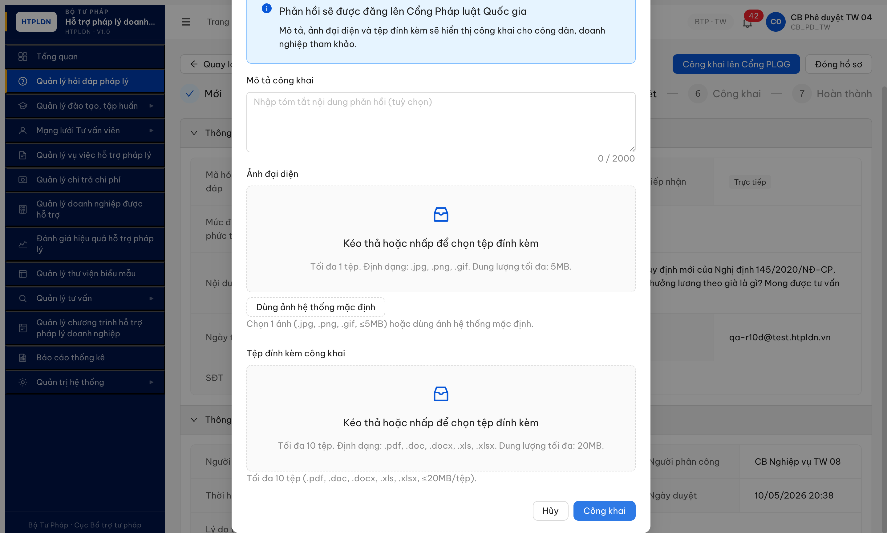

# Bug Report — R7.7.1 HD-055 Modal Công khai fail UX (ERR-PD-04 + nút "Thử lại" missing)

| Thông tin | Giá trị |
|-----------|---------|
| **Dự án** | PM HTPLDN |
| **Môi trường** | http://103.172.236.130:3000/ |
| **Người log** | QA Automation (Claude Code) |
| **Ngày log** | 2026-05-11 09:55:00 |
| **TC liên quan** | HD-055 — Modal Công khai fail handling khi POST `/cong-khai` trả lỗi 500/4xx |
| **Tài liệu spec** | `srs-update-2026-5-5/srs-fr-02-hoi-dap.md` FR-II-08 SCR-II-02 line 1141-1180 (Modal CR-01) + Bảng Error Code ERR-PD-04 |
| **Round** | Round 7 / R7.7.1 Phase 9 (re-verify Phase 8 PARTIAL) |
| **Account** | `cb_pd_tw_04` (CB Phê duyệt TW 04) — bypass OTP `666666` |

### Severity breakdown

| Tổng | Critical | Major | Medium | Minor | Trivial | Closed | Open |
|------|----------|-------|--------|-------|---------|--------|------|
| 1    | 0        | 0     | 0      | 1     | 0       | 1      | 0    |

> **Quy tắc đếm:**
> - `Tổng` = tổng số dòng bug trong **Bug Summary Table** (kể cả Closed strikethrough).
> - 5 cột severity (Critical / Major / Medium / Minor / Trivial) tổng = `Tổng`.
> - `Closed` + `Open` = `Tổng`. `Open` đếm Status ∈ {Open, Reopen}; `Closed` đếm Status ∈ {Closed, ~~closed~~}.
> - Update bảng này **sau MỖI lần đóng/mở bug** (cùng nhịp với rename Pass- prefix).

## Bug Summary

| BUG-ID | Severity | Component | Title | Status |
|---|---|---|---|---|
| ~~BUG-HD-055-PUBLISH-FAIL-UX-001~~ | Minor | FE — Modal CR-01 error handler | ~~Modal Công khai không hiện ERR-PD-04 + nút "Thử lại" khi BE trả 500~~ | Closed |

---

## ~~BUG-HD-055-PUBLISH-FAIL-UX-001~~ [CLOSED] — Modal Công khai không hiện ERR-PD-04 + nút "Thử lại" khi BE trả 500

> **Re-test:** 2026-05-11 14:25:00 R10g — ✅ PASS (Closed-verified). Inject XHR 500 ERR-PD-04 cho POST `/cong-khai` trên HD-20260510-006 (DA_DUYET, version=8). Modal CR-01 GIỜ hiển thị: (1) `ant-alert-error` đỏ với tiêu đề "Công khai thất bại" + message "Lỗi máy chủ tạm thời khi công khai. Vui lòng thử lại sau." + "Mã lỗi: ERR-PD-04" + ghi chú "Dữ liệu đã nhập được giữ lại — bấm 'Thử lại' để gửi lại yêu cầu."; (2) button cuối modal đổi label `[Công khai]` → `[Thử lại]`; (3) toast `ant-message` global hiện "Không thể công khai. Vui lòng thử lại."; (4) Form data RETAINED — textarea `Mô tả công khai` giữ 65 ký tự đã nhập, counter `65 / 2000`. Evidence: [r7-hd-055-retest-r10g-modal-error-alert-retry-pass.png](image/r7-hd-055-retest-r10g-modal-error-alert-retry-pass.png).

### Mô tả

CB Phê duyệt TW (`cb_pd_tw_04`) mở Modal CR-01 "Công khai #HD-... lên Cổng PLQG" trên record DA_DUYET, fill mô tả, click [Công khai]. Khi POST `/api/v1/hoi-daps/{id}/cong-khai` trả 500 `ERR-PD-04`, modal đứng yên, KHÔNG hiện text lỗi phân biệt mạng/máy chủ/nghiệp vụ, KHÔNG hiện nút "Thử lại", KHÔNG hiện toast/notification. State guard đúng (record vẫn DA_DUYET, `congKhai=false`, `thoiGianDangTai=null`) nhưng user không biết tại sao submit fail → UX bị block, không thể recover trong cùng modal.

### Các bước tái hiện

1. Login `cb_pd_tw_04` → /hoi-dap → mở chi tiết HD-20260510-006 (DA_DUYET) hoặc HD-20260509-010.
2. Inject XHR override để chặn POST `/cong-khai` trả 500 `{success:false, error:{code:"ERR-PD-04", message:"Lỗi máy chủ tạm thời khi công khai. Vui lòng thử lại sau."}}`.
3. Click button [Công khai lên Cổng PLQG] → Modal CR-01 mở.
4. Fill textbox "Mô tả công khai" với nội dung bất kỳ.
5. Click button [Công khai] cuối modal.
6. Đợi 2 giây → quan sát modal + toast + notification + console.

### Kết quả mong đợi

Theo `srs-update-2026-5-5/srs-fr-02-hoi-dap.md` SCR-II-02 + bảng Error Code (FR-II-08): khi POST công khai trả lỗi 5xx/4xx (ERR-PD-04 — lỗi nghiệp vụ phía Cổng PLQG / lỗi máy chủ), modal CR-01 phải:

- Hiện text lỗi rõ ràng (vd "Lỗi máy chủ tạm thời. Vui lòng thử lại sau.") + mã `ERR-PD-04`.
- Hiện nút **[Thử lại]** trong modal để user gọi lại request mà không cần đóng modal/mất dữ liệu nhập.
- Giữ form data (mô tả/ảnh/tệp) để user thử lại không phải nhập lại.
- State guard đúng: record vẫn DA_DUYET, không sang CONG_KHAI (đã PASS).

### Kết quả thực tế

- Modal đứng yên sau khi submit. KHÔNG có text lỗi, KHÔNG có code `ERR-PD-04`, KHÔNG có nút "Thử lại".
- Toast/notification rỗng: `document.querySelectorAll('.ant-message-notice, .ant-notification-notice')` = 0 phần tử.
- Dialog text inspect (`evaluate_script`): chỉ chứa text Modal CR-01 mặc định + 4 button `["", "Dùng ảnh hệ thống mặc định", "Hủy", "Công khai"]` — không có button "Thử lại" / "Retry".
- Textbox "Mô tả công khai" reset về `0 / 2000` (mất dữ liệu user vừa nhập).
- Console: không có error log từ submit handler (chỉ deprecation warnings AntD, không liên quan).
- State guard: ✅ record vẫn `DA_DUYET`, `congKhai=false`, `thoiGianDangTai=null`, `version=8` (verify qua GET API trực tiếp, bypass override).

### Bằng chứng



**Inspect dialog text snippet (`evaluate_script`):**

```text
Công khai #HD-20260510-006 lên Cổng PLQG
Phản hồi sẽ được đăng lên Cổng Pháp luật Quốc gia
Mô tả, ảnh đại diện và tệp đính kèm sẽ hiển thị công khai cho công dân, doanh nghiệp tham khảo.
Mô tả công khai  0 / 2000
Ảnh đại diện ... Dùng ảnh hệ thống mặc định
Tệp đính kèm công khai ...
Hủy  Công khai
```

Buttons: `["", "Dùng ảnh hệ thống mặc định", "Hủy", "Công khai"]` — không có `Thử lại`.

**State verify (sau khi inject 500):**

```json
{"trangThai":"DA_DUYET","congKhai":false,"thoiGianDangTai":null,"version":8}
```

State guard đúng — bug nằm ở error UX, không phải transaction.

---

## Method test inject 500 (cho dev tham khảo reproduce)

XHR override (vì app dùng axios, không phải fetch native):

```js
const _open = XMLHttpRequest.prototype.open, _send = XMLHttpRequest.prototype.send;
XMLHttpRequest.prototype.open = function(m, u, ...rest){ this.__m=m; this.__u=u; return _open.call(this,m,u,...rest); };
XMLHttpRequest.prototype.send = function(body){
  if (this.__m==='POST' && /\/cong-khai$/.test(this.__u) && !/huy-cong-khai/.test(this.__u)) {
    const fake = JSON.stringify({success:false, error:{code:'ERR-PD-04', message:'Lỗi máy chủ tạm thời khi công khai. Vui lòng thử lại sau.'}});
    setTimeout(() => {
      Object.defineProperty(this,'readyState',{get:()=>4,configurable:true});
      Object.defineProperty(this,'status',{get:()=>500,configurable:true});
      Object.defineProperty(this,'responseText',{get:()=>fake,configurable:true});
      Object.defineProperty(this,'response',{get:()=>fake,configurable:true});
      this.dispatchEvent(new Event('readystatechange'));
      this.dispatchEvent(new Event('load'));
      this.dispatchEvent(new Event('loadend'));
    }, 100);
    return;
  }
  return _send.call(this, body);
};
```

---

*Bug report generated: 2026-05-11 09:55:00 | QA Automation via Claude Code (Opus 4.7)*
