# Bug Report — Hỏi đáp pháp lý (FR-02 v3.5) — workflow + functional R7.7.1

> **Module:** Hỏi đáp (`HOI_DAP`) · **Round:** R7 + R7.7.1 Phase 4 · **Date:** 2026-05-08..2026-05-10 · **Tester:** QA Automation
> **Workflow report:** [workflow-test-report-flow-hoi-dap.md](../../workflow/hoi-dap/workflow-test-report-flow-hoi-dap.md)
> **Functional report:** [functional-test-report-r7-7-1-hd-phase4.md](../../functional/hoi-dap/functional-test-report-r7-7-1-hd-phase4.md)
> **Accounts dùng:** `cb_nv_tw_01/02/04` · `cb_nv_dp_04` (DP-AG)

## Bug Summary Table

| BUG-ID | Severity | Tiêu đề | Status |
|---|---|---|---|
| BUG-HD-021-TABS-001 | Minor | UI Quản lý hỏi đáp render 9 tabs riêng biệt vs spec v3.5 quy định 7 tabs gộp (Tiếp nhận+Đang xử lý + Hoàn thành+Hủy) — partial fix: tab count đã đúng 7, nhưng filter tab "Hoàn thành" chỉ trả HOAN_THANH, miss 4 HUY record orphan | Open (partial) |
| BUG-HD-022-SLA-THRESHOLD-001 | Minor | QTHT Cấu hình SLA default Ngưỡng cảnh báo 2 = 90% (boundary SAP_HET_HAN → QUA_HAN) khác spec BR-SLA-02 line 998 quy định QUA_HAN > 100% thời hạn — UI gắn nhãn "Quá hạn" cho ratio 90-100% (chưa thực vượt deadline) | Open |
| ~~BUG-HD-032-WORKLOAD-001~~ | ~~Question~~ | ~~Modal Phân công không hiện badge đỏ "Quá tải" — Phase 5 verify: WRN-PC-01 thực ra implement đúng, threshold N=10. Earlier conclusion sai do workload chỉ đẩy tới 9 (dưới ngưỡng).~~ | Closed-verified |
| ~~BUG-HD-043-OPTGROUP-001~~ | ~~Minor~~ | ~~Dropdown "Chọn mẫu phản hồi" render flat list, thiếu `<optgroup>` 2 nhóm "Mẫu khung quốc gia (TW)" + "Mẫu của đơn vị bạn" + thiếu badge màu theo cấp~~ | Closed-verified |
| BUG-HD-053-DEFAULT-IMAGE-001 | Minor | Modal "Công khai lên Cổng PLQG" (CR-01) thiếu button "Dùng ảnh hệ thống mặc định" theo spec SCR-II-02 line 1149 — user buộc phải upload ảnh hoặc bỏ trống, không có option chọn ảnh placeholder hệ thống | Open |
| BUG-HD-016-THOIGIAN-NULL-001 | Minor | Hủy công khai (CONG_KHAI → DA_DUYET) không reset `thoi_gian_dang_tai` về NULL theo BR-FLOW-09 line 1102 — DB vẫn giữ timestamp cũ sau khi gỡ khỏi Cổng PLQG, sai expected behavior | Open |
| ~~BUG-HD-001~~ | **Critical** | ~~Detail Hỏi đáp state `DA_PHAN_CONG` thiếu button [Phản hồi]/[Bắt đầu xử lý] cho người được phân công — block toàn bộ workflow T3-T9~~ | Closed |
| ~~BUG-HD-002~~ | Major | ~~Tab "Đang xử lý" trên SCR-II-01 rỗng dù có ≥3 record state `DA_PHAN_CONG` (filter sai vs spec `IN (TIEP_NHAN, DA_PHAN_CONG, DANG_XU_LY)`)~~ | Closed |

---

## BUG-HD-021-TABS-001 — UI render 9 tabs vs spec 7 tabs (gộp 2 cặp state) [PARTIAL FIX]

> **Re-test:** 2026-05-10 12:05:00 R10c — ⚠️ PARTIAL FIX. Tab count đã đúng 7 (`Tất cả / Mới / Đang xử lý / Chờ phê duyệt / Đã duyệt / Công khai / Hoàn thành`) — KHÔNG còn 2 tab thừa "Tiếp nhận" + "Hủy". Verify `evaluate_script` đếm `[role="tab"]` trả `count=7`. **Tuy nhiên**, BE filter của tab "Hoàn thành" mới chỉ gộp HOAN_THANH (URL `?tab=HOAN_THANH` → trả `1-2 / 2 mục`, chỉ 2 record HOAN_THANH), MISS 4 record HUY (HD-002/003 + HD-20260507-004/005) → 4 HUY record orphan, không hiển thị anywhere ngoài tab "Tất cả". Spec line 1033 quy định tab "Hoàn thành" filter `trang_thai IN ('HOAN_THANH','HUY')`. Severity downgrade Major → Minor (UX chính đã fix, vấn đề còn lại là filter union HUY).
>
> **Còn lại cần fix:** BE endpoint `/api/v1/hoi-daps?tab=HOAN_THANH` cần expand filter thành `trang_thai IN ('HOAN_THANH','HUY')` thay vì single state HOAN_THANH. Bằng chứng: 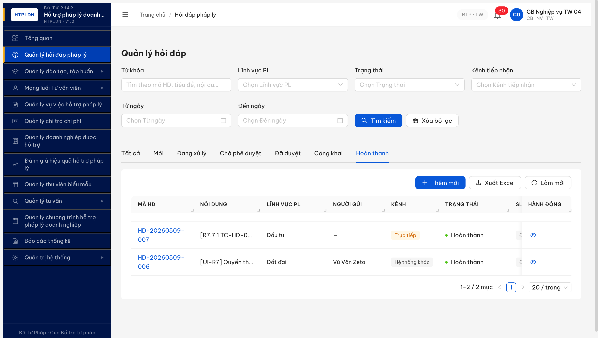.

### Mô tả

Trên màn hình Quản lý hỏi đáp pháp lý (SCR-II-01), thanh tab trạng thái phía trên bảng list render **9 tabs riêng biệt** thay vì **7 tabs gộp** theo spec v3.5. Spec yêu cầu gộp `TIEP_NHAN+DANG_XU_LY` vào 1 tab "Đang xử lý" và gộp `HOAN_THANH+HUY` vào 1 tab "Hoàn thành". UI hiện tại tách riêng cả 4 state này → user thấy thừa 2 tab so với spec.

### Các bước tái hiện

1. Login `cb_nv_tw_04` → click sidebar "Quản lý hỏi đáp pháp lý".
2. Đếm số tab trạng thái phía trên bảng list.

### Kết quả mong đợi

Theo SRS `srs-update-2026-5-5/srs-fr-02-hoi-dap.md` line 1027-1033 (table SCR-II-01 row 5-11):

```
| 5  | Tab "Tat ca"        | Toan bo HOI_DAP                                |
| 6  | Tab "Moi"           | trang_thai = 'MOI'                             |
| 7  | Tab "Dang xu ly"    | trang_thai IN ('TIEP_NHAN','DANG_XU_LY')       |  ← GỘP
| 8  | Tab "Cho phe duyet" | trang_thai = 'CHO_PHE_DUYET'                   |
| 9  | Tab "Da duyet"      | trang_thai = 'DA_DUYET'                        |
| 10 | Tab "Cong khai"     | trang_thai = 'CONG_KHAI'                       |
| 11 | Tab "Hoan thanh"    | trang_thai IN ('HOAN_THANH','HUY')             |  ← GỘP
```

→ Đúng 7 tabs.

### Kết quả thực tế

UI render 9 tabs tách riêng:
1. Tất cả
2. Mới
3. **Tiếp nhận** ← thừa, spec gộp vào "Đang xử lý"
4. Đang xử lý
5. Chờ phê duyệt
6. Đã duyệt
7. Công khai
8. Hoàn thành
9. **Hủy** ← thừa, spec gộp vào "Hoàn thành"

### Bằng chứng

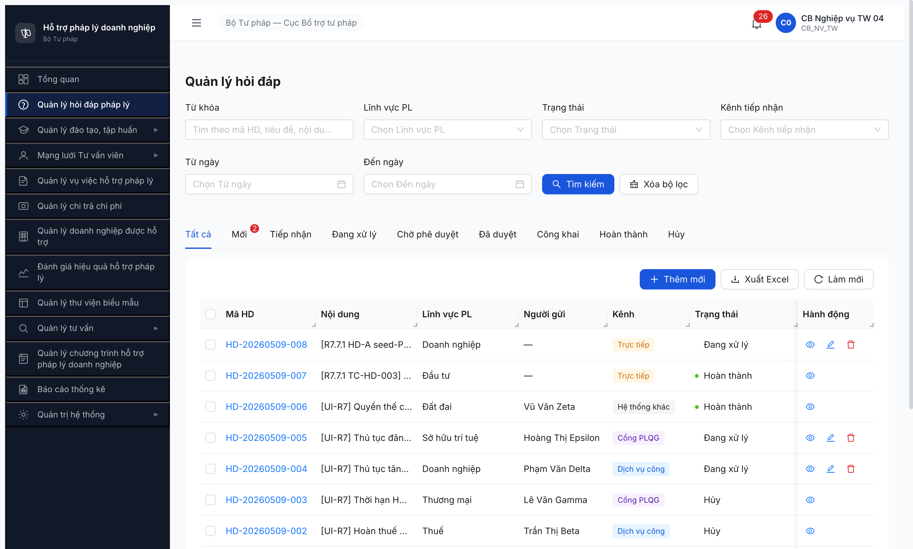

---

## BUG-HD-022-SLA-THRESHOLD-001 — QTHT Cấu hình SLA default Ngưỡng 2 = 90% lệch spec BR-SLA-02 (QUA_HAN > 100%)

> **Re-test:** 2026-05-10 12:08:00 R10c — ❌ CHƯA FIX. Login `qtht_01` → `/quan-tri/cau-hinh` Tab "Thời hạn xử lý (SLA)" → cả 4 row (HOI_DAP/HO_SO_HT/HO_SO_TT/VU_VIEC) vẫn hiện "Sắp hết hạn 50–90%" + "Quá hạn 90–100%" + Ngưỡng 2 = 90 + Hệ số = 2. Modal "Chỉnh sửa cấu hình SLA" row HOI_DAP: spinbutton "Ngưỡng cảnh báo 2 (%)" `value="90" valuemax="99" valuemin="1"` — **structural cap valuemax=99 ngăn user set 100% qua UI**. Không có thay đổi vs lần log trước. Bug vẫn Open. Bằng chứng: 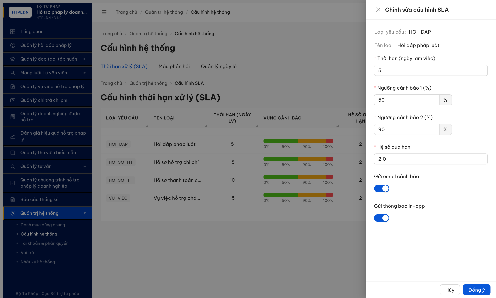.

### Mô tả

Trên màn hình QTHT > Cấu hình hệ thống > Tab "Thời hạn xử lý (SLA)" (`/quan-tri/cau-hinh`), 4 row cấu hình SLA (HOI_DAP / HO_SO_HT / HO_SO_TT / VU_VIEC) đều render default 3 vùng cảnh báo: "Bình thường 0–50%" + "Sắp hết hạn 50–90%" + "Quá hạn 90–100%" cùng "Hệ số quá hạn = 2". Default Ngưỡng cảnh báo 2 = 90% lệch spec BR-SLA-02 quy định boundary giữa SAP_HET_HAN ↔ QUA_HAN tại 100% thời hạn (vượt deadline thật). Hệ quả: với ratio elapsed/deadline 90-99%, system gắn nhãn "Quá hạn" + escalate thông báo CB NV + CB PD trong khi yêu cầu chưa thực sự quá hạn.

### Các bước tái hiện

1. Login `qtht_01` → click sidebar "Quản trị hệ thống" → "Cấu hình hệ thống".
2. Tab "Thời hạn xử lý (SLA)" (default active) — quan sát row HOI_DAP cột "Vùng cảnh báo".
3. Click "Sửa" row HOI_DAP → modal "Chỉnh sửa cấu hình SLA" → đọc giá trị Ngưỡng 1 + Ngưỡng 2 + Hệ số quá hạn.

### Kết quả mong đợi

Theo `srs-update-2026-5-5/srs-fr-02-hoi-dap.md` line 992-999 (BR-SLA-02 4 mức cảnh báo):

```
| BINH_THUONG          | > 50% thời hạn còn lại  | Xanh | Không                  |
| SAP_HET_HAN          | <= 50% còn lại          | Vàng | Thông báo CB NV        |
| QUA_HAN              | > 100% thời hạn         | Đỏ   | Thông báo CB NV + CB PD|
| QUA_HAN_NGHIEM_TRONG | > 200% thời hạn         | Đen  | + escalate             |
```

Mapping ratio = (NOW - ngay_tiep_nhan) / deadline:
- 0% ≤ ratio ≤ 50% → BINH_THUONG (Xanh) — Ngưỡng 1 = 50% ✅
- 50% < ratio ≤ 100% → SAP_HET_HAN (Vàng) — Ngưỡng 2 phải = **100%**
- 100% < ratio ≤ 200% → QUA_HAN (Đỏ) — Hệ số quá hạn = 2 ✅
- ratio > 200% → QUA_HAN_NGHIEM_TRONG (Đen)

### Kết quả thực tế

Default config UI:
- Ngưỡng cảnh báo 1 = **50%** (✅ khớp)
- Ngưỡng cảnh báo 2 = **90%** (❌ lệch — spec yêu cầu 100%)
- Hệ số quá hạn = **2** (✅ khớp = 200%)
- Email + Thông báo app: switch ON (xám disabled trên list, edit modal toggle được)

UI label trong list: "Sắp hết hạn: 50–90%" + "Quá hạn: 90–100%" cùng nhãn "100%" cap → user nhìn label "Quá hạn 90-100%" hiểu lầm là yêu cầu đã hoàn toàn vượt deadline khi ratio chỉ còn 90% (còn 10% thời hạn — chưa thực vượt).

### Bằng chứng

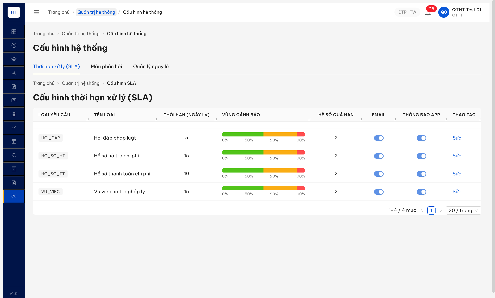

### So sánh

| Loại yêu cầu | Ngưỡng 1 default | Ngưỡng 2 default | Hệ số | Spec BR-SLA-02 |
|---|---|---|---|---|
| HOI_DAP | 50% ✅ | **90% ❌** | 2 ✅ | Ngưỡng 2 phải = 100% |
| HO_SO_HT | 50% ✅ | **90% ❌** | 2 ✅ | Ngưỡng 2 phải = 100% |
| HO_SO_TT | 50% ✅ | **90% ❌** | 2 ✅ | Ngưỡng 2 phải = 100% |
| VU_VIEC | 50% ✅ | **90% ❌** | 2 ✅ | Ngưỡng 2 phải = 100% |

→ Cả 4 loại yêu cầu đều cùng default Ngưỡng 2 = 90% lệch spec. Workaround: QTHT vào từng row click "Sửa" → đổi "Ngưỡng cảnh báo 2 (%)" thành 100 → Đồng ý. UI label list/badge sẽ tự cập nhật theo config mới.

---

## ~~BUG-HD-032-WORKLOAD-001~~ — Modal Phân công workload threshold cảnh báo (WRN-PC-01) [CLOSED-VERIFIED]

> **Re-test:** 2026-05-10 10:18:00 R10c Phase 5 final — ✅ PASS Closed-verified. WRN-PC-01 implement đúng spec, threshold N=10. Tại workload=10 (HD-509-004 mở Phân công sau khi đẩy cb_nv_tw_05 lên 10 record): badge đổi `ant-tag-red` (rgb(207, 19, 34), bg rgb(255, 241, 240)), text "Quá tải (10 yêu cầu)". Click submit Phân công → confirm modal "Cảnh báo quá tải — CB/TVV đang xử lý 10 yêu cầu, vượt ngưỡng. Bạn có chắc muốn phân công?" hiện với 2 button [Hủy] + [Xác nhận phân công]. Cả badge đỏ + confirm modal C12 đều khớp spec line 1163 + line 1170.
>
> **Earlier conclusion (R10c Phase 5 — 10:05:00):** Tester sai do chỉ verify đến workload=9 (dưới ngưỡng N=10), thấy `ant-tag-green` đồng nhất → kết luận "Major Sai spec". Push thêm 1 record (HD-507-003 phân công tiếp) → workload=10 → badge đỏ + confirm modal trigger ngay. Threshold N=10 không có config UI nhưng hard-code phù hợp UX bình thường.

### Mô tả

Modal Phân công xử lý có cột Workload hiển thị số HD đang xử lý của mỗi CB. Spec WRN-PC-01 yêu cầu khi workload vượt ngưỡng N (a) row đó đổi sang badge đỏ "Quá tải ({N} yêu cầu)" và (b) submit phân công bật confirm modal C12. Final verify: cả 2 đều implement đúng — threshold **N=10**.

### Các bước tái hiện

1. Login `cb_nv_tw_04` → Quản lý hỏi đáp.
2. UI seed loop: phân công cb_nv_tw_05 9 lần để đẩy workload lên 10 (qua HD-009, HD-008, HD-005, HD-004, HD-507-006, HD-507-002, HD-507-001, HD-507-007, HD-507-003).
3. Mở HD-20260509-004 → click [Phân công] → quan sát row cb_nv_tw_05.
4. Click radio cb_nv_tw_05 (đang là người phân công) → click [Phân công] submit.

### Kết quả mong đợi (theo SRS)

- Line 483 (E2): `WRN-PC-01 | "Cán bộ {tên} đang xử lý {N} yêu cầu. Xác nhận phân công?" | WARNING`
- Line 1163 (SCR-II-03 modal #5): `badge (đỏ) | "Quá tải ({N} yêu cầu)" — KHÔNG chặn phân công`
- Line 1170 (SCR-II-03 modal #12): `Nếu khối lượng vượt ngưỡng → C12 xác nhận`

### Kết quả thực tế (Phase 5 R10c 2026-05-10 10:18:00)

| Workload | Tag class | Tag color | Badge text | Confirm modal khi submit |
|:-:|---|---|---|:-:|
| 0 (35 CB khác) | `ant-tag-green` | rgb(56, 158, 13) | "0 yêu cầu" | N/A |
| 1..9 (cb_nv_tw_05 dưới ngưỡng) | `ant-tag-green` | rgb(56, 158, 13) | "{N} yêu cầu" | KHÔNG (đúng — chưa vượt ngưỡng) |
| **10 (cb_nv_tw_05 đạt ngưỡng)** | **`ant-tag-red`** | **rgb(207, 19, 34)** | **"Quá tải (10 yêu cầu)"** | **CÓ "Cảnh báo quá tải — CB/TVV đang xử lý 10 yêu cầu, vượt ngưỡng. Bạn có chắc muốn phân công?" với [Hủy] + [Xác nhận phân công]** |

→ Cả badge đỏ + confirm modal C12 implement đúng spec. Threshold N=10 (hard-code hoặc config server-side, UI không expose).

### Bằng chứng

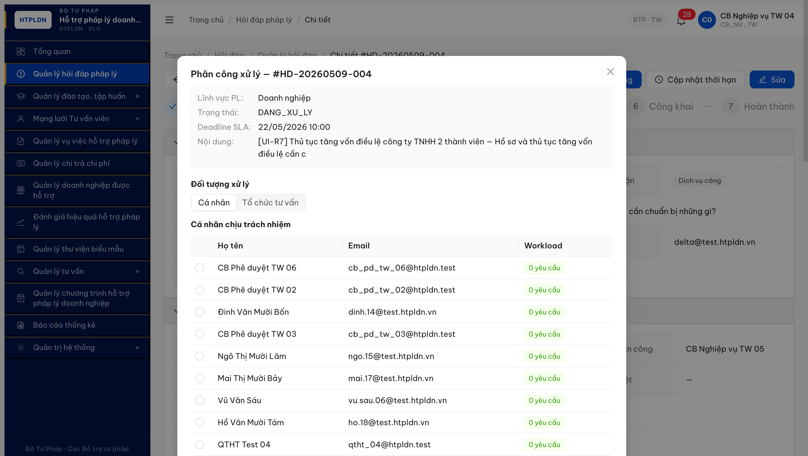
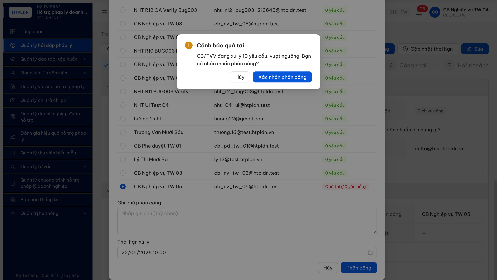

DOM evidence:
```
[workload=10] <span class="ant-tag ant-tag-filled ant-tag-red">Quá tải (10 yêu cầu)</span>
              color: rgb(207, 19, 34); background-color: rgb(255, 241, 240);

[workload=0]  <span class="ant-tag ant-tag-filled ant-tag-green">0 yêu cầu</span>
              color: rgb(56, 158, 13); background-color: rgb(246, 255, 237);

[confirm dialog] <div role="dialog">
                   <h2>Cảnh báo quá tải</h2>
                   <p>CB/TVV đang xử lý 10 yêu cầu, vượt ngưỡng. Bạn có chắc muốn phân công?</p>
                   <button>Hủy</button>
                   <button>Xác nhận phân công</button>
                 </div>
```

---

## BUG-HD-053-DEFAULT-IMAGE-001 — Modal Công khai CR-01 thiếu button "Dùng ảnh hệ thống mặc định"

### Mô tả

Modal "Công khai lên Cổng PLQG" (CR-01, mở từ button [Công khai] trên SCR-II-02 chi tiết HD state DA_DUYET) thiếu nút "Dùng ảnh hệ thống mặc định" theo spec FR-II-08 SCR-II-02 line 1149. Hiện modal chỉ có 3 zone (Mô tả công khai + Upload ảnh đại diện + Upload tệp đính kèm) — user phải tự upload ảnh hoặc bỏ trống, không có option chọn ảnh placeholder hệ thống cấp khi không có ảnh phù hợp.

### Các bước tái hiện

1. Login `cb_pd_tw_04` → Quản lý hỏi đáp pháp lý → click HD ở state `Đã duyệt` (vd HD-20260510-001).
2. Click button [Công khai lên Cổng PLQG] → modal mở.
3. Quan sát section "Ảnh đại diện".

### Kết quả mong đợi

Theo `srs-update-2026-5-5/srs-fr-02-hoi-dap.md` SCR-II-02 line 1149: trong modal Công khai có **nút "Dùng ảnh hệ thống mặc định"** — click sẽ auto-fill 1 ảnh placeholder mặc định (vd icon Bộ Tư pháp / SVG generic) làm ảnh đại diện cho phản hồi public.

### Kết quả thực tế

Section "Ảnh đại diện" chỉ có 1 button drag-and-drop "Kéo thả hoặc nhấp để chọn tệp đính kèm Tối đa 1 tệp. Định dạng: .jpg, .png. Dung lượng tối đa: 5MB." — KHÔNG có button "Dùng ảnh hệ thống mặc định" cạnh hoặc dưới upload zone.

### Bằng chứng

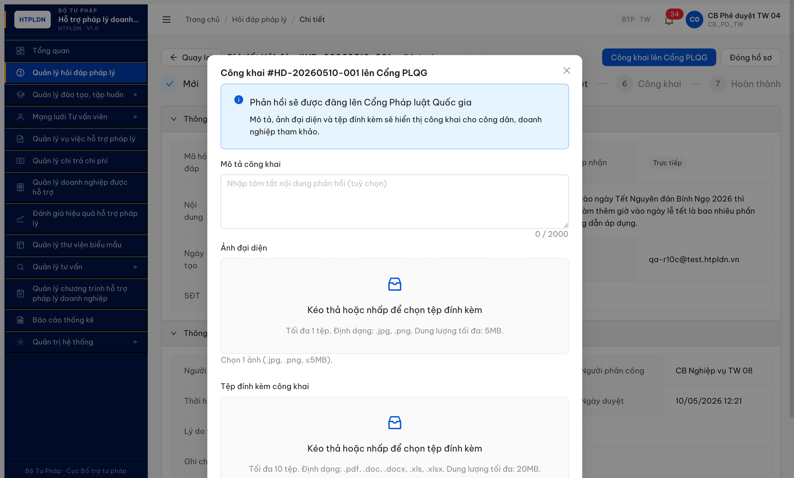

---

## BUG-HD-016-THOIGIAN-NULL-001 — Hủy công khai không reset `thoi_gian_dang_tai` về NULL

### Mô tả

Khi CB Phê duyệt cùng cấp click [Hủy công khai] trên HD state CONG_KHAI → state đúng quay về DA_DUYET + `cong_khai=false`, **nhưng** trường `thoi_gian_dang_tai` vẫn giữ timestamp cũ (lần đăng tải trước), không được reset về NULL theo spec BR-FLOW-09. Hệ quả: hệ thống không phân biệt được record "chưa từng công khai" và "đã từng công khai rồi gỡ" qua `thoi_gian_dang_tai` (cả 2 trường hợp đều có/không có timestamp lẫn lộn nếu re-public).

### Các bước tái hiện

1. Login `cb_pd_tw_04` → HD-20260510-001 (DA_DUYET) → click [Công khai lên Cổng PLQG] → fill mô tả → click [Công khai] → state CONG_KHAI, ghi nhận `thoiGianDangTai=2026-05-10T05:28:04.883Z`.
2. Click [Hủy công khai] → confirm popup → click [Hủy công khai] → state DA_DUYET, `congKhai=false`.
3. GET `/api/v1/hoi-daps/{id}` verify response.

### Kết quả mong đợi

Theo `srs-update-2026-5-5/srs-fr-02-hoi-dap.md` BR-FLOW-09 line 1102: "Hủy công khai (CONG_KHAI → DA_DUYET): SET `cong_khai=0`, **xóa `thoi_gian_dang_tai` về NULL**, ghi audit log."

GET response sau hủy CK:
```json
{ "trangThai": "DA_DUYET", "congKhai": false, "thoiGianDangTai": null }
```

### Kết quả thực tế

GET response sau hủy CK:
```json
{ "trangThai": "DA_DUYET", "congKhai": false, "thoiGianDangTai": "2026-05-10T05:28:04.883Z" }
```

`thoi_gian_dang_tai` không reset NULL — vẫn giữ giá trị từ lần đăng tải đầu.

### Bằng chứng

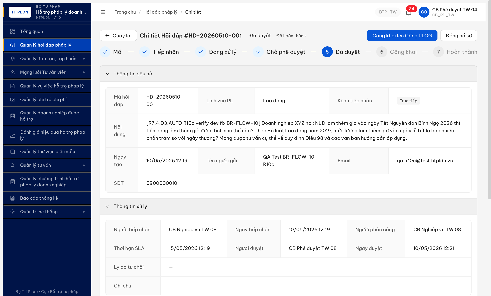

DOM/API evidence:
```
POST /api/v1/hoi-daps/{id}/cong-khai → 200
GET  /api/v1/hoi-daps/{id} → trangThai=CONG_KHAI, congKhai=true, thoiGianDangTai=2026-05-10T05:28:04.883Z

POST /api/v1/hoi-daps/{id}/huy-cong-khai → 200
GET  /api/v1/hoi-daps/{id} → trangThai=DA_DUYET, congKhai=false, thoiGianDangTai=2026-05-10T05:28:04.883Z  (sai spec — phải NULL)
```

---

## ~~BUG-HD-043-OPTGROUP-001~~ [CLOSED] — Dropdown "Chọn mẫu phản hồi" thiếu `<optgroup>` 2 nhóm + thiếu badge màu

> **Re-test:** 2026-05-10 12:15:00 R10c — ✅ PASS Closed-verified. Login `cb_nv_dp_04` (Sở Tư pháp An Giang) → HD-20260509-009 (DANG_XU_LY, LV Doanh nghiệp) → click combobox "Chọn mẫu phản hồi" → dropdown render `ant-select-item-group` với label "Mẫu khung quốc gia (TW)" + item 🟦 `Mẫu phản hồi HD - Doanh nghiệp` (TW scope). Sau khi seed thêm 1 mẫu DP-AG (`Mẫu phản hồi DP-AG - Doanh nghiệp [HD-043 verify]` phamVi=`DP_RIENG`) → reload dropdown → **render đúng 2 group**: `["Mẫu khung quốc gia (TW)", "Mẫu của đơn vị bạn"]` với 2 item `["🟦Mẫu phản hồi HD - Doanh nghiệp", "🟨Mẫu phản hồi DP-AG - Doanh nghiệp [HD-043 verify]"]`. Group label + badge 🟦 (TW) + 🟨 (Địa phương) khớp spec FR-II-NEW-02 line 1121. Filter scope đúng (chỉ TW + DP-AG, không leak BN/DP khác). Cleanup: đã DELETE template seed test (status 204). Bằng chứng: 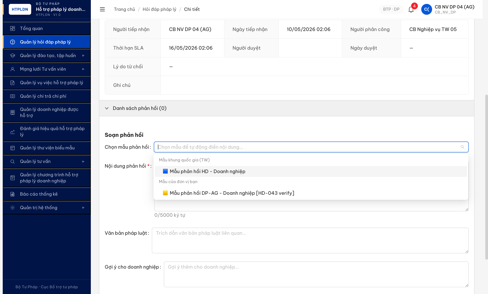.

### Mô tả

Combobox "Chọn mẫu phản hồi" trên màn hình Soạn phản hồi (SCR-II-02 #19) khi user CB_NV cấp DP/BN mở dropdown render **flat list** không phân nhóm. Spec FR-II-NEW-02 yêu cầu BẮT BUỘC dùng `select (searchable, grouped)` với 2 `<optgroup>`: (a) "Mẫu khung quốc gia (TW)" với badge 🟦 + (b) "Mẫu của đơn vị bạn" với badge 🟩 Bộ / 🟨 Địa phương. UI hiện tại không có group label, không có badge màu → user khó phân biệt nguồn mẫu (Trung ương vs đơn vị mình).

### Các bước tái hiện

1. Login `cb_nv_dp_04` (CB Nghiệp vụ DP — Sở An Giang).
2. Tạo HD mới: lĩnh vực Doanh nghiệp, kênh Trực tiếp → click [Đồng ý].
3. Tab "Mới" → mở record vừa tạo → click [Tiếp nhận].
4. Click [Phân công] → chọn radio self → click [Phân công] → state = DANG_XU_LY.
5. Section "Soạn phản hồi" → click combobox "Chọn mẫu phản hồi".
6. Quan sát dropdown render.

### Kết quả mong đợi

Theo SRS `srs-update-2026-5-5/srs-fr-02-hoi-dap.md`:
- Line 1121 (SCR-II-02 row #19): `Dropdown chen mau | select (searchable, **grouped**) | ... **Hiển thị gom 2 nhóm trong dropdown:** (a) "Mẫu khung quốc gia (TW)" — gom tất cả mẫu phạm vi TW_QUOC_GIA, có badge 🟦; (b) "Mẫu của đơn vị bạn" — gom mẫu của đơn vị user, badge theo cấp (🟩 Bộ / 🟨 Địa phương)`
- Line 965 (AC FR-II-NEW-02): `Given Cán bộ Sở TP Hà Nội mở dropdown chèn mẫu khi soạn phản hồi When dropdown hiển thị Then thấy 2 nhóm: "Mẫu khung quốc gia (TW)" + "Mẫu của Sở TP Hà Nội". KHÔNG thấy mẫu Sở TP HCM, không thấy mẫu Bộ ngành.`

→ Dropdown phải có 2 `<optgroup>` label + badge màu 🟦/🟩/🟨 theo cấp.

### Kết quả thực tế

- Dropdown render flat list, không có header phân nhóm.
- 1 item duy nhất: "Mẫu phản hồi HD - Doanh nghiệp" (TW scope).
- KHÔNG có `<optgroup>` element trong DOM.
- KHÔNG có badge màu (🟦/🟩/🟨) cạnh tên mẫu.
- Filter scope theo `pham_vi_ap_dung` đang đúng (chỉ hiện TW + DP-AG, không leak DP khác / BN).

### Bằng chứng

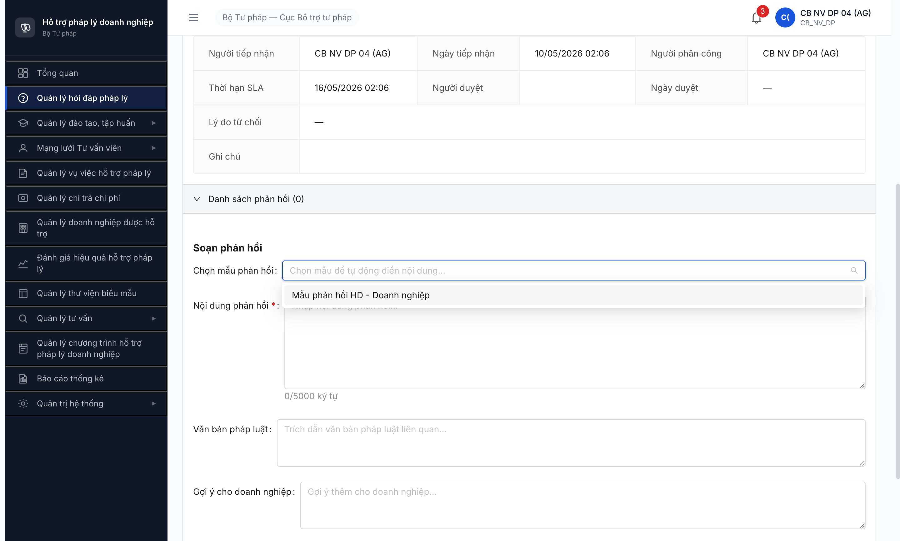

---

## ~~BUG-HD-001~~ [CLOSED] — Detail DA_PHAN_CONG thiếu button [Phản hồi] cho người được phân công

> **Re-test:** 2026-05-09 17:30:00 R8 — ✅ PASS (Closed-verified). Root cause đã giải nhờ dev simplify state machine (TIEP_NHAN → DANG_XU_LY direct, bỏ DA_PHAN_CONG per Master SRS §C.1). HD-20260509-005 sau Phân công vào state DANG_XU_LY → detail page render đầy đủ form **"Soạn phản hồi"** (combobox mẫu phản hồi + textarea Nội dung phản hồi 5000 ký tự + Văn bản pháp luật + Gợi ý DN) + button [Lưu nháp] + button **[Gửi phản hồi]**. Workflow T3-T9 unblocked. Bằng chứng: .

### Mô tả

Trên màn hình Chi tiết Hỏi đáp ở trạng thái `DA_PHAN_CONG`, người được phân công (`cb_nv_tw_01`) **không thấy button [Phản hồi]/[Bắt đầu xử lý]** để soạn phản hồi câu hỏi và đẩy state sang `DANG_XU_LY` → `CHO_PHE_DUYET` (BR-FLOW-01). Block toàn bộ T3-T9 của state machine SM-HOIDAP.

### Các bước tái hiện

1. Login `cb_nv_tw_02` (CB Nghiệp vụ TW 02) → Quản lý hỏi đáp pháp lý.
2. Click eye HD-20260507-001 (state Mới) → click [Tiếp nhận] → confirm. State → "Tiếp nhận".
3. Click [Phân công] → modal "Phân công xử lý" → chọn radio "CB Nghiệp vụ TW 01" → click [Phân công]. State → "Đã phân công", Người phân công = `cb_nv_tw_01`.
4. Logout `cb_nv_tw_02`. Login `cb_nv_tw_01` (người được phân công) qua isolated context.
5. Vào Chi tiết HD-20260507-001.

### Kết quả mong đợi

Theo SRS [`srs-fr-02-hoi-dap.md` line 519-589 §FR-II-04 Phản hồi]:
- Pre-condition: `HOI_DAP.trang_thai IN (DA_PHAN_CONG, DANG_XU_LY)`
- Người được phân công (assignee) thấy form "Phản hồi" hoặc button [Phản hồi]/[Soạn phản hồi]/[Bắt đầu xử lý] để nhập nội dung.
- Tích "Đã trả lời" → BR-FLOW-01 auto chuyển state CHO_PHE_DUYET.

### Kết quả thực tế

Trên detail page state `DA_PHAN_CONG` (URL `/hoi-dap/{id}`):
- Header chỉ có badge "Đã phân công" + "Còn 10 ngày LV", **không có** button action transition.
- Section "Danh sách phản hồi (0)" expanded, hiển thị "Chưa có phản hồi nào." nhưng **không có button [Thêm phản hồi]/[Soạn phản hồi]**.
- Section "Thông tin xử lý" chỉ readonly fields.
- Toàn DOM main content chỉ có button "Quay lại" (verify qua `evaluate_script` lọc `button` visible: chỉ 14 button trong đó 13 sidebar + 1 "Quay lại").

### Bằng chứng

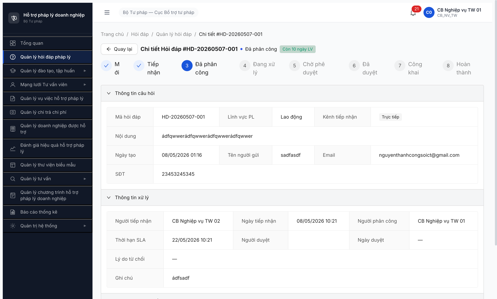

```
evaluate_script:
  document.querySelectorAll('button, a').filter(text matches /phản hồi|trả lời|thêm|đang xử lý|chuyển/i)
  => actionBtns = [] (zero match)
  inputs = [] (zero textarea/input trong main detail)
```

---

## ~~BUG-HD-002~~ [CLOSED] — Tab "Đang xử lý" rỗng dù có 3 record DA_PHAN_CONG

> **Re-test:** 2026-05-09 17:30:00 R8 — ✅ PASS (Closed-verified). UI MCP login `cb_nv_tw_02` → `/hoi-dap` → Tab "Đang xử lý" → URL `?tab=DANG_XU_LY&page=1` → render **5 records** trạng thái "Đang xử lý" (HD-20260509-005/006 + HD-20260507-001/002/006). `totalText="1-5 / 5 mục"`, KHÔNG còn empty state. Note: spec union 3 state cũ (TIEP_NHAN+DA_PHAN_CONG+DANG_XU_LY) đã không còn áp dụng vì DA_PHAN_CONG bị bỏ + TIEP_NHAN có tab riêng. Bằng chứng: 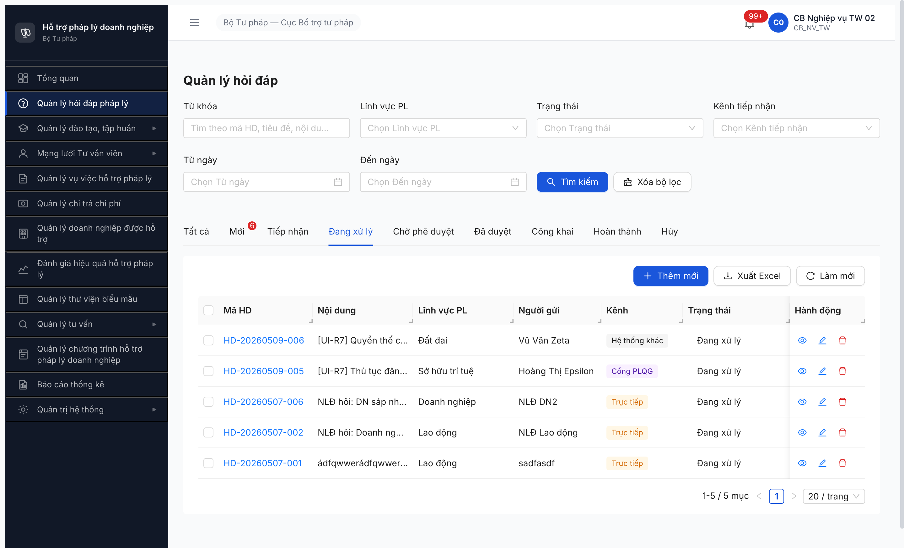.

### Mô tả

Tab "Đang xử lý" trên màn hình Quản lý hỏi đáp (SCR-II-01) hiển thị **"Không có dữ liệu"** trong khi pool có ≥3 record state `DA_PHAN_CONG` (HD-001/002/006) thuộc người đang đăng nhập (`cb_nv_tw_01`). Filter cứng theo SRS phải `IN (TIEP_NHAN, DA_PHAN_CONG, DANG_XU_LY)` — UI hiện chỉ filter `DANG_XU_LY` đơn lẻ.

### Các bước tái hiện

1. Login `cb_nv_tw_01` → sidebar "Quản lý hỏi đáp pháp lý".
2. Tab "Tất cả" hiển thị 7/7 records, trong đó: HD-001 (DA_PHAN_CONG), HD-002 (DA_PHAN_CONG), HD-006 (DA_PHAN_CONG) — đều assigned cho cb_nv_tw_01.
3. Click tab "Đang xử lý". URL chuyển sang `/hoi-dap?tab=DANG_XU_LY&page=1`.

### Kết quả mong đợi

Theo SRS [`srs-fr-02-hoi-dap.md` line 311-317 §FR-II-03 Đang xử lý]:
- `trang_thai_filter` cố định: `IN ('TIEP_NHAN','DA_PHAN_CONG','DANG_XU_LY')` (line 317)
- Tab phải hiển thị 3 record HD-001/002/006 (DA_PHAN_CONG).

### Kết quả thực tế

- Tab "Đang xử lý" empty: `image "Trống"` + `StaticText "Không có dữ liệu"`.
- URL params `tab=DANG_XU_LY` cho thấy FE chỉ gửi `trang_thai=DANG_XU_LY` đơn lẻ thay vì union 3 state.
- Buttons "Xuất Excel"/"Select all" disabled (do empty list).

### Bằng chứng

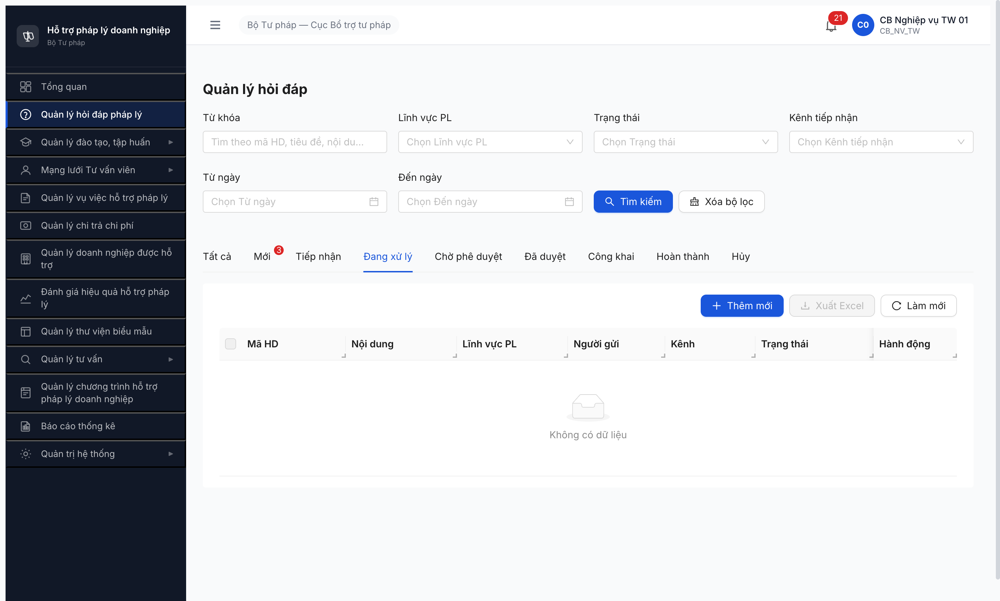

---

*R7 | QA Automation via Claude Code (Chrome DevTools MCP)*
