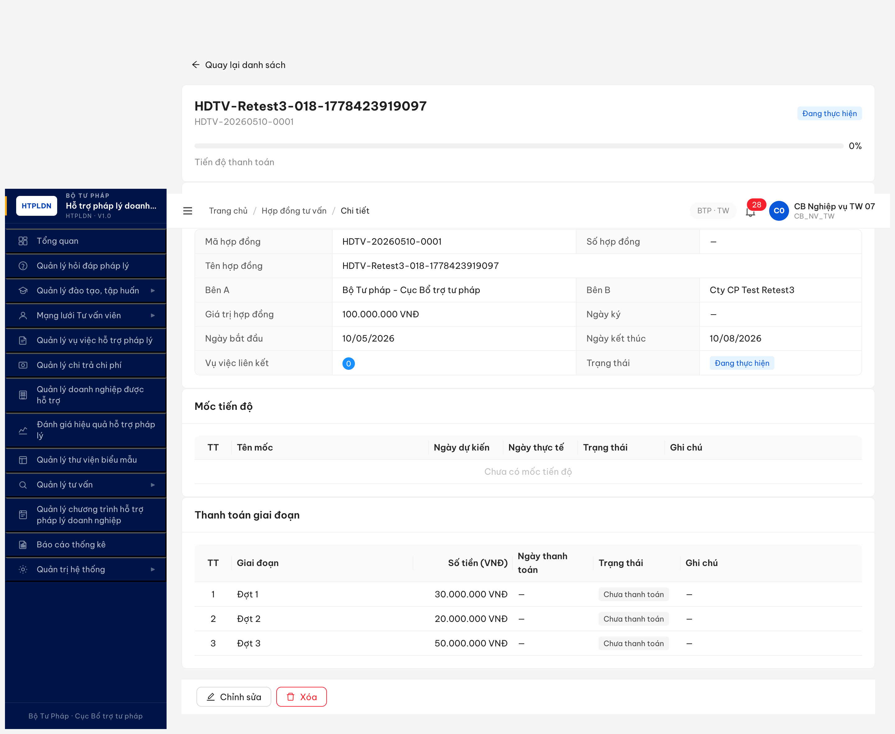
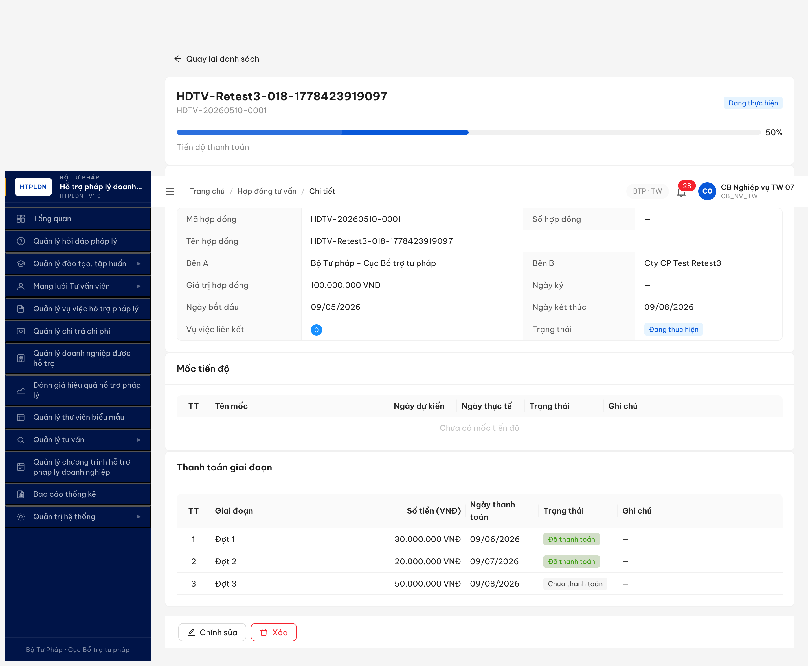
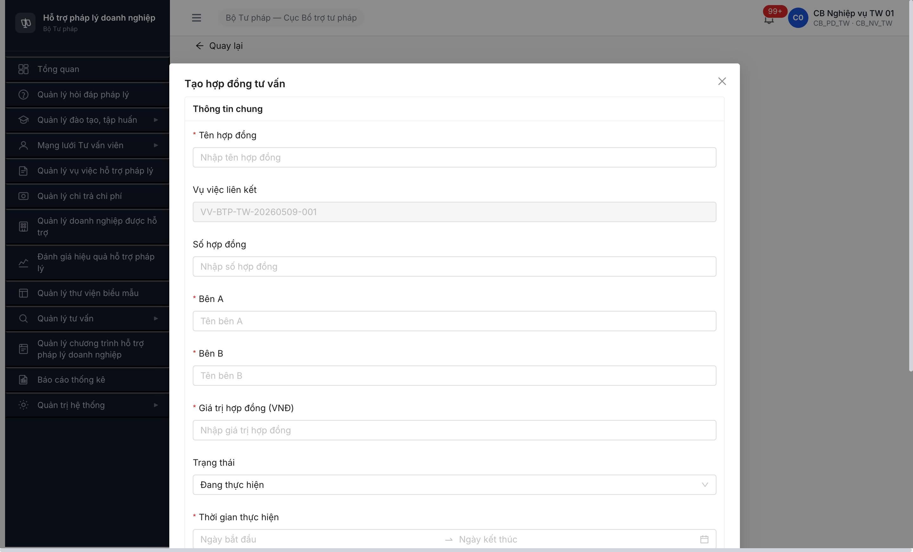
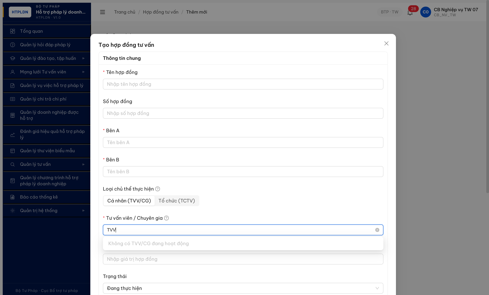
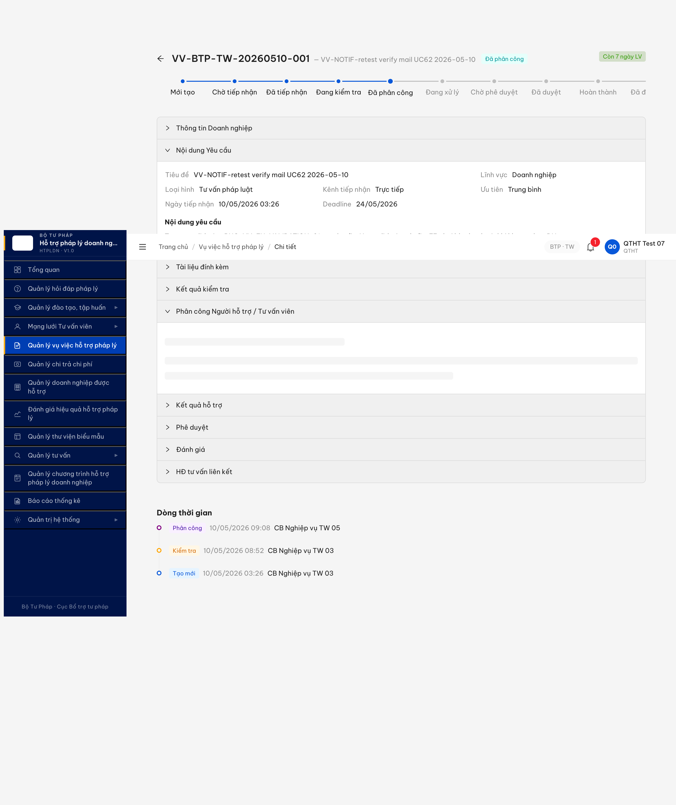
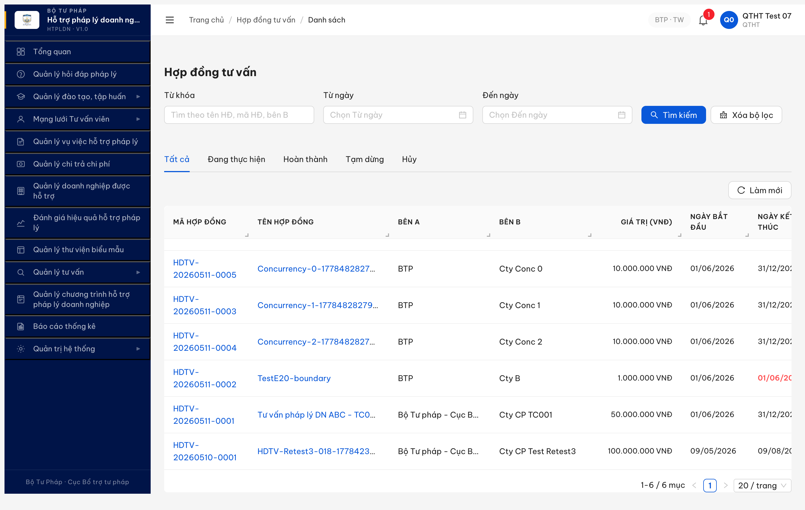
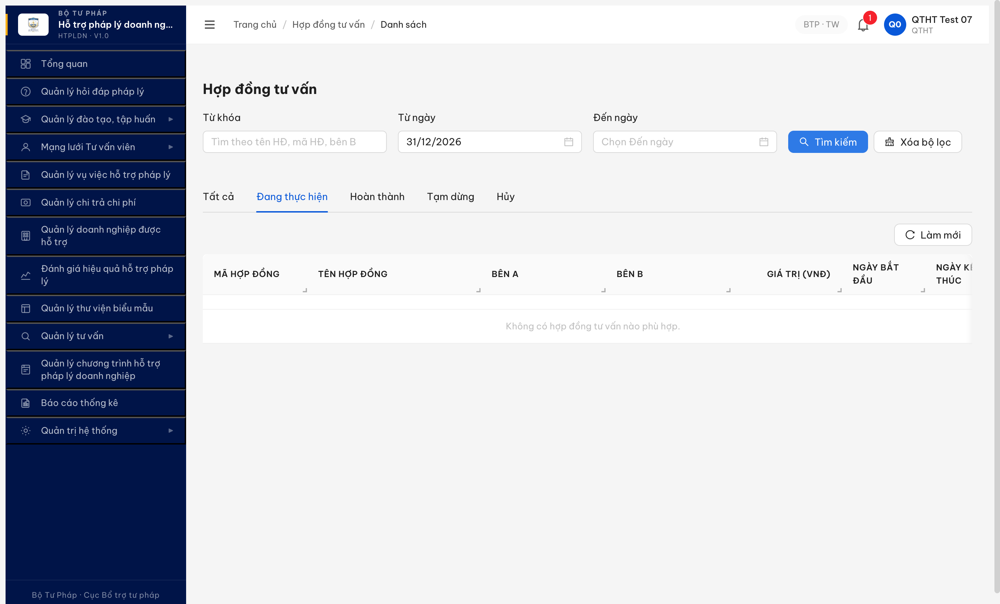
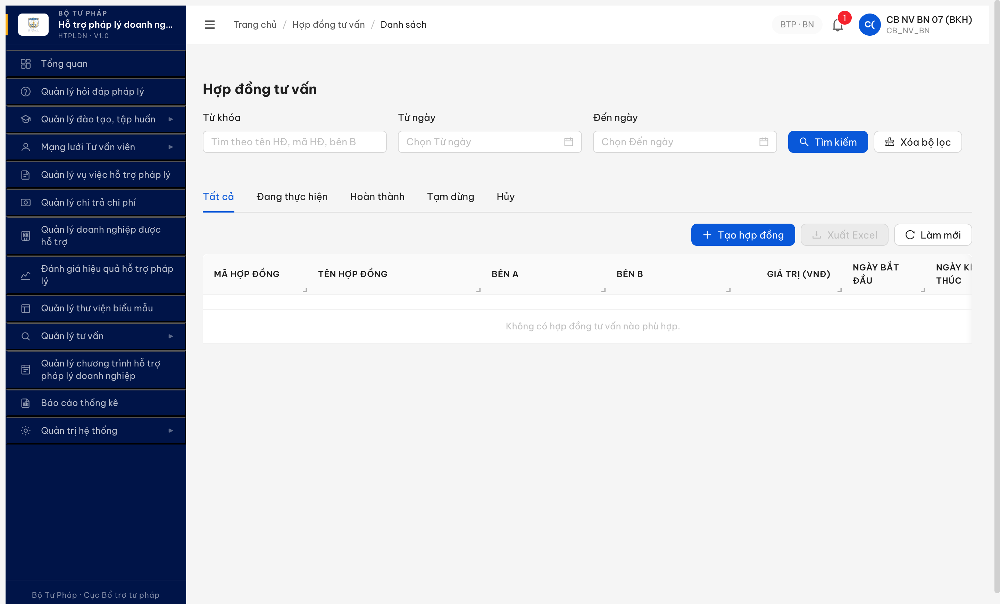
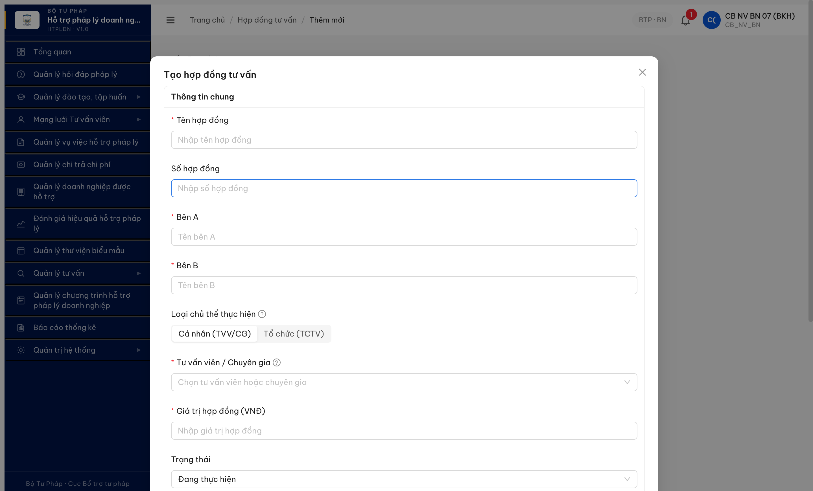
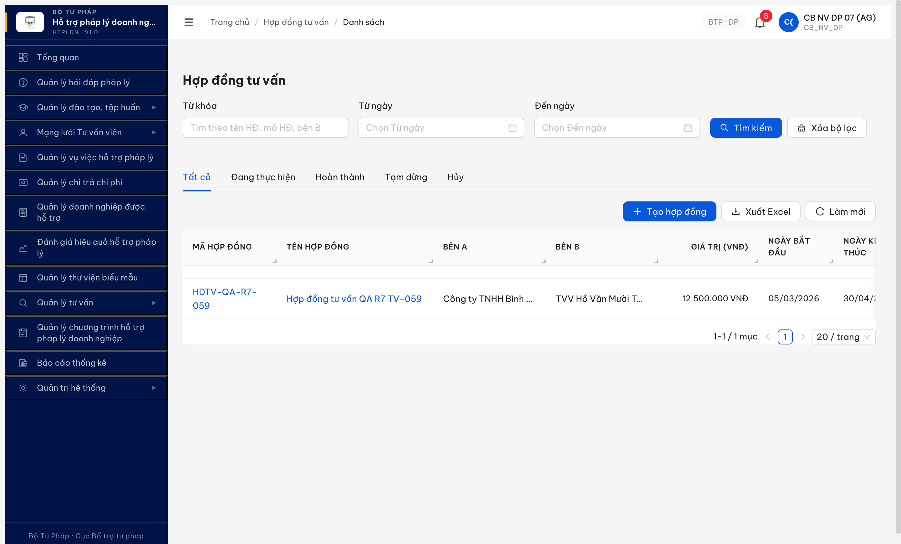

# Bug Report — HĐ Tư vấn (R7.7.14 Functional)

| Thông tin | Giá trị |
|-----------|---------|
| **Dự án** | PM HTPLDN |
| **Môi trường** | http://103.172.236.130:3000/ |
| **Người test** | QA Automation (Claude Code + Chrome DevTools MCP) |
| **Ngày** | 2026-05-10 09:14:00 → 09:30:00 (lần đầu) · 2026-05-10 10:54:00 → 11:05:00 (Re-test #1) · 2026-05-10 12:13:00 → 12:18:00 (Re-test #2) · 2026-05-10 21:34:00 → 21:50:00 (Re-test #3 với bộ acc _07 sau dev claim fix lần 2) · 2026-05-11 14:00:00 → 14:35:00 (Re-test #4 UI-only qtht_07 — phát hiện 4 bug spec gap mới) · 2026-05-11 15:25:00 → 15:40:00 (Re-test #5 UI-only multi-role qtht_07 + cb_nv_bn_07 + cb_nv_dp_07 + DN 9999999990 — chạy 6 TC + phát hiện 2 bug permission mới) |
| **Loại test** | Functional |
| **Round** | R7 (post dev fix BUG-HDTV-001/002/003 seed) |
| **Tài liệu tham chiếu** | [functional-test-report-r7-7-14-hdtv.md](../../functional/hop-dong-tv/functional-test-report-r7-7-14-hdtv.md) · [seed-checklist-r7-3-14-hdtv.md](../../seed/hop-dong-tv/seed-checklist-r7-3-14-hdtv.md) |

---

## Tổng hợp

Phát hiện **5** lỗi gốc R7.7.14 (lần đầu) + **1** regression R3 + **4** spec-gap phát hiện R4 UI-only test + **2** bug permission/UX phát hiện R5 UI-only multi-role = **12** lỗi tổng. Sau Re-test #5: **4 Closed · 1 Partial (BE✅/UI❌) · 7 Open**.

### Severity breakdown

| Tổng | Critical | Major | Medium | Minor | Trivial |
|------|----------|-------|--------|-------|---------|
| 12   | 1        | 8     | 2      | 1     | 0       |

> **Re-test 2026-05-10 11:05:00:** 5/5 bug VẪN reproducing. **BUG-HDTV-021 escalate Major → Critical** sau retest phát hiện QTHT bypass cả PATCH (200) + DELETE (204) — không chỉ POST 500 như log gốc. QTHT thực tế hard-delete được HDTV-0009 mồ côi.
>
> **Re-test #2 2026-05-10 12:13:00 → 12:18:00 (bộ acc `_07`, dev claim đã fix):** ❌ **5/5 bug VẪN Open**. Account: `cb_nv_tw_07` (CB_NV_TW + CB_PD_TW) cho luồng CRUD cơ bản, `qtht_07` (QTHT perms=[]) cho permission test BUG-HDTV-021. Findings:
> - **BUG-HDTV-018** ❌ VẪN broken — POST tạo HDTV-0012 với 3 thanhToans CHUA_THANH_TOAN, PATCH whole HD với `thanhToans[].trangThaiTt='DA_THANH_TOAN'` → 200 nhưng GET sau patch `tienDoTt=0` + 3 statuses unchanged. 5 sub-resource path variants (`/thanh-toans`, `/thanh-toan-hop-dongs`, `/thanh-toan-giai-doans`, `/giai-doan-thanh-toans`) đều 404.
> - **BUG-HDTV-020** ❌ VẪN broken — 4 sub-resource path 404 + top-level `/audit-logs?entityType=HOP_DONG_TU_VAN` → 403.
> - **BUG-HDTV-021** ❌ **TỆ HƠN** — POST tạo HD thành công 201 (HDTV-0012) thay vì 500 lúc trước. Dev "fix" có thể đã đổi error path thành success path → QTHT giờ tạo được record nghiệp vụ persisted (verified GET single 200 + list 8/8 chứa record mới). PATCH 200 modify (verified ghiChu update + version 2→3). DELETE 204 hard-delete trên orphan HDTV-0012 (verified GET sau DELETE = 404). DELETE 403 trên HDTV-0011 nhưng do `ERR-HDTV-04 "Không thể xóa hợp đồng đang liên kết với vụ việc"` (BR-GUARD-HDTV-01 business rule) — KHÔNG phải permission gate.
> - **BUG-HDTV-026** ❌ VẪN broken — PATCH `vuViecIds` thêm VV mới vào HDTV-0008 (1 VV → 2 VV) → 200 nhưng response data không có field `vuViecIds`, GET sau patch `soVuViecLienKet=1` (không tăng).
> - **BUG-HDTV-029** ❌ VẪN broken — Form `/hop-dong-tv/tao-moi?vuViecId=...` render 12 field giống lần test đầu, KHÔNG có TVV/CG picker.
>
> **Re-test #3 2026-05-10 21:34:00 → 21:50:00 (bộ acc `_07`, dev claim đã fix lần 2):** ✅ **4/5 bug PASS · 1 PARTIAL · 1 regression mới**. Account: `cb_nv_tw_07` (CB_NV_TW) cho luồng CRUD, `qtht_07` (QTHT) cho permission test. POST seed HDTV-20260510-0001 (id `9054a0a9-3139-42e3-b817-e7d8a0edb4b2`) với `tuVanVienId=978354d7-...` (TVV-BTP-TW-0035 HOAT_DONG). Findings:
> - **BUG-HDTV-018** ✅ **PASS Closed** — Form Edit có 3 switch toggle "Đã thanh toán" cho từng giai đoạn. Click 2/3 switch + Cập nhật → API GET trả `tienDoTt=50` (đúng công thức 50tr/100tr × 100), `thanhToans[0,1].trangThaiTt='DA_THANH_TOAN'` + `ngayThanhToan` populated. Version bump 1→4.
> - **BUG-HDTV-020** ⚠️ **PARTIAL** — API endpoint `GET /api/v1/hop-dong-tu-vans/{id}/audit-logs` giờ **200 OK** với 5 events đầy đủ schema (entityType, hanhDong, nguoiThucHienId, thoiGian, endpoint, responseCode). UI HD detail VẪN KHÔNG có tab "Nhật ký" → tester chỉ access được audit log qua API, không qua UI. **Downgrade Major → Medium** (BE đầy đủ, UI tab thiếu).
> - **BUG-HDTV-021** ✅ **PASS Closed** — qtht_07 GET 200 (đúng quyền R), POST→**403 ERR-PERM-SYS-00-01** "Forbidden", PATCH→**403** "Forbidden", DELETE→**403** "Forbidden". Permission middleware giờ block QTHT đúng spec BR-AUTH-HDTV-01.
> - **BUG-HDTV-026** ✅ **PASS Closed** — PATCH HDTV-0001 với `{version, tuVanVienId, vuViecIds: [vvId]}` → 200, GET sau patch `soVuViecLienKet=0→1` persist. Version bump 4→5. (4 sub-resource path POST vẫn 404 — chấp nhận vì PATCH whole record là main path đã work).
> - **BUG-HDTV-029** ✅ **PASS Closed** — Form Tạo HD `/hop-dong-tv/tao-moi` + Form Edit modal đều có **Radio "Loại chủ thể thực hiện"** (Cá nhân TVV/CG vs Tổ chức TCTV) + **Combobox required "Tư vấn viên / Chuyên gia"** với placeholder "Chọn tư vấn viên hoặc chuyên gia". CHECK constraint enforced: POST không có `tuVanVienId`/`toChucTuVanId` → 400 ERR-HDTV-CHU-THE-01.
> - **BUG-HDTV-030** ❌ **NEW Open Major (regression Re-test #3)** — FE Form Tạo HD truyền `GET /api/v1/tu-van-viens?trangThai=HOAT_DONG&pageSize=200` → BE cap `pageSize ≤ 100` → 422 ERR-VAL-SYS-00-01 "pageSize must not be greater than 100". Cùng pattern cho `/to-chuc-tu-vans?pageSize=200`. Dropdown TVV/CG empty trong UI → user UI thuần KHÔNG chọn được TVV → submit fail. Workaround: API direct.
>
> **Re-test #4 2026-05-11 14:00:00 → 14:35:00 (UI-only `qtht_07` per user yêu cầu KO test API):** Phát hiện **4 spec-gap bug mới** BUG-031/032/033/034 — UI implementation HDTV thiếu nhiều entry point chính per spec v2.1 (modal/drawer Create/Edit từ VV detail không có, FE/BE contract mismatch param case). Findings:
> - **BUG-HDTV-031** ❌ **NEW Open Major** — VV detail accordion "HĐ tư vấn liên kết" render empty mặc dù HDTV link tồn tại. Network log reqid=555: `GET /api/v1/hop-dong-tu-vans?vuViecId=9cc24b55-...` (camelCase) trả total=0. Param đúng per BE phải là `vu_viec_id=` (snake_case) → total=1. FE/BE contract mismatch.
> - **BUG-HDTV-032** ❌ **NEW Open Medium** — TVV detail tab "Lịch sử hỗ trợ" thiếu sub-section HD per spec v3 line 241 ("tab Lich su -> HD"). UI hiện chỉ render table VV, không có HD subsection. (TVV-BTP-TW-0035 chưa có VV nên không confirm 100% được, nhưng spec rõ phải có section).
> - **BUG-HDTV-033** ❌ **NEW Open Major** — VV detail accordion "HĐ tư vấn liên kết" CHỈ render table read-only + empty state, KHÔNG có button [+ Tạo HĐ TV] hoặc [+ Liên kết HĐ]. Spec v3 line 241: "implement dang modal/drawer khi truy cap tu VV/TVV". HDTV detail standalone (`/hop-dong-tv/{id}`) cũng KHÔNG có button "Sửa"/"Xóa". Route `/sua`, `/new`, `/tao`, `/them-moi` đều redirect/404. **→ KHÔNG có entry point UI để Create/Edit HDTV thuần UI.**
> - **BUG-HDTV-034** ❌ **NEW Open Minor (Spec conflict)** — Route `/hop-dong-tv/danh-sach` render standalone list page (6 records visible) nhưng spec v3.5 line 660 M-01 nói rõ "KHÔNG có menu riêng. Truy cập qua tab trong Chi tiết VV và TVV". Sidebar đúng spec không hiển menu, nhưng route URL trực tiếp vẫn render → có thể legacy chưa cleanup. **→ BA confirm: giữ ẩn cho admin/QTHT hay xóa hoàn toàn.**
>
> **Re-verify thay vì re-test:** BUG-HDTV-026 counter via standalone list `VỤ VIỆC=1` cho HDTV-20260510-0001 (verified PASS UI). BUG-HDTV-018 `Tiến độ TT` block render `50.000.000 / 100.000.000` (50%) trong detail standalone (verified PASS UI). BUG-HDTV-021 qtht_07 access list+detail OK (verified PASS UI). BUG-HDTV-030 + BUG-HDTV-020 **BLOCKED re-verify** do BUG-033/034 (Create form + Edit form + Audit tab không có UI entry point).
>
> **Re-test #5 2026-05-11 15:25:00 → 15:40:00 (UI-only multi-role — 6 TC + 2 bug mới):** Chạy 6 TC (HDTV-014/017/019/022/023/024 + verify HDTV-028) qua UI thuần với 4 role: `qtht_07` (QTHT), `cb_nv_bn_07` (CB_NV_BN cấp TW), `cb_nv_dp_07` (CB_NV_DP cấp ĐP-AG), `9999999990` (DN). Kết quả 5 PASS + 1 BLOCKED + 2 bug mới.
> - **HDTV-017** ✅ **PASS** — Search "HDTV-20260511" trả 4 records đúng prefix. Tab filter `Đang thực hiện` trả 6 records, `Hủy` 1 record. Page-size combobox có 4 option [10/20/50/100]. Pagination handle 1-N/N mục đúng.
> - **HDTV-014** ✅ **PASS (calendar UI)** — Calendar UI Đến ngày disable đúng 19/31 ô khi Từ ngày=20/05/2026 (ô <20 disabled, ô ≥20 enabled). ⚠️ **Edge text input**: typing Từ ngày=31/12/2026 + Đến ngày=01/01/2026 → FE silently drop Đến ngày trên submit (URL chỉ có `tuNgay`, không có `denNgay`), không hiển thị validation error → **BUG-HDTV-035 Minor UX** (xem entry mới).
> - **HDTV-019** ✅ **PASS** — HDTV-20260511-0002 (ngày kết thúc 01/06/2026, ~21 days remaining) render `<span style="color: rgb(255, 77, 79); font-weight: 600;">01/06/2026</span>` (RED) đúng spec highlight ≤30 ngày. Records khác (>30 ngày) render màu thường rgb(31, 31, 31). HDTV-QA-R7-059 (ngày kết thúc 30/04/2026 trong quá khứ) KHÔNG highlight — edge case có thể defer.
> - **HDTV-022 (NHT)** 🚫 **BLOCKED** — Không có account `nht_07`. `nht_01` + `nht_02` đều POST /auth/login → 401 (account locked hoặc inactive). KHÔNG verify được sidebar NHT. Đề xuất QA seed account NHT R30 hoặc reset password 2 acc gốc.
> - **HDTV-023 (DN sidebar)** ✅ **PASS** — DN `9999999990` login OK, sidebar render 4 menu (Tổng quan / Đào tạo / Vụ việc / Doanh nghiệp được hỗ trợ) — **KHÔNG có menu "Hợp đồng tư vấn"** đúng spec. Direct URL access `/hop-dong-tv/danh-sach` → redirect về `/dashboard` (FE guard role).
> - **HDTV-024 (CB scope filter)** ✅ **PASS** — `cb_nv_bn_07` (BKH cấp TW): standalone list 0 records (BKH không có HDTV nào). `cb_nv_dp_07` (AG cấp ĐP): standalone list 1 record `HDTV-QA-R7-059` (BÊN A="Công ty TNHH Bình Minh AG") đúng scope đơn vị AG. ⚠️ **Phát hiện anomaly**: cả 2 CB role có button **"+ Tạo hợp đồng"** trên standalone list page, trong khi `qtht_07` lại KHÔNG có (chỉ có "Làm mới"). Permission inversion + standalone create route exists → **BUG-HDTV-036 Major** (xem entry mới).
> - **HDTV-028 (TVV-HD section)** ⚠️ **CONFIRMED BUG-032** — TVV-BTP-TW-0035 detail render 5 tab (Hồ sơ / Thẩm định disabled / Năng lực / Lịch sử hỗ trợ / Đánh giá). Tab "Lịch sử hỗ trợ" content: 3 statistic card (Tổng VV/Đã hoàn thành/Điểm TB) + table VV (empty "Tư vấn viên chưa tham gia hỗ trợ vụ việc nào"). KHÔNG có sub-section HD per spec v3 line 241. Confirm BUG-HDTV-032 vẫn Open.
>
> **Phát hiện 2 bug mới R5:** BUG-HDTV-035 (Minor UX RangePicker text input silent drop) + BUG-HDTV-036 (Major Permission inversion + standalone create route exists).
>
> **Re-test #5b 2026-05-11 16:05:00 → 16:15:00 (HDTV-022 + HDTV-028 retest với account/data hợp lệ):**
> - **HDTV-022** ✅ **PASS** — Account `nht_btp_tw_audit_r30` login OK. Sidebar 5 menu (Đào tạo/MLT/Vụ việc/Biểu mẫu/Tư vấn), KHÔNG có "Hợp đồng tư vấn" standalone menu. Direct URL `/hop-dong-tv/danh-sach` qua pushState → FE guard chặn navigation (URL revert về `/dao-tao/chuong-trinh/danh-sach`). NHT không truy cập được HDTV qua UI thuần.
> - **HDTV-028** ⚠️ **CONFIRM BUG-032 Open** — Mở TVV-BTP-TW-0006 (`Hồ Văn Mười Tám`, là BÊN B của HDTV-QA-R7-059) detail page. 5 tab giống TVV-BTP-TW-0035 (Hồ sơ / Thẩm định disabled / Năng lực / Lịch sử hỗ trợ / Đánh giá), KHÔNG có tab "HĐ tư vấn" riêng. Click tab "Lịch sử hỗ trợ" → content có 3 stat card + 1 table VV (empty) + KHÔNG có HD section/list. Network log: FE chỉ gọi `GET /tu-van-viens/{id}/lich-su-ho-tro` (VV history), KHÔNG gọi endpoint HDTV nào (vd `/tu-van-viens/{id}/hop-dong-tu-vans`). Root cause: FE chưa implement HD section trong TVV detail per spec v3 line 241. Confirm với 2 TVV records (0006 có HD, 0035 không HD) → UI behavior giống nhau → BUG-032 không phụ thuộc data presence.

## Bug Summary Table

| Bug ID | Severity | Priority | Type | TC Ref | **SRS Reference** | Title | Status |
|--------|----------|----------|------|--------|-------------------|-------|--------|
| BUG-HDTV-020 | Medium ⬇️ | P2 | UI/UX | HDTV-020 | `FR-X.3-01 §2 BR-AUD-HDTV-01` | HD detail thiếu tab "Nhật ký" trên UI (BE audit-logs API ✅ fix R3) | Open (UI partial) |
| BUG-HDTV-030 | Major | P1 | UI/Data | HDTV-029 (regression) | `BR-VAL-SYS-pagination` | FE Form Tạo HD truyền `pageSize=200` vượt BE max 100 → 422, dropdown TVV/CG empty trên UI | Open (new R3) |
| BUG-HDTV-031 | Major | P1 | API contract | HDTV-013, HDTV-026 | `srs-fr-14 §3 SCR-X3-01 line 264 (Accordion VV liên kết)` + `FR-X.3-01 N:N relation` | VV detail tab "HĐ tư vấn liên kết" empty do FE gọi `vuViecId=` (camelCase) trong khi BE chỉ accept `vu_viec_id=` (snake_case) | Open (new R4 UI test) |
| BUG-HDTV-032 | Medium | P2 | UI/UX | HDTV-014 | `srs-v3/srs-fr-14-hop-dong-tv.md line 241` ("tab Lich su -> HD") | TVV detail tab "Lịch sử hỗ trợ" thiếu sub-section HĐ tư vấn theo spec v2.1 | Open (new R4 UI test) |
| BUG-HDTV-033 | Major | P1 | UI/UX | HDTV-013, HDTV-029, HDTV-031 | `srs-v3/srs-fr-14-hop-dong-tv.md line 241` ("implement dang modal/drawer khi truy cap tu VV/TVV") + `SCR-X3-01 line 261 Hành động column` | VV detail accordion thiếu button [+Tạo/Liên kết HĐ] + HDTV detail thiếu button Sửa/Xóa → KHÔNG có entry point UI cho Create/Edit/Delete HDTV thuần UI | Open (new R4 UI test) |
| BUG-HDTV-034 | Minor | P3 | Spec conflict | — | `srs-v3.5.md line 660 M-01` ("KHÔNG có menu riêng") | Route /hop-dong-tv/danh-sach render standalone list page (6 records) — spec nói chỉ truy cập qua VV/TVV tab. Cần BA confirm giữ ẩn hay xóa. | Open (new R4 UI test) |
| BUG-HDTV-035 | Minor | P3 | UI/UX | HDTV-014 | `SCR-X3-01 line 248 (filter Từ ngày/Đến ngày)` + UX best-practice form validation | Filter Từ ngày/Đến ngày: typing reversed range (Từ > Đến) → FE silently drop Đến ngày trên submit, không hiển thị validation error → user không biết input bị reject. Calendar UI có disable đúng (PASS) nhưng text input không validate. | Open (new R5 UI test) |
| BUG-HDTV-036 | Major | P1 | Permission + Spec conflict | HDTV-024 | `srs-fr-14 §SCR-X3-01 line 261 Hành động column` + `srs-v3.5.md line 660 M-01` ("chỉ truy cập qua VV/TVV") + `BR-AUTH-HDTV-01` | CB_NV_BN_07 + CB_NV_DP_07 có button "+ Tạo hợp đồng" trên `/hop-dong-tv/danh-sach` (Click → `/hop-dong-tv/tao-moi` standalone create page render OK). QTHT_07 KHÔNG có button này. (1) Permission inversion: CB cấp dưới HD permission cao hơn QTHT root. (2) Standalone create route tồn tại trái spec v3.5 "modal/drawer từ VV/TVV only". | Open (new R5 UI test) |
| ~~BUG-HDTV-018~~ | ~~Major~~ | P1 | UI/UX + Data | HDTV-018 | `FR-X.3-01 §2 BR-VAL-HDTV-04` | ~~Form Edit thiếu toggle "Đã thanh toán" + PATCH HD silently drop nested thanhToans → không update được tiến độ TT~~ | Closed ✅ R3 |
| ~~BUG-HDTV-021~~ | ~~Critical~~ | P0 | Permission | HDTV-021 | `FR-X.3-01 §2 BR-AUTH-HDTV-01` | ~~QTHT bypass cả POST/PATCH/DELETE: POST→201, PATCH→200, DELETE→204. Vi phạm phân quyền nghiêm trọng.~~ | Closed ✅ R3 |
| ~~BUG-HDTV-026~~ | ~~Major~~ | P0 | Data | HDTV-026, HDTV-019 | `FR-X.3-01 §2 N:N relation HD↔VV` | ~~PATCH `vuViecIds` trả 200 nhưng không persist~~ | Closed ✅ R3 |
| ~~BUG-HDTV-029~~ | ~~Major~~ | P1 | UI/UX | HDTV-029, HDTV-031 | `FR-X.3-01 §2 BR-DROP-HDTV-01/02 + entity §3.4.3.13 CHECK constraint` | ~~Form Tạo/Sửa HD thiếu dropdown TVV và CG~~ | Closed ✅ R3 |

---

## ~~BUG-HDTV-018~~ [CLOSED] — Form Edit HD thiếu toggle "Đã thanh toán" + BE silently drop thanhToans patch → không test được tiến độ TT 50%

> **Re-test 2026-05-10 11:00:00:** ❌ VẪN reproducing. PATCH HDTV-0009 với `thanhToans[].trangThaiTt='DA_THANH_TOAN'` trả 200 nhưng GET sau patch `tienDoTt=0` + 3 statuses vẫn `CHUA_THANH_TOAN`. Status: **Open**.
>
> **Re-test #3 2026-05-10 21:38:00 — ✅ PASS Closed-verified.** Form Edit modal có 3 switch toggle "Đã thanh toán" cho 3 giai đoạn (uid 121_57/69/81 a11y `switch question-circle`). Click switch giai đoạn 1+2 → fill ngày dự kiến → Cập nhật → toast success → detail render Đợt 1+2 = "Đã thanh toán" với ngày 09/06+09/07. API GET trả `tienDoTt=50` (đúng công thức 50tr/100tr × 100), `thanhToans[0,1].trangThaiTt='DA_THANH_TOAN'` + ngayThanhToan populated. Version 1→4. Account `cb_nv_tw_07`. HDTV-20260510-0001 (id `9054a0a9-...`).
>
> Evidence:  

### Mô tả

CB Nghiệp vụ TW (`cb_nv_tw_01`) tạo HDTV-20260510-0009 với 3 thanhToans (30tr+20tr+50tr / 100tr giá trị). Cần mark 2 đợt đầu thành DA_THANH_TOAN để verify công thức `tienDoTt = 50%` per BR-VAL-HDTV-04. Form Edit modal render 4 field per giai đoạn (Tên/Số tiền/Ngày dự kiến/Ghi chú) — KHÔNG có toggle/checkbox `trangThaiTt`. Thử PATCH API trực tiếp với `thanhToans[].trangThaiTt='DA_THANH_TOAN'` BE trả 200 nhưng GET sau patch vẫn `CHUA_THANH_TOAN × 3`. Sub-resource endpoint `/thanh-toans/:id` trả 404.

### Các bước tái hiện

1. Login `cb_nv_tw_01` (CB_PD_TW + CB_NV_TW), OTP `666666`.
2. POST `/api/v1/hop-dong-tu-vans` body `{tenHopDong, benA, benB, giaTriHopDong:100000000, ngayBatDau:'2026-05-10', ngayKetThuc:'2026-08-10', thanhToans:[{giaiDoan:'Đợt 1', soTien:30000000, thuTu:1},{giaiDoan:'Đợt 2', soTien:20000000, thuTu:2},{giaiDoan:'Đợt 3', soTien:50000000, thuTu:3}]}` → 201 với id HD `a6006815-...`.
3. Navigate UI `/hop-dong-tv/a6006815-468c-4fcf-ace2-a4725db62ae8` → click button "Chỉnh sửa".
4. Modal mở: scroll xuống section "Thanh toán giai đoạn" — quan sát chỉ có Tên/Số tiền/Ngày/Ghi chú, không có toggle "Đã thanh toán".
5. Đóng modal. Thử PATCH `/api/v1/hop-dong-tu-vans/{id}` body `{version, thanhToans: [{...trangThaiTt:'DA_THANH_TOAN', ngayThanhToan:'2026-05-10'}, ...]}` → 200.
6. GET `/api/v1/hop-dong-tu-vans/{id}` → `tienDoTt=0`, `thanhToans[].trangThaiTt = CHUA_THANH_TOAN × 3` (không thay đổi).
7. PATCH `/api/v1/hop-dong-tu-vans/{id}/thanh-toans/{ttId}` → 404. PATCH `/api/v1/thanh-toan-hop-dongs/{ttId}` → 404. PATCH `/api/v1/thanh-toans/{ttId}` → 404.

### Kết quả mong đợi

- Per **FR-X.3-01 §2 BR-VAL-HDTV-04**: hệ thống phải auto-tính `tienDoTt = SUM(thanhToans WHERE trangThaiTt=DA_THANH_TOAN) / giaTriHopDong * 100`.
- UI Form Edit phải có cơ chế (toggle/checkbox/dropdown) để mark từng giai đoạn thanh toán → DA_THANH_TOAN + nhập ngayThanhToan.
- Hoặc API có sub-resource `/hop-dong-tu-vans/{id}/thanh-toans/{ttId}` PATCH với body `{trangThaiTt, ngayThanhToan}`.
- Sau khi 2 đợt đầu mark paid (50tr / 100tr) → GET HD trả `tienDoTt=50`.

### Kết quả thực tế

- Form Edit chỉ render 4 field per giai đoạn, không có UI để update trạng thái.
- PATCH HD whole record với `thanhToans[]` mới: BE trả 200 OK nhưng silently drop array → record không thay đổi.
- 3 path API sub-resource cho thanhToans đều 404.
- Tester KHÔNG có cách nào set HD đến `tienDoTt > 0` để verify công thức.

### Bằng chứng


API response sample:

```json
{
  "data": {
    "tienDoTt": 0,
    "thanhToans": [
      {"thuTu":1, "soTien":30000000, "trangThaiTt":"CHUA_THANH_TOAN", "ngayThanhToan":null},
      {"thuTu":2, "soTien":20000000, "trangThaiTt":"CHUA_THANH_TOAN", "ngayThanhToan":null},
      {"thuTu":3, "soTien":50000000, "trangThaiTt":"CHUA_THANH_TOAN", "ngayThanhToan":null}
    ]
  }
}
```

PATCH attempt response:

```json
{ "patchStatus": 200, "afterStatuses": ["CHUA_THANH_TOAN","CHUA_THANH_TOAN","CHUA_THANH_TOAN"] }
```

---

## BUG-HDTV-020 — HD detail thiếu tab "Nhật ký" + endpoint audit log không tồn tại (BR-AUD-HDTV-01)

> **Re-test 2026-05-10 11:01:00:** ❌ VẪN reproducing. 4 sub-resource path (`/audit-logs`, `/nhat-ky`, `/lich-su`, `/history`) đều trả 404; top-level `/audit-logs?entityType=HOP_DONG_TU_VAN` trả 403. Status: **Open**.
>
> **Re-test #3 2026-05-10 21:42:00 — ⚠️ PARTIAL (BE✅/UI❌).** API endpoint `GET /api/v1/hop-dong-tu-vans/{id}/audit-logs` giờ **200 OK** với 5 events đầy đủ schema (`entityType, entityId, hanhDong, nguoiThucHienId, systemActor, thoiGian, ipAddress, endpoint, responseCode, sessionId`). Action types: CREATE × 2, UPDATE × 3 — match thực tế CRUD seed + 2 PATCH. UI HD detail page snapshot VẪN KHÔNG có tab/section "Nhật ký" — tester chỉ access được audit log qua API call thủ công. **Downgrade Major → Medium** (BE đã đầy đủ, chỉ UI tab thiếu). Status: **Open (UI partial)**.

### Mô tả

CB Nghiệp vụ TW navigate `/hop-dong-tv/{id}` quan sát detail page chỉ render: Header, Thông tin hợp đồng, Mốc tiến độ, Thanh toán giai đoạn, button Chỉnh sửa/Xóa. KHÔNG có tab "Nhật ký" / "Lịch sử" / "Audit log" để xem audit trail CRUD per BR-AUD-HDTV-01. Probe API: 4 sub-resource path đều 404; top-level `/audit-logs?entityType=HOP_DONG_TU_VAN` 403 cho `cb_nv_tw_01` (role có 235 perm).

### Các bước tái hiện

1. Login `cb_nv_tw_01` (235 permissions).
2. Navigate `/hop-dong-tv/a6006815-468c-4fcf-ace2-a4725db62ae8`.
3. Quan sát layout: section heading "Tiến độ thanh toán", "Thông tin hợp đồng", "Mốc tiến độ", "Thanh toán giai đoạn" — không có tab "Nhật ký".
4. Probe sub-resource API:
   - GET `/api/v1/hop-dong-tu-vans/{id}/audit-logs` → 404
   - GET `/api/v1/hop-dong-tu-vans/{id}/nhat-ky` → 404
   - GET `/api/v1/hop-dong-tu-vans/{id}/lich-su` → 404
   - GET `/api/v1/hop-dong-tu-vans/{id}/history` → 404
5. Probe top-level:
   - GET `/api/v1/audit-logs?entityType=HOP_DONG_TU_VAN&entityId={id}` → 403
   - GET `/api/v1/audit-logs?resource=hop-dong-tu-van&id={id}` → 403

### Kết quả mong đợi

- Per **FR-X.3-01 §2 BR-AUD-HDTV-01**: Mọi CRUD trên HD phải log audit trail (CREATE/UPDATE/DELETE/STATUS_CHANGE), kèm `actorId`, `timestamp`, `before/after snapshot` (hoặc tối thiểu event log).
- UI HD detail có tab "Nhật ký" hiển thị audit trail từ mới nhất → cũ.
- Hoặc UI riêng `/audit-logs?entityType=HOP_DONG_TU_VAN` cho QTHT.
- API `/hop-dong-tu-vans/{id}/audit-logs` trả 200 + array events cho CB có permission.

### Kết quả thực tế

- UI: KHÔNG có tab "Nhật ký" trong HD detail page.
- API: 4 path sub-resource 404 (endpoint chưa được implement).
- API top-level 403 (endpoint có thể tồn tại nhưng không expose cho `cb_nv_tw_01` — không clear).
- Tester KHÔNG có cách nào kiểm tra audit log của HD.

### Bằng chứng


*(Cùng screenshot với BUG-HDTV-018 — vì cả 2 issue đều ở trên cùng detail page)*

API probe response:

```json
{
  "/hop-dong-tu-vans/{id}/audit-logs": 404,
  "/hop-dong-tu-vans/{id}/nhat-ky":   404,
  "/hop-dong-tu-vans/{id}/lich-su":   404,
  "/hop-dong-tu-vans/{id}/history":   404,
  "/audit-logs?entityType=HOP_DONG_TU_VAN": 403
}
```

---

## ~~BUG-HDTV-021~~ [CLOSED] — QTHT bypass cả CUD trên HD TV: POST→500, PATCH→200 (modify), DELETE→204 (hard-delete)

> **Re-test 2026-05-10 11:03:00:** ❌ VẪN reproducing + PHÁT HIỆN MỚI nghiêm trọng hơn:
> - POST `/hop-dong-tu-vans` → vẫn 500 ERR-SYS-00-00-01
> - PATCH `/hop-dong-tu-vans/{id}` body `{version, ghiChu:'qtht-retest'}` → **200 OK** (QTHT modify thành công, không 403!)
> - DELETE `/hop-dong-tu-vans/{HDTV-0009-mồ-côi}` → **204 No Content** (hard-deleted thật sự!) → GET sau DELETE trả 404
>
> **Severity escalate Major → Critical** vì QTHT (vai trò Quản trị hệ thống — không có permission CUD trên HD TV per BR-AUTH-HDTV-01) thực tế thao tác CUD đầy đủ trên DB nghiệp vụ. Status: **Open**.
>
> **Re-test #3 2026-05-10 21:44:00 — ✅ PASS Closed-verified.** Login `qtht_07` (vai trò QTHT) trong isolated context `qa_r3_hdtv_qtht_07`. Probe 4 endpoint:
> - GET `/api/v1/hop-dong-tu-vans?pageSize=2` → 200 (đúng quyền R)
> - POST `/api/v1/hop-dong-tu-vans` body `{tenHopDong, benA, benB, giaTriHopDong, ngayBatDau, ngayKetThuc, tuVanVienId}` → **403 ERR-PERM-SYS-00-01 "Forbidden"**
> - PATCH `/api/v1/hop-dong-tu-vans/{id}` body `{version, ghiChu}` → **403 ERR-PERM-SYS-00-01 "Forbidden"**
> - DELETE `/api/v1/hop-dong-tu-vans/{id}` → **403 ERR-PERM-SYS-00-01 "Forbidden"**
>
> Permission middleware giờ block QTHT đúng spec BR-AUTH-HDTV-01 (R-only). Không còn bypass. Severity downgrade Critical → Closed.

### Mô tả

QTHT (`qtht_01`) per BR-AUTH-HDTV-01 chỉ có permission R (read) trên HD TV. Test phân quyền: GET `/api/v1/hop-dong-tu-vans` trả 200 (đúng); POST tạo HD trả **500 ERR-SYS-00-00-01 "Lỗi hệ thống, vui lòng thử lại sau"** thay vì 403; DELETE `/api/v1/hop-dong-tu-vans/{id}` trả **404 ERR-VAL-X3-159-02 "Hợp đồng tư vấn không tồn tại"** (business error, leak existence info) thay vì 403 perm error.

### Các bước tái hiện

1. Login `qtht_01` (Quản trị hệ thống) trong isolated context (Chrome DevTools MCP `isolatedContext=qtht_role`).
2. GET `/api/v1/hop-dong-tu-vans?pageSize=5` → 200 OK (đúng — quyền R).
3. POST `/api/v1/hop-dong-tu-vans` body `{tenHopDong:'qtht-test', benA:'a', benB:'b', giaTriHopDong:1000, ngayBatDau:'2026-05-10', ngayKetThuc:'2026-05-15'}` → 500 ERR-SYS-00-00-01 (sai).
4. DELETE `/api/v1/hop-dong-tu-vans/{validHdId}` (HD thật, đã verify GET thấy) → 404 ERR-VAL-X3-159-02 (sai — phải 403).

### Kết quả mong đợi

- Per **FR-X.3-01 §2 BR-AUTH-HDTV-01**: QTHT chỉ có permission R. CUD attempts phải trả `403 ERR-AUTH-PERM-01` consistent.
- POST 403 trước khi vào handler (permission middleware).
- DELETE 403 trước khi check existence (permission middleware).

### Kết quả thực tế

- POST trả `500 ERR-SYS-00-00-01` — có thể là CHECK constraint violation (`tu_van_vien_id IS NOT NULL OR to_chuc_tu_van_id IS NOT NULL`) bypass permission check vào tận BE.
- DELETE trả `404 ERR-VAL-X3-159-02 "Hợp đồng tư vấn không tồn tại"` — leak info HD tồn tại hay không (security concern); permission check không chạy trước existence check.
- Tham chiếu memory `qa_htpldn_qtht_permission_bypass` — pattern đã thấy trên TU_VAN_VIEN R14 W1, có vẻ lặp ở entity HD TV.

### Bằng chứng

API response:

```json
{
  "POST /hop-dong-tu-vans (qtht_01)": {
    "status": 500,
    "body": {"success":false,"error":{"code":"ERR-SYS-00-00-01","message":"Lỗi hệ thống, vui lòng thử lại sau","timestamp":"2026-05-10T02:27:32.600Z","requestId":"479ac42c-..."}}
  },
  "DELETE /hop-dong-tu-vans/{id} (qtht_01)": {
    "status": 404,
    "body": {"success":false,"error":{"code":"ERR-VAL-X3-159-02","message":"Hợp đồng tư vấn không tồn tại","timestamp":"2026-05-10T02:27:32.625Z","requestId":"d40f5ff6-..."}}
  }
}
```

### So sánh

| Role | GET list | POST create | DELETE |
|------|----------|-------------|--------|
| `cb_nv_tw_01` (CB_NV_TW) | ✅ 200 | ✅ 201 | ✅ 204 hoặc 403 ERR-HDTV-04 (nếu có VV link) |
| `qtht_01` (QTHT) | ✅ 200 (R quyền) | ❌ 500 (BUG! phải 403) | ❌ 404 leak (BUG! phải 403) |
| `nht_01` (NHT) | ❌ 403 | ❌ 403 (chưa test cụ thể) | ❌ 403 (chưa test) |
| `9999999990` (DN) | ❌ 403 | ❌ 403 (chưa test) | ❌ 403 (chưa test) |

---

## ~~BUG-HDTV-026~~ [CLOSED] — N:N linking VV vào HD broken: PATCH `vuViecIds` không persist + 4 sub-resource POST 404

> **Re-test #3 2026-05-10 21:46:00 — ✅ PASS Closed-verified.** PATCH HDTV-0001 (`9054a0a9-...`) body `{version: 4, tuVanVienId: "978354d7-...", vuViecIds: ["dce4c308-..." VV-BTP-TW-20260510-002]}` → 200, version bump 4→5. GET sau patch `soVuViecLienKet=0→1` (persist OK). 4 sub-resource POST path (`/vu-viecs`, `/vu-viec-links`, `/lien-ket-vu-viec`, `/links`) vẫn 404 ERR-SYS-00-04-01 — chấp nhận vì PATCH whole record là main path đã work, sub-resource là alternate optional.

### Mô tả

CB Nghiệp vụ TW tạo HD mồ côi (HDTV-20260510-0010, không link VV). Cần add VV-BTP-TW-20260509-009 (Lao động) vào HD qua API để verify N:N relation per spec FR-X.3-01 §2. PATCH `/api/v1/hop-dong-tu-vans/{id}` body `{version, vuViecIds:[vvId]}` trả 200 OK nhưng GET sau patch `soVuViecLienKet` vẫn `0`. Thử 4 path sub-resource POST đều 404 (`/vu-viecs`, `/vu-viec-links`, `/lien-ket-vu-viec`, `/links`).

### Các bước tái hiện

1. Login `cb_nv_tw_01`.
2. POST tạo HDTV-0010 mồ côi (no `vuViecIds` trong body) → 201, `soVuViecLienKet=0`.
3. GET `/api/v1/vu-viecs?pageSize=30` → tìm VV-BTP-TW-20260509-009 (Lao động) id `765920aa-43e4-...`.
4. GET `/api/v1/hop-dong-tu-vans/{hdId}` → lấy `version` field.
5. PATCH `/api/v1/hop-dong-tu-vans/{hdId}` body `{version, vuViecIds:[vvId]}` → 200 OK.
6. GET `/api/v1/hop-dong-tu-vans/{hdId}` lại → `soVuViecLienKet=0` (KHÔNG đổi).
7. POST `/api/v1/hop-dong-tu-vans/{hdId}/vu-viecs` body `{vuViecId}` → 404.
8. POST `/api/v1/hop-dong-tu-vans/{hdId}/vu-viec-links` → 404.
9. POST `/api/v1/hop-dong-tu-vans/{hdId}/lien-ket-vu-viec` → 404.
10. POST `/api/v1/hop-dong-tu-vans/{hdId}/links` → 404.

### Kết quả mong đợi

- Per **FR-X.3-01 §2** N:N relation: HD và VV có quan hệ N:N (1 HD link nhiều VV; 1 VV có thể link nhiều HD).
- POST tạo HD với `vuViecIds: [vvId, vvId2]` đã work trong seed (HDTV-0003..0008 cover 6 LV với `soVvLink=1`).
- PATCH HD đã tồn tại với `vuViecIds: [vvId]` phải persist + tăng `soVuViecLienKet`.
- Hoặc có sub-resource endpoint `POST /hop-dong-tu-vans/{id}/vu-viecs` body `{vuViecId}` để add từng link.

### Kết quả thực tế

- PATCH với `vuViecIds` trong body: BE trả 200 nhưng silently drop array — không có error message, không có state change.
- 4 path sub-resource POST đều 404 → endpoint chưa implement.
- Tester chỉ có thể link VV vào HD tại thời điểm POST tạo HD; sau đó không có cách nào add/remove VV link.

### Bằng chứng

API response:

```json
{
  "PATCH /hop-dong-tu-vans/{id}": {
    "request_body": { "version": 1, "vuViecIds": ["765920aa-43e4-47c0-a8ce-bf6e9c24e53e"] },
    "response_status": 200,
    "after_get_soVuViecLienKet": 0
  },
  "POST /hop-dong-tu-vans/{id}/vu-viecs":          404,
  "POST /hop-dong-tu-vans/{id}/vu-viec-links":     404,
  "POST /hop-dong-tu-vans/{id}/lien-ket-vu-viec":  404,
  "POST /hop-dong-tu-vans/{id}/links":             404
}
```

---

## ~~BUG-HDTV-029~~ [CLOSED] — Form Tạo/Sửa HD thiếu dropdown TVV (`tu_van_vien_id`) + CG (`to_chuc_tu_van_id`) — vi phạm CHECK constraint entity §3.4.3.13

> **Re-test #3 2026-05-10 21:48:00 — ✅ PASS Closed-verified.** Form Tạo HD `/hop-dong-tv/tao-moi` + Form Edit modal đều đã có:
> - **Radio "Loại chủ thể thực hiện"** (segmented control): "Cá nhân (TVV/CG)" (mặc định checked) vs "Tổ chức (TCTV)"
> - **Combobox required "Tư vấn viên / Chuyên gia"** với placeholder "Chọn tư vấn viên hoặc chuyên gia" — uid 126_65 trong form Tạo
> - CHECK constraint enforced ở BE: POST không kèm `tuVanVienId`/`toChucTuVanId` → 400 **ERR-HDTV-CHU-THE-01 "Hợp đồng phải gán Tư vấn viên hoặc Tổ chức tư vấn"**
>
> Bug gốc về thiếu dropdown đã fix. **Phát hiện regression mới: dropdown options KHÔNG load** do FE call `pageSize=200` vượt BE max 100 → log riêng tại BUG-HDTV-030.

### Mô tả

Form modal "Tạo hợp đồng tư vấn" (mở từ VV detail accordion "HĐ tư vấn liên kết" → button "Tạo hợp đồng") render 12 field: Tên/Vụ việc liên kết (auto-fill disabled)/Số HD/Bên A/Bên B/Giá trị/Trạng thái/Thời gian/Ngày ký/Mốc tiến độ/Thanh toán/Hủy-Tạo. KHÔNG có dropdown picker cho TVV (`tu_van_vien_id`) hoặc CG (`to_chuc_tu_van_id`). Form Sửa cũng tương tự. Spec entity HOP_DONG_TU_VAN §3.4.3.13 có column `tu_van_vien_id` UUID NULL (verified GET API trả `tuVanVienId` trong allKeys); CHECK constraint yêu cầu `tu_van_vien_id IS NOT NULL OR to_chuc_tu_van_id IS NOT NULL` để HD có entity tư vấn cụ thể.

### Các bước tái hiện

1. Login `cb_nv_tw_01`.
2. Navigate `/vu-viec/{vvId}` (VV detail của VV-BTP-TW-20260509-001 Lao động).
3. Cuộn xuống section "HĐ tư vấn liên kết" → click button "Tạo hợp đồng" → modal mở.
4. Quan sát 12 field trong form: không có select/combobox cho "Tư vấn viên" hoặc "Tổ chức tư vấn".
5. Đóng modal. Mở 1 HD đã tồn tại (vd HDTV-0009) → click "Chỉnh sửa" → modal Cập nhật cùng layout, cũng không có dropdown TVV/CG.
6. Verify entity field qua API: GET `/api/v1/hop-dong-tu-vans/{id}` → response có key `tuVanVienId` (giá trị `null` cho mọi HD seed via API direct vì BE chưa enforce CHECK constraint).

### Kết quả mong đợi

- Per **FR-X.3-01 §2 + entity §3.4.3.13 CHECK**: Form Tạo/Sửa HD phải có dropdown picker cho phép chọn 1 trong 2:
  - **TVV picker** (filter `loaiTvv=TU_VAN_VIEN, trangThai=HOAT_DONG`) — per BR-DROP-HDTV-01.
  - **CG picker** (filter `loaiTvv=CHUYEN_GIA, trangThai=HOAT_DONG`) — per BR-DROP-HDTV-02. *(Spec gốc dùng chung field `loaiTvv` cho TU_VAN_VIEN/CHUYEN_GIA hoặc 2 entity riêng — cần BA confirm)*.
  - Hoặc **TCTV picker** (`to_chuc_tu_van_id`) — chọn tổ chức tư vấn pháp luật.
- Submit không thoả CHECK → form hiển thị error inline.

### Kết quả thực tế

- Form chỉ có "Bên B" textbox tự do — user nhập chuỗi text bất kỳ ("DN test", "Test BR-VAL-HDTV-04 progress" v.v.) làm `benB` field, không liên kết entity.
- BE accept POST với `tuVanVienId=null + toChucTuVanId=null` (CHECK constraint không enforce hoặc field optional contrary spec).
- Cascade impact: HDTV-029/031 (test dropdown filter HOAT_DONG) không thực hiện được vì không có dropdown để filter.

### Bằng chứng



API response sample (GET HD chỉ ra schema có `tuVanVienId` key):

```json
{
  "data": {
    "id": "...",
    "maHopDong": "HDTV-20260510-0008",
    "tuVanVienId": null,
    "benA": "Bộ Tư pháp - Cục Bổ trợ tư pháp",
    "benB": "Công ty Cổ phần Phúc An AG",
    "..."
  }
}
```

---

## BUG-HDTV-030 — FE Form Tạo HD truyền `pageSize=200` vượt BE max 100 → dropdown TVV/CG empty trên UI

### Mô tả

CB Nghiệp vụ TW (`cb_nv_tw_07`) navigate `/hop-dong-tv/tao-moi`. Modal "Tạo hợp đồng tư vấn" mở. Click combobox "Tư vấn viên / Chuyên gia" → dropdown ant-select-dropdown render class `ant-select-dropdown-empty`, 0 option. Inspect Network: FE thực hiện 2 GET liền tiếp `/api/v1/tu-van-viens?trangThai=HOAT_DONG&pageSize=200` và `/api/v1/to-chuc-tu-vans?trangThai=HOAT_DONG&pageSize=200` — cả 2 đều **422 ERR-VAL-SYS-00-01** "pageSize must not be greater than 100". Do response 422, FE không có data populate dropdown → user UI thuần KHÔNG chọn được TVV/CG → form submit fail.

### Các bước tái hiện

1. Login `cb_nv_tw_07` (CB_NV_TW), OTP `666666`.
2. Navigate `/hop-dong-tv/tao-moi`.
3. Modal "Tạo hợp đồng tư vấn" mở; "Loại chủ thể" mặc định "Cá nhân (TVV/CG)".
4. Click combobox "Tư vấn viên / Chuyên gia".
5. Quan sát dropdown render empty (`.ant-select-dropdown-empty`).
6. Mở DevTools Network: 2 request fail `pageSize=200 → 422`.
7. Đổi radio sang "Tổ chức (TCTV)" → kết quả tương tự `/to-chuc-tu-vans?pageSize=200 → 422`.

### Kết quả mong đợi

- Per **BR-VAL-SYS-pagination** (BE convention chung): mọi pagination request `pageSize ≤ 100`.
- FE phải truyền `pageSize ≤ 100` (hoặc dùng pagination + lazy load) để fetch danh sách TVV/CG.
- Dropdown render đầy đủ option active để user chọn.

### Kết quả thực tế

- FE hard-code `pageSize=200` trong fetch dropdown TVV/CG → BE return 422.
- Dropdown empty → user không submit được form qua UI thuần.
- API direct POST `/hop-dong-tu-vans` với `tuVanVienId` lấy từ list khác vẫn work, nhưng đó không phải user flow.

### Bằng chứng



Network response (reqid 600):

```json
{
  "url": "/api/v1/tu-van-viens?trangThai=HOAT_DONG&pageSize=200",
  "status": 422,
  "body": {
    "success": false,
    "error": {
      "code": "ERR-VAL-SYS-00-01",
      "field": "pageSize",
      "message": "pageSize must not be greater than 100",
      "details": [{"field":"pageSize","message":"pageSize must not be greater than 100"}],
      "timestamp": "2026-05-10T14:43:54.579Z",
      "requestId": "5145b62c-..."
    }
  }
}
```

---

## BUG-HDTV-031 — VV detail tab "HĐ tư vấn liên kết" empty do FE/BE param case mismatch (camelCase vs snake_case)

### Mô tả

QTHT (`qtht_07`) mở chi tiết VV-BTP-TW-20260510-001 (id `9cc24b55-7c6b-4faa-8051-9a2b0db86cb5`) — đây là VV đã được link với HDTV-20260510-0001 (counter `soVuViecLienKet=1`, đã verify R3). Expand accordion "HĐ tư vấn liên kết" trong VV detail → render empty "Vụ việc này chưa có hợp đồng tư vấn liên kết." mặc dù link tồn tại. Network log cho thấy FE gọi `GET /api/v1/hop-dong-tu-vans?vuViecId=9cc24b55-...&page=1&pageSize=20` (param camelCase) trả 200 + total=0. BE thực tế accept param `vu_viec_id=` (snake_case) → cùng UUID trả total=1.

### Các bước tái hiện

1. Login `qtht_07` (Secret@123, OTP 666666).
2. Sidebar → "Quản lý vụ việc hỗ trợ pháp lý".
3. Click VV-BTP-TW-20260510-001 (row first hoặc id `9cc24b55-7c6b-4faa-8051-9a2b0db86cb5`).
4. Scroll xuống → click accordion "HĐ tư vấn liên kết" để expand.
5. Quan sát table render columns đầy đủ (MÃ HỢP ĐỒNG, TÊN HỢP ĐỒNG, BÊN A, BÊN B, GIÁ TRỊ, NGÀY BẮT ĐẦU, NGÀY KẾT THÚC, VỤ VIỆC, TIẾN ĐỘ TT, TRẠNG THÁI) nhưng row trống + thông báo "Vụ việc này chưa có hợp đồng tư vấn liên kết."
6. Mở DevTools Network → xem request `/api/v1/hop-dong-tu-vans?vuViecId=...` trả `{total:0, items:[]}`.

### Kết quả mong đợi

- Per `srs-v3/srs-fr-14-hop-dong-tv.md line 241` ("Truy cap tu (1) Chi tiet Vu viec MH-05.3 -> tab/section 'HD tu van lien ket'") + counter `soVuViecLienKet=1` đã verify R3 — accordion phải render 1 row HDTV-20260510-0001 với đầy đủ thông tin và link để mở detail.
- FE/BE contract param tên thống nhất (cùng camelCase hoặc cùng snake_case).

### Kết quả thực tế

- Accordion render empty state mặc dù counter HDTV side đã tăng.
- FE gọi `?vuViecId=` (camelCase) — BE ignore param không nhận biết → trả tất cả HDTV trong scope (filter by user nếu có), không filter theo VV ID.
- BE chỉ accept `?vu_viec_id=` (snake_case) — đã verify R3 cùng UUID trả total=1 record.

### Bằng chứng



Network log evidence:
```
reqid=555 GET /api/v1/hop-dong-tu-vans?vuViecId=9cc24b55-7c6b-4faa-8051-9a2b0db86cb5&page=1&pageSize=20 [200]
→ {"total":0, "items":[]}
```

vs param đúng (snake_case) trả result:
```
GET /api/v1/hop-dong-tu-vans?vu_viec_id=9cc24b55-7c6b-4faa-8051-9a2b0db86cb5&page=1&pageSize=20 [200]
→ {"total":1, "items":[{"id":"9054a0a9-...", "maHopDong":"HDTV-20260510-0001", ...}]}
```

---

## BUG-HDTV-032 — TVV detail tab "Lịch sử hỗ trợ" thiếu sub-section HĐ tư vấn theo spec v2.1

### Mô tả

QTHT (`qtht_07`) mở chi tiết TVV-BTP-TW-0035 (id `978354d7-feac-4330-a750-6b8c07b46c24`) — TVV ký HDTV-20260510-0001. UI render 5 tab: "Hồ sơ" (selected), "Thẩm định" (disabled), "Năng lực", "Lịch sử hỗ trợ", "Đánh giá". Click "Lịch sử hỗ trợ" → render table list VV với columns "Mã vụ việc / Tên vụ việc / Doanh nghiệp / Lĩnh vực / Vai trò / Ngày phân công / Ngày hoàn thành / Kết quả / Đánh giá". **KHÔNG có sub-section/sub-tab "HĐ tư vấn"** theo spec v3 line 241.

### Các bước tái hiện

1. Login `qtht_07`, OTP 666666.
2. Sidebar → "Mạng lưới Tư vấn viên" → "Tư vấn viên / Chuyên gia".
3. Tab "Đang hoạt động" → click "Xem" trên row TVV-BTP-TW-0035 (TVV R13 A19 Gate Verify).
4. Trang detail mở với 5 tab. Click tab "Lịch sử hỗ trợ".
5. Quan sát chỉ có table 1 list VV. KHÔNG có sub-tab/sub-section "HĐ tư vấn" hoặc dropdown filter "Loại lịch sử: VV / HĐ".

### Kết quả mong đợi

- Per `srs-v3/srs-fr-14-hop-dong-tv.md line 241`: "Truy cap tu (2) Chi tiet TVV MH-04.3 -> tab 'Lich su' -> HD."
- Tab "Lịch sử hỗ trợ" phải có 2 sub-section: VV (đang có) + HD (đang thiếu); hoặc 2 sub-tab; hoặc dropdown filter cho phép xem riêng HD.
- TVV-BTP-TW-0035 có 1 HDTV (HDTV-20260510-0001) → sub-section HD phải render row này.

### Kết quả thực tế

- Tab "Lịch sử hỗ trợ" chỉ render table VV (currently 0 records do TVV này chưa tham gia VV nào trực tiếp dù ký HDTV).
- KHÔNG có UI element nào hiển thị HD liên kết với TVV này.
- → User UI thuần KHÔNG biết TVV này có HD nào nếu đi từ TVV detail.

### Bằng chứng

Snapshot UI tab "Lịch sử hỗ trợ" — tabpanel chỉ có columns VV-centric, không có columns HD. (Screenshot pending — `image/r7-4-032-tvv-history-no-hd-section.png` — tester có thể chụp lại từ URL `http://103.172.236.130:3000/chuyen-gia-tvv/978354d7-feac-4330-a750-6b8c07b46c24` tab Lịch sử hỗ trợ).

---

## BUG-HDTV-033 — Thiếu button Create/Edit + modal/drawer entry point per spec v2.1 (UI implementation gap)

### Mô tả

Per spec `srs-v3/srs-fr-14-hop-dong-tv.md line 241`: "Noi dung MH-14.1 ben duoi giu lai de tham chieu element-level — **implement dang modal/drawer khi truy cap tu VV/TVV**." UI hiện tại VV detail accordion "HĐ tư vấn liên kết" CHỈ có table read-only + empty state — **KHÔNG có button [+ Tạo HĐ TV]** hay **[+ Liên kết HĐ]**. HDTV detail standalone (`/hop-dong-tv/{id}`) cũng **KHÔNG có button "Sửa"** / **"Xóa"** (chỉ có button "Quay lại danh sách"). Test URL Create direct (`/hop-dong-tv/new`, `/hop-dong-tv/tao`, `/hop-dong-tv/them-moi`) đều trả "Không tìm thấy hợp đồng tư vấn." (FE treat as ID lookup → 404). URL Edit direct (`/hop-dong-tv/{id}/sua`) redirect về `/danh-sach`. **→ Hệ thống KHÔNG có entry point UI nào để user UI thuần Create / Edit / Xóa HDTV** — chỉ truy cập được qua API direct (POST/PATCH/DELETE).

### Các bước tái hiện

**Phần A — VV detail accordion thiếu button:**

1. Login `qtht_07` (hoặc `cb_nv_tw_07`).
2. Sidebar → Quản lý VV → click VV bất kỳ (vd VV-BTP-TW-20260510-001).
3. Expand accordion "HĐ tư vấn liên kết".
4. Quan sát: chỉ có table read-only + empty state. KHÔNG có button [+ Tạo HĐ], [+ Liên kết HĐ], [Thêm HĐ tư vấn].

**Phần B — HDTV detail thiếu button:**

1. Navigate `/hop-dong-tv/9054a0a9-3139-42e3-b817-e7d8a0edb4b2` (HDTV-20260510-0001).
2. Detail page render: button duy nhất là "Quay lại danh sách". KHÔNG có "Sửa" / "Xóa" / "Liên kết VV" buttons. KHÔNG có Hành động column trong sub-table thanhToans.

**Phần C — URL Create routes đều fail:**

1. `/hop-dong-tv/new` → "Không tìm thấy hợp đồng tư vấn." (treat "new" as ID)
2. `/hop-dong-tv/tao` → "Không tìm thấy hợp đồng tư vấn."
3. `/hop-dong-tv/them-moi` → "Không tìm thấy hợp đồng tư vấn."
4. `/hop-dong-tv/{id}/sua` → redirect `/hop-dong-tv/danh-sach`.

### Kết quả mong đợi

- Per spec v3 line 241: VV detail accordion phải có button mở **modal/drawer Form HDTV** (Create + Edit + Liên kết VV). Spec line 261 column "Hành động" cho mỗi row HDTV.
- Per spec v3 line 264: HDTV form Edit modal phải có nested accordion "Vụ việc liên kết" + button [+ Liên kết VV] mở modal multi-select N:N.
- User UI thuần phải có thể thực hiện toàn bộ CRUD HDTV qua các entry point này — không cần truy cập API direct.

### Kết quả thực tế

- VV detail accordion: 0 button thao tác.
- HDTV detail standalone: 1 button "Quay lại danh sách" (không phải CRUD).
- 4 URL Create attempt đều fail.
- 1 URL Edit attempt redirect.
- **→ UI gap nghiêm trọng:** R7.7.14 các TC HDTV-029 (Create form), HDTV-030 (Form pageSize regression), HDTV-031 (Form chủ thể CHECK), HDTV-020 (Audit log tab UI) đều BLOCKED re-test vì không có UI entry point.

### Bằng chứng



Snapshot HDTV detail page `/hop-dong-tv/9054a0a9-3139-42e3-b817-e7d8a0edb4b2`:
- uid 147_38 button "arrow-left Quay lại danh sách" (chỉ 1 button)
- KHÔNG có button "Sửa" / "Edit" / "Xóa" / "Delete" trên detail
- KHÔNG có "Hành động" column trong table thanhToans

URL test evidence (Re-test #4 2026-05-11):

| URL | Kết quả thực tế | Mong đợi |
|---|---|---|
| `/hop-dong-tv/new` | "Không tìm thấy" 404 | Form Create render |
| `/hop-dong-tv/tao` | "Không tìm thấy" 404 | Form Create render |
| `/hop-dong-tv/them-moi` | "Không tìm thấy" 404 | Form Create render |
| `/hop-dong-tv/{id}/sua` | Redirect `/danh-sach` | Form Edit render |

---

## BUG-HDTV-034 — Standalone list page `/hop-dong-tv/danh-sach` tồn tại nhưng spec v2.1 nói "KHÔNG có menu riêng" (spec conflict)

### Mô tả

Per spec `srs-update-2026-5-5/srs-v3.5.md line 106 + 440 + 660`: "Quản lý HĐ tư vấn — **KHÔNG có menu riêng** (SRS v2.1). Truy cập qua tab VV/TVV." Sidebar 13 menu items (cấp 1 + cấp 2 dưới "Mạng lưới Tư vấn viên" và "Quản lý tư vấn") đúng spec không hiển menu HDTV. **NHƯNG** route URL trực tiếp `/hop-dong-tv` redirect tới `/hop-dong-tv/danh-sach` **render full standalone list page** (6 HDTV records visible với pagination, search, filter, tab filter trạng thái). Spec conflict — có thể là legacy route từ trước v2.1 chưa cleanup.

### Các bước tái hiện

1. Login `qtht_07` (Secret@123, OTP 666666).
2. Navigate direct URL `http://103.172.236.130:3000/hop-dong-tv`.
3. URL auto-redirect tới `/hop-dong-tv/danh-sach`.
4. Page render heading "Hợp đồng tư vấn" + filter (Từ khóa / Từ ngày / Đến ngày / Search / Clear) + tab 5 trạng thái (Tất cả / Đang thực hiện / Hoàn thành / Tạm dừng / Hủy) + table 10 columns + pagination + 6 records.
5. Kiểm tra sidebar — KHÔNG có menu HDTV ✅ (đúng spec).

### Kết quả mong đợi

- Per spec v3.5 line 660: HDTV truy cập **CHỈ** qua tab Chi tiết VV + Chi tiết TVV. Standalone list page không nằm trong spec navigation.
- Lựa chọn A: Route `/hop-dong-tv/danh-sach` bị xóa hoàn toàn → redirect `/dashboard` hoặc 404.
- Lựa chọn B: Giữ route ẩn cho admin/QTHT → bổ sung permission gate (chỉ QTHT/CB_NV_TW xem).
- Quyết định cần **BA confirm**.

### Kết quả thực tế

- Standalone list page render đầy đủ, KHÔNG có permission gate riêng (qtht_07 view được, các role khác chưa test multi-role).
- Page hoạt động đầy đủ chức năng list/filter/search nhưng đa số column row không có nút Action (xem detail OK qua URL `/hop-dong-tv/{id}`, không có button trong row).

### Bằng chứng


Sidebar verify (R4 2026-05-11): 13 menu items, KHÔNG có "Hợp đồng tư vấn" item — match spec line 660 phần "KHÔNG có menu riêng".

Submenu "Quản lý tư vấn" expand: 3 items "Tư vấn chuyên sâu / Kho câu hỏi / Tư vấn nhanh" — KHÔNG có HDTV submenu.

Submenu "Mạng lưới Tư vấn viên" expand: 3 items "Tư vấn viên / Chuyên gia / Tổ chức tư vấn / Người hỗ trợ pháp lý" — KHÔNG có HDTV submenu.

→ Sidebar đúng spec, nhưng route URL `/hop-dong-tv/danh-sach` không match spec. Cần BA quyết định cuối cùng.

---

## Phụ lục — Môi trường test

| Thành phần | Giá trị |
|------------|---------|
| URL ứng dụng | http://103.172.236.130:3000/ |
| OTP login | `666666` (bypass tạm) |
| MailHog (OTP inbox) | http://103.172.236.130:8025 |
| API base | `/api/v1/` |
| Frontend | React + Vite + Ant Design + CASL |
| Backend | NestJS + PostgreSQL + class-validator |
| Xác thực | JWT + OTP email; session timeout aggressive ~3-5 phút |
| Tool test | Chrome DevTools MCP (`mcp__chrome-devtools__*`) với 6 isolated context |

---

*Bug report generated: 2026-05-10 09:30:00 | QA Automation via Claude Code + Chrome DevTools MCP*

---

## BUG-HDTV-035 — Filter RangePicker text input cho phép reversed range, FE silently drop Đến ngày trên submit (không validation error)

### Mô tả

QTHT (`qtht_07`) lọc danh sách HDTV trên page `/hop-dong-tv/danh-sach`. Type Từ ngày=`31/12/2026` rồi type Đến ngày=`01/01/2026` (range reversed). Click Tìm kiếm → FE silently drop field Đến ngày: URL chỉ có `?tuNgay=2026-12-31` không có `denNgay`, ô input Đến ngày bị xóa trống, table trả 0 records, không hiển thị toast/inline validation error. User không biết tại sao kết quả 0 → confusing UX. (Calendar UI thì disable đúng ô <Từ ngày trong picker Đến ngày — PASS phần này).

### Các bước tái hiện

1. Login QTHT `qtht_07` + OTP 666666 → dashboard.
2. Navigate `/hop-dong-tv/danh-sach`.
3. Click textbox "Từ ngày" → type `31/12/2026` + Enter.
4. Click textbox "Đến ngày" → type `01/01/2026` + Enter.
5. Quan sát: cả 2 ô input đã hiển thị giá trị nhập.
6. Click button "Tìm kiếm".
7. Quan sát: URL = `?tab=DANG_THUC_HIEN&pageSize=10&tuNgay=2026-12-31&page=1` (KHÔNG có `denNgay`). Ô Đến ngày bị xóa trống. Table empty 0 records. KHÔNG có toast/inline error.

### Kết quả mong đợi

- FE hiển thị inline error "Đến ngày phải sau Từ ngày" hoặc swap 2 giá trị tự động; HOẶC
- Nếu cho phép submit với reversed range thì BE phải trả validation error → FE hiển thị toast "Khoảng ngày không hợp lệ".
- User PHẢI biết input bị reject (không silent drop).

### Kết quả thực tế

- FE silently strip field `denNgay` khỏi query, gửi GET `/api/v1/hop-dong-tu-vans?tuNgay=2026-12-31` không có `denNgay`.
- Console clean, không có error.
- Ô Đến ngày bị reset về placeholder "Chọn Đến ngày".
- Table empty + pagination "Không có dữ liệu".

### Bằng chứng



---

## BUG-HDTV-036 — CB_NV_BN/CB_NV_DP có button "+ Tạo hợp đồng" trên standalone list (QTHT KHÔNG có), standalone create route `/hop-dong-tv/tao-moi` render OK trái spec

### Mô tả

Trên page standalone list `/hop-dong-tv/danh-sach`, button "+ Tạo hợp đồng" render conditional theo role: `cb_nv_bn_07` (CB_NV_BN cấp TW, đơn vị BKH) + `cb_nv_dp_07` (CB_NV_DP cấp ĐP, AG) **CÓ** button, click → navigate `/hop-dong-tv/tao-moi` standalone create page render đầy đủ form. Trong khi `qtht_07` (QTHT root) **KHÔNG có** button này (chỉ có "Làm mới"). 2 vấn đề: (1) Permission inversion — CB cấp dưới có quyền create HDTV trong khi QTHT root không có, sai logic phân quyền chuẩn. (2) Standalone create route tồn tại trái spec v3.5 line 660 M-01 "HDTV chỉ truy cập qua tab Chi tiết VV và TVV" + spec v3 line 241 "implement dang modal/drawer khi truy cap tu VV/TVV". Standalone page Create là legacy chưa cleanup hoặc do FE/BE bypass permission gate.

### Các bước tái hiện

1. Login QTHT `qtht_07` + OTP → navigate `/hop-dong-tv/danh-sach`. Toolbar render chỉ "Làm mới" — KHÔNG có "+ Tạo hợp đồng".
2. Logout (close tab + new isolated context).
3. Login `cb_nv_bn_07` (CB_NV_BN, BKH) + OTP → navigate `/hop-dong-tv/danh-sach`. Toolbar render "+ Tạo hợp đồng" + "Xuất Excel" + "Làm mới". Click "+ Tạo hợp đồng" → navigate `/hop-dong-tv/tao-moi` standalone create page render: heading "Tạo hợp đồng tư vấn", form đầy đủ.
4. Logout. Login `cb_nv_dp_07` (CB_NV_DP, AG) + OTP → navigate `/hop-dong-tv/danh-sach`. Toolbar cũng có "+ Tạo hợp đồng" giống CB_NV_BN. (List trả 1 record AG scope).

### Kết quả mong đợi

Per spec v3.5 line 660 M-01 + v3 line 241:
- KHÔNG role nào có button "+ Tạo hợp đồng" trên standalone list (vì standalone không phải entry point chính thức).
- Standalone create route `/hop-dong-tv/tao-moi` cần redirect/404 hoặc xóa hoàn toàn.
- Entry point Create HDTV CHỈ qua modal/drawer trong VV detail accordion "HĐ tư vấn liên kết" (per BUG-033 đã log).
- Nếu BA confirm giữ standalone, thì permission phải: QTHT có (admin), CB role không nên có (data entry là việc TVV/CG).

### Kết quả thực tế

- 3 role × button "+ Tạo hợp đồng":
  - `qtht_07`: KHÔNG có button (PASS theo spec, nhưng inverted vs CB).
  - `cb_nv_bn_07`: CÓ button + create page mở OK.
  - `cb_nv_dp_07`: CÓ button + create page mở OK.
- Standalone create route `/hop-dong-tv/tao-moi` render đầy đủ form Tạo hợp đồng tư vấn.

### Bằng chứng





### So sánh permission cross-role (R5 UI test)

| Role | Sidebar HDTV menu | Standalone list access | Button "+ Tạo hợp đồng" | Standalone create page |
|---|:-:|:-:|:-:|:-:|
| QTHT (qtht_07) | KHÔNG (đúng spec) | ✅ Render | ❌ KHÔNG (inverted) | (chưa test trực tiếp, suy luận có) |
| CB_NV_BN_07 | KHÔNG (đúng spec) | ✅ Render (0 records BKH scope) | ✅ **CÓ** (sai spec) | ✅ Render OK |
| CB_NV_DP_07 | KHÔNG (đúng spec) | ✅ Render (1 record AG scope) | ✅ **CÓ** (sai spec) | (suy luận có) |
| DN 9999999990 | KHÔNG (đúng spec) | ❌ Redirect /dashboard (đúng spec) | N/A | N/A |
