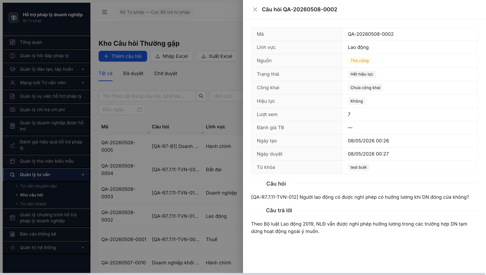
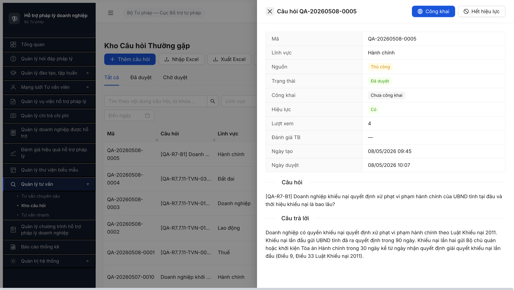
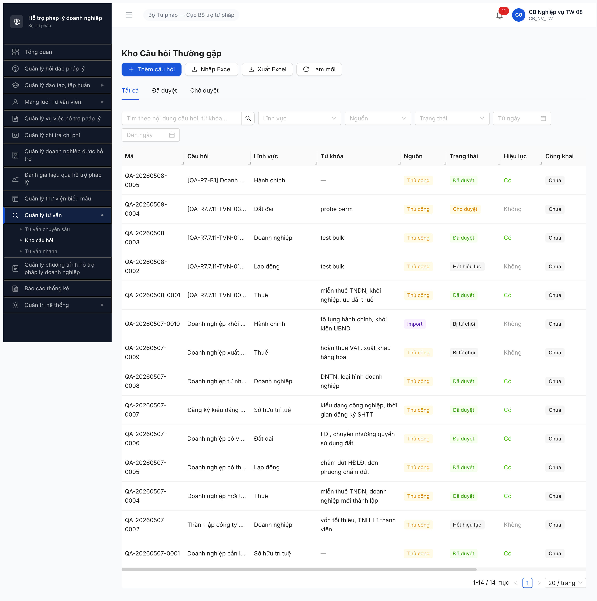
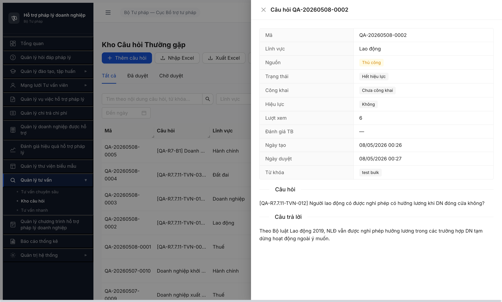
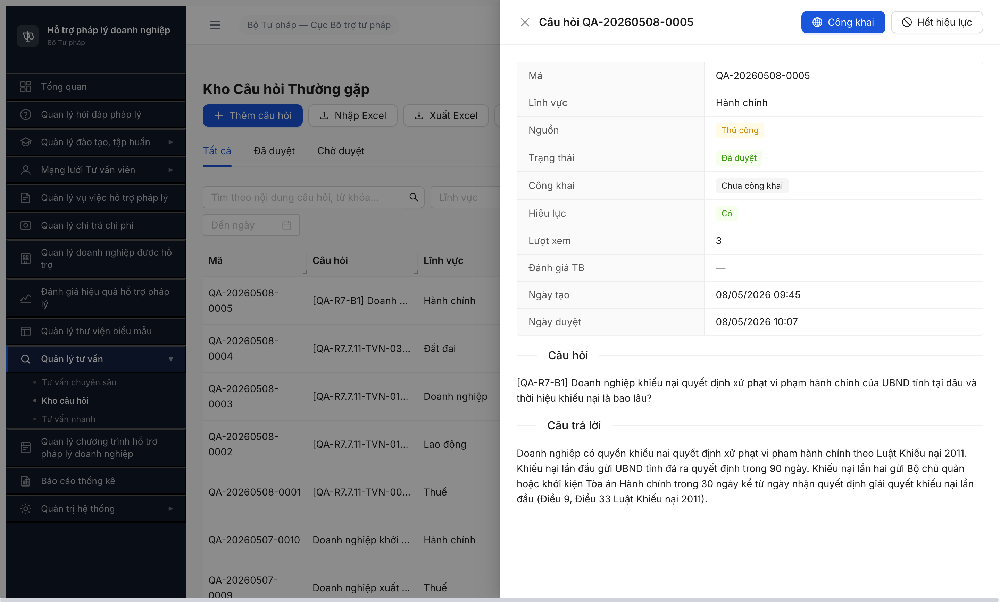
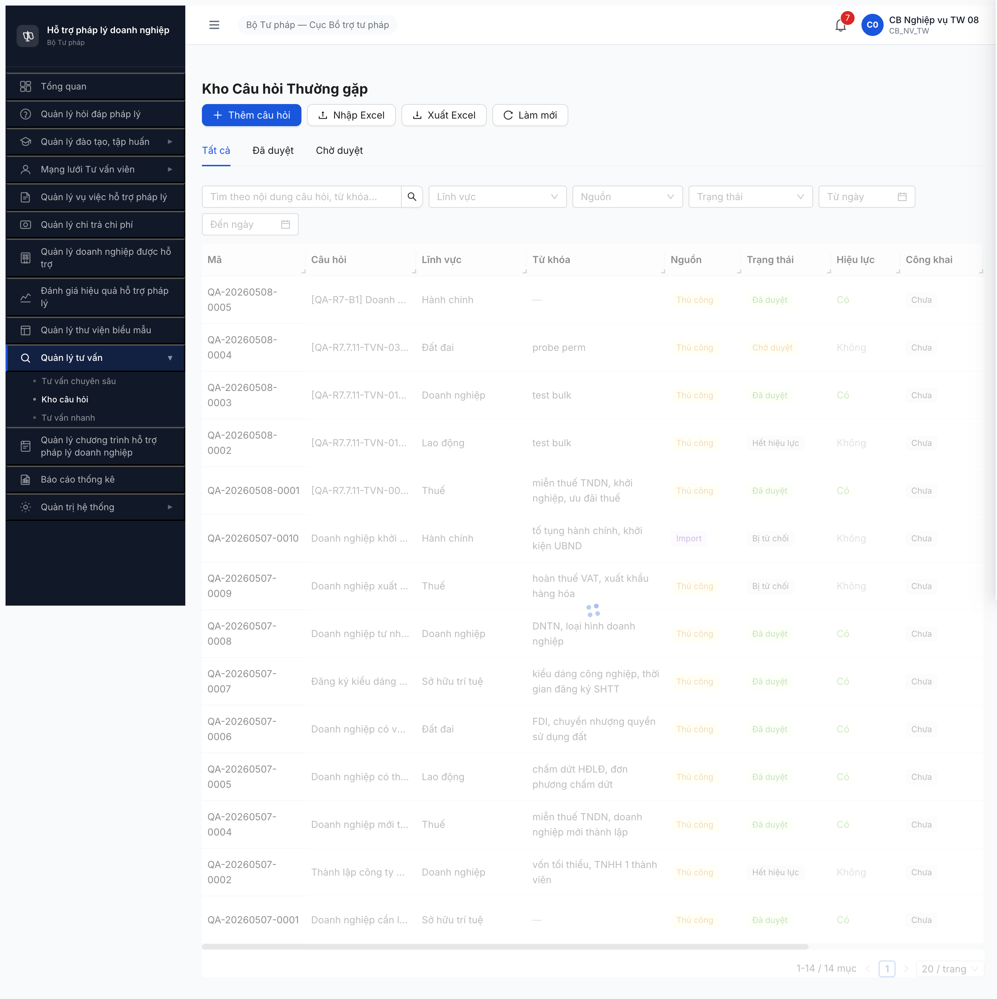

# Bug Report — Workflow Kho câu hỏi TV nhanh (R7.4.D3)

| Thông tin | Giá trị |
|-----------|---------|
| **Dự án** | PM HTPLDN |
| **Môi trường** | http://103.172.236.130:3000/ |
| **Người test** | QA Automation (Claude Code via MCP Chrome DevTools + curl) |
| **Ngày** | 2026-05-09 20:06:36 (R10 BUG-KHOQA-002 re-verified, slot _08 user request) · 2026-05-09 17:14:00 (R9 BUG-KHOQA-002 re-verified) · 2026-05-08 (R8 BUG-KHOQA-002 re-verified) · 2026-05-07 (R7 BUG-KHOQA-002) · 2026-05-05 (R7 BUG-KHOQA-001 closed-verified) · 2026-05-02 (R14 first log) |
| **Loại test** | Workflow Seed + SM transition — Kho câu hỏi tư vấn nhanh (D3) |
| **Round** | Round 7 (latest) |
| **Tài liệu tham chiếu** | [seed-checklist-KhoQA.md](../../../round6-2026-05-01-postreset/seed/seed-checklist-KhoQA.md) · SRS FR-X.2-01 UC158 (Priority Essential) · SCR-X2-01 |

---

## Tổng hợp

**1 bug có SRS reference cụ thể** trong session R6.4.D3 — UI Kho câu hỏi tư vấn nhanh (SCR-X2-01) chưa được build trên CMS, mặc dù SRS đặt Priority `Essential` và đặc tả đầy đủ 12 thành phần màn hình.

> **2-source SRS verify:**
> - **Local:** [`input/srs-v3/srs-fr-13-tv-nhanh.md`](../../../../../input/srs-v3/srs-fr-13-tv-nhanh.md) line 76-85 + line 405-426 (toolbar 3 nút + Modal form + Modal Import).
> - **NotebookLM HTPLDN** (id `e3a2681b-fdd6-4a24-917c-9ed636e8a110`) — query 2026-05-05 trả lời nguyên văn: *"Hệ thống quy định chính xác 3 nút chức năng này trên toolbar: [+ Thêm câu hỏi], [Nhập Excel], [Làm mới]"* + *"Tài liệu SRS hoàn toàn không có bất kỳ quy định nào cho phép defer (hoãn) làm Frontend đối với module này"* (citation source `834a6af0-ab79-4c66-a048-4ba34bcd2cc2`).

### Severity breakdown

| Tổng | Critical | Major | Medium | Minor | Trivial |
|------|----------|-------|--------|-------|---------|
| 2    | 1        | 1     | 0      | 0     | 0       |

> **Status hiện tại R10b 2026-05-10 11:00:** 2/2 đóng (BUG-KHOQA-001 + BUG-KHOQA-002). 0 bug Open trong file này.

## Bug Summary Table

| Bug ID | Severity | Priority | Type | TC Ref | **SRS Reference** | Title | Status |
|--------|----------|----------|------|--------|-------------------|-------|--------|
| ~~BUG-KHOQA-002~~ | Major | P1 | UI/UX | R7.4.D3 T8 | `02-thu-tu-module.md line 788` SM-KHOCAUHOI T8 `HET_HIEU_LUC → DA_DUYET` | ~~Detail modal câu hỏi state `HET_HIEU_LUC` thiếu button "Kích hoạt hiệu lực" — không có cách toggle on qua UI~~ | Closed (R10b 2026-05-10 11:00) |
| ~~BUG-KHOQA-001~~ | Critical | P0 | UI/UX | R6.4.D3 | `FR-X.2-01 UC158 Priority=Essential` + `SCR-X2-01 rows 1-12` (toàn bộ màn) | ~~UI Kho câu hỏi tư vấn nhanh (SCR-X2-01) chưa build — thiếu sidebar/route + modal [+ Thêm câu hỏi] + modal [Nhập Excel] + tab phân loại + duyệt inline~~ | Closed |

---

## ~~BUG-KHOQA-002~~ [CLOSED] — Detail modal câu hỏi `HET_HIEU_LUC` thiếu button "Kích hoạt hiệu lực" (T8 không thực hiện được qua UI)

> **Re-test 2026-05-10 11:00:00 R10b:** ✅ **PASS (Closed-verified — FE deploy fix giữa R10 20:06 → R10b 11:00, delta ~15h).** Account `cb_nv_tw_08` isolated context `qa_only_r10_kho_qa_verify`. Click row `QA-20260508-0002` (Lao động, state `Hết hiệu lực`) → drawer mở, header có button `[play-circle Kích hoạt hiệu lực]` (uid=35_7) ngay cạnh nút Đóng. Click button → confirm dialog `"Câu hỏi sẽ được kích hoạt lại và hiển thị cho người dùng. Tiếp tục?"` → click `[Đồng ý]` → drawer đóng + table refresh: row QA-20260508-0002 chuyển TRẠNG THÁI `Hết hiệu lực`→`Đã duyệt`, HIỆU LỰC `Không`→`Có`. Pool re-verify API `GET /api/v1/kho-cau-hois?pageSize=100` total=14 unchanged, distribution shifted DA_DUYET 9→10 / HET_HIEU_LUC 2→1. T8 transition functional 100% qua UI thuần. Bug Closed-verified, FE drawer footer fix deployed. Bằng chứng: [r7-4-d3-r10b-bug-khoqa-002-button-kich-hoat-present.png](../../workflow/kho-qa/r7-4-d3-r10b-bug-khoqa-002-button-kich-hoat-present.png) + [r7-4-d3-r10b-bug-khoqa-002-t8-transition-pass.png](../../workflow/kho-qa/r7-4-d3-r10b-bug-khoqa-002-t8-transition-pass.png).

> **Re-test 2026-05-09 20:06:36 R10:** ❌ **STILL OPEN — lần 4 reproduce.** Account `cb_nv_tw_08` (slot _08 theo user request, login PASS lần 1 không lock không 429). Click row `QA-20260508-0002` (Lao động, state `Hết hiệu lực`) → drawer mở. DOM `.ant-drawer-open`: `buttonCount=1`, button = `[{text:"", aria:"Đóng", class:"ant-drawer-close"}]`, `.ant-drawer-footer` = NOT EXIST, regex `/k[ií]ch hoạt|kh[ôo]i phục|mở lại|reactivate|restore/i` quét toàn drawer = `0 hits`. Đối chứng cùng round cùng account: drawer DA_DUYET QA-20260508-0005 → `buttonCount=3`, buttons = `[{aria:"Đóng"}, {text:"Công khai"}, {text:"Hết hiệu lực"}]` → T7 button hiện diện đúng spec, drawer template build đúng. Console errors = 0 messages cả 2 drawer interaction. **Bug stable cross-account (cb_nv_tw_02 + cb_nv_tw_08), cross-round (R7+R8+R9+R10), cross-record (QA-20260507-0002 + QA-20260508-0002). Phân loại Rule 9 = APP/FE BUG — không phải selector/account/env/throttle. Ngừng burn round, escalate dev fix FE drawer footer.**

> **Re-test 2026-05-09 17:14:00 R9:** ❌ **STILL OPEN**. Account `cb_nv_tw_08` (session-pinned slot _08, fallback từ Rule 7 sau khi xác minh _08 đã activate ở BE — login API trả OTP token thành công, BUG ban đầu là 429 throttle do probe đa bước). Click row `QA-20260508-0002` (Lao động, state `Hết hiệu lực`) → drawer mở title "Câu hỏi QA-20260508-0002". Verify DOM `.ant-drawer-open`: chỉ 1 button `aria-label="Đóng"` class `ant-drawer-close`, `.ant-drawer-footer` = NO_FOOTER, không có button `Kích hoạt | Hiệu lực | Khôi phục | Mở lại`. So sánh đối chứng cùng round: drawer DA_DUYET QA-20260508-0005 cùng UI có 3 button [Đóng / Công khai / **Hết hiệu lực**] → **T7 (DA_DUYET → HET_HIEU_LUC) vẫn build, T8 (HET_HIEU_LUC → DA_DUYET) MISSING reciprocal button**. Pattern reproduce 3 round liên tiếp (R7 + R8 + R9) với 2 account khác nhau (`cb_nv_tw_02` ở R7/R8 + `cb_nv_tw_08` ở R9).

> **Re-test 2026-05-08 R8:** ❌ **STILL OPEN**. Account `cb_nv_tw_02`. Click row `QA-20260508-0002` (state `Hết hiệu lực`) → modal mở. Verify DOM: `.ant-drawer` chỉ có 1 button (close X), `.ant-modal-footer` không tồn tại, `visibleActionButtons` filter `/Kích hoạt|Hiệu lực|Duyệt|Sửa/i` trả về `[]`. T8 `HET_HIEU_LUC → DA_DUYET` vẫn không thực hiện được qua UI. Câu hỏi `QA-20260507-0002` vẫn kẹt state `Hết hiệu lực` sau 2 round (R7 + R8).

### Mô tả

Sau khi `cb_nv_tw_02` toggle off câu hỏi `QA-20260507-0002` (Trạng thái `Hết hiệu lực`, Hiệu lực `Không`), khi click mở lại detail modal cùng record, modal chỉ hiển thị nút `[Đóng]` mà không hiển thị bất kỳ button nào để kích hoạt lại (toggle on). Spec yêu cầu transition T8 `HET_HIEU_LUC → DA_DUYET` qua "Toggle lại" do `cb_nv_<cap>_01` thực hiện ngay trên SCR-X2-01.

### Các bước tái hiện

1. Login `cb_nv_tw_02 / Secret@123 / OTP 666666` qua `http://103.172.236.130:3000/login`.
2. Navigate sidebar `Quản lý tư vấn` → `Kho câu hỏi` (URL `/tv-nhanh/kho-cau-hoi`).
3. Click row `QA-20260507-0002` (Trạng thái `Đã duyệt`, Hiệu lực `Có`) → detail modal mở với button `[stop Hết hiệu lực]`.
4. Click `[Hết hiệu lực]` → confirm popup `Đánh dấu hết hiệu lực?` → click `[Đồng ý]` → toast `Đã đánh dấu hết hiệu lực` + record state đổi thành `Hết hiệu lực`, Hiệu lực `Không`.
5. Click lại row `QA-20260507-0002` (state hiện là `Hết hiệu lực`) → detail modal mở lại.
6. Quan sát modal: chỉ có button `[Đóng]` (icon X góc trên), KHÔNG có button "Kích hoạt", "Khôi phục hiệu lực", hoặc "Mở lại".
7. Verify DOM via `evaluate_script(() => Array.from(document.querySelector('[role="dialog"]').querySelectorAll('button')).map(b => b.textContent.trim()))` → trả về `[""]` (chỉ 1 close button rỗng class `ant-drawer-close`).

### Kết quả mong đợi

Theo `input/quy-trinh-nghiep-vu/02-thu-tu-module.md` line 788 SM-KHOCAUHOI:

```
| HET_HIEU_LUC | DA_DUYET | cb_nv_<cap>_01 | Toggle lại | hieu_luc=1 → hiện lại | — | SCR-X2-01 |
```

Khi `cb_nv_tw_02` (vai trò `cb_nv_<cap>_01` cấp TW) mở detail modal câu hỏi `HET_HIEU_LUC`, phải có button `[Kích hoạt hiệu lực]` (hoặc tên tương đương: "Mở lại", "Khôi phục") để chuyển transition T8 `HET_HIEU_LUC → DA_DUYET` với `hieu_luc=1`. Trạng thái sau click: Trạng thái `Đã duyệt`, Hiệu lực `Có`.

### Kết quả thực tế

Detail modal QA-0002 ở state `HET_HIEU_LUC` chỉ có 1 button `[Đóng]` (close X). Không có button toggle on. Transition T8 không thể thực hiện qua UI bằng vai trò creator (`cb_nv_<cap>_01`). Câu hỏi đã `HET_HIEU_LUC` bị "kẹt" — biên soạn viên không có cách khôi phục qua UI.

### Bằng chứng

**1. Ảnh chụp** *(bắt buộc)*:

R10 evidence (2026-05-09 20:06:36, account `cb_nv_tw_08` — user request slot _08) — drawer detail QA-20260508-0002 (Lao động) state `Hết hiệu lực`: chỉ 1 button `× Đóng` góc trên-phải, KHÔNG có action button trong header bên phải, KHÔNG có footer. Trạng thái + Hiệu lực fields hiển thị đầy đủ read-only:



R10 đối chứng cùng round cùng account — drawer detail QA-20260508-0005 (Hành chính) state `Đã duyệt`: header có 2 action button bên phải `[Công khai]` + `[Hết hiệu lực]` (T7 button hiện diện đúng spec). Cùng drawer template, chỉ khác state record:



R10 pool list (14 records: DA_DUYET:9 / CHO_DUYET:1 / HET_HIEU_LUC:2 / NHAP/Bị từ chối:2) — banner "CB Nghiệp vụ TW 08" top-right, distribution match R9 (state pool không thay đổi):



R7 evidence — modal detail QA-20260507-0002 state Hết hiệu lực chỉ có button Đóng:


R9 evidence (2026-05-09 17:14, account `cb_nv_tw_08`) — drawer detail QA-20260508-0002 (Lao động) state `Hết hiệu lực`: header chỉ có button `× Câu hỏi QA-20260508-0002` (X Đóng), KHÔNG có action button bên phải header. Body hiển thị Câu hỏi + Câu trả lời read-only, KHÔNG có footer:



R9 đối chứng cùng round, cùng account — drawer detail QA-20260508-0005 (Hành chính) state `Đã duyệt`: header có 2 action button bên phải `[Công khai]` + `[Hết hiệu lực]` (T7 button hiện diện đúng spec). Cùng drawer template, chỉ khác state của record:



Pool list state R9 (14 records: DA_DUYET:9 / CHO_DUYET:1 / HET_HIEU_LUC:2 / NHAP:2):



**2. DOM inspect** *(phụ trợ)*:

```text
# Query inside dialog modal
document.querySelector('[role="dialog"]').querySelectorAll('button')
→ [HTMLButtonElement.class="ant-drawer-close"]   (chỉ 1 button close)

# Search whole document for re-activate keywords
querySelectorAll('*').filter(text matches /kích hoạt|khôi phục|mở lại|reactivate|restore/i)
→ []   (không có element nào matched)

# Compare: detail modal of DA_DUYET state QA-0002 (trước khi toggle off):
buttons inside dialog: [{text:"stop Hết hiệu lực", class:"ant-btn ..."}]   ✅ có toggle off
```

**3. SRS quote (local)**:

```text
# Local file: input/quy-trinh-nghiep-vu/02-thu-tu-module.md line 787-788
| DA_DUYET     | HET_HIEU_LUC | cb_nv_<cap>_01 | Toggle hiệu lực | hieu_luc=0 ... | SCR-X2-01 toggle inline |
| HET_HIEU_LUC | DA_DUYET     | cb_nv_<cap>_01 | Toggle lại      | hieu_luc=1 ... | SCR-X2-01 |
```

T7 (DA_DUYET → HET_HIEU_LUC) được build đúng (button `[Hết hiệu lực]` trong modal). T8 (HET_HIEU_LUC → DA_DUYET) MISSING UI implementation — chỉ thiếu 1/2 chiều của cùng 1 transition pair.

---

## ~~BUG-KHOQA-001~~ [CLOSED] — UI Kho câu hỏi tư vấn nhanh (SCR-X2-01) chưa build trên CMS

> **Re-test:** 2026-05-07 R7 — ✅ PASS (Closed-verified). Login `cb_nv_tw_02`, sidebar `Quản lý tư vấn` đã có 3 submenu (Tư vấn chuyên sâu / **Kho câu hỏi** / Tư vấn nhanh). Click `Kho câu hỏi` → URL `/tv-nhanh/kho-cau-hoi` render đúng (KHÔNG redirect). 12 thành phần SCR-X2-01 đủ: heading "Kho Câu hỏi Thường gặp" + toolbar 4 nút (Thêm câu hỏi / Nhập Excel / Xuất Excel / Làm mới) + 3 tab phân loại (Tất cả / Đã duyệt / Chờ duyệt) + filter-bar (search + Lĩnh vực + Nguồn + Date range) + bảng 10 cột + pagination + modal Thêm câu hỏi 4 trường + modal Import Excel 3-step wizard + tab Chờ duyệt có checkbox "Select all" cho bulk approve. Network: `GET /api/v1/kho-cau-hois?page=1&pageSize=20` → 200, `GET /api/v1/kho-cau-hois?trangThai=CHO_DUYET,NHAP` → 200. Record `QA-20260507-0001` (Sở hữu trí tuệ, Đã duyệt, nguồn Thủ công) tồn tại. Minor deviation: modal Thêm câu hỏi gộp 3 button spec `[Hủy] [Lưu nháp] [Gửi duyệt]` thành 2 button `[Hủy] [Lưu]` — không thuộc scope BUG-KHOQA-001 chính (12 thành phần SCR-X2-01 đã có UI). Bằng chứng: [bug-khoqa-001-r7-fix-verified.png](image/bug-khoqa-001-r7-fix-verified.png).

### Mô tả

Module Kho câu hỏi tư vấn nhanh (FR-X.2-01 UC158, Priority `Essential`) hiện không có giao diện trên CMS cho `cb_nv_tw_01`. Sidebar `Quản lý tư vấn` chỉ render 2 submenu `Tư vấn chuyên sâu` + `Tư vấn nhanh` (= phiên TV nhanh, **không phải Kho**). Toàn bộ 12 thành phần màn SCR-X2-01 (toolbar 3 nút, 3 tab phân loại, filter-bar, bảng kho Q&A, modal form thêm Q&A, modal Import Excel, duyệt inline đơn lẻ + hàng loạt, pagination) đều không tồn tại. JWT `cb_nv_tw_01` đã có 7 permissions Kho QA (`read/create/update/delete/approve/import/export _kho_cau_hoi`) nhưng FE không có nơi để gọi.

### Các bước tái hiện

1. Login `cb_nv_tw_01 / Secret@123 / OTP 666666` qua `http://103.172.236.130:3000/login`.
2. Quan sát sidebar trái → mở rộng group `Quản lý tư vấn` → chỉ thấy 2 submenu `Tư vấn chuyên sâu` (`/tv-chuyen-sau/danh-sach`) + `Tư vấn nhanh` (`/tv-nhanh/danh-sach`).
3. Click `Tư vấn nhanh` → trang load với 4 tab (Tất cả / Chờ xử lý / Đã gợi ý / Hoàn thành) — đây là MH-13.3 (Quản lý phiên TV nhanh, FR-X.2-02), KHÔNG phải MH-13.1 Kho câu hỏi.
4. Quan sát toàn trang: KHÔNG có nested tab `Kho câu hỏi`, KHÔNG có button `[+ Thêm câu hỏi]`, KHÔNG có button `[Nhập Excel]`.
5. Thử navigate trực tiếp `http://103.172.236.130:3000/tv-nhanh/kho-cau-hoi` → app redirect về `/tv-nhanh/danh-sach`.
6. Verify BE đầy đủ qua curl: `POST /api/v1/kho-cau-hois` body `{cauHoi, cauTraLoi, linhVucId, tuKhoa[], nguon:"THU_CONG"}` → HTTP 201 record `QA-20260502-0001` state `CHO_DUYET`.
7. Verify JWT permission claim: decode access token của `cb_nv_tw_01` → có đủ 7 quyền `read/create/update/delete/approve/import/export_kho_cau_hoi`.

### Kết quả mong đợi

Theo SRS FR-X.2-01 (Priority `Essential`, Stability `High`) + SCR-X2-01 row 1-12 ([srs-fr-13-tv-nhanh.md line 405-426](../../../../../input/srs-v3/srs-fr-13-tv-nhanh.md)):

- **Sidebar:** group `Quản lý tư vấn` phải có submenu `Kho câu hỏi` (theo Breadcrumb spec `Trang chủ > Tư vấn > Kho câu hỏi`).
- **Toolbar (row 2):** hiển thị tiêu đề `"Kho Câu hỏi Thường gặp"` + 3 nút `[+ Thêm câu hỏi]` `[Nhập Excel]` `[Làm mới]`.
- **Tab phân loại (row 3):** 3 tab `Tất cả / Đã duyệt / Chờ duyệt` với badge số đếm.
- **Filter-bar (row 4):** full-text + Lĩnh vực + Nguồn (TU_DONG/THU_CONG/IMPORT) + Trạng thái.
- **Modal Form thêm Q&A (row 8):** 4 field `Câu hỏi (textarea, BB)` + `Câu trả lời (Rich Text C16, BB)` + `Lĩnh vực (dropdown, BB)` + `Từ khóa (tag input)` + 3 button `[Hủy] [Lưu nháp] [Gửi duyệt]`.
- **Modal Import Excel (row 9):** upload `.xlsx` → validate → preview 10 dòng → kết quả `"N thành công, M lỗi"` → tất cả record OK SET `CHO_DUYET`.
- **Duyệt inline đơn lẻ + hàng loạt (row 10-11):** action button-group ở tab `Chờ duyệt` (đã gộp MH-13.2 từ v2.1).
- **Validate ERR-KHO-01..04** (line 148-151): toast khi câu hỏi trống / trả lời trống / lĩnh vực sai / file Excel sai format.

### Kết quả thực tế

- Sidebar `Quản lý tư vấn` chỉ có 2 submenu (TV chuyên sâu + TV nhanh phiên), thiếu submenu `Kho câu hỏi`.
- Trang `/tv-nhanh/danh-sach` chỉ render 4 tab phiên TV nhanh — KHÔNG phải Kho câu hỏi.
- Navigate `/tv-nhanh/kho-cau-hoi` redirect về `/tv-nhanh/danh-sach` (route không tồn tại).
- Toàn bộ 12 thành phần SCR-X2-01 đều không có UI: 0/3 button toolbar, 0/3 tab phân loại, 0 filter-bar Kho QA, 0 bảng kho Q&A, 0 modal form, 0 modal Import, 0 button duyệt inline.
- BE đã sẵn sàng (`POST /api/v1/kho-cau-hois` HTTP 201 OK qua curl) + JWT có 7 permissions → chứng minh đây là **gap FE đơn thuần**, không phải BE chưa làm.
- Kết quả nghiệp vụ: CB NV không có cách nào tạo Q&A `THU_CONG` qua UI, không có cách Import Excel hàng loạt, CB PD không có nơi duyệt Q&A `CHO_DUYET`. Cascade block 3 task downstream R6.6.2 (TV nhanh nhập tay) + R6.6.3 (TV nhanh PUBLIC) + R6.7.11 (39 TC functional TV nhanh).

### Bằng chứng

**1. Ảnh chụp** *(bắt buộc)*:

![BUG-KHOQA-001 — Trang /tv-nhanh/danh-sach chỉ có 4 tab phiên TV nhanh (Tất cả/Chờ xử lý/Đã gợi ý/Hoàn thành), không có nested tab Kho câu hỏi, không có button [+ Thêm câu hỏi] hoặc [Nhập Excel] trên toolbar](image/bug-khoqa-001-no-route-no-modal.png)

**2. API + JWT verify** *(phụ trợ — chứng minh BE sẵn sàng, gap FE)*:

```text
# BE CRUD + permission đầy đủ
POST /api/v1/kho-cau-hois
Body: {"cauHoi":"Hợp đồng lao động thử việc tối đa bao lâu?",
       "cauTraLoi":"...","linhVucId":"<uuid LĐ>",
       "tuKhoa":["hop dong","lao dong","thu viec"],"nguon":"THU_CONG"}
→ HTTP 201 {success:true, data:{maCauHoi:"QA-20260502-0001",
                                 trangThai:"CHO_DUYET", nguon:"THU_CONG"}}

GET /api/v1/kho-cau-hois?nguon=THU_CONG
→ HTTP 200 total=1, data=[{maCauHoi:"QA-20260502-0001",...}]

# JWT cb_nv_tw_01 — decode permissions claim
"permissions": [..., "read_kho_cau_hoi", "create_kho_cau_hoi",
                "update_kho_cau_hoi", "delete_kho_cau_hoi",
                "approve_kho_cau_hoi", "import_kho_cau_hoi",
                "export_kho_cau_hoi"]
```

**3. SRS quote (local + NotebookLM song song)**:

```text
# Local file: input/srs-v3/srs-fr-13-tv-nhanh.md line 76-82
FR-X.2-01: Quản lý kho câu hỏi/tư vấn (UC158)
  Priority: Essential
  Stability: High
  Màn hình: SCR-X2-01 — Quản lý Kho Câu hỏi (phê duyệt inline trong SCR-X2-01)

# Local file: input/srs-v3/srs-fr-13-tv-nhanh.md line 416 (SCR-X2-01 row 2)
toolbar | Tiêu đề + nút | label + button |
  "Kho Câu hỏi Thường gặp" + [+ Thêm câu hỏi] [Nhập Excel] [Làm mới]
  | click -> action | luôn hiển thị

# NotebookLM HTPLDN query 2026-05-05 (cited table source 834a6af0-...)
"Tài liệu SRS hoàn toàn không có bất kỳ quy định nào cho phép defer
(hoãn) làm Frontend đối với module này. Chức năng Quản lý Kho câu hỏi
(FR-X.2-01 / UC158) có mức độ ưu tiên là Essential (Bắt buộc)."
```

---

## Phụ lục — Môi trường test

| Thành phần | Giá trị |
|------------|---------|
| URL ứng dụng | http://103.172.236.130:3000/ |
| OTP login | `666666` (bypass dev đang bật) |
| MailHog (OTP inbox) | http://103.172.236.130:8025 |
| API base | http://103.172.236.130:3000/api/v1 |
| Frontend | React + Vite + Ant Design |
| Xác thực | JWT + OTP 6 ô |
| Tool test | Chrome DevTools MCP + curl |
| Tài khoản test | `cb_nv_tw_01 / Secret@123 / OTP 666666` (vai trò CB NV cấp TW) |

---

*Bug report generated: 2026-05-05 | QA Automation via Claude Code*
