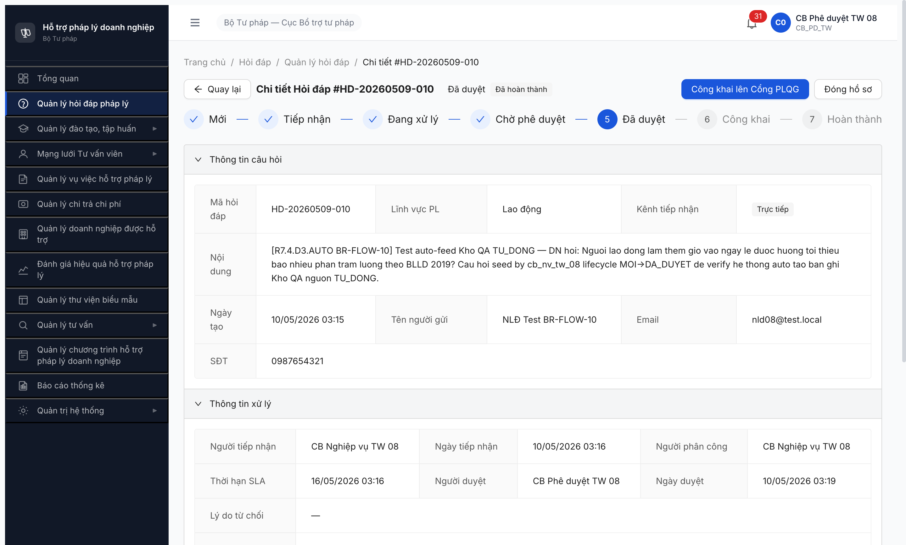
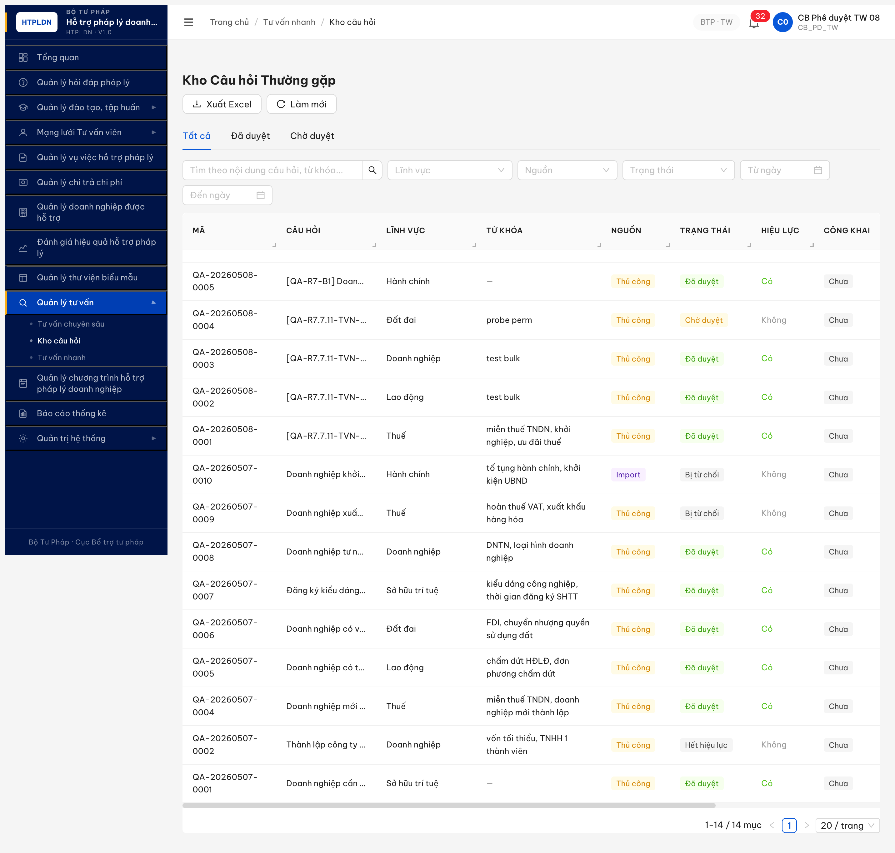
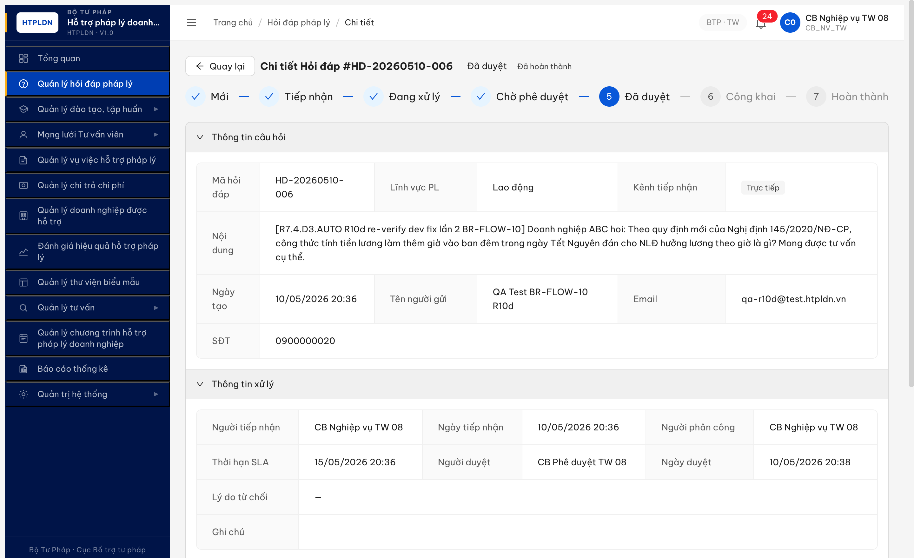
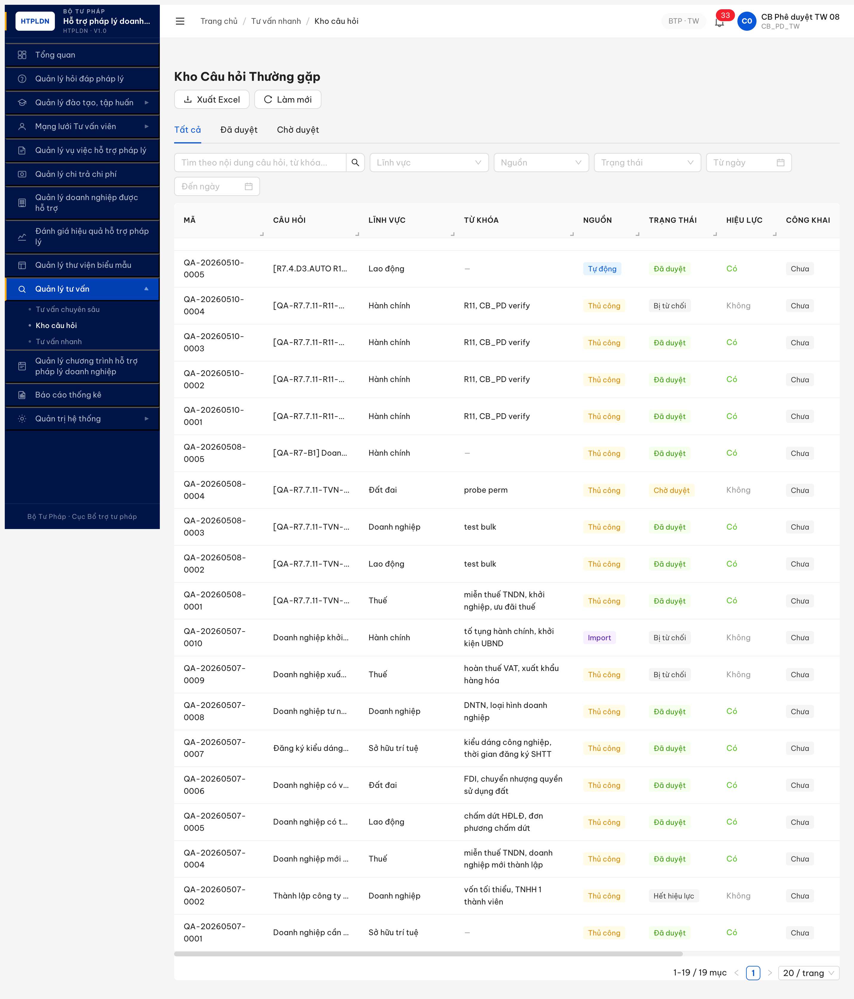

# Bug Report — Kho QA · R7.4.D3.AUTO BR-FLOW-10 auto-feed

| Thông tin | Giá trị |
|-----------|---------|
| **Dự án** | PM HTPLDN |
| **Môi trường** | http://103.172.236.130:3000/ |
| **Người test** | QA Automation (huongttt) |
| **Ngày** | 2026-05-10 20:38:31 |
| **Loại test** | Workflow / Cross-module auto-feed |
| **Round** | R10 |
| **Tài liệu tham chiếu** | [`02-thu-tu-module.md` line 781 (FR-13 BR-FLOW-10)](../../../../../input/quy-trinh-nghiep-vu/02-thu-tu-module.md) · [`02-thu-tu-module.md` line 509 (SM-HOIDAP DA_DUYET hook)](../../../../../input/quy-trinh-nghiep-vu/02-thu-tu-module.md) · [`tasks/todo-kho-qa.md` R7.4.D3.AUTO](../../../../../tasks/todo-kho-qa.md) |

---

## Tổng hợp

Phát hiện **1** lỗi BE auto-feed BR-FLOW-10 không kích hoạt khi Hỏi đáp chuyển trạng thái `DA_DUYET`. Hệ thống không tự tạo bản ghi Kho câu hỏi `nguon=TU_DONG` vi phạm spec FR-13 line 781.

### Severity breakdown

| Tổng | Critical | Major | Medium | Minor | Trivial | Closed | Open |
|------|----------|-------|--------|-------|---------|--------|------|
| 1    | 0        | 1     | 0      | 0     | 0       | 1      | 0    |

## Bug Summary Table

| Bug ID | Severity | Priority | Type | TC Ref | **SRS Reference** | Title | Status |
|--------|----------|----------|------|--------|-------------------|-------|--------|
| ~~BUG-KHOQA-AUTO-001~~ | ~~Major~~ | P1 | Workflow | R7.4.D3.AUTO | `02-thu-tu-module.md` L781 (FR-13 BR-FLOW-10) · L509 (SM-HOIDAP hook) | ~~BE không auto tạo Kho QA `nguon=TU_DONG` khi HD chuyển `DA_DUYET`~~ | Closed |

---

## ~~BUG-KHOQA-AUTO-001~~ [CLOSED] — BE không auto tạo Kho QA TU_DONG khi HD chuyển DA_DUYET

> **Re-test:** 2026-05-10 20:38:31 R10d — ✅ **PASS (Closed-verified)** — Dev fix lần 2 thành công. Fresh HD-20260510-006 (UUID `2d373db6-bb71-4def-9f41-23674f0ba471`) lifecycle MOI→TIEP_NHAN→DANG_XU_LY→CHO_PHE_DUYET→DA_DUYET hoàn tất tại 20:38:31. Sau APPROVE chỉ ~1s, pool Kho QA tăng 18→19 với record `QA-20260510-0005` `nguon=TU_DONG` + `hoiDapGocId=2d373db6-bb71-4def-9f41-23674f0ba471` + `trangThai=DA_DUYET` + `hieuLuc=true` + `cauHoi`/`cauTraLoi`/`linhVucId` (Lao động) copy đầy đủ. UI `/tv-nhanh/kho-cau-hoi` hiển thị record cột Nguồn = "Tự động" đúng spec FR-13 line 781.
>

### Mô tả

CB Phê duyệt TW 08 phê duyệt HD-20260509-010 thành công, BE confirm `trangThai=DA_DUYET` + `ngayDuyet=2026-05-09T20:19:47Z`. Theo spec FR-13 line 781 + SM-HOIDAP line 509, hệ thống phải tự tạo 1 bản ghi Kho câu hỏi `nguon=TU_DONG` + `hoi_dap_goc_id=<HD UUID>`. Thực tế pool Kho QA giữ nguyên 14 records, 0 record nguon `TU_DONG` → BR-FLOW-10 KHÔNG được trigger.

### Các bước tái hiện

1. Đăng nhập `cb_nv_tw_08` (CB Nghiệp vụ TW), tạo HD lĩnh vực Lao động kênh Trực tiếp → trạng thái `MOI`.
2. Tiếp nhận HD → `TIEP_NHAN`. Phân công cho chính `cb_nv_tw_08` → `DA_PHAN_CONG`.
3. Trả lời nội dung pháp lý → `DA_TRA_LOI` (BE auto chuyển `CHO_PHE_DUYET` theo BR-FLOW-01).
4. Đăng nhập `cb_pd_tw_08` (isolated context riêng), mở HD-20260509-010, click `Phê duyệt` → trạng thái UI hiển thị `Đã duyệt`.
5. Verify BE: `GET /api/v1/hoi-daps/3577bfb6-ec53-4a0c-8858-b0507afb3472` → response `trangThai=DA_DUYET`, `ngayDuyet=2026-05-09T20:19:47.473Z`.
6. Mở Quản lý tư vấn → Kho câu hỏi (`/tv-nhanh/kho-cau-hoi`), click `Làm mới`.
7. Quan sát: total = `1-14 / 14 mục` (giữ nguyên trước khi chạy lifecycle).
8. Probe API: `GET /api/v1/kho-cau-hois?nguon=TU_DONG&page=1&pageSize=20` → `{success:true, data:[], total:0}`.

### Kết quả mong đợi

- Sau khi HD-20260509-010 chuyển `DA_DUYET`, BE phải tự tạo 1 record Kho câu hỏi:
  - `nguon = TU_DONG`
  - `hoi_dap_goc_id = 3577bfb6-ec53-4a0c-8858-b0507afb3472`
  - `cauHoi` copy từ HD nội dung
  - `cauTraLoi` copy từ phản hồi đã duyệt
  - `linhVucId` = lĩnh vực Lao động (`bbbbbbbb-...-000000000013`)
  - `trangThai = DA_DUYET` (theo spec line 781 mention auto state DA_DUYET)
- Pool Kho QA tăng từ 14 → 15 records.
- Filter `?nguon=TU_DONG` trả ≥1 record.

> Spec line 781: `FR-02 DA_DUYET → DA_DUYET → System → Tự động feed khi Hỏi đáp (FR-02) chuyển sang DA_DUYET → Hệ thống tự tạo bản ghi với nguon=TU_DONG và hoi_dap_goc_id`
> Spec line 509: `Phụ feedback tự động: Khi DA_DUYET → hệ thống auto tạo bản ghi KHO_CAU_HOI trong FR-13 (nguồn TU_DONG)`

### Kết quả thực tế

- Pool Kho QA giữ nguyên 14 records sau khi HD chuyển `DA_DUYET`.
- API `GET /api/v1/kho-cau-hois?nguon=TU_DONG` trả `total=0, count=0` → BE chưa từng tạo record TU_DONG.
- 14 records tồn tại đều có `nguon ∈ {THU_CONG, IMPORT}` (verify response body).
- Không có record nào có `hoiDapGocId` link về HD-20260509-010.
- Console errors clean → không phải FE block, BE không trigger hook.

### Bằng chứng

**1. Ảnh chụp** *(bắt buộc inline)*:




**Re-test R10c 2026-05-10 12:21:48 — fresh HD-20260510-001 (FAIL):**




**Re-test R10d 2026-05-10 20:38:31 — fresh HD-20260510-006 (PASS Closed-verified):**





**2. API response** *(phụ trợ — verify BE state)*:

```json
// GET /api/v1/hoi-daps/3577bfb6-ec53-4a0c-8858-b0507afb3472
{
  "status": 200,
  "data": {
    "trangThai": "DA_DUYET",
    "maHoiDap": "HD-20260509-010",
    "nguoiDuyetId": "158c90f9-5926-42af-8a11-495ac3288e3c",
    "ngayDuyet": "2026-05-09T20:19:47.473Z"
  }
}

// GET /api/v1/kho-cau-hois?nguon=TU_DONG&page=1&pageSize=20
{
  "success": true,
  "data": [],
  "total": 0
}

// GET /api/v1/kho-cau-hois?page=1&pageSize=20
// → 14 records, all nguon ∈ {THU_CONG, IMPORT}, none has hoiDapGocId
```

**Re-test R10c 2026-05-10 12:21:48 — fresh lifecycle (FAIL):**

```text
HD-20260510-001 (UUID 8753d1ff-f268-4868-a920-1b4f14697a1e)
lichSu: [CREATE, TIEP_NHAN, PHAN_CONG, SUBMIT, APPROVE]
trangThai: DA_DUYET
ngayDuyet: 2026-05-10T05:21:48.513Z
khoCauHoiId: null   ← KHÔNG có link Kho QA

GET /api/v1/kho-cau-hois?nguon=TU_DONG → {success:true, data:[], total:0}
GET /api/v1/kho-cau-hois?page=1&pageSize=50 → 14 records (THU_CONG:13 + IMPORT:1), match_by_hd_goc_id: 0

Sau APPROVE + chờ 30s: pool unchanged, không có async trigger.
```

**Re-test R10d 2026-05-10 20:38:31 — fresh lifecycle (PASS Closed-verified):**

```text
HD-20260510-006 (UUID 2d373db6-bb71-4def-9f41-23674f0ba471)
lichSu: [CREATE, TIEP_NHAN, PHAN_CONG, SUBMIT, APPROVE]
trangThai: DA_DUYET
ngayDuyet: 2026-05-10T13:38:31.420Z

GET /api/v1/kho-cau-hois?nguon=TU_DONG → {success:true, total:1, data:[
  {
    "maCauHoi": "QA-20260510-0005",
    "nguon": "TU_DONG",
    "hoiDapGocId": "2d373db6-bb71-4def-9f41-23674f0ba471",   ← match HD-006
    "trangThai": "DA_DUYET",
    "hieuLuc": true,
    "cauHoi": "[R7.4.D3.AUTO R10d re-verify... NLĐ làm thêm giờ ban đêm... 350% lương giờ.]",
    "cauTraLoi": "[Trả lời BR-FLOW-10 R10d... Theo NĐ 145/2020/NĐ-CP Điều 57...]",
    "linhVucId": "bbbbbbbb-0000-4000-8000-000000000013",
    "linhVuc": {"ten": "Lao động"},
    "nguoiDuyetId": "158c90f9-... (CB Phê duyệt TW 08)",
    "ngayTao":  "2026-05-10T13:38:31.417Z",
    "ngayDuyet":"2026-05-10T13:38:31.420Z"
  }
]}

GET /api/v1/kho-cau-hois?page=1&pageSize=50 → 19 records (TU_DONG:1 + THU_CONG:17 + IMPORT:1)
Pool tăng 18→19 ngay sau APPROVE (~1s, không cần chờ).
UI /tv-nhanh/kho-cau-hoi: row đầu QA-20260510-0005 cột Nguồn="Tự động", Trạng thái="Đã duyệt", Hiệu lực="Có".
```

---

## Phụ lục — Môi trường test

| Thành phần | Giá trị |
|------------|---------|
| URL ứng dụng | http://103.172.236.130:3000/ |
| OTP login | `666666` bypass |
| MailHog (OTP inbox) | http://103.172.236.130:8025 |
| API base | `/api/v1` |
| Frontend | React + Vite + Ant Design |
| Xác thực | JWT (RS256) + OTP + isolated MCP contexts |
| Tool test | Chrome DevTools MCP (2 isolated contexts: `qa_r10c_kho_qa_seed_cbnv08` + `qa_r10c_kho_qa_verify_cbpd08`) |
| Account dùng | `cb_nv_tw_08` (lifecycle MOI→CHO_PHE_DUYET) + `cb_pd_tw_08` (CHO_PHE_DUYET→DA_DUYET) |
| HD test R10 | UUID `3577bfb6-ec53-4a0c-8858-b0507afb3472` mã `HD-20260509-010` |
| HD test R10c | UUID `8753d1ff-f268-4868-a920-1b4f14697a1e` mã `HD-20260510-001` |

---

*Bug report generated: 2026-05-10 03:23:00 | Re-test R10c 2026-05-10 12:21:48 | QA Automation via Claude Code*
