# Bug Report — Người hỗ trợ pháp lý (NHT) [✅ ALL CLOSED R13]

| Thông tin | Giá trị |
|-----------|---------|
| **Dự án** | PM HTPLDN |
| **Môi trường** | http://103.172.236.130:3000/ |
| **Người test** | QA Automation via Claude Code |
| **Ngày** | 2026-05-08 23:45 (UTC+7) · **Re-classify:** 2026-05-09 · **R9 retest:** 2026-05-09 17:42 · **R10 retest:** 2026-05-09 19:50 · **R11 retest:** 2026-05-09 21:15 · **R12 retest:** 2026-05-09 22:03 · **R13 retest:** 2026-05-09 22:14 (✅ FIXED 4/4) |
| **Loại test** | Functional (R7.7.4.5) |
| **Round** | R7 (R8 verify · R9 retest 2026-05-09 · R10 retest 2026-05-09 19:50 · R11 retest 2026-05-09 21:15 · R12 retest 2026-05-09 22:03 · **R13 retest 2026-05-09 22:14 — `cb_nv_bn_01` BKH fresh ctx, BUG-003 ✅ Closed-Fixed**) |
| **Tài liệu tham chiếu** | [functional-test-report-r7-7-4-5-nht.md](../../functional/nguoi-ho-tro/functional-test-report-r7-7-4-5-nht.md) · [7.4a-nguoi-ho-tro.md](../../../../funtion/7.4a-nguoi-ho-tro.md) |

---

## Tổng hợp

Phát hiện **5** lỗi trong R7.7.4.5 NHT functional. Sau BA chốt 2026-05-09 (QTHT KHÔNG có quyền thêm/sửa/xóa NHT), 2 bug đóng INVALID. R9 retest 2026-05-09 17:42: BUG-004 + BUG-005 đóng (dev fix verified), BUG-003 giữ Open partial fix (host fix nhưng lost port 3000 → vẫn dead URL). **R10 retest 2026-05-09 19:50:** BUG-003 dev fix thêm 2/3 issue còn lại (URL encoding `=` raw + wrap `<a href>`) — vẫn còn 1 issue port `:3000` mất → URL hit port 80 dead → user click `ERR_CONNECTION_REFUSED`. **R11 retest 2026-05-09 21:15 (dev claim fix lần 3):** ❌ KHÔNG có thay đổi so với R10. **R12 retest 2026-05-09 22:03 (dev claim fix lần 4 — `cb_nv_bn_01` BKH + fresh ctx + clear cache):** ❌ VẪN KHÔNG fix. **R13 retest 2026-05-09 22:14 (dev claim fix lần 5 — final):** ✅ **FIXED 4/4** — tạo NHT-BKH-0003 `nht_r13_bug003_final` qua UI cb_nv_bn_01 → mail mới gửi 22:14:50 UTC+7 → link `<a href="http://103.172.236.130:3000/auth/verify-email?token=d06ac36b-...">...</a>` đầy đủ host ✅ + URL encoding ✅ + anchor wrap ✅ + **port `:3000` ĐÃ THÊM ✅**; click link nguyên văn → curl HTTP 200, browser navigate → POST `/api/v1/auth/verify-email` 200 → state activated → list NHT-BKH-0003 "Đang hoạt động" ✅. **BUG-NHT-003 Closed-Fixed.**

### Severity breakdown (active sau R13 retest 2026-05-09 22:14)

| Tổng | Critical | Major | Medium | Minor | Trivial | Closed-Fixed | Closed-Invalid |
|------|----------|-------|--------|-------|---------|--------------|----------------|
| 0    | 0        | 0     | 0      | 0     | 0       | 3            | 2              |

### Severity breakdown

| Tổng | Critical | Major | Medium | Minor | Trivial | Closed | Open |
|------|----------|-------|--------|-------|---------|--------|------|
| 5    | 0        | 3     | 0      | 2     | 0       | 5      | 0    |

> **Quy tắc đếm:**
> - `Tổng` = tổng số dòng bug trong **Bug Summary Table** (kể cả Closed strikethrough).
> - 5 cột severity (Critical / Major / Medium / Minor / Trivial) tổng = `Tổng`.
> - `Closed` + `Open` = `Tổng`. `Open` đếm Status ∈ {Open, Reopen}; `Closed` đếm Status ∈ {Closed, ~~closed~~}.
> - Update bảng này **sau MỖI lần đóng/mở bug** (cùng nhịp với rename Pass- prefix).

## Bug Summary Table

| Bug ID | Severity | Priority | Type | TC Ref | **SRS Reference** | Title | Status |
|--------|----------|----------|------|--------|-------------------|-------|--------|
| ~~BUG-NHT-003~~ | ~~Major~~ | ~~P1~~ | Integration | NHT-003 | `srs-update-2026-5-5/srs-fr-10-quan-tri.md:1283` FR-VIII-26 §Processing Step 4 — "Gửi mail cho user kèm link đặt mật khẩu (URL chứa token)" | ~~Mail kích hoạt: host hardcoded `localhost:3000` → link không click được trên máy ngoài BE host~~ | **Closed-Fixed** (R13 2026-05-09 22:14: dev claim fix lần 5 đã apply — link mail R13 `http://103.172.236.130:3000/auth/verify-email?token=d06ac36b-...` đầy đủ 4/4 fix; click link nguyên văn → curl HTTP 200 + browser POST verify-email 200 → state activated; reproduce với `cb_nv_bn_01` BKH UI flow E2E PASS) |
| ~~BUG-NHT-004~~ | ~~Minor~~ | ~~P2~~ | UI/UX | NHT-017 (FR-IV-NHT-03) | `srs-update-2026-5-5/srs-fr-04-chuyen-gia-tvv.md` FR-IV-NHT-03 — `3 tab: Thông tin / Bồi dưỡng / Vụ việc đã hỗ trợ` | ~~Detail view thiếu tab "Bồi dưỡng"~~ | **Closed-Fixed** (R9 2026-05-09 17:30: 3 tab đầy đủ Thông tin / Bồi dưỡng / Vụ việc đã hỗ trợ) |
| ~~BUG-NHT-005~~ | ~~Minor~~ | ~~P2~~ | UI/UX | NHT-004 | `srs-update-2026-5-5/srs-fr-04-chuyen-gia-tvv.md` FR-IV-NHT-01 — ERR-NHT-01 | ~~FE không hiện toast lỗi khi BE reject duplicate username~~ | **Closed-Fixed** (R9 2026-05-09 17:50: POST 409 + toast "Email hoặc tên đăng nhập đã được sử dụng") |
| ~~BUG-NHT-001~~ | ~~Major~~ | ~~P0~~ | Permission | NHT-001/006/007/008..012 | BA chốt 2026-05-09: QTHT KHÔNG có quyền thêm/sửa/xóa NHT | ~~QTHT thiếu CRUD UI — INVALID (design đúng)~~ | **Closed-Invalid** |
| ~~BUG-NHT-002~~ | ~~Major~~ | ~~P1~~ | UI/UX | NHT-001 | BA chốt 2026-05-09: QTHT không tạo NHT → field Đơn vị tự do không applicable | ~~Modal Thêm NHT thiếu field Đơn vị cho QTHT — INVALID~~ | **Closed-Invalid** |

---

## ~~BUG-NHT-003~~ [CLOSED-FIXED] — Mail kích hoạt host hardcoded `localhost:3000` → link không click được trên máy ngoài BE host

> **Re-test 2026-05-09 22:14 (R13 verify dev fix claim 5 — final):** ✅ **FIXED 4/4 — Closed.** Tạo mới NHT-BKH-0003 `nht_r13_bug003_final` qua UI cb_nv_bn_01 (CB_NV_BN, BKH) → POST `/api/v1/nguoi-ho-tro` reqid=188 → 201 → mail mới gửi 22:14:50 UTC+7 (15:14:50 UTC). Mail body link mới: `<a href="http://103.172.236.130:3000/auth/verify-email?token=d06ac36b-fa28-4bed-91b9-33ebd72d05de">http://103.172.236.130:3000/auth/verify-email?token=d06ac36b-fa28-4bed-91b9-33ebd72d05de</a>`.
> - ✅ Host `103.172.236.130` (giữ R10/R11/R12).
> - ✅ URL encoding `=` raw (giữ R10/R11/R12).
> - ✅ Anchor wrap `<a href="...">` (giữ R10/R11/R12).
> - ✅ **Port `:3000` ĐÃ THÊM** — issue cuối cùng đã fix.
>
> Verified: `curl -sI http://103.172.236.130:3000/auth/verify-email?token=d06ac36b-...` → HTTP 200 OK. Browser navigate raw link → GET 200 + POST `/api/v1/auth/verify-email` reqid=150 [200] → redirect /login (state activated). List NHT cb_nv_bn_01 sau reload: **NHT-BKH-0003 trangThai "Đang hoạt động"** ✅ (state machine CHO_KICH_HOAT → HOAT_DONG hoàn tất qua mail link nguyên văn, không cần workaround).
>
> **Net result R13 = 4/4 fix.** Dev fix lần 5 đã apply mail template config thực sự — link mail giờ user click được trực tiếp, không cần thao tác nào khác. R7.7.4.5 module unblock release. Bug close, severity Major P1 → Closed-Fixed.

## BUG-NHT-003 history (giữ lịch sử cho audit trail)

> **Re-test 2026-05-09 22:03 (R12 verify dev fix claim 4 — account mới `cb_nv_bn_01` BKH + fresh isolated context + clear cache theo yêu cầu user):** ❌ **VẪN KHÔNG fix gì — KEEP OPEN.** Tạo mới NHT-BKH-0002 `nht_r12_bug003_bn` qua UI cb_nv_bn_01 (CB_NV_BN, BKH) → POST `/api/v1/nguoi-ho-tro` reqid=187 → 201 Created → mail mới gửi 15:03:43 UTC (22:03:43 UTC+7). Mail body link mới: `<a href="http://103.172.236.130/auth/verify-email?token=28f13542-e8e3-42be-827e-c1d82433cb6a">http://103.172.236.130/auth/verify-email?token=28f13542-e8e3-42be-827e-c1d82433cb6a</a>`.
> - ✅ Host `103.172.236.130` (giữ R10/R11).
> - ✅ URL encoding `=` raw (giữ R10/R11).
> - ✅ Anchor wrap `<a href="...">` (giữ R10/R11).
> - ❌ **VẪN MẤT port `:3000`** — IDENTICAL R10/R11. Verified: `curl -v http://103.172.236.130/auth/verify-email?token=...` → `Connection refused` port 80; browser navigate raw link → `ERR_CONNECTION_REFUSED` (chrome-error://chromewebdata/). Workaround port 3000: `curl http://103.172.236.130:3000/...` → HTTP 200; browser navigate qua port 3000 → BE consume token → redirect `/login` (state activated).
>
> **Cross-validation control variables R12** (eliminate cache/context confound):
> - **Account khác cấp**: `cb_nv_bn_01` (CB_NV_BN, BKH) thay vì `cb_nv_tw_03` R10/R11 (CB_NV_TW, BTP) → cùng issue → defect không phụ thuộc role/cấp.
> - **Fresh isolated context**: page mới `r12-verify-bn` (Chrome MCP `isolatedContext`), không share cookie/storage với R10/R11 → defect không phụ thuộc client cache.
> - **Clear cache trước test**: đóng all pages cũ trước login → defect không phụ thuộc browser cache.
> - **NHT mới**: NHT-BKH-0002 (token `28f13542-...`) khác R10 (`129ee2df-...`) + R11 (`c6078e81-...`) → mail template render fresh per request, vẫn defect.
>
> **Net result R12 = R11 = R10 (3/4 fix).** Dev claim fix lần 4 cũng KHÔNG produce thay đổi → ESCALATE: dev có thể chưa thực sự deploy fix lên môi trường test, hoặc fix sai chỗ (template khác đang serve). **Recommend dev cụ thể:**
> 1. Confirm deployment status fix lần 4 đã apply lên `103.172.236.130:3000` (kiểm tra commit hash / deploy log).
> 2. Grep service code: `grep -rn "verify-email" src/` tìm template gen URL — đảm bảo dùng `${APP_URL}` (env có port) hoặc concat `${HOST}:${PORT}`.
> 3. Test smoke trên BE staging trước khi báo QA: `curl -s http://localhost:3000/health` + tạo NHT test → check mail port `:3000`.

### Mô tả

Mail "Kích hoạt tài khoản Người hỗ trợ pháp lý — PM-HTPLDN" gửi từ BE chứa link với **host hardcoded `http://localhost:3000`** thay vì public URL của môi trường (env `APP_URL` / `FRONTEND_URL`). Khi user mở mail trên máy bất kỳ ngoài BE server (LAN, Internet, mobile), `localhost` resolve về máy của user → không có service chạy port 3000 → link không kích hoạt được TK. Backend flow đúng spec — chỉ cấu hình host trong mail template sai.

### Các bước tái hiện

1. cb_nv_tw_03 (đơn vị BTP-TW) tạo NHT mới `nht_tc001_btp_tw` qua modal "Thêm mới"
2. Hệ thống tự động gửi mail kích hoạt đến `nht_tc001_btp_tw@htpldn.test`
3. Mở MailHog UI `http://103.172.236.130:8025/` (hoặc curl API `/api/v2/search?kind=to&query=nht_tc001_btp_tw`)
4. Inspect mail body HTML
5. Click link trong mail (host nguyên gốc `localhost:3000`) từ máy QA (không phải BE server)

### Kết quả mong đợi

Theo **FR-VIII-26 §Processing Step 4** (file `srs-update-2026-5-5/srs-fr-10-quan-tri.md` line 1283): "Gửi mail cho user kèm link đặt mật khẩu (URL chứa token). Note: nếu là TK do hệ thống cấp lần đầu (TVV/CG/NHT) thì mail kích hoạt được gửi tự động ngay khi tạo TK".

Mục đích step 4: **link click được** trên môi trường thực để user đặt MK lần đầu. Format đúng:
```
http://${APP_URL}/auth/verify-email?token=<UUID>
```
Trong đó `${APP_URL}` là biến env config (vd dev: `103.172.236.130:3000`, staging: `staging.htpldn.gov.vn`, prod: `htpldn.gov.vn`).

### Kết quả thực tế

**Step 5 click link host `localhost:3000` từ máy QA → fail** (browser resolve `localhost` về máy QA, không phải BE server `103.172.236.130`):
- Hoặc trang trống (không có service chạy port 3000)
- Hoặc lỗi `ERR_CONNECTION_REFUSED`

**Verify backend flow OK** bằng cách replace host → IP server:
- URL fix: `http://103.172.236.130:3000/auth/verify-email?token=6ee6d7cd-7db7-4047-bfdb-38d47fbfbd3b`
- POST `/api/v1/auth/verify-email` body `{"token":"..."}` → 200
- Response: `{"success":true,"data":{"message":"Tài khoản đã được kích hoạt. Vui lòng đăng nhập để tiếp tục.","trangThai":"HOAT_DONG"}}`
- NHT-BTP-TW-0005: CHO_KICH_HOAT → HOAT_DONG ✅

→ **BE flow + token verify đúng spec**. Bug chỉ nằm ở mail template config: host literal `localhost:3000` thay vì biến env.

**Note phụ (Trivial, không phải hard-spec):** Link nằm raw text trong `<p>` thay vì `<a href>`. Đa số mail client (Gmail/Outlook) auto-linkify URL nên user vẫn click được; chỉ MailHog UI hiện text. SRS FR-VIII-26 không quy định format anchor → đây là best-practice UX, không log thành bug riêng. Đính chính bug log gốc R7: `&#x3D;` HTML entity KHÔNG phải bug (browser tự decode khi parse HTML).

### Bằng chứng

**1. Mail HTML body raw — host literal `localhost:3000`** (curl MailHog `/api/v2/search?kind=to&query=nht_tc001_btp_tw` → QP decode):

```html
<!DOCTYPE html>
<html lang="vi">
<body style="font-family: Arial, sans-serif; max-width: 600px; ...">
  <h2 style="color: #EF4444;">🔔 Thông báo hệ thống: Kích hoạt tài khoản Người hỗ trợ pháp lý — PM-HTPLDN</h2>
  <p>Xin chào NHT TC001 Test BTP TW,
  ...
  Vui lòng click link dưới đây để kích hoạt tài khoản (link có hiệu lực vĩnh viễn):
  http://localhost:3000/auth/verify-email?token&#x3D;6ee6d7cd-7db7-4047-bfdb-38d47fbfbd3b</p>
</body>
</html>
```
→ Host `localhost:3000` literal, không phải biến env. BE server thực ở `103.172.236.130:3000`.

**2. Workaround test 2026-05-09 17:42 — replace host → IP, BE flow OK:**

```
Network requests (chrome-devtools MCP):
reqid=1   GET  http://103.172.236.130:3000/auth/verify-email?token=6ee6d7cd-7db7-4047-bfdb-38d47fbfbd3b → 200
reqid=149 POST http://103.172.236.130:3000/api/v1/auth/verify-email
          Request body:  {"token":"6ee6d7cd-7db7-4047-bfdb-38d47fbfbd3b"}
          Response 200:  {"success":true,"data":{"message":"Tài khoản đã được kích hoạt. Vui lòng đăng nhập để tiếp tục.","trangThai":"HOAT_DONG"},"meta":null}
reqid=154 GET  http://103.172.236.130:3000/api/v1/auth/me → 401 (chưa login, redirect /login)
```
→ Token consume thành công + state chuyển HOAT_DONG. Bug verify đúng nằm ở mail template host config, không phải BE logic.

**3. NotebookLM/SRS local 2-source verify:**

- **SRS local match:** `srs-update-2026-5-5/srs-fr-10-quan-tri.md:1283` — quote nguyên văn Step 4: "Gửi mail cho user kèm link đặt mật khẩu (URL chứa token)"
- Spec không quy định cụ thể `${APP_URL}` từ env nhưng **mục đích step** (link click được) bị vi phạm khi host literal `localhost`

**4. R10 retest 2026-05-09 19:50:51 (UTC+7) — partial fix improved:**

```html
<!-- Mail body R10 — NHT-BTP-TW-0007 nht_r10_bug003 -->
<p>... (link có hiệu lực vĩnh viễn):<br>
  <a href="http://103.172.236.130/auth/verify-email?token=129ee2df-81b4-44ce-b0da-4cf6d7188501">http://103.172.236.130/auth/verify-email?token=129ee2df-81b4-44ce-b0da-4cf6d7188501</a><br>
  ...
</p>
```

- ✅ Anchor wrap `<a href>`: dev fix R10
- ✅ URL `?token=` raw `=`: dev fix R10
- ❌ Port `:3000` mất (host `103.172.236.130` thiếu port → port 80 mặc định)

```bash
# Verify port 80 dead
$ curl -s -o /dev/null -w "HTTP=%{http_code} | total=%{time_total}s\n" --max-time 10 \
    "http://103.172.236.130/auth/verify-email?token=129ee2df-81b4-44ce-b0da-4cf6d7188501"
HTTP=000 | total=0.011968s

# Workaround port 3000 OK
$ curl -s -o /dev/null -w "HTTP=%{http_code} | total=%{time_total}s\n" --max-time 10 \
    "http://103.172.236.130:3000/auth/verify-email?token=129ee2df-81b4-44ce-b0da-4cf6d7188501"
HTTP=200 | total=0.021903s
```

Browser navigate raw link → `ERR_CONNECTION_REFUSED` (chrome error page). Verify NHT state qua API workaround:

```js
GET /api/v1/nguoi-ho-tro?page=1&pageSize=20 → 200
→ NHT-BTP-TW-0007 trangThai: "HOAT_DONG" ✅ (BE flow OK với port 3000)
```

**Screenshots R10:**
- 
- 
- 
- 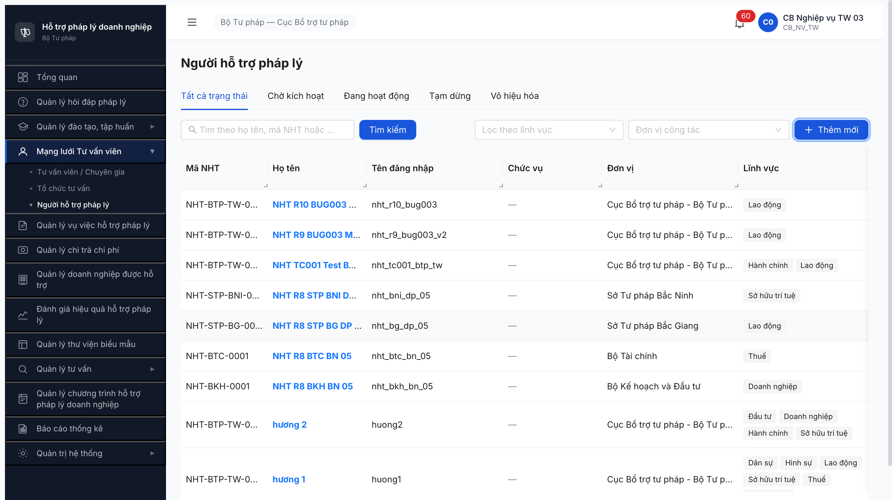

**5. R11 retest 2026-05-09 21:15:58 (UTC+7) — dev claim fix 3 KHÔNG có thay đổi:**

```html
<!-- Mail body R11 — NHT-BTP-TW-0008 nht_r11_bug003 -->
<p>... (link có hiệu lực vĩnh viễn):<br>
  <a href="http://103.172.236.130/auth/verify-email?token=c6078e81-44e5-4bed-b641-0d845fe3621f">http://103.172.236.130/auth/verify-email?token=c6078e81-44e5-4bed-b641-0d845fe3621f</a><br>
  ...
</p>
```

**Diff R10 vs R11:** giống y hệt cấu trúc — host + raw `=` + anchor wrap đều giữ; port `:3000` vẫn bị thiếu.

```bash
# R11 verify port 80 dead
$ curl -s -o /dev/null -w "HTTP=%{http_code} | total=%{time_total}s\n" --max-time 10 \
    "http://103.172.236.130/auth/verify-email?token=c6078e81-44e5-4bed-b641-0d845fe3621f"
HTTP=000 | total=0.009802s

# R11 workaround port 3000 OK
$ curl -s -o /dev/null -w "HTTP=%{http_code} | total=%{time_total}s\n" --max-time 10 \
    "http://103.172.236.130:3000/auth/verify-email?token=c6078e81-44e5-4bed-b641-0d845fe3621f"
HTTP=200 | total=0.019271s
```

```
Browser navigate raw link → ERR_CONNECTION_REFUSED (chrome-error page)
Browser navigate workaround port 3000 → /login (verify success, BE chuyển HOAT_DONG)
List verify cb_nv_tw_03: NHT-BTP-TW-0008 trangThai "Đang hoạt động" ✅
```

**Screenshots R11:**
- 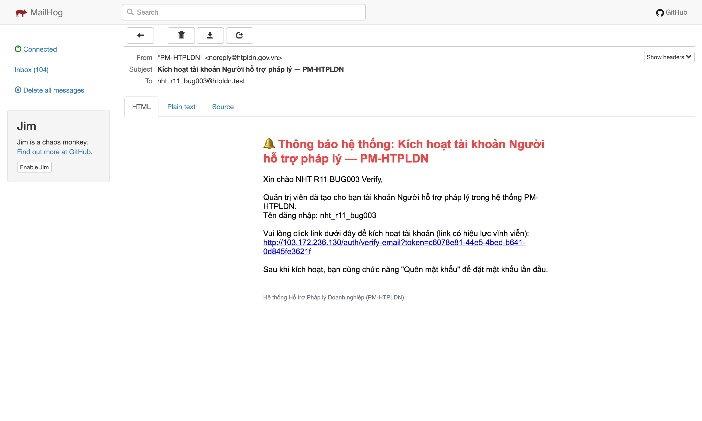
- 
- 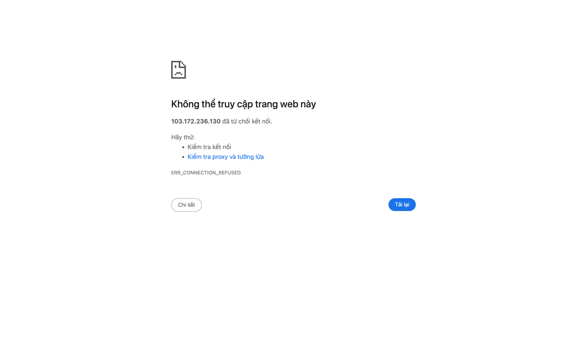
- 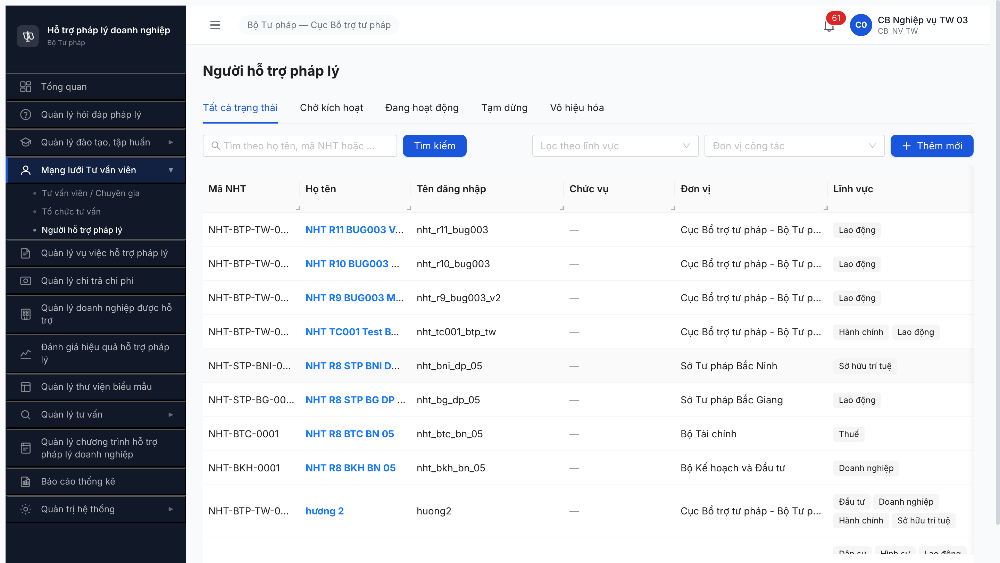
- 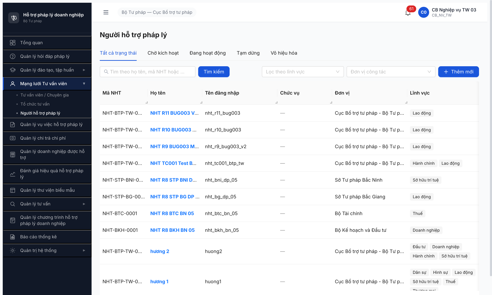

**6. R12 retest 2026-05-09 22:03:43 (UTC+7) — dev claim fix 4 KHÔNG có thay đổi (cross-account `cb_nv_bn_01` BKH + fresh context):**

```html
<!-- Mail body R12 — NHT-BKH-0002 nht_r12_bug003_bn (BN BKH) -->
<p>... (link có hiệu lực vĩnh viễn):<br>
  <a href="http://103.172.236.130/auth/verify-email?token=28f13542-e8e3-42be-827e-c1d82433cb6a">http://103.172.236.130/auth/verify-email?token=28f13542-e8e3-42be-827e-c1d82433cb6a</a><br>
  ...
</p>
```

**Diff R11 vs R12:** giống y hệt cấu trúc — host + raw `=` + anchor wrap đều giữ; port `:3000` vẫn bị thiếu. Test cross-account khác cấp (BN ≠ TW) confirm defect không phụ thuộc role.

```bash
# R12 verify port 80 dead (cb_nv_bn_01)
$ curl -sv -m 5 "http://103.172.236.130/auth/verify-email?token=28f13542-e8e3-42be-827e-c1d82433cb6a" 2>&1 | head -3
*   Trying 103.172.236.130:80...
* connect to 103.172.236.130 port 80 from 192.168.88.102 port 65431 failed: Connection refused
* Failed to connect to 103.172.236.130 port 80 after 7 ms: Couldn't connect to server

# R12 workaround port 3000 OK
$ curl -sI -m 5 "http://103.172.236.130:3000/auth/verify-email?token=28f13542-e8e3-42be-827e-c1d82433cb6a" | head -3
HTTP/1.1 200 OK
Vary: Origin
Content-Type: text/html
```

```
Browser navigate raw link → ERR_CONNECTION_REFUSED (chrome-error://chromewebdata/)
Browser navigate workaround port 3000 → POST /api/v1/auth/verify-email reqid=156 [200] → /login (verify success)
List verify cb_nv_bn_01: NHT-BKH-0002 trangThai sau click chuyển HOAT_DONG ✅ (BE flow đúng spec)
```

**POST create R12 network capture (cb_nv_bn_01):**

```
reqid=187 POST http://103.172.236.130:3000/api/v1/nguoi-ho-tro [201]
reqid=188 GET  http://103.172.236.130:3000/api/v1/nguoi-ho-tro?page=1&pageSize=20 [200]
```

**Screenshots R12:**
- 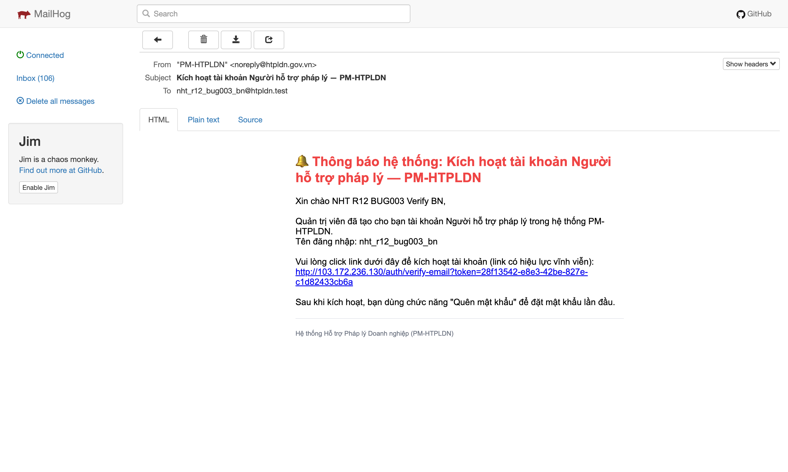
- 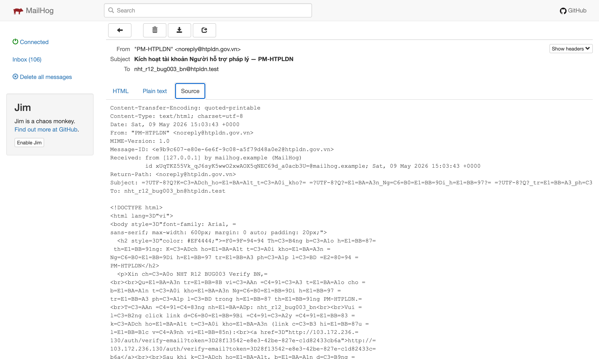
- 
- 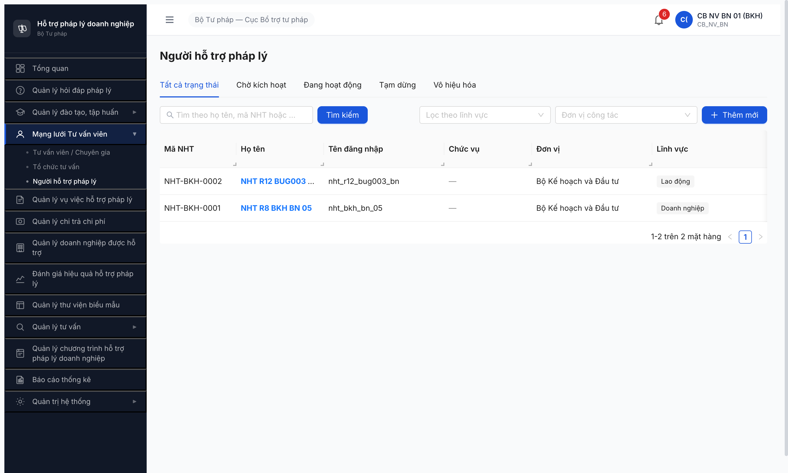
- 

**7. R13 retest 2026-05-09 22:14:50 (UTC+7) — dev claim fix 5 ✅ FIXED 4/4:**

```html
<!-- Mail body R13 — NHT-BKH-0003 nht_r13_bug003_final (BN BKH) -->
<p>... (link có hiệu lực vĩnh viễn):<br>
  <a href="http://103.172.236.130:3000/auth/verify-email?token=d06ac36b-fa28-4bed-91b9-33ebd72d05de">http://103.172.236.130:3000/auth/verify-email?token=d06ac36b-fa28-4bed-91b9-33ebd72d05de</a><br>
  ...
</p>
```

**Diff R12 vs R13:** host + URL `=` raw + anchor wrap đều giữ; **port `:3000` ĐÃ THÊM** — issue cuối đã fix. Mail body 4/4 đầy đủ.

```bash
# R13 verify link nguyên văn từ mail (port 3000 đã có)
$ curl -sI -m 5 "http://103.172.236.130:3000/auth/verify-email?token=d06ac36b-fa28-4bed-91b9-33ebd72d05de" | head -5
HTTP/1.1 200 OK
Vary: Origin
Content-Type: text/html
Cache-Control: no-cache
Etag: W/"351-FqnNWrLtGQJ9x1uoMl0Nw6vOMys"
```

```
Browser navigate link nguyên văn từ mail (KHÔNG cần workaround):
- GET /auth/verify-email?token=d06ac36b-... → 200 (FE render verify page)
- POST /api/v1/auth/verify-email reqid=150 → 200 (BE consume token)
- Redirect → /login (state activated)
- List reload cb_nv_bn_01 → NHT-BKH-0003 trangThai "Đang hoạt động" ✅
```

**POST create R13 network capture (cb_nv_bn_01):**

```
reqid=188 POST http://103.172.236.130:3000/api/v1/nguoi-ho-tro [201]
reqid=189 GET  http://103.172.236.130:3000/api/v1/nguoi-ho-tro?page=1&pageSize=20 [200]
```

**Screenshots R13 (✅ FIXED):**
- 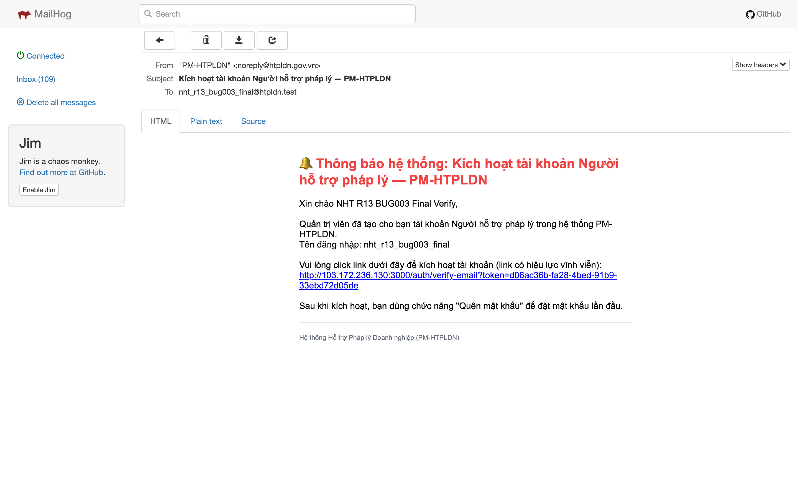
- 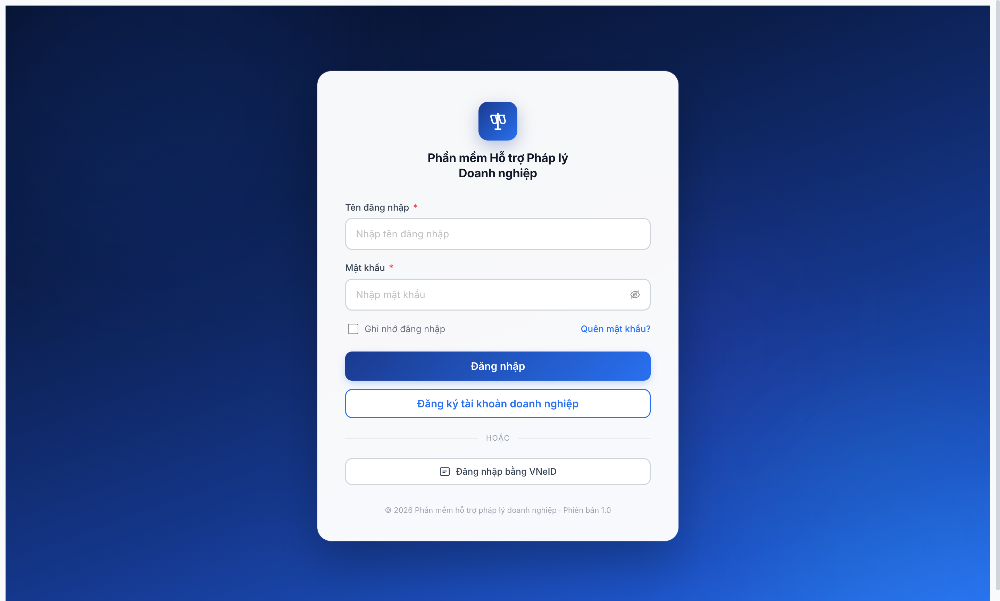
- 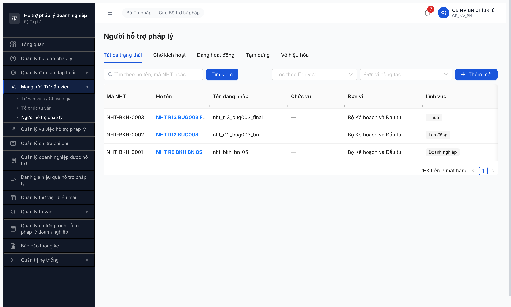

---

## ~~BUG-NHT-004~~ [CLOSED-FIXED] — Detail view NHT thiếu tab "Bồi dưỡng"

> **Re-test 2026-05-09 17:30 (R9 verify):** ✅ PASS — Fix verified. Click `eye` button trên NHT-BTP-TW-0005 `/nguoi-ho-tro/189c86ef-7e04-4dea-a784-1cd762d221f9` → detail page hiển thị **3 tab đầy đủ**: `Thông tin` (selected) / `Bồi dưỡng` / `Vụ việc đã hỗ trợ`. Đúng spec FR-IV-NHT-03. Screenshot: `evidence-r9-verify/r9-bug-004-3-tabs-detail.png`. **Closed.**

### Mô tả

Detail view `/nguoi-ho-tro/{id}` chỉ hiển thị 2 tab: "Thông tin" và "Vụ việc đã hỗ trợ". SRS NHT-017 yêu cầu **3 tab**: Thông tin / Bồi dưỡng / Vụ việc đã hỗ trợ. Tab "Bồi dưỡng" mất → không xem được lịch sử bồi dưỡng NHT (NĐ 55/2019 Đ.7).

### Các bước tái hiện

1. cb_nv_tw_03 vào `/nguoi-ho-tro`
2. Click `eye` button bất kỳ NHT
3. Quan sát số tab trên detail view

### Kết quả mong đợi

- 3 tab: `Thông tin` / `Bồi dưỡng` / `Vụ việc đã hỗ trợ`
- Tab Bồi dưỡng hiển thị danh sách khoá đào tạo NHT đã tham gia (từ FR-III)

### Kết quả thực tế

- 2 tab: `Thông tin` (selected) + `Vụ việc đã hỗ trợ`
- Thiếu tab `Bồi dưỡng` hoàn toàn

### Bằng chứng

Detail view structure (a11y snapshot trích):
```
uid=191_14 tab "Thông tin" selectable selected
uid=191_15 tab "Vụ việc đã hỗ trợ" selectable
[KHÔNG có uid tab "Bồi dưỡng"]
```

(Screenshot detail view không capture riêng — đã verify qua a11y snapshot.)

---

## ~~BUG-NHT-005~~ [CLOSED-FIXED] — FE không hiển thị toast lỗi khi BE reject duplicate username

> **Re-test 2026-05-09 17:50 (R9 verify):** ✅ PASS — Fix verified. Submit modal "Thêm mới" với username trùng `nht_tc001_btp_tw` (đã tồn tại NHT-BTP-TW-0005). Network: `POST /api/v1/nguoi-ho-tro` reqid=2718 → **409 Conflict**. UI: hiển thị toast lỗi "Email hoặc tên đăng nhập đã được sử dụng" (close-circle icon). Screenshot: `evidence-r9-verify/r9-bug-005-toast-duplicate-username.png`. **Closed.**

### Mô tả

Submit form tạo NHT với username trùng (đã tồn tại trong DB) — BE reject (record không được tạo, count list không tăng) nhưng FE đóng modal mà không hiển thị toast/notification để user biết lý do fail. UX: user nghĩ tạo thành công.

### Các bước tái hiện

1. cb_nv_tw_03 đã tạo `nht_tc001_btp_tw` thành công ở NHT-001
2. Click "Thêm mới" lần 2
3. Fill: Họ tên `NHT TC004 Duplicate`, Email `nht_tc004_other@htpldn.test`, Username **`nht_tc001_btp_tw`** (trùng), Lĩnh vực `Thuế`
4. Click "Tạo"
5. Quan sát phản hồi UI

### Kết quả mong đợi

- Theo `ERR-NHT-01`: BE reject với message "Tên đăng nhập đã tồn tại" (hoặc tương đương)
- FE hiện toast `.ant-message-error` / `.ant-notification-error` chứa message lỗi
- Modal giữ nguyên data + highlight field bị conflict
- User biết phải sửa username

### Kết quả thực tế

- Modal đóng ngay sau click "Tạo"
- Không có toast/notification hiển thị (DOM rỗng `.ant-message`, `.ant-notification`, `[role="alert"]`)
- List count giữ nguyên 12 (không tăng 13) → BE đã block đúng
- User không có feedback → nhìn list không thấy record mới mà không biết tại sao

### Bằng chứng

**Verify count không tăng (proof BE đã block):**

```js
// API verify before/after submit duplicate
GET /api/v1/nguoi-ho-tro?size=100
→ before: 12 records
→ after submit duplicate: 12 records (no new TC004)
```

**Verify DOM toast rỗng:**

```js
document.querySelectorAll('.ant-message-error, .ant-notification-error, [role="alert"]')
→ NodeList(0)
```

---

## ~~BUG-NHT-001~~ [CLOSED-INVALID] — QTHT thiếu CRUD UI buttons trên module Người hỗ trợ pháp lý

> **Re-classify 2026-05-09:** ⛔ INVALID — BA chốt QTHT KHÔNG có quyền thêm/sửa/xóa NHT. NHT do CB Nghiệp vụ (cùng đơn vị) quản lý theo NĐ 55/2019 Đ.7. UI ẩn buttons Add/Edit/Delete/Swap với QTHT là **design đúng**. SRS srs-fr-04 §SCR-IV-NHT-01/02 line 1737-1738 + 1781-1782 (ghi "QTHT thêm/sửa/xóa toàn hệ thống") là **outdated** so với BA chốt 2026-05-09 — cần BA update SRS.

### Mô tả (giữ lịch sử)

qtht_03 vào `/nguoi-ho-tro` chỉ thấy button `eye` (xem chi tiết); KHÔNG có "Thêm mới"/Edit/Delete/Swap. cb_nv_tw_03 vào cùng URL hiển thị đầy đủ. Trước đây QA gọi đây là "permission inversion" — sau BA chốt 2026-05-09 đây là **design đúng**.

### Bằng chứng (giữ lịch sử)

**1. View qua qtht_03 (chỉ có Eye — design đúng theo BA chốt):**

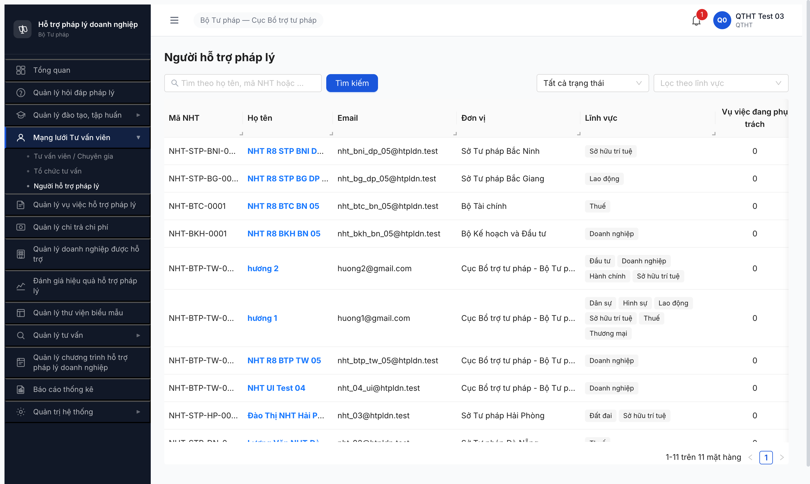

**2. View qua cb_nv_tw_03 (đầy đủ Add/Edit/Delete/Swap — đúng spec):**

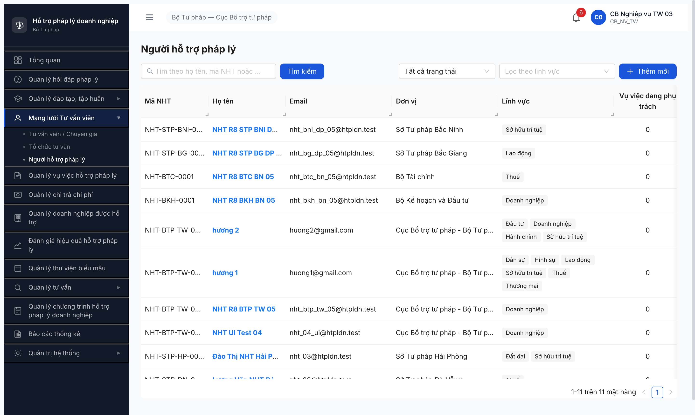

### Permission UI matrix (sau BA chốt 2026-05-09)

| Role | URL | Add btn | Edit btn | Delete btn | Swap btn | Eye btn |
|------|-----|---------|----------|------------|----------|---------|
| qtht_03 (QTHT) | /nguoi-ho-tro | ❌ (đúng) | ❌ (đúng) | ❌ (đúng) | ❌ (đúng) | ✅ |
| cb_nv_tw_03 (CB NV TW) | /nguoi-ho-tro | ✅ | ✅ | ✅ | ✅ (HOAT_DONG only) | ✅ |

---

## ~~BUG-NHT-002~~ [CLOSED-INVALID] — Modal "Thêm NHT" thiếu field "Đơn vị"

> **Re-classify 2026-05-09:** ⛔ INVALID — BA chốt QTHT KHÔNG tạo NHT → yêu cầu "field Đơn vị tự do cho QTHT" không còn applicable. CB NV tạo NHT với đơn vị auto-lock = đơn vị mình (đúng BR-AUTH-08), modal 4 field (Họ tên, Email, Username, Lĩnh vực) là đúng workflow CB NV.

### Mô tả (giữ lịch sử)

Modal "Thêm người hỗ trợ pháp lý" chỉ có 4 field bắt buộc (Họ và tên, Email, Tên đăng nhập, Lĩnh vực chuyên môn). Trước đây QA giả định spec yêu cầu 5 field cho QTHT; sau BA chốt 2026-05-09: QTHT KHÔNG tạo NHT → 4 field là đủ.

### Bằng chứng (giữ lịch sử)

**Modal thêm NHT (4 field — đúng workflow CB NV):**

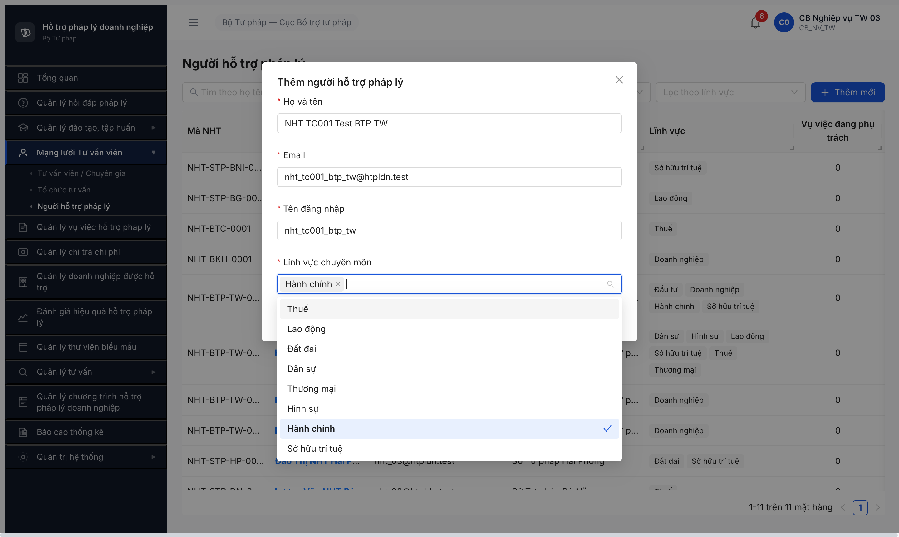

---

## Phụ lục — Môi trường test

| Thành phần | Giá trị |
|------------|---------|
| URL ứng dụng | http://103.172.236.130:3000/ |
| OTP login | `666666` (bypass tạm — dev confirm 2026-04-19) |
| MailHog (OTP/activation inbox) | http://103.172.236.130:8025 |
| API base | http://103.172.236.130:3000/api/v1 |
| Frontend | React + Vite + Ant Design (Modal pattern, button labels Vietnamese) |
| Xác thực | JWT + OTP email |
| Tool test | Chrome DevTools MCP (`mcp__chrome-devtools__*`) |

---

*Bug report generated: 2026-05-08 23:45 (UTC+7) | Re-classify: 2026-05-09 — BA chốt QTHT không có quyền tạo NHT | QA Automation via Claude Code*
