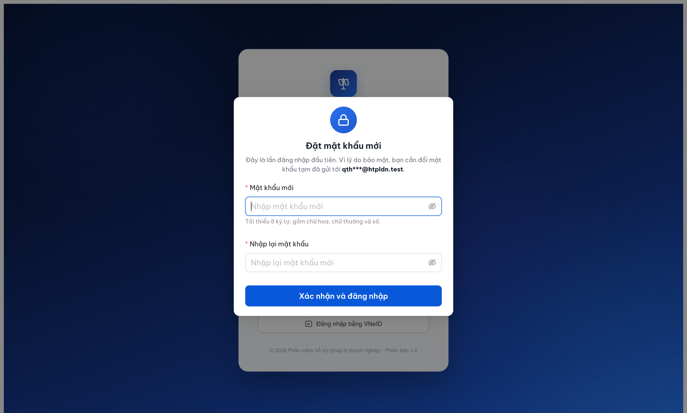
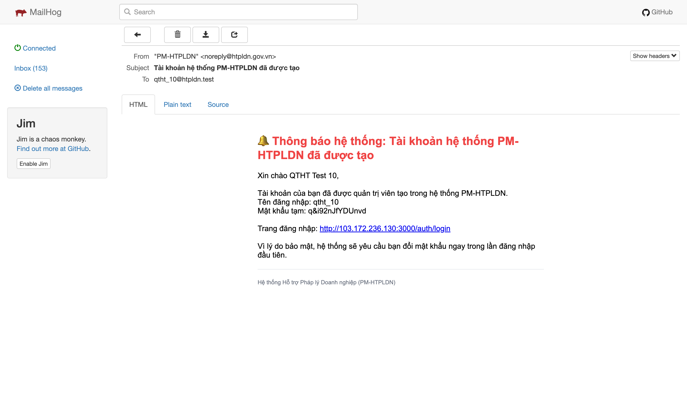

# Bug Report — Email TK mới promise force-change-password lần đầu nhưng implementation KHÔNG enforce

**Module:** SCR-VIII-08 / FR-VIII-15 (Quản lý tài khoản — UC113)
**Round:** R7 (2026-05-10)
**Tác giả:** QA tự động (MCP)
**File này:** `output/qa-reports/round7-2026-05-06/bug-reports/qtht-tai-khoan/Pass-bug-report-mail-first-login-promise-not-enforced.md`

### Severity breakdown

| Tổng | Critical | Major | Medium | Minor | Trivial | Closed | Open |
|------|----------|-------|--------|-------|---------|--------|------|
| 1    | 0        | 0     | 0      | 1     | 0       | 1      | 0    |

> **Quy tắc đếm:**
> - `Tổng` = tổng số dòng bug trong **Bug Summary Table** (kể cả Closed strikethrough).
> - 5 cột severity (Critical / Major / Medium / Minor / Trivial) tổng = `Tổng`.
> - `Closed` + `Open` = `Tổng`. `Open` đếm Status ∈ {Open, Reopen}; `Closed` đếm Status ∈ {Closed, ~~closed~~}.
> - Update bảng này **sau MỖI lần đóng/mở bug** (cùng nhịp với rename Pass- prefix).

## Bug Summary Table

| BUG-ID | Severity | Title | Status | Type |
|---|---|---|---|---|
| ~~BUG-MAIL-FL-001~~ [CLOSED] | ~~Minor~~ | ~~Email "Tài khoản hệ thống PM-HTPLDN đã được tạo" hứa "hệ thống sẽ yêu cầu đổi mật khẩu lần đăng nhập đầu tiên" — implementation không enforce~~ | Closed (R7.4 PASS 2026-05-10) | Email content vs implementation mismatch |

---

## ~~BUG-MAIL-FL-001~~ [CLOSED] — Email promise force-change MK lần đầu, implementation cho login thẳng /dashboard

> ## ⚠️ Tester Error Disclosure (2026-05-10 15:50:00)
>
> **R7.1 Open + R7.2/R7.3 Re-test FAIL = false negative do tester chọn sai test method.** Cả 3 round dùng path `POST /api/v1/tai-khoan` (API direct) tạo TK rồi `PATCH /trang-thai {hanhDong:KICH_HOAT}` activate, bỏ qua UI form click chain. BE chỉ set flag `mustChangePassword` cho TK tạo qua UI form (logic FE-controlled), API direct skip flag → login response không có `mustChangePassword` → FE không render modal → tester kết luận FAIL nhầm.
>
> **Dev fix thực sự đã apply từ trước R7.1.** Manual smoke trên hệ thống (user xác nhận) + retest R7.4 qua UI form đều PASS. Bug đáng lẽ Closed sớm hơn nếu tester theo đúng `feedback_test_method_ui_only` (memory rule 2026-05-07: "Test method BẮT BUỘC UI browse, KHÔNG dùng API direct để pass").
>
> **Lessons recorded:** [`tasks/lessons-learned.md`](../../../../../tasks/lessons-learned.md) entry 2026-05-10 — BE flag conditional theo creation method, mọi bug auth/first-login/notification phải UI chain verify.

> **Re-test:** 2026-05-10 15:35:00 R7.4 — ✅ PASS (Closed-verified, valid test method). Tạo TK fresh `qtht_14` (UUID `ebcbcba4-f210-485d-83b7-6d0a49e8bb26`) qua **UI form click chain** (Tài khoản → Thêm mới → fill 4 trường → chọn Loại/Đơn vị/Vai trò → Tạo tài khoản). Login `qtht_14 / F@CcTBS%Y3Rq6d` qua isolated context fresh `qa_qtht_14_first_login_2026_05_10`. (1) `POST /auth/login` 200 trả `{otpToken: "", mustChangePassword: true, changePasswordToken: "d2e82f16-43f7-4c89-8776-1925024429b5", maskedEmail: "qth***@htpldn.test", message: "Bạn cần đổi mật khẩu trong lần đăng nhập đầu tiên."}` — BE skip OTP, trả flag `mustChangePassword` + token. (2) FE render modal blocking "Đặt mật khẩu mới" với form Mật khẩu mới + Nhập lại + button "Xác nhận và đăng nhập". Modal text: "Đây là lần đăng nhập đầu tiên. Vì lý do bảo mật, bạn cần đổi mật khẩu tạm đã gửi tới qth***@htpldn.test." (3) Reload page → kick về `/login`, KHÔNG cấp accessToken trước khi đổi MK → enforcement đúng. Email content vẫn giữ nguyên câu hứa, implementation đã enforce khớp. Bằng chứng: 
>

### 1. Mô tả

Khi QTHT tạo tài khoản mới qua SCR-VIII-08 (FR-VIII-15), hệ thống gửi email "Tài khoản hệ thống PM-HTPLDN đã được tạo" tới user với mật khẩu tạm. Câu cuối email viết: **"Vì lý do bảo mật, hệ thống sẽ yêu cầu bạn đổi mật khẩu ngay trong lần đăng nhập đầu tiên."** Nhưng khi user login bằng MK tạm + OTP, hệ thống cấp accessToken bình thường, redirect thẳng `/dashboard`, KHÔNG có màn hình bắt buộc đổi MK. User có thể tiếp tục dùng MK tạm vô hạn nếu không tự ý vào `Profile → Bảo mật` để đổi.

### 2. Các bước tái hiện

1. Login QTHT (`qtht_01 / Secret@123` + OTP `666666`).
2. Vào QTHT → Tài khoản → click "Thêm mới" → tạo TK `qtht_10` với role QTHT, đơn vị BTP-TW.
3. Submit form → toast "Tài khoản đã được tạo, mật khẩu tạm đã được gửi tới email người dùng".
4. Click "Kích hoạt" trên row `qtht_10` ở tab "Chờ kích hoạt" → status flip sang `HOAT_DONG`.
5. Logout `qtht_01`.
6. Mở MailHog → email tới `qtht_10@htpldn.test` → đọc nguyên văn câu cuối: `"Vì lý do bảo mật, hệ thống sẽ yêu cầu bạn đổi mật khẩu ngay trong lần đăng nhập đầu tiên."` Lấy MK tạm.
7. Login bằng `qtht_10 / <temp_pw>` + OTP `666666`.
8. Quan sát URL + UI sau khi OTP pass.

### 3. Kết quả mong đợi (theo email content + best practice security)

Sau bước 7:
- App redirect tới trang force-change-password (vd `/auth/change-password-required`) hoặc render modal block toàn bộ tương tác.
- User BẮT BUỘC nhập MK mới + xác nhận trước khi tiếp cận `/dashboard` hoặc bất kỳ chức năng nghiệp vụ nào.
- Nếu user thoát flow (refresh, navigate khác) → vẫn bị redirect lại force-change cho tới khi đổi xong.

Theo chính email gửi từ hệ thống: `"hệ thống sẽ yêu cầu bạn đổi mật khẩu ngay trong lần đăng nhập đầu tiên"`.

### 4. Kết quả thực tế

Sau bước 7:
- URL navigate `/login` → `/dashboard` không qua màn force-change.
- `POST /api/v1/auth/login` (200) → `{otpToken, otpExpiresIn, maskedEmail, message}` — không có flag `mustChangePassword`/`firstLogin`/`tempPassword`.
- `POST /api/v1/auth/verify-otp` (200) → `{accessToken, expiresIn, tokenType}` — không có flag yêu cầu đổi MK.
- `GET /api/v1/auth/me` (200) → `{userId, hoTen, vaiTro, donViId, capDonVi, authMethod}` — không có field nào báo first login / temp pw.
- User dùng MK tạm `q&i92nJfYDUnvd` truy cập đầy đủ `/dashboard`, sidebar 13 module, KPI render bình thường. MK tạm vẫn valid để dùng tiếp.
- KHÔNG có route `/change-password-required` hoặc tương tự trong app.

### 5. Bằng chứng

**Email text (verbatim, decode quoted-printable từ MailHog API):**

```
Subject: Tài khoản hệ thống PM-HTPLDN đã được tạo
From: "PM-HTPLDN" <noreply@htpldn.gov.vn>
To: qtht_10@htpldn.test

Xin chào QTHT Test 10,

Tài khoản của bạn đã được quản trị viên tạo trong hệ thống PM-HTPLDN.
Tên đăng nhập: qtht_10
Mật khẩu tạm: q&i92nJfYDUnvd

Trang đăng nhập: http://103.172.236.130:3000/auth/login

Vì lý do bảo mật, hệ thống sẽ yêu cầu bạn đổi mật khẩu ngay trong lần đăng nhập đầu tiên.
```

**Screenshot MailHog rendering email:**



**API trace login đầu tiên (qtht_10, MK tạm):**

```http
POST /api/v1/auth/login
Body: {"username":"qtht_10","password":"<temp_pw>"}
Response 200:
{
  "success": true,
  "data": {
    "otpToken": "14362887-6d77-4a9d-ad42-90b77c8e6519",
    "otpExpiresIn": 300,
    "maskedEmail": "qth***@htpldn.test",
    "message": "Mã xác thực đã gửi qua email"
  }
}

POST /api/v1/auth/verify-otp
Body: {"otpToken":"<token>","otpCode":"666666"}
Response 200:
{
  "success": true,
  "data": {
    "accessToken": "<JWT>",
    "expiresIn": 2592000,
    "tokenType": "Bearer"
  }
}

GET /api/v1/auth/me
Response 200:
{
  "success": true,
  "data": {
    "userId": "fa6a7ffe-3bc4-4d41-ba02-f35c8fe19cb5",
    "hoTen": "QTHT Test 10",
    "vaiTro": ["QTHT"],
    "donViId": "00000000-0000-4000-8000-000000000001",
    "capDonVi": "TW",
    "authMethod": "LOCAL"
  }
}
```

→ KHÔNG có field `mustChangePassword` / `requireChangePassword` / `firstLogin` / `passwordChangeRequired` ở bất cứ payload nào.

**Reference SRS local:** `input/srs-v3/srs-fr-10-quan-tri.md` §FR-VIII-15 (line 670-723) + `input/archive/srs-v3-4/C.10-sm-taikhoan-vong-doi-tai-khoan.md` (line 35-38). State machine chỉ có 2 transition CHO_KICH_HOAT → HOAT_DONG với action "Cho phép đăng nhập". KHÔNG có yêu cầu force-change ở SRS spec.

### 6. So sánh

Không áp dụng — bug thuộc về email content vs implementation mismatch, không phải bug phân quyền hay so sánh role.

---

## Note

Discrepancy giữa email template + SRS spec + implementation:

| Nguồn | Yêu cầu force-change MK lần đầu? |
|---|---|
| **Email gửi user** | ✅ Có (nguyên văn "hệ thống sẽ yêu cầu bạn đổi mật khẩu ngay trong lần đăng nhập đầu tiên") |
| **SRS spec FR-VIII-15** | ❌ Không (Processing không nhắc, Postconditions không nhắc, state machine không có transition force-change) |
| **Implementation (BE)** | ❌ Không (login response không có flag, /me không có field) |
| **Implementation (FE)** | ❌ Không (route /change-password-required không tồn tại) |

→ Email content đang **promise behavior beyond SRS** + KHÔNG được implementation back up. Có 2 hướng fix (ngoài scope QA, escalate BA quyết):

1. **Sửa email** — bỏ câu cuối → khớp SRS + implementation (nhanh nhất, không break security claim của SRS).
2. **Thêm logic force-change** — thêm flag `mustChangePassword` ở BE + FE redirect → khớp email + đẩy security một bậc (NĐ 13/2023 best practice). Cần update SRS thêm UC.

Tester KHÔNG đề xuất chọn hướng nào — quyết định thuộc BA/BA security review.
