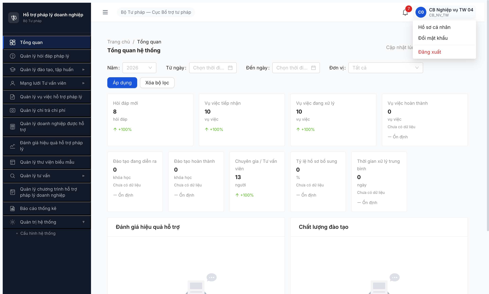

# Bug Report — R7.2.9b Logout UI menu không gọi BE endpoint POST /api/v1/auth/logout

| Thông tin | Giá trị |
|-----------|---------|
| **Dự án** | PM HTPLDN |
| **Môi trường** | http://103.172.236.130:3000 |
| **Người test** | QA Automation via Claude Code |
| **Ngày** | 2026-05-09 10:35:00 |
| **Loại test** | Workflow / Security best-practice |
| **Round** | Round 7 (R7.2.9b) |
| **Tài liệu tham chiếu** | [workflow-test-report-r7-2-9-r7-2-9b-full-35.md](../../workflow/qtht-tai-khoan/workflow-test-report-r7-2-9-r7-2-9b-full-35.md) |

---

## Tổng hợp

Phát hiện **1** lỗi liên quan logout flow qua UI menu trong quá trình test E2E 35 account R7.2.9b.

### Severity breakdown

| Tổng | Critical | Major | Medium | Minor | Trivial | Closed | Open |
|------|----------|-------|--------|-------|---------|--------|------|
| 1    | 0        | 1     | 0      | 0     | 0       | 1      | 0    |

## Bug Summary Table

| Bug ID | Severity | Priority | Type | TC Ref | **SRS Reference** | Title | Status |
|--------|----------|----------|------|--------|-------------------|-------|--------|
| ~~BUG-FR21-LOGOUT-001~~ | Major | P1 | Workflow | R7.2.9b transition giữa account | `FR-VIII-21 §Processing Bước 2-3 + §Postconditions + §Acceptance Criteria` | ~~Click "Đăng xuất" UI menu KHÔNG gọi `POST /api/v1/auth/logout` — BE không có cơ hội blacklist JWT token + ghi audit log "LOGOUT"~~ | **Closed-verified 2026-05-10** |

> **Re-verify 2026-05-10 (sau dev fix):** ✅ **CLOSED.** Account `cb_nv_tw_02` logged in → click avatar dropdown (uid 15_29) → menu mở 3 item ("Hồ sơ cá nhân"/"Đổi mật khẩu"/"Đăng xuất") → click "Đăng xuất" (uid 16_3). Network log `includePreservedRequests=true` capture **`reqid=248 POST /api/v1/auth/logout [200]`** ✅ trước khi FE redirect `/login` + clear `auth-store`. BE đã có cơ hội thực hiện FR-VIII-21 §Processing Bước 2 (blacklist JWT) + Bước 3 (audit log LOGOUT). Sau đó GET `/auth/me` → 401 (session đã invalid BE-side).

---

## BUG-FR21-LOGOUT-001 — Click "Đăng xuất" UI menu không gọi POST /api/v1/auth/logout, BE không thực hiện được Bước 2-3 + Postconditions FR-VIII-21

### Mô tả

User đang đăng nhập, click avatar/tên góc phải mở dropdown → click menu item "Đăng xuất". UI redirect `/login`, localStorage `auth-store` được clear. Nhưng FE KHÔNG gọi endpoint `POST /api/v1/auth/logout` → BE không có cơ hội thực hiện FR-VIII-21 §Processing Bước 2 ("Hủy hiệu lực JWT token, thêm vào danh sách đen") + Bước 3 ("Ghi nhật ký thao tác hành động = 'LOGOUT'"). Vi phạm rõ §Postconditions ("JWT token bị vô hiệu hóa") + Acceptance Criteria ("ghi audit").

### Các bước tái hiện

1. Login vào app: `cb_nv_tw_04` / `Secret@123` + OTP `666666` → vào dashboard.
2. Mở DevTools Network tab, clear log, set "Preserve log".
3. Click avatar/tên user góc phải header (uid 161_25..27 — string "C0" + "CB Nghiệp vụ TW 04" + tag "CB_NV_TW") → dropdown menu hiện 3 item: "Hồ sơ cá nhân" / "Đổi mật khẩu" / "Đăng xuất" (uid 163_1, 163_2, 163_3).
4. Click "Đăng xuất" (uid 163_3).
5. Quan sát Network tab + URL bar.

### Kết quả mong đợi

Theo SRS FR-VIII-21 line 968-989:
- **§Processing Bước 1:** "Nhận yêu cầu đăng xuất (click 'Đăng xuất' hoặc timeout 30 phút)"
- **§Processing Bước 2:** "Hủy hiệu lực JWT token (thêm vào danh sách đen)" — yêu cầu BE call để blacklist
- **§Processing Bước 3:** "Ghi nhật ký thao tác (hành động = 'LOGOUT' hoặc 'SESSION_TIMEOUT')" — yêu cầu BE ghi audit log
- **§Processing Bước 4:** "Xóa phiên/cookie phía client" — FE clear cookie/storage
- **§Processing Bước 5:** "Chuyển hướng về màn hình đăng nhập" — FE redirect /login
- **§Postconditions:** "Phiên làm việc bị hủy" + "JWT token bị vô hiệu hóa (thêm vào danh sách đen)" + "Nhật ký ghi nhận đăng xuất"
- **§Acceptance Criteria:** "Given user chọn 'Đăng xuất' When xử lý Then kết thúc session, **ghi audit**, chuyển về login"

→ FE PHẢI gọi `POST /api/v1/auth/logout` để BE thực hiện được Bước 2 + Bước 3 + ghi audit. Sau đó FE mới clear cookie/storage + redirect.

### Kết quả thực tế

- FE clear localStorage `auth-store` (sau click `auth_store: {"state":{"userInfo":null},"version":0}`) + redirect `/login` → đúng Bước 4 + Bước 5.
- **Network log preserved across navigation** chỉ thấy 1 XHR/fetch: `GET http://103.172.236.130:3000/api/v1/auth/me [401]` — request này chạy SAU navigate `/login` để check auth state, KHÔNG phải logout call.
- **KHÔNG có request `POST /api/v1/auth/logout`** xuyên suốt flow click "Đăng xuất" → redirect `/login` → vi phạm Bước 1-3 §Processing.
- BE không có cơ hội: (a) blacklist JWT token (Bước 2), (b) ghi audit log "LOGOUT" (Bước 3) → vi phạm §Postconditions ("JWT token bị vô hiệu hóa" + "Nhật ký ghi nhận đăng xuất") + §Acceptance Criteria ("ghi audit").
- Cookie HttpOnly `refresh_token` không thấy được qua `document.cookie` (đúng HttpOnly), không thể verify clear status từ FE — nhưng theo network log, BE không có cơ hội xử lý, refresh-token cookie có khả năng cao vẫn còn live tới expire time (TTL 24h theo FR-VIII-20 §Outputs row 3).

### Bằng chứng

**1. Ảnh chụp:**



**2. Network capture sau click "Đăng xuất"** (Chrome DevTools MCP `list_network_requests` với `includePreservedRequests=true`):

```
## Network requests
Showing 1-1 of 1 (Page 1 of 1).
reqid=7587 GET http://103.172.236.130:3000/api/v1/auth/me [401]
```

(Không có `POST /api/v1/auth/logout` — toàn bộ XHR/fetch chỉ có 1 GET /me sau redirect.)

**3. Local state sau logout** (`evaluate_script`):

```json
{
  "cookies_visible_to_js": "",
  "has_access_token_cookie": false,
  "localStorage_keys": ["auth-store"],
  "auth_store": "{\"state\":{\"userInfo\":null},\"version\":0}"
}
```

→ FE-side state đã clear, nhưng BE-side refresh-token chưa được trigger invalidate (do endpoint logout không được gọi).

---

## Phụ lục — Môi trường test

| Thành phần | Giá trị |
|------------|---------|
| URL ứng dụng | http://103.172.236.130:3000 |
| OTP login | `666666` (bypass dev) |
| MailHog (OTP inbox) | http://103.172.236.130:8025 |
| API base | http://103.172.236.130:3000/api/v1 |
| Frontend | React + Vite + Ant Design (state: Zustand + persist localStorage `auth-store`) |
| Xác thực | JWT access-token (memory hoặc HttpOnly cookie) + refresh-token HttpOnly cookie |
| Tool test | Chrome DevTools MCP (`list_network_requests` + `evaluate_script` để inspect cookie & storage state) |

---

*Bug report generated: 2026-05-09 10:35:00 | QA Automation via Claude Code*
