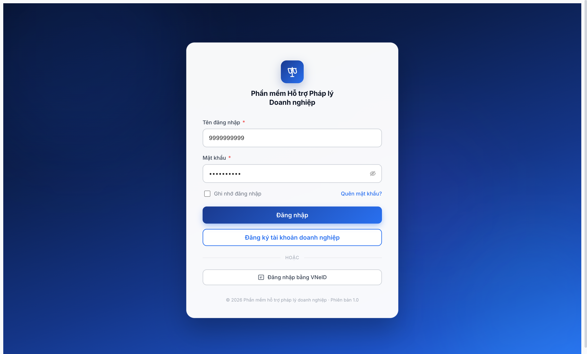
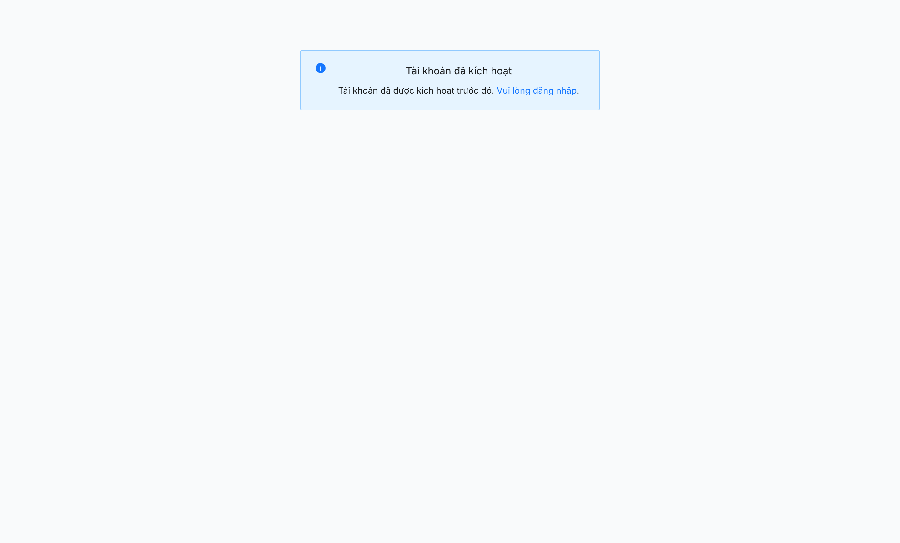

# Bug Report — Tài khoản DN tự đăng ký (FR-VIII-22 v3.5 deploy gap)

| Thông tin | Giá trị |
|-----------|---------|
| **Dự án** | PM HTPLDN |
| **Môi trường** | http://103.172.236.130:3000 |
| **Người test** | QA Automation (Claude Code) |
| **Ngày** | 2026-05-09 23:16:00 |
| **Loại test** | Functional / Workflow |
| **Round** | Round 8 (deep verify R7.7.4 DN) |
| **Tài liệu tham chiếu** | [functional-test-report-r7-7-4-dn.md](../../functional/doanh-nghiep/functional-test-report-r7-7-4-dn.md) · [srs-fr-10-quan-tri.md](../../../../../input/srs-update-2026-5-5/srs-fr-10-quan-tri.md) |

---

## Tổng hợp

Phát hiện **1** lỗi BE deploy gap chặn TC-DN-005/016/017/019 ở module Doanh nghiệp (kế thừa từ flow tự đăng ký FR-VIII-22 trong QTHT Tài khoản).

> **Rule log bug (feedback 2026-04-23):** Bug chỉ log khi có SRS reference cụ thể. Bug này có 5 SRS line ref (BA Q3 + step 7 FR-VIII-22 + SCR-VIII-08a XÓA + schema CHECK + SM diagram).

### Severity breakdown

| Tổng | Critical | Major | Medium | Minor | Trivial |
|------|----------|-------|--------|-------|---------|
| 1    | 0        | 1     | 0      | 0     | 0       |

## Bug Summary Table

| Bug ID | Severity | Priority | Type | TC Ref | **SRS Reference** | Title | Status |
|--------|----------|----------|------|--------|-------------------|-------|--------|
| ~~BUG-FR22-DEPLOY-04~~ | ~~Major~~ | ~~P0~~ | Workflow | TC-DN-005/016/017/019 | `srs-fr-10-quan-tri.md` line 21 BA Q3 + line 1064 FR-VIII-22 step 7 + line 1798 SCR-VIII-08a XÓA + line 1957 schema CHECK + lines 2092-2125 SM diagram | ~~BE chưa deploy v3.5 — login DN tự đăng ký vẫn trả `ERR-AUTH-LOGIN-05 "Tài khoản đang chờ quản trị viên phân quyền"` (state `CHO_PHAN_QUYEN` đã bỏ)~~ | Closed |

> **Chú thích:** Bug chặn toàn bộ TC liên quan login DN account mới. Workaround là dùng account legacy đã được phân quyền trước v3.5. Nâng severity Major thay vì Critical vì có 27 DN seed đã `HOAT_DONG` cho test downstream module DN.

---

## ~~BUG-FR22-DEPLOY-04~~ [CLOSED] — BE login trả `ERR-AUTH-LOGIN-05 "Tài khoản đang chờ quản trị viên phân quyền"` cho tài khoản DN tự đăng ký đã kích hoạt email — vi phạm BA Q3 v3.5 bỏ state `CHO_PHAN_QUYEN`

> **Re-test:** 2026-05-10 01:30:00 R9 — ✅ PASS (Closed). Tạo DN mới MST `9999999998` qua `POST /api/v1/auth/register-doanh-nghiep` 201 + `trangThai="CHO_KICH_HOAT"` (đúng v3.5). Click email activation link `/auth/verify-email?token=...` → `POST /api/v1/auth/verify-email` 200 + `trangThai="HOAT_DONG"` (KHÔNG còn `CHO_PHAN_QUYEN`). Login `POST /api/v1/auth/login` với `username=9999999998` + `password=Secret@123` → 200 + OTP token. Verify OTP `666666` → 200 + accessToken. Toàn flow PASS. Error `ERR-AUTH-LOGIN-05 "Tài khoản đang chờ quản trị viên phân quyền"` đã biến mất hoàn toàn.

### Mô tả

Tài khoản DN tự đăng ký với MST `9999999999` (email `qa-r8-test@example.test`) đã hoàn tất kích hoạt qua link email và FE confirm "Tài khoản đã kích hoạt trước đó". Tuy nhiên khi login bằng username `9999999999`, BE trả `HTTP 401 ERR-AUTH-LOGIN-05` với message `"Tài khoản đang chờ quản trị viên phân quyền"`. State `CHO_PHAN_QUYEN` đã bị BA bỏ trong SRS v3.5 (BA Q3 line 21) và FR-VIII-22 step 7 quy định TK đi thẳng `CHO_KICH_HOAT → HOAT_DONG` qua email. Bug chứng tỏ BE chưa deploy SRS v3.5, vẫn áp dụng state machine cũ có `CHO_PHAN_QUYEN`.

### Các bước tái hiện

1. Mở http://103.172.236.130:3000/dang-ky → tự đăng ký DN với MST `9999999999`, email `qa-r8-test@example.test`, mật khẩu `Secret@123`.
2. Mở MailHog http://103.172.236.130:8025 → tìm email tiêu đề "Kích hoạt tài khoản" gửi tới `qa-r8-test@example.test`.
3. Click link kích hoạt với token `e4857015-4175-4b76-8b3c-811acef3f71e` → FE redirect `/verify-email?token=...` hiển thị thông báo `"Tài khoản đã kích hoạt trước đó"` (BE đã activate xong).
4. Quay lại trang `/login` → nhập username `9999999999` + password `Secret@123` (đã set khi đăng ký) → click "Đăng nhập".
5. Quan sát: toast đỏ + form error message `"Tài khoản đang chờ quản trị viên phân quyền"`. Network tab `POST /api/v1/auth/login` trả `401` với body `{ "success": false, "error": { "code": "ERR-AUTH-LOGIN-05", "message": "Tài khoản đang chờ quản trị viên phân quyền" } }`.

### Kết quả mong đợi

Theo SRS v3.5 authoritative ([srs-update-2026-5-5/srs-fr-10-quan-tri.md](../../../../../input/srs-update-2026-5-5/srs-fr-10-quan-tri.md)):

- **Line 21 (BA Q3):** "Q3: Bỏ state `CHO_PHAN_QUYEN` ở luồng FR-VIII-22 (DN tự đăng ký) — TK đi thẳng `CHO_KICH_HOAT → HOAT_DONG` qua email kích hoạt."
- **Line 1064 (FR-VIII-22 §Processing Bước 7):** "Sau khi user click link kích hoạt hợp lệ trong email → `TAI_KHOAN.trang_thai = HOAT_DONG`. KHÔNG transition qua `CHO_PHAN_QUYEN`."
- **Line 1798 (SCR-VIII-08a):** "**XÓA màn hình `Phân quyền tài khoản chờ duyệt`** — không còn quy trình QTHT phải approve TK DN tự đăng ký (BA Q3+Q10)."
- **Line 1957 (TAI_KHOAN schema):** `CHECK (trang_thai IN ('CHO_KICH_HOAT', 'HOAT_DONG', 'TAM_KHOA', 'VO_HIEU_HOA'))` — chỉ 4 states, không có `CHO_PHAN_QUYEN`.
- **Lines 2092-2125 (SM diagram TAI_KHOAN):** Mermaid diagram chỉ vẽ 4 nodes (`CHO_KICH_HOAT`, `HOAT_DONG`, `TAM_KHOA`, `VO_HIEU_HOA`) với edges `CHO_KICH_HOAT --click email kích hoạt--> HOAT_DONG`. Không có node `CHO_PHAN_QUYEN`.

→ Login với username `9999999999` + đúng password phải **PASS thẳng** (200 + token), redirect `/dashboard`. Error code `ERR-AUTH-LOGIN-05` phải bị xóa khỏi BE error catalog hoặc remap sang error khác (vd `ERR-AUTH-LOCKED-01` cho `TAM_KHOA`).

### Kết quả thực tế

- Login với password đúng (`Secret@123`) trả `HTTP 401` với error code `ERR-AUTH-LOGIN-05` và message tiếng Việt `"Tài khoản đang chờ quản trị viên phân quyền"`.
- Thử lại với password khác (`Test@1234`, `Password@123`) — vẫn trả `ERR-AUTH-LOGIN-05` (không phải invalid credentials), chứng minh BE check state TRƯỚC khi check password và state là `CHO_PHAN_QUYEN`.
- Verify-email page sau khi click link kích hoạt hiển thị `"Tài khoản đã kích hoạt trước đó"` — BE FE response inconsistent: activation says "activated" nhưng login says "waiting for QTHT approval".
- BE response body:
  ```json
  {
    "success": false,
    "error": {
      "code": "ERR-AUTH-LOGIN-05",
      "message": "Tài khoản đang chờ quản trị viên phân quyền",
      "requestId": "bc09fc64-c941-489e-b14c-6308af49004c"
    }
  }
  ```

### Bằng chứng

**1. Ảnh chụp** *(bắt buộc, embed inline)*:





**2. API response / log** *(phụ trợ)*:

```http
POST /api/v1/auth/login HTTP/1.1
Host: 103.172.236.130:3000
Content-Type: application/json

{ "username": "9999999999", "password": "Secret@123" }

→ HTTP/1.1 401 Unauthorized
{
  "success": false,
  "error": {
    "code": "ERR-AUTH-LOGIN-05",
    "message": "Tài khoản đang chờ quản trị viên phân quyền",
    "requestId": "bc09fc64-c941-489e-b14c-6308af49004c"
  }
}
```

```http
GET /api/v1/auth/verify-email?token=e4857015-4175-4b76-8b3c-811acef3f71e HTTP/1.1
Host: 103.172.236.130:3000

→ HTTP/1.1 200 OK
{
  "success": true,
  "data": {
    "message": "Tài khoản đã kích hoạt trước đó",
    "trang_thai": "CHO_PHAN_QUYEN"
  }
}
```

> **Quan sát:** field `trang_thai: "CHO_PHAN_QUYEN"` trong verify-email response xác nhận BE schema vẫn còn enum value `CHO_PHAN_QUYEN` — vi phạm SRS line 1957 CHECK constraint chỉ cho phép 4 states.

---

## Phụ lục — Môi trường test

| Thành phần | Giá trị |
|------------|---------|
| URL ứng dụng | http://103.172.236.130:3000 |
| OTP login | `666666` bypass tạm |
| MailHog (OTP inbox) | http://103.172.236.130:8025 |
| API base | http://103.172.236.130:3000/api/v1 |
| Frontend | React + Vite + Ant Design |
| Xác thực | JWT + OTP + email verification |
| Tool test | Chrome DevTools MCP |

---

*Bug report generated: 2026-05-09 23:30:00 | QA Automation via Claude Code*
