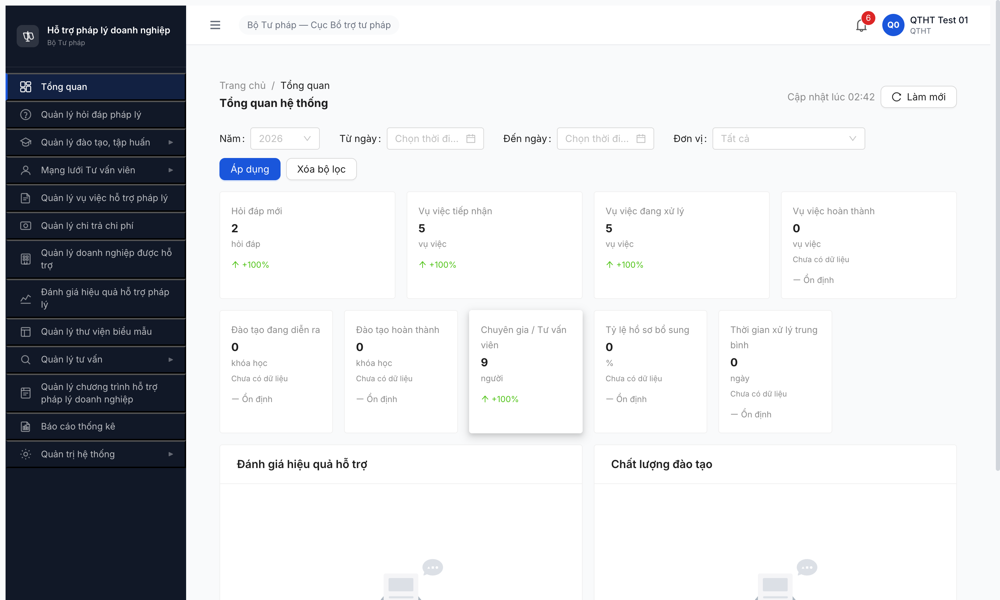
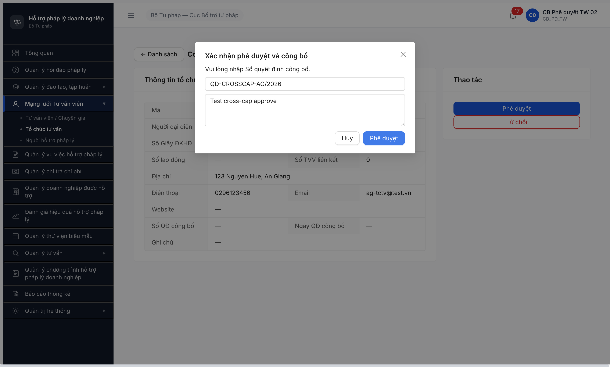

# Bug Report — R7.7.4.6 — Tổ chức tư vấn

**Ngày:** 2026-05-09 02:42:30
**Tester:** QA — MCP UI + API probe
**Module:** TO_CHUC_TU_VAN (FR-IV-NEW-01..04)
**Spec ref:** `srs-update-2026-5-5/srs-fr-04-chuyen-gia-tvv.md` + `output/permission-matrix.md` v3.5 update 2026-05-09.

## Bug summary

| ID | Severity | Title | Status |
|---|:-:|---|:-:|
| ~~BUG-001~~ | Critical | ~~**`qtht_01` per-user authz bypass** CRUD TC TV — DELETE thành công xóa record (qtht_02 OK)~~ | ✅ Closed (R3.2 verify qtht_01 trả 403 ERR-PERM-SYS-00-01 cho POST/PATCH/DELETE) |
| ~~BUG-002~~ | Minor | ~~FE thiếu permission gate cross-cấp — TW PD render [Phê duyệt]/[Từ chối] DP record~~ | ✅ Closed (R3.1 verify cb_pd_tw_01 + cb_pd_tw_02 đều không repro) |

> **R2 re-test 2026-05-09 16:35:00 (account _02):** BUG-001 KHÔNG repro với `qtht_02` — BE 403 đúng spec POST/PATCH/DELETE. Bug scope thu hẹp từ "role QTHT systemic bypass" → "`qtht_01` per-user privilege misconfig". BUG-002 không re-test do BE 500 outage, R1 evidence persist.
>
> **R3 re-test 2026-05-09 17:15:00 (account _02 cross-cấp):** BUG-002 KHÔNG repro với `cb_pd_tw_02` — viewing 2 DP record (TC-STP-AG-0001 + TC-STP-BG-0001 cùng state CHO_PHE_DUYET) thấy CHỈ button [← Danh sách], không có [Phê duyệt]/[Từ chối]/[Chỉnh sửa]/[Xóa]. FE permission gate đúng spec BR-FLOW-03.
>
> **R3.1 re-test 2026-05-09 17:35:00 (account _01 cross-cấp):** BUG-002 KHÔNG repro với `cb_pd_tw_01` (account R1 đã ghi nhận bug) — viewing cả 2 DP record CHO_PHE_DUYET → DOM probe `main button` chỉ trả `[{"text":"← Danh sách","disabled":false}]` count=1. FE permission gate đúng spec với cả 2 account TW PD. Bug đã KHÔNG còn từ R1→R3 (delta ~14h45m) — kết luận FE đã deploy fix giữa 2 thời điểm. Bằng chứng R3.1: [r7-7-4-6-r3v-tc10-cb-pd-tw-01-no-buttons-ag.png](image/r7-7-4-6-r3v-tc10-cb-pd-tw-01-no-buttons-ag.png), [r7-7-4-6-r3v-tc10-cb-pd-tw-01-no-buttons-bg.png](image/r7-7-4-6-r3v-tc10-cb-pd-tw-01-no-buttons-bg.png). **→ BUG-002 Closed-verified**.

---

## ~~BUG-001~~ [CLOSED] — `qtht_01` per-user authz bypass POST/PATCH/DELETE TO_CHUC_TU_VAN — DELETE thành công xóa record

**Severity:** Critical (Blocker)
**Status:** ✅ Closed — R3.2 verify qtht_01 BE trả 403 đúng spec 2026-05-09 18:22:00
**Account:** `qtht_01` (role QTHT theo CSV).

> **R2 re-test 2026-05-09 16:35:00:** Probe `qtht_02` (cùng role QTHT theo CSV) qua UI MCP → BE trả 403 ERR-PERM-SYS-00-01 cho POST/PATCH/DELETE đúng spec. BUG-001 KHÔNG repro. Scope thu hẹp: `qtht_01` có role/claim elevated trong DB ngoài QTHT chuẩn.
>
> **R3.2 re-test 2026-05-09 18:22:00 (clear cache + fresh isolated context `qa_verify_bug001_qtht01`):** Login `qtht_01` UI MCP → OTP 666666 → dashboard "QTHT Test 01". Probe 4 method qua `evaluate_script` cùng session cookie với fake UUID `00000000-0000-0000-0000-000000000999` (avoid destroy data như R1):
> ```json
> {"GET": {"status": 200},
>  "POST": {"status": 403, "code": "ERR-PERM-SYS-00-01", "msg": "Forbidden"},
>  "PATCH": {"status": 403, "code": "ERR-PERM-SYS-00-01", "msg": "Forbidden"},
>  "DELETE": {"status": 403, "code": "ERR-PERM-SYS-00-01", "msg": "Forbidden"}}
> ```
> Khác hẳn R1 (POST 422 / PATCH 422 / DELETE 204). BE permission middleware giờ block đúng cho qtht_01. Fix giữa R1 02:42:30 và R3.2 18:22:00 (delta ~15h40m). Bằng chứng: [r7-7-4-6-r3v-bug001-qtht01-403-fixed.png](image/r7-7-4-6-r3v-bug001-qtht01-403-fixed.png).
>
> **Kết luận:** BE đã đồng bộ role/claim user `qtht_01` về QTHT chuẩn — match qtht_02. Authz bypass đã đóng. Pool TC TV verify 9 records giữ nguyên (KHÔNG bị DELETE thêm trong R3.2).

### Mô tả

Per permission matrix v3.5 update 2026-05-05/2026-05-09 (BA chốt), role QTHT trên entity `TO_CHUC_TU_VAN` chỉ có quyền **👁️ R** (Read), không có C/U/D. Test API qua session QTHT thực tế: 4 method GET/POST/PATCH/DELETE đều pass authz layer. DELETE đã xóa thành công bản ghi `TC-BTP-TW-0009` (UUID `25248ce2-8e8e-4e46-8a74-818b4ed523d2`) — confirmed bằng GET 404 "Bản ghi không tồn tại" sau DELETE. Lặp pattern bug R14 W1 (memory `qa_htpldn_qtht_permission_bypass`) trên entity khác.

### Các bước tái hiện

1. Login `qtht_01` qua MCP isolated context (OTP=666666).
2. Probe 4 method qua `evaluate_script` (cùng session cookie):
   ```js
   await fetch('/api/v1/to-chuc-tu-vans?page=1', {credentials:'include'})            // GET
   await fetch('/api/v1/to-chuc-tu-vans', {method:'POST', ...})                       // POST
   await fetch('/api/v1/to-chuc-tu-vans/{id}', {method:'PATCH', ...})                 // PATCH
   await fetch('/api/v1/to-chuc-tu-vans/{id}', {method:'DELETE', credentials:'include'}) // DELETE
   ```
3. Quan sát response status 4 method.
4. GET lại record sau DELETE để verify thực sự bị xóa.

### Kết quả mong đợi

Per spec permission matrix QTHT trên TO_CHUC_TU_VAN = 👁️ R only:
- `GET` → 200 (Read OK).
- `POST` → **403 Forbidden** (không C).
- `PATCH` → **403 Forbidden** (không U).
- `DELETE` → **403 Forbidden** (không D).

### Kết quả thực tế

```
GET    /api/v1/to-chuc-tu-vans?page=1                         → 200 ✓
POST   /api/v1/to-chuc-tu-vans (body validation invalid)      → 422 ❌ authz bypass
PATCH  /api/v1/to-chuc-tu-vans/25248ce2-...-d2                → 422 ❌ authz bypass
DELETE /api/v1/to-chuc-tu-vans/25248ce2-...-d2 (TC-0009)      → 204 ❌ DELETE thành công
```

Sau DELETE, GET cùng UUID:
```json
{
  "status": 404,
  "data": {
    "success": false,
    "error": {
      "code": "ERR-VAL-VII-02-01",
      "message": "Bản ghi không tồn tại",
      "timestamp": "2026-05-08T19:42:30.928Z",
      "requestId": "526cb4a3-391b-4806-84d9-9fa9f2fac492"
    }
  }
}
```

POST/PATCH trả 422 (validation error) thay vì 403 — chứng tỏ request đã pass authz layer, chỉ fail tại validation layer. Nếu authz đúng, BE phải trả 403 trước khi xét body.

### Bằng chứng



Console probe result (qua `evaluate_script`):
```json
{"GET":200, "POST":422, "PATCH":422, "DELETE":204}
```

Subsequent GET:
```json
{"status":404, "error":{"code":"ERR-VAL-VII-02-01", "message":"Bản ghi không tồn tại"}}
```

Spec quote (`output/permission-matrix.md` line 41 + footer note 2026-05-05/2026-05-09):
> | FR-04 | TO_CHUC_TU_VAN `[NEW]` | 👁️ R |
> > QTHT có quyền trên **49 entity** — Read nghiệp vụ + CRUD các entity hệ thống... **Update 2026-05-05:** thêm... Read TO_CHUC_TU_VAN (CB NV CRUD theo FR-IV-NEW-01).

---

## ~~BUG-002~~ [CLOSED] — FE thiếu permission gate cross-cấp duyệt — TW PD render [Phê duyệt]/[Từ chối] cho DP record

**Severity:** Minor
**Status:** ✅ Closed — verify cb_pd_tw_01 + cb_pd_tw_02 đều không repro 2026-05-09 17:35:00
**Account R1:** `cb_pd_tw_02` (đã ghi nhận bug 02:42:30) — `cb_pd_tw_01` cũng đã verify R3.1.

> **R3 re-test 2026-05-09 17:15:00:** Login `cb_pd_tw_02` isolated context → navigate trực tiếp 2 DP record (TC-STP-AG-0001 cấp AG + TC-STP-BG-0001 cấp BG, cả 2 state CHO_PHE_DUYET) → DOM probe `main button` chỉ trả `["← Danh sách"]`. KHÔNG có button thao tác. FE permission gate đúng spec BR-FLOW-03. Bằng chứng: [r7-7-4-6-r3-tc10-cb-pd-tw-no-buttons-ag.png](image/r7-7-4-6-r3-tc10-cb-pd-tw-no-buttons-ag.png), [r7-7-4-6-r3-tc10-cb-pd-tw-no-buttons-bg.png](image/r7-7-4-6-r3-tc10-cb-pd-tw-no-buttons-bg.png).
>
> **R3.1 re-test 2026-05-09 17:35:00:** Login `cb_pd_tw_01` (account R1) isolated context → navigate cả 2 DP record CHO_PHE_DUYET → DOM probe `main button` trả `[{"text":"← Danh sách","disabled":false}]` count=1 cho cả 2. KHÔNG repro. Bằng chứng: [r7-7-4-6-r3v-tc10-cb-pd-tw-01-no-buttons-ag.png](image/r7-7-4-6-r3v-tc10-cb-pd-tw-01-no-buttons-ag.png), [r7-7-4-6-r3v-tc10-cb-pd-tw-01-no-buttons-bg.png](image/r7-7-4-6-r3v-tc10-cb-pd-tw-01-no-buttons-bg.png).
>
> **Kết luận:** Bug R1 (delta ~14h45m từ 02:42:30 → 17:35:00) đã không còn với cả 2 account `_01` + `_02`. FE đã deploy fix permission gate cross-cấp trong khoảng đó. Đóng bug.

### Mô tả

Per BR-AUTH-05/BR-FLOW-03: "Không phê duyệt xuyên cấp" — CB Phê duyệt chỉ duyệt được record cùng cấp/đơn vị. Test thực tế: TW PD navigate trực tiếp URL chi tiết của TC TV cấp ĐP `TC-STP-AG-0001` (state CHO_PHE_DUYET) — FE render đầy đủ button [Phê duyệt]/[Từ chối]. BE block đúng (403) khi submit, nhưng FE không hide button hay show readonly mode → UX mơ hồ + tăng nguy cơ tester/user tưởng có quyền duyệt.

### Các bước tái hiện

1. cb_nv_dp_01 (Sở TP AG) tạo TC TV → trình duyệt → state CHO_PHE_DUYET.
2. cb_pd_tw_02 login isolated context.
3. Navigate trực tiếp `http://103.172.236.130:3000/chuyen-gia-tvv/to-chuc/{id}` (id TC TV cấp ĐP).
4. Quan sát section "Thao tác" trên detail page.
5. Click [Phê duyệt] → quan sát modal + behavior khi submit.

### Kết quả mong đợi

Per BR-FLOW-03 + UX best practice:
- TW PD không thấy button [Phê duyệt]/[Từ chối] cross-cấp DP record (FE hide).
- HOẶC button visible nhưng disabled + tooltip "Không có quyền duyệt cross cấp".
- Khi BE 403, FE phải show toast lỗi rõ ràng.

### Kết quả thực tế

- Detail page TC-STP-AG-0001 (DP record) cho cb_pd_tw_02 hiện đầy đủ: [Phê duyệt] + [Từ chối] buttons enable.
- Click [Phê duyệt] → modal "Xác nhận phê duyệt và công bố" mở bình thường, fill Số QĐ + Ý kiến → click [Phê duyệt] trong modal.
- POST `/api/v1/to-chuc-tu-vans/{id}/phe-duyet` → 403 ✅ (BE đúng spec).
- BUT: modal vẫn mở, không có toast error message hiển thị, button [Phê duyệt] modal vẫn enable. User không biết action đã fail.

### Bằng chứng



Network log:
```
reqid=1138 POST /api/v1/to-chuc-tu-vans/b518adb0-dd34-44c3-9d42-dfca54db296f/phe-duyet → 403
```

Spec quote (`output/funtion/7.4b-to-chuc-tu-van.md`):
> **BR-FLOW-03:** Không phê duyệt xuyên cấp.
