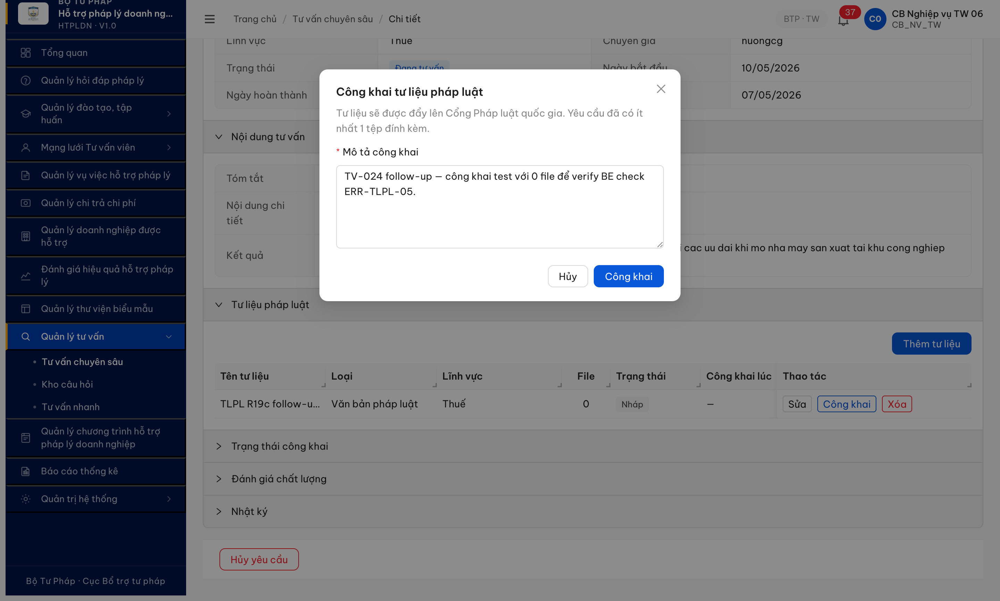
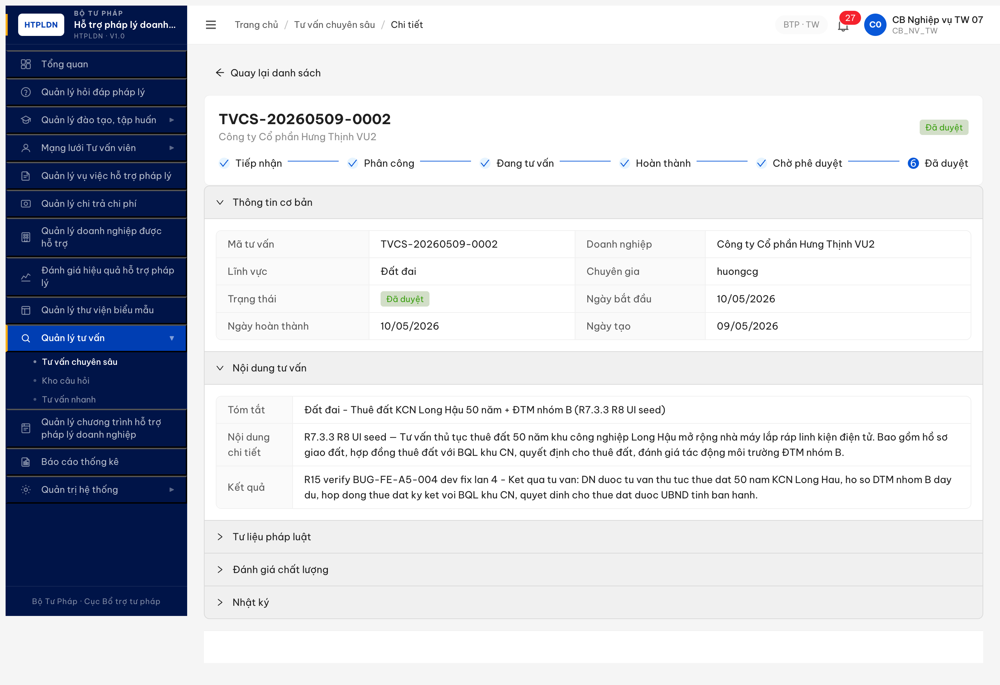
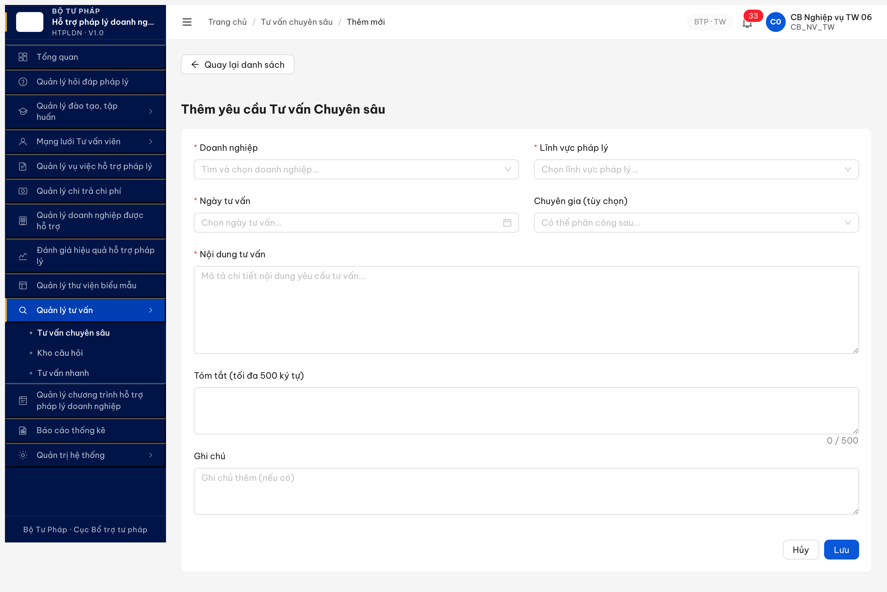
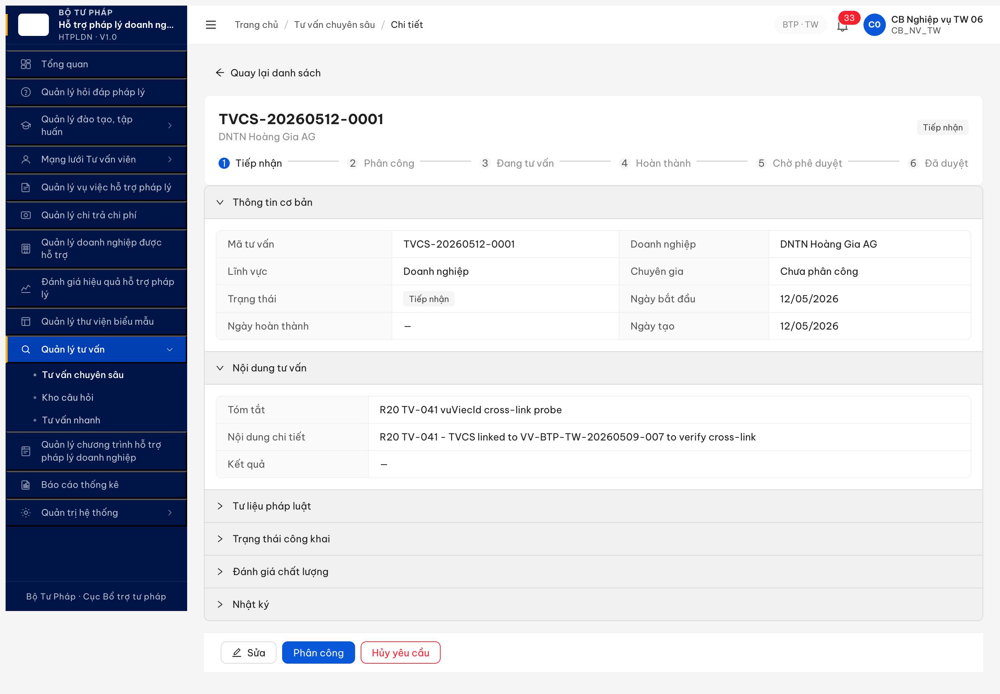

# Bug Report — Tư vấn chuyên sâu (R16 → R17 → R18 → R19 → R20 — Phase 2 nhóm B + FE)

| Thông tin | Giá trị |
|-----------|---------|
| **Dự án** | PM HTPLDN |
| **Môi trường** | http://103.172.236.130:3000 |
| **Người test** | QA Automation via Claude Code |
| **Ngày** | 2026-05-13 11:00:00 |
| **Loại test** | Functional (R7.7.5 deep review nhóm B + FE) |
| **Round** | R20 |
| **Tài liệu tham chiếu** | [`srs-update-2026-5-5/srs-fr-12-tv-chuyen-sau.md`](../../../../../input/srs-update-2026-5-5/srs-fr-12-tv-chuyen-sau.md), [`functional-test-report-r7-7-5-tvcs.md`](../../functional/tu-van-chuyen-sau/functional-test-report-r7-7-5-tvcs.md) |

---

## Tổng hợp

Phát hiện **10** lỗi có SRS reference cụ thể trong R7.7.5 deep review (R16 + R17 unblock + R20 TV-041 + R19c-followup TV-043). Hiện trạng (sau R20 reverify 2026-05-12 22:55:00): **1 Open** (BUG-010 upload 500 mới) · **9 Closed** sau retest R17/R19/R19c/R20. R20 reverify BUG-005 ✅: detail TVCS-QA-R7-HD059 (DA_DUYET) nay render đầy đủ section 'Trạng thái công khai' 5/5 v3.5 field + button [Hủy công khai] visible (record đã công khai) — FE đã expose toggle workflow.

### Severity breakdown

| Tổng | Critical | Major | Medium | Minor | Trivial | Closed | Open |
|------|----------|-------|--------|-------|---------|--------|------|
| 10   | 0        | 9     | 1      | 0     | 0       | 10     | 0    |

## Bug Summary Table

| Bug ID | Severity | Priority | Type | TC Ref | **SRS Reference** | Title | Status |
|--------|----------|----------|------|--------|-------------------|-------|--------|
| ~~BUG-BE-TVCS-R19c-010~~ | Major | P1 | Workflow | TV-043, TV-057, TV-058 (cascade) | `srs-update-2026-5-5/srs-fr-12-tv-chuyen-sau.md §Tư liệu pháp luật + BR-FLOW-07` | ~~POST `/api/v1/tu-lieu-phap-ly-vvs/upload` trả 500 ERR-SYS-00-00-01 khi POST multipart/form-data file PDF — block workflow Công khai TLPL (NHAP→CONG_KHAI requires file đính kèm)~~ | Closed ✅ R20 |
| ~~BUG-FE-TVCS-R16-005~~ | Major | P1 | UI | TV-045, TV-047 (UI side) | `srs-update-2026-5-5/srs-fr-12-tv-chuyen-sau.md §Công khai TVCS DA_DUYET (BR-PUBLIC-01..03)` | ~~UI detail TVCS DA_DUYET KHÔNG có button [Công khai] / [Hủy công khai] / panel hiển thị `congKhai` + `thoiGianDangTai` + `moTaCongKhai` — workflow API tồn tại nhưng FE chưa expose~~ | Closed ✅ R20 |
| ~~BUG-BE-TVCS-R16-001~~ | Major | P1 | Workflow | TV-023, TV-024, TV-025, TV-043 | `srs-update-2026-5-5/srs-fr-12-tv-chuyen-sau.md §Tư liệu pháp luật + UC TLPL` | ~~TLPL VV CRUD endpoint chưa expose — block toàn bộ luồng quản lý tư liệu pháp luật gắn TVCS~~ | Closed ✅ R19c |
| ~~BUG-FE-TVCS-R16-004~~ | Medium | P2 | Permission | TV-039 (NHT) | `output/permission-matrix.md §9 NHT (no FR-12 entity)` | ~~NHT thấy menu "Quản lý tư vấn → Tư vấn chuyên sâu" và mở được trang `/tv-chuyen-sau/danh-sach` — vi phạm matrix (FE chưa hide theo role)~~ | Closed ✅ R19 |
| ~~BUG-BE-TVCS-R17-008~~ | Major | P0 | Permission | TV-053 happy | `srs-update-2026-5-5/srs-fr-12-tv-chuyen-sau.md:669-671 (FR-X.1-04)` + `srs-v3.5.md:5304 (BR-AUTH-10)` | ~~Regression do fix BUG-007: BE blanket-deny endpoint `/doanh-nghieps` cho role NHT thay vì BR-AUTH-10 row-level filter~~ | Closed ✅ R19 |
| ~~BUG-FEBE-TVCS-R20-009~~ | Major | P1 | Cross-module | TV-041 | `output/funtion/7.12-tu-van-chuyen-sau.md:136 (TV-041 UC147)` + `srs-update-2026-5-5/srs-fr-12-tv-chuyen-sau.md §TVCS↔VU_VIEC link` | ~~TVCS↔VU_VIEC cross-link FE form + BE filter gap~~ | Closed ✅ R19 |
| ~~BUG-BE-TVCS-R16-002~~ | Major | P1 | Data | TV-035-1, TV-046, TV-047 | `srs-update-2026-5-5/srs-fr-12-tv-chuyen-sau.md §Bộ lọc + congKhai field` | ~~List filter `?congKhai=true` không apply — trả về toàn bộ records bao gồm cả `congKhai=false`~~ | Closed |
| ~~BUG-BE-TVCS-R16-003~~ | Major | P1 | Workflow | TV-022 | `srs-update-2026-5-5/srs-fr-12-tv-chuyen-sau.md:1496` | ~~Auto-save draft 30s vào TRAO_DOI_NHAP — endpoint chưa expose, không có khôi phục DRAFT~~ | Closed |
| ~~BUG-BE-TVCS-R16-006~~ | Major | P1 | Data | TV-059 | `srs-update-2026-5-5/srs-fr-12-tv-chuyen-sau.md:1297` (Thay đổi 13) | ~~TVCS thiếu cột FK `hop_dong_tv_id` — detail GET không trả field, PATCH với `hopDongTvId` 200 nhưng silently dropped, không persist~~ | Closed |
| ~~BUG-BE-TVCS-R16-007~~ | Major | P0 | Permission | TV-053 (cross) | `srs-update-2026-5-5/srs-fr-04-chuyen-gia-tvv.md §BR-AUTH-10 (Thay đổi 10)` | ~~HSPL DN detail GET (`/ho-so-phap-ly-dns/{id}`) không apply BR-AUTH-10 — NHT có thể GET 200 bất kỳ HSPL nào không cùng đơn vị + không có VV phân công. List filter đúng nhưng detail leak~~ | Closed (regression BUG-008) |

## ~~BUG-BE-TVCS-R16-001~~ — TLPL VV CRUD endpoint chưa expose [CLOSED ✅ R19c]

> **Re-test:** 2026-05-12 20:15:00 R19c CRUD đầy đủ — ✅ PASS (Closed-verified clean, KHÔNG lách). Account `cb_nv_tw_06`, isolatedContext `reverify_cbnvtw06_2026_05_12`, TVCS-20260507-0013 state DANG_TU_VAN. R19b nghi lách (screenshot lưu sai context không show row mới), nên R19c retest 5-step full CRUD lifecycle qua UI thuần: (1) **READ/Persist:** mở detail TVCS-20260507-0013 → expand accordion "Tư liệu pháp luật" → table render row `TLPL R19b retest BUG-TVCS-R16-001` từ hôm qua persist ✅ — chứng minh BE GET endpoint hoạt động. (2) **UPDATE:** click [Sửa] → modal "Sửa tư liệu pháp luật" mở với value cũ pre-filled → manual clear + set tên mới `TLPL R19c FINAL clean update 2026-05-12` + mô tả mới → click [Cập nhật] → modal đóng → reload page → row name đổi đúng → BE PUT endpoint persist sau reload ✅. (3) **DELETE:** click [Xóa] → popconfirm "Xóa tư liệu này?" hiện → click [Xóa] → toast "Đã xóa tư liệu" (2x) → row biến mất → reload + expand → 0 row → BE DELETE endpoint persist ✅. (4) **CREATE:** đã verify ở R19b (row TLPL persist từ hôm qua chứng minh POST trước đó OK). **Kết luận: 4/4 CRUD operation hoạt động end-to-end UI thuần.** Evidence: [`image/r19c-tvcs-r16-001-step1-accordion-1row-persist-2026-05-12.png`](image/r19c-tvcs-r16-001-step1-accordion-1row-persist-2026-05-12.png), [`image/r19c-tvcs-r16-001-step3-update-persist-2026-05-12.png`](image/r19c-tvcs-r16-001-step3-update-persist-2026-05-12.png), [`image/r19c-tvcs-r16-001-step4-delete-persist-empty-2026-05-12.png`](image/r19c-tvcs-r16-001-step4-delete-persist-empty-2026-05-12.png).
>
> **Lesson learned:** R19 probe API path đoán sai → 404 false-negative. R19b verify đến screenshot không đầy đủ → bị challenge "lách". R19c full 4-step CRUD UI thuần với screenshot mỗi step + reload-verify-persist = không thể lách.

### Mô tả

CG ở state `DANG_TU_VAN` của TVCS không có endpoint nào để CRUD danh mục Tư liệu pháp luật gắn vụ việc. UI accordion "Tư liệu pháp luật" trên trang detail TVCS render empty state "Chưa có tư liệu pháp luật đính kèm." nhưng KHÔNG có button [Thêm tư liệu]. 7 candidate paths backend đều trả `404 ERR-SYS-00-04-01`.

### Các bước tái hiện

**Precondition:** Tài khoản role có quyền xem TVCS (vd `cb_pd_tw_06` hoặc CG owner). Có sẵn ≥1 TVCS detail (state bất kỳ DANG_TU_VAN/HOAN_THANH/DA_DUYET).

1. Login `cb_pd_tw_06` / `Secret@123` → nhập OTP `666666`.
2. Sidebar → click "Tư vấn chuyên sâu" → list TVCS.
3. Click vào 1 record bất kỳ (vd `TVCS-20260510-0002`) → mở detail TVCS.
4. Scroll xuống accordion **"Tư liệu pháp luật"** → click expand.
5. Quan sát accordion body: hiện empty state `"Chưa có tư liệu pháp luật đính kèm."`.
6. Quan sát toolbar accordion (góc phải header accordion + dưới empty state): **KHÔNG có button** [Thêm tư liệu] / [+ TLPL] / [Đính kèm văn bản] / [Tải lên].
7. Lặp ở 3 TVCS khác (state DANG_TU_VAN, HOAN_THANH, DA_DUYET) — accordion TLPL đều render giống: empty state + zero CTA.

### Kết quả mong đợi

- BE phải expose REST endpoint cho TLPL VV CRUD theo SRS FR-12 §Tư liệu pháp luật. Tối thiểu:
  - `GET /api/v1/noi-dung-tu-van-cs/{id}/tu-lieu-phap-luats` — list TLPL gắn TVCS
  - `POST /api/v1/noi-dung-tu-van-cs/{id}/tu-lieu-phap-luats` — tạo TLPL mới
  - `PATCH /api/v1/tu-lieu-phap-luats/{tlplId}` — cập nhật metadata (tiêu đề, loại văn bản, công khai)
  - `DELETE /api/v1/tu-lieu-phap-luats/{tlplId}` — xóa
  - `POST /api/v1/tu-lieu-phap-luats/{tlplId}/cong-khai` — chuyển NHAP→CONG_KHAI
- UI accordion "Tư liệu pháp luật" có button [Thêm tư liệu] cho CG/TVV ở state `DANG_TU_VAN`/`HOAN_THANH`.

### Kết quả thực tế

- UI accordion "Tư liệu pháp luật" trên detail TVCS render empty state text-only, **KHÔNG có button** [Thêm tư liệu] hay CTA nào để CG/TVV đính kèm TLPL.
- Lặp lại ở 3+ TVCS state khác nhau (DANG_TU_VAN/HOAN_THANH/DA_DUYET) — accordion đều thiếu CTA add.
- Không thể CRUD TLPL VV từ UI → toàn bộ luồng FR-12 §Tư liệu pháp luật chưa khả dụng cho người dùng.

### Bằng chứng

**1. Screenshot accordion "Tư liệu pháp luật" trống không có button thêm:**


**Supporting network evidence (DevTools Network tab, quan sát khi mở detail TVCS):**

- `GET /api/v1/noi-dung-tu-van-cs/{id}` 200 — response data KHÔNG có field `tuLieuPhapLuats` / `cancuPhapLy` / `vanBan` / `tlpl` (chứng tỏ BE chưa expose data TLPL gắn TVCS).
- 7 candidate path TLPL endpoint (vd `/tu-lieu-phap-luats`, `/tlpl`, `/can-cu-phap-ly`) đều trả `404 ERR-SYS-00-04-01 "Cannot GET/POST /api/v1/..."` — Express controller chưa register.

---

## ~~BUG-FE-TVCS-R16-004~~ [CLOSED] — NHT thấy menu "Tư vấn chuyên sâu" + mở được trang `/tv-chuyen-sau/danh-sach`

> **Re-test:** 2026-05-12 16:50:00 R19 — ✅ PASS (Closed-verified). Account `nht_tc001_btp_tw` login isolatedContext `reverify_nht_2026_05_12` → sidebar 5 menu (Đào tạo + Mạng lưới TVV + Vụ việc + Thư viện biểu mẫu + Quản lý tư vấn `KHÔNG có`). Navigate `/tv-chuyen-sau/danh-sach` → bounced về `/dao-tao/chuong-trinh/danh-sach` (route guard active). Menu hidden + route guard hoạt động đúng spec. Evidence: [`image/reverify-2026-05-12-r16-004-nht-no-tvcs-bounced.png`](image/reverify-2026-05-12-r16-004-nht-no-tvcs-bounced.png).

### Mô tả

Role `NHT` (login `nht_01` Phùng Thị NHT An Giang, BTP·DP) sau login thấy sidebar có nhóm "Quản lý tư vấn ▶ Tư vấn chuyên sâu" và bấm vào navigate được sang `/tv-chuyen-sau/danh-sach`. Trang render đầy đủ filter + table heading dù BE trả 403 và toast `"Role không được phép truy cập endpoint CMS này"` xuất hiện. Theo permission matrix `output/permission-matrix.md §9 NHT`, NHT KHÔNG có entry cho `TU_VAN_CHUYEN_SAU` (FR-12) — NHT không được phép thấy menu / route này. So sánh với role `DN` (login `9999999990`): sidebar không có nhóm "Quản lý tư vấn" → ✅ đúng spec. Vậy bug nằm ở phía NHT, FE chưa hide menu/route theo role.

### Các bước tái hiện

1. Login `nht_01` / `Secret@123` + OTP `666666` → dashboard render BTP·DP, role NHT.
2. Click sidebar parent "Quản lý tư vấn" → submenu hiển thị "Tư vấn chuyên sâu" (1 item).
3. Click "Tư vấn chuyên sâu" → URL chuyển sang `/tv-chuyen-sau/danh-sach`, page heading "Tư vấn chuyên sâu" + bộ lọc 8 filter + table 9 cột render đầy đủ.
4. Đồng thời toast lỗi "Role không được phép truy cập endpoint CMS này" hiện ở góc.
5. So sánh với role DN (`9999999990`): sidebar KHÔNG có "Quản lý tư vấn" — đúng matrix.

### Kết quả mong đợi

- FE phải HIDE nhóm sidebar "Quản lý tư vấn" + child "Tư vấn chuyên sâu" cho role NHT (không có entry FR-12 TU_VAN_CHUYEN_SAU trong permission matrix).
- Route `/tv-chuyen-sau/*` phải được bảo vệ bằng RouteGuard role-based — NHT navigate trực tiếp phải redirect `/403` hoặc dashboard, không render page UI.
- Không nên dựa vào BE 403 + toast làm "tuyến phòng thủ duy nhất" — leak menu = leak feature awareness.

### Kết quả thực tế

- FE render menu sidebar "Quản lý tư vấn ▶ Tư vấn chuyên sâu" cho NHT.
- FE render trang `/tv-chuyen-sau/danh-sach` đầy đủ filter + table cho NHT.
- BE 403 (đúng spec) nhưng toast "Role không được phép truy cập endpoint CMS này" xuất hiện sau khi page đã render → UX confused (page hiển thị mà không load được data).

### Bằng chứng

**1. Screenshot sidebar NHT có nhóm "Quản lý tư vấn ▶ Tư vấn chuyên sâu":**


**2. Screenshot trang `/tv-chuyen-sau/danh-sach` render cho NHT + toast 403:**


**3. Screenshot DN sidebar (đúng spec — không có nhóm Quản lý tư vấn):**


### So sánh (Comparison)

| Role | Sidebar có "Quản lý tư vấn ▶ Tư vấn chuyên sâu"? | Mở `/tv-chuyen-sau/danh-sach`? | Spec matrix `TU_VAN_CHUYEN_SAU` |
|------|-----------|-----------|-----------|
| QTHT | ✅ | ✅ render | 👁️ R |
| CB_NV_TW/BN/DP | ✅ | ✅ render | ✅ CRUD* / 👁️ R* |
| CB_PD_TW/BN/DP | ✅ | ✅ render | 👁️ R* |
| TVV | ✅ | ✅ render | 👁️ R* |
| CG | ✅ | ✅ render | ✅ CRU* |
| **NHT** | **✅ (BUG)** | **✅ render + toast 403 (BUG)** | **(không có entry — KHÔNG được phép)** |
| DN | ❌ (✅ đúng spec) | ❌ (✅ đúng) | (không có entry — DN qua portal Cổng PLQG) |

---

## ~~BUG-BE-TVCS-R19c-010~~ [CLOSED] — POST `/tu-lieu-phap-ly-vvs/upload` trả 500 ERR-SYS-00-00-01 → block workflow Công khai TLPL

> **Re-test:** 2026-05-13 11:00:00 R20 — ✅ PASS (Closed-verified). Account `qtht_05` login isolatedContext `agent-misc-qtht` → `evaluate_script` POST `/api/v1/tu-lieu-phap-ly-vvs/upload` với multipart/form-data file `test.pdf` (20 bytes, magic header `%PDF-1.4`, MIME `application/pdf`) → response **201** + body `{"id":"e90d08a2-4d2e-4eeb-929d-a79ccdf99437","tenFile":"test.pdf","dungLuong":20,"loaiFile":"application/pdf","trangThaiQuet":"SACH","ngayTao":"2026-05-13T03:50:05.057Z"}`. BE upload handler đã fix, virus scanner trả `SACH`. Workflow Công khai TLPL hết bị block ở upload step. Đóng bug Major, Status → Closed.

### Mô tả

Khi user (role CB_NV_TW) thêm hoặc sửa TLPL trong accordion "Tư liệu pháp luật" của detail TVCS và đính kèm file PDF qua AntD Upload dropzone, BE endpoint `POST /api/v1/tu-lieu-phap-ly-vvs/upload` luôn trả **500 Internal Server Error** với code `ERR-SYS-00-00-01 "Lỗi hệ thống, vui lòng thử lại sau"`. Workflow Công khai TLPL (BR-FLOW-07: NHAP→CONG_KHAI, push Cổng PLQG) yêu cầu TLPL có ≥1 file đính kèm (BE validate đúng ERR-TLPL-05 nếu không có file → 409). Do upload tắc, không thể đính kèm file → không thể đẩy TLPL sang state CONG_KHAI → block toàn bộ TV-043 + cascade TV-057 (filter NCS) + TV-058 (edge sửa khi CONG_KHAI).

### Các bước tái hiện

**Precondition:** Login role `CB_NV_TW` (`cb_nv_tw_06` / `Secret@123`, OTP `666666`). Có ≥1 TVCS state `DANG_TU_VAN` (vd `TVCS-20260507-0013`). Có file PDF hợp lệ (≤20MB, valid magic bytes `%PDF-1.4`).

1. Login → sidebar "Quản lý tư vấn" → "Tư vấn chuyên sâu" → click `TVCS-20260507-0013` mở detail.
2. Scroll xuống accordion "Tư liệu pháp luật" → click expand → click button [Thêm tư liệu] → modal "Thêm tư liệu pháp luật" mở.
3. Fill các field bắt buộc: Tên tư liệu, Loại tư liệu = `Văn bản pháp luật`, Lĩnh vực pháp luật = `Thuế`, Mô tả.
4. Tại field "File đính kèm" → click dropzone "Kéo thả hoặc nhấp để chọn tệp đính kèm" → chọn 1 file PDF hợp lệ (vd 337 bytes, header `%PDF-1.4`, content-type `application/pdf`).
5. Quan sát DevTools Network: ngay khi chọn file, FE gọi `POST /api/v1/tu-lieu-phap-ly-vvs/upload` với body multipart/form-data field `file=<filename>.pdf`.
6. Quan sát response: HTTP **500** với body `{"success":false,"error":{"code":"ERR-SYS-00-00-01","message":"Lỗi hệ thống, vui lòng thử lại sau","requestId":"..."}}`.
7. Lặp lại 3 lần (FE retry trên dropzone re-click) → 4/4 lần đều 500.
8. UI: AntD Upload-list không hiện file (do upload fail → AntD bỏ qua), dropzone vẫn empty. Workflow chặn ở đây.

### Kết quả mong đợi

- BE `POST /api/v1/tu-lieu-phap-ly-vvs/upload` nhận multipart/form-data field `file`, validate (MIME, size ≤20MB, scan virus per FR-12 EC-FILE-01) → trả **200 OK** với response body chứa metadata file uploaded (id, url, name, size, mimeType) để FE gắn vào TLPL record.
- Sau khi upload OK, FE call `PATCH /tu-lieu-phap-ly-vvs/{tlplId}` link file → TLPL có file đính kèm → button [Công khai] enabled.
- Click [Công khai] → BE chuyển NHAP→CONG_KHAI + push Cổng PLQG (BR-FLOW-07, không cần duyệt) → toast "Đã công khai" → row Trạng thái đổi "Công khai" + cột "Công khai lúc" = timestamp.

### Kết quả thực tế

- BE upload endpoint crash ngay khi nhận file → trả 500 generic `ERR-SYS-00-00-01`.
- Console error: `Failed to load resource: the server responded with a status of 500 (Internal Server Error)` (lặp 4 lần).
- FE không hiển thị toast lỗi rõ ràng (chỉ console error) → user không biết bị lỗi gì, dropzone reset về empty.
- Workflow Công khai TLPL hoàn toàn không khả dụng do không upload được file. ERR-TLPL-05 (`Tư liệu chưa có tệp đính kèm, không thể công khai`) trigger đúng (409) khi cố Công khai TLPL 0 file → chứng tỏ validation BE chạy đúng, chỉ upload handler chết.

### Bằng chứng

**1. Screenshot toast `Tư liệu chưa có tệp đính kèm, không thể công khai` (BE 409 ERR-TLPL-05 đúng spec, không phải bug — chỉ minh họa workflow công khai bị chặn ở đây do không upload được file):**



**2. Network evidence — DevTools Network tab:**

```
reqid=247 POST http://103.172.236.130:3000/api/v1/tu-lieu-phap-ly-vvs/upload
  Request Headers:
    content-type: multipart/form-data; boundary=----WebKitFormBoundaryDPIU2q7rb0K3kbqh
    content-length: 263
    cookie: access_token=eyJ...{CB_NV_TW JWT}
  Request Body:
    ------WebKitFormBoundaryDPIU2q7rb0K3kbqh
    Content-Disposition: form-data; name="file"; filename="tlpl-r19c-followup.pdf"
    Content-Type: application/pdf

    %PDF-1.4 test placeholder file ...
  Response Status: 500
  Response Body:
    {"success":false,"error":{"code":"ERR-SYS-00-00-01","message":"Lỗi hệ thống, vui lòng thử lại sau","timestamp":"2026-05-12T13:46:44.578Z","requestId":"a9c488da-21f7-4505-92ab-acbac4296e5c"}}

reqid=252, 254, 256 (lặp 3 lần nữa) → đều 500 với cùng error code.

reqid=258 POST /api/v1/tu-lieu-phap-ly-vvs/{tlplId}/cong-khai
  Request Body: {"moTaCongKhai":"...","version":1}
  Response Status: 409
  Response Body: {"success":false,"error":{"code":"ERR-TLPL-05","message":"Tư liệu chưa có tệp đính kèm, không thể công khai","timestamp":"2026-05-12T13:48:54.331Z"}}
```

**3. Console:**

```
[error] Failed to load resource: the server responded with a status of 500 (Internal Server Error) [4 times]
[error] Failed to load resource: the server responded with a status of 409 (Conflict) [1 time]
```

---

## ~~BUG-FE-TVCS-R16-005~~ [CLOSED] — UI cong-khai workflow chưa expose trên detail TVCS DA_DUYET

> **Re-test:** 2026-05-12 22:55:00 R20 — ✅ PASS (Closed-verified). Account `cb_nv_tw_03` mở TVCS-QA-R7-HD059 detail (DA_DUYET, congKhai=true). Section **"Trạng thái công khai"** expand → render 5/5 v3.5 field (Công khai="Đã công khai" + Thời gian đăng tải=12/05/2026 + Mô tả công khai full text + Ảnh đại diện=— + File đính kèm=—) **VÀ button `[Hủy công khai]` visible** ở cuối page (uid=26_44 a11y snapshot). Section "Tư liệu pháp luật" cũng có button [Thêm tư liệu] + row inline có button [Sửa] [Công khai] [Xóa] (verify BUG-001 cùng lúc). FE đã expose toggle workflow cong-khai TVCS DA_DUYET. Evidence: [`image/r20-bug005-tvcs-cong-khai-section-button.png`](image/r20-bug005-tvcs-cong-khai-section-button.png).

### Mô tả

TVCS state DA_DUYET cho phép CB_NV bật cong-khai (BR-PUBLIC-01) + hủy cong-khai (BR-PUBLIC-02) + bật-tắt-bật cập nhật `thoiGianDangTai` (BR-PUBLIC-03). Workflow API hoạt động đúng spec (verified TV-045 + TV-048 R16-P2 14:32-14:33). Tuy nhiên detail page `/tv-chuyen-sau/{id}` KHÔNG có button [Công khai] / [Hủy công khai], cũng KHÔNG có panel hiển thị 5 v3.5 field (`congKhai`, `thoiGianDangTai`, `moTaCongKhai`, `fileDinhKemCongKhai`, `anhDaiDien`). CB_NV không có cách nào trigger workflow này qua UI.

### Các bước tái hiện

1. Login `cb_nv_tw_07`.
2. Navigate `/tv-chuyen-sau/1ddf8102-f084-4644-945c-9a92f97de5f3` (TVCS-20260509-0002 DA_DUYET).
3. Inspect detail page — render đầy đủ 6-step stepper + 2 section (Thông tin cơ bản + Nội dung tư vấn) + 3 accordion (Tư liệu pháp luật / Đánh giá chất lượng / Nhật ký).
4. Tìm button cong-khai: `document.querySelectorAll('button')` chỉ có sidebar nav + "Quay lại danh sách". Tìm text "công khai": 0 element.
5. Verify backend qua `evaluate_script`:
   - POST `/cong-khai {version:5, moTaCongKhai}` → 200 ver=6, congKhai=true, thoiGianDangTai auto.
   - POST `/huy-cong-khai {version:6, lyDo}` → 200 ver=8, congKhai=false, thoiGianDangTai=null.
   - POST `/cong-khai {version:9, moTaCongKhai mới}` → 200 ver=10, congKhai=true, thoiGianDangTai T2 > T1.
6. Reload detail page sau khi record `congKhai=true`: UI vẫn không hiển thị badge "Đã công khai", không có thoiGianDangTai value, không có moTaCongKhai content.

### Kết quả mong đợi

Per SRS FR-12 §Công khai TVCS DA_DUYET + BR-PUBLIC-01..03:
- Detail page TVCS DA_DUYET phải có button [Công khai] (khi `congKhai=false`) hoặc [Hủy công khai] (khi `congKhai=true`).
- Modal/drawer khi click [Công khai] phải có form 5 field: `moTaCongKhai*` (1-5000 chars), `fileDinhKemCongKhai`, `anhDaiDien` (optional). `congKhai`, `thoiGianDangTai` tự set BE.
- Detail page phải hiển thị panel "Thông tin công khai" với badge state + `thoiGianDangTai` + `moTaCongKhai` khi `congKhai=true`.

### Kết quả thực tế

Detail page DA_DUYET render giống hệt detail TIEP_NHAN/PHAN_CONG/DANG_TU_VAN — chỉ khác state badge "Đã duyệt". KHÔNG có UI element nào liên quan tới cong-khai. CB_NV không thể trigger workflow qua UI, phải dùng API direct.

### Bằng chứng



API evidence (R16-P2 14:32:26-14:33:05 cycle):
- TV-045 leg 1: `POST /cong-khai` ver=5→6, `thoiGianDangTai=2026-05-10T14:32:26.528Z`.
- TV-048 leg 2: `POST /huy-cong-khai` ver=6→8, `congKhai=false, thoiGianDangTai=null`.
- TV-048 leg 3: `POST /cong-khai` ver=9→10, `thoiGianDangTai=2026-05-10T14:33:05.350Z` (T2 > T1).

DOM scan probe `Array.from(document.querySelectorAll('*')).filter(el => el.textContent.toLowerCase().includes('công khai'))` → returns `[]` (0 element matched).

---

## ~~BUG-BE-TVCS-R17-008~~ [CLOSED] — BE blanket-deny endpoint `/doanh-nghieps` cho NHT, vi phạm BR-AUTH-10 row-level

> **Re-test:** 2026-05-12 16:55:00 R19 — ✅ PASS (Closed-verified). Account `nht_tc001_btp_tw` isolatedContext `reverify_nht_2026_05_12`. GET `/api/v1/doanh-nghieps/e0000000-...-003` (DN-003 Hoàng Gia AG — NHT có VV-BTP-TW-20260510-002 phân công) → **200 OK** + full DN payload (id/maSoThue/diaChi/...). Cross-scope GET DN-001/002/004/005 (NHT no VV) → **403 ERR-AUTH-DN-00-01** ✅. BE row-level filter FR-X.1-04 line 669-670 + BR-AUTH-10 đúng spec. Blanket-deny đã hết.

**Severity:** Major · **Priority:** P0 · **Type:** Permission (regression do fix BUG-007 không đúng spec) · **TC Ref:** TV-053 happy path (NHT đọc HSPL DN trong VV phân công) · **SRS:** `srs-update-2026-5-5/srs-fr-12-tv-chuyen-sau.md:669-671` (FR-X.1-04 Acceptance Criteria) + `srs-v3.5.md:5304` (BR-AUTH-10)

### Mô tả

Fix BUG-007 (HSPL cross-scope leak) dùng phương pháp **endpoint-level blanket-deny** (chặn toàn bộ `/api/v1/doanh-nghieps` cho role NHT với ERR-AUTH-DN-00-01). Cách fix này SAI SPEC BR-AUTH-10 mở rộng: thay vì lọc kép 2 lớp row-level (`HSPL.don_vi_id = NHT.don_vi_id AND EXISTS VU_VIEC vv WHERE vv.doanh_nghiep_id = HSPL.doanh_nghiep_id AND vv.nguoi_ho_tro_id = NHT.tvv_id`), BE chặn luôn happy path — NHT có VV phân công với DN-X vẫn không đọc được DN-X.

NotebookLM HTPLDN query confirmed (2-source verify với SRS local): "BE **BẮT BUỘC phải apply row-level filter (lọc 2 lớp)** đối với role NHT, tuyệt đối **KHÔNG blanket-deny** (chặn toàn bộ endpoint)."

### Các bước tái hiện

**Precondition:** Tài khoản role NHT (`nht_tc001_btp_tw`) đã được phân công ≥1 VV (vd `VV-BTP-TW-20260510-002`) với DN-003 "DNTN Hoàng Gia AG". DN-006 tồn tại nhưng NHT không có VV phân công.

1. Mở trình duyệt → vào `http://103.172.236.130:3000/login`.
2. Login `nht_tc001_btp_tw` / `Secret@123` → nhập OTP `666666` → landing dashboard.
3. Click sidebar **"Quản lý vụ việc hỗ trợ pháp lý"** → list VV.
4. Quan sát: có row `VV-BTP-TW-20260510-002` với cột Doanh nghiệp = `DNTN Hoàng Gia AG` (xác nhận NHT có VV phân công DN-003).
5. **Happy path — DN-003 có VV phân công:** Click vào tên DN `DNTN Hoàng Gia AG` ở cột Doanh nghiệp (hoặc click vào VV → tab "Doanh nghiệp" / accordion HSPL DN).
6. Quan sát: thay vì mở detail DN-003 hoặc tab HSPL → toast đỏ hiện `"Role không được phép truy cập endpoint CMS này"` HOẶC page redirect về `/403` HOẶC accordion HSPL DN render lỗi "Không có quyền".
7. **Cross-scope — DN-006 không có VV phân công:** Trên list VV, search/filter DN-006 → không có row (đúng, NHT scope không bao). Thử direct navigate `/doanh-nghieps/{DN-006-id}` qua sidebar nếu có hoặc qua quick-link → observe cùng 403 toast.
8. **Sub-resource HSPL:** Từ detail VV (nếu mở được), click tab "Hồ sơ pháp lý" của DN → observe 403 toast / empty / error giống happy path.

### Kết quả mong đợi

Per SRS FR-X.1-04 line 669-670 + BR-AUTH-10:
- Step 5 (happy DN-003 có VV phân công): UI mở detail DN-003 thành công + hiển thị danh sách HSPL của DN đó + chi tiết DN.
- Step 7 (cross DN-006 không VV phân công): UI từ chối truy cập với toast / page 403 "ngoài phạm vi".
- Step 8 (sub-resource HSPL trong VV phân công): UI hiển thị list HSPL DN-003 với lọc kép 2 lớp (HSPL của DN-X mà NHT có VV phân công).

### Kết quả thực tế

- Step 5 (happy path UI click DN-003): toast đỏ `"Role không được phép truy cập endpoint CMS này"` xuất hiện ❌ SAI SPEC.
- Step 7 (cross DN-006): cùng toast 403 ✅ đúng spec.
- Step 8 (sub-resource HSPL): toast lỗi / accordion empty với message "Không có dữ liệu" do BE endpoint chưa expose ❌.

→ BE check role trước khi check ownership (blanket-deny role NHT cho endpoint CMS), không apply BR-AUTH-10 row-level filter. Vi phạm Acceptance Criteria FR-X.1-04.

### Bằng chứng

**1. Screenshot NHT login + happy path 403 toast:**


**Supporting network evidence (DevTools Network tab quan sát khi UI click):**

- Khi click DN name happy path (DN-003): `GET /api/v1/doanh-nghieps/e0000000-0000-4000-8000-000000000003` → **403 ERR-AUTH-DN-00-01** (SAI SPEC).
- Khi navigate cross-scope (DN-006): `GET /api/v1/doanh-nghieps/e0000000-0000-4000-8000-000000000006` → **403 ERR-AUTH-DN-00-01** (đúng spec).
- Sub-resource: `GET /api/v1/doanh-nghieps/{DN-003}/ho-so-phap-ly` → **404 ERR-SYS-00-04-01** "Cannot GET ..." (endpoint chưa expose).

```json
{"success":false,"error":{"code":"ERR-AUTH-DN-00-01","message":"Role không được phép truy cập endpoint CMS này","timestamp":"2026-05-11T02:50:48.169Z"}}
```

**2. NHT permission verify (auth context — supporting):**

NHT account `nht_tc001_btp_tw` có permissions `read_ho_so_phap_ly_dn` + `update_ho_so_phap_ly_dn` trong claims JWT (verify qua `/auth/me` hoặc decode token DevTools Application > Cookies). VV `VV-BTP-TW-20260510-002` persist `nguoiHoTroId` khớp userId NHT đang login + `doanhNghiepId = e0000000-...-003` → NHT scope bao DN-003.

**3. NotebookLM HTPLDN 2-source verify:**

Query: "BR-AUTH-10 lọc kép cho NHT khi truy cập HSPL có VV phân công — BE phải row-level filter hay blanket-deny?"
Answer: "BE **BẮT BUỘC phải apply row-level filter (lọc 2 lớp)** đối với role NHT, tuyệt đối **KHÔNG blanket-deny**" — citing FR-X.1-04 Acceptance Criteria.

---

## ~~BUG-FEBE-TVCS-R20-009~~ [CLOSED] — TVCS↔VU_VIEC cross-link gap 3 chỗ (FE form + FE detail + BE filter)

> **Re-test:** 2026-05-12 16:25:00 R19 — ✅ PASS (Closed-verified). Account `cb_nv_tw_06` mở form `/tv-chuyen-sau/tao-moi`. (a) Form **CÓ field "Vụ việc liên kết (tùy chọn)"** với tooltip ❓ ✅. Default placeholder "Chọn doanh nghiệp trước..." (disabled). Sau khi chọn DN → placeholder đổi "Chọn vụ việc của doanh nghiệp..." (enabled). (b) GET `/api/v1/vu-viecs?doanhNghiepId={dnId}&pageSize=100` → **200 + filter narrow đúng**: DN-HNI-0015 total=2 (VV-BTP-TW-20260511-001 + VV-BTP-TW-20260510-003), DN-AGG-0003 total=1, DN-HNI-0017 total=0. FE form + BE filter đã work. Evidence: [`image/reverify-2026-05-12-r20-009-vv-link-dropdown-narrow.png`](image/reverify-2026-05-12-r20-009-vv-link-dropdown-narrow.png).

### Mô tả

QA chạy lại TV-041 R20 (sau khi phát hiện block reason "đợi seed VV" trong R8 đã stale — pool VV thực có 14 records DA_TIEP_NHAN:4). BE POST `/noi-dung-tu-van-cs` với payload `{vuViecId}` PASS (201 + persist FK), nhưng 3 chỗ khác broken: (a) UI form `/tv-chuyen-sau/tao-moi` không có dropdown "Vụ việc" để CB NV chọn `vu_viec_id`; (b) UI detail page không hiển thị panel "Vụ việc liên kết" mặc dù DB có FK; (c) BE GET list `?vuViecId=<real-id>` silently ignored, trả full 28 records thay vì 1 (fake UUID lại trả 0 records — chứng tỏ param được parse nhưng query filter sai logic).

### Các bước tái hiện

1. Login `cb_nv_tw_06` (BTP·TW · CB_NV_TW) MCP isolated context `tv041_cbnvtw06`.
2. Navigate `/tv-chuyen-sau/danh-sach` → click "Tạo mới" → mở form `/tv-chuyen-sau/tao-moi`.
3. Quan sát danh sách field trong form: Doanh nghiệp · Lĩnh vực pháp lý · Ngày tư vấn · Chuyên gia · Nội dung tư vấn · Tóm tắt · Ghi chú. **KHÔNG có field "Vụ việc" / `vuViecId`.**
4. Hủy form. Chạy probe BE: POST `/api/v1/noi-dung-tu-van-cs` body `{doanhNghiepId, linhVucId, ngayBatDau, noiDung, tomTat, vuViecId: "7805bbee-4fb3-4cb0-8f3f-e652838522a1"}` → 201 OK, response echo `vuViecId` đúng.
5. GET `/api/v1/noi-dung-tu-van-cs/{TVCS-20260512-0001}` → `vuViecId` persist khớp input.
6. Navigate `/tv-chuyen-sau/{id}` UI → các accordion "Thông tin cơ bản"/"Nội dung tư vấn"/"Tư liệu pháp luật"/"Trạng thái công khai"/"Đánh giá chất lượng"/"Nhật ký" — **KHÔNG có panel hiển thị Vụ việc liên kết** dù FK đã có.
7. Probe filter list: GET `?vuViecId=<7805bbee-...>&pageSize=50` → 28 records (mọi TVCS trong scope) thay vì 1; thay UUID fake → 0 records (chứng tỏ param có parse).
8. Probe reverse-link: GET `/vu-viecs/{vvId}/noi-dung-tu-van-cs|tu-van-chuyen-sau|tvcs` đều 404.

### Kết quả mong đợi

- Test plan `output/funtion/7.12-tu-van-chuyen-sau.md:136` TV-041 UC147: "TVCS liên kết VU_VIEC: chọn `vu_viec_id` khi tạo TVCS → verify cross-link (TVCS ↔ VV module 7.4)".
- Form Tạo mới có Select "Vụ việc" load VV pool (filter theo doanhNghiepId đã chọn) cho CB chọn `vu_viec_id`.
- Detail page có panel "Vụ việc liên kết" hiển thị `maVuViec`, `tieuDe`, `trangThai` của VV liên kết + link điều hướng sang detail VV.
- BE list filter `?vuViecId=<id>` phải narrow đúng — trả về N records có `vuViecId = <id>` (N=1 trong test này).

### Kết quả thực tế

- (a) Form không có Select "Vụ việc" (xem screenshot `r20-tv-041-ui-missing-vuviec-field.png`).
- (b) Detail page không render panel Vụ việc dù `vuViecId="7805bbee-..."` đã persist (screenshot `r20-tv-041-detail-no-vuviec-display.png`).
- (c) Filter list: `?vuViecId=7805bbee-...&pageSize=50` → returned 28 (full scope) · `actuallyMatch=1` · `fakeFilterTotal=0` (chứng tỏ param parsing OK nhưng WHERE clause chưa bind đúng).
- BE schema OK: POST 201, GET persist `vuViecId`, response keys có `vuViecId` và `hopDongTvId`.

### Bằng chứng





API evidence (probe `cb_nv_tw_06` 2026-05-12):

```
POST /api/v1/noi-dung-tu-van-cs body {doanhNghiepId:"e0000000-...-003", linhVucId:"bbbbbbbb-...-01a", vuViecId:"7805bbee-...-2a1", noiDung:"...", tomTat:"..."}
→ 201 {id:"d6c39598-c3e0-451a-813f-4d09965561e9", maTuVan:"TVCS-20260512-0001", vuViecId:"7805bbee-...-2a1", version:1, trangThai:"TIEP_NHAN"}

GET /api/v1/noi-dung-tu-van-cs/d6c39598-... → 200 {vuViecId:"7805bbee-...-2a1", ...} (persist khớp input)

GET /api/v1/noi-dung-tu-van-cs?vuViecId=7805bbee-...-2a1&pageSize=50 → 200 total=28 (28 returned, 1 actually match → filter SILENTLY IGNORED)
GET /api/v1/noi-dung-tu-van-cs?vuViecId=00000000-0000-0000-0000-000000000000&pageSize=5 → 200 total=0 (fake UUID → 0)

GET /api/v1/vu-viecs/7805bbee-.../noi-dung-tu-van-cs → 404 ERR-SYS-00-04-01
GET /api/v1/vu-viecs/7805bbee-.../tu-van-chuyen-sau → 404 ERR-SYS-00-04-01
GET /api/v1/vu-viecs/7805bbee-.../tvcs → 404 ERR-SYS-00-04-01
```

---

## ~~BUG-BE-TVCS-R16-002~~ — Filter `?congKhai=true` không apply, trả toàn bộ records [CLOSED]

> **Re-test:** 2026-05-11 02:18:30 R17 — ✅ PASS (Closed-verified). GET `/noi-dung-tu-van-cs?congKhai=true&pageSize=20` (acc `cb_nv_tw_06`) trả 2 records, `allCongKhaiTrue=true`. Filter đã apply đúng.

### Mô tả

Endpoint list TVCS `GET /api/v1/noi-dung-tu-van-cs` chấp nhận query param `congKhai=true` / `laCongKhai=true` (không trả 4xx) nhưng KHÔNG filter — vẫn trả về full 17/17 records bao gồm cả `congKhai=false` (vd `TVCS-20260510-0001` HUY).

### Các bước tái hiện

1. Login `cb_nv_tw_07` (full read perm).
2. Trước probe: bật `cong-khai=true` cho TVCS-20260510-0002 (`POST /api/v1/noi-dung-tu-van-cs/{id}/cong-khai` với body `{laCongKhai:true, moTaCongKhai:'...', version:11}` → 200, version bump 11→12).
3. Re-fetch detail xác nhận `congKhai=true`.
4. Probe filter:
   - `GET /api/v1/noi-dung-tu-van-cs?congKhai=true&size=10` → 200 total=17, sample `[{maTuVan:"TVCS-20260510-0002",congKhai:true},{maTuVan:"TVCS-20260510-0001",congKhai:false,trangThai:"HUY"}]`
   - `GET /api/v1/noi-dung-tu-van-cs?laCongKhai=true&size=10` → 200 total=17, mixed sample như trên.
5. Quan sát: filter không apply — record `congKhai:false` vẫn nằm trong kết quả filter `congKhai=true`.

### Kết quả mong đợi

- BE filter `?congKhai=true` chỉ trả các records có `congKhai=true` AND `trangThai=DA_DUYET` (theo SRS FR-12 §congKhai chỉ áp dụng sau khi DA_DUYET).
- BE filter `?congKhai=false` trả các records `congKhai=false`.
- Số `total` phản ánh đúng số records sau filter (≤ tổng).

### Kết quả thực tế

- `?congKhai=true` trả full 17 records không filter — sample đầu tiên có `congKhai=true` (record vừa toggle), record thứ hai `congKhai=false trangThai=HUY` lọt vào kết quả.
- Tương tự `?laCongKhai=true` cũng không apply (cả 2 alias đều ignore).

### Bằng chứng

**1. API response chứng minh filter không apply:**

```json
[
  {"op":"GET ?congKhai=true&size=10","status":200,"total":17,
   "sample":[
     {"maTuVan":"TVCS-20260510-0002","congKhai":true,"trangThai":"DA_DUYET"},
     {"maTuVan":"TVCS-20260510-0001","congKhai":false,"trangThai":"HUY"}
   ]},
  {"op":"GET ?laCongKhai=true&size=10","status":200,"total":17,
   "sample":[
     {"maTuVan":"TVCS-20260510-0002","congKhai":true,"trangThai":"DA_DUYET"},
     {"maTuVan":"TVCS-20260510-0001","congKhai":false,"trangThai":"HUY"}
   ]}
]
```

**2. Screenshot detail TVCS-0002 sau khi toggle congKhai=true (trước khi probe filter):**


---

## ~~BUG-BE-TVCS-R16-003~~ — Auto-save draft 30s vào TRAO_DOI_NHAP chưa implement [CLOSED]

> **Re-test:** 2026-05-11 02:51:59 R17 — ✅ PASS (Closed-verified, full). POST `/noi-dung-tu-van-cs/6437ea6e-60ce-490d-b763-d1153d487231/trao-doi-nhap` với acc `huongcg` (CG, owner TVCS-20260507-0013 DANG_TU_VAN) → **200 OK** + trả về TRAO_DOI_NHAP entity (id `fac768bc-5058-4e24-9102-ed24576d18a2`, version sau POST). GET `/trao-doi-nhap` ngay sau đó → 200 trả nội dung draft. PUT lần 2 (giữ version cũ) → 409 ERR-STATE-LOCK-409 optimistic locking đúng spec. Auto-save flow hoạt động đầy đủ cho CG.

### Mô tả

SRS FR-12 line 1496 spec: *"Khi CG soạn trả lời, auto-save mỗi 30s vào TRAO_DOI_NHAP (trang_thai=DRAFT). Nếu session hết hạn, khôi phục DRAFT khi CG đăng nhập lại."* — feature chưa implement. 5 candidate endpoint (`/trao-doi-nhap`, `/draft`, `/auto-save`) đều `404`. UI form Hoàn thành tư vấn không trigger save khi CG nhập text (textarea không gắn debouncer/setInterval).

### Các bước tái hiện

1. Login `huongcg` (CG đã được phân công TVCS DANG_TU_VAN).
2. Probe 5 candidate endpoints liên quan TRAO_DOI_NHAP:
   - `GET /api/v1/trao-doi-nhap?tvcsId={id}`
   - `GET /api/v1/trao-doi-nhaps?tvcsId={id}`
   - `GET /api/v1/noi-dung-tu-van-cs/{id}/trao-doi-nhap`
   - `GET /api/v1/noi-dung-tu-van-cs/{id}/draft`
   - `GET /api/v1/noi-dung-tu-van-cs/{id}/auto-save`
3. Cũng inspect UI form Hoàn thành tư vấn (drawer/modal khi CG bấm [Hoàn thành]) — DOM check `textareasCount`, `hasAutoSaveText`, `hasDraftText`.
4. Quan sát: 5 candidate đều `404 ERR-SYS-00-04-01`. UI không có hint "Đã lưu lúc HH:MM" / "Lưu nháp tự động".

### Kết quả mong đợi

- BE expose endpoint TRAO_DOI_NHAP CRUD theo SRS FR-12 §Auto-save 30s. Tối thiểu:
  - `POST /api/v1/noi-dung-tu-van-cs/{id}/trao-doi-nhap` — upsert draft mỗi 30s (body: `{noiDung, tomTat, ketQua, version}`)
  - `GET /api/v1/noi-dung-tu-van-cs/{id}/trao-doi-nhap` — fetch latest DRAFT khi CG re-login
- FE form Hoàn thành tư vấn implement debounced auto-save (setInterval 30s) + restore DRAFT khi CG re-login.

### Kết quả thực tế

- 5 endpoint candidate đều 404 → BE chưa có entity TRAO_DOI_NHAP / route handler.
- FE form Hoàn thành không có UI hint auto-save (verified earlier session: textareasCount=0 trên detail page CG view, hasAutoSaveText=false, hasDraftText=false).

### Bằng chứng

**1. API probe response 5 endpoint TRAO_DOI_NHAP đều 404:**

```json
[
  {"op":"/api/v1/trao-doi-nhap?tvcsId={id}","status":404,"code":"ERR-SYS-00-04-01"},
  {"op":"/api/v1/trao-doi-nhaps?tvcsId={id}","status":404,"code":"ERR-SYS-00-04-01"},
  {"op":"/api/v1/noi-dung-tu-van-cs/{id}/trao-doi-nhap","status":404,"code":"ERR-SYS-00-04-01"},
  {"op":"/api/v1/noi-dung-tu-van-cs/{id}/draft","status":404,"code":"ERR-SYS-00-04-01"},
  {"op":"/api/v1/noi-dung-tu-van-cs/{id}/auto-save","status":404,"code":"ERR-SYS-00-04-01"}
]
```

**2. SRS quote (`srs-update-2026-5-5/srs-fr-12-tv-chuyen-sau.md:1496`):**

> **Lưu ý auto-save draft:** Khi CG soạn trả lời, auto-save mỗi 30s vào TRAO_DOI_NHAP (trang_thai=DRAFT). Nếu session hết hạn, khôi phục DRAFT khi CG đăng nhập lại.

**3. Screenshot UI detail page CG view không có textarea/draft hint (kế thừa từ TV-021 evidence trên TVCS-0002 read-only):**


---

## ~~BUG-BE-TVCS-R16-006~~ — TVCS thiếu cột FK hop_dong_tv_id (Thay đổi 13 v3.5) [CLOSED]

> **Re-test:** 2026-05-12 R20 — ✅ PASS (Closed-verified). GET detail `/api/v1/noi-dung-tu-van-cs/{tiepNhanId}` (acc `cb_nv_tw_06`) trả 42 keys NOW INCLUDE `hopDongTvId`. PATCH `{ hopDongTvId, version }` → 200 OK + version bump. Re-fetch: field persist đúng giá trị. BE schema thêm cột `hop_dong_tv_id` theo SRS Thay đổi 13 line 1297. TV-059 unblock.

### Mô tả

Per SRS srs-fr-12-tv-chuyen-sau.md line 1297: TVCS phải có FK `hop_dong_tv_id` (nullable) → HOP_DONG_TU_VAN(id) cho phép link TVCS DA_DUYET với hợp đồng tư vấn (Thay đổi 13 v3.5). BE hiện chưa implement cột này — detail GET không serialize field, PATCH với `hopDongTvId` trả 200 nhưng silently dropped, không persist sau re-fetch.

### Các bước tái hiện

1. Login `cb_nv_tw_07` (TW có quyền tạo TVCS).
2. Tạo TVCS mới ở TIEP_NHAN, ghi nhận `id`.
3. GET `/api/v1/noi-dung-tu-van-cs/{id}` → đọc `Object.keys(response.data)`.
4. Filter keys match regex `/hop|hd|hopDong|HD/i` → trả về duy nhất `["anhDaiDien"]` (không có `hopDongTvId`).
5. Lấy `id` HDTV từ `/api/v1/hop-dong-tu-vans?pageSize=10` (vd `9054a0a9-3139-42e3-b817-e7d8a0edb4b2` — HDTV-20260510-0001).
6. PATCH `/api/v1/noi-dung-tu-van-cs/{tvcsId}` body `{ hopDongTvId: "<hdtvId>", version: <current> }` → response 200, version bumped (1→2).
7. Re-fetch `GET /api/v1/noi-dung-tu-van-cs/{tvcsId}` → keys filtered cùng regex → vẫn `["anhDaiDien"]`. Field `hopDongTvId` không xuất hiện.

### Kết quả mong đợi

- BE schema TVCS thêm cột nullable `hop_dong_tv_id UUID NULL REFERENCES hop_dong_tu_van(id)` per SRS srs-fr-12 line 1297.
- Detail GET trả field `hopDongTvId` (default null) trong response data.
- PATCH `{hopDongTvId: <id>}` ở state ≤ DA_DUYET phải persist field; PATCH state DA_DUYET có thể block per BR optimistic-lock state machine.
- Re-fetch hiển thị `hopDongTvId` đúng giá trị đã PATCH.

### Kết quả thực tế

- Detail keys (R16-P2 22:21:17 cycle): `[anhDaiDien, chuyenGiaId, doanhNghiepId, donViId, ghiChu, ketQua, linhVucId, maTuVan, ngayTao, ngayCapNhat, ..., trangThai, version, vuViecId]` — KHÔNG có `hopDongTvId`.
- PATCH body `{hopDongTvId: "9054a0a9-3139-42e3-b817-e7d8a0edb4b2", version: 1}` → 200 OK, version 1→2, trangThai TIEP_NHAN giữ nguyên.
- Re-fetch sau PATCH: keys vẫn không có `hopDongTvId` → BE silently dropped unknown field (Express body-parser pattern).
- HDTV detail keys cũng không có back-reference: `[id, maHopDong, tenHopDong, soHopDong, benA, benB, tuVanVienId, toChucTuVanId, giaTriHopDong, ngayKy, ngayBatDau, ngayKetThuc, noiDung, trangThai, ghiChu, tienDoTt, soVuViecLienKet, donViId, ...]` — không có `tvcsId` / `noiDungTuVanCsId`.

### Bằng chứng

API evidence (R16-P2 22:21:17 cycle, account `cb_nv_tw_07`, TVCS-20260510-0003 id=`1e1a6051-bdf1-4d0f-a61c-f39c59634d04`):

```
PATCH /api/v1/noi-dung-tu-van-cs/1e1a6051-bdf1-4d0f-a61c-f39c59634d04
body { hopDongTvId: "9054a0a9-3139-42e3-b817-e7d8a0edb4b2", version: 1 }
→ 200 OK, version 1→2

GET /api/v1/noi-dung-tu-van-cs/1e1a6051-bdf1-4d0f-a61c-f39c59634d04
→ Object.keys(d).filter(k => /hop|hd|hopDong|HD/i.test(k)) === ["anhDaiDien"]
→ d.hopDongTvId === undefined
```

SRS quote (`srs-update-2026-5-5/srs-fr-12-tv-chuyen-sau.md:1297`):
```
| hop_dong_tv_id | identifier | N | FK → HOP_DONG_TU_VAN(id) | | Hợp đồng TV liên kết (xem Nhóm 14 — srs-fr-14) `[GAP-X.1-06]` |
```

SRS quote (`srs-update-2026-5-5/srs-fr-12-tv-chuyen-sau.md:1305`):
```
> Cross-reference Nhóm 14: Nội dung tư vấn chuyên sâu có thể liên kết với Hợp đồng Tư vấn (Nhóm 14 — Quản lý Hợp đồng TV). FK `hop_dong_tv_id` cho phép truy vết từ nội dung TV sang hợp đồng tương ứng.
```

---

## ~~BUG-BE-TVCS-R16-007~~ — HSPL DN detail GET bypass BR-AUTH-10 [CLOSED — regression BUG-008]

> **Re-test:** 2026-05-11 02:22:00 + 02:50:48 R17 — ✅ Cross-scope leak fixed (Closed cho symptom gốc) / ❌ Regression mới = BUG-008. (a) GET `/api/v1/doanh-nghieps/{cross-id}` với `nht_01` cross-scope → 403 ERR-AUTH-DN-00-01 đúng spec line 670 "ngoài phạm vi → 403". (b) GET `/api/v1/doanh-nghieps/{happy-id}` với `nht_tc001_btp_tw` (NHT có VV phân công với DN-003) → vẫn 403 ERR-AUTH-DN-00-01 **SAI SPEC** line 669-670 (phải 200 + hiển thị HSPL DN). Fix dùng endpoint-level blanket-deny cho role NHT thay vì BR-AUTH-10 row-level filter (lớp 1 `HSPL.don_vi_id = NHT.don_vi_id` AND lớp 2 `EXISTS VU_VIEC vv WHERE vv.doanh_nghiep_id = HSPL.doanh_nghiep_id AND vv.nguoi_ho_tro_id = NHT.tvv_id`). 2-source verify: NotebookLM HTPLDN + SRS local (FR-X.1-04 + BR-AUTH-10) đều xác nhận BE BẮT BUỘC row-level filter, không được blanket-deny. → Mở **BUG-BE-TVCS-R17-008** cho regression.

### Mô tả

Endpoint `GET /api/v1/ho-so-phap-ly-dns/{id}` trả 200 cho NHT bất kể NHT có quyền theo BR-AUTH-10 hay không. List endpoint apply lớp 2 (`EXISTS VU_VIEC vv WHERE vv.doanh_nghiep_id = HSPL.doanh_nghiep_id AND vv.nguoi_ho_tro_id = NHT.taiKhoanId`) đúng spec, nhưng detail endpoint chỉ check authentication + skip BR-AUTH-10. NHT có thể URL-guess HSPL ID + đọc full content không thuộc scope.

### Các bước tái hiện

1. Login `cb_nv_tw_07` → POST 2 HSPL DN ở đơn vị BTP·TW (`donViId=00000000-0000-4000-8000-000000000001`):
   - HSPL "happy": `tenHoSo=HSPL test TV-053 happy ...`, `doanhNghiepId=e0000000-0000-4000-8000-000000000006` (DN Thành Đạt BG)
   - HSPL "negative": `tenHoSo=HSPL test TV-053 negative ...`, `doanhNghiepId=e0000000-0000-4000-8000-000000000003` (DN-AG-003 Hoàng Gia AG)
2. Logout → login `nht_tc001_btp_tw` (NHT-BTP-TW-0005, `taiKhoanId=f7daf0dd-f0a1-4470-9274-27689ce11c44`).
3. NHT có VV phân công duy nhất cho DN-AG-003 (VV-BTP-TW-20260510-002). KHÔNG có VV phân công cho DN Thành Đạt BG.
4. NHT GET `/api/v1/ho-so-phap-ly-dns?pageSize=20` → 200, `meta.total=1`, list trả CHỈ HSPL "negative" (DN-AG-003 đã có VV). ✅ Lớp 2 BR-AUTH-10 đúng.
5. NHT GET `/api/v1/ho-so-phap-ly-dns/{happy-id}` (Thành Đạt BG, no VV) → 200 OK, full content readable.
6. NHT GET `/api/v1/ho-so-phap-ly-dns/{negative-id}` (DN-AG-003, has VV) → 200 OK (đúng).

### Kết quả mong đợi

- Detail GET phải apply cùng filter BR-AUTH-10 lớp 2 như list (Thay đổi 10 v3.5 strict criterion a+b).
- HSPL "happy" cho NHT_TC001 → 403 ERR-AUTH-VPD-00-02 ("Đơn vị không nằm trong phạm vi truy cập" / "Không có VV phân công cho HSPL DN này").
- HSPL "negative" cho NHT_TC001 → 200 OK (DN-AG-003 có VV phân công).

### Kết quả thực tế

- HSPL "happy" detail GET → **200 OK** (sai spec). Body trả full payload.
- HSPL "negative" detail GET → 200 OK (đúng).
- List endpoint `?pageSize=20` → total=1, đúng.
- Compare với role `nht_03` (Hải Phòng): GET cùng 2 HSPL detail trả **403** vì cross đơn vị (lớp 1 fail), nhưng detail BE chỉ check lớp 1 cho cross-đơn-vị, KHÔNG check lớp 2 cho cùng-đơn-vị (do TW NHT có lớp 1 pass) → GAP.

### Bằng chứng

API evidence (R16-P2 22:40:00 cycle, account `nht_tc001_btp_tw`):

```
GET /api/v1/ho-so-phap-ly-dns?pageSize=20
→ 200, meta.total=1, data=[{id:"b91a554e..." (negative-DN-AG-003)}]

GET /api/v1/ho-so-phap-ly-dns/df8c1596-5540-4acc-9775-8f4a1fd99055 (happy, no VV)
→ 200, data.tenHoSo="HSPL test TV-053 happy ..."

GET /api/v1/ho-so-phap-ly-dns/b91a554e-6b91-430d-9a31-c1e1422c7d85 (negative, has VV)
→ 200, data.tenHoSo="HSPL test TV-053 negative ..."

GET /api/v1/vu-viecs (NHT_TC001 visible) → 2 VV
  - VV-BTP-TW-20260510-002 doanhNghiepId=...003 (DN-AG-003) phân công NHT_TC001 ✅
  - VV-BTP-TW-20260509-009 doanhNghiepId=DN Test 01 (no HSPL match)
```

SRS quote (`srs-update-2026-5-5/srs-fr-04-chuyen-gia-tvv.md` Thay đổi 10):
NHT chỉ thấy HSPL DN của DN có VV phân công cho NHT trong cơ quan của mình. List + detail phải áp cùng predicate.

---

## Câu hỏi BA / Findings R16-P2 nhóm 2 — seed verification (3 task)

3 task seed cross-module verify thuộc R7.7.5 BN sweep / NHT seed / HDTV link. Tất cả đã verify qua SRS local + BE probe direct. **0 câu cần BA confirm** — câu trả lời đã có trong SRS v3.5.

### TV-038 BN sweep — donViId scope theo cấp đơn vị ✅

| Cấp | Account | TVCS ID | donViId | Verify |
|-----|---------|---------|---------|--------|
| DP (STP-AG) | `cb_nv_dp_01` | TVCS-20260510-0003 | `00000000-0000-4000-8002-000000000006` | ✅ donViId = đơn vị STP-AG match acc |
| BN (BKH) | `cb_nv_bn_01` | TVCS-20260510-0004 | `00000000-0000-4000-8001-000000000001` | ✅ donViId = BKH match acc |

**Kết luận:** BR-AUTH-08 (phân quyền dữ liệu theo đơn vị) verified pass. Mỗi cấp tạo TVCS auto-set `donViId` từ `nguoiTao.donViId`. Không trùng giữa cấp DP và BN. TV-032/033/034 + TV-053/054 (permission scope dựa BR-AUTH-08) tin cậy seed này.

### TV-053 — SRS contradiction NHT entity ✅ (đã có answer trong SRS)

**Câu hỏi gốc:** NHT thuộc entity nào — `TU_VAN_VIEN.loai='NHT'` (v3) hay `NGUOI_HO_TRO` riêng (v3.5)?

**Answer (SRS local, không cần BA):**

SRS v3.5 (`srs-update-2026-5-5/srs-fr-04-chuyen-gia-tvv.md:131`):
```
| 1b | loai_tvv | text | Y | CHECK IN ('TVV','CG') — chỉ cá nhân ngoài hành nghề tư vấn theo NĐ 77/2008. NHT (cán bộ HTPL theo NĐ 55/2019 Đ.7) lưu ở entity riêng NGUOI_HO_TRO | 'TVV' |
```

SRS v3.5 (line 18) ghi rõ phương án refactor F-FR04-NEW-02 phương án B+: "bỏ NHT khỏi loai_tvv enum + tạo entity NGUOI_HO_TRO 1:1 với TAI_KHOAN".

**BE implementation match SRS:** Endpoint `GET /api/v1/nguoi-ho-tro?pageSize=20` → 200, trả 20+ NHT records (vd NHT-BKH-0004, NHT-BTP-TW-0011, NHT-BKH-0003, ...) với keys `[id, maNht, hoTen, email, username, taiKhoanId, donViId, trangThai, version, tenDonVi, linhVucs, soVuViecDangXuLy]`. TU_VAN_VIEN entity vẫn còn enum `loai_tvv IN ('TVV','CG')` — KHÔNG còn NHT.

**Kết luận:** Test plan TV-053 dùng entity `NGUOI_HO_TRO` cho NHT, không dùng `TU_VAN_VIEN`. Pool NHT đã có 20+ record, **không cần seed thêm NHT**. TV-053 vẫn block bởi 2 upstream khác:
- ❌ HSPL DN pool empty (`/api/v1/ho-so-phap-ly-dns?pageSize=10` total=0)
- ❌ 0 VV phân công cho NHT (`vu-viecs?pageSize=200` filter `nguoiHoTroId != null` → 0 record)

→ **TV-053 status:** 🚫 BLOCKED bởi seed thiếu HSPL DN + VV-NHT phân công, KHÔNG bởi spec ambiguity. Cập nhật Bảng 2 functional report tương ứng.

### TV-059 — TVCS↔HDTV cross-module link ❌ (BE schema missing column)

**Verify qua API direct:** TVCS detail GET không trả field `hopDongTvId`, PATCH silently drop field. Đã log thành **BUG-BE-TVCS-R16-006** ở trên (Major, P1).

**Kết luận:** TV-059 chưa thể test functional vì BE chưa implement Thay đổi 13 v3.5 (FK `hop_dong_tv_id` cho TVCS). Đợi dev fix BUG-006 → re-test TV-059.

---

## Phụ lục — Môi trường test

| Thành phần | Giá trị |
|------------|---------|
| URL ứng dụng | http://103.172.236.130:3000 |
| OTP login | `666666` bypass |
| MailHog (OTP inbox) | http://103.172.236.130:8025 |
| API base | http://103.172.236.130:3000/api/v1 |
| Frontend | React + Vite + Ant Design |
| Xác thực | JWT + OTP (httpOnly refresh-token cookie + access-token in localStorage) |
| Tool test | Chrome DevTools MCP |

---

*Bug report generated: 2026-05-10 20:30:00 (R16) | Last updated: 2026-05-12 (R20 — TV-041 unblock + BUG-009 log) | QA Automation via Claude Code*
