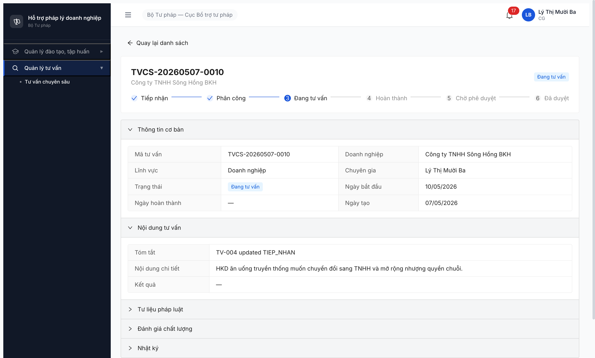
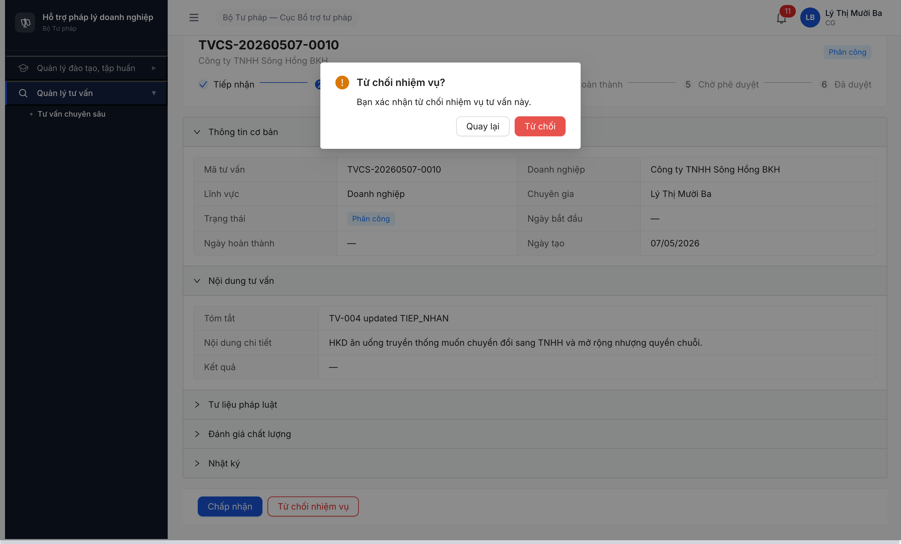

# Bug Report — Tư vấn chuyên sâu (FR-12) R7.4.A5

| Thông tin | Giá trị |
|-----------|---------|
| **Dự án** | PM HTPLDN |
| **Môi trường** | http://103.172.236.130:3000/ |
| **Người test** | QA Automation |
| **Ngày** | 2026-05-07 21:54:00 (R8 log) · 2026-05-09 20:25:00 (R9 re-test) · 2026-05-09 23:50:00 (R10 re-test bộ TK 06) · 2026-05-10 09:25:00 (R11 verify dev fix) · 2026-05-10 09:40:57 (R12 verify dev fix BUG-004) · 2026-05-10 12:10:32 (R13 verify dev fix BUG-004 lần 2) · 2026-05-10 13:25:00 (R14 verify dev fix lần 3 + bộ acc `_07`) |
| **Loại test** | Workflow (R7.4.A5) |
| **Round** | R8 → R9 → R10 → R11 → R12 → R13 → **R14** (verify dev fix BUG-004 lần 3 — 2026-05-10 13:25:00 bộ acc `_07`) |
| **Tài liệu tham chiếu** | [`srs-fr-12-tv-chuyen-sau.md`](../../../../../input/srs-update-2026-5-5/srs-fr-12-tv-chuyen-sau.md) v3.5 + [workflow-test-report-r7-4-a5-tvcs.md](../../workflow/tu-van-chuyen-sau/workflow-test-report-r7-4-a5-tvcs.md) |

---

## Tổng hợp

Phát hiện **4** lỗi chặn workflow TVCS — đều có SRS reference cụ thể.

### Severity breakdown

| Tổng | Critical | Major | Medium | Minor | Trivial |
|------|----------|-------|--------|-------|---------|
| 4    | 2        | 2     | 0      | 0     | 0       |

**R14 status (2026-05-10 13:25:00):** 3/4 đóng (KHÔNG đổi vs R11/R12/R13 — **lần 3 dev claim fix verify PARTIAL**). FE side **CÓ FIX** (modal "Hoàn thành tư vấn" R14 có thêm textarea "Kết quả *" required + textarea "Ghi chú" — KHÁC R12/R13 modal confirm-only). BE side **VẪN BROKEN**: POST `/hoan-thanh` body `{version, ketQua, ghiChu}` vẫn 422 ERR-VAL-TVCS-SM-02 "Phải có văn bản tư vấn pháp luật (ket_qua) trước khi hoàn thành" — endpoint không nhận `ketQua`/`ghiChu` trong body; PATCH `{ketQua, version}` vẫn 409 ERR-BIZ-X-01-01 "Không thể cập nhật ở trạng thái 'DANG_TU_VAN'". Test trên TVCS-20260509-0002 (Đất đai, huongcg phân công via cb_nv_tw_07): B3 [Chấp nhận] PASS state PHAN_CONG → DANG_TU_VAN ver+1; B6 modal có form fill text 158/50000 chars → click [Hoàn thành] modal → state vẫn DANG_TU_VAN (FE silent fail, BE reject). Hệ quả: BUG-FE-A5-004 reclass thành **FE-fixed-but-BE-not-deployed**, B6 transition vẫn block.

**R13 status (2026-05-10 12:10:32):** 3/4 đóng (KHÔNG đổi vs R11/R12 — **lần 2 dev claim fix verify FAIL**). BE behavior + FE UI vẫn IDENTICAL: GET TVCS-0010 trả `_links=[self, hoan-thanh]` (không có update link), `ketQua=null`, `version=6`, `trangThai=DANG_TU_VAN`; POST `/hoan-thanh {version:6, ketQua:"R13 verify..."}` 422 ERR-VAL-TVCS-SM-02 (timestamp 2026-05-10T05:09:47.406Z requestId 7299d657-5d79-4877-beab-64b8f4b6dc2b); PATCH `{version:6, ketQua:"R13 PATCH probe"}` 409 ERR-BIZ-X-01-01 (timestamp 2026-05-10T05:09:47.441Z requestId 617c2124-f575-44fd-91db-248272f3cec1); 7 sub-path probe (`cap-nhat-ket-qua / luu-ket-qua / ket-qua / tu-lieu-phap-luats / cap-nhat / update-ket-qua / save-result`) đều 404; FE detail UI ly_13 vẫn 0 button Edit/Cập nhật/Sửa/Upload, "Tư liệu pháp luật" collapsed read-only. Dev fix lần 2 KHÔNG deploy hoặc fix sai scope.

**R12 status (2026-05-10 09:40:57):** 3/4 đóng (KHÔNG đổi vs R11). **BUG-FE-A5-004 STILL OPEN** — verify dev fix FAIL: BE behavior IDENTICAL R11 (PATCH 409 ERR-BIZ-X-01-01, POST `/hoan-thanh {ketQua,version}` 422 ERR-VAL-TVCS-SM-02, 7 sub-path 404, HATEOAS `_links` chỉ `self`+`hoan-thanh`); FE UI IDENTICAL R11 (0 button Edit/Cập nhật/Upload trong DANG_TU_VAN, modal "Hoàn thành tư vấn?" chỉ confirm dialog không có ket_qua input, "Tư liệu pháp luật" expand chỉ show "Chưa có tư liệu pháp luật đính kèm." read-only). Block B6/B7/B8/B9 cascade vẫn nguyên.

**R11 status (2026-05-10 09:25:00):** 3/4 đóng. **BUG-001 CLOSED-verified** (BE branch CHAP_NHAN fix POST 200 trong 44ms, state PHAN_CONG → DANG_TU_VAN ver+1). **BUG-FE-A5-003 CLOSED-verified** (modal Từ chối có textarea `lyDo` required + min 10 char validation + end-to-end submit advance state TIEP_NHAN). **BUG-FE-A5-004 NEW Critical** — UI/API gap: CG trong DANG_TU_VAN không có cách fill `ket_qua` (BE PATCH 409, không có sub-endpoint, UI không có form Edit) → block B6/B7/B8/B9 cascade.

## Bug Summary Table

| Bug ID | Severity | Priority | Type | TC Ref | **SRS Reference** | Title | Status |
|--------|----------|----------|------|--------|-------------------|-------|--------|
| BUG-FE-TVCS-A5-004 | Critical | P0 | UI/UX + Workflow | TC-A5-B6 (HOAN_THANH) | `srs-fr-12-tv-chuyen-sau.md` line 189 (`Kiểm tra ket_qua không rỗng`) + line 1292 (`ket_qua text long Kết quả tư vấn (VB TVPL)`) | UI/API gap — R14: FE fixed (modal có textarea `Kết quả *`+`Ghi chú`) **nhưng BE vẫn reject**: POST `/hoan-thanh {ketQua,ghiChu,version}` 422 ERR-VAL-TVCS-SM-02; PATCH `{ketQua,version}` 409 ERR-BIZ-X-01-01. Block B6/B7/B8/B9 cascade. | Open (FE-fixed-BE-broken) |
| ~~BUG-FUNC-TVCS-A5-001~~ | Critical | P0 | Workflow | TC-A5-B3 (CHAP_NHAN) | `srs-fr-12-tv-chuyen-sau.md` SM-TVCS line 1465-1471 (`PHAN_CONG → DANG_TU_VAN` actor=CG) | ~~BE POST `/xac-nhan` nhánh CHAP_NHAN crash 3 round liên tiếp — R8: 403 ERR-AUTH-TVCS-CG-01; R9: 500 ERR-SYS-00-00-01 sau ~10s; R10: hang >30s no response~~ | Closed |
| ~~BUG-FE-TVCS-A5-003~~ | Major | P1 | UI/UX | TC-A5-B4 (TU_CHOI) | `srs-fr-12-tv-chuyen-sau.md` line 537 (`Lý do từ chối phải có ít nhất 10 ký tự`) + ERR-VAL-TVCS-XN-01 | ~~Modal "Từ chối nhiệm vụ?" thiếu input field `lyDo` → BE reject 409 ERR-VAL-TVCS-XN-01 nhưng FE silent fail~~ | Closed |
| ~~BUG-FUNC-TVCS-A5-002~~ | Major | P1 | Workflow | TC-A5-B3 | `srs-fr-12-tv-chuyen-sau.md` UC147 + BR-AUTH-08 + line 533 (filter dropdown CG) | ~~List `GET /noi-dung-tu-van-cs` trả `total=0` cho user role CG dù CG có TVCS được phân công — CG không có inbox "Việc của tôi"~~ | Closed |

---

## BUG-FE-TVCS-A5-004 — UI/API gap: CG không có cách fill `ket_qua` trong DANG_TU_VAN, block B6 → cascade

> **Re-test:** 2026-05-10 13:25:00 R14 — ⚠️ PARTIAL (FE-fixed-but-BE-broken, dev fix lần 3). Login `huongcg` qua MCP isolated context `qa_r14_huongcg_07`. Setup: cb_nv_tw_07 phân công huongcg vào TVCS-20260509-0002 (Đất đai) → POST `/phan-cong` 200 ver=2 PHAN_CONG. huongcg click [Chấp nhận] → POST `/xac-nhan {quyetDinh:CHAP_NHAN, version:2}` 200 ver=3 DANG_TU_VAN ✅ (B3 PASS như R11). huongcg click [Hoàn thành] → modal "Hoàn thành tư vấn" mở **CÓ TEXTAREA `Kết quả *` required + TEXTAREA `Ghi chú` (KHÁC R11/R12/R13 vốn confirm-only)** ✅ FE FIX. Click textarea, type_text 158 chars "B6 retest 14 — ket qua tu van: HKD chuyen doi sang TNHH thanh cong, ho so day du, ban giao tai lieu cho khach hang." → counter "158/50000" persist. Click [Hoàn thành] modal submit → POST `/api/v1/noi-dung-tu-van-cs/{id}/hoan-thanh` body `{version:3, ketQua:"...", ghiChu:"B6 retest"}` → **HTTP 422 ERR-VAL-TVCS-SM-02** "Phải có văn bản tư vấn pháp luật (ket_qua) trước khi hoàn thành" (timestamp `2026-05-10T06:24:31.105Z`, requestId `7f8a8e3d-...`). State remains DANG_TU_VAN. Direct API probe: PATCH `{ketQua, version:3}` → 409 ERR-BIZ-X-01-01. **Verdict:** FE side fixed (modal form đã có), BE side STILL broken (endpoint vẫn không nhận `ketQua` body, PATCH vẫn block trong DANG_TU_VAN). Branch BE chưa merge hoặc fix sai endpoint. B6/B7/B8/B9 cascade vẫn BLOCKED. Bằng chứng R14: form modal verified qua snapshot a11y tree.
>
> **Re-test:** 2026-05-10 12:10:32 R13 — ❌ STILL OPEN (lần 2 dev claim fix verify FAIL). Login `ly_13` UI MCP isolated context `qa_r13_ly13_cg`. BE probe identical R12: GET TVCS-0010 (b6cc63bf) ver=6 ketQua=null DANG_TU_VAN `_links=[self, hoan-thanh]` (no update link); POST `/hoan-thanh {version:6, ketQua:"R13 verify ket_qua test - HKD chuyen doi sang TNHH thanh cong, ho so day du, ban giao tai lieu cho khach hang."}` → **HTTP 422 ERR-VAL-TVCS-SM-02** "Phải có văn bản tư vấn pháp luật (ket_qua) trước khi hoàn thành" (timestamp 2026-05-10T05:09:47.406Z requestId 7299d657-5d79-4877-beab-64b8f4b6dc2b); PATCH `{version:6, ketQua:"R13 PATCH probe"}` → 409 ERR-BIZ-X-01-01 (timestamp 2026-05-10T05:09:47.441Z requestId 617c2124-f575-44fd-91db-248272f3cec1); 7 sub-path probe `cap-nhat-ket-qua / luu-ket-qua / ket-qua / tu-lieu-phap-luats / cap-nhat / update-ket-qua / save-result` đều **404**; FE UI detail ly_13 IDENTICAL R11+R12: 0 button Edit/Cập nhật/Sửa/Upload trong DANG_TU_VAN, chỉ button [Hoàn thành], section "Tư liệu pháp luật" collapsed (R12 expand verify "Chưa có tư liệu pháp luật đính kèm." read-only). Hệ quả: B6/B7/B8/B9 cascade vẫn BLOCKED. Workflow R7.4.A5 vẫn 6/11 PASS, không cải thiện R11→R12→R13. Dev claim fix 2 lần (R12 + R13) đều KHÔNG ÁP DỤNG → branch chưa merge / chưa deploy / fix sai scope. Bằng chứng R13: [`r7-4-a5-r13-detail-tvcs-0010-no-edit-still.png`](image/r7-4-a5-r13-detail-tvcs-0010-no-edit-still.png).
>
> **Re-test:** 2026-05-10 09:40:57 R12 — ❌ STILL OPEN, dev fix KHÔNG áp dụng. Re-verify cả BE-side và FE-side identical với R11.
>
> - **BE behavior identical:** Curl ly_13 → POST `/api/v1/noi-dung-tu-van-cs/b6cc63bf-c2c7-451c-8870-879706670dd5/hoan-thanh` body `{version:6, ketQua:"R12 verification - ket_qua attempt via hoan-thanh body"}` → **HTTP 422 ERR-VAL-TVCS-SM-02** "Phải có văn bản tư vấn pháp luật (ket_qua) trước khi hoàn thành" (timestamp `2026-05-10T02:16:50.195Z`, requestId `6aae3910-d4e8-4ad3-9162-c0cf39710587`) — endpoint vẫn KHÔNG nhận `ketQua` trong body. PATCH `/{id} {ketQua,version}` vẫn 409 ERR-BIZ-X-01-01. 7 sub-path probe (`/cap-nhat-ket-qua`, `/luu-ket-qua`, `/ket-qua`, `/tu-lieu-phap-luats`, `/tlpl`, `/vbtvpl`, `/files`) đều 404. HATEOAS `_links` không đổi (chỉ `self` + `hoan-thanh`).
> - **FE UI identical:** UI ly_13 detail TVCS-0010 (DANG_TU_VAN ver=6) — chỉ 1 button [Hoàn thành] + 5 collapse header read-only. Click [Hoàn thành] → modal "Hoàn thành tư vấn?" mở, content chỉ "Xác nhận đã hoàn thành nội dung tư vấn." + 2 button [Hủy]/[Hoàn thành] (KHÔNG có textbox/textarea/upload nào). Submit → reqid=206 POST `/hoan-thanh` 422. Section "Tư liệu pháp luật" expand → text duy nhất "Chưa có tư liệu pháp luật đính kèm." (no upload button, no add button, no file input).
> - **Hệ quả:** B6 vẫn BLOCKED → cascade B7/B8/B9 vẫn KHÔNG TEST ĐƯỢC. Workflow R7.4.A5 vẫn 6/11 PASS, không cải thiện vs R11.
> - **Bằng chứng R12:** [`r7-4-a5-r12-detail-tvcs-0010-no-edit-button.png`](image/r7-4-a5-r12-detail-tvcs-0010-no-edit-button.png) (detail full page CG view), [`r7-4-a5-r12-modal-hoan-thanh-no-ket-qua-input.png`](image/r7-4-a5-r12-modal-hoan-thanh-no-ket-qua-input.png) (modal confirm-only), [`r7-4-a5-r12-tu-lieu-phap-luat-no-upload.png`](image/r7-4-a5-r12-tu-lieu-phap-luat-no-upload.png) (TLPL section read-only).

### Mô tả

CG ở state DANG_TU_VAN cần fill `ket_qua` (text long, "VB TVPL") trước khi click [Hoàn thành] (SRS FR-12 line 189: "Kiểm tra ket_qua không rỗng"). Nhưng UI detail TVCS không có form Edit nào cho CG — chỉ có 1 button [Hoàn thành]. BE PATCH `/{id}` trả 409 ERR-BIZ-X-01-01 "Không thể cập nhật ở trạng thái 'DANG_TU_VAN'" cho mọi role (test với CG/CB_NV/QTHT). POST `/hoan-thanh {ketQua, version}` trả 422 ERR-VAL-TVCS-SM-02 "Phải có văn bản tư vấn pháp luật (ket_qua) trước khi hoàn thành" — không nhận `ketQua` trong body. Không có sub-endpoint `/ket-qua`, `/tu-lieu-phap-luats`, `/vbtvpl`, hay file upload nào (test 8 path đều 404). Hệ quả: B6 → B7 → B8 → B9 hoàn toàn không thể hoàn thành. Vi phạm SRS FR-12 §Hoàn thành TV step 3-4 + line 1292 (`ket_qua text long`).

### Các bước tái hiện

1. Login `ly_13` (CG) / `Secret@123` + OTP `666666`. Sidebar → "Quản lý tư vấn" → "Tư vấn chuyên sâu".
2. Click row TVCS-20260507-0010 (state DANG_TU_VAN sau R11 B3 PASS, ver=6).
3. Quan sát detail page: 3 collapsible section (Thông tin cơ bản / Nội dung tư vấn / Tư liệu pháp luật / Đánh giá chất lượng / Nhật ký) — tất cả read-only, không button Edit/Cập nhật/Sửa.
4. Field "Kết quả" hiển thị "—". Section "Tư liệu pháp luật" expand → "Chưa có tư liệu pháp luật đính kèm." — không button Upload/Thêm file.
5. Click button [Hoàn thành] → modal "Hoàn thành tư vấn?" mở (chỉ confirm dialog, KHÔNG có form input).
6. Click submit modal → POST `/api/v1/noi-dung-tu-van-cs/{id}/hoan-thanh {version:6}` → 422 ERR-VAL-TVCS-SM-02. Modal vẫn open, FE silent.
7. Curl probe BE side: PATCH `/{id} {ketQua:..., version:6}` → 409 ERR-BIZ-X-01-01 (mọi role). POST `/hoan-thanh {ketQua:..., version:6}` → 422 vẫn báo thiếu `ket_qua` (không nhận field).
8. Probe sub-endpoints: POST `/ket-qua`, `/cap-nhat-ket-qua`, `/save-ket-qua`, `/update`, `/tu-lieu-phap-luats`, `/vb-tu-van-phap-luats`, `/file-uploads` đều 404.

### Kết quả mong đợi

- CG ở state DANG_TU_VAN phải có UI để: (a) nhập text `ket_qua`; (b) upload file VBTVPL (nếu spec yêu cầu separate); (c) click [Lưu] để persist.
- BE phải có endpoint nhận `ket_qua` mutation trong state DANG_TU_VAN. Lựa chọn:
  - Cho phép PATCH partial `{ketQua}` trong DANG_TU_VAN (relax BR-state-check), HOẶC
  - Tạo endpoint riêng `/api/v1/noi-dung-tu-van-cs/{id}/cap-nhat-ket-qua`, HOẶC
  - Cho phép POST `/hoan-thanh` nhận `{ketQua, version}` luôn trong body (atomic save+complete).
- POST `/hoan-thanh` sau khi `ket_qua` filled → 200, state DANG_TU_VAN → HOAN_THANH (auto chuyển CHO_PHE_DUYET per SRS step 5).

### Kết quả thực tế

- UI: 0 button Edit/Cập nhật/Upload/Thêm trong DANG_TU_VAN cho role CG. Chỉ button [Hoàn thành] active.
- BE: PATCH 409 ERR-BIZ-X-01-01 + POST `/hoan-thanh {ketQua,...}` 422 ERR-VAL-TVCS-SM-02 (không nhận `ketQua`).
- Hậu quả cascade: B6 BLOCKED → B7/B8/B9 KHÔNG THỂ TEST do không có HOAN_THANH/CHO_PHE_DUYET record nào.

### Bằng chứng



```text
=== R11 evidence (2026-05-10 09:25) — UI snapshot detail TVCS-0010 DANG_TU_VAN ===

Visible buttons (verified evaluate_script document.querySelectorAll('button')):
  - "Quay lại danh sách"
  - "Thông tin cơ bản"     (collapse header, read-only)
  - "Nội dung tư vấn"      (collapse header, read-only — Tóm tắt/Nội dung chi tiết/Kết quả="—")
  - "Tư liệu pháp luật"    (collapse header → "Chưa có tư liệu pháp luật đính kèm.")
  - "Đánh giá chất lượng"  (collapse header)
  - "Nhật ký"              (collapse header)
  - "Hoàn thành"           (action button — primary)

document.querySelectorAll('input[type="file"]') → []  (zero file inputs)
Search interesting buttons: /sửa|cập nhật|edit|upload|tải|thêm|update/i → 0 matches

=== BE probe (3 role × 3 endpoint × variant) ===

[ly_13 CG]
PATCH /api/v1/noi-dung-tu-van-cs/b6cc63bf-... {ketQua:"...", version:6}
  → HTTP 409 ERR-BIZ-X-01-01 "Không thể cập nhật ở trạng thái 'DANG_TU_VAN'"

[cb_nv_tw_01 record creator]
PATCH /api/v1/noi-dung-tu-van-cs/b6cc63bf-... {ketQua:"...", version:6}
  → HTTP 409 ERR-BIZ-X-01-01 (cùng error)

[qtht_01 admin]
PATCH /api/v1/noi-dung-tu-van-cs/b6cc63bf-... {ketQua:"...", version:6}
  → HTTP 403 ERR-PERM-SYS-00-01 (no permission)

[ly_13 CG] POST /api/v1/noi-dung-tu-van-cs/b6cc63bf-.../hoan-thanh
  Body {version:6}
    → HTTP 422 ERR-VAL-TVCS-SM-02 "Phải có văn bản tư vấn pháp luật (ket_qua) trước khi hoàn thành"
  Body {version:6, ketQua:"R11 ket qua tu van: HKD chuyen doi sang TNHH..."}
    → HTTP 422 ERR-VAL-TVCS-SM-02 (cùng error — endpoint không nhận ketQua trong body)

Sub-endpoints probe (8 path):
  POST  /noi-dung-tu-van-cs/{id}/ket-qua            → 404
  PATCH /noi-dung-tu-van-cs/{id}/ket-qua            → 404
  POST  /noi-dung-tu-van-cs/{id}/cap-nhat-ket-qua   → 404
  POST  /noi-dung-tu-van-cs/{id}/save-ket-qua       → 404
  POST  /noi-dung-tu-van-cs/{id}/update             → 404
  POST  /noi-dung-tu-van-cs/{id}/tu-lieu-phap-luats → 404
  POST  /noi-dung-tu-van-cs/{id}/vb-tu-van-phap-luats → 404
  POST  /api/v1/file-uploads, /api/v1/files/upload  → 404

HATEOAS _links of TVCS-0010 (DANG_TU_VAN, ver=6):
  self:        GET  /noi-dung-tu-van-cs/{id}
  hoan-thanh:  POST /noi-dung-tu-van-cs/{id}/hoan-thanh
  → KHÔNG có "update" / "ket-qua" link ⇒ BE không expose mutation cho ket_qua trong state này.
```

---

## ~~BUG-FUNC-TVCS-A5-001~~ [CLOSED] — BE `/xac-nhan` nhánh CHAP_NHAN crash (R8: 403 → R9: 500 → R10: hang >30s)

> **Re-test:** 2026-05-10 09:25:00 R11 — ✅ PASS (Closed-verified). Dev fix BE branch CHAP_NHAN. Curl probe `ly_13` POST `/api/v1/noi-dung-tu-van-cs/cee63433-.../xac-nhan {quyetDinh:CHAP_NHAN, version:3}` → **HTTP 200 trong 44ms**, response `{trangThai:DANG_TU_VAN, version:4, ngayBatDau:"2026-05-10T01:25:53.908Z"}`. Re-confirm UI: ly_13 click [Chấp nhận] modal "Chấp nhận tư vấn?" → submit → POST 200 → state PHAN_CONG → DANG_TU_VAN, stepper progress 1+2 checked, button đổi sang [Hoàn thành], ngày bắt đầu auto-set 10/05/2026. Network reqid=209 POST /xac-nhan 200 ✅. Branch CHAP_NHAN handler đã fix. R10 → R11: hang >30s → 200 trong 44ms.
>
> **Re-test:** 2026-05-09 23:50:00 R10 — ⚠️ STILL OPEN, regression nặng hơn R9. POST `/xac-nhan {quyetDinh:CHAP_NHAN, version:3}` qua `ly_13` trên TVCS-0004 (id `cee63433...`) hang **>30s** không response (curl --max-time 30 timeout HTTP=000), UI POST trả `net::ERR_ABORTED`. Tiến hoá symptom: R8 403 immediate → R9 500 sau ~10s → R10 hang completely. Phát hiện mới R10: **chỉ nhánh CHAP_NHAN crash**. Nhánh TU_CHOI cùng endpoint hoạt động đúng — `truong_16` POST `/xac-nhan {quyetDinh:TU_CHOI, lyDo:"Khong du chuyen mon test R10", version:3}` trên TVCS-0002 trả 200 trong 0.04s, state PHAN_CONG → TIEP_NHAN ver+1 ✅. Vậy bug khu trú ở handler branch CHAP_NHAN (không phải auth gate). Dev cần stack-trace BE log cho branch nào của handler `/xac-nhan` xử lý `quyetDinh=CHAP_NHAN`.
>
> **Re-test:** 2026-05-09 20:25:00 R9 — ⚠️ Open, symptom thay đổi từ 403 sang 500 sau ~10s.

### Mô tả

CG (role `CG`) đã được phân công cho TVCS (TVCS.chuyenGiaId = TVV.id của CG đó), gọi POST `/api/v1/noi-dung-tu-van-cs/{id}/xac-nhan` với body hợp lệ → BE trả 403 (R8) hoặc 500 (R9) — không transition state. FK linkage `TAI_KHOAN.id ↔ TU_VAN_VIEN.tai_khoan_id ↔ TVCS.chuyen_gia_id` verified intact qua API. Lỗi multi-source: R8 ly_13 (TVV-0001 / TVCS-0004 DN) + dinh_14 (TVV-0002 / TVCS-0006 KDTM); R9 ly_13 (TVCS-0004) + truong_16 (TVV-0004 / TVCS-0002 Thuế) cùng pattern. Vi phạm SRS SM-TVCS line 1465-1471 (transition PHAN_CONG → DANG_TU_VAN actor=CG được phân công) và chặn cascade B3 → B6 → B8/B9.

### Các bước tái hiện

1. Login `cb_nv_tw_01` → vào `/tv-chuyen-sau/danh-sach` → phân công CG cho TVCS-20260507-0004 (DN, chọn "Lý Thị Mười Ba" TVV-0001 — duy nhất khớp filter `loaiTvv=CG ∧ trangThai=HOAT_DONG ∧ linhVucIds=DN`). State PHAN_CONG, chuyenGiaId = `df00f7e1-0d24-4ad2-93f4-132db87749fc`.
2. Logout. Login `ly_13` / `Secret@123` + OTP `666666` (TK đã activated qua R7.2.9). Verify GET `/api/v1/auth/me` trả `userId = d99760d8-b38b-401e-a5ac-227664debef4` = `TVV-0001.taiKhoanId`.
3. GET `/api/v1/noi-dung-tu-van-cs/cee63433-785b-411a-991a-780d10cad6fc` → 200, response confirms `chuyenGiaId == df00f7e1-...` (= TVV-0001.id).
4. POST `/api/v1/noi-dung-tu-van-cs/cee63433.../xac-nhan` body `{quyetDinh: "CHAP_NHAN", version: 2}` → **403 ERR-AUTH-TVCS-CG-01**.
5. Re-test với `dinh_14` (TVV-0002 / TVCS-20260507-0006 KDTM): cùng pattern → cùng 403 cùng error code. Linkage verified analogously.
6. Quan sát: CG vẫn có thể PATCH `/{id}` body generic field (vd `{tomTat: "..."}`) → 200. Bug chỉ ở action endpoint `/xac-nhan` — auth check route-level OK nhưng endpoint-level "is-assigned-CG" check sai logic.

### Kết quả mong đợi

- POST `/xac-nhan {quyetDinh: 'CHAP_NHAN', version}` từ CG có `TVV.id == TVCS.chuyenGiaId` → 200, state PHAN_CONG → DANG_TU_VAN, ngày bắt đầu auto-set, ver+1 (SRS SM-TVCS line 1465-1471).
- POST `/xac-nhan {quyetDinh: 'TU_CHOI', lyDo, version}` → 200, state PHAN_CONG → TIEP_NHAN, chuyenGiaId clear (SRS line 537).

### Kết quả thực tế

**R8 (2026-05-07):** Cả 2 quyết định CHAP_NHAN/TU_CHOI đều trả **HTTP 403** với body:
```json
{
  "success": false,
  "error": {
    "code": "ERR-AUTH-TVCS-CG-01",
    "message": "Chi chuyen gia duoc phan cong moi thuc hien hanh dong nay",
    "timestamp": "2026-05-07T14:55:..Z",
    "requestId": "..."
  }
}
```

**R9 (2026-05-09 20:25):** Symptom thay đổi sang **HTTP 500** (regression-style):
```json
{
  "success": false,
  "error": {
    "code": "ERR-SYS-00-00-01",
    "message": "Lỗi hệ thống, vui lòng thử lại sau",
    "timestamp": "2026-05-09T13:16:20.531Z",
    "requestId": "3892de3a-4eaf-40f0-9b52-0da8190d803f"
  }
}
```
- Endpoint hang ~10s trước khi trả 500 → BE handler có deadlock/timeout trong xử lý logic xác nhận, không phải reject ngay ở auth gate.
- Lỗi xảy ra dù `auth/me.userId` khớp `TVV.taiKhoanId` và `TVV.id` khớp `TVCS.chuyenGiaId`.
- Chặn 5 transition cascade: B3 (CHAP_NHAN), B4 (TU_CHOI), B6 (DANG_TU_VAN → HOAN_THANH), B8 (CHO_PHE_DUYET → DA_DUYET), B9 (CHO_PHE_DUYET → DANG_TU_VAN).

### Bằng chứng


**R10 trace (2026-05-09 23:50:00) — hang >30s no response, branch CHAP_NHAN crash riêng:**

```text
=== R10 UI test — ly_13 trên TVCS-0004 (id cee63433...) ===
1. UI: click sidebar Quản lý tư vấn → Tư vấn chuyên sâu
2. List trả 2 record (BUG-002 fix persist) state PHAN_CONG
3. Click row TVCS-0004 → detail page render OK, button [Chấp nhận]/[Từ chối] active
4. Click [Chấp nhận] → modal "Chấp nhận tư vấn?" mở
5. Click submit trong modal → button stuck "loading Chấp nhận"
6. POST /xac-nhan {quyetDinh:CHAP_NHAN, version:3}
   → reqid=206 net::ERR_ABORTED (FE timeout abort sau ~30s, BE chưa response)
7. wait_for("Đang tư vấn"|"thành công"|"Lỗi") timeout 25s

=== R10 curl probe — ly_13 trên TVCS-0004 ===
GET /api/v1/auth/me → 200 {userId:d99760d8-b38b-401e-a5ac-227664debef4, vaiTro:[CG]}
GET /api/v1/noi-dung-tu-van-cs/cee63433-... → 200 {trangThai:PHAN_CONG, version:3,
                                                    chuyenGiaId:df00f7e1-...}
POST /api/v1/noi-dung-tu-van-cs/cee63433-.../xac-nhan
     body {quyetDinh:CHAP_NHAN, version:3}
  → curl --max-time 30 → HTTP=000 TIME=30.00s (BE no response in 30s)

=== R10 nhánh TU_CHOI test — phân loại bug khu trú branch ===
truong_16 POST /xac-nhan {quyetDinh:TU_CHOI, lyDo:"Khong du chuyen mon test R10",
                          version:3} trên TVCS-0002 (id 2593a66e-...)
  → HTTP 200 TIME=0.04s ✅
  → response: {success:true, data:{trangThai:TIEP_NHAN, version:4, maTuVan:TVCS-20260507-0002,
                                    nguoiCapNhatId:56ab1973-... (=truong_16)}}
  → State advance PHAN_CONG → TIEP_NHAN persist
  → Pool TIEP_NHAN: 6 → 7 (verified curl re-list cb_pd_tw_06)

=> Kết luận R10: BUG-001 ONLY ở branch CHAP_NHAN. TU_CHOI route hoạt động đúng.
```

**R9 trace (2026-05-09 20:25:00) — symptom 500 sau 10s:**

```text
=== R9 probe persistent — truong_16 (CG, TVV-0004 Thuế) trên TVCS-0002 ===
GET /api/v1/auth/me (truong_16)
  → 200 {userId: 56ab1973-a8e4-490e-a5ec-e28d6ae19578, vaiTro: ['CG'],
         hoTen: 'Trương Văn Mười Sáu', donViId: 00000000-...001}
GET /api/v1/noi-dung-tu-van-cs?page=1&pageSize=50
  → 200 {meta.total: 2, data: [TVCS-20260507-0008 HUY ver=3, TVCS-20260507-0002 PHAN_CONG ver=3]}
     ✅ List filter cho role CG đã FIX (BUG-002 Closed)

POST /api/v1/noi-dung-tu-van-cs/2593a66e-.../xac-nhan (TVCS-0002)
     body {quyetDinh:'CHAP_NHAN', version:3}
  Attempt 1 → HTTP 500 ERR-SYS-00-00-01 sau 10.03s
  Attempt 2 → HTTP 500 ERR-SYS-00-00-01 sau 10.14s (persistent)
  Attempt 3 → HTTP 500 ERR-SYS-00-00-01 sau 10.14s (persistent)

=== Cross-check ly_13 trên TVCS-0004 cùng pattern ===
POST /xac-nhan body {quyetDinh:'CHAP_NHAN', version:3}
  → curl --max-time 30 timeout (BE chưa kịp 500 trong 30s, FE Modal stuck loading)
POST /xac-nhan body {quyetDinh:'CHAP_NHAN', version:999}  (wrong-version probe)
  → curl --max-time 15 timeout (cùng hang — không phải OptLock)
POST /xac-nhan body {quyetDinh:'TU_CHOI', version:3}  (TU_CHOI branch probe)
  → curl --max-time 15 timeout (cùng hang)

FE Modal trên ly_13 UI:
  - Click button [Chấp nhận] → Modal "Chấp nhận tư vấn?" mở
  - Click [Chấp nhận] xác nhận → POST gửi đi
  - Modal stuck loading vô tận, console "Uncaught (in promise)"
  - Network tab: POST /xac-nhan status `net::ERR_ABORTED` (FE timeout abort sau ~30s)

Sanity check (BE alive verify):
GET /api/v1/auth/me (CG)        → 50ms ✅
GET /noi-dung-tu-van-cs (CG)    → 50ms ✅
PATCH /api/v1/noi-dung-tu-van-cs/{TVCS-0001 id} (cb_nv_tw_01) → 50ms ✅ ver auto+1
PATCH /api/v1/noi-dung-tu-van-cs/{TVCS-0002 id} (cb_nv_tw_01) → 46ms ✅
PATCH /api/v1/noi-dung-tu-van-cs/{TVCS-0011 id} (cb_nv_tw_01) → 76ms ✅ trả OptLock 409 (đúng)
=> BE alive, GET/PATCH endpoints khác đều OK. CHỈ POST /xac-nhan crash.
```


> Ảnh chứng minh BUG-002 đã CLOSED — list filter cho role CG hoạt động đúng. Trong cùng session R9, BUG-001 vẫn Open với symptom mới (500 thay vì 403).

```text
=== Probe verified linkage 2026-05-07 21:55 ===
GET /api/v1/auth/me (ly_13)
  → {userId: d99760d8-b38b-401e-a5ac-227664debef4, hoTen: 'Lý Thị Mười Ba', vaiTro: ['CG'], donViId: 00000000-0000-4000-8000-000000000001, capDonVi: 'TW'}

GET /api/v1/noi-dung-tu-van-cs/cee63433-785b-411a-991a-780d10cad6fc
  → 200 {data: {trangThai: 'PHAN_CONG', chuyenGiaId: 'df00f7e1-0d24-4ad2-93f4-132db87749fc', version: 2}}

Linkage check (client-side):
  TVCS.chuyenGiaId   == 'df00f7e1-0d24-4ad2-93f4-132db87749fc' (TVV-0001.id) ✅
  TVV-0001.taiKhoanId == 'd99760d8-b38b-401e-a5ac-227664debef4' (= ly_13.userId) ✅

POST /api/v1/noi-dung-tu-van-cs/cee63433-785b-411a-991a-780d10cad6fc/xac-nhan
     body {quyetDinh: 'CHAP_NHAN', version: 2}
  → 403 ERR-AUTH-TVCS-CG-01 "Chi chuyen gia duoc phan cong moi thuc hien hanh dong nay"

POST /api/v1/noi-dung-tu-van-cs/cee63433.../xac-nhan
     body {quyetDinh: 'TU_CHOI', lyDo: 'Test reject', version: 2}
  → 403 ERR-AUTH-TVCS-CG-01 (cùng code)

Cross-check dinh_14 / TVCS-20260507-0006 KDTM:
GET detail → chuyenGiaId(5e0377d4) == TVV-0002.id ✅
GET auth/me → userId(4b732377) == TVV-0002.taiKhoanId ✅
POST /xac-nhan {CHAP_NHAN, ver=2} → 403 ERR-AUTH-TVCS-CG-01 (cùng pattern, cùng code)

Sanity check (CG có quyền update generic):
PATCH /api/v1/noi-dung-tu-van-cs/cee63433.../ {tomTat: 'Test update from CG', version: 2}
  → 200 ✅ (CG có permission update_noi_dung_tu_van_cs nên route-level auth OK)
```

---

## ~~BUG-FE-TVCS-A5-003~~ [CLOSED] — Modal "Từ chối nhiệm vụ?" thiếu input lý do, BE reject 409 nhưng FE silent fail

> **Re-test:** 2026-05-10 09:30:00 R11 — ✅ PASS (Closed-verified). Dev fix FE modal. Snapshot a11y tree modal "Từ chối nhiệm vụ?": dialog có textbox "* Lý do từ chối" `multiline required` description "Vui lòng nhập lý do từ chối Lý do phải có ít nhất 10 ký tự" + char counter "0 / 1000". Click submit khi empty → FE block + show 2 message: "Vui lòng nhập lý do từ chối" + "Lý do phải có ít nhất 10 ký tự" + textbox `invalid="true"`. Submit với lyDo hợp lệ "R11 verify BUG-FE-A5-003 fix - tu choi nhiem vu vi khong du chuyen mon test" (≥10 chars) → POST 200, state PHAN_CONG → TIEP_NHAN, chuyenGia cleared "Chưa phân công", action button đổi sang [Phân công]. End-to-end UI flow PASS.

### Mô tả

Modal xác nhận "Từ chối nhiệm vụ?" trên trang chi tiết TVCS chỉ có 2 button (Quay lại / Từ chối) — KHÔNG có input field cho `lyDo`. Khi CG click "Từ chối", FE gửi POST `/xac-nhan {quyetDinh:'TU_CHOI', version}` thiếu field `lyDo`. BE reject 409 ERR-VAL-TVCS-XN-01 "Lý do từ chối phải có ít nhất 10 ký tự". FE không hiển thị toast lỗi nào cho user, console hiện "Uncaught (in promise)". User không biết tại sao thao tác không thành công, modal vẫn hiện loading. Vi phạm SRS line 537 yêu cầu lý do ≥10 ký tự khi TU_CHOI.

### Các bước tái hiện

1. Login `ly_13` / `Secret@123` + OTP `666666`. Sidebar → "Quản lý tư vấn" → "Tư vấn chuyên sâu".
2. Click row TVCS-20260507-0010 (state PHAN_CONG cho ly_13).
3. Click button "Từ chối nhiệm vụ" ở cuối trang detail.
4. Modal "Từ chối nhiệm vụ?" mở: chỉ có dòng "Bạn xác nhận từ chối nhiệm vụ tư vấn này." + 2 button "Quay lại" / "Từ chối". KHÔNG có input field nào.
5. Click button "Từ chối" trong modal.
6. Quan sát: button stuck "loading Từ chối"; KHÔNG toast lỗi nào hiển thị; modal không tự đóng.
7. DevTools Network: POST `/api/v1/noi-dung-tu-van-cs/{id}/xac-nhan` → 409 ERR-VAL-TVCS-XN-01.
8. DevTools Console: "Failed to load resource: the server responded with a status of 409 (Conflict)" + "Uncaught (in promise)".

### Kết quả mong đợi

- Modal "Từ chối nhiệm vụ?" PHẢI có textarea (hoặc input) "Lý do từ chối *" với validation client-side ≥10 ký tự (SRS line 537 + ERR-VAL-TVCS-XN-01).
- Submit chỉ enable khi `lyDo.length >= 10`.
- POST `/xac-nhan {quyetDinh:'TU_CHOI', lyDo:<text>, version}` → 200, state PHAN_CONG → TIEP_NHAN.

### Kết quả thực tế

- Modal thiếu input field `lyDo` hoàn toàn.
- POST `/xac-nhan` gửi đi không có `lyDo` → BE reject 409.
- FE không catch error → không show toast → silent fail. User stuck trên modal loading.

### Bằng chứng



```text
=== R10 evidence (2026-05-09 23:50:00) — UI ly_13 TVCS-0010 ===
Snapshot modal a11y tree:
  dialog "Từ chối nhiệm vụ?" modal
    image "exclamation-circle"
    StaticText "Từ chối nhiệm vụ?"
    StaticText "Bạn xác nhận từ chối nhiệm vụ tư vấn này."
    button "Quay lại"
    button "Từ chối"     ← KHÔNG có textbox/textarea cho lyDo

Network sau click "Từ chối":
  POST /api/v1/noi-dung-tu-van-cs/b6cc63bf-.../xac-nhan
       body (FE gửi): {quyetDinh:'TU_CHOI', version:3}     ← thiếu lyDo
   → reqid=421 HTTP 409
   → response: {success:false, error:{code:'ERR-VAL-TVCS-XN-01',
                message:'Lý do từ chối phải có ít nhất 10 ký tự'}}

Console:
  [error] Failed to load resource: 409 (Conflict)
  [error] Uncaught (in promise)

UI state sau 409: modal vẫn hiện, button [Từ chối] stuck "loading Từ chối"
                  không có .ant-message-error / .ant-notification-error nào render

=== Probe BE OK với lyDo đúng (curl bypass FE) ===
truong_16 POST /xac-nhan {quyetDinh:TU_CHOI, lyDo:"Khong du chuyen mon test R10",
                          version:3} trên TVCS-0002
  → HTTP 200 (TVCS-0002 advance PHAN_CONG → TIEP_NHAN ver+1)
=> BE handler đúng. Bug HOÀN TOÀN ở FE side: thiếu input + thiếu error handling.
```

---

## ~~BUG-FUNC-TVCS-A5-002~~ [CLOSED] — List endpoint trả `total=0` cho role CG dù có TVCS được phân công

> **Re-test:** 2026-05-09 20:20:00 R9 — ✅ PASS (Closed-verified). BE đã fix listing filter cho role CG. `ly_13` (TVV-0001) `GET /api/v1/noi-dung-tu-van-cs?page=1&pageSize=50` trả `meta.total=2 data:[TVCS-20260507-0010, TVCS-20260507-0004]` cùng `chuyenGiaId=df00f7e1-... (TVV-0001.id)`. Cross-verify `truong_16` (TVV-0004) → `meta.total=2 data:[TVCS-20260507-0008, TVCS-20260507-0002]`. UI `/tv-chuyen-sau/danh-sach` của ly_13 render 2 record với cột "Chuyên gia: Lý Thị Mười Ba" + cột Trạng thái "Phân công" + button [edit] active. BR-AUTH-08 data scope theo `chuyen_gia_id = TVV.id của user` đã apply đúng cho role CG.

### Mô tả

CG (role `CG`) gọi GET `/api/v1/noi-dung-tu-van-cs?page=1&pageSize=50` → BE trả `{success: true, data: [], meta: {total: 0}}` mặc dù trong DB có TVCS với `chuyen_gia_id` trỏ tới TVV của CG đó. Hệ quả: UI `/tv-chuyen-sau/danh-sach` của CG render "Không có nội dung tư vấn chuyên sâu nào" → CG không có cách nào xem inbox "Việc của tôi" qua UI để chấp nhận/từ chối phân công. Vi phạm SRS UC147 + BR-AUTH-08 (data-scope theo role).

### Các bước tái hiện

1. Setup: TVCS-20260507-0004 đã PHAN_CONG cho TVV-0001 (Lý), TVCS-20260507-0006 PHAN_CONG cho TVV-0002 (Đinh) (verified bằng cb_nv_tw_01 list 6 PHAN_CONG).
2. Logout cb_nv_tw_01. Login `ly_13` / `Secret@123` + OTP `666666`.
3. Click sidebar "Quản lý tư vấn" → "Tư vấn chuyên sâu" → URL `/tv-chuyen-sau/danh-sach`.
4. Quan sát: bảng danh sách hiển thị "Không có nội dung tư vấn chuyên sâu nào" + checkbox "Select all" disabled. Network request: `GET /api/v1/noi-dung-tu-van-cs?page=1&pageSize=20` → 200 `{data: [], meta: {total: 0}}`.
5. Re-verify với `dinh_14`: cùng pattern, list rỗng dù TVCS-0006 KDTM phân công cho TVV-0002.
6. Compare CB NV: cb_nv_tw_01 cùng URL `/api/v1/noi-dung-tu-van-cs?page=1&pageSize=50` → 200 trả 10 record (state PHAN_CONG=6, TIEP_NHAN=3, HUY=1) → list endpoint hoạt động đúng cho role CB NV, sai chỉ ở scope CG.

### Kết quả mong đợi

- `GET /api/v1/noi-dung-tu-van-cs?...` từ user role CG cần JOIN TU_VAN_VIEN ON `TAI_KHOAN.id = TU_VAN_VIEN.tai_khoan_id`, lọc TVCS WHERE `chuyen_gia_id = TVV.id` và `trang_thai != HUY` (để CG thấy việc của mình).
- ly_13: trả ≥1 record (TVCS-20260507-0004 DN, state PHAN_CONG).
- dinh_14: trả ≥1 record (TVCS-20260507-0006 KDTM, state PHAN_CONG).

### Kết quả thực tế

- Cả 2 CG nhận `total: 0`, `data: []`.
- UI render empty state "Không có nội dung tư vấn chuyên sâu nào".
- CG không có lối tắt UI để mở detail TVCS được phân công (không có bookmark, không có notification jump-to). Workaround: CB NV phải gửi link trực tiếp `/{id}` cho CG.

### Bằng chứng


```text
=== List vs detail mismatch (ly_13, 2026-05-07 21:54) ===
GET /api/v1/noi-dung-tu-van-cs?page=1&pageSize=50
  → 200 {success: true, data: [], meta: {page: 1, pageSize: 50, total: 0, totalPages: 0}}  ❌

GET /api/v1/noi-dung-tu-van-cs/cee63433-785b-411a-991a-780d10cad6fc (TVCS-0004 detail by id)
  → 200 {data: {chuyenGiaId: df00f7e1-..., trangThai: PHAN_CONG, version: 2}}  ✅
  → CG có thể access detail-by-id, chỉ list filter sai

Compare cb_nv_tw_01 same endpoint:
GET /api/v1/noi-dung-tu-van-cs?page=1&pageSize=50
  → 200 {data: [10 records], meta: {total: 10}}  ✅
```

---

## Phụ lục — Môi trường test

| Thành phần | Giá trị |
|------------|---------|
| URL ứng dụng | http://103.172.236.130:3000/ |
| OTP login | `666666` bypass |
| MailHog (OTP inbox) | http://103.172.236.130:8025 |
| API base | http://103.172.236.130:3000/api/v1 |
| Frontend | React + Vite + Ant Design |
| Xác thực | JWT (httpOnly cookie) + OTP email TOTP (BR-AUTH-01 Tier 1) |
| Tool test | Chrome DevTools MCP |

Account dùng test:
- `cb_nv_tw_01` / `Secret@123` (CB_NV_TW, BTP-TW) — phân công + hủy
- `cb_pd_tw_06` / `Secret@123` (CB_PD_TW, BTP-TW) — **R10 swap từ _01 sang _06 theo yêu cầu user**, scope verified TW (15 records visible)
- `ly_13` / `Secret@123` (CG, TVV-BTP-TW-0001 LV Doanh nghiệp)
- `dinh_14` / `Secret@123` (CG, TVV-BTP-TW-0002 LV Kinh doanh thương mại)
- `truong_16` / `Secret@123` (CG, TVV-BTP-TW-0004 LV Thuế)

---

*Bug report generated: 2026-05-07 | QA Automation via Claude Code*
*R9 update: 2026-05-09 20:25:00 — BUG-002 Closed-verified (list filter CG fix); BUG-001 still Open, symptom 403 → 500 regression.*
*R10 update: 2026-05-09 23:50:00 — BUG-001 Open + worsened (R10 hang >30s; chỉ branch CHAP_NHAN crash, TU_CHOI OK với lyDo đúng); BUG-FE-A5-003 NEW Modal Từ chối thiếu input `lyDo` + silent fail FE 409. Account swap CB_PD_01 → _06 đã verify scope OK.*
*R11 update: 2026-05-10 09:25:00 — BUG-001 Closed-verified (BE CHAP_NHAN fix POST 200/44ms); BUG-FE-A5-003 Closed-verified (modal có textarea lyDo + min 10 char validation + end-to-end submit advance state TIEP_NHAN). **BUG-FE-A5-004 NEW Critical** UI/API gap: CG không thể fill `ket_qua` trong DANG_TU_VAN (UI thiếu form Edit; BE PATCH 409, POST /hoan-thanh không nhận ketQua, không có sub-endpoint) → block B6/B7/B8/B9 cascade. QA Automation via Chrome DevTools MCP.*
*R14 update: 2026-05-10 13:25:00 — bộ acc `_07` test (cb_nv_tw_07 + huongcg). BUG-FE-A5-004 reclass thành PARTIAL FE-fixed-BE-broken: modal "Hoàn thành tư vấn" R14 đã có textarea `Kết quả *` required + `Ghi chú` (KHÁC R12/R13). BE side vẫn 422 ERR-VAL-TVCS-SM-02 + PATCH 409 ERR-BIZ-X-01-01 → endpoint chưa nhận `ketQua` body. Test trên TVCS-20260509-0002 Đất đai, huongcg phân công xong B3 PASS B6 modal-fill-but-BE-reject.*
