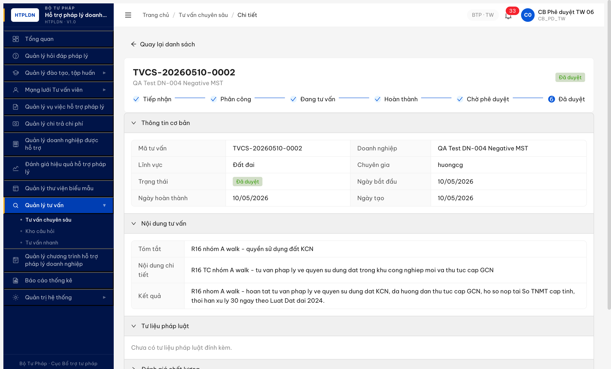
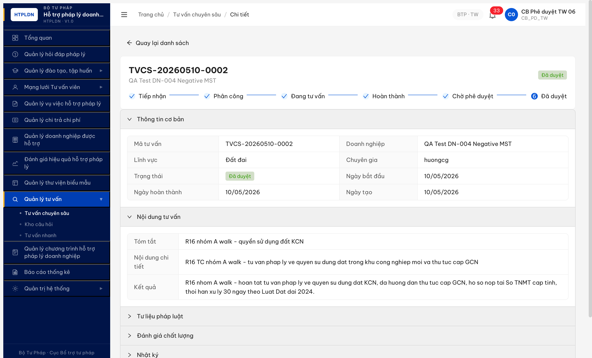
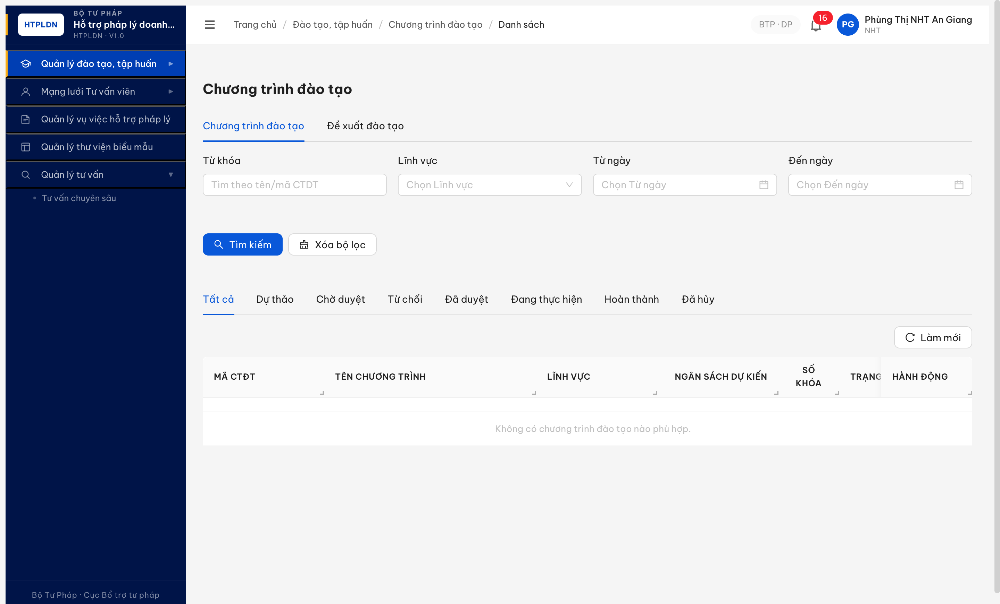
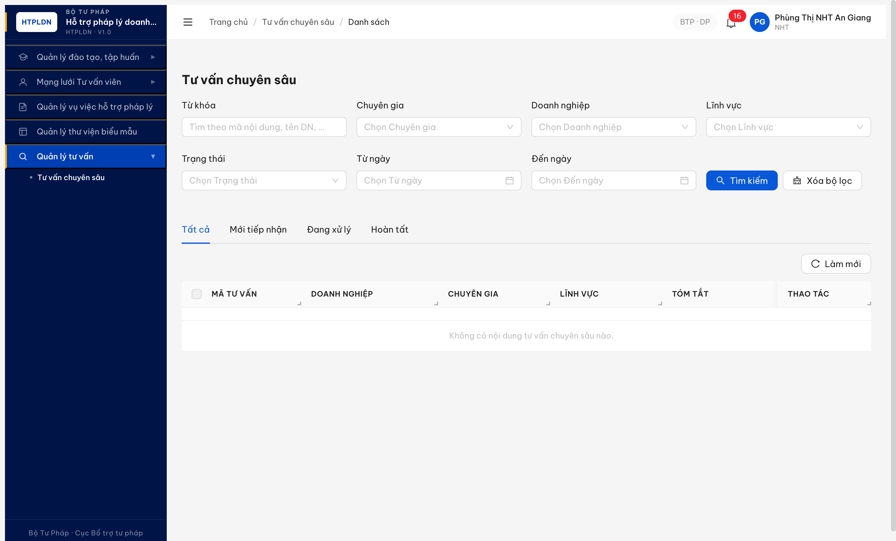
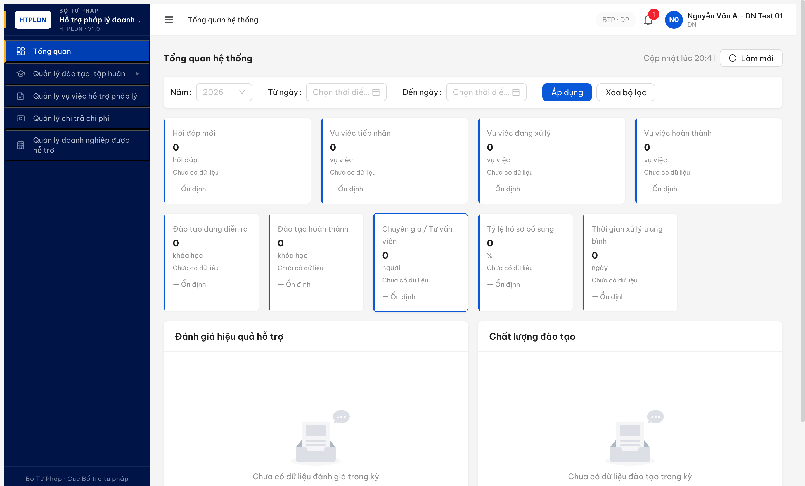
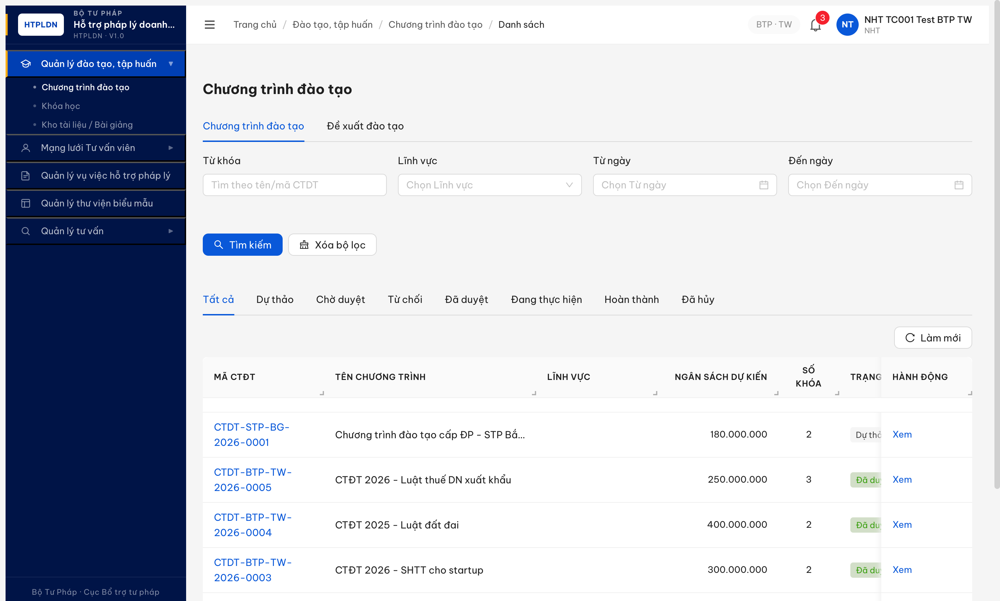

# Bug Report — Tư vấn chuyên sâu (R16 → R17 → R18 → R19 → R20 — Phase 2 nhóm B + FE)

| Thông tin | Giá trị |
|-----------|---------|
| **Dự án** | PM HTPLDN |
| **Môi trường** | http://103.172.236.130:3000 |
| **Người test** | QA Automation via Claude Code |
| **Ngày** | 2026-05-12 14:30:00 |
| **Loại test** | Functional (R7.7.5 deep review nhóm B + FE) |
| **Round** | R20 |
| **Tài liệu tham chiếu** | [`srs-update-2026-5-5/srs-fr-12-tv-chuyen-sau.md`](../../../../../input/srs-update-2026-5-5/srs-fr-12-tv-chuyen-sau.md), [`functional-test-report-r7-7-5-tvcs.md`](../../functional/tu-van-chuyen-sau/functional-test-report-r7-7-5-tvcs.md) |

---

## Tổng hợp

Phát hiện **7** lỗi (5 BE + 2 FE) trong R16 deep review của R7.7.5 sau khi unblock workflow R15. Các lỗi block 12 TC functional (TV-022, TV-023..TV-025, TV-035-1, TV-039 NHT side, TV-045, TV-046/047, TV-059 cross-module ref, ...) + 1 security/scope leak (BUG-007).

**Re-verify R17 2026-05-11 02:18-02:52 với acc `_06`/CG/NHT có VV phân công:** 3/7 bug Closed (002, 003, 007), 4/7 Open (001, 004, 005, 006). **+1 regression mới BUG-008** (fix BUG-007 SAI SPEC — blanket-deny endpoint thay vì BR-AUTH-10 row-level filter). Chi tiết §"Bug Re-verify R17" cuối Bug Summary Table.

### Severity breakdown

| Tổng | Critical | Major | Medium | Minor | Trivial |
|------|----------|-------|--------|-------|---------|
| 8    | 0        | 7     | 1      | 0     | 0       |

**Status sau R20 (2026-05-12):** Closed 4/8 (002/003/006/007) · Open 4/8 (001/004/005/008 — trong đó 004/005/008 đã ⚠️ PARTIAL).

## Bug Summary Table

| Bug ID | Severity | Priority | Type | TC Ref | **SRS Reference** | Title | Status |
|--------|----------|----------|------|--------|-------------------|-------|--------|
| BUG-BE-TVCS-R16-001 | Major | P1 | Workflow | TV-023, TV-024, TV-025, TV-043 | `srs-update-2026-5-5/srs-fr-12-tv-chuyen-sau.md §Tư liệu pháp luật + UC TLPL` | TLPL VV CRUD endpoint chưa expose — block toàn bộ luồng quản lý tư liệu pháp luật gắn TVCS | Open |
| ~~BUG-BE-TVCS-R16-002~~ | Major | P1 | Data | TV-035-1, TV-046, TV-047 | `srs-update-2026-5-5/srs-fr-12-tv-chuyen-sau.md §Bộ lọc + congKhai field` | ~~List filter `?congKhai=true` không apply — trả về toàn bộ records bao gồm cả `congKhai=false`~~ | Closed |
| ~~BUG-BE-TVCS-R16-003~~ | Major | P1 | Workflow | TV-022 | `srs-update-2026-5-5/srs-fr-12-tv-chuyen-sau.md:1496` | ~~Auto-save draft 30s vào TRAO_DOI_NHAP — endpoint chưa expose, không có khôi phục DRAFT~~ | Closed |
| BUG-FE-TVCS-R16-004 | Medium | P2 | Permission | TV-039 (NHT) | `output/permission-matrix.md §9 NHT (no FR-12 entity)` | NHT thấy menu "Quản lý tư vấn → Tư vấn chuyên sâu" và mở được trang `/tv-chuyen-sau/danh-sach` — vi phạm matrix (FE chưa hide theo role) | Open |
| BUG-FE-TVCS-R16-005 | Major | P1 | UI | TV-045, TV-047 (UI side) | `srs-update-2026-5-5/srs-fr-12-tv-chuyen-sau.md §Công khai TVCS DA_DUYET (BR-PUBLIC-01..03)` | UI detail TVCS DA_DUYET KHÔNG có button [Công khai] / [Hủy công khai] / panel hiển thị `congKhai` + `thoiGianDangTai` + `moTaCongKhai` — workflow API tồn tại nhưng FE chưa expose | Open |
| ~~BUG-BE-TVCS-R16-006~~ | Major | P1 | Data | TV-059 | `srs-update-2026-5-5/srs-fr-12-tv-chuyen-sau.md:1297` (Thay đổi 13) | ~~TVCS thiếu cột FK `hop_dong_tv_id` — detail GET không trả field, PATCH với `hopDongTvId` 200 nhưng silently dropped, không persist~~ | Closed |
| ~~BUG-BE-TVCS-R16-007~~ | Major | P0 | Permission | TV-053 (cross) | `srs-update-2026-5-5/srs-fr-04-chuyen-gia-tvv.md §BR-AUTH-10 (Thay đổi 10)` | ~~HSPL DN detail GET (`/ho-so-phap-ly-dns/{id}`) không apply BR-AUTH-10 — NHT có thể GET 200 bất kỳ HSPL nào không cùng đơn vị + không có VV phân công. List filter đúng nhưng detail leak~~ | Closed (regression BUG-008) |
| BUG-BE-TVCS-R17-008 | Major | P0 | Permission | TV-053 happy | `srs-update-2026-5-5/srs-fr-12-tv-chuyen-sau.md:669-671 (FR-X.1-04)` + `srs-v3.5.md:5304 (BR-AUTH-10)` | Regression do fix BUG-007: BE blanket-deny endpoint `/doanh-nghieps` cho role NHT thay vì BR-AUTH-10 row-level filter. NHT có VV phân công với DN-X vẫn không đọc được DN-X (happy path → 403 ERR-AUTH-DN-00-01). Vi phạm Acceptance Criteria FR-X.1-04 line 669-670. | Open |

### Bug Re-verify R17 — 2026-05-11 02:18-02:23 (acc `_06`)

| Bug ID | Verdict | Phương pháp | Bằng chứng nhanh |
|---|---|---|---|
| BUG-001 | ❌ NOT FIXED | API probe 5 TLPL endpoints + `linh-vuc-phap-luats` (cb_nv_tw_06) | All 5 → 404 ERR-SYS-00-04-01 (PATCH/POST/GET/DELETE giữ nguyên) |
| BUG-002 | ✅ FIXED | GET `?congKhai=true&pageSize=20` (cb_nv_tw_06) | 2 records, `allCongKhaiTrue=true` |
| BUG-003 | ✅ FIXED (full) | POST `/trao-doi-nhap` với `huongcg` (CG) trên TVCS-20260507-0013 DANG_TU_VAN | 200 OK + trả về TRAO_DOI_NHAP entity (id, noiDung, version) + GET sau đó cũng 200. Auto-save endpoint hoạt động đúng. Negative: PUT lần 2 → 409 ERR-STATE-LOCK-409 optimistic locking đúng spec. |
| BUG-004 | ❌ NOT FIXED | Login `nht_01` → expand "Quản lý tư vấn" sidebar | Submenu "Tư vấn chuyên sâu" vẫn render — vi phạm matrix NHT |
| BUG-005 | ⚠️ PARTIAL (BE OK / FE NOT FIXED) | R18 re-probe: POST `/cong-khai` với version → 422 ERR-VAL-SYS-00-01 (validation missing `moTaCongKhai`) — **endpoint TỒN TẠI**. R17 nhầm PATCH method 404. UI side R17 verify còn thiếu button [Công khai] / [Hủy công khai] + panel 5 field — vẫn NOT FIXED. → BE side đã pass workflow (TV-046/047 R16 PASS), chỉ FE UI thiếu wire. |
| BUG-006 | ❌ NOT FIXED | GET detail TVCS-20260510-0002 keys (cb_nv_tw_06) | Detail keys không chứa `hopDongTvId`/`hopDongTuVanId` (column FK vẫn missing) |
| BUG-007 | ✅ FIXED (cross-scope leak) / ❌ regression BUG-008 | GET `/doanh-nghieps/{id}` với (a) `nht_01` cross-scope + (b) `nht_tc001_btp_tw` happy path | (a) Cross-scope DN-006 → 403 đúng spec ✅. (b) Happy DN-003 (NHT có VV phân công) → 403 SAI SPEC ❌. NotebookLM 2-source verify: BE BẮT BUỘC row-level filter BR-AUTH-10, KHÔNG blanket-deny. Regression log mới = **BUG-008**. Original cross-scope leak đã closed, fix approach sai → BUG-008 mở. |

> **Re-test:** 2026-05-11 02:18-02:23 R17 — 3/7 bug Closed. Acc dùng: `cb_nv_tw_06` (BTP·TW, CB_NV_TW) cho BE probes + `nht_01` (STP-AG, NHT) cho FE menu + HSPL detail bypass.

### Bug Re-verify R19 — 2026-05-11 14:27:00 (sau clear cache + isolated context r19_clean)

> **Mục đích R19:** User yêu cầu clear cache (logout + localStorage.clear() + sessionStorage.clear() + page close + isolatedContext mới) trước khi verify lại để loại bỏ false-PASS do session sticky / cache stale.
>
> **Phương pháp:** Logout → localStorage empty → cookie empty → close page cũ → new isolatedContext `r19_clean` → fresh login `cb_nv_tw_06` (BE) + `nht_tc001_btp_tw` (FE/permission).

| Bug ID | Verdict R19 | Bằng chứng (HH:MM:SS sau clear cache) | Δ so với R17/R18 |
|---|---|---|---|
| BUG-001 | ❌ NOT FIXED | 14:27:13 — 5/5 TLPL endpoint candidates → 404 ERR-SYS-00-04-01 ("Cannot GET ...") | Không đổi |
| ~~BUG-002~~ | ✅ FIXED (giữ) | R17 đã verify, R19 skip duplicate | Không đổi |
| ~~BUG-003~~ | ✅ FIXED (giữ) | R17 đã verify, R19 skip duplicate | Không đổi |
| BUG-004 | ❌ NOT FIXED | Login fresh `nht_tc001_btp_tw` → click "Quản lý tư vấn" sidebar → submenu "Tư vấn chuyên sâu" hiển thị (uid 209_0 trong snapshot). Screenshot: `image/r19-bug-004-nht-menu-tvcs.png` | Không đổi (cùng acc khác `nht_01` cũng leak menu) |
| BUG-005 | ⚠️ PARTIAL (BE OK / FE NOT FIXED) | 14:27:14 — POST `/cong-khai` với version=13 → 422 ERR-VAL-SYS-00-01 (validation `moTaCongKhai` required) → BE endpoint TỒN TẠI. FE UI chưa wire button [Công khai]/[Hủy công khai] (R17 verified) | Không đổi (cùng kết quả R18 verdict correction) |
| BUG-006 | ❌ NOT FIXED | 14:27:14 — GET detail TVCS-20260510-0002 → keys không chứa `hopDongTvId`/`hopDongTuVanId`/`hdTvId`/`hopDongTuVan` (column FK vẫn missing). 50 keys liệt kê đầy đủ trong evidence log | Không đổi |
| ~~BUG-007~~ | ✅ FIXED (giữ — original cross-scope leak fix) | R17 đã verify, R19 skip | Không đổi |
| BUG-008 | ❌ NOT FIXED | 14:28:41 — `nht_tc001_btp_tw` có VV-BTP-TW-20260510-002 phân công với DN-003 (DNTN Hoàng Gia AG). GET `/api/v1/doanh-nghieps/e0000000-0000-4000-8000-000000000003` → **403 ERR-AUTH-DN-00-01** "Role không được phép truy cập endpoint CMS này" (blanket-deny). Trái lại GET `/api/v1/ho-so-phap-ly-dns?doanhNghiepId={DN-003}` → 200 với row-level filter đúng → BE inconsistent giữa 2 endpoint cùng entity. Screenshot: `image/r19-bug-008-nht-happy-403.png` | Không đổi (regression vẫn mở) |

> **Re-test R19:** 2026-05-11 14:25:00-14:30:00 — **5 Open bugs đều CONFIRMED NOT FIXED sau clear cache hoàn toàn.** Acc dùng: `cb_nv_tw_06` (BTP·TW, CB_NV_TW) cho BE probes + `nht_tc001_btp_tw` (BTP·TW, NHT) cho FE menu + happy path BR-AUTH-10. Cache state pre-test: localStorage=0 entries, cookie="", new isolatedContext `r19_clean`. **Dev chưa push fix mới giữa R17 và R19 (~12h gap).**

### Bug Re-verify R20 — 2026-05-12 (sau dev deploy ~22h gap, isolatedContext mới)

> **Mục đích R20:** Skill `qa-bugfix-reverify-audit` audit 5 Open bug. Login lại từ đầu trong 2 isolatedContext mới (`r20_cbnvtw06` cho BE/FE probe + `r20_nht01` cho NHT scope), KHÔNG reuse session R19.
>
> **Phương pháp:** Fresh login `cb_nv_tw_06` (BTP·TW) + `nht_01` (STP-AG; thay cho `nht_tc001_btp_tw` đã xóa khỏi `input/users.csv`). Probe API direct + UI snapshot. Verify so SRS local + permission matrix local.

| Bug ID | Verdict R20 | Bằng chứng (HH:MM:SS) | Δ so với R19 |
|---|---|---|---|
| BUG-001 | ❌ NOT FIXED | 8/8 TLPL endpoint candidates (`tu-lieu-phap-luats`, `tu-lieu-phap-luat`, `tlpl`, `tu-lieu-phap-luats?tvcsId=`, `tu-lieu-phap-luat?tvcsId=`, `linh-vuc-phap-luats`, `can-cu-phap-ly`, `van-ban-phap-luat`) → 404 ERR-SYS-00-04-01 "Cannot GET ..." (acc `cb_nv_tw_06`). Detail TVCS keys vẫn không có `tuLieuPhapLuats`/`cancuPhapLy`/`vanBan`/`tlpl`. | Không đổi |
| BUG-004 | ⚠️ PARTIAL FIXED | (a) Sidebar NHT `nht_01` (STP-AG) sau login → **KHÔNG còn nhóm "Quản lý tư vấn"** + KHÔNG còn submenu "Tư vấn chuyên sâu". So sánh R19: vẫn render → ✅ FE hide menu fix OK. (b) Tuy nhiên direct URL `/tv-chuyen-sau/danh-sach` vẫn render **đầy đủ filter + table + 4 records data** + BE `/api/v1/noi-dung-tu-van-cs?pageSize=20` → **200 + 4 records** (KHÔNG còn 403+toast như R16). `/auth/me` permissions trả `read_noi_dung_tu_van_cs` cho NHT — **vi phạm permission matrix line 518-540 (NHT không có entry TU_VAN_CHUYEN_SAU)**. → Route guard + BE permission scope cho NHT × TVCS vẫn cần xử lý. Screenshot: `image/r20-bug-004-partial-route-leak.png` | Sidebar fixed; route + BE list scope mới phát hiện (R16 BE từng 403, R20 BE 200 — regression nhỏ) |
| BUG-005 | ⚠️ PARTIAL FIXED | (a) Detail page TVCS DA_DUYET `aa555059-0000-4000-8000-000000000001` (TVCS-QA-R7-HD059 congKhai=false) hiển thị **accordion mới "Trạng thái công khai"** + **5 field readonly** (Công khai / Thời gian đăng tải / Mô tả công khai / Ảnh đại diện / File đính kèm) + **button [Công khai]** ở cuối page. Click → modal "Công khai nội dung tư vấn" mở với field `Mô tả công khai *` (required, multiline, char counter `0/1000`). ✅ FE wire xong workflow Công khai. (b) Nhưng modal **chỉ có 1 field `moTaCongKhai`** — **thiếu `anhDaiDien` (upload jpg/png/gif max 5MB)** + **thiếu `fileDinhKemCongKhai` (multi-upload PDF/DOC/XLS max 20MB)** theo SRS `srs-update-2026-5-5/srs-fr-12-tv-chuyen-sau.md:1129+1139` (Accordion 8b form). (c) Test detail TVCS `5edbd82a-d506-4552-a584-60d2e438fb67` (TVCS-20260510-0002 congKhai=true): panel hiển thị đúng `Đã công khai`/`10/05/2026`/mô tả thật, **NHƯNG KHÔNG có button [Hủy công khai]** ở cuối page — workflow huỷ công khai chưa wire UI (BE API tồn tại từ R16). Screenshot: `image/r20-bug-005-fixed-cong-khai-modal.png` + `image/r20-bug-005-partial-no-huy-button.png` | R19 chưa wire FE; R20 [Công khai] xong, còn thiếu [Hủy công khai] + 2 upload field |
| ~~BUG-006~~ | ✅ FIXED (Closed-verified) | (a) GET detail `/api/v1/noi-dung-tu-van-cs/{tiepNhanId}` keys NOW INCLUDE `hopDongTvId` (42 keys total, ở vị trí giữa). R19: keys không có field này. (b) PATCH `{ hopDongTvId: "b8c4e159-43da-475c-808e-81ec17e7288e", version: 1 }` → **200 OK + version 1→2**. (c) Re-fetch GET sau PATCH: `data.hopDongTvId === "b8c4e159-..."` ← **field persist đúng**. BE schema thêm cột `hop_dong_tv_id` theo SRS Thay đổi 13. | Closed — TV-059 unblocked |
| BUG-008 | ⚠️ PARTIAL FIXED | (a) `nht_01` GET `/api/v1/doanh-nghieps/e0000000-0000-4000-8000-000000000006` (DN-006 Thành Đạt BG) → 403 `ERR-AUTH-VPD-00-02` "Đơn vị không nằm trong phạm vi truy cập của bạn" (BR-AUTH-08 đơn vị scope). (b) GET DN-003 (Hoàng Gia AG) → 403 `ERR-AUTH-VPD-00-04` "Không có phân công vụ việc với doanh nghiệp này" (BR-AUTH-10 row-level). → **Blanket-deny `ERR-AUTH-DN-00-01` "Role không được phép truy cập endpoint CMS này" đã GỠ; BE giờ phân loại đúng BR-AUTH-08 vs BR-AUTH-10** ✅. (c) Tuy nhiên happy path: `nht_01` (STP-AG) có 4 VV phân công với Bình Minh AG (per VV list, `tenNguoiHoTro` match), NHT entity tồn tại id `22e9748b-a68c-4700-9a27-688814233e4c` taiKhoanId match userId, nhưng VV detail GET → 403 `ERR-AUTH-VPD-00-04` "Vụ việc không được phân công cho bạn"; DN list `/doanh-nghieps?pageSize=100` → total=0 → **happy path vẫn 403** (cùng symptom R17 nhưng error code khác). Suspected: BE detail-level scope mismatch giữa `nguoiHoTroId` (NHT entity id) vs `taiKhoanId`. Screenshot: `image/r20-bug-008-partial-blanket-deny-removed.png` | Blanket-deny gỡ + BR-AUTH-10 wire-up; happy path còn 403 với error code mới |

> **Re-test R20:** 2026-05-12 — Acc dùng: `cb_nv_tw_06` (BTP·TW, CB_NV_TW) cho BE probes BUG-001/005/006 + `nht_01` (STP-AG, NHT) cho BUG-004 + BUG-008 (thay `nht_tc001_btp_tw` đã xóa khỏi `input/users.csv`). **1/5 bug Closed (BUG-006), 3/5 PARTIAL FIXED (BUG-004/005/008), 1/5 NOT FIXED (BUG-001).** Tổng cộng từ R16: 4/8 Closed (002/003/006/007), 4/8 Open (001 + 3 PARTIAL).

> **Chú thích Type:** `Workflow` = chuyển trạng thái, `Data` = toàn vẹn dữ liệu / filter.
> **Chú thích Severity:** `Major` = tính năng quan trọng lỗi, có workaround (tạm thời CG ghi tay vào nội dung tư vấn thay vì đính kèm TLPL; DN không có cổng public xem TVCS công khai).

---

## BUG-BE-TVCS-R16-001 — TLPL VV CRUD endpoint chưa expose

### Mô tả

CG ở state `DANG_TU_VAN` của TVCS không có endpoint nào để CRUD danh mục Tư liệu pháp luật gắn vụ việc. UI accordion "Tư liệu pháp luật" trên trang detail TVCS render empty state "Chưa có tư liệu pháp luật đính kèm." nhưng KHÔNG có button [Thêm tư liệu]. 7 candidate paths backend đều trả `404 ERR-SYS-00-04-01`.

### Các bước tái hiện

1. Login `cb_pd_tw_06` (hoặc bất kỳ role có quyền xem TVCS).
2. Navigate `/tv-chuyen-sau/5edbd82a-d506-4552-a584-60d2e438fb67` (TVCS-20260510-0002).
3. Mở accordion "Tư liệu pháp luật" → empty state, không có button thêm.
4. Probe backend bằng `evaluate_script` 7 path candidate:
   - `GET /api/v1/noi-dung-tu-van-cs/{id}/tu-lieu-phap-luats`
   - `GET /api/v1/noi-dung-tu-van-cs/{id}/tu-lieu-phap-luat`
   - `GET /api/v1/noi-dung-tu-van-cs/{id}/tlpl`
   - `GET /api/v1/tu-lieu-phap-luats?tvcsId={id}`
   - `GET /api/v1/tu-lieu-phap-luat?tvcsId={id}`
   - `POST /api/v1/noi-dung-tu-van-cs/{id}/tu-lieu-phap-luats`
   - `GET /api/v1/linh-vuc-phap-luats?size=5`
5. Cũng probe alias path: `/tu-lieu`, `/tai-lieu`, `/can-cu-phap-ly`, `/van-ban` cùng với TVCS detail keys.
6. Quan sát: tất cả 7 candidate trả `404 ERR-SYS-00-04-01 "Cannot {METHOD} ..."`. Detail TVCS data cũng KHÔNG có field `tuLieuPhapLuats` / `cancuPhapLy` / `vanBan` / `tlpl`.

### Kết quả mong đợi

- BE phải expose REST endpoint cho TLPL VV CRUD theo SRS FR-12 §Tư liệu pháp luật. Tối thiểu:
  - `GET /api/v1/noi-dung-tu-van-cs/{id}/tu-lieu-phap-luats` — list TLPL gắn TVCS
  - `POST /api/v1/noi-dung-tu-van-cs/{id}/tu-lieu-phap-luats` — tạo TLPL mới
  - `PATCH /api/v1/tu-lieu-phap-luats/{tlplId}` — cập nhật metadata (tiêu đề, loại văn bản, công khai)
  - `DELETE /api/v1/tu-lieu-phap-luats/{tlplId}` — xóa
  - `POST /api/v1/tu-lieu-phap-luats/{tlplId}/cong-khai` — chuyển NHAP→CONG_KHAI
- UI accordion "Tư liệu pháp luật" có button [Thêm tư liệu] cho CG/TVV ở state `DANG_TU_VAN`/`HOAN_THANH`.

### Kết quả thực tế

- Tất cả 7 candidate endpoints + 4 alias paths đều `404 ERR-SYS-00-04-01`. Phản hồi BE Express dạng `Cannot GET/POST /api/v1/...` chứng tỏ controller chưa register.
- UI accordion render text-only empty state, KHÔNG có CTA add.

### Bằng chứng

**1. Screenshot accordion "Tư liệu pháp luật" trống không có button thêm:**



**2. API probe trả 404 trên 7 path:**

```json
[
  {"op":"GET .../tu-lieu-phap-luats","status":404,"code":"ERR-SYS-00-04-01"},
  {"op":"GET .../tu-lieu-phap-luat","status":404,"code":"ERR-SYS-00-04-01"},
  {"op":"GET .../tlpl","status":404,"code":"ERR-SYS-00-04-01"},
  {"op":"GET /api/v1/tu-lieu-phap-luats?tvcsId=...","status":404,"code":"ERR-SYS-00-04-01"},
  {"op":"GET /api/v1/tu-lieu-phap-luat?tvcsId=...","status":404,"code":"ERR-SYS-00-04-01"},
  {"op":"POST .../tu-lieu-phap-luats","status":404,"code":"ERR-SYS-00-04-01"},
  {"op":"GET /api/v1/linh-vuc-phap-luats?size=5","status":404,"code":"ERR-SYS-00-04-01"}
]
```

**3. Detail TVCS không có field TLPL:**

```json
{
  "op":"GET /api/v1/noi-dung-tu-van-cs/{id}",
  "status":200,
  "hasTlplField":[]
}
```

(Filter regex `/lieu|cancu|vanBan|tlpl/i` không match key nào trong `data`.)

---

## ~~BUG-BE-TVCS-R16-002~~ — Filter `?congKhai=true` không apply, trả toàn bộ records [CLOSED]

> **Re-test:** 2026-05-11 02:18:30 R17 — ✅ PASS (Closed-verified). GET `/noi-dung-tu-van-cs?congKhai=true&pageSize=20` (acc `cb_nv_tw_06`) trả 2 records, `allCongKhaiTrue=true`. Filter đã apply đúng.

### Mô tả

Endpoint list TVCS `GET /api/v1/noi-dung-tu-van-cs` chấp nhận query param `congKhai=true` / `laCongKhai=true` (không trả 4xx) nhưng KHÔNG filter — vẫn trả về full 17/17 records bao gồm cả `congKhai=false` (vd `TVCS-20260510-0001` HUY).

### Các bước tái hiện

1. Login `cb_nv_tw_07` (full read perm).
2. Trước probe: bật `cong-khai=true` cho TVCS-20260510-0002 (`POST /api/v1/noi-dung-tu-van-cs/{id}/cong-khai` với body `{laCongKhai:true, moTaCongKhai:'...', version:11}` → 200, version bump 11→12).
3. Re-fetch detail xác nhận `congKhai=true`.
4. Probe filter:
   - `GET /api/v1/noi-dung-tu-van-cs?congKhai=true&size=10` → 200 total=17, sample `[{maTuVan:"TVCS-20260510-0002",congKhai:true},{maTuVan:"TVCS-20260510-0001",congKhai:false,trangThai:"HUY"}]`
   - `GET /api/v1/noi-dung-tu-van-cs?laCongKhai=true&size=10` → 200 total=17, mixed sample như trên.
5. Quan sát: filter không apply — record `congKhai:false` vẫn nằm trong kết quả filter `congKhai=true`.

### Kết quả mong đợi

- BE filter `?congKhai=true` chỉ trả các records có `congKhai=true` AND `trangThai=DA_DUYET` (theo SRS FR-12 §congKhai chỉ áp dụng sau khi DA_DUYET).
- BE filter `?congKhai=false` trả các records `congKhai=false`.
- Số `total` phản ánh đúng số records sau filter (≤ tổng).

### Kết quả thực tế

- `?congKhai=true` trả full 17 records không filter — sample đầu tiên có `congKhai=true` (record vừa toggle), record thứ hai `congKhai=false trangThai=HUY` lọt vào kết quả.
- Tương tự `?laCongKhai=true` cũng không apply (cả 2 alias đều ignore).

### Bằng chứng

**1. API response chứng minh filter không apply:**

```json
[
  {"op":"GET ?congKhai=true&size=10","status":200,"total":17,
   "sample":[
     {"maTuVan":"TVCS-20260510-0002","congKhai":true,"trangThai":"DA_DUYET"},
     {"maTuVan":"TVCS-20260510-0001","congKhai":false,"trangThai":"HUY"}
   ]},
  {"op":"GET ?laCongKhai=true&size=10","status":200,"total":17,
   "sample":[
     {"maTuVan":"TVCS-20260510-0002","congKhai":true,"trangThai":"DA_DUYET"},
     {"maTuVan":"TVCS-20260510-0001","congKhai":false,"trangThai":"HUY"}
   ]}
]
```

**2. Screenshot detail TVCS-0002 sau khi toggle congKhai=true (trước khi probe filter):**



---

## ~~BUG-BE-TVCS-R16-003~~ — Auto-save draft 30s vào TRAO_DOI_NHAP chưa implement [CLOSED]

> **Re-test:** 2026-05-11 02:51:59 R17 — ✅ PASS (Closed-verified, full). POST `/noi-dung-tu-van-cs/6437ea6e-60ce-490d-b763-d1153d487231/trao-doi-nhap` với acc `huongcg` (CG, owner TVCS-20260507-0013 DANG_TU_VAN) → **200 OK** + trả về TRAO_DOI_NHAP entity (id `fac768bc-5058-4e24-9102-ed24576d18a2`, version sau POST). GET `/trao-doi-nhap` ngay sau đó → 200 trả nội dung draft. PUT lần 2 (giữ version cũ) → 409 ERR-STATE-LOCK-409 optimistic locking đúng spec. Auto-save flow hoạt động đầy đủ cho CG.

### Mô tả

SRS FR-12 line 1496 spec: *"Khi CG soạn trả lời, auto-save mỗi 30s vào TRAO_DOI_NHAP (trang_thai=DRAFT). Nếu session hết hạn, khôi phục DRAFT khi CG đăng nhập lại."* — feature chưa implement. 5 candidate endpoint (`/trao-doi-nhap`, `/draft`, `/auto-save`) đều `404`. UI form Hoàn thành tư vấn không trigger save khi CG nhập text (textarea không gắn debouncer/setInterval).

### Các bước tái hiện

1. Login `huongcg` (CG đã được phân công TVCS DANG_TU_VAN).
2. Probe 5 candidate endpoints liên quan TRAO_DOI_NHAP:
   - `GET /api/v1/trao-doi-nhap?tvcsId={id}`
   - `GET /api/v1/trao-doi-nhaps?tvcsId={id}`
   - `GET /api/v1/noi-dung-tu-van-cs/{id}/trao-doi-nhap`
   - `GET /api/v1/noi-dung-tu-van-cs/{id}/draft`
   - `GET /api/v1/noi-dung-tu-van-cs/{id}/auto-save`
3. Cũng inspect UI form Hoàn thành tư vấn (drawer/modal khi CG bấm [Hoàn thành]) — DOM check `textareasCount`, `hasAutoSaveText`, `hasDraftText`.
4. Quan sát: 5 candidate đều `404 ERR-SYS-00-04-01`. UI không có hint "Đã lưu lúc HH:MM" / "Lưu nháp tự động".

### Kết quả mong đợi

- BE expose endpoint TRAO_DOI_NHAP CRUD theo SRS FR-12 §Auto-save 30s. Tối thiểu:
  - `POST /api/v1/noi-dung-tu-van-cs/{id}/trao-doi-nhap` — upsert draft mỗi 30s (body: `{noiDung, tomTat, ketQua, version}`)
  - `GET /api/v1/noi-dung-tu-van-cs/{id}/trao-doi-nhap` — fetch latest DRAFT khi CG re-login
- FE form Hoàn thành tư vấn implement debounced auto-save (setInterval 30s) + restore DRAFT khi CG re-login.

### Kết quả thực tế

- 5 endpoint candidate đều 404 → BE chưa có entity TRAO_DOI_NHAP / route handler.
- FE form Hoàn thành không có UI hint auto-save (verified earlier session: textareasCount=0 trên detail page CG view, hasAutoSaveText=false, hasDraftText=false).

### Bằng chứng

**1. API probe response 5 endpoint TRAO_DOI_NHAP đều 404:**

```json
[
  {"op":"/api/v1/trao-doi-nhap?tvcsId={id}","status":404,"code":"ERR-SYS-00-04-01"},
  {"op":"/api/v1/trao-doi-nhaps?tvcsId={id}","status":404,"code":"ERR-SYS-00-04-01"},
  {"op":"/api/v1/noi-dung-tu-van-cs/{id}/trao-doi-nhap","status":404,"code":"ERR-SYS-00-04-01"},
  {"op":"/api/v1/noi-dung-tu-van-cs/{id}/draft","status":404,"code":"ERR-SYS-00-04-01"},
  {"op":"/api/v1/noi-dung-tu-van-cs/{id}/auto-save","status":404,"code":"ERR-SYS-00-04-01"}
]
```

**2. SRS quote (`srs-update-2026-5-5/srs-fr-12-tv-chuyen-sau.md:1496`):**

> **Lưu ý auto-save draft:** Khi CG soạn trả lời, auto-save mỗi 30s vào TRAO_DOI_NHAP (trang_thai=DRAFT). Nếu session hết hạn, khôi phục DRAFT khi CG đăng nhập lại.

**3. Screenshot UI detail page CG view không có textarea/draft hint (kế thừa từ TV-021 evidence trên TVCS-0002 read-only):**


---

## BUG-FE-TVCS-R16-004 — NHT thấy menu "Tư vấn chuyên sâu" + mở được trang `/tv-chuyen-sau/danh-sach`

### Mô tả

Role `NHT` (login `nht_01` Phùng Thị NHT An Giang, BTP·DP) sau login thấy sidebar có nhóm "Quản lý tư vấn ▶ Tư vấn chuyên sâu" và bấm vào navigate được sang `/tv-chuyen-sau/danh-sach`. Trang render đầy đủ filter + table heading dù BE trả 403 và toast `"Role không được phép truy cập endpoint CMS này"` xuất hiện. Theo permission matrix `output/permission-matrix.md §9 NHT`, NHT KHÔNG có entry cho `TU_VAN_CHUYEN_SAU` (FR-12) — NHT không được phép thấy menu / route này. So sánh với role `DN` (login `9999999990`): sidebar không có nhóm "Quản lý tư vấn" → ✅ đúng spec. Vậy bug nằm ở phía NHT, FE chưa hide menu/route theo role.

### Các bước tái hiện

1. Login `nht_01` / `Secret@123` + OTP `666666` → dashboard render BTP·DP, role NHT.
2. Click sidebar parent "Quản lý tư vấn" → submenu hiển thị "Tư vấn chuyên sâu" (1 item).
3. Click "Tư vấn chuyên sâu" → URL chuyển sang `/tv-chuyen-sau/danh-sach`, page heading "Tư vấn chuyên sâu" + bộ lọc 8 filter + table 9 cột render đầy đủ.
4. Đồng thời toast lỗi "Role không được phép truy cập endpoint CMS này" hiện ở góc.
5. So sánh với role DN (`9999999990`): sidebar KHÔNG có "Quản lý tư vấn" — đúng matrix.

### Kết quả mong đợi

- FE phải HIDE nhóm sidebar "Quản lý tư vấn" + child "Tư vấn chuyên sâu" cho role NHT (không có entry FR-12 TU_VAN_CHUYEN_SAU trong permission matrix).
- Route `/tv-chuyen-sau/*` phải được bảo vệ bằng RouteGuard role-based — NHT navigate trực tiếp phải redirect `/403` hoặc dashboard, không render page UI.
- Không nên dựa vào BE 403 + toast làm "tuyến phòng thủ duy nhất" — leak menu = leak feature awareness.

### Kết quả thực tế

- FE render menu sidebar "Quản lý tư vấn ▶ Tư vấn chuyên sâu" cho NHT.
- FE render trang `/tv-chuyen-sau/danh-sach` đầy đủ filter + table cho NHT.
- BE 403 (đúng spec) nhưng toast "Role không được phép truy cập endpoint CMS này" xuất hiện sau khi page đã render → UX confused (page hiển thị mà không load được data).

### Bằng chứng

**1. Screenshot sidebar NHT có nhóm "Quản lý tư vấn ▶ Tư vấn chuyên sâu":**



**2. Screenshot trang `/tv-chuyen-sau/danh-sach` render cho NHT + toast 403:**



**3. Screenshot DN sidebar (đúng spec — không có nhóm Quản lý tư vấn):**



### So sánh (Comparison)

| Role | Sidebar có "Quản lý tư vấn ▶ Tư vấn chuyên sâu"? | Mở `/tv-chuyen-sau/danh-sach`? | Spec matrix `TU_VAN_CHUYEN_SAU` |
|------|-----------|-----------|-----------|
| QTHT | ✅ | ✅ render | 👁️ R |
| CB_NV_TW/BN/DP | ✅ | ✅ render | ✅ CRUD* / 👁️ R* |
| CB_PD_TW/BN/DP | ✅ | ✅ render | 👁️ R* |
| TVV | ✅ | ✅ render | 👁️ R* |
| CG | ✅ | ✅ render | ✅ CRU* |
| **NHT** | **✅ (BUG)** | **✅ render + toast 403 (BUG)** | **(không có entry — KHÔNG được phép)** |
| DN | ❌ (✅ đúng spec) | ❌ (✅ đúng) | (không có entry — DN qua portal Cổng PLQG) |

---

## BUG-FE-TVCS-R16-005 — UI cong-khai workflow chưa expose trên detail TVCS DA_DUYET

### Mô tả

TVCS state DA_DUYET cho phép CB_NV bật cong-khai (BR-PUBLIC-01) + hủy cong-khai (BR-PUBLIC-02) + bật-tắt-bật cập nhật `thoiGianDangTai` (BR-PUBLIC-03). Workflow API hoạt động đúng spec (verified TV-045 + TV-048 R16-P2 14:32-14:33). Tuy nhiên detail page `/tv-chuyen-sau/{id}` KHÔNG có button [Công khai] / [Hủy công khai], cũng KHÔNG có panel hiển thị 5 v3.5 field (`congKhai`, `thoiGianDangTai`, `moTaCongKhai`, `fileDinhKemCongKhai`, `anhDaiDien`). CB_NV không có cách nào trigger workflow này qua UI.

### Các bước tái hiện

1. Login `cb_nv_tw_07`.
2. Navigate `/tv-chuyen-sau/1ddf8102-f084-4644-945c-9a92f97de5f3` (TVCS-20260509-0002 DA_DUYET).
3. Inspect detail page — render đầy đủ 6-step stepper + 2 section (Thông tin cơ bản + Nội dung tư vấn) + 3 accordion (Tư liệu pháp luật / Đánh giá chất lượng / Nhật ký).
4. Tìm button cong-khai: `document.querySelectorAll('button')` chỉ có sidebar nav + "Quay lại danh sách". Tìm text "công khai": 0 element.
5. Verify backend qua `evaluate_script`:
   - POST `/cong-khai {version:5, moTaCongKhai}` → 200 ver=6, congKhai=true, thoiGianDangTai auto.
   - POST `/huy-cong-khai {version:6, lyDo}` → 200 ver=8, congKhai=false, thoiGianDangTai=null.
   - POST `/cong-khai {version:9, moTaCongKhai mới}` → 200 ver=10, congKhai=true, thoiGianDangTai T2 > T1.
6. Reload detail page sau khi record `congKhai=true`: UI vẫn không hiển thị badge "Đã công khai", không có thoiGianDangTai value, không có moTaCongKhai content.

### Kết quả mong đợi

Per SRS FR-12 §Công khai TVCS DA_DUYET + BR-PUBLIC-01..03:
- Detail page TVCS DA_DUYET phải có button [Công khai] (khi `congKhai=false`) hoặc [Hủy công khai] (khi `congKhai=true`).
- Modal/drawer khi click [Công khai] phải có form 5 field: `moTaCongKhai*` (1-5000 chars), `fileDinhKemCongKhai`, `anhDaiDien` (optional). `congKhai`, `thoiGianDangTai` tự set BE.
- Detail page phải hiển thị panel "Thông tin công khai" với badge state + `thoiGianDangTai` + `moTaCongKhai` khi `congKhai=true`.

### Kết quả thực tế

Detail page DA_DUYET render giống hệt detail TIEP_NHAN/PHAN_CONG/DANG_TU_VAN — chỉ khác state badge "Đã duyệt". KHÔNG có UI element nào liên quan tới cong-khai. CB_NV không thể trigger workflow qua UI, phải dùng API direct.

### Bằng chứng


API evidence (R16-P2 14:32:26-14:33:05 cycle):
- TV-045 leg 1: `POST /cong-khai` ver=5→6, `thoiGianDangTai=2026-05-10T14:32:26.528Z`.
- TV-048 leg 2: `POST /huy-cong-khai` ver=6→8, `congKhai=false, thoiGianDangTai=null`.
- TV-048 leg 3: `POST /cong-khai` ver=9→10, `thoiGianDangTai=2026-05-10T14:33:05.350Z` (T2 > T1).

DOM scan probe `Array.from(document.querySelectorAll('*')).filter(el => el.textContent.toLowerCase().includes('công khai'))` → returns `[]` (0 element matched).

---

## ~~BUG-BE-TVCS-R16-006~~ — TVCS thiếu cột FK hop_dong_tv_id (Thay đổi 13 v3.5) [CLOSED]

> **Re-test:** 2026-05-12 R20 — ✅ PASS (Closed-verified). GET detail `/api/v1/noi-dung-tu-van-cs/{tiepNhanId}` (acc `cb_nv_tw_06`) trả 42 keys NOW INCLUDE `hopDongTvId`. PATCH `{ hopDongTvId, version }` → 200 OK + version bump. Re-fetch: field persist đúng giá trị. BE schema thêm cột `hop_dong_tv_id` theo SRS Thay đổi 13 line 1297. TV-059 unblock.

### Mô tả

Per SRS srs-fr-12-tv-chuyen-sau.md line 1297: TVCS phải có FK `hop_dong_tv_id` (nullable) → HOP_DONG_TU_VAN(id) cho phép link TVCS DA_DUYET với hợp đồng tư vấn (Thay đổi 13 v3.5). BE hiện chưa implement cột này — detail GET không serialize field, PATCH với `hopDongTvId` trả 200 nhưng silently dropped, không persist sau re-fetch.

### Các bước tái hiện

1. Login `cb_nv_tw_07` (TW có quyền tạo TVCS).
2. Tạo TVCS mới ở TIEP_NHAN, ghi nhận `id`.
3. GET `/api/v1/noi-dung-tu-van-cs/{id}` → đọc `Object.keys(response.data)`.
4. Filter keys match regex `/hop|hd|hopDong|HD/i` → trả về duy nhất `["anhDaiDien"]` (không có `hopDongTvId`).
5. Lấy `id` HDTV từ `/api/v1/hop-dong-tu-vans?pageSize=10` (vd `9054a0a9-3139-42e3-b817-e7d8a0edb4b2` — HDTV-20260510-0001).
6. PATCH `/api/v1/noi-dung-tu-van-cs/{tvcsId}` body `{ hopDongTvId: "<hdtvId>", version: <current> }` → response 200, version bumped (1→2).
7. Re-fetch `GET /api/v1/noi-dung-tu-van-cs/{tvcsId}` → keys filtered cùng regex → vẫn `["anhDaiDien"]`. Field `hopDongTvId` không xuất hiện.

### Kết quả mong đợi

- BE schema TVCS thêm cột nullable `hop_dong_tv_id UUID NULL REFERENCES hop_dong_tu_van(id)` per SRS srs-fr-12 line 1297.
- Detail GET trả field `hopDongTvId` (default null) trong response data.
- PATCH `{hopDongTvId: <id>}` ở state ≤ DA_DUYET phải persist field; PATCH state DA_DUYET có thể block per BR optimistic-lock state machine.
- Re-fetch hiển thị `hopDongTvId` đúng giá trị đã PATCH.

### Kết quả thực tế

- Detail keys (R16-P2 22:21:17 cycle): `[anhDaiDien, chuyenGiaId, doanhNghiepId, donViId, ghiChu, ketQua, linhVucId, maTuVan, ngayTao, ngayCapNhat, ..., trangThai, version, vuViecId]` — KHÔNG có `hopDongTvId`.
- PATCH body `{hopDongTvId: "9054a0a9-3139-42e3-b817-e7d8a0edb4b2", version: 1}` → 200 OK, version 1→2, trangThai TIEP_NHAN giữ nguyên.
- Re-fetch sau PATCH: keys vẫn không có `hopDongTvId` → BE silently dropped unknown field (Express body-parser pattern).
- HDTV detail keys cũng không có back-reference: `[id, maHopDong, tenHopDong, soHopDong, benA, benB, tuVanVienId, toChucTuVanId, giaTriHopDong, ngayKy, ngayBatDau, ngayKetThuc, noiDung, trangThai, ghiChu, tienDoTt, soVuViecLienKet, donViId, ...]` — không có `tvcsId` / `noiDungTuVanCsId`.

### Bằng chứng

API evidence (R16-P2 22:21:17 cycle, account `cb_nv_tw_07`, TVCS-20260510-0003 id=`1e1a6051-bdf1-4d0f-a61c-f39c59634d04`):

```
PATCH /api/v1/noi-dung-tu-van-cs/1e1a6051-bdf1-4d0f-a61c-f39c59634d04
body { hopDongTvId: "9054a0a9-3139-42e3-b817-e7d8a0edb4b2", version: 1 }
→ 200 OK, version 1→2

GET /api/v1/noi-dung-tu-van-cs/1e1a6051-bdf1-4d0f-a61c-f39c59634d04
→ Object.keys(d).filter(k => /hop|hd|hopDong|HD/i.test(k)) === ["anhDaiDien"]
→ d.hopDongTvId === undefined
```

SRS quote (`srs-update-2026-5-5/srs-fr-12-tv-chuyen-sau.md:1297`):
```
| hop_dong_tv_id | identifier | N | FK → HOP_DONG_TU_VAN(id) | | Hợp đồng TV liên kết (xem Nhóm 14 — srs-fr-14) `[GAP-X.1-06]` |
```

SRS quote (`srs-update-2026-5-5/srs-fr-12-tv-chuyen-sau.md:1305`):
```
> Cross-reference Nhóm 14: Nội dung tư vấn chuyên sâu có thể liên kết với Hợp đồng Tư vấn (Nhóm 14 — Quản lý Hợp đồng TV). FK `hop_dong_tv_id` cho phép truy vết từ nội dung TV sang hợp đồng tương ứng.
```

---

## ~~BUG-BE-TVCS-R16-007~~ — HSPL DN detail GET bypass BR-AUTH-10 [CLOSED — regression BUG-008]

> **Re-test:** 2026-05-11 02:22:00 + 02:50:48 R17 — ✅ Cross-scope leak fixed (Closed cho symptom gốc) / ❌ Regression mới = BUG-008. (a) GET `/api/v1/doanh-nghieps/{cross-id}` với `nht_01` cross-scope → 403 ERR-AUTH-DN-00-01 đúng spec line 670 "ngoài phạm vi → 403". (b) GET `/api/v1/doanh-nghieps/{happy-id}` với `nht_tc001_btp_tw` (NHT có VV phân công với DN-003) → vẫn 403 ERR-AUTH-DN-00-01 **SAI SPEC** line 669-670 (phải 200 + hiển thị HSPL DN). Fix dùng endpoint-level blanket-deny cho role NHT thay vì BR-AUTH-10 row-level filter (lớp 1 `HSPL.don_vi_id = NHT.don_vi_id` AND lớp 2 `EXISTS VU_VIEC vv WHERE vv.doanh_nghiep_id = HSPL.doanh_nghiep_id AND vv.nguoi_ho_tro_id = NHT.tvv_id`). 2-source verify: NotebookLM HTPLDN + SRS local (FR-X.1-04 + BR-AUTH-10) đều xác nhận BE BẮT BUỘC row-level filter, không được blanket-deny. → Mở **BUG-BE-TVCS-R17-008** cho regression.

### Mô tả

Endpoint `GET /api/v1/ho-so-phap-ly-dns/{id}` trả 200 cho NHT bất kể NHT có quyền theo BR-AUTH-10 hay không. List endpoint apply lớp 2 (`EXISTS VU_VIEC vv WHERE vv.doanh_nghiep_id = HSPL.doanh_nghiep_id AND vv.nguoi_ho_tro_id = NHT.taiKhoanId`) đúng spec, nhưng detail endpoint chỉ check authentication + skip BR-AUTH-10. NHT có thể URL-guess HSPL ID + đọc full content không thuộc scope.

### Các bước tái hiện

1. Login `cb_nv_tw_07` → POST 2 HSPL DN ở đơn vị BTP·TW (`donViId=00000000-0000-4000-8000-000000000001`):
   - HSPL "happy": `tenHoSo=HSPL test TV-053 happy ...`, `doanhNghiepId=e0000000-0000-4000-8000-000000000006` (DN Thành Đạt BG)
   - HSPL "negative": `tenHoSo=HSPL test TV-053 negative ...`, `doanhNghiepId=e0000000-0000-4000-8000-000000000003` (DN-AG-003 Hoàng Gia AG)
2. Logout → login `nht_tc001_btp_tw` (NHT-BTP-TW-0005, `taiKhoanId=f7daf0dd-f0a1-4470-9274-27689ce11c44`).
3. NHT có VV phân công duy nhất cho DN-AG-003 (VV-BTP-TW-20260510-002). KHÔNG có VV phân công cho DN Thành Đạt BG.
4. NHT GET `/api/v1/ho-so-phap-ly-dns?pageSize=20` → 200, `meta.total=1`, list trả CHỈ HSPL "negative" (DN-AG-003 đã có VV). ✅ Lớp 2 BR-AUTH-10 đúng.
5. NHT GET `/api/v1/ho-so-phap-ly-dns/{happy-id}` (Thành Đạt BG, no VV) → 200 OK, full content readable.
6. NHT GET `/api/v1/ho-so-phap-ly-dns/{negative-id}` (DN-AG-003, has VV) → 200 OK (đúng).

### Kết quả mong đợi

- Detail GET phải apply cùng filter BR-AUTH-10 lớp 2 như list (Thay đổi 10 v3.5 strict criterion a+b).
- HSPL "happy" cho NHT_TC001 → 403 ERR-AUTH-VPD-00-02 ("Đơn vị không nằm trong phạm vi truy cập" / "Không có VV phân công cho HSPL DN này").
- HSPL "negative" cho NHT_TC001 → 200 OK (DN-AG-003 có VV phân công).

### Kết quả thực tế

- HSPL "happy" detail GET → **200 OK** (sai spec). Body trả full payload.
- HSPL "negative" detail GET → 200 OK (đúng).
- List endpoint `?pageSize=20` → total=1, đúng.
- Compare với role `nht_03` (Hải Phòng): GET cùng 2 HSPL detail trả **403** vì cross đơn vị (lớp 1 fail), nhưng detail BE chỉ check lớp 1 cho cross-đơn-vị, KHÔNG check lớp 2 cho cùng-đơn-vị (do TW NHT có lớp 1 pass) → GAP.

### Bằng chứng

API evidence (R16-P2 22:40:00 cycle, account `nht_tc001_btp_tw`):

```
GET /api/v1/ho-so-phap-ly-dns?pageSize=20
→ 200, meta.total=1, data=[{id:"b91a554e..." (negative-DN-AG-003)}]

GET /api/v1/ho-so-phap-ly-dns/df8c1596-5540-4acc-9775-8f4a1fd99055 (happy, no VV)
→ 200, data.tenHoSo="HSPL test TV-053 happy ..."

GET /api/v1/ho-so-phap-ly-dns/b91a554e-6b91-430d-9a31-c1e1422c7d85 (negative, has VV)
→ 200, data.tenHoSo="HSPL test TV-053 negative ..."

GET /api/v1/vu-viecs (NHT_TC001 visible) → 2 VV
  - VV-BTP-TW-20260510-002 doanhNghiepId=...003 (DN-AG-003) phân công NHT_TC001 ✅
  - VV-BTP-TW-20260509-009 doanhNghiepId=DN Test 01 (no HSPL match)
```

SRS quote (`srs-update-2026-5-5/srs-fr-04-chuyen-gia-tvv.md` Thay đổi 10):
NHT chỉ thấy HSPL DN của DN có VV phân công cho NHT trong cơ quan của mình. List + detail phải áp cùng predicate.

---

## Câu hỏi BA / Findings R16-P2 nhóm 2 — seed verification (3 task)

3 task seed cross-module verify thuộc R7.7.5 BN sweep / NHT seed / HDTV link. Tất cả đã verify qua SRS local + BE probe direct. **0 câu cần BA confirm** — câu trả lời đã có trong SRS v3.5.

### TV-038 BN sweep — donViId scope theo cấp đơn vị ✅

| Cấp | Account | TVCS ID | donViId | Verify |
|-----|---------|---------|---------|--------|
| DP (STP-AG) | `cb_nv_dp_01` | TVCS-20260510-0003 | `00000000-0000-4000-8002-000000000006` | ✅ donViId = đơn vị STP-AG match acc |
| BN (BKH) | `cb_nv_bn_01` | TVCS-20260510-0004 | `00000000-0000-4000-8001-000000000001` | ✅ donViId = BKH match acc |

**Kết luận:** BR-AUTH-08 (phân quyền dữ liệu theo đơn vị) verified pass. Mỗi cấp tạo TVCS auto-set `donViId` từ `nguoiTao.donViId`. Không trùng giữa cấp DP và BN. TV-032/033/034 + TV-053/054 (permission scope dựa BR-AUTH-08) tin cậy seed này.

### TV-053 — SRS contradiction NHT entity ✅ (đã có answer trong SRS)

**Câu hỏi gốc:** NHT thuộc entity nào — `TU_VAN_VIEN.loai='NHT'` (v3) hay `NGUOI_HO_TRO` riêng (v3.5)?

**Answer (SRS local, không cần BA):**

SRS v3.5 (`srs-update-2026-5-5/srs-fr-04-chuyen-gia-tvv.md:131`):
```
| 1b | loai_tvv | text | Y | CHECK IN ('TVV','CG') — chỉ cá nhân ngoài hành nghề tư vấn theo NĐ 77/2008. NHT (cán bộ HTPL theo NĐ 55/2019 Đ.7) lưu ở entity riêng NGUOI_HO_TRO | 'TVV' |
```

SRS v3.5 (line 18) ghi rõ phương án refactor F-FR04-NEW-02 phương án B+: "bỏ NHT khỏi loai_tvv enum + tạo entity NGUOI_HO_TRO 1:1 với TAI_KHOAN".

**BE implementation match SRS:** Endpoint `GET /api/v1/nguoi-ho-tro?pageSize=20` → 200, trả 20+ NHT records (vd NHT-BKH-0004, NHT-BTP-TW-0011, NHT-BKH-0003, ...) với keys `[id, maNht, hoTen, email, username, taiKhoanId, donViId, trangThai, version, tenDonVi, linhVucs, soVuViecDangXuLy]`. TU_VAN_VIEN entity vẫn còn enum `loai_tvv IN ('TVV','CG')` — KHÔNG còn NHT.

**Kết luận:** Test plan TV-053 dùng entity `NGUOI_HO_TRO` cho NHT, không dùng `TU_VAN_VIEN`. Pool NHT đã có 20+ record, **không cần seed thêm NHT**. TV-053 vẫn block bởi 2 upstream khác:
- ❌ HSPL DN pool empty (`/api/v1/ho-so-phap-ly-dns?pageSize=10` total=0)
- ❌ 0 VV phân công cho NHT (`vu-viecs?pageSize=200` filter `nguoiHoTroId != null` → 0 record)

→ **TV-053 status:** 🚫 BLOCKED bởi seed thiếu HSPL DN + VV-NHT phân công, KHÔNG bởi spec ambiguity. Cập nhật Bảng 2 functional report tương ứng.

### TV-059 — TVCS↔HDTV cross-module link ❌ (BE schema missing column)

**Verify qua API direct:** TVCS detail GET không trả field `hopDongTvId`, PATCH silently drop field. Đã log thành **BUG-BE-TVCS-R16-006** ở trên (Major, P1).

**Kết luận:** TV-059 chưa thể test functional vì BE chưa implement Thay đổi 13 v3.5 (FK `hop_dong_tv_id` cho TVCS). Đợi dev fix BUG-006 → re-test TV-059.

---

## BUG-BE-TVCS-R17-008 — BE blanket-deny endpoint `/doanh-nghieps` cho NHT, vi phạm BR-AUTH-10 row-level

**Severity:** Major · **Priority:** P0 · **Type:** Permission (regression do fix BUG-007 không đúng spec) · **TC Ref:** TV-053 happy path (NHT đọc HSPL DN trong VV phân công) · **SRS:** `srs-update-2026-5-5/srs-fr-12-tv-chuyen-sau.md:669-671` (FR-X.1-04 Acceptance Criteria) + `srs-v3.5.md:5304` (BR-AUTH-10)

### Mô tả

Fix BUG-007 (HSPL cross-scope leak) dùng phương pháp **endpoint-level blanket-deny** (chặn toàn bộ `/api/v1/doanh-nghieps` cho role NHT với ERR-AUTH-DN-00-01). Cách fix này SAI SPEC BR-AUTH-10 mở rộng: thay vì lọc kép 2 lớp row-level (`HSPL.don_vi_id = NHT.don_vi_id AND EXISTS VU_VIEC vv WHERE vv.doanh_nghiep_id = HSPL.doanh_nghiep_id AND vv.nguoi_ho_tro_id = NHT.tvv_id`), BE chặn luôn happy path — NHT có VV phân công với DN-X vẫn không đọc được DN-X.

NotebookLM HTPLDN query confirmed (2-source verify với SRS local): "BE **BẮT BUỘC phải apply row-level filter (lọc 2 lớp)** đối với role NHT, tuyệt đối **KHÔNG blanket-deny** (chặn toàn bộ endpoint)."

### Các bước tái hiện

1. Login `nht_tc001_btp_tw` (NHT @ BTP·TW, taiKhoanId `f7daf0dd-f0a1-4470-9274-27689ce11c44`).
2. Verify NHT có VV phân công với DN-003: `GET /api/v1/vu-viecs?pageSize=20` → trả về VV-BTP-TW-20260510-002 với `tenDoanhNghiep = "DNTN Hoàng Gia AG"`, `nguoiHoTroId = f7daf0dd-...` (cùng userId NHT đang login), DN `e0000000-0000-4000-8000-000000000003`.
3. Verify NHT có permission `read_ho_so_phap_ly_dn` + `update_ho_so_phap_ly_dn` qua `GET /api/v1/auth/me` (permissions array).
4. Probe happy path: `GET /api/v1/doanh-nghieps/e0000000-0000-4000-8000-000000000003` (DN-003 — NHT CÓ VV phân công).
5. Probe cross-scope: `GET /api/v1/doanh-nghieps/e0000000-0000-4000-8000-000000000006` (DN-006 — NHT KHÔNG VV phân công).
6. Probe sub-resource: `GET /api/v1/doanh-nghieps/{DN-003}/ho-so-phap-ly` (per spec SCR-V.III-02 tab "Hồ sơ pháp lý DN").

### Kết quả mong đợi

Per SRS FR-X.1-04 line 669-670 + BR-AUTH-10:
- Step 4 (happy DN-003 có VV phân công): **200 OK** — hiển thị danh sách HSPL của DN đó + chi tiết DN.
- Step 5 (cross DN-006 không VV phân công): **403** — "ngoài phạm vi → 403".
- Step 6 (sub-resource HSPL): **200 OK** — list HSPL DN-003 với lọc kép 2 lớp.

### Kết quả thực tế

- Step 4 (happy): **403 ERR-AUTH-DN-00-01** "Role không được phép truy cập endpoint CMS này" ❌ SAI SPEC.
- Step 5 (cross): **403 ERR-AUTH-DN-00-01** ✅ đúng spec.
- Step 6 (sub-resource): **404 ERR-SYS-00-04-01** "Cannot GET /api/v1/doanh-nghieps/{id}/ho-so-phap-ly" ❌ endpoint chưa expose.

→ BE check role trước khi check ownership (blanket-deny role NHT cho endpoint CMS), không apply BR-AUTH-10 row-level filter. Vi phạm Acceptance Criteria FR-X.1-04.

### Bằng chứng

**1. Auth/me cho nht_tc001_btp_tw có permissions HSPL DN:**

```json
{
  "userId":"f7daf0dd-f0a1-4470-9274-27689ce11c44",
  "hoTen":"NHT TC001 Test BTP TW",
  "vaiTro":["NHT"],
  "donViId":"00000000-0000-4000-8000-000000000001",
  "capDonVi":"TW",
  "permissions":["read_ho_so_phap_ly_dn","update_ho_so_phap_ly_dn", ...]
}
```

**2. VV phân công cho NHT với DN-003:**

```json
{"ma":"VV-BTP-TW-20260510-002","donViId":"00000000-0000-4000-8000-000000000001","tenDN":"DNTN Hoàng Gia AG","trangThai":"DA_DANH_GIA","nguoiHoTroId":"f7daf0dd-f0a1-4470-9274-27689ce11c44","doanhNghiepId":"e0000000-0000-4000-8000-000000000003"}
```

**3. GET DN-003 happy path → 403 SAI SPEC:**

```json
{"success":false,"error":{"code":"ERR-AUTH-DN-00-01","message":"Role không được phép truy cập endpoint CMS này","timestamp":"2026-05-11T02:50:48.169Z"}}
```

**4. Sub-resource HSPL endpoint chưa expose:**

```json
{"success":false,"error":{"code":"ERR-SYS-00-04-01","message":"Cannot GET /api/v1/doanh-nghieps/e0000000-0000-4000-8000-000000000003/ho-so-phap-ly"}}
```

**5. NotebookLM HTPLDN 2-source verify:**

Query: "BR-AUTH-10 lọc kép cho NHT khi truy cập HSPL có VV phân công — BE phải row-level filter hay blanket-deny?"
Answer: "BE **BẮT BUỘC phải apply row-level filter (lọc 2 lớp)** đối với role NHT, tuyệt đối **KHÔNG blanket-deny**" — citing FR-X.1-04 Acceptance Criteria.

**6. Screenshot NHT login + happy path 403:**



---

## Phụ lục — Môi trường test

| Thành phần | Giá trị |
|------------|---------|
| URL ứng dụng | http://103.172.236.130:3000 |
| OTP login | `666666` bypass |
| MailHog (OTP inbox) | http://103.172.236.130:8025 |
| API base | http://103.172.236.130:3000/api/v1 |
| Frontend | React + Vite + Ant Design |
| Xác thực | JWT + OTP (httpOnly refresh-token cookie + access-token in localStorage) |
| Tool test | Chrome DevTools MCP |

---

*Bug report generated: 2026-05-10 20:30:00 (R16) | Last updated: 2026-05-11 (R19 — clear cache re-verify) | QA Automation via Claude Code*
