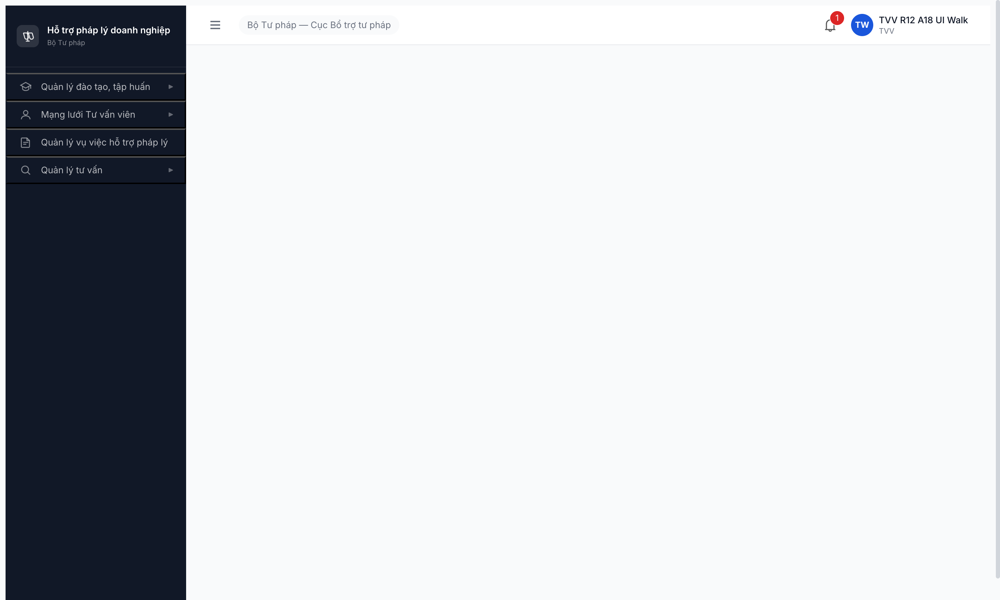
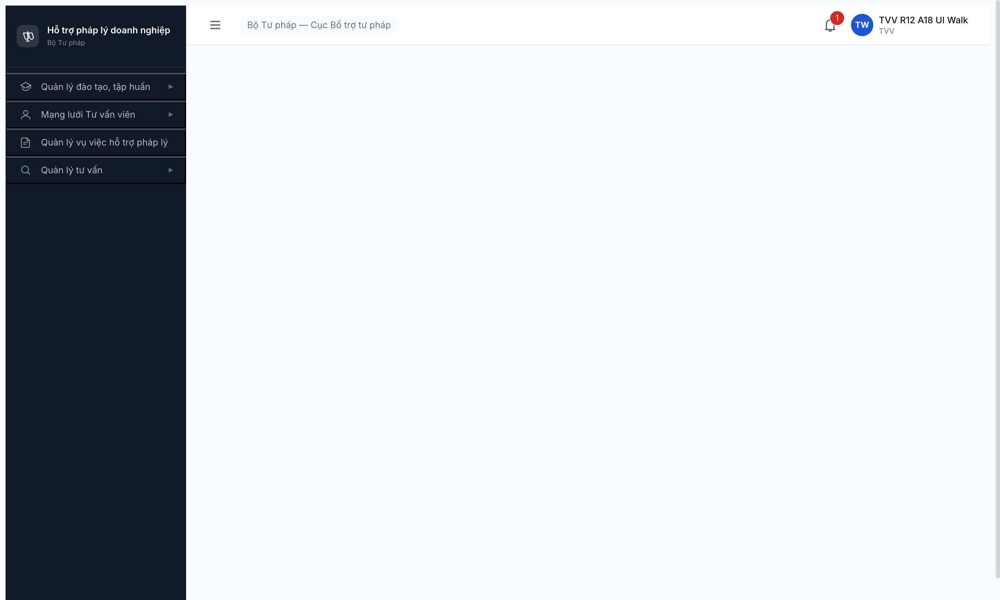

# Bug Report — TVV first-login → Dashboard 403

| Thông tin | Giá trị |
|-----------|---------|
| **Dự án** | PM HTPLDN |
| **Môi trường** | http://103.172.236.130:3000 |
| **Người test** | QA-claude |
| **Ngày** | 2026-05-09 09:00:00 |
| **Loại test** | Workflow / Permission / UI |
| **Round** | R12 (R7.4.A1.6 fresh TVV walk UI thuần) |
| **Tài liệu tham chiếu** | [`workflow-test-report-r7-4-a1-6.md`](../../workflow/tu-van-vien-cg/workflow-test-report-r7-4-a1-6.md) · [`srs-update-2026-5-5/srs-fr-10-quan-tri.md`](../../../../input/srs-update-2026-5-5/srs-fr-10-quan-tri.md) FR-VIII-26 + FR-VIII-18 |

---

## Tổng hợp

Phát hiện **1** lỗi có SRS reference cụ thể trong R12 walk fresh TVV-BTP-TW-0034.

### Severity breakdown

| Tổng | Critical | Major | Medium | Minor | Trivial |
|------|----------|-------|--------|-------|---------|
| 1    | 0        | 1     | 0      | 0     | 0       |

## Bug Summary Table

| Bug ID | Severity | Priority | Type | TC Ref | **SRS Reference** | Title | Status |
|--------|----------|----------|------|--------|-------------------|-------|--------|
| ~~BUG-TVV-A1-6-001~~ | Major | P1 | Permission / UX | R7.4.A1.6 TC4 | `srs-update-2026-5-5/srs-fr-10-quan-tri.md` FR-VIII-18 §Processing Bước 13 (line 927) + FR-VIII-26 §Acceptance Criteria (line 1314) | ~~TVV vừa kích hoạt + auto-login → `/dashboard` toast "Bạn không có quyền truy cập chức năng này." + main panel TRỐNG~~ | Closed |

---

## ~~BUG-TVV-A1-6-001~~ [CLOSED] — TVV first-login → Dashboard 403

> **Re-test:** 2026-05-09 09:39:00 R13 — ✅ PASS (Closed-verified). Fresh TVV-BTP-TW-0035 (`tvv_r13_a19`) walk full lifecycle MDK→HOAT_DONG, sau set MK + auto-login: URL redirect `/dao-tao/chuong-trinh/danh-sach` (NO toast 403, NO main trống). Cross-check navigate trực tiếp `/dashboard` → FE auto-redirect `/dao-tao/chuong-trinh/danh-sach`. Verify 2 lần độc lập.

### 1. Mô tả

Sau khi TVV-BTP-TW-0034 đặt mật khẩu lần đầu qua link kích hoạt và auto-login thành công (toast "Kích hoạt tài khoản thành công" hiện), FE redirect TVV về `/dashboard` mặc định. Tại đây xuất hiện toast lỗi đỏ icon close-circle `"Bạn không có quyền truy cập chức năng này."` và main panel render hoàn toàn trống. TVV không có pageview default phù hợp role mặc dù sidebar render đủ 4 menu nhóm hợp lệ (Đào tạo / Mạng lưới TVV / Vụ việc / Tư vấn). User trải nghiệm như hệ thống fail dù role TVV đã active.

### 2. Các bước tái hiện

1. Tạo TVV mới qua UI cb_nv_tw_01 (form "Thêm TVV") → state `MOI_DANG_KY`.
2. Walk lifecycle: Gửi KQ thẩm định (DTĐ) → Trình duyệt (CPĐ) → Phê duyệt (CKH).
3. TK auto-tạo username `tvv_r12_a18` ở state `CHO_KICH_HOAT`, mail kích hoạt fire MailHog inbox.
4. Click link `:3000/auth/first-login-password?token=...` → form 2 ô MK.
5. Fill MK `TvvR12A18@2026` (đủ độ mạnh) → click "Đặt mật khẩu và đăng nhập".
6. FE redirect `/dashboard` + toast success "Kích hoạt tài khoản thành công" hiện ~3s.
7. **(Repeat reproduce)** Logout, vào `/login`, nhập `tvv_r12_a18` / `TvvR12A18@2026` → OTP `666666`.
8. FE redirect `/dashboard` → toast lỗi đỏ icon close-circle `"Bạn không có quyền truy cập chức năng này."` xuất hiện, main panel rỗng (`<main></main>` empty children).

### 3. Kết quả mong đợi (theo SRS)

- **FR-VIII-18 §Processing Bước 13 (line 927):** "Chuyển hướng về Dashboard" sau khi đăng nhập thành công.
- **FR-VIII-18 §Acceptance Criteria (line 954):** "Given user nhập username/password đúng + mã TOTP đúng When đăng nhập Then xác thực thành công, tạo phiên, redirect Dashboard."
- **FR-VIII-26 §Acceptance Criteria (line 1314):** "Given TVV mới được CB Phê duyệt duyệt và nhận mail kích hoạt When bấm link + đặt mật khẩu lần đầu Then TAI_KHOAN và TU_VAN_VIEN đồng thời chuyển HOAT_DONG, **TVV đăng nhập được**."
- **Implication:** "TVV đăng nhập được" + "redirect Dashboard" → TVV phải landing 1 trang chức năng phù hợp role TVV (vd dashboard riêng cho TVV với widget Vụ việc của tôi / Hợp đồng TV / Lịch tư vấn) HOẶC redirect về 1 module mặc định (vd `/mang-luoi-tvv`). KHÔNG hiển thị toast 403 + main panel trống.

### 4. Kết quả thực tế

- URL stuck `/dashboard`. FE render `<main>` element không có children (verified bằng `evaluate_script` trả `mainEmpty: true`, `mainHTML: ""`).
- Toast lỗi đỏ icon close-circle text: `"Bạn không có quyền truy cập chức năng này."` (capture full snapshot a11y tree uid=313_20 image "close-circle" + uid=313_21 StaticText).
- Sidebar render đầy đủ 4 menu nhóm (Đào tạo / Mạng lưới TVV / Vụ việc / Tư vấn) — TVV CÓ quyền vào các module này, chứng tỏ role + permission đã active đúng.
- Network tab không có request 4xx tới `/api/v1` (verified `list_network_requests`: chỉ `/auth/me 304` + `/thong-baos/unread-count 304`). Suy ra toast lỗi là **FE-side CASL ability check** trên route `/dashboard` chứ không phải BE 403 response.
- localStorage `auth-store` empty (auth = null trong evaluate_script) — app dùng HttpOnly cookie cho session. CASL ability load từ `/auth/me` payload chưa được verify đầy đủ trong evidence này.

### 5. Bằng chứng

**Toast lỗi (R12 reproduce session 09:00:00):**



**Dashboard rỗng + sidebar 4 menu (jpeg compressed):**



**Network requests sau auto-login (no 4xx tới `/api/v1`):**

```
reqid=321 GET /api/v1/auth/me [401]      ← stale cookie từ session cũ qtht_01 logout
reqid=322 POST /api/v1/auth/login [200]
reqid=323 POST /api/v1/auth/verify-otp [200]
reqid=324 GET /api/v1/auth/me [304]      ← session TVV mới, BE OK
reqid=325 GET /api/v1/thong-baos/unread-count [304]
```

Toast lỗi xuất hiện ngay sau khi `/auth/me 304` resolve — trước khi FE render dashboard widgets. Dấu hiệu rõ ràng `PermissionRoute` / `auth-rules.ts` (xem source path `/src/utils/auth-rules.ts` + `/src/components/PermissionRoute/denied-access.tsx`) chặn access dashboard cho role TVV nhưng không redirect về route khả dụng.

**Console:** sạch (không error/warn — verified `list_console_messages({types:["error","warn"]})` trả `<no console messages found>`).

**State entity (sanity check):** TVV-BTP-TW-0034 + TK `tvv_r12_a18` đều `HOAT_DONG` đúng FR-VIII-26 (BR phía data đã pass). Login flow xác thực thành công (URL `/dashboard`, header role chip "TVV", tên "TVV R12 A18 UI Walk"). Vấn đề chỉ ở routing/permission default cho role TVV.

### 6. So sánh

So sánh với role khác đã verify trong R7+:

| Role | Dashboard route | Behavior sau login | Match SRS line 927/954? |
|---|---|---|---|
| QTHT (qtht_01) | `/dashboard` | Render widget tổng quan hệ thống | ✅ |
| CB_NV_TW (cb_nv_tw_01/02) | `/dashboard` | Render widget vụ việc + KPI cấp TW | ✅ |
| CB_PD_TW (cb_pd_tw_02) | `/dashboard` | Render widget phê duyệt | ✅ |
| TVV (tvv_r12_a18) | `/dashboard` | **Toast 403 + main TRỐNG** | ❌ vi phạm |
| CG | (chưa test R12) | (cần re-test cùng pattern) | TBD |
| NHT (nht_04_ui) | `/dashboard` (R7.2.9b) | (cần re-verify, R7.2.9b ghi nhận redirect đúng SCR-IV-NHT) | TBD |

Suy luận: TVV (và có thể CG/NHT) là role "actor nghiệp vụ" không được FE cấp dashboard widget riêng — nhưng `/dashboard` route hiện tại không có handler cho role này → fallback PermissionRoute denied → toast 403 + main trống. Roles "cán bộ nội bộ" (QTHT/CB) có dashboard widget map sẵn nên render OK.

---

*BUG-TVV-A1-6-001 | log R12 2026-05-09 09:00:00 | reproduce 100% (1 click chain login)*
