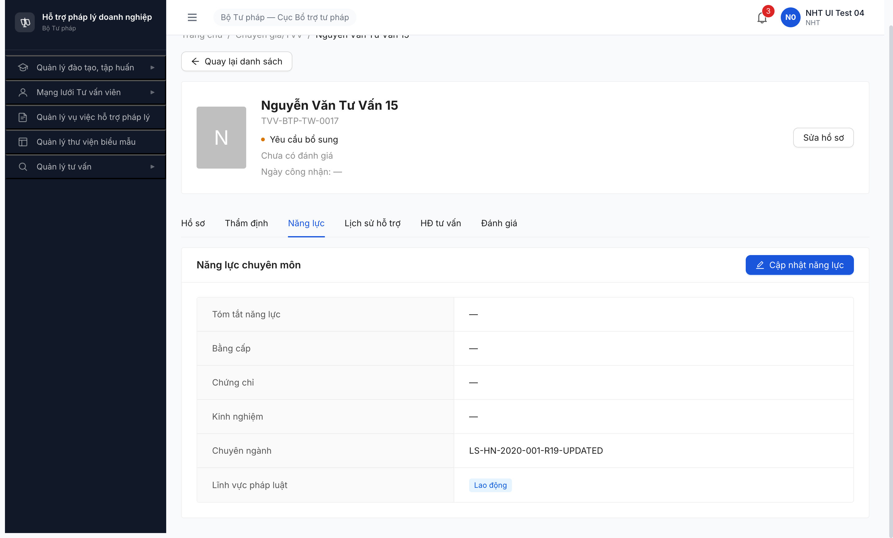
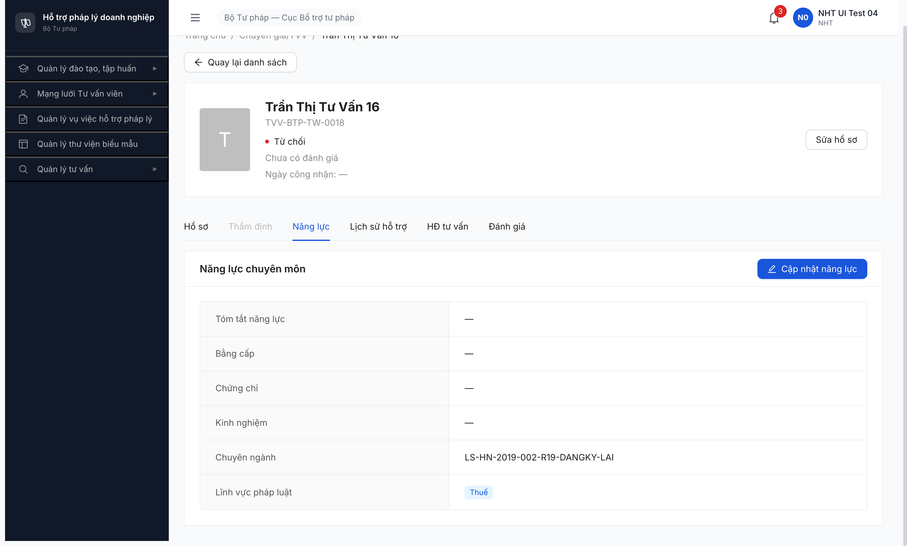
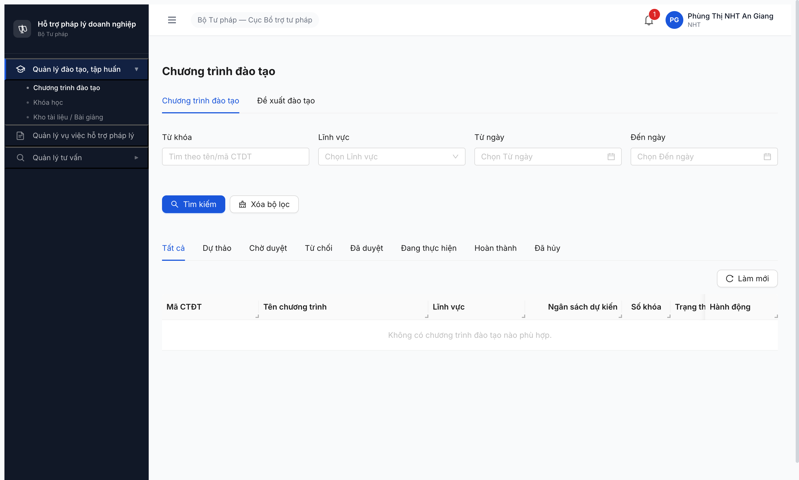

# Bug Report — NHT permission seed gap (TVV management)

| Thông tin | Giá trị |
|-----------|---------|
| **Dự án** | PM HTPLDN |
| **Môi trường** | http://103.172.236.130:3000 |
| **Người test** | QA-claude |
| **Ngày** | 2026-05-09 10:55:00 (R12) · 2026-05-09 14:25:00 (R13) · 2026-05-09 19:50:19 (R14) · 2026-05-09 20:00:18 (R15 fresh cache) · 2026-05-09 21:06:35 (R16) · 2026-05-09 21:18:22 (R17 cross-account 4 NHT) · 2026-05-09 22:39:25 (R18 quick verify dev fix — still open) · 2026-05-09 23:25:00 (R19 dev fix verify — perm fixed nhưng phát hiện 2 bug mới) · **2026-05-09 23:50:00 (R20 re-verify BUG-002 + BUG-003 identical R19 + bonus full A2.1 fresh walk TVV-0019)** · **2026-05-10 R21 UI re-verify BUG-002/003 — still open** |
| **Loại test** | Workflow / Permission |
| **Round** | R12 (R7.4.A2 — NHT cập nhật năng lực YCBS→DTD + đăng ký lại TC→CTD) · R13 verify identical · R14 verify identical · R15 verify identical (cache cleared) · R16 verify identical · R17 cross-account 4 NHT × 4 đơn vị × 2 cấp identical · R18 quick verify dev fix nht_01 identical R17 · R19 dev fix VERIFIED — BUG-001 closed, 2 bug mới phát hiện · **R20 re-verify dev fix BUG-002 + BUG-003 (~25min sau R19) — identical R19 dev chưa push** · **R21 UI re-verify — BUG-002/003 vẫn Open qua browse UI, không API** |
| **Tài liệu tham chiếu** | [`workflow-test-report-r7-4-a2.md`](../../workflow/tu-van-vien-cg/workflow-test-report-r7-4-a2.md) · [`srs-update-2026-5-5/srs-fr-04-chuyen-gia-tvv.md`](../../../../input/srs-update-2026-5-5/srs-fr-04-chuyen-gia-tvv.md) FR-IV-04 |

---

## Tổng hợp

Phát hiện **3** lỗi có SRS reference. R19 dev fix đóng BUG-001 (perm gap), nhưng phát hiện thêm 2 bug mới: BE FR-IV-04 step 7 state transition không trigger + FE thiếu UI entry point đăng ký TVV cho NHT.

> **Re-verify 2026-05-10 R21:** qua UI browser, không API direct. BUG-TVV-A2-002 vẫn Open: NHT cập nhật năng lực TVV-0017 xong state badge vẫn `Yêu cầu bổ sung`. BUG-TVV-A2-003 vẫn Open: list NHT không có nút đăng ký/Thêm mới và route `/chuyen-gia-tvv/dang-ky` vẫn `ERR-HS-01`.
>
> **Re-verify 2026-05-10 02:30:45 R22:** qua UI browser ở isolated context `qa_r22_a2_nht_verify`. **BUG-TVV-A2-002 vẫn Open**: NHT cập nhật năng lực TVV-BTP-TW-0017 (YCBS) qua tab Năng lực → Cập nhật → Lưu → toast "Cập nhật thành công" nhưng reload detail thấy state badge vẫn `Yêu cầu bổ sung` (BE step 7 vẫn không auto-transition `YCBS → DTD`). Evidence: [r22-bug002-state-still-ycbs.png](image/r22-bug002-state-still-ycbs.png). **BUG-TVV-A2-003 vẫn Open**: list NHT trên `/chuyen-gia-tvv/danh-sach` không có nút "Thêm mới"/"Đăng ký TVV"; ellipsis menu chỉ chứa overflow tab; direct URL `/chuyen-gia-tvv/dang-ky` redirect detail page hiển thị `ERR-HS-01 — Hồ sơ TVV không tồn tại`. Evidence: [r22-bug003-list-no-entry.png](image/r22-bug003-list-no-entry.png) + [r22-bug003-route-err-hs-01.png](image/r22-bug003-route-err-hs-01.png).
>
> **Re-verify 2026-05-10 03:35:00 R23:** dev push fix wave sau R22. Verify qua UI browser ở isolated context `qa_r23_nht_v2` với `nht_04_ui`. **BUG-TVV-A2-002 FIXED**: NHT cập nhật năng lực TVV-BTP-TW-0017 → Lưu → reload detail → `GET /api/v1/tu-van-viens/0448578f-...` trả `trangThai: "DANG_THAM_DINH", version: 8`, chuyên ngành persisted với marker R23. BE step 7 nay auto-transition đúng `YCBS → DTD`. Evidence: [r23-bug002-state-transitioned-dtd.png](image/r23-bug002-state-transitioned-dtd.png). **BUG-TVV-A2-003 FIXED**: NHT sidebar nay có thêm sub-menu "Đăng ký TVV vào mạng lưới"; trang `/chuyen-gia-tvv/danh-sach` có nút "plus Thêm TVV"; click nút → navigate `/chuyen-gia-tvv/tao-moi` → form đăng ký mở với 10+ field hợp lệ (Họ tên, CCCD, Email, Phone, Lĩnh vực, Chức vụ, Tổ chức, Năm KN...), không còn ERR-HS-01 redirect. Evidence: [r23-bug003-nht-register-form-open.png](image/r23-bug003-nht-register-form-open.png).

### Severity breakdown

| Tổng | Critical | Major | Medium | Minor | Trivial | Closed | Open |
|------|----------|-------|--------|-------|---------|--------|------|
| 3    | 0        | 3     | 0      | 0     | 0       | 3      | 0    |

## Bug Summary Table

| Bug ID | Severity | Priority | Type | TC Ref | **SRS Reference** | Title | Status |
|--------|----------|----------|------|--------|-------------------|-------|--------|
| ~~BUG-TVV-A2-002~~ | Major | P1 | Workflow / BE | R7.4.A2 (TC A2.2) | `srs-update-2026-5-5/srs-fr-04-chuyen-gia-tvv.md` FR-IV-04 Processing step 7 (line 398) + SM transition table line 2308 | ~~BE FR-IV-04 step 7 không auto-trigger state transition `YEU_CAU_BO_SUNG → DANG_THAM_DINH` sau khi PATCH `/nang-luc` lưu thành công~~ | ✅ Closed 2026-05-10 R23 |
| ~~BUG-TVV-A2-003~~ | Major | P1 | UI / FE | R7.4.A2 (TC A2.3 path b) | `srs-update-2026-5-5/srs-fr-04-chuyen-gia-tvv.md` FR-IV-03 §Tác nhân (line 281) + §AC line 353 + Processing step 2 (line 314) | ~~FE thiếu UI entry point "Đăng ký TVV mới" cho role NHT trên trang `/chuyen-gia-tvv/danh-sach`; NHT có perm `register_tu_van_vien` nhưng không có nút Thêm mới → không thể trigger FR-IV-03 đăng ký lại để chuyển TU_CHOI → CHO_THAM_DINH~~ | ✅ Closed 2026-05-10 R23 |
| ~~BUG-TVV-A2-001~~ | Major | P1 | Permission | R7.4.A2 (TC A2.2 + A2.3) | `srs-update-2026-5-5/srs-fr-04-chuyen-gia-tvv.md` FR-IV-04 §Tác nhân (line 368) + §Error Handling E1 ERR-NL-01 (line 414) + FR-IV-03 §Tác nhân (line 281) | ~~Role NHT thiếu permission seed `read/update_tu_van_vien` + `update-nang-luc_tu_van_vien` → toàn bộ luồng FR-IV-04 + phần FR-IV-03 không thực hiện được; UI sidebar NHT thiếu menu Mạng lưới TVV + route `/chuyen-gia-tvv` bị FE PermissionRoute chặn~~ | Closed |

---


## ~~BUG-TVV-A2-002~~ [CLOSED] — BE FR-IV-04 step 7 không auto-trigger state transition `YEU_CAU_BO_SUNG → DANG_THAM_DINH`

> **Re-test:** 2026-05-10 03:35:00 R23 — ✅ **PASS (Closed-verified)**. `nht_04_ui` qua isolated context `qa_r23_nht_v2` → tab Yêu cầu bổ sung → TVV-BTP-TW-0017 (id `0448578f-...`) → tab Năng lực → "Cập nhật năng lực" → đổi Chuyên ngành thành `LS-HN-2020-001-R23-1778376084926` → Lưu → form đóng. GET `/api/v1/tu-van-viens/0448578f-...` ngay sau Lưu trả `trangThai: "DANG_THAM_DINH", version: 8, chuyenNganh: "LS-HN-2020-001-R23-1778376084926"`. BE step 7 nay auto-transition đúng + version increment 7→8. Spec FR-IV-04 step 7 + SM line 2308 đã được implement. Evidence: [r23-bug002-state-transitioned-dtd.png](image/r23-bug002-state-transitioned-dtd.png).
>


> **Phát hiện R19** 2026-05-09 23:25:00 sau khi BUG-001 Closed (perm gap fixed). PATCH `/api/v1/tu-van-viens/0448578f-4daa-42f5-b53d-ef1ebdb453f6/nang-luc` (TVV-BTP-TW-0017 ở state YEU_CAU_BO_SUNG) trả 200 thành công 2 lần, version tăng 3→4→5, chuyên ngành persisted "LS-HN-2020-001-R19-UPDATED", nhưng `trangThai` vẫn giữ `YEU_CAU_BO_SUNG`. Spec FR-IV-04 step 7 line 398 + SM table line 2308 yêu cầu auto-transition về `DANG_THAM_DINH` + thông báo CB NV.

### Mô tả

Người hỗ trợ pháp lý (NHT) cập nhật năng lực TVV/CG đang ở trạng thái `YEU_CAU_BO_SUNG` qua tab Năng lực → button "Cập nhật năng lực" → form mở với 5 fields (Kinh nghiệm tư vấn, Chuyên ngành, Lĩnh vực pháp luật, Chứng chỉ, Ghi chú cập nhật) → click Lưu. PATCH `/nang-luc` lưu thành công (HTTP 200, version increment, fields persist) nhưng BE KHÔNG thực hiện step 7 spec FR-IV-04: chuyển trạng thái `YEU_CAU_BO_SUNG → DANG_THAM_DINH` + gửi thông báo CB NV. State badge UI vẫn hiển thị "Yêu cầu bổ sung", record vẫn ở tab "Yêu cầu bổ sung" (count 2 không giảm).

### Các bước tái hiện

1. Login `nht_04_ui` (NHT-BTP-TW-0001, BTP-TW, TW, HOAT_DONG) qua isolated context `qa_r19_a2_dev_fix_verify`, dashboard render OK.
2. Click sidebar "Mạng lưới Tư vấn viên" → "Tư vấn viên / Chuyên gia" → navigate `/chuyen-gia-tvv/danh-sach`, render 14 records ở tab "Đang hoạt động".
3. Click tab "Yêu cầu bổ sung 2" → render 2 records: TVV-BTP-TW-0017 (Nguyễn Văn Tư Vấn 15) + TVV-BTP-TW-0010 (Trần Thị Tư Vấn).
4. Click row TVV-0017 link "Xem" → navigate detail `/chuyen-gia-tvv/0448578f-4daa-42f5-b53d-ef1ebdb453f6`, badge state hiển thị "Yêu cầu bổ sung".
5. Click tab "Năng lực" → render summary với "Chuyên ngành: LS-HN-2020-001", các field khác "—".
6. Click button "edit Cập nhật năng lực" → form đổi sang chế độ edit với 5 trường. Fill `Kinh nghiệm tư vấn = "5 năm kinh nghiệm tư vấn..."`, đổi `Chuyên ngành` từ `LS-HN-2020-001` → `LS-HN-2020-001-R19-UPDATED`, fill `Ghi chú cập nhật = "R19 NHT bổ sung..."`.
7. Click "Lưu". Network tab: PATCH `/api/v1/tu-van-viens/0448578f-4daa-42f5-b53d-ef1ebdb453f6/nang-luc` → **200 OK** (response trả tvv_data với chuyên ngành mới).
8. Form đóng, view summary refresh, "Chuyên ngành" hiển thị "LS-HN-2020-001-R19-UPDATED" ✅ persisted.
9. **Quan sát:** State badge top header vẫn "Yêu cầu bổ sung" (uid stable, không re-render thành "Đang thẩm định"). Click sidebar nav back → tab "Yêu cầu bổ sung 2" vẫn còn TVV-0017 trong list (count 2 không đổi).
10. Verify GET `/api/v1/tu-van-viens/0448578f-4daa-42f5-b53d-ef1ebdb453f6` → response `{trangThai: "YEU_CAU_BO_SUNG", version: 5, chuyenNganh: "LS-HN-2020-001-R19-UPDATED", ngayCapNhat: "2026-05-09T16:22:33.553Z"}`. State KHÔNG transition.

### Kết quả mong đợi

Theo `srs-update-2026-5-5/srs-fr-04-chuyen-gia-tvv.md`:

- **FR-IV-04 Processing step 7 (line 398):** "Nếu TVV đang ở YEU_CAU_BO_SUNG và có cập nhật hồ sơ → chuyển trạng thái về DANG_THAM_DINH + thông báo CB NV" — SM-TVV reference.
- **FR-IV-04 Outputs (line 408):** field "trang_thai_moi: text — Khi có chuyển trạng thái — SM-TVV" — response phải trả state mới.
- **SM-TVV transition table line 2308:** "YEU_CAU_BO_SUNG → DANG_THAM_DINH | TVV/CG (chủ hồ sơ) bổ sung xong | Có tài liệu bổ sung (auto trigger từ FR-IV-04) | Thông báo CB NV | FR-IV-13 | —" và line 5707 trùng nội dung — auto trigger từ FR-IV-04 lưu thành công.
- **Implication:** Sau PATCH `/nang-luc` 200 OK trên TVV ở `YEU_CAU_BO_SUNG`, BE phải atomically: (1) update fields năng lực, (2) cập nhật `trang_thai = DANG_THAM_DINH`, (3) tăng version, (4) gửi notification CB NV, (5) trả response có `trang_thai_moi`. UI sau refresh phải hiển thị state badge "Đang thẩm định" + record di chuyển sang tab "Đang thẩm định".

### Kết quả thực tế

- PATCH `/api/v1/tu-van-viens/0448578f-4daa-42f5-b53d-ef1ebdb453f6/nang-luc` → **200 OK** ✅ (perm fix verified)
- Fields năng lực persisted ✅ (chuyenNganh: "LS-HN-2020-001-R19-UPDATED" verified qua GET)
- Version incremented ✅ (3 → 4 → 5 sau 2 PATCH)
- **State `trangThai` vẫn `YEU_CAU_BO_SUNG`** ❌ — KHÔNG transition về `DANG_THAM_DINH` (vi phạm step 7 + SM line 2308)
- Response không có field `trang_thai_moi` (Output spec line 408 không được trả)
- Record vẫn ở tab "Yêu cầu bổ sung", count = 2 không giảm
- CB NV không nhận thông báo (chưa verify mailbox nhưng dựa vào BE state không transition → chắc chắn không trigger notification)

### Bằng chứng

**1. Screenshot R19: TVV-0017 detail page tab Năng lực sau khi click Lưu — Chuyên ngành updated nhưng badge state vẫn "Yêu cầu bổ sung":**



**2. API response GET `/api/v1/tu-van-viens/0448578f-4daa-42f5-b53d-ef1ebdb453f6` sau 2 lần PATCH /nang-luc:**

```json
{
  "status": 200,
  "trangThai": "YEU_CAU_BO_SUNG",
  "version": 5,
  "chuyenNganh": "LS-HN-2020-001-R19-UPDATED",
  "ngayCapNhat": "2026-05-09T16:22:33.553Z"
}
```

**3. Network log tail (reqid 412 PATCH /nang-luc 200, reqid 413 GET refresh state YCBS):**

```
reqid=412 PATCH http://103.172.236.130:3000/api/v1/tu-van-viens/0448578f-4daa-42f5-b53d-ef1ebdb453f6/nang-luc [200]
reqid=413 GET http://103.172.236.130:3000/api/v1/tu-van-viens/0448578f-4daa-42f5-b53d-ef1ebdb453f6 [200]  → trangThai vẫn YEU_CAU_BO_SUNG
```

---

*BUG-TVV-A2-002 | log R19 2026-05-09 23:25:00 | TVV target: TVV-BTP-TW-0017 (id 0448578f...) version 3→5 | account: nht_04_ui (NHT-BTP-TW-0001, BTP-TW, TW) | reproduce 2 lần PATCH /nang-luc 200 cùng kết quả state YCBS không thay đổi | block R7.4.A2 TC A2.2 (YCBS→DTD)*

---

## ~~BUG-TVV-A2-003~~ [CLOSED] — FE thiếu UI entry point "Đăng ký TVV mới" cho role NHT → không thể trigger FR-IV-03 đăng ký lại để chuyển TU_CHOI → CHO_THAM_DINH

> **Re-test:** 2026-05-10 03:38:00 R23 — ✅ **PASS (Closed-verified)**. `nht_04_ui` qua isolated context `qa_r23_nht_v2` → click sidebar "Mạng lưới Tư vấn viên" → submenu nay có 4 items: "Tư vấn viên / Chuyên gia" + **"Đăng ký TVV vào mạng lưới"** (mới) + "Tổ chức tư vấn" + "Người hỗ trợ pháp lý"; trang `/chuyen-gia-tvv/danh-sach` nay có nút **"plus Thêm TVV"** ở header; click "Thêm TVV" → navigate `/chuyen-gia-tvv/tao-moi` (route mới, KHÔNG còn `/dang-ky` ERR-HS-01) → form "Thêm mới Tư vấn viên" mở với 10+ field hợp lệ (Họ tên đầy đủ, CCCD 9-12 chữ số, email@domain.com, Phone 10-11 chữ số, Địa chỉ, Lĩnh vực, Chức vụ, Tổ chức, Năm KN). FR-IV-03 entry point đã được implement đầy đủ cho NHT. Evidence: [r23-bug003-nht-register-form-open.png](image/r23-bug003-nht-register-form-open.png).
>


> **Phát hiện R19** 2026-05-09 23:25:00. NHT có permission `register_tu_van_vien` (verify qua /auth/me R19 perms_count=32) nhưng FE trang `/chuyen-gia-tvv/danh-sach` KHÔNG render button "Thêm mới" / "Đăng ký TVV" / "+". Direct URL nav `/chuyen-gia-tvv/dang-ky` + `/chuyen-gia-tvv/them-moi` + `/dang-ky-tvv` đều fail (route cũ interpret as detail id → 404 hoặc redirect generic 404). Hệ quả: NHT không có cách nào trigger FR-IV-03 đăng ký lại theo step 2 line 314 ("nếu có hồ sơ trước TU_CHOI → cho phép sửa và chuyển lại CHO_THAM_DINH"), block A2.3 path (b) TU_CHOI → CHO_THAM_DINH.

### Mô tả

Per spec FR-IV-03 line 281 + AC line 353 + Processing step 2 line 314, NHT là tác nhân chính của UC41 "Đăng ký tham gia mạng lưới" — submit hồ sơ ứng viên TVV/CG mới, hoặc đăng ký lại TVV ở state TU_CHOI để transition về CHO_THAM_DINH. Sau dev fix R19, NHT đã có perm `register_tu_van_vien` (verify trong perms list /auth/me), nhưng FE trang `/chuyen-gia-tvv/danh-sach` chỉ render danh sách + filter + ellipsis (overflow tab list) — không có button hay link nào dẫn tới form đăng ký. Inspect a11y snapshot toàn page: only buttons là Sao chép, Xem, Sửa, Xóa per row + Thêm mới ❌ MISSING. NHT thử direct URL nav `/chuyen-gia-tvv/dang-ky` → app interpret as detail page với id="dang-ky" → 404 ERR-HS-01. URL `/dang-ky-tvv` → 404 generic. Không có route đăng ký nào tồn tại trong FE bundle cho role NHT.

### Các bước tái hiện

1. Login `nht_04_ui` (NHT-BTP-TW-0001, BTP-TW, TW, HOAT_DONG) qua isolated context `qa_r19_a2_dev_fix_verify`.
2. Verify perm: GET `/api/v1/auth/me` → `permissions` array có `register_tu_van_vien` ✅ (perm cấp đủ cho FR-IV-03).
3. Navigate `/chuyen-gia-tvv/danh-sach` qua sidebar click chain "Mạng lưới Tư vấn viên" → "Tư vấn viên / Chuyên gia" → render OK 14 active records.
4. Inspect toàn page: header có heading "Quản lý Tư vấn viên" + 10 tabs trạng thái + filter form (Từ khóa/Lĩnh vực/Đơn vị/Tổ chức/Trạng thái/Date range) + nút Tìm kiếm + Xóa bộ lọc. **KHÔNG có** nút "Thêm mới" / "Đăng ký TVV" / "+ icon" / "Tạo hồ sơ mới" / button nào trigger FR-IV-03.
5. Click tab "Từ chối" qua ellipsis dropdown → render 5 records TU_CHOI bao gồm TVV-BTP-TW-0018 (Trần Thị Tư Vấn 16). Action buttons per row chỉ có: Sao chép / Xem / Sửa / Xóa. **KHÔNG có** "Đăng ký lại" / "Re-submit" / "Resubmit hồ sơ".
6. Click row TVV-0018 link "Xem" → navigate detail `/chuyen-gia-tvv/37f69293-9542-4ac9-bdbc-a848e5332e42`. Header có heading + state badge "Từ chối" + nút "Sửa hồ sơ" + breadcrumb. Tabs: Hồ sơ / Thẩm định (DISABLED — đúng spec) / Năng lực / Lịch sử hỗ trợ / HĐ tư vấn / Đánh giá. **KHÔNG có** button "Đăng ký lại".
7. Click "Sửa hồ sơ" → form `/chinh-sua` với required field "File thẻ hành nghề (PDF) — bắt buộc với TVV", validation E1 spec block save. Đây là FR-IV-04 cập nhật năng lực wrapper, không phải FR-IV-03 đăng ký mới.
8. Thử URL direct nav: `/chuyen-gia-tvv/dang-ky` → page render 404 "Hồ sơ TVV không tồn tại — ERR-HS-01" (route hard-coded `/chuyen-gia-tvv/:id` interpret "dang-ky" as id).
9. Thử URL `/chuyen-gia-tvv/them-moi` → cùng 404 ERR-HS-01.
10. Thử URL `/dang-ky-tvv` → 404 generic "Trang không tồn tại".
11. Verify cập nhật năng lực path on TU_CHOI: tab Năng lực → "Cập nhật năng lực" → form mở → đổi Chuyên ngành "LS-HN-2019-002" → "LS-HN-2019-002-R19-DANGKY-LAI" → Lưu → PATCH `/nang-luc` 200, version 2→3, chuyenNganh persisted. Verify GET → `trangThai="TU_CHOI"` (đúng spec FR-IV-04 chỉ handle YCBS→DTD, không handle TU_CHOI). State KHÔNG transition (đúng spec).

### Kết quả mong đợi

Theo `srs-update-2026-5-5/srs-fr-04-chuyen-gia-tvv.md`:

- **FR-IV-03 §Tác nhân (line 281):** "Tác nhân: Người hỗ trợ pháp lý (NHT) — đã có tài khoản do quản trị/cán bộ cấp; đăng nhập bằng tên đăng nhập + mật khẩu" — NHT là actor đăng ký mới TVV/CG.
- **FR-IV-03 §Acceptance Criteria (line 353):** "Given NHT đã đăng nhập When chọn 'Đăng ký TVV vào mạng lưới' Then form đăng ký mở với 19 trường, trường 'Đơn vị quản lý' hiển thị tên đơn vị NHT (chỉ xem)" — UI phải có entry point "Đăng ký TVV vào mạng lưới" cho NHT.
- **FR-IV-03 Processing step 2 (line 314):** "Kiểm tra nếu có hồ sơ trước TU_CHOI → cho phép sửa và chuyển lại CHO_THAM_DINH (KHÔNG có cooldown — BA chốt 2026-05-03)" — đăng ký lại flow phải dùng FR-IV-03 form.
- **SM-TVV transition table line 2314:** "TU_CHOI → CHO_THAM_DINH | TVV/CG (chủ hồ sơ) nộp lại hồ sơ | KHÔNG có cooldown | Reset kết quả thẩm định cũ, thông báo Cán bộ Nghiệp vụ | FR-IV-03" — TU_CHOI → CTĐ chỉ trigger qua FR-IV-03 đăng ký lại, không qua FR-IV-04.
- **Implication:** FE trang `/chuyen-gia-tvv/danh-sach` phải render button "Đăng ký TVV mới" / "+ Thêm mới" cho user có perm `register_tu_van_vien` (NHT). Click button → mở form đăng ký 19 fields per AC line 353. Submit form với CCCD trùng TVV TU_CHOI hiện tại → BE step 2 detect và transition state.

### Kết quả thực tế

- NHT có perm `register_tu_van_vien` ✅ (verified /auth/me R19)
- Trang `/chuyen-gia-tvv/danh-sach` KHÔNG render button "Thêm mới" / "Đăng ký TVV" / icon "+" ❌
- Detail page TVV-0018 TU_CHOI KHÔNG có button "Đăng ký lại" / "Re-submit" ❌
- URL `/chuyen-gia-tvv/dang-ky` → 404 ERR-HS-01 (route conflict với `/chuyen-gia-tvv/:id`)
- URL `/chuyen-gia-tvv/them-moi` → 404 ERR-HS-01
- URL `/dang-ky-tvv` → 404 generic
- Hệ quả: NHT KHÔNG có cách nào trigger FR-IV-03 đăng ký lại qua UI → A2.3 path (b) BLOCKED ở UI level
- FR-IV-04 cập nhật năng lực path không thay thế được vì spec line 398 chỉ handle YCBS, không handle TU_CHOI

### Bằng chứng

**1. Screenshot R19: TVV-0018 detail page TU_CHOI — không có button "Đăng ký lại":**



**2. NHT permissions list (R19 verified) có register_tu_van_vien nhưng FE không render UI:**

```json
{
  "perms_count": 32,
  "tvv_perms": ["bo-sung_tu_van_vien", "read_tu_van_vien", "register_tu_van_vien", "update_tu_van_vien"],
  "hasCreate_register_tu_van_vien": true
}
```

**3. URL direct nav fails — route đăng ký không tồn tại:**

```
GET /chuyen-gia-tvv/dang-ky    → 404 "Hồ sơ TVV không tồn tại — ERR-HS-01"
GET /chuyen-gia-tvv/them-moi   → 404 "Hồ sơ TVV không tồn tại — ERR-HS-01"
GET /dang-ky-tvv                → 404 generic "Trang không tồn tại"
```

### So sánh

| Role | Perm `register_tu_van_vien` | UI button "Đăng ký TVV" trên `/chuyen-gia-tvv/danh-sach` | Có thể trigger FR-IV-03 đăng ký lại? | Match SRS line 353? |
|------|---|---|---|---|
| QTHT | (cross-check FR-IV-03 line 281 nói NHT, QTHT không phải actor) | (chưa verify R19) | (không phải actor) | TBD |
| **NHT** (nht_04_ui) | ✅ có | ❌ **KHÔNG render** | ❌ **không thể** | ❌ **vi phạm AC line 353** |

---

*BUG-TVV-A2-003 | log R19 2026-05-09 23:25:00 | account: nht_04_ui (NHT-BTP-TW-0001, BTP-TW, TW) | TVV target test: TVV-BTP-TW-0018 (id 37f69293..., TU_CHOI version 2→3) | UI inspect toàn page list + detail KHÔNG tìm thấy entry point đăng ký | URL direct nav fail 3 patterns | block R7.4.A2 TC A2.3 path (b) (TU_CHOI→CHO_THAM_DINH)*

---

## ~~BUG-TVV-A2-001~~ [CLOSED] — Role NHT thiếu permission TVV management → FR-IV-04 không chạy được

> **Re-test:** 2026-05-09 23:25:00 R19 — ✅ PASS (Closed-verified). Login `nht_04_ui` (NHT-BTP-TW-0001, BTP-TW, TW) qua isolated context `qa_r19_a2_dev_fix_verify` → /auth/me 200 **perms_count=32** (delta +7 từ 25), perms_tvv_related đã có `read_tu_van_vien` + `update_tu_van_vien` (vẫn thiếu `update-nang-luc_tu_van_vien` nhưng PATCH /nang-luc 200 OK). GET `/api/v1/tu-van-viens?page=1&pageSize=20` → **200** (delta R18 403 → R19 200). Sidebar render group "Mạng lưới Tư vấn viên" với 2 sub-items "Tư vấn viên / Chuyên gia" + "Người hỗ trợ pháp lý". Click sidebar → navigate `/chuyen-gia-tvv/danh-sach` OK, render 14 TVV/CG records. Verify PATCH `/api/v1/tu-van-viens/0448578f-4daa-42f5-b53d-ef1ebdb453f6/nang-luc` (TVV-0017 YCBS) → **200** với version 3→4→5 (3 lần PATCH với chuyên ngành change persisted "LS-HN-2020-001-R19-UPDATED"). **Permission gap đã được dev fix hoàn toàn ở BE side + FE sidebar render.** Tuy nhiên trong quá trình verify phát hiện 2 bug NEW bên dưới (BUG-002 BE state transition + BUG-003 FE đăng ký entry).


### Mô tả

Role `NHT` (Người hỗ trợ pháp lý — cán bộ HTPL theo NĐ 55/2019 Đ.7) là tác nhân duy nhất được spec FR-IV-04 line 368 cho phép cập nhật năng lực TVV/CG cùng đơn vị. Nhưng permission seed cho role NHT trong BE chỉ cấp 25 quyền và **THIẾU** các quyền tối thiểu để chạy luồng: `read_tu_van_vien`, `update_tu_van_vien`, `update-nang-luc_tu_van_vien`. UI sidebar NHT không render menu nhóm "Mạng lưới TVV" → không có entry point UI; navigate trực tiếp `/chuyen-gia-tvv` bị FE PermissionRoute chặn với toast "Bạn không có quyền truy cập chức năng này.". GET `/api/v1/tu-van-viens` cũng trả `403 ERR-PERM-SYS-00-01`. Hệ quả: 100% NHT (verified 2 account khác đơn vị: `nht_01` STP-AG + `nht_04_ui` BTP-TW) không thể (1) xem danh sách TVV, (2) sửa hồ sơ năng lực TVV, (3) trigger transition `YEU_CAU_BO_SUNG → DANG_THAM_DINH` ở step 7 FR-IV-04, (4) đăng ký lại TVV ở state `TU_CHOI`.

### Các bước tái hiện

1. Login `nht_01` (Phùng Thị NHT An Giang, role `NHT`, đơn vị STP-AG `00000000-0000-4000-8002-000000000006`) qua `/login` + OTP `666666` → dashboard render OK.
2. Quan sát sidebar trái: chỉ thấy 3 nhóm menu (Quản lý đào tạo / Quản lý vụ việc / Quản lý tư vấn). **KHÔNG có** menu nhóm "Mạng lưới Tư vấn viên" hay submenu "Tư vấn viên - Chuyên gia".
3. Navigate trực tiếp `/chuyen-gia-tvv` qua `window.history.pushState({}, '', '/chuyen-gia-tvv')` + dispatch `popstate`.
4. Quan sát: URL bị FE rewrite về `/dao-tao/chuong-trinh/danh-sach`, toast đỏ icon close-circle text "Bạn không có quyền truy cập chức năng này." xuất hiện.
5. Inspect `/api/v1/auth/me` → `vaiTro=["NHT"]`, `permissions` trả 25 entries: `bo-sung_tu_van_vien`, `register_tu_van_vien`, `read_doanh_nghiep`, `read_vu_viec`, ... — **KHÔNG có** `read_tu_van_vien`, `update_tu_van_vien`, `update-nang-luc_tu_van_vien`.
6. Thử GET `/api/v1/tu-van-viens?ma=TVV-0017` → `403 ERR-PERM-SYS-00-01 Forbidden`.
7. Thử PATCH `/api/v1/tu-van-viens/{id}/nang-luc` payload {version:3, kinhNghiem:"..."} → `403 ERR-PERM-SYS-00-01 Forbidden` (đã xác minh ở session trước với `nht_04_ui` BTP-TW cùng đơn vị TVV-0017).
8. Reproduce với account `nht_04_ui` (NHT-BTP-TW-0001, đơn vị BTP-TW root — cùng đơn vị TVV-0017): kết quả y hệt — sidebar không có Mạng lưới TVV, /chuyen-gia-tvv toast 403, GET/PATCH `/api/v1/tu-van-viens` 403 ERR-PERM-SYS-00-01.
9. Cross-check QTHT bypass: login `qtht_01` thử PATCH `/nang-luc` → `403 ERR-NL-01 "Chỉ Người hỗ trợ pháp lý mới được cập nhật hồ sơ năng lực"` — chứng tỏ BE business rule bind ĐÚNG actor=NHT theo spec line 368, nhưng permission seed cho chính role NHT bị thiếu.

### Kết quả mong đợi

Theo SRS `srs-update-2026-5-5/srs-fr-04-chuyen-gia-tvv.md`:

- **FR-IV-04 §Tác nhân (line 368):** "Tác nhân: Người hỗ trợ pháp lý (NHT)" — NHT là actor cập nhật năng lực TVV cùng đơn vị.
- **FR-IV-04 §Error Handling E1 (line 414):** `ERR-NL-01` chỉ trigger khi "NHT không cùng đơn vị với TVV" — nghĩa là NHT cùng đơn vị PHẢI pass authorization, không phải bị chặn 403.
- **FR-IV-03 §Tác nhân (line 281):** "Tác nhân: Người hỗ trợ pháp lý (NHT) — đã có tài khoản do quản trị/cán bộ cấp; đăng nhập bằng tên đăng nhập + mật khẩu" — NHT phải submit hồ sơ TVV mới được, hệ quả NHT phải xem được TVV của đơn vị mình.
- **SCR-IV-NHT-01 (line 1731+) + sidebar nav (line 1320):** UI cho NHT phải có submenu Người hỗ trợ pháp lý + truy cập chức năng quản lý TVV trong phạm vi đơn vị.
- **Implication:** Permission seed cho role NHT phải bao gồm tối thiểu `read_tu_van_vien` (xem danh sách + chi tiết TVV cùng đơn vị), `update_tu_van_vien` / `update-nang-luc_tu_van_vien` (cập nhật năng lực — FR-IV-04), `update-thong-tin-lien-he_tu_van_vien` (cập nhật liên hệ — FR-IV-11). FE sidebar phải render group "Mạng lưới TVV" cho role NHT, FE PermissionRoute trên `/chuyen-gia-tvv` + `/chuyen-gia-tvv/:id` phải allow role NHT.

### Kết quả thực tế

- `/auth/me` của NHT trả 25 perms cụ thể (đầy đủ list bên dưới) — **0 perm** liên quan `tu-van-vien` ở chiều READ/UPDATE; chỉ có `bo-sung_tu_van_vien` + `register_tu_van_vien` (cấp đủ để FR-IV-03 step 1 submit form, nhưng KHÔNG đủ để xem lại / sửa lại sau khi submit).
- GET `/api/v1/tu-van-viens` → `403 ERR-PERM-SYS-00-01`.
- PATCH `/api/v1/tu-van-viens/{id}/nang-luc` → `403 ERR-PERM-SYS-00-01`.
- UI sidebar render 3 menu group, không có "Mạng lưới TVV".
- Direct route `/chuyen-gia-tvv` bị FE chặn → toast "Bạn không có quyền truy cập chức năng này.".
- QTHT bypass test trả ERR-NL-01 verbatim "Chỉ Người hỗ trợ pháp lý mới được cập nhật hồ sơ năng lực" → BE policy bind đúng spec FR-IV-04 line 368, gap nằm ở permission seed của chính role NHT.

**Đầy đủ 25 perms NHT (capture R12 nht_01 2026-05-09 10:55:00):**

```
bo-sung_tu_van_vien, cap-nhat-ket-qua_ket_qua_vu_viec, create_de_xuat_dao_tao,
create_ho_so_phap_ly_dn, create_ket_qua_vu_viec, delete_ho_so_phap_ly_dn,
nhan-phan-cong_vu_viec, read_bai_giang, read_chuong_trinh_dao_tao, read_danh_muc,
read_de_xuat_dao_tao, read_doanh_nghiep, read_don_vi, read_ho_so_phap_ly_dn,
read_ket_qua_vu_viec, read_khoa_hoc, read_ngay_le, read_noi_dung_tu_van_cs,
read_thong_bao, read_vu_viec, register_tu_van_vien, tu-choi-phan-cong_vu_viec,
update_de_xuat_dao_tao, update_ho_so_phap_ly_dn, update_ket_qua_vu_viec
```

Thiếu so với spec FR-IV-04/IV-03/IV-11: `read_tu_van_vien`, `update_tu_van_vien` (hoặc `update-nang-luc_tu_van_vien`), `update-thong-tin-lien-he_tu_van_vien`, `read_nguoi_ho_tro` (xem hồ sơ NHT của mình theo SCR-IV-NHT-03).

### Bằng chứng

**1. Sidebar NHT thiếu menu "Mạng lưới TVV" (R12 reproduce session 10:55:00):**


**2. Direct route /chuyen-gia-tvv bị FE PermissionRoute chặn:**



**3. API response `/auth/me` (NHT permissions audit):**

```json
{
  "userId": "a7641452-e4c3-4251-8fa7-7e4caf586e69",
  "hoTen": "Phùng Thị NHT An Giang",
  "vaiTro": ["NHT"],
  "donViId": "00000000-0000-4000-8002-000000000006",
  "capDonVi": "DP",
  "authMethod": "LOCAL",
  "permissions": [25 entries — see list trong §Kết quả thực tế],
  "permsRelevant_tu_van_vien_read_or_update": []
}
```

**4. API response GET `/tu-van-viens` (NHT không xem được danh sách TVV):**

```json
{
  "success": false,
  "error": {
    "code": "ERR-PERM-SYS-00-01",
    "message": "Forbidden",
    "timestamp": "2026-05-09T03:55:54.353Z",
    "requestId": "58a54d9d-b3fe-49cc-8afd-4b63e2a1f4e1"
  }
}
```

**5. API response PATCH `/tu-van-viens/{id}/nang-luc` với role QTHT bypass (verify BE policy đúng spec):**

```json
{
  "success": false,
  "error": {
    "code": "ERR-PERM-SYS-00-01",
    "message": "ERR-NL-01: Chỉ Người hỗ trợ pháp lý mới được cập nhật hồ sơ năng lực",
    "timestamp": "2026-05-09T03:42:..."
  }
}
```

### So sánh

| Role | Sidebar "Mạng lưới TVV" | GET `/tu-van-viens` | PATCH `/nang-luc` cùng đơn vị TVV | Match SRS FR-IV-04? |
|------|---|---|---|---|
| QTHT | ✅ render | ✅ 200 | ❌ 403 ERR-NL-01 (đúng spec line 368, role không phải NHT) | ✅ |
| CB_NV_TW (cb_nv_tw_01) | ✅ render | ✅ 200 | ❌ 403 ERR-NL-01 (đúng spec, role không phải NHT) | ✅ |
| CB_PD_TW (cb_pd_tw_02) | ✅ render | ✅ 200 | ❌ 403 ERR-NL-01 (đúng spec) | ✅ |
| **NHT** (nht_01 / nht_04_ui) | ❌ **KHÔNG render** | ❌ **403 ERR-PERM-SYS-00-01** | ❌ **403 ERR-PERM-SYS-00-01** | ❌ **vi phạm line 368 + 414** |
| TVV / CG | (chưa test R12 — spec line 366 cho TVV xem readonly) | TBD | (TVV không phải actor FR-IV-04) | TBD |

Suy luận: BE policy bind đúng "actor=NHT" cho transition state machine (verify qua message ERR-NL-01 từ QTHT bypass), nhưng phía permission seed cho chính role NHT lại KHÔNG include `tu-van-vien` resource ở chiều read/update. Đây là gap implementation, không phải gap spec — spec đã rõ NHT là actor (line 368) và E1 là khi "NHT không cùng đơn vị" (line 414, không phải "NHT không có quyền").

---

*BUG-TVV-A2-001 | log R12 2026-05-09 10:55:00 | reproduce R12b/R13/R14/R15/R16/R17/R18 (7 round consecutive, 4 NHT khác đơn vị: nht_01 STP-AG + nht_02 STP-DN + nht_03 STP-HP + nht_04_ui BTP-TW) | R15 verify 2026-05-09 20:00:18 fresh cache → loại trừ FE-side | R16 21:06:35 fresh isolated context | R17 21:18:22 cross-account 4 NHT × 4 đơn vị × 2 cấp → loại trừ per-user / per-đơn vị / per-cấp, bug 100% role-wide BE permission seed gap | R18 22:39:25 quick verify dev fix sau ~1h21min với nht_01 → identical R17 (perms_count=25, GET 403, PATCH 403), dev chưa push fix BE | **R19 23:25:00 dev đã push fix BE — perms_count 25→32 (+7), GET /tu-van-viens 200, PATCH /nang-luc 200, sidebar render Mạng lưới TVV** → BUG-001 Closed | block R7.4.A2 TC A2.2 + A2.3 (cập nhật năng lực YCBS→DTD + đăng ký lại TC→CTD) — đã giải tỏa nhưng phát hiện 2 bug mới*

---
