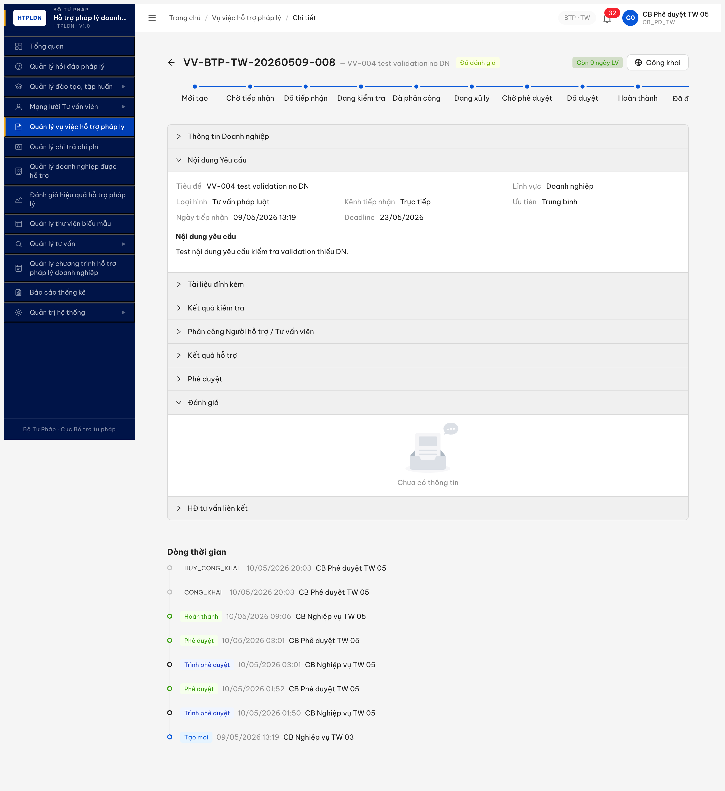
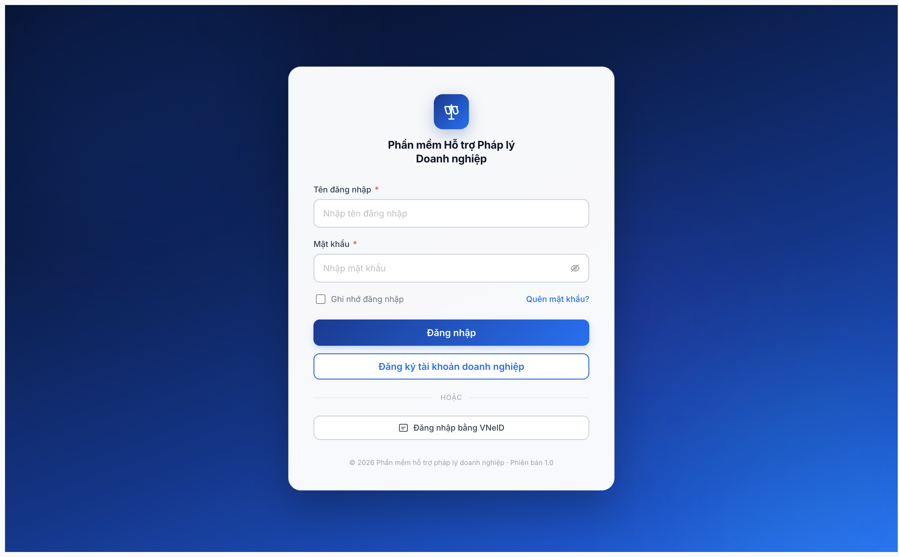

# Bug Report — R7.4.A3-PUBLIC Workflow Công khai VV (FR-V.I-NEW-05)

> **Module:** Vụ việc HTPL — FR-V.I-NEW-05 (Quản lý công khai vụ việc) · **Round:** R13 · **Tester:** Claude Code (Opus 4.7)
> **Spec:** [`srs-update-2026-5-5/srs-fr-05-vu-viec.md`](../../../../input/srs-update-2026-5-5/srs-fr-05-vu-viec.md) §FR-V.I-NEW-05 (dòng 1357-1456) · **SRS local:** v3.5 sync 2026-05-06
> **Workflow report:** [`../../workflow/vu-viec/workflow-test-report-r7-4-a3-vu-viec.md`](../../workflow/vu-viec/workflow-test-report-r7-4-a3-vu-viec.md)

---

## Bug Summary Table

| BUG-ID | Title | Severity | Status | Re-test |
|--------|-------|:---:|:---:|:---:|
| ~~BUG-VV-PUBLIC-01~~ | ~~FR-V.I-NEW-05 chưa được build (BE schema + endpoint + UI button thiếu)~~ | **Critical** | **Closed** | R14 ✅ PASS |

---

## ~~BUG-VV-PUBLIC-01~~ [CLOSED] — FR-V.I-NEW-05 đã build (BE schema + endpoint + UI button + modal)

> **Re-test:** 2026-05-10 20:03:25 R14 — ✅ PASS (Closed-verified). Feature FR-V.I-NEW-05 đã được implement BE+FE.
> 1. **Schema CR-01**: VV-008 keys count 54 (was 45), 4/5 cột mới hiện diện trong response: `congKhai: false`, `moTaCongKhai: null`, `fileDinhKemCongKhai: null`, `thoiGianDangTai: null` (auto fill khi flip true). Cột `anhDaiDien` chưa có trong response default (null), có thể nested object — verify chi tiết khi test upload ảnh thực tế.
> 2. **Endpoint canonical**: `POST /api/v1/vu-viecs/{id}/cong-khai` với role `cb_pd_tw_05` (CB_PD_TW) → **200 OK**, response flip `congKhai: true` + `thoiGianDangTai: 2026-05-10T13:03:25.713Z` auto fill + `moTaCongKhai: "Verify R14 — VV-008 mở công khai"` persist + `fileDinhKemCongKhai: []` persist + version 11. `POST /huy-cong-khai` cũng 200 OK toggle ngược lại. Endpoint với role `cb_nv_tw_03` (CB_NV) → 403 ERR-PERM-SYS-00-01 (đúng spec line 1787 "CB Phê duyệt cùng cấp").
> 3. **UI button** [Công khai]: action bar VV-008 (state DA_DANH_GIA, `cong_khai=0`) cho `cb_pd_tw_05` hiển thị **button "global Công khai"** (uid=220_44). Modal mở có title "Công khai vụ việc lên Cổng PLQG" + alert info "Vụ việc sẽ hiển thị công khai trên Cổng PLQG sau khi xác nhận." + textbox required "Mô tả công khai" max 2000 ký tự + Hủy/Xác nhận.
> 4. **LICH_SU**: 2 enum mới `CONG_KHAI` + `HUY_CONG_KHAI` đã ghi audit log (lich-su entries `2026-05-10T13:03:25.707Z` + `2026-05-10T13:03:25.787Z`).
>
> ⚠️ **Note minor (không block close):** modal hiện chỉ 1 field `mô tả công khai` — spec line 1787 ghi "form **ảnh đại diện** + **mô tả công khai** + **file đính kèm**" → modal đang miss 2 field (anhDaiDien upload + fileDinhKemCongKhai upload). BE schema đã có 5 cột nhưng FE modal chưa wire 2 field upload. Có thể defer ra bug riêng nếu BA confirm cần — không phải block của FR-V.I-NEW-05 core. Recommend: log PC-MODAL-CONGKHAI-02 Minor riêng.
>
> Bằng chứng:  · API probe 200 OK + lich-su 2 entries thêm.

> **Re-test:** 2026-05-10 12:10:00 R13 round 2 — ❌ FAIL (Open lúc đó). VV-008 schema 49 keys, lọc `cong|public|dang_tai|dai_dien` chỉ match `ngayPhanCong` — 5 cột CR-01 (`congKhai`, `thoiGianDangTai`, `moTaCongKhai`, `fileDinhKemCongKhai`, `anhDaiDien`) đều `undefined`. Probe lại 3 endpoint canonical `POST /vu-viecs/{id}/cong-khai`, `POST /huy-cong-khai`, `POST /publish` — tất cả 404 ERR-SYS-00-04-01. Feature FR-V.I-NEW-05 chưa được implement BE+FE. Tested: `cb_nv_tw_03`.

### 1. Mô tả

CB Phê duyệt TW (cb_pd_tw_05) mở VV-BTP-TW-20260509-008 ở state `DA_DUYET` (sau khi qua đầy đủ B1-B5 lifecycle), KHÔNG có button **[Công khai]** trong action bar (theo spec UI dòng 1787 SCR-V.I-03). Probe BE confirm thiếu cả endpoint công khai/hủy công khai và 5 schema fields CR-01 trên entity VU_VIEC. Toàn bộ feature FR-V.I-NEW-05 (Thay đổi 2 v3.5 sync 2026-05-06) chưa được implement BE + FE.

### 2. Các bước tái hiện

1. Login `cb_pd_tw_05` (CB Phê duyệt TW cấp 05) qua MCP UI MailHog OTP `666666`.
2. Walk VV-008 đến DA_DUYET state (B1-B5 đầy đủ — verified API: `trangThai="DA_DUYET", version=8, nguoiDuyetId=a0515759-...`).
3. Mở VV detail page `/vu-viec/8d074115-4da5-427c-af55-3909f1e4e675` qua context cb_pd_tw_05.
4. Scan UI action bar trên cùng (header + state badge "Đã duyệt").
5. Probe BE qua `evaluate_script` 12 endpoint candidates: `cong-khai`, `huy-cong-khai`, `publish`, `unpublish`, `dang-tai`, `mo-cong-khai`, `go-cong-khai`, `cong-bo`, `gui-cong-khai`, `tao-cong-khai`, `public-portal`, `publish-portal`.
6. Kiểm tra schema VU_VIEC field qua `GET /api/v1/vu-viecs/{id}` → list keys.

### 3. Kết quả mong đợi (theo SRS v3.5)

**SRS `srs-fr-05-vu-viec.md` dòng 1357 §FR-V.I-NEW-05** — Quản lý công khai vụ việc HTPL:
> "CB Phê duyệt cùng cấp đẩy vụ việc đã duyệt lên Cổng Pháp luật Quốc gia hoặc gỡ vụ việc đã công khai. Áp danh sách trắng cột BR-PUBLIC-04 trước khi gửi để tránh rò rỉ dữ liệu cá nhân DN (NĐ13/2023)."

**SRS dòng 1787 SCR-V.I-03 — Action button cho state DA_DUYET / HOAN_THANH:**
> "DA_DUYET / HOAN_THANH (cong_khai=0) | [Công khai] | CB Phê duyệt cùng cấp | Mở modal Công khai (form ảnh đại diện + mô tả công khai + file đính kèm). Khi xác nhận: hệ thống đẩy vụ việc lên Cổng Pháp luật Quốc gia (FR-V.I-NEW-05). Nếu API OK → SET cong_khai=1, thoi_gian_dang_tai=NOW()"

**SRS dòng 2075-2079 — 5 columns CR-01 trên entity VU_VIEC:**
- `cong_khai` boolean (default 0)
- `thoi_gian_dang_tai` datetime (auto fill khi cong_khai=1)
- `mo_ta_cong_khai` text long (max 2000 ký tự, XSS sanitize)
- `file_dinh_kem_cong_khai` file[] (PDF/DOC/DOCX/XLS/XLSX, max 20MB/file, max 10 file)
- `anh_dai_dien` (xem entity VU_VIEC §3.4.3)

**SRS dòng 2291 — SM transition:**
> "DA_DUYET --> DA_DUYET : CB PD công khai/hủy công khai (FR-V.I-NEW-05) — flip cờ cong_khai, giữ trạng thái workflow"

**Acceptance:** UI cb_pd_tw_05 trên DA_DUYET (cong_khai=0) PHẢI hiển thị button **[Công khai]** + Modal form + BE endpoint + 5 schema fields persist đúng.

### 4. Kết quả thực tế

#### 4.1. UI thiếu button [Công khai]

Snapshot a11y tree action bar VV-008 detail page (cb_pd_tw_05, state DA_DUYET):
```
uid=130_36 StaticText "VV-BTP-TW-20260509-008"
uid=130_38 StaticText "VV-004 test validation no DN"
uid=130_39 StaticText "Đã duyệt"
uid=130_40 StaticText "Còn 9 ngày LV"
[KHÔNG có button hành động — chỉ có badge text]
```

So sánh với DA_TIEP_NHAN/DANG_KIEM_TRA/DA_PHAN_CONG/DANG_XU_LY/CHO_PHE_DUYET → các state này đều có action button (Kiểm tra hồ sơ, Phân công, Cập nhật kết quả, Trình phê duyệt, Phê duyệt, Từ chối). Riêng **DA_DUYET KHÔNG có button** trên cb_pd_tw_05.

#### 4.2. BE endpoint 404 (8/8 candidates)

```
POST /api/v1/vu-viecs/{id}/cong-khai          → 404 ERR-SYS-00-04-01
POST /api/v1/vu-viecs/{id}/huy-cong-khai      → 404
POST /api/v1/vu-viecs/{id}/publish            → 404
POST /api/v1/vu-viecs/{id}/unpublish          → 404
POST /api/v1/vu-viecs/{id}/dang-tai           → 404
POST /api/v1/vu-viecs/{id}/mo-cong-khai       → 404
POST /api/v1/vu-viecs/{id}/go-cong-khai       → 404
POST /api/v1/vu-viecs/{id}/cong-bo            → 404
```

Response error code `ERR-SYS-00-04-01` "Cannot POST" — Express router không có handler cho mọi candidate name.

#### 4.3. Schema VU_VIEC thiếu 5 fields CR-01

`GET /api/v1/vu-viecs/{id}` response keys (filter `cong|public|dang_tai`):
```json
{"congKeys": ["ngayPhanCong"]}
```

Chỉ match `ngayPhanCong` (từ "cong" trong "phanCong"). KHÔNG có:
- `congKhai` ✗
- `thoiGianDangTai` ✗
- `moTaCongKhai` ✗
- `fileDinhKemCongKhai` ✗
- `anhDaiDien` ✗

Full keys list của VU_VIEC entity (45 keys): `id, nguoiTaoId, nguoiCapNhatId, ngayTao, ngayCapNhat, donViId, seqId, version, trangThai, nguoiGuiDuyetId, ngayGuiDuyet, nguoiDuyetId, ngayDuyet, ghiChuPheDuyet, maVuViec, tieuDe, moTa, doanhNghiepId, linhVucId, loaiHinhHtId, kenhTiepNhan, maHoSoDvc, heThongNguon, maHoSoNguon, nguoiTiepNhanId, ngayTiepNhan, nguoiHoTroId, loaiDoiTuongXuLy, nguoiXuLyId, toChucTuVanId, ngayPhanCong, deadline, mucDoCanhBao, ngayHoanThanh, ketQuaTomTat, diemDanhGia, uuTien, lyDoUuTien, daYeuCauBoSung, boSungCount, ngayYeuCauBoSung, vuViecVuongMac, ketQuaXuLy, ...`

→ Schema BE chưa migration thêm 5 columns CR-01.

### 5. Bằng chứng

**Screenshot:**
- 

**API probe evidence:**
```javascript
// 8 endpoint POST probe → all 404
{
  "cong-khai":      "404 {\"success\":false,\"error\":{\"code\":\"ERR-SYS-00-04-01\",\"message\":\"Cannot POST /api/...\"}}",
  "huy-cong-khai":  "404 {...}",
  "publish":        "404 {...}",
  "unpublish":      "404 {...}",
  "dang-tai":       "404 {...}",
  "mo-cong-khai":   "404 {...}",
  "go-cong-khai":   "404 {...}",
  "cong-bo":        "404 {...}"
}

// GET schema → no CR-01 fields
{"congKeys": ["ngayPhanCong"], "congKhai": undefined, "thoiGianDangTai": undefined}
```

**State VV target:**
```json
{"trangThai":"DA_DUYET","version":8,"nguoiDuyetId":"a0515759-6986-4005-ac08-2c51af003d07","ngayDuyet":"2026-05-09T20:01:43.531Z"}
```

**Test account:** `cb_pd_tw_05` (CB_PD_TW cấp TW 05, role chính xác theo spec dòng 1787 "CB Phê duyệt cùng cấp").

**Timestamp test:** 2026-05-10 03:01-03:05.

### 6. Cascade impact

- **R7.4.A3-PUBLIC** (todo line 37): Toàn bộ task BLOCKED — không có gì để test (UI no button, BE no endpoint, schema no field).
- **R7.7.3-PRIVACY** (todo line 51): Cần ≥1 VV `cong_khai=1` để test 2 TC P0 Critical privacy NĐ 13/2023 → blocked theo cascade.
- **R7.5.x reports** (Cổng PLQG): Nếu báo cáo có metric "VV công khai" → false zero do feature chưa build.

---

## Cross-reference

- **NotebookLM HTPLDN** (id `a4ae45bf-cea0-4325-8fee-b1e0be702cf2`) — confirmed FR-V.I-NEW-05 in v3.5 scope (Thay đổi 2 sync 2026-05-06).
- **SRS local grep:**
  - `srs-fr-05-vu-viec.md:7` "21 FR (17 base + FR-V.I-NEW-01 + FR-V.I-NEW-02 + **FR-V.I-NEW-05** + FR-V.I-CROSS-01)"
  - `srs-fr-05-vu-viec.md:1357-1456` full spec FR-V.I-NEW-05
  - `srs-v3.5.md:1475-1479` entity VU_VIEC 5 cols CR-01

*2026-05-10 03:05:00 — QA log Critical bug R7.4.A3-PUBLIC blocked do feature chưa build.*
