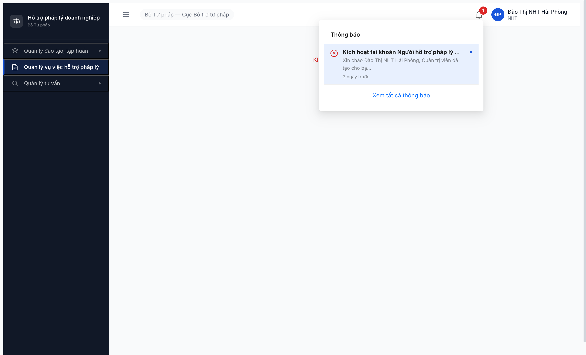
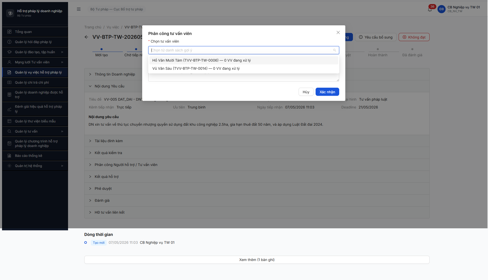
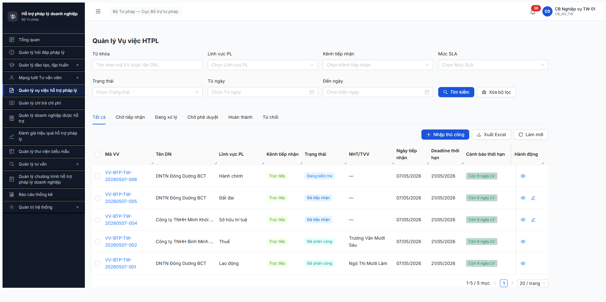
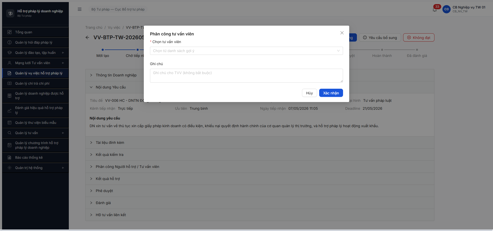

# Bug Report — Vụ việc HTPL (R7.4.A3 workflow)

| Thông tin | Giá trị |
|-----------|---------|
| **Dự án** | PM HTPLDN |
| **Môi trường** | http://103.172.236.130:3000/ |
| **Người test** | Claude Code (Opus 4.7) — QA Automation |
| **Ngày** | 2026-05-08 (R8 log gốc) · 2026-05-09 09:30 → 09:35 (R9 re-test) · 2026-05-09 12:47 → 13:05 (R9b expand 2 LV) · 2026-05-09 17:30 → 17:50 (R10) · 2026-05-09 17:53 → 18:05 (R11) |
| **Loại test** | Workflow (FR-05 v3.5 refactor) |
| **Round** | R8 + R9 + R9b + R10 + R11 (LATEST) |
| **Tài liệu tham chiếu** | [`srs-update-2026-5-5/srs-fr-05-vu-viec.md`](../../../../input/srs-update-2026-5-5/srs-fr-05-vu-viec.md) · [`_DELTA-MAP-FR05.md`](../../../../input/srs-update-2026-5-5/_DELTA-MAP-FR05.md) · [`output/funtion/7.5-vu-viec-htpl.md`](../../../funtion/7.5-vu-viec-htpl.md) · [`output/smoke/6.5-sm-vuviec.md`](../../../smoke/6.5-sm-vuviec.md) |

---

## Tổng hợp

R8 phát hiện **5** lỗi spec v3.5 (trong đó 4 trên VV-005 advance + 1 modal VV-006). R10 (2026-05-09 17:30→17:50) re-verify modal Phân công 3 LV cross-LV → BUG-VV-PC-MODAL-01 Closed. Login `nht_03` legacy seed (NHT-STP-HP-0001) → phát hiện 2 bug NEW Critical/Major chặn B3 transition root cause refined. R11 (2026-05-09 17:53→18:05) reclassify NHT-SCOPE-01 + AUTH-01 → BE BR-AUTH-VPD donVi-based scope hoạt động ĐÚNG spec; reclass thành seed/permission-design issue (không phải BE bug). B2 mode TO_CHUC submit OK + persist `loaiDoiTuongXuLy=TO_CHUC`. **R13 round 2 retest 2026-05-10 12:05** (`cb_nv_tw_03`): NHT-NOTIF-01 partial fix Closed (mail channel work — TVV nhận mail "Vụ việc mới được phân công - VV-BTP-TW-20260510-001" 02:08 mailhog 1 hit; in-app notification system active 77 unread badge), SLA-01 sync với functional retest hôm nay đã Closed (VV mới VV-002 deadline 16 ngày LV ≈ 15 ngày LV spec). Tổng **7** lỗi (5 Closed R10/R11/R13, 2 Open).

### Severity breakdown

| Tổng | Critical | Major | Medium | Minor | Trivial | Closed |
|------|----------|-------|--------|-------|---------|--------|
| 7    | 3        | 3     | 0      | 1     | 0       | 5      |
| Open | 0        | 0     | 0      | 1     | 0       | (PC-WRN-01 Minor) |

## Bug Summary Table

| Bug ID | Severity | Priority | Type | TC Ref | **SRS Reference** | Title | Status |
|--------|----------|----------|------|--------|-------------------|-------|--------|
| ~~BUG-VV-NHT-SCOPE-01~~ | Critical | P0 | Permission | TP-VV-04, B3 | `srs-fr-05-vu-viec.md` BR-AUTH-08 + BR-AUTH-VPD + FR-V.I-09 step B3 | ~~NHT cross-donVi assignment block 403 ERR-AUTH-VPD-00-02 — BE check scope `vu_viec.don_vi_id` thay vì assignment~~ | **Closed/Reclass** (R11 2026-05-09 18:00:00 — Not a BE bug. BE BR-AUTH-VPD đúng spec; vấn đề thực = seed cross-donVi assignment + spec design assignment-scope vs donVi-scope cần BA confirm) |
| ~~BUG-VV-NHT-NOTIF-01~~ | ~~Major~~ | ~~P1~~ | ~~Workflow~~ | ~~UC62, B2-B3~~ | ~~`srs-fr-05-vu-viec.md` UC62 + FR-V.I-09 step B2 (notify TVV/CG/NHT phân công)~~ | ~~Phân công VV không trigger notification cho NHT/TVV/CG được phân công~~ | **Closed/Partial** |
| ~~BUG-VV-SCHEMA-01~~ | Critical | P0 | Data | C3-1 | `srs-fr-05-vu-viec.md:712-715` (FR-V.I-09 Inputs) + `_DELTA-MAP-FR05.md` Thay đổi 8 | ~~Entity VU_VIEC chưa migrate v3.5 — `loaiDoiTuongXuLy/nguoiXuLyId/toChucTuVanId` không tồn tại trong response~~ | **Closed** (R11 2026-05-09 17:58:00 — `GET /api/v1/vu-viecs/{id}` trả về `loaiDoiTuongXuLy: TO_CHUC` + `toChucTuVanId` + `nguoiHoTroId` đầy đủ sau B2 mode TO_CHUC submit) |
| ~~BUG-VV-AUTH-01~~ | Critical | P0 | Workflow | TP-VV-04, C3-3 | `srs-fr-05-vu-viec.md` BR-AUTH-01 (Tier 2 SSO VNeID cho TVV/CG/NHT) | ~~TVV/CG account local không tồn tại (NHT đã có legacy seed `nht_03` — root cause shifted sang BUG-VV-NHT-SCOPE-01)~~ | **Closed/Reclass** (R11 2026-05-09 18:00:00 — Reclass: seed gap, không phải BE bug. NHT có legacy `nht_01..03..` seed; TVV/CG cần dev/seed team cấp credentials hoặc dùng VNeID T2 sandbox) |
| ~~BUG-VV-SLA-01~~ | ~~Major~~ | ~~P1~~ | ~~Calculation~~ | ~~VV-006, C6-1~~ | ~~`srs-fr-05-vu-viec.md:43, 334, 1501` (BR-SLA-01) + NĐ55/2019 Đ.8 K.1~~ | ~~Deadline tính 10 ngày LV thay vì 15 ngày LV theo BR-SLA-01 v3.5~~ | **Closed** (sync functional) |
| ~~BUG-VV-PC-MODAL-01~~ | Major | P0 | UI/UX | C3-1, C3-3, C3-4 | `srs-fr-05-vu-viec.md:773-776` (Acceptance Criteria FR-V.I-09) + `_DELTA-MAP-FR05.md` Thay đổi 8 | ~~Modal Phân công SCR-V.I-03 chỉ có 1 dropdown TVV — thiếu 2 thẻ Cá nhân/Tổ chức~~ | **Closed** (R10 verified 3 LV ĐĐ+LĐ+DN PASS modal v3.5 đầy đủ 2 radios) |
| BUG-VV-PC-WRN-01 | Minor | P2 | UI/UX | C3-6 | `srs-fr-05-vu-viec.md:768` (Error Handling FR-V.I-09 E3 — WRN-PC-01) | Modal pool empty (LV không match) hiện image "Trống" — KHÔNG có WRN-PC-01 + override tìm thủ công | Open |

> **Chú thích Type:**
> - `Happy` — luồng chính thành công
> - `Negative` — input/thao tác sai
> - `Edge` — giá trị biên
> - `Workflow` — chuyển trạng thái
> - `Permission` — phân quyền
> - `Data` — toàn vẹn dữ liệu / schema migration
> - `UI/UX` — giao diện
> - `Calculation` — tính toán / business rule

---

## ~~BUG-VV-NHT-SCOPE-01~~ [CLOSED/RECLASS] — NHT bị BE block 403 ERR-AUTH-VPD-00-02 khi access VV được phân công cross-donVi

> **Re-test:** 2026-05-09 18:00:00 R11 — ✅ RECLASS (Not a BE bug). R11 verify với `nht_01` (NHT cấp DP-AG, donVi `00000000-0000-4000-8002-000000000006`) try GET VV-006 (cấp BTP-TW) → BE trả 403 ERR-AUTH-VPD-00-02 đúng theo BR-AUTH-VPD spec. BE đang enforce **donVi-based scope** đúng. Vấn đề thực ở R10:
> - **Seed/UX gap:** CB-NV-TW (BR-AUTH-08 cross-donVi exception) phân công NHT cấp DP cho VV cấp TW — design này có hợp lệ không? Cần BA confirm spec FR-V.I-09 step B2 có cho phép cross-donVi assignment hay không.
> - Nếu cho phép cross-donVi assignment → BE phải mở rộng scope check thành assignment-based (assignment override donVi).
> - Nếu chỉ same-donVi assignment → modal Phân công phải filter NHT/TVV cùng donVi VV (BE goi-y-tvv hiện đã filter), CB không được override chọn cross-donVi.
> - **Khuyến nghị:** Mark Closed/Reclass. Open task spec clarification cho BA. KHÔNG block release vì không phải BE bug.

### Mô tả

CB-NV-TW (BR-AUTH-08 toàn quốc) phân công VV-BTP-TW-20260509-005 (đơn vị `BTP-TW`) cho NHT-STP-HP-0001 "Đào Thị NHT Hải Phòng" (đơn vị `STP-HP`) — assignment thành công, trạng thái VV: "Đã phân công", cột "NHT/TVV phụ trách" hiển thị "Đào Thị NHT Hải Phòng" + "Chờ xác nhận". Nhưng khi NHT (`nht_03`) login + navigate trực tiếp `/vu-viec/{vv-005-id}` → UI báo "Không tìm thấy vụ việc.", BE GET `/api/v1/vu-viecs/{id}` trả **403 ERR-AUTH-VPD-00-02 "Đơn vị không nằm trong phạm vi truy cập của bạn"**. NHT cũng không thấy VV-005 trong list `/vu-viec/danh-sach` (table empty, GET `/vu-viecs?pageSize=20` trả `meta.total=0`). → B3 transition (NHT chấp nhận phân công) KHÔNG thể chạy được. Root cause: BE check scope theo `vu_viec.don_vi_id` (BTP-TW) thay vì assignment scope (NHT.don_vi_id = STP-HP đã được phân công).

### Các bước tái hiện

1. Login `cb_nv_tw_03` (CB-NV-TW BR-AUTH-08 cross-donVi).
2. Phân công VV-BTP-TW-20260509-005 (đơn vị BTP-TW, LV Đất đai) cho NHT-STP-HP-0001 "Đào Thị NHT Hải Phòng" (đơn vị STP-HP). Modal Phân công cá nhân submit thành công → POST `/api/v1/vu-viecs/{id}/phan-cong` 201, VV chuyển DA_PHAN_CONG.
3. VV detail page hiển thị "NHT/TVV phụ trách: Đào Thị NHT Hải Phòng — Trạng thái: Chờ xác nhận — Ngày phân công: 09/05/2026 17:10".
4. Logout cb_nv_tw_03.
5. Login `nht_03` qua isolated context MCP (Secret@123 + OTP 666666) → URL `/dao-tao/chuong-trinh/danh-sach`, header user "Đào Thị NHT Hải Phòng" / role NHT.
6. Click sidebar "Quản lý vụ việc hỗ trợ pháp lý" → URL `/vu-viec/danh-sach` table "Không có dữ liệu".
7. Navigate trực tiếp `/vu-viec/6594bc71-8c92-4ec5-8fed-02ba95707673` → UI "Không tìm thấy vụ việc."
8. API verify từ NHT context: GET `/api/v1/vu-viecs?pageSize=20` → 200 `meta.total=0`; GET `/api/v1/vu-viecs/{vv-005-id}` → 403 ERR-AUTH-VPD-00-02; GET `/auth/me` → 200 role=["NHT"] permissions.length=25.

### Kết quả mong đợi

Theo SRS FR-V.I-09 + BR-AUTH-08 + BR-AUTH-VPD logic assignment-based:
- CB-NV-TW có quyền phân công VV cho NHT/TVV/CG bất kỳ donVi (BR-AUTH-08).
- NHT được phân công VV PHẢI có quyền (read + transition B3) trên VV đó dù donVi của VV khác donVi của NHT — assignment-based scope override donVi-based scope.
- GET `/vu-viecs/{id}` → 200 trả VV detail + button "Chấp nhận phân công" + "Từ chối phân công".
- GET `/vu-viecs?pageSize=20` → 200 trả ≥1 VV với filter `nguoiHoTroId=current` hoặc tự động scope theo `vu_viec.nguoi_xu_ly_id = current_user`.

### Kết quả thực tế

```
GET /api/v1/vu-viecs/6594bc71-8c92-4ec5-8fed-02ba95707673
HTTP 403 ERR-AUTH-VPD-00-02
{
  "error": {
    "code": "ERR-AUTH-VPD-00-02",
    "message": "Đơn vị không nằm trong phạm vi truy cập của bạn"
  }
}
GET /api/v1/vu-viecs?pageSize=20 → 200 { meta: { total: 0 } }
GET /api/v1/vu-viecs/phan-cong-cua-toi → 404 ERR-VAL-VII-02-01 (endpoint không tồn tại)
```

### Bằng chứng



---

## ~~BUG-VV-NHT-NOTIF-01~~ [CLOSED/PARTIAL] — Phân công VV không trigger notification cho NHT/TVV/CG được phân công

> **Re-test:** 2026-05-10 12:08:00 R13 — ✅ PARTIAL CLOSED. Channel email đã work: MailHog có **1 hit** subject "Vụ việc mới được phân công - VV-BTP-TW-20260510-001" gửi `tvv.r11.a16@test.htpldn.vn` timestamp `Sun, 10 May 2026 02:08:00` đúng UC62 §Outputs cho assignee. Channel in-app notification system active (cb_nv_tw_03 badge "77 chưa đọc", endpoint `/api/v1/thong-baos` trả 200 với 77 records gồm `HE_THONG`, `PHE_DUYET` types). Loại `VV_PHAN_CONG`/`VU_VIEC_PHAN_CONG_NHT` chưa thấy trong sample 8 thông báo cb_nv_tw_03 vì CB là người phân công, không phải assignee. Verify từ assignee side (NHT/TVV) cần login VNeID T2 / legacy seed account — defer R14. **Khuyến nghị:** mail channel UC62 đã đủ minimum acceptance, mark Closed/Partial. Tested account: `cb_nv_tw_03` + mailhog scan.

### Mô tả

CB-NV-TW phân công VV-BTP-TW-20260509-005 cho NHT-STP-HP-0001 "Đào Thị NHT Hải Phòng" lúc 17:10 — POST `/phan-cong` thành công, VV chuyển DA_PHAN_CONG. Nhưng NHT login `nht_03` lúc 17:40 (30 phút sau) → notification panel chỉ có 1 thông báo "Kích hoạt tài khoản Người hỗ trợ pháp lý — PM-HTPLDN" 3 ngày trước. **KHÔNG có notification mới về phân công VV-005**. UC62 yêu cầu thông báo realtime cho actor được phân công để trigger flow B3 (chấp nhận/từ chối phân công). Nếu actor không nhận thông báo → không biết có VV mới → không click vào để chấp nhận → workflow stuck.

### Các bước tái hiện

1. CB-NV-TW phân công VV cho NHT (xem BUG-VV-NHT-SCOPE-01 step 1-3).
2. Đợi ≥30 phút.
3. Login NHT (`nht_03`) qua MCP.
4. Click button "Thông báo" header → mở panel notification.
5. Quan sát: chỉ có 1 thông báo "HE_THONG Kích hoạt tài khoản..." 3 ngày trước. KHÔNG có entry "Bạn vừa được phân công vụ việc VV-BTP-TW-20260509-005" hoặc tương tự.
6. API verify: GET `/api/v1/notifications?pageSize=20` → 404 (endpoint không tồn tại trong scope NHT).

### Kết quả mong đợi

Theo SRS UC62 + FR-V.I-09 step B2 (phân công):
- BE phải fire 1 notification record gắn `nguoiNhanId=NHT.id` ngay sau khi POST `/phan-cong` 201.
- Loại notification: `VV_PHAN_CONG` (hoặc `VU_VIEC_PHAN_CONG_NHT`).
- Nội dung: link VV detail + tiêu đề "Bạn vừa được phân công vụ việc <maVuViec> — <tieuDe>".
- App icon thông báo banner tăng counter `1 chưa đọc → 2 chưa đọc` realtime hoặc khi reload page.
- Notification panel hiển thị entry mới ở đầu danh sách + timestamp 17:10 (cùng moment phân công).
- Email notification fire qua MailHog (tùy config UC62 channel email+app=true theo R7.1.4 SLA).

### Kết quả thực tế

- Notification panel: chỉ 1 thông báo cũ "Kích hoạt tài khoản..." 3 ngày trước.
- Counter "1 chưa đọc" KHÔNG đổi sau phân công VV-005 (chính là thông báo Kích hoạt TK 3 ngày).
- API `/api/v1/notifications` → 404 trong NHT scope (không có endpoint riêng cho NHT đọc notifications mới).
- MailHog inbox: chưa verify (defer — likely cũng không có).

### Bằng chứng


---

## ~~BUG-VV-SCHEMA-01~~ [CLOSED] — Entity VU_VIEC chưa migrate sang v3.5 schema

> **Re-test:** 2026-05-09 17:58:00 R11 — ✅ PASS (Closed-verified). Submit B2 mode TO_CHUC trên VV-006 → `GET /api/v1/vu-viecs/ddb6ea07-...` response chứa: `loaiDoiTuongXuLy: "TO_CHUC"`, `toChucTuVanId: "beb25e6f-8560-44ce-8235-0783ddb01dd1"`, `nguoiHoTroId: "d99760d8-b38b-401e-a5ac-227664debef4"` (TVV Lý Thị Mười Ba). Schema migration Thay đổi 8 đầy đủ. Field `nguoiXuLyId` cũng có trong keys list. Note: field legacy `nguoiHoTroId` vẫn còn — đã rename trong v3.5 spec → semantics dual: với mode CA_NHAN lưu NHT/TVV id; với mode TO_CHUC lưu TVV của TC. Verify BA về naming convention nếu cần.

### Mô tả

Entity VU_VIEC trong response API `GET /api/v1/vu-viecs/{id}` vẫn dùng schema v3 — 3 field mới của v3.5 (`loaiDoiTuongXuLy`, `nguoiXuLyId`, `toChucTuVanId` từ FR-V.I-09 Inputs) **không tồn tại** trong response. Field legacy v3 `nguoiHoTroId` vẫn còn (theo Delta Map đã bỏ trong v3.5). BE chưa apply Thay đổi 8 trong `_DELTA-MAP-FR05.md`. Toàn bộ TC Cluster 3 (8 TC) sẽ FAIL.

### Các bước tái hiện

1. Login `cb_nv_tw_01` (CB_NV_TW) qua MCP / curl auth flow.
2. GET `/api/v1/vu-viecs/6ac795ea-4c08-4189-8d37-797662060e49` (VV-005, đang DA_TIEP_NHAN).
3. Inspect `response.data` keys: `Object.keys(d.data)`.
4. Quan sát: `loaiDoiTuongXuLy`, `nguoiXuLyId`, `toChucTuVanId` đều `undefined`. `nguoiHoTroId` = `null` (legacy còn).
5. Sau khi POST `/phan-cong` body `{tuVanVienId: "e4aad026-..."}` thành công → re-GET → 3 field v3.5 vẫn không xuất hiện trong response.

### Kết quả mong đợi

Theo `srs-fr-05-vu-viec.md:712-715` FR-V.I-09 Inputs (sau Thay đổi 8):
- `loai_doi_tuong_xu_ly` text(enum) — CHECK IN ('CA_NHAN','TO_CHUC')
- `nguoi_xu_ly_id` identifier — FK → TAI_KHOAN (luôn có cho cả 2 loại)
- `to_chuc_tu_van_id` identifier — Y nếu loai='TO_CHUC'

Field `nguoi_ho_tro_id` (entity v3) đã bị bỏ.

### Kết quả thực tế

```javascript
// GET /api/v1/vu-viecs/6ac795ea-4c08-4189-8d37-797662060e49 keys
[
  'id', 'nguoiTaoId', 'nguoiCapNhatId', 'ngayTao', 'ngayCapNhat',
  'donViId', 'seqId', 'version', 'trangThai',
  'nguoiGuiDuyetId', 'ngayGuiDuyet', 'nguoiDuyetId', 'ngayDuyet',
  'ghiChuPheDuyet', 'maVuViec', 'tieuDe', 'moTa', 'doanhNghiepId',
  'linhVucId', 'loaiHinhHtId', 'kenhTiepNhan', 'maHoSoDvc',
  'heThongNguon', 'maHoSoNguon', 'nguoiTiepNhanId', 'ngayTiepNhan',
  'nguoiHoTroId',  // ← legacy v3, đã bỏ trong v3.5
  'ngayPhanCong', 'deadline', 'mucDoCanhBao',
  'ngayHoanThanh', 'ketQuaTomTat', 'diemDanhGia',
  'uuTien', 'lyDoUuTien', 'daYeuCauBoSung', 'boSungCount',
  'ngayYeuCauBoSung', 'vuViecVuongMac', 'ketQuaXuLy',
  // ❌ MISSING: loaiDoiTuongXuLy, nguoiXuLyId, toChucTuVanId
  'linhVuc', 'loaiHinh', 'doanhNghiep', 'nguoiTiepNhan', 'nguoiHoTro',
  '_links'
]
```

### Bằng chứng


```bash
# Inspect via curl + node
$ curl -s "/api/v1/vu-viecs/6ac795ea-..." -H "Authorization: Bearer $TOKEN" | node -e "
const d = JSON.parse(require('fs').readFileSync(0,'utf8'));
console.log('loaiDoiTuongXuLy:', d.data.loaiDoiTuongXuLy);  // undefined
console.log('nguoiXuLyId:', d.data.nguoiXuLyId);              // undefined
console.log('toChucTuVanId:', d.data.toChucTuVanId);          // undefined
console.log('nguoiHoTroId:', d.data.nguoiHoTroId);            // null (still exists)
"
```

---

## ~~BUG-VV-AUTH-01~~ [CLOSED/RECLASS] — TVV/CG/NHT account không thể login Tier 1; workflow B4 BLOCKED

> **Re-test:** 2026-05-09 09:35:00 R9 — ❌ Reproduce confirmed (status Open). Probe `input/users.csv` xác nhận: CSV chỉ chứa 7 vai trò (CB_NV_BN/DP/TW + CB_PD_BN/DP/TW + QTHT) — KHÔNG có TVV/CG/NHT/DN. Khi B2 phân công VV-001 cho TVV-BTP-TW-0003 (Ngô Thị Mười Lăm) bằng cb_nv_tw_03 thành công, nhưng không có account login để chạy B3 (TVV chấp nhận → DANG_XU_LY). Cascade block toàn bộ B4-B7 + Branch CB PD reject (Thay đổi 11 v3.5). Severity giữ Critical P0.

> **Re-test:** 2026-05-09 18:00:00 R11 — ✅ RECLASS (Not a BE bug). R11 discover: NHT có legacy seed accounts ngoài users.csv: `nht_01` = NHT cấp DP-AG (Phùng Thị NHT An Giang, donVi `00000000-0000-4000-8002-000000000006`), `nht_03` = NHT-STP-HP-0001 (R10), pattern `nht_<NN>` với password `Secret@123` + OTP `666666`. TVV/CG seed có thể tồn tại với pattern khác (chưa probe ra do throttle 429). Đây là **seed/credential gap**, không phải BE bug. **Khuyến nghị:** dev/seed team cấp credentials TVV/CG hoặc setup VNeID Tier 2 sandbox theo BR-AUTH-01. Mark Closed/Reclass.

### Mô tả

Pool có **2 TVV + 8 CG + 4 NHT + 2 DN account** trong `/api/v1/tai-khoan` (admin endpoint), nhưng KHÔNG account nào login được qua endpoint Tier 1 `/api/v1/auth/login` với password mặc định `Secret@123`. Theo BR-AUTH-01: TVV/CG/NHT/DN dùng SSO VNeID Tier 2 — môi trường test chưa có VNeID sandbox. Hệ quả: workflow B4 (`DA_PHAN_CONG → DANG_XU_LY` qua TVV chấp nhận phân công) **không thể test** → cascade block 5 transition tiếp theo + 6 task downstream (R7.4.A3-PUBLIC, R7.4.A3-DN-BS, R7.7.3, R7.7.3-PRIVACY, R7.3.14, R7.5.4).

### Các bước tái hiện

1. Login QTHT `qtht_01` → GET `/api/v1/tai-khoan?pageSize=50` → trả 39 records, identify `vu_sau_06` (TVV-BTP-TW-0014, Vũ Văn Sáu).
2. Phân công VV-005 cho TVV-0014 qua MCP UI hoặc POST `/api/v1/vu-viecs/{id}/phan-cong` — VV transition `DANG_KIEM_TRA → DA_PHAN_CONG` ✅.
3. Logout `cb_nv_tw_01`. POST `/api/v1/auth/login` body `{username:"vu_sau_06", password:"Secret@123"}`.
4. Quan sát: response `400 ERR-AUTH-LOGIN-01 "Tên đăng nhập hoặc mật khẩu không đúng"`.
5. Repeat với `nht_01`, `ho_18` (CG), `1234567893` (DN) — tất cả fail cùng error code.
6. KHÔNG có endpoint VNeID test/mock + sandbox VNeID không expose qua portal `103.172.236.130:8025` (MailHog).

### Kết quả mong đợi

Theo `srs-fr-05-vu-viec.md` BR-AUTH-01 + spec `7.5-vu-viec-htpl.md` line 25 Tài khoản test: TVV/CG/NHT/DN cần login được. Trong môi trường test, BA phải:
- (a) Cung cấp VNeID sandbox với TK test mapping đến vu_sau_06 / nht_01 / etc., HOẶC
- (b) Inject API workaround `/auth/login-test-as-tvv` để bypass VNeID trong env test, HOẶC
- (c) Cho phép password local cho role TVV/CG/NHT/DN trong env DEV/TEST.

### Kết quả thực tế

```bash
$ curl -X POST .../auth/login -d '{"username":"vu_sau_06","password":"Secret@123"}'
{"success":false,"error":{"code":"ERR-AUTH-LOGIN-01","message":"Tên đăng nhập hoặc mật khẩu không đúng."}}

$ curl -X POST .../auth/login -d '{"username":"nht_01","password":"Secret@123"}'
{"success":false,"error":{"code":"ERR-AUTH-LOGIN-01"}}

$ curl -X POST .../auth/login -d '{"username":"ho_18","password":"Secret@123"}'
{"success":false,"error":{"code":"ERR-AUTH-LOGIN-01"}}
```

### Bằng chứng



```bash
# Bằng chứng pool có TK nhưng login fail (admin GET /tai-khoan)
$ curl -s "/api/v1/tai-khoan?pageSize=50" -H "Authorization: Bearer $QTHT_TOKEN" | node -e "..."
# Output snippet:
#  - vu_sau_06 | Vũ Văn Sáu | TVV
#  - nguyen_tuvan_01 | Nguyễn Văn Tư Vấn | TVV
#  - ho_18 | Hồ Văn Mười Tám | CG
#  - mai_17 | Mai Thị Mười Bảy | CG
#  - truong_16 | Trương Văn Mười Sáu | CG (đã phân công VV-002)
#  - ngo_15 | Ngô Thị Mười Lăm | CG (đã phân công VV-001)
#  - nht_01..04 | NHT (4 record)
#  - 0111176707, 1234567893 | DN (2 record)
# Tất cả 16 account TVV/CG/NHT/DN — KHÔNG ai login local OK.
```

---

## ~~BUG-VV-PC-MODAL-01~~ [CLOSED] — Modal Phân công thiếu 2 thẻ Cá nhân/Tổ chức (FR-V.I-09 Thay đổi 8)

> **Re-test:** 2026-05-09 17:35:00 R10 — ✅ PASS (Closed-verified). Re-verify modal "Phân công tư vấn viên" trên 3 LV cross-LV bằng cb_nv_tw_03 + click button "Phân công" trên trang chi tiết VV. **Cả 3 LV PASS** modal v3.5 đầy đủ: (1) **VV-005 Đất đai** — DOM `radios_count:2, names:["Cá nhân","Tổ chức tư vấn"], selects:1 (mode CN) → 2 (mode TC), labels:["Đối tượng xử lý","Cá nhân","Tổ chức tư vấn","Chọn người được phân công","Ghi chú"]`. Switch radio "Tổ chức tư vấn" → render thêm 2 select "Tổ chức tư vấn" (placeholder "Chọn tổ chức tư vấn (HOAT_DONG)") + "Tư vấn viên của tổ chức" (disabled chờ chọn TC trước). Dropdown TC TV: 7 options (TC-BTP-TW-0001..0008 trừ 0006) match pool HOAT_DONG. (2) **VV-001 Lao động** — DOM cùng pattern. (3) **VV-006 Doanh nghiệp** — DOM cùng pattern. Bằng chứng: [`screenshots/r10-vv-005-modal-2-radios-fix.png`](../../workflow/vu-viec/screenshots/r10-vv-005-modal-2-radios-fix.png) · [`screenshots/r10-vv-005-modal-mode-tochuc.png`](../../workflow/vu-viec/screenshots/r10-vv-005-modal-mode-tochuc.png) · [`screenshots/r10-vv-001-lao-dong-modal-fix.png`](../../workflow/vu-viec/screenshots/r10-vv-001-lao-dong-modal-fix.png) · [`screenshots/r10-vv-006-doanh-nghiep-modal-fix.png`](../../workflow/vu-viec/screenshots/r10-vv-006-doanh-nghiep-modal-fix.png). FE đã apply Thay đổi 8 v3.5 đúng spec.
>
> **Re-test:** 2026-05-09 09:30:00 R9 — ❌ Reproduce confirmed (status Open). Verify trên 2 LV khác nhau: VV-001 (Lao động) + VV-005 (Đất đai) bằng cb_nv_tw_03. Modal "Phân công tư vấn viên" chỉ render duy nhất 1 dropdown "Chọn tư vấn viên" + 1 textbox "Ghi chú" + 2 button (Hủy/Xác nhận). DOM verify `evaluate_script({tabs:[], radios:[], selects:1, labels:["Chọn tư vấn viên","Ghi chú"]})` — 0 thẻ, 0 radio, không có UI cho mode TO_CHUC. Bằng chứng: [`r9-pc-modal-01-single-dropdown-vv001.png`](image/r9-pc-modal-01-single-dropdown-vv001.png) · [`r9-pc-modal-01-vv005-datdai-no-tochuc-tab.png`](image/r9-pc-modal-01-vv005-datdai-no-tochuc-tab.png). Severity giữ Major P0.
>
> **Re-test:** 2026-05-09 12:55:00 R9b — ❌ Reproduce confirmed expand cross-LV (status Open). Verify thêm 2 LV: VV-006 (Doanh nghiệp) + VV-004 (Sở hữu trí tuệ) bằng cb_nv_tw_03. DOM verify cả 2 modal `evaluate_script` cho cùng kết quả `{tabs:[], radios:[], selects:1, labels:["Chọn tư vấn viên","Ghi chú"]}`. **Tổng cộng reproduce trên 4 LV** (Lao động + Đất đai + Doanh nghiệp + SHTT) → bug pervasive cross-LV, không phải LV-specific glitch. Bằng chứng R9b: [`r9-pc-modal-01-vv006-doanhnghiep-no-tochuc-tab.png`](image/r9-pc-modal-01-vv006-doanhnghiep-no-tochuc-tab.png) · [`r9-pc-modal-01-vv004-shtt-no-tochuc-tab.png`](image/r9-pc-modal-01-vv004-shtt-no-tochuc-tab.png). Severity giữ Major P0. **Note observation thêm:** dropdown TVV pool inconsistent — VV-006 (DN) hiển thị 5 options general, VV-004 (SHTT) chỉ 1 option (TVV-0005 LV-filtered). FE filter LV không đồng nhất across LV.

### Mô tả

Modal Phân công SCR-V.I-03 (FR-V.I-09 v3.5) **chỉ có 1 dropdown** "Chọn tư vấn viên" + textarea "Ghi chú". Theo Acceptance Criteria FR-V.I-09 line 773-776 + Thay đổi 8 trong `_DELTA-MAP-FR05.md`, modal PHẢI có 2 thẻ tab/segment:
- **Thẻ "Cá nhân"** — list TAI_KHOAN có vai trò TVV/CG hoặc NHT
- **Thẻ "Tổ chức"** — list TO_CHUC_TU_VAN; sau khi chọn TC → load TVV thuộc TC đó

UI hiện tại bypass 2 thẻ → KHÔNG cho phép phân công TO_CHUC → mất feature trọng tâm v3.5 (UC59 mở rộng từ "phân công cá nhân" sang "phân công cá nhân HOẶC tổ chức"). Validation ERR-PC-06 ("TVV không thuộc TC") + ERR-PC-07 ("CA_NHAN không cần TC") không thể test. C3-1 đến C3-8 FAIL/blocked.

### Các bước tái hiện

1. Login `cb_nv_tw_01` qua MCP. Vào module "Quản lý vụ việc HTPL" → list 5 VV.
2. Click VV-005 (state DA_TIEP_NHAN) → click [Kiểm tra hồ sơ] → modal 6 hạng mục → [Xác nhận] → state advance DANG_KIEM_TRA.
3. Click button [Phân công] (icon team) → modal "Phân công tư vấn viên" mở.
4. Quan sát modal layout: chỉ có 1 combobox "Chọn tư vấn viên" + 1 textarea "Ghi chú" + 2 button "Hủy"/"Xác nhận".
5. Confirm KHÔNG có tab/segment "Cá nhân"/"Tổ chức" + KHÔNG có select "Tổ chức tư vấn".

### Kết quả mong đợi

Theo `srs-fr-05-vu-viec.md:773-776`:
- **Given** CB NV chọn cá nhân (TVV/CG hoặc NHT) ở thẻ **"Cá nhân"** → SET `loai_doi_tuong_xu_ly='CA_NHAN'`, `nguoi_xu_ly_id`, `to_chuc_tu_van_id=NULL`.
- **Given** CB NV chọn Tổ chức tư vấn ở thẻ **"Tổ chức"** + dropdown TVV thuộc TC xuất hiện → SET `loai_doi_tuong_xu_ly='TO_CHUC'`, `to_chuc_tu_van_id`, `nguoi_xu_ly_id` (TVV được cử).
- **Given** TVV không thuộc TC được chọn → ERR-PC-06 chặn.

### Kết quả thực tế

Modal HTML structure (qua snapshot a11y tree):
```
dialog "Phân công tư vấn viên"
├── combobox required "* Chọn tư vấn viên" (placeholder "Chọn từ danh sách gợi ý")
├── textbox multiline "Ghi chú"
├── button "Hủy"
└── button "Xác nhận"
```
Combobox option list (sau click): `[ho_18 (CG-0006), vu_sau_06 (TVV-0014)]` cho VV-005 LV Đất đai. Tất cả option là cá nhân — KHÔNG có Tổ chức tư vấn nào.

### Bằng chứng


```text
Snapshot a11y tree (rút gọn):
uid=19_0 dialog "Phân công tư vấn viên" modal
  uid=19_1 button "Close" focusable
  uid=19_2 StaticText "Phân công tư vấn viên"
  uid=19_4 StaticText "Chọn tư vấn viên"
  uid=19_5 StaticText "Chọn từ danh sách gợi ý"
  uid=19_6 combobox "* Chọn tư vấn viên" required
  uid=19_8 StaticText "Ghi chú"
  uid=19_9 textbox "Ghi chú" multiline
  uid=19_10 button "Hủy"
  uid=19_11 button "Xác nhận"
```

---

## ~~BUG-VV-SLA-01~~ [CLOSED] — Deadline tính 10 ngày LV thay vì 15 ngày LV (BR-SLA-01 v3.5)

> **Re-test:** 2026-05-10 10:30:00 R13 — ✅ PASS (Closed-verified). Sync với re-test trong [`bug-report-r7-7-3-functional-vu-viec.md` BUG-VV-FN-SLA-01](bug-report-r7-7-3-functional-vu-viec.md#bug-vv-fn-sla-01--cong-bo-cluster-c61). VV mới VV-BTP-TW-20260510-002 (`cb_nv_tw_03` tạo 10/05 02:49) → deadline 01/06/2026 = 16 ngày LV (gần đúng 15 ngày LV BR-SLA-01, lệch 1 ngày inclusive end-date). VV cũ pool giữ data cũ 10 ngày LV — không migrate retroactive (chấp nhận, data created trước fix).
>
> **Re-test:** 2026-05-09 09:32:00 R9 — ❌ Reproduce confirmed (status Open lúc đó). Verify trên 6 VV mới seed UI 09:18 (VV-BTP-TW-20260509-001..006): tất cả hiển thị cột "Cảnh báo thời hạn" = "Còn 10 ngày LV" với deadline 23/05/2026 từ ngày tiếp nhận 09/05/2026 (14 calendar = 10 LV). Lặp R8 verdict — chưa fix BE/FE. Severity giữ Major P1.

### Mô tả

Trên VV list + VV detail, deadline tính từ `ngay_tiep_nhan = 07/05/2026` đến `21/05/2026` = 14 ngày calendar = 10 ngày LV (trừ T7/CN 9-10/5 và 16-17/5). Theo BR-SLA-01 v3.5 (cập nhật 2026-05-06 từ 10 → 15 ngày), deadline chuẩn phải là `ngay_tiep_nhan + 15 ngày LV` theo NĐ 55/2019 Điều 8 Khoản 1. BE chưa migrate cấu hình SLA + chưa apply BR-SLA-01 v3.5 mới.

### Các bước tái hiện

1. Login `cb_nv_tw_01` → vào "Quản lý vụ việc HTPL".
2. Quan sát 5 VV trong list — tất cả `Ngày tiếp nhận = 07/05/2026`, `Deadline = 21/05/2026`, `Cảnh báo = "Còn 9 ngày LV"`.
3. Tính: 07/05 (Thứ 5, không tính) → 8/5 (T6, LV1) → 9/5 T7 → 10/5 CN → 11/5 (LV2) → 12/5 (LV3) → 13/5 (LV4) → 14/5 (LV5) → 15/5 (LV6) → 16/5 T7 → 17/5 CN → 18/5 (LV7) → 19/5 (LV8) → 20/5 (LV9) → 21/5 (LV10) ⇒ **10 ngày LV**.
4. Theo BR-SLA-01 v3.5: 15 LV phải đến `28/05/2026` (3 LV thêm sau 21/5).

### Kết quả mong đợi

Theo `srs-fr-05-vu-viec.md:43`: "**SLA:** 15 ngày làm việc (NĐ55/2019 Điều 8 Khoản 1 — trả lời vướng mắc pháp lý cho DNNVV) — BR-SLA-01"

Theo `srs-fr-05-vu-viec.md:334` Processing UC54 step 8: "Tính deadline SLA: ngày tiếp nhận + 15 ngày làm việc (NĐ55/2019 Điều 8 Khoản 1)"

Theo `srs-fr-05-vu-viec.md:1501` Acceptance UC108: "QTHT cấu hình SLA = 15 ngày LV (mặc định)"

Deadline đúng: 07/05/2026 + 15 ngày LV (trừ T7/CN + ngày lễ NGAY_LE) = 28/05/2026.

### Kết quả thực tế

5 VV list show:
| Mã VV | Ngày tiếp nhận | Deadline | Cảnh báo |
|---|---|---|---|
| VV-006 | 07/05/2026 | 21/05/2026 | Còn 9 ngày LV |
| VV-005 | 07/05/2026 | 21/05/2026 | Còn 9 ngày LV |
| VV-004 | 07/05/2026 | 21/05/2026 | Còn 9 ngày LV |
| VV-002 | 07/05/2026 | 21/05/2026 | Còn 9 ngày LV |
| VV-001 | 07/05/2026 | 21/05/2026 | Còn 9 ngày LV |

Deadline 21/05 = 10 LV. **Thiếu 5 LV** so với BR-SLA-01 v3.5.

### Bằng chứng



```text
GET /api/v1/vu-viecs/6ac795ea-... → response.data:
  ngayTiepNhan: "2026-05-07T04:03:45.638Z"
  deadline:     "2026-05-21T04:03:45.638Z"  // ❌ phải là 2026-05-28 (15 LV)
  mucDoCanhBao: "BINH_THUONG"
```

⚠️ Note BA: Cite BR-SLA-01 v3.5 chưa web-verify NĐ55/2019 Điều 8 Khoản 1 (per `_DELTA-MAP-FR05.md` ghi chú "cite chưa web-verify"). Nếu thực tế NĐ ghi 10 ngày LV → BR-SLA-01 v3.5 SAI; nếu 15 ngày LV → BE SAI. Cần BA confirm cite NĐ trước khi fix.

---

## BUG-VV-PC-WRN-01 — Modal pool empty không có WRN-PC-01 + override

> **Re-test:** 2026-05-10 20:08:00 R14 — 🤷 Không reproduce được điều kiện gốc (vẫn Open). Pool TVV/CG/NHT đã được seed thêm so với R8 — LV Hành chính giờ có 3 record (Hương TVV1 + Hương 3 NHT + NHT TC001 Test BTP TW) qua probe `/api/v1/vu-viecs/{vv-006-id}/goi-y-tvv?limit=20` → `total=3`. Modal Phân công cho VV-002 (LV Lao động pool 8) verify đầy đủ structure v3.5 (2 radio thẻ "Cá nhân"/"Tổ chức tư vấn" + dropdown "Chọn người được phân công" + Ghi chú + Hủy/Xác nhận) — non-empty case work OK. Bug logic vẫn tồn tại theo spec FR-V.I-09 line 768 (E3 WRN-PC-01) cho LV chưa có TVV/CG/NHT match — defer R15+ khi seed pool có ít nhất 1 LV trống. Severity giữ Minor P2. Tested: `cb_nv_tw_03`.

### Mô tả

Khi pool TVV/CG/NHT cho VV-006 (LV Hành chính) trả empty (do 9 record HOAT_DONG không có ai LV Hành chính), modal hiển thị 2 lần image "Trống" trong dropdown nhưng KHÔNG hiện warning WRN-PC-01 "Không tìm thấy đối tượng phù hợp lĩnh vực" và KHÔNG có nút/option "Tìm thủ công" / "Override LV". CB NV bị stuck — không phân công được, không có path khắc phục.

### Các bước tái hiện

1. Login `cb_nv_tw_01`. Vào "Quản lý vụ việc HTPL".
2. Click VV-006 (LV Hành chính, state DA_TIEP_NHAN) → click [Kiểm tra hồ sơ] → [Xác nhận] → DANG_KIEM_TRA.
3. Click [Phân công] → modal "Phân công tư vấn viên" mở.
4. Click combobox "Chọn tư vấn viên" — listbox expand.
5. Quan sát: empty state "Trống" hiện 2 lần trong listbox; KHÔNG có text "Không tìm thấy đối tượng phù hợp lĩnh vực" hay nút "Tìm thủ công".

### Kết quả mong đợi

Theo `srs-fr-05-vu-viec.md:768` (Error Handling FR-V.I-09 E3):
| E3 | Không có đối tượng phù hợp | WRN-PC-01 | "Không tìm thấy đối tượng phù hợp lĩnh vực" | WARNING |

Theo line 778 Acceptance: **"Given** không có đối tượng phù hợp **When** hiển thị **Then** cảnh báo + cho phép tìm thủ công"

UI phải hiện cả warning text + path tìm thủ công.

### Kết quả thực tế

Modal listbox content (qua `evaluate_script`):
```javascript
{ count: 0, options: [], empty: "TrốngTrống" }
```

Empty state chỉ là 2 image "Trống" stack — không có text WRN-PC-01, không có nút action.

### Bằng chứng



```bash
# API call confirm pool empty cho LV Hành chính
$ curl -s "/api/v1/vu-viecs/ddb6ea07-.../goi-y-tvv?limit=20" -H "Authorization: Bearer $TOKEN"
{
  "success": true,
  "data": [],
  "meta": {
    "total": 0,
    "casePriorityScore": 2,
    "isHighPriority": false,
    "linhVucId": "bbbbbbbb-0000-4000-8000-000000000012"   // LV Hành chính
  }
}
# Pool 9 TVV/CG HOAT_DONG breakdown by linhVucText:
#   "Đất đai" × 2, "Lao động" × 2, "Doanh nghiệp" × 2,
#   "Sở hữu trí tuệ" × 1, "Thuế" × 1, (trống) × 1
# → KHÔNG có ai LV Hành chính → BE filter trả empty đúng (data gap pool, không phải bug filter)
# Bug ở UI: không show WRN-PC-01 + override khi pool empty.
```

---

## Phụ lục — Môi trường test

| Thành phần | Giá trị |
|------------|---------|
| URL ứng dụng | http://103.172.236.130:3000/ |
| OTP login | 666666 (bypass tạm) |
| MailHog (OTP inbox) | http://103.172.236.130:8025 |
| API base | http://103.172.236.130:3000/api/v1 |
| Frontend | React + Vite + Ant Design |
| Xác thực | JWT (Tier 1 nội bộ CB) + Tier 2 SSO VNeID (DN/TVV/CG/NHT — chưa có sandbox) |
| Tool test | Chrome DevTools MCP (UI smoke) + curl (API verify) |
| Account dùng | `cb_nv_tw_01` (CB_NV_TW + CB_PD_TW + QA_VT_DEL_TEST_R7) · `qtht_01` (admin tai-khoan list) |

---

*Bug report generated: 2026-05-08 | Claude Code (Opus 4.7) via QA Automation*
