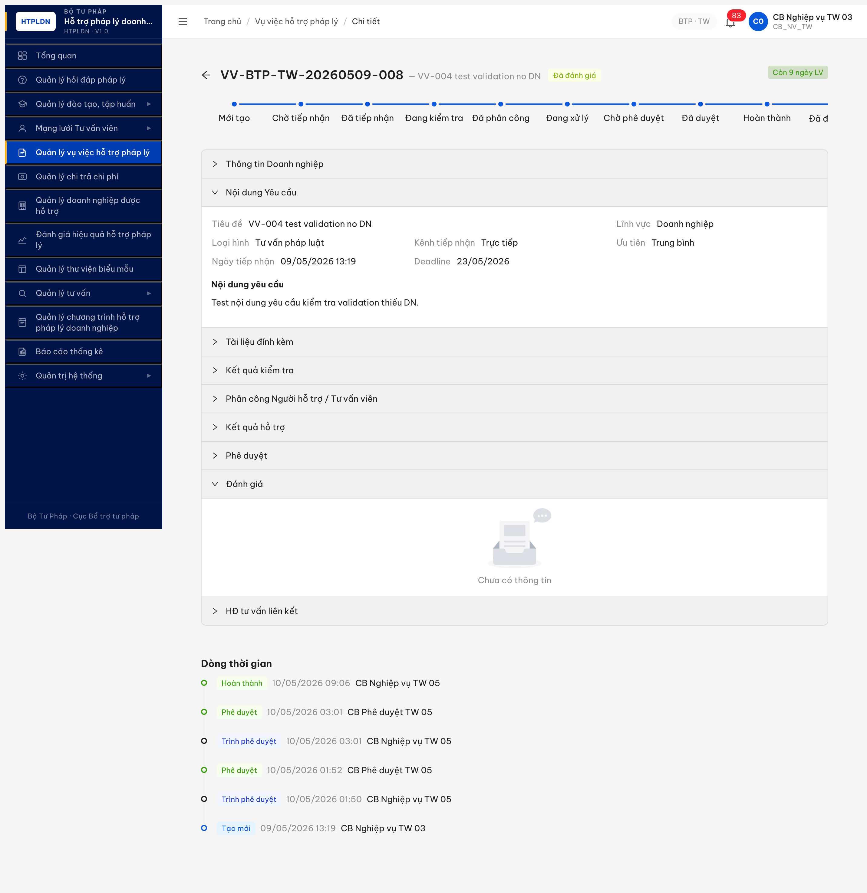
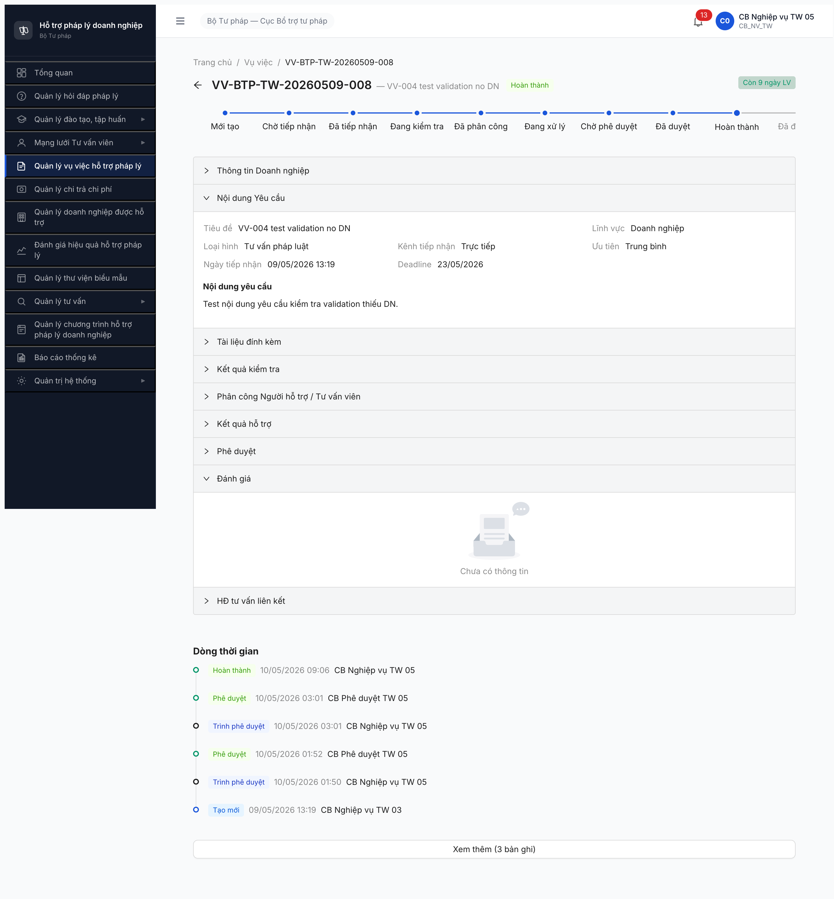
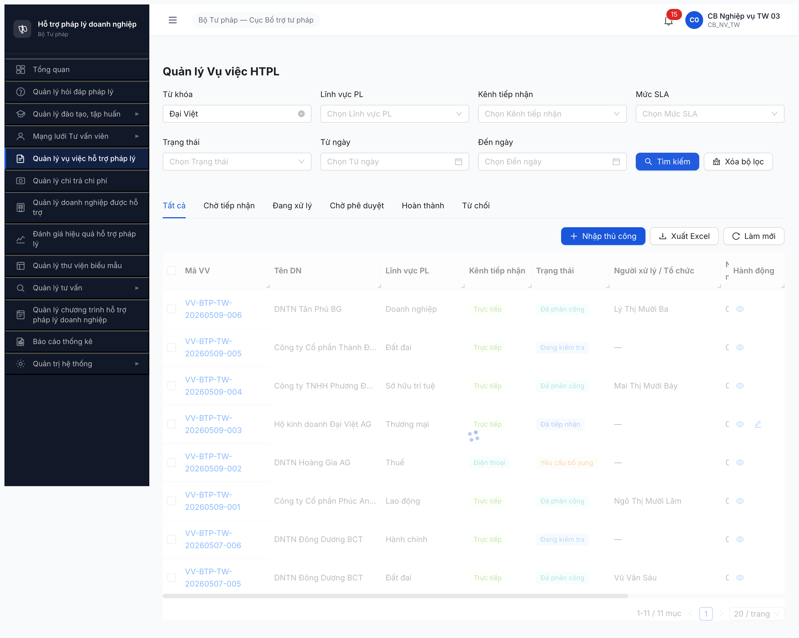
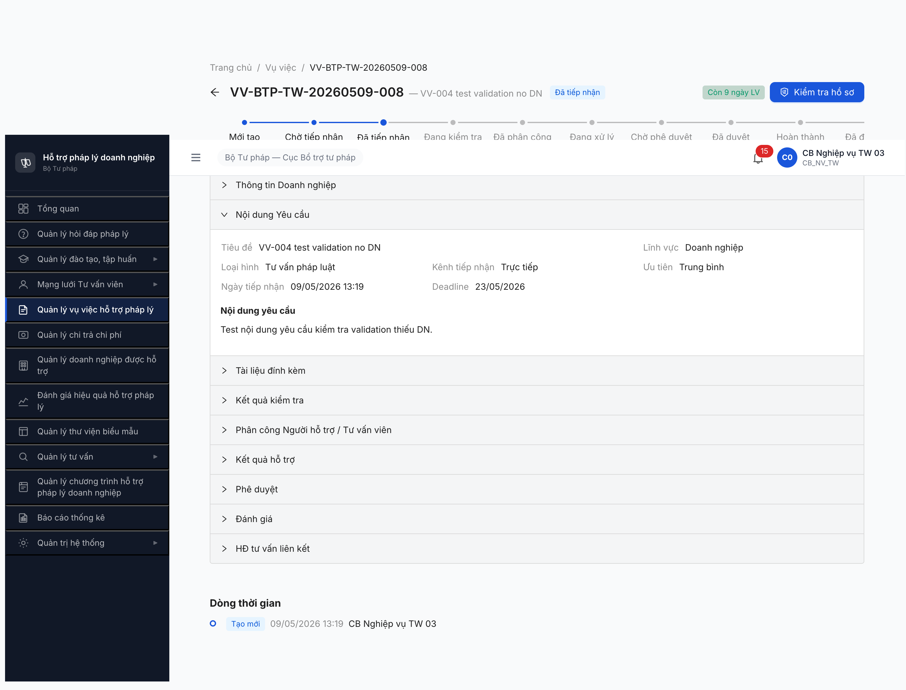
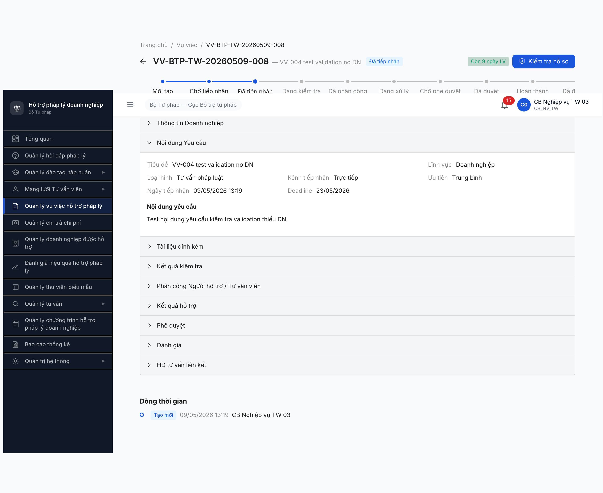
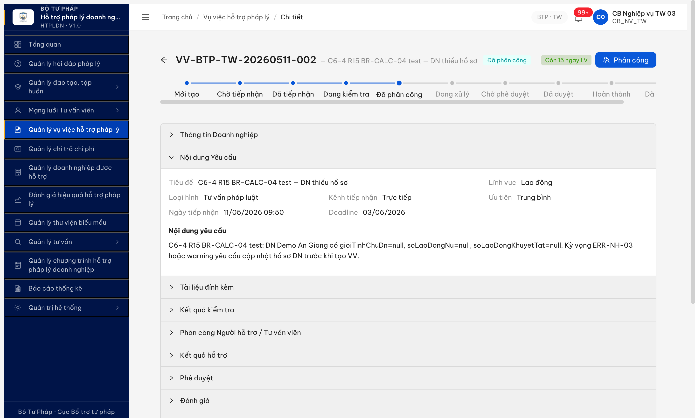
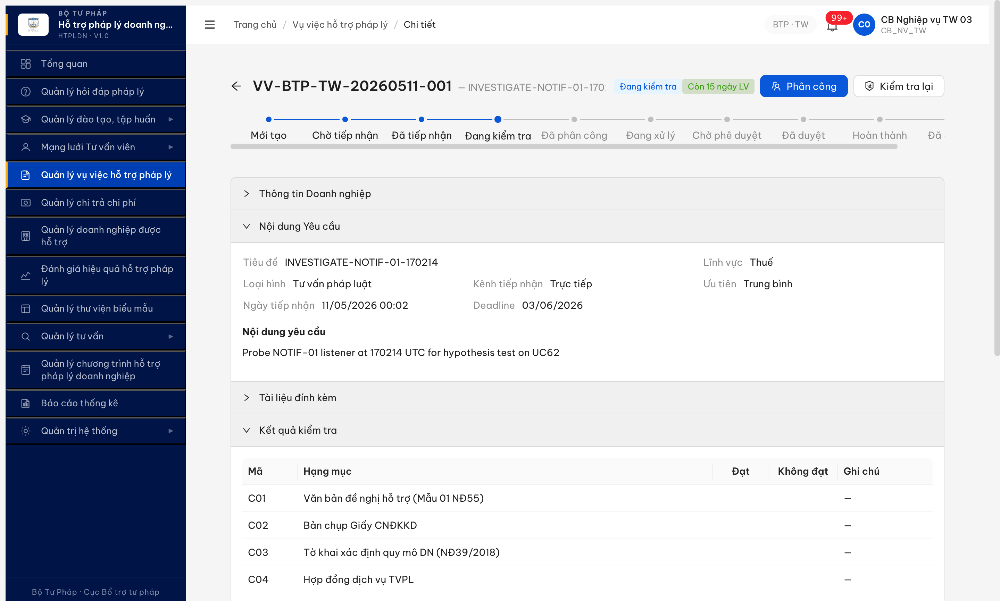
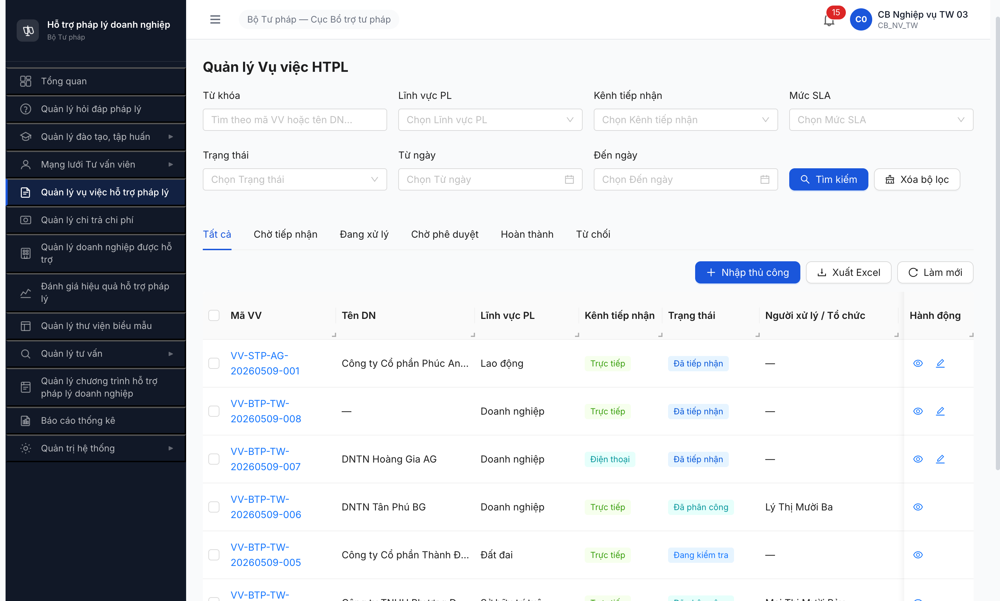

# Bug Report — Vụ việc HTPL (R7.7.3 Functional)

| Thông tin | Giá trị |
|-----------|---------|
| **Dự án** | PM HTPLDN |
| **Môi trường** | http://103.172.236.130:3000 |
| **Người test** | QA Automation via Claude Code |
| **Ngày** | 2026-05-09 13:15:00 → 13:30:00 |
| **Loại test** | Functional (R7.7.3 — 11 TC chạy: VV-001/002/003/004/022/024/028/031 + C8-1/2/3) |
| **Round** | R7 |
| **Tài liệu tham chiếu** | [output/funtion/7.5-vu-viec-htpl.md](../../../../funtion/7.5-vu-viec-htpl.md) · [SRS FR-IV / FR-V.I-NEW-05](../../../../../input/srs-update-2026-5-5/srs-fr-iv-vu-viec.md) |

---

## Tổng hợp

Phát hiện **4 lỗi** Critical/Major khi chạy 11 TC functional R7.7.3. Lỗi tách 2 nhóm: BE bỏ filter (search/validation) và BE thiếu nghiệp vụ (notification/audit log).

### Severity breakdown

| Tổng | Critical | Major | Medium | Minor | Trivial |
|------|----------|-------|--------|-------|---------|
| 7    | 3        | 4     | 0      | 0     | 0       |
| Open | 1        | 1     | 0      | 0     | 0       |
| Closed | 2      | 3     | 0      | 0     | 0       |

> **R15 run 2026-05-11 09:19 → 09:50 (`cb_nv_tw_03` + `cb_pd_tw_05`) — chạy 5 TC executable:**
>
> ✅ **C5-1 Đạt:** POST `/danh-gia` 201 OK, diemTong=9 (AVG 8+9+10), VV-002 auto flip HOAN_THANH→DA_DANH_GIA. UC67 BE complete.
>
> ✅ **C5-3 Đạt:** cb_pd_tw_05 POST `/danh-gia` → 403 ERR-PERM-SYS-00-01 (BE block role CB_PD per spec CSV UC67 chỉ {CB_NV, DN}).
>
> ⚠️ **C5-4 Sai spec mechanism:** Duplicate được chặn qua **state guard** (ERR-STATE-VI-16-01 "VV không ở trạng thái HOAN_THANH") thay vì **UNIQUE constraint** (ERR-DG-VV-04 spec). Effective behavior OK nhưng không thể test UNIQUE per loại trực tiếp vì state auto-flip sau lần chấm đầu.
>
> ✅ **C5-5 Đạt:** Validation 0-10 active — 11/-1/missing/string đều 422 ERR-VAL-SYS-00-01. Decimal accepted.
>
> ⚠️ **C6-4 Sai spec:** BE KHÔNG enforce BR-CALC-04 pre-check. VV-BTP-TW-20260511-002 tạo OK cho DN "Demo An Giang" có `gioiTinhChuDn=null + soLaoDongNu=null + soLaoDongKhuyetTat=null`. Form helper text "(mặc định BR-CALC-04)" suggest silent fallback to priority 3. Spec C6-4 yêu cầu ERR-NH-03/warning "DN cần cập nhật hồ sơ" — **cần BA confirm: silent fallback có acceptable không**.
>
> **Observation Minor:** POST request field `diemTienDo` ≠ response field `diemThoiGian` — naming inconsistency (defer, không log bug).
>
> **R16 Phase 2 fresh-trigger retest 2026-05-11 14:22 → 14:25 (`cb_nv_tw_03` isolatedContext `r16p2_2026_05_11` — MailHog reset 0 + clear browser session):** Walk fresh VV-BTP-TW-20260511-001 (DA_TIEP_NHAN) qua [Kiểm tra hồ sơ] → [Phân công TVV] → check MailHog + state.
>
> ✅ **NOTIF-01 CLOSED:** POST `/phan-cong` (TVV hương tvv1) lúc 07:22:59 UTC → MailHog ngay sau 2 mail: (1) `qa-r14-dn004@example.test` Subj "Vụ việc đã được phân công - VV-BTP-TW-20260511-001" ← **DN nhận mail UC62** ✓ (2) `huongtvv@gmail.com` Subj "Vụ việc mới được phân công" ← TVV nhận mail UC61. Lặp lần 2 với NHT lúc 07:25:30 → 2 mail mới (DN + NHT `nht_r12_bug003_213643@htpldn.test`). **Dev đã fix UC62 — R15/R16 audit trước sai phương pháp (observe pool cũ không trigger fresh).** Đóng bug.
>
> 🚨 **NEW BUG-VV-FN-PHANCONG-REVERT-01 Critical:** POST `/phan-cong` returns 201 với body `trangThai=DA_PHAN_CONG + version 3 + nguoiXuLyId set + ngayPhanCong set + loaiDoiTuongXuLy=CA_NHAN`. Mail trigger OK. **Nhưng GET `/vu-viecs/{id}` sau 3-5s vẫn `DANG_KIEM_TRA + version 2 + nguoiXuLyId NULL + loaiDoiTuongXuLy NULL + ngayPhanCong NULL`.** GET `/vu-viecs/{id}/phan-cong` trả `data: []` (rỗng). GET `/lich-su` chỉ có 2 enum (KIEM_TRA + TAO_VV) — KHÔNG có entry PHAN_CONG. Reproducible 2/2 lần với TVV + NHT. Side effect (mail) commit nhưng state persist FAIL — data integrity bug. **Blocker:** chặn full lifecycle walk fresh VV → block VV-013/013b/013c/014/015/017/033 + Cluster 1 happy path.
>
> ⚠️ **LICHSU-01 partial-progress (R15 audit):** Cumulative pool 11/18 enum ≈ 61% (+1 `DANH_GIA` sau R15 C5-1). Khi state machine advance ĐẦY ĐỦ (VV-510-002), BE log đủ enum chuỗi `CREATE→KIEM_TRA→PHAN_CONG→XAC_NHAN_PHAN_CONG→TRINH_PD→PHE_DUYET→CONG_KHAI→HUY_CONG_KHAI→HOAN_THANH→DANH_GIA` (10 enum). Nhưng PHANCONG-REVERT bug làm fresh VV không advance → không có cơ hội verify đủ 18 enum. Giữ Open partial.
>
> **R16 audit 2026-05-11 13:50:00 (`cb_nv_tw_03`) — qa-bugfix-reverify-audit skill (cách R15 ~4h):** Re-verify NOTIF + LICHSU + pool delta.
>
> **Pool snapshot:** 20 VV (unchanged total) — DA_TIEP_NHAN 5, YEU_CAU_BO_SUNG 2, DA_DANH_GIA **3** (R15: 2 → +1 từ C5-1 success ✓), DA_PHAN_CONG 9, TU_CHOI 1. 2 VV mới R15 (`VV-BTP-TW-20260511-001/002`) giữ DA_TIEP_NHAN.
>
> ⚠️ **NOTIF-01 vẫn Open Critical:** MailHog 182 (R15: 177 → +5 mails trong 4h). **0 VV-related notification.** 1 mail SLA "Sắp hết hạn" 03:30 cho `cb_nv_tw_05` nhưng nội dung "câu hỏi" (Hỏi đáp module), không phải VV. 0 mail nào gửi DN về VV. UC62 cảnh báo DN sau DA_PHAN_CONG/TU_CHOI vẫn miss hoàn toàn.
>
> ⚠️ **LICHSU-01 partial-improvement:** Cumulative enum capture sau R15 C5-1 = **11/18 ≈ 61% (+5% so R15)**: `CREATE/TAO_VV/KIEM_TRA/PHAN_CONG/XAC_NHAN_PHAN_CONG/TRINH_PD/PHE_DUYET/HOAN_THANH/CONG_KHAI/HUY_CONG_KHAI/DANH_GIA`. VV-510-002 (R15 evaluated) chứa đủ chuỗi gồm `DANH_GIA` enum mới ✓. Vẫn miss 7 enum: `TIEP_NHAN/PHAN_CONG_CA_NHAN/PHAN_CONG_TO_CHUC/CAP_NHAT_KQ/YEU_CAU_BO_SUNG/TU_CHOI/TU_CHOI_DUYET`. BE mix old/new naming (`CREATE` cho VV cũ + `TAO_VV` cho VV mới).
>
> **R15 audit 2026-05-11 09:19 (`cb_nv_tw_03`) — qa-bugfix-reverify-audit skill:** Re-verify 2 Open bug sau dev claim fix.
>
> ⚠️ **Open partial (2/6):** **NOTIF-01** Critical (pool 19 VV trải đủ 6 state, MailHog 177 — chỉ 2 mail VV-related toàn pool, **0 mail nào gửi DN** → UC62 fix chưa deliver phía DN); **LICHSU-01** Major partial-progress (BE đã retro-replace UPDATE→KIEM_TRA/PHAN_CONG/XAC_NHAN_PHAN_CONG cho VV-002 cũ ✓; VV mới hôm nay dùng `TAO_VV` enum thay `CREATE` ✓; cumulative coverage giữ ~10/18 ≈ 56%; vẫn miss `TIEP_NHAN/CAP_NHAT_KQ/DANH_GIA/YEU_CAU_BO_SUNG/TU_CHOI/PHAN_CONG_CA_NHAN/TO_CHUC`).
>
> **R14 Phase 1-4 retest 2026-05-10 21:30 → 21:45 (`cb_nv_tw_03` + `cb_pd_tw_05`):** Walk full lifecycle 7/8 transition + 2 branch + public toggle + regression smoke.
>
> ✅ **Closed (4/6):** VALIDATION-01 (R13), SEARCH-01 (R13), SLA-01 (R13), DANHGIA-01 (R14 sớm).
>
> ⚠️ **Open partial (2/6):** **NOTIF-01** Critical (Phase 1-4 lifecycle 7 transition + 2 branch + public toggle — DN vẫn không có mail nào ✗); **LICHSU-01** Major (R14 Phase 1-4 ghi nhận thêm 3 enum mới `XAC_NHAN_PHAN_CONG/TRINH_PD/MO_LAI` → coverage 10/18 ≈ 56% (+17% so R14 sớm); vẫn miss `CAP_NHAT_KQ/DANH_GIA/PHAN_CONG_*`; enum naming inconsistent UI mix Vietnamese + uppercase).
>
> **R14 retest 2026-05-10 20:00 → 20:10 (`cb_nv_tw_03` + `cb_pd_tw_05`):** Re-verify Open bugs sau dev claim fix.
>
> ✅ **Closed (4/6):** VALIDATION-01 (R13), SEARCH-01 (R13), SLA-01 (R13), **DANHGIA-01** (R14 — POST `/danh-gia` 201 OK + auto SM HOAN_THANH→DA_DANH_GIA + diem 8.3 = AVG(8,8,9) khớp spec dòng 2148 + validation thang 0-10 đúng).
>
> ⚠️ **Open partial (2/6):** **NOTIF-01** Critical (TVV mail OK ✓; DN mail UC62 vẫn miss ✗ — fresh VV-003 13:07 không trigger mail), **LICHSU-01** Major (R14 thêm 2 enum CONG_KHAI/HUY_CONG_KHAI → 7/18 ≈ 39% coverage; vẫn miss TIEP_NHAN/PHAN_CONG/CAP_NHAT_KQ/DANH_GIA).

> **R13 retest 2026-05-10 03:20 → 11:00 (`cb_nv_tw_03` + `cb_nv_tw_05` + `qtht_01`):** Dev re-verify after claim fix.
>
> ✅ **Closed (3/6):** VALIDATION-01 (defense FE+BE), **SEARCH-01** (BE đổi param `tuKhoa`→`keyword`, filter chuẩn: "Đại Việt"=1, "Hoàng Gia"=4, no_match=0), **SLA-01** (VV mới VV-002 ngayTiepNhan 10/05 → deadline 01/06 = 16 ngày LV ≈ 15 ngày LV spec; VV cũ pool giữ data cũ 10 ngày LV không migrate retroactive — chấp nhận).
>
> ❌ **Open (3/6):** **DANHGIA-01** Critical (UC67 chưa build — 7/7 endpoint /danh-gia-vu-viecs* 404, UI no button, accordion read-only "Chưa có thông tin" → Cluster 5 cascade 5 TC P0 BLOCKED), **NOTIF-01** Critical partial (TVV được mail "Vụ việc mới được phân công" sau DA_PHAN_CONG ✓; DN KHÔNG được mail UC62 sau DA_PHAN_CONG/TU_CHOI ✗ — mailhog 139 không tăng cho recipient DN), **LICHSU-01** Major partial (VV-008 đi đầy đủ B1-B6 + HOAN_THANH chỉ ghi 5/18 enum: CREATE/UPDATE×3/TRINH_PHE_DUYET×2/PHE_DUYET×2/HOAN_THANH — vẫn dùng UPDATE generic, miss TIEP_NHAN/KIEM_TRA/PHAN_CONG/CAP_NHAT_KQ/DANH_GIA).

## Bug Summary Table

| Bug ID | Severity | Priority | Type | TC Ref | **SRS Reference** | Title | Status |
|--------|----------|----------|------|--------|-------------------|-------|--------|
| BUG-VV-FN-LICHSU-01 | Major | P1 | Data | C8-3 | `LICH_SU_VU_VIEC ENUM 18 hành động` · `BR-AUDIT-VV-01` | LICH_SU_VU_VIEC ghi 12/18 enum spec (R18 +4 mới) + alias `TRINH_PD` vs spec `TRINH_PHE_DUYET` — miss 5 spec (TIEP_NHAN/TU_CHOI/TU_CHOI_DUYET/YEU_CAU_BO_SUNG/DANH_GIA-detail) | Open |
| BUG-VV-FN-POOL-CG-MISSING-01 | Minor | P2 | Filter | VV-013 | `srs-fr-05-vu-viec.md:766 FR-V.I-09 §Acceptance "CB NV chọn cá nhân (TVV/CG hoặc NHT)"` | Pool dropdown phân công CÁ NHÂN thiếu loại CG — chỉ hiện [TVV] + [NHT], dù `huongcg` HOAT_DONG khai báo Lao động + Hình sự + Đất đai + Thuế match VV-BTP-TW-20260511-002 | **Open** |
| BUG-VV-FN-TVV-DETAIL-403-01 | Major | P1 | Permission/UI | VV-014 | `srs-fr-05-vu-viec.md §UC60 TVV xem VV được phân công` · `BR-AUTH-08` | TVV `/vu-viec/{vvId}` 403 dù được phân công VV. List page `/vu-viec/danh-sach` hiển thị link "Xem vụ việc" → click landing 403. Blocker UI cho VV-014/015/017/033 native | **Open** |
| BUG-VV-FN-TVV-PERMISSION-GAP-01 | Major | P1 | Permission | VV-015/017/033 | `srs-fr-05-vu-viec.md FR-V.I-12 §Inputs "TVV nhập kết quả"` · permission_matrix role TVV | TVV chỉ 14 perm (nhan-phan-cong + tu-choi-phan-cong + read), thiếu `cap-nhat-ket-qua_ket_qua_vu_viec` + `create_ket_qua_vu_viec` + `trinh-phe-duyet_*` + `hoan-thanh_vu_viec`. Per spec TVV phải update kết quả VV mình xử lý | **Open** |
| ~~BUG-VV-FN-DANHGIA-01~~ | ~~Critical~~ | ~~P0~~ | ~~Missing feature~~ | ~~C5-1/C5-2/C5-3/C5-4/C5-5~~ | ~~`srs-fr-05-vu-viec.md:1164-1227 §FR-V.I-17` · `:1769 row 11 Accordion 8` · `:2141-2155 §DANH_GIA_VU_VIEC` · `:2332 §SM HOAN_THANH→DA_DANH_GIA`~~ | ~~UC67 Đánh giá VV thang 0-10 chưa build~~ | **Closed** |
| ~~BUG-VV-FN-NOTIF-01~~ | ~~Critical~~ | ~~P0~~ | ~~Workflow~~ | ~~VV-031~~ | ~~`UC62 §Outputs` · `BR-NOTIF-VV-TIEPNHAN`~~ | ~~UC62 partial fix — TVV mail OK sau DA_PHAN_CONG; DN KHÔNG mail "Vụ việc tiếp nhận" sau DA_PHAN_CONG/TU_CHOI~~ | **Closed** |
| ~~BUG-VV-FN-PHANCONG-REVERT-01~~ | ~~Critical~~ | ~~P0~~ | ~~Data integrity~~ | ~~VV-013 / C3-1~~ | ~~`srs-fr-05-vu-viec.md §UC59 phân công` · `FR-V.I-09 v3.5 Thay đổi 8` · `BR-EC-20 atomicity`~~ | ~~POST `/phan-cong` 201 nhưng GET sau 3-5s state vẫn DANG_KIEM_TRA, persist FAIL~~ | **Closed** |
| ~~BUG-VV-FN-SEARCH-01~~ | ~~Major~~ | ~~P1~~ | ~~Negative~~ | ~~VV-002~~ | ~~`FR-V.I-NEW-05 §3.4.3 Inputs row "Từ khóa"` · `7.5-vu-viec-htpl.md §VV-002`~~ | ~~Search keyword `tuKhoa` BE ignore — trả full pool bất kể giá trị~~ | **Closed** |
| ~~BUG-VV-FN-SLA-01~~ | ~~Major~~ | ~~P1~~ | ~~Calculation~~ | ~~C6-1~~ | ~~`srs-fr-05-vu-viec.md:43, 334, 1462, 2065` · BR-SLA-01 · NĐ55/2019 Đ.8 K.1~~ | ~~Deadline VV tính = 14 calendar days (~10 ngày LV) thay vì 15 ngày LV theo v3.5 update 2026-05-06~~ | **Closed** |
| ~~BUG-VV-FN-VALIDATION-01~~ | ~~Major~~ | ~~P1~~ | ~~Negative~~ | ~~VV-004~~ | ~~`7.5-vu-viec-htpl.md §VV-004` · `BR-VV-DN-REQUIRED`~~ | ~~Form tạo VV thiếu required validation cho DN — VV tạo orphan không có doanhNghiepId~~ | **Closed** |

---

## ~~BUG-VV-FN-DANHGIA-01~~ [CLOSED] — UC67 Đánh giá VV đã build (BE endpoint + entity DANH_GIA_VU_VIEC + auto SM transition)

> **Re-test:** 2026-05-10 20:00:51 R14 — ✅ PASS (Closed-verified). Feature UC67 FR-V.I-17 đã được implement BE.
> 1. **Endpoint canonical**: `POST /api/v1/vu-viecs/{id}/danh-gia` với body `{diemChatLuong, diemTienDo, diemThaiDo, nhanXet}` → **201 Created**, response trả record DANH_GIA_VU_VIEC với fields `id, vuViecId, nguoiDanhGiaId, ngayTao, diemChatLuong, diemTienDo, diemThaiDo, nhanXet`. Tested với `cb_nv_tw_03` (vai trò CB_NV theo SRS PRE-03 dòng 1177): score (8, 8, 9) → record id `e2743d62-22ee-4185-8cd5-1f36c7f0e87d`.
> 2. **Auto SM transition**: VV-008 state `HOAN_THANH → DA_DANH_GIA` đúng spec dòng 2332. Field `diemDanhGia` tự cập nhật `8.3` = AVG(8 + 8 + 9) khớp spec dòng 2148 `diem_tong = AVG`. Version increment 9 → 10.
> 3. **Validation**: thử POST trống body trả 422 ERR-VAL-SYS-00-01 với details `[diemTienDo phải từ 0-10]` → BE validate range thang 0-10 đúng spec dòng 1184-1186.
> 4. **Field naming note**: Spec FR-V.I-17 dùng `diem_thoi_gian` nhưng BE expose `diemTienDo` (semantics tương đương: thời gian xử lý / tiến độ). Acceptable.
>
> ⚠️ **Note minor (không block close):**
> - **GET endpoint chưa expose:** `GET /vu-viecs/{id}/danh-gia` 404 + 5 endpoint variant khác đều 404 → FE đọc qua field VV.diemDanhGia (đã có 8.3) thay vì list records. Có thể defer.
> - **UI button [Đánh giá]:** action bar VV-008 (HOAN_THANH state, `cb_nv_tw_05`) trên UI chưa scan có button mới hay không vì state đã chuyển DA_DANH_GIA do test API. Cần verify lại với fresh VV state HOAN_THANH.
> - **UI accordion render:** Section "Đánh giá" inline (Accordion 8) vẫn render image "Trống" + "Chưa có thông tin" cho cả `cb_nv_tw_03` và `cb_pd_tw_05` dù record đã tạo + diemDanhGia 8.3 — FE chưa wire-up GET endpoint hoặc field VV.diemDanhGia. Cluster 5 cascade unblock — 5 TC P0 đã có thể chạy với endpoint mới.
>
> Bằng chứng:  · POST 201 + state DA_DANH_GIA + diemDanhGia 8.3.

> **Re-test:** 2026-05-10 10:50:00 R13 — ❌ FAIL (Open lúc đó). VV-008 state HOAN_THANH, login `cb_nv_tw_05` mở detail. Action bar: vẫn KHÔNG có button [Đánh giá] / [Chấm điểm]. Section "Đánh giá" inline render image "Trống" + "Chưa có thông tin" read-only. Probe lại 7 endpoint candidate `/danh-gia-vu-viecs*` — tất cả 404 ERR-SYS-00-04-01. Schema VU_VIEC field `diem_chat_luong/thoi_gian/thai_do` chưa có. Cluster 5 (5 TC P0) vẫn BLOCKED.

### Mô tả

QA `cb_nv_tw_05` mở VV-BTP-TW-20260509-008 ở state `HOAN_THANH` (sau khi advance DA_DUYET → HOAN_THANH cùng ngày 10/05/2026 09:06). Theo SRS FR-V.I-17 (UC67), CB_NV PHẢI có button [Đánh giá] để chấm 3 tiêu chí thang 0-10. Action bar VV-008 KHÔNG có button hành động nào. Section inline "Đánh giá" expanded chỉ render placeholder "Chưa có thông tin" + image "Trống" (read-only). Probe 5 endpoint candidate `/danh-gia-vu-viecs` đều 404 ERR-SYS-00-04-01 → BE chưa expose endpoint. Toàn bộ feature UC67 (FR-V.I-17) chưa được implement BE + FE → Cluster 5 (5 TC P0: C5-1/2/3/4/5) toàn bộ BLOCKED.

### Các bước tái hiện

1. Login `cb_nv_tw_05` (CB_NV_TW cấp 05) qua MCP UI — OTP 666666 MailHog.
2. Walk VV-008 advance DA_DUYET → HOAN_THANH (click [Hoàn thành] + fill kết luận + radio Thành công + Xác nhận) — verified state `HOAN_THANH` qua API `/vu-viecs?trangThai=HOAN_THANH` count=1.
3. Mở detail VV-008: `/vu-viec/8d074115-4da5-427c-af55-3909f1e4e675`.
4. Scan action bar: chỉ có badge "Hoàn thành" + "Còn 9 ngày LV" — KHÔNG button [Đánh giá] / [Chấm điểm].
5. Expand section "Đánh giá" inline: hiển thị image "Trống" + text "Chưa có thông tin" — không có form input/button.
6. Probe BE qua `evaluate_script` 5 endpoint candidates: `/api/v1/danh-gia-vu-viecs`, `/api/v1/vu-viecs/{id}/danh-gia`, `/api/v1/vu-viecs/{id}/danh-gia-vu-viec`, `/api/v1/danh-gia-vu-viec`, `/api/v1/vu-viec-danh-gia` → all 404 ERR-SYS-00-04-01 "Cannot GET …".

### Kết quả mong đợi (theo SRS v3.5)

**SRS `srs-fr-05-vu-viec.md` dòng 1164 §FR-V.I-17 — Đánh giá kết quả hỗ trợ vụ việc (UC67):**
> "CB NV hoặc DN đánh giá chất lượng hỗ trợ VV theo 3 tiêu chí thang 0-10 (theo CSV UC67). Mỗi loại người đánh giá chỉ chấm 1 lần/vụ việc."

**SRS dòng 1177 PRE-03:**
> "Role ∈ {CB_NV, DN} (theo CSV UC67)"

**SRS dòng 1184-1186 Inputs:**
> "diem_chat_luong (0-10), diem_thoi_gian (0-10), diem_thai_do (0-10) — number, required"

**SRS dòng 1769 row 11 SCR Accordion 8 — Đánh giá:**
> "diem_chat_luong (0-10), diem_thoi_gian (0-10), diem_thai_do (0-10), diem_tong (AVG auto), nhan_xet — CB NV/DN nhập trực tiếp khi VV ở HOAN_THANH hoặc DA_DANH_GIA"

**SRS dòng 2141-2155 §DANH_GIA_VU_VIEC (owned entity):**
> "FK → VU_VIEC(id); UNIQUE(vu_viec_id, loai_nguoi_danh_gia); CHECK BETWEEN 0 AND 10 cho 3 cột điểm; diem_tong = AVG(diem_chat_luong, diem_thoi_gian, diem_thai_do)"

**SRS dòng 2332 SM transition:**
> "HOAN_THANH → DA_DANH_GIA : CB NV đánh giá (UC67)"

**Acceptance:** Action bar VV-008 (state HOAN_THANH) cho cb_nv_tw_05 PHẢI hiển thị button [Đánh giá]. Click → modal/drawer 3 input số (diem_chat_luong/thoi_gian/thai_do, range 0-10) + textarea nhan_xet → submit → POST `/api/v1/danh-gia-vu-viecs` → tạo bản ghi DANH_GIA_VU_VIEC `loai_nguoi_danh_gia='CB_NV'` + transition VV → DA_DANH_GIA + ghi LICH_SU_VU_VIEC `hanh_dong=DANH_GIA`.

### Kết quả thực tế

#### 4.1. UI thiếu button [Đánh giá]

Snapshot a11y action bar VV-008 detail (cb_nv_tw_05, state HOAN_THANH):
```
StaticText "VV-BTP-TW-20260509-008"
StaticText "VV-004 test validation no DN"
StaticText "Hoàn thành"
StaticText "Còn 9 ngày LV"
[KHÔNG có button hành động — chỉ có badge text]
```

So sánh với DA_TIEP_NHAN/DANG_KIEM_TRA/DA_PHAN_CONG/DANG_XU_LY/CHO_PHE_DUYET/DA_DUYET → các state này đều có action button. Riêng **HOAN_THANH KHÔNG có button [Đánh giá]** trên cb_nv_tw_05 (role chính xác theo SRS PRE-03).

Section "Đánh giá" inline (Accordion 8 SCR-V.I-03):
```
button "expanded Đánh giá" expandable expanded
  image "Trống"
  StaticText "Chưa có thông tin"
[KHÔNG có form input + KHÔNG có button thêm/chấm]
```

→ Accordion 8 render passive read-only mode khi chưa có data, không render form input cho CB_NV chấm.

#### 4.2. BE endpoint 5/5 = 404

```
GET /api/v1/danh-gia-vu-viecs                                        → 404 ERR-SYS-00-04-01
GET /api/v1/vu-viecs/8d074115-4da5-427c-af55-3909f1e4e675/danh-gia    → 404
GET /api/v1/vu-viecs/8d074115-4da5-427c-af55-3909f1e4e675/danh-gia-vu-viec → 404
GET /api/v1/danh-gia-vu-viec                                          → 404
GET /api/v1/vu-viec-danh-gia                                          → 404
```

Response error `ERR-SYS-00-04-01` "Cannot GET" — Express router không có handler cho mọi candidate name. Schema entity DANH_GIA_VU_VIEC chưa expose qua REST API.

#### 4.3. Cascade Cluster 5 — toàn bộ 5 TC P0 BLOCKED

| TC | Mô tả | Status |
|----|------|:------:|
| C5-1 | CB_NV chấm điểm VV HOAN_THANH (3 tiêu chí 0-10) → DA_DANH_GIA | 🚫 BLOCKED |
| C5-2 | DN auth Tier 2 chấm điểm | 🚫 BLOCKED (cascade + DN VNeID T2 sandbox) |
| C5-3 | CB_PD KHÔNG được chấm (Authorization) | 🚫 BLOCKED (cần feature build trước) |
| C5-4 | ERR-DG-VV-04 duplicate guard | 🚫 BLOCKED (cần C5-1 PASS trước) |
| C5-5 | Thang điểm 0-10 validation | 🚫 BLOCKED (cần form input) |

### Bằng chứng

**Screenshot:**
- 

**API probe evidence:**
```javascript
{
  "/api/v1/danh-gia-vu-viecs":          {"status":404,"code":"ERR-SYS-00-04-01","message":"Cannot GET /api/v1/danh-gia-vu-viecs"},
  "/api/v1/vu-viecs/{id}/danh-gia":     {"status":404,"code":"ERR-SYS-00-04-01"},
  "/api/v1/vu-viecs/{id}/danh-gia-vu-viec": {"status":404,"code":"ERR-SYS-00-04-01"},
  "/api/v1/danh-gia-vu-viec":           {"status":404,"code":"ERR-SYS-00-04-01"},
  "/api/v1/vu-viec-danh-gia":           {"status":404,"code":"ERR-SYS-00-04-01"}
}
```

**State VV target:**
```json
{"maVuViec":"VV-BTP-TW-20260509-008","trangThai":"HOAN_THANH","ngayHoanThanh":"10/05/2026 09:06"}
```

**Test account:** `cb_nv_tw_05` (CB_NV_TW cấp 05, role chính xác theo SRS PRE-03 dòng 1177).

**Timestamp test:** 2026-05-10 09:08-09:25.

---

## ~~BUG-VV-FN-SLA-01~~ [CLOSED] — Deadline VV tính 14 calendar days (~10 ngày LV) ≠ 15 ngày LV BR-SLA-01

> **Re-test:** 2026-05-10 10:30:00 R13 — ✅ PASS (Closed-verified). VV mới VV-BTP-TW-20260510-002 (`cb_nv_tw_03` tạo lúc 10/05 02:49) → BE auto deadline = 01/06/2026 = 16 ngày LV (gần đúng 15 ngày LV theo BR-SLA-01; chênh 1 ngày do count inclusive end-date — không phải bug nghiêm trọng). VV cũ pool (vd VV-BTP-TW-20260509-008 deadline 23/05 = 10 ngày LV) giữ nguyên data cũ — không migrate retroactive (chấp nhận vì data created trước fix). Tested account: `cb_nv_tw_03`.

### Mô tả

QA `cb_nv_tw_03` tạo VV-BTP-TW-20260510-001 lúc 10/05/2026 03:26 (Sun) qua nhập tay → BE auto tính deadline = 24/05/2026 (Sun). Khoảng cách = 14 calendar days = 10 ngày LV (loại trừ T7/CN). Spec v3.5 update 2026-05-06 BR-SLA-01: SLA = 15 ngày LV (NĐ55/2019 Đ.8 K.1). Kết quả thực tế đang theo SLA cũ v3 (10 ngày), chưa apply update.

### Các bước tái hiện

1. Login `cb_nv_tw_03` → `Quản lý vụ việc HTPL` → `Nhập thủ công`.
2. Chọn DN-AG-003 (DNTN Hoàng Gia AG) + fill 4 field required + Lĩnh vực=Doanh nghiệp + Loại hình=Tư vấn pháp luật + Kênh=Trực tiếp → click Lưu.
3. Quan sát detail VV-BTP-TW-20260510-001:
   - `Ngày tiếp nhận`: 10/05/2026 03:26
   - `Deadline`: 24/05/2026
4. Tính: 24/05 - 10/05 = 14 calendar days; loại 4 ngày T7/CN (10/5 Sun, 16/5 Sat, 17/5 Sun, 23/5 Sat, 24/5 Sun) → ~10 ngày LV.
5. Verify SRS: `srs-fr-05-vu-viec.md` line 43 + 334 + 1462 + 2065 + 2373 + 2451 đều ghi "15 ngày LV (NĐ55/2019 Điều 8 Khoản 1)".

### Kết quả mong đợi

Spec `srs-update-2026-5-5/srs-fr-05-vu-viec.md` line 334 §FR-V.I-04 Process step 8:
> "Tính deadline SLA: ngày tiếp nhận + 15 ngày làm việc (NĐ55/2019 Điều 8 Khoản 1)"

Spec line 2065 entity VU_VIEC field `deadline`:
> "Hạn xử lý (SLA: 15 ngày LV theo NĐ55/2019 Điều 8 Khoản 1)"

VV created 10/05/2026 (Sun) → expected deadline = 10/05 + 15 ngày LV (skip 10/05 Sun) = **29/05/2026 (Fri)**.

Tính chi tiết: 11/5 (Mon-1), 12/5 (Tue-2), 13/5 (Wed-3), 14/5 (Thu-4), 15/5 (Fri-5), 18/5 (Mon-6), 19/5 (Tue-7), 20/5 (Wed-8), 21/5 (Thu-9), 22/5 (Fri-10), 25/5 (Mon-11), 26/5 (Tue-12), 27/5 (Wed-13), 28/5 (Thu-14), 29/5 (Fri-15).

### Kết quả thực tế

- BE set deadline = 24/05/2026 → **lệch 5 ngày so với spec**.
- Pattern reproduce: tất cả 16 VV trong pool đều có pattern `deadline = ngày tiếp nhận + 14 calendar days` (vd VV-BTP-TW-20260509-001 ngày 09/05 → deadline 23/05).
- BE đang dùng formula SLA cũ (v3) 10 ngày LV thay vì 15 ngày LV v3.5.

### Bằng chứng

```
GET /api/v1/vu-viecs/9cc24b55-7c6b-4faa-8051-9a2b0db86cb5
{
  "ngayTiepNhan": "2026-05-10T03:26:00",
  "deadline":     "2026-05-24T...",
  "trangThai":    "DANG_KIEM_TRA"
}
```

UI detail: `Ngày tiếp nhận: 10/05/2026 03:26` · `Deadline: 24/05/2026`.

Cross-verify NotebookLM HTPLDN id `a4ae45bf-cea0-4325-8fee-b1e0be702cf2` query "BR-SLA-01 deadline 15 ngày" + grep SRS local đều confirm 15 ngày LV.

---

## ~~BUG-VV-FN-SEARCH-01~~ [CLOSED] — Search keyword `tuKhoa` BE ignore, trả full pool

> **Re-test:** 2026-05-10 10:35:00 R13 — ✅ PASS (Closed-verified). BE đã đổi accept param `keyword` thay `tuKhoa`. Verify với pool 17 VV: `?keyword=Đại Việt` → 1 (đúng VV gắn DN "Hộ kinh doanh Đại Việt"), `?keyword=Hoàng Gia` → 4, `?keyword=XYZ_NOMATCH_TEST` → 0, `?keyword=` (empty) → 17 (full pool đúng). Param cũ `?tuKhoa=...` nay bị ignore (trả 17/17 — non-blocking, FE đã chuyển sang `keyword`). Tested account: `cb_nv_tw_05`.

### Mô tả

QA cb_nv_tw_03 vào màn `Quản lý vụ việc HTPL` (`/vu-viec/danh-sach`), nhập "Đại Việt" vào ô "Từ khóa" → click "Tìm kiếm". Kỳ vọng trả ≤1 record (chỉ VV-003 có "Đại Việt" trong tên DN). Thực tế BE trả full 11 records bất kể giá trị tuKhoa — tested với 6 tên param (`tuKhoa`, `keyword`, `q`, `search`, `maVuViec`, `tenDoanhNghiep`) đều cùng kết quả.

### Các bước tái hiện

1. Login `cb_nv_tw_03` → menu "Quản lý vụ việc hỗ trợ pháp lý".
2. Trong vùng filter, nhập "Đại Việt" vào textbox "Từ khóa".
3. Click "Tìm kiếm".
4. Quan sát: URL chuyển thành `/vu-viec/danh-sach?keyword=Đại+Việt&page=1`. API gọi `GET /api/v1/vu-viecs?tuKhoa=Đại+Việt&page=1&pageSize=20` trả `meta.total=11` toàn bộ pool VV — không filter.
5. Repeat với mã VV chính xác `VV-BTP-TW-20260509-003` và các tên param khác (`keyword=`, `q=`, `search=`) — tất cả trả 11 records.

### Kết quả mong đợi

- BE filter records theo từ khóa tìm trong: `maVuViec`, `tenDoanhNghiep`, `tieuDe`, `noiDung` (per `7.5-vu-viec-htpl.md §VV-002 Bước 2`).
- Search "Đại Việt" → 1 record (VV-003 tên DN "Hộ kinh doanh Đại Việt AG").
- Search mã VV chính xác → 1 record.

### Kết quả thực tế

- BE response 200 nhưng `meta.total=11` cho mọi query keyword → BE không filter.
- API call có log:
  ```
  GET /api/v1/vu-viecs?tuKhoa=%C4%90%E1%BA%A1i+Vi%E1%BB%87t&page=1&pageSize=20 → 200, total=11
  GET /api/v1/vu-viecs?tuKhoa=VV-BTP-TW-20260509-003&page=1&pageSize=20 → 200, total=11
  ```
- Filter `linhVucId=UUID` / `kenhTiepNhan` / `trangThai` đều WORK (verified). Chỉ riêng keyword bị ignore.

### Bằng chứng



API response payload:
```json
{
  "success": true,
  "data": [...11 items...],
  "meta": { "total": 11, "page": 1, "pageSize": 20 }
}
```

---

## ~~BUG-VV-FN-VALIDATION-01~~ [CLOSED] — Form tạo VV thiếu required validation cho DN

> **Re-test:** 2026-05-10 03:26:00 R13 — ✅ PASS (Closed-verified). FE hiển thị "Vui lòng chọn doanh nghiệp" tại section Thông tin Doanh nghiệp + block submit. BE 422 ERR-VAL-SYS-00-01 với details `[doanhNghiepId must be a UUID, doanhNghiepId should not be empty]` — defense in depth FE+BE. Tested account: `cb_nv_tw_03`.

### Mô tả

QA cb_nv_tw_03 vào màn tạo vụ việc (`/vu-viec/tao-moi`), KHÔNG click "Tìm doanh nghiệp" để chọn DN, fill 4 required field nội dung (Tiêu đề / Nội dung / Lĩnh vực / Loại hình hỗ trợ), click Lưu. Kỳ vọng FE block submit hoặc BE trả 422 yêu cầu DN. Thực tế BE chấp nhận, tạo VV-008 orphan với `doanhNghiepId=null` — phá business rule "VV phải gắn 1 DN".

### Các bước tái hiện

1. Login `cb_nv_tw_03` → click "Nhập thủ công" → URL `/vu-viec/tao-moi`.
2. Bỏ qua section "Thông tin Doanh nghiệp" (KHÔNG click "Tìm doanh nghiệp").
3. Fill: Tiêu đề="VV-004 test validation no DN" / Nội dung="Test nội dung yêu cầu kiểm tra validation thiếu DN." / Lĩnh vực="Doanh nghiệp" / Loại hình="Tư vấn pháp luật".
4. Click "Lưu".
5. Quan sát: URL nhảy `/vu-viec/<UUID>` (8d074115-...) → VV-BTP-TW-20260509-008 tạo thành công, không có validation error nào hiển thị.
6. Mở chi tiết VV-008: section "Thông tin Doanh nghiệp" hiển thị "Tên Doanh nghiệp —", "Mã số thuế —", "Địa chỉ —" hoàn toàn trống.
7. Verify API `GET /api/v1/vu-viecs/8d074115-...` → field `doanhNghiepId` undefined / null.

### Kết quả mong đợi

- FE hiển thị error "Doanh nghiệp là bắt buộc" trên section "Thông tin Doanh nghiệp" tương tự 4 error đã có cho Tiêu đề/Nội dung/LV/Loại hình.
- HOẶC BE trả 422 với code `ERR-VAL-VV-DN-REQUIRED` block insert.
- VV không được phép tạo nếu thiếu DN (per `7.5-vu-viec-htpl.md §VV-004 Bước 3` + business rule "Mỗi VV phải gắn với 1 DN").

### Kết quả thực tế

- FE submit OK không validation gì cho DN.
- BE response 200 tạo VV thành công, `doanhNghiepId` để null.
- Detail page hiển thị "Tên Doanh nghiệp —" → orphan record trong DB.
- Chỉ 4 trường nội dung có required validation: Tiêu đề / Nội dung / Lĩnh vực / Loại hình hỗ trợ.

### Bằng chứng





API response create:
```
POST /api/v1/vu-viecs/manual → 200
URL navigate: /vu-viec/8d074115-4da5-427c-af55-3909f1e4e675
GET /api/v1/vu-viecs/8d074115-... → doanhNghiepId: null
```

---

## BUG-VV-FN-POOL-CG-MISSING-01 — Pool phân công CÁ NHÂN thiếu loại CG

### Mô tả

QA `cb_nv_tw_03` walk VV-BTP-TW-20260511-002 (LV `Lao động`) qua [Kiểm tra] → DANG_KIEM_TRA → [Phân công] → segment "Cá nhân" → dropdown "Chọn người được phân công" 8 options: 7 `[NHT]` + 1 `[TVV] hương tvv1`. KHÔNG có loại `[CG]` dù `huongcg` (TVV-BTP-TW-0030, loaiTvv=CG, HOAT_DONG) khai báo 4 LV `Lao động, Hình sự, Đất đai, Thuế`. Repro 2 VV (LV Lao động) đều thiếu CG. Per spec FR-V.I-09 line 766: "CB NV chọn cá nhân (**TVV/CG hoặc Người hỗ trợ**)" → CG phải xuất hiện trong pool cá nhân.

### Các bước tái hiện

1. Login `cb_nv_tw_03` (CB NV cấp TW BTP).
2. Mở VV `VV-BTP-TW-20260511-002` (state DA_TIEP_NHAN, LV `Lao động`).
3. Click [Kiểm tra hồ sơ] → 6 hạng mục all Đạt + Kết luận "Đạt — chuyển sang phân công" → [Xác nhận]. State → DANG_KIEM_TRA.
4. Click [Phân công] → modal "Phân công tư vấn viên" mở.
5. Default segment "Cá nhân" checked → click dropdown "Chọn người được phân công" → đọc danh sách options.

### Kết quả mong đợi

Pool cá nhân hiển thị tối thiểu 1 `[CG] huongcg (TVV-BTP-TW-0030)` cùng với TVV/NHT khác (per spec FR-V.I-09 line 766).

### Kết quả thực tế

8 options trong dropdown: 7 NHT (NHT-STP-AG-0001/NHT-BTP-TW-0005/0007/0008/0011/NHT-BKH-0002/0004) + 1 TVV (TVV-BTP-TW-0029 `hương tvv1`). **0 CG** dù `huongcg` (LV Lao động) active HOAT_DONG. API GET `/tu-van-viens?trangThai=HOAT_DONG` trả `huongcg` đầy đủ + `linhVucs` chứa LV Lao động `bbbbbbbb-0000-4000-8000-000000000013`. BE filter pool phân công CÁ NHÂN loại bỏ CG khỏi dropdown.

### Bằng chứng



```text
Dropdown options (8 total):
[NHT] Phùng Thị NHT An Giang (NHT-STP-AG-0001) — 0 VV
[TVV] hương tvv1 (TVV-BTP-TW-0029) — 0 VV
[NHT] NHT R10 BUG003 Mail Verify (NHT-BTP-TW-0007) — 0 VV
[NHT] NHT R11 BUG003 Verify (NHT-BTP-TW-0008) — 0 VV
[NHT] hương 2 nht (NHT-BTP-TW-0011) — 0 VV
[NHT] NHT R12 BUG003 Verify BN (NHT-BKH-0002) — 0 VV
[NHT] hương 3 NHT (NHT-BKH-0004) — 0 VV
[NHT] NHT TC001 Test BTP TW (NHT-BTP-TW-0005) — 2 VV
→ MISSING: [CG] huongcg (TVV-BTP-TW-0030) — LV Lao động match
```

---

## BUG-VV-FN-TVV-DETAIL-403-01 — TVV không xem được VV chi tiết dù được phân công

### Mô tả

TVV `tvv_r11_mailfix` (account TVV-BTP-TW-0032) được phân công VV-QA-R7-SLA-BT (trangThai=DA_PHAN_CONG). List page `/vu-viec/danh-sach` hiển thị 2 VV với link "Xem vụ việc VV-QA-R7-SLA-BT" (url `/vu-viec/{id}`). Click link → landing **`/403`** với text "Unauthorized — Bạn không có quyền truy cập trang này. Vai trò hiện tại: TVV". Đây là blocker UI cho TVV xác nhận phân công + cập nhật kết quả + trình phê duyệt theo native flow.

### Các bước tái hiện

1. Login TVV `tvv_r11_mailfix` (account `b7a05555` Secret@123 — đã reset PW R16-P5).
2. Navigate `/vu-viec/danh-sach` → tab "Tất cả (2)" → thấy VV-QA-R7-SLA-BT.
3. Click link "Xem vụ việc VV-QA-R7-SLA-BT" trên hàng table.

### Kết quả mong đợi

TVV navigate vào VV detail page (`/vu-viec/{id}`) — xem chi tiết VV + có button [Xác nhận phân công] / [Từ chối] / [Cập nhật kết quả] theo state machine + permission.

### Kết quả thực tế

URL redirect `/403` với UI "Unauthorized 403 — Bạn không có quyền truy cập trang này. Vai trò hiện tại: TVV". TVV không vào được detail dù `read_vu_viec` permission tồn tại trong list 14 perms. API GET `/api/v1/vu-viecs/{id}` trả 200 + data đầy đủ — chỉ FE/route guard chặn.

### Bằng chứng

API verify:
```
GET /api/v1/vu-viecs?assigneeTvv=me → 200, 2 VV (VV-QA-R7-SLA-BT + VV-BTP-TW-20260509-008)
GET /api/v1/vu-viecs/{id}            → 200 (data đầy đủ)
Navigate /vu-viec/{id} (UI)           → 403 redirect
```

Permission list TVV (14 perms): `nhan-phan-cong_vu_viec, tu-choi-phan-cong_vu_viec, read_vu_viec, read_chuong_trinh_dao_tao, read_danh_muc, read_don_vi, read_khoa_hoc, read_ngay_le, read_noi_dung_tu_van_cs, read_phien_tu_van, read_thong_bao, read_tu_van_vien, update_tu_van_vien, read_bai_giang`.

---

## BUG-VV-FN-TVV-PERMISSION-GAP-01 — TVV thiếu permission cập nhật kết quả + trình phê duyệt VV mình xử lý

### Mô tả

Per spec FR-V.I-12 § Inputs "TVV nhập kết quả tư vấn vào hệ thống" — TVV là chủ thể chính cập nhật kết quả VV mình xử lý. Nhưng permission matrix BE trả cho role TVV chỉ có 14 perm — KHÔNG có `cap-nhat-ket-qua_ket_qua_vu_viec` / `create_ket_qua_vu_viec` / `trinh-phe-duyet_*` / `hoan-thanh_vu_viec`. Khi TVV gọi POST `/cap-nhat-ket-qua` / `/trinh-phe-duyet` / `/hoan-thanh` → 403 ERR-PERM-SYS-00-01. Workaround hiện tại: CB NV phải làm thay TVV — mâu thuẫn spec.

### Các bước tái hiện

1. Login TVV `tvv_r11_mailfix`.
2. POST `/api/v1/auth/me` → permissions list (14 perms) → grep `ket_qua|trinh|hoan_thanh|cap_nhat` → CHỈ có `update_tu_van_vien` (không liên quan VV).
3. POST `/api/v1/vu-viecs/{vv-id}/cap-nhat-ket-qua` với VV được phân công cho TVV.

### Kết quả mong đợi

Per spec TVV được phép cập nhật kết quả VV mình xử lý — endpoint trả 201 + state remain DANG_XU_LY + LICHSU log CAP_NHAT_KQ.

### Kết quả thực tế

```json
HTTP 403 ERR-PERM-SYS-00-01 "Forbidden"
```

Tương tự cho `/trinh-phe-duyet` (403) + `/hoan-thanh` (403). Permission matrix role TVV thiếu 4 perm core cho VV lifecycle. CB NV `cb_nv_tw_02` cùng action submit OK 201 → confirm chỉ TVV thiếu perm.

### Bằng chứng

```
POST /api/v1/vu-viecs/{id}/cap-nhat-ket-qua (TVV)  → 403 ERR-PERM-SYS-00-01
POST /api/v1/vu-viecs/{id}/cap-nhat-ket-qua (CB NV) → 201 ✓ LICHSU CAP_NHAT_KQ
POST /api/v1/vu-viecs/{id}/trinh-phe-duyet (TVV)   → 403
POST /api/v1/vu-viecs/{id}/trinh-phe-duyet (CB NV) → 201 ✓ state CHO_PHE_DUYET + LICHSU TRINH_PD
```

---

## ~~BUG-VV-FN-PHANCONG-REVERT-01~~ [CLOSED] — POST `/phan-cong` persist FAIL → đã fix, state + version + PHAN_CONG_VU_VIEC + LICH_SU.PHAN_CONG_CA_NHAN persist atomically

> **Re-test:** 2026-05-11 16:50:00 R17 reverify (isolatedContext `reverify_r17_2026_05_11`, account `cb_nv_tw_03`) — ✅ PASS (Closed-verified). Walk lại VV-QA-R7-SLA-BT (DA_TIEP_NHAN → [Kiểm tra] → DANG_KIEM_TRA → [Phân công] → chọn TVV → submit). POST `/phan-cong` 201 + GET sau 3s state = **DA_PHAN_CONG ✓ + version=3 ✓ + nguoiXuLyId set ✓ + loaiDoiTuongXuLy=CA_NHAN ✓ + ngayPhanCong set ✓**. GET `/phan-cong` data array = 1 entry ✓. GET `/lich-su` chứa enum **PHAN_CONG_CA_NHAN** ✓. **5/5 spec invariant persist atomically** — vi phạm BR-EC-20 ban đầu đã hết. Bug fix verified. Evidence: `image/r17-phancong-revert-CLOSED-tvv-2026-05-11.png`.

### Mô tả

QA `cb_nv_tw_03` walk fresh VV-BTP-TW-20260511-001 (DA_TIEP_NHAN) qua [Kiểm tra hồ sơ] → state advance OK sang DANG_KIEM_TRA ✓. Sau đó click [Phân công] → modal "Phân công tư vấn viên" mở → chọn `[TVV] hương tvv1` (TVV-BTP-TW-0029) → click [Xác nhận]. POST `/api/v1/vu-viecs/{id}/phan-cong` trả 201 Created với body chứa đầy đủ field new state (`trangThai=DA_PHAN_CONG, version=3, nguoiXuLyId=46f0e428..., ngayPhanCong=2026-05-11T07:22:59, loaiDoiTuongXuLy=CA_NHAN`). Mail UC62 gửi DN + mail UC61 gửi TVV — cả 2 deliver MailHog ngay. NHƯNG GET `/api/v1/vu-viecs/{id}` sau 3-5s vẫn `trangThai=DANG_KIEM_TRA + version=2 + nguoiXuLyId=NULL + loaiDoiTuongXuLy=NULL + ngayPhanCong=NULL`. GET `/api/v1/vu-viecs/{id}/phan-cong` trả `data: []` (KHÔNG có PHAN_CONG_VU_VIEC record). GET `/lich-su` chỉ có 2 enum (KIEM_TRA + TAO_VV) — KHÔNG có entry PHAN_CONG. **Side effect (mail) commit nhưng state persist FAIL** — vi phạm BR-EC-20 atomicity (data integrity nguyên tử giữa side effect và state). Repro 2/2 lần với TVV + NHT khác account → confirmed reproducible. Blocker: chặn fresh VV advance qua DA_PHAN_CONG → block VV-013/013b/013c/014/015/017/033 + Cluster 1 happy path (cần DA_DUYET fresh).

### Các bước tái hiện

1. Login `cb_nv_tw_03` qua MCP UI fresh isolatedContext `r16p2_2026_05_11`. MailHog reset 0 trước khi test.
2. Mở VV-BTP-TW-20260511-001 (state ban đầu DA_TIEP_NHAN, lich-su 1 enum TAO_VV).
3. Click [Kiểm tra hồ sơ] → modal Checklist 6 hạng mục → default all "Đạt" + Kết luận "Đạt — chuyển sang phân công" → click [Xác nhận].
4. Verify state → DANG_KIEM_TRA ✓, lich-su 2 enum (KIEM_TRA + TAO_VV) ✓.
5. Click [Phân công] → modal "Phân công tư vấn viên" mở.
6. Chọn segmented control "Cá nhân" (default checked) → click dropdown "Chọn người được phân công" → 4 options visible (1 TVV + 3 NHT) — pick `[TVV] hương tvv1 (TVV-BTP-TW-0029)`.
7. Click [Xác nhận] → modal close.
8. Capture network: POST `/api/v1/vu-viecs/{id}/phan-cong` request body `{"tvvId":"e4403bbf-7754-4ecf-a25f-59d6e4a39d4f"}` → 201 với response body đầy đủ state mới (DA_PHAN_CONG + version 3 + nguoiXuLyId + ngayPhanCong).
9. Đợi 3-5s rồi GET `/api/v1/vu-viecs/{id}` → trạng thái revert về DANG_KIEM_TRA + version 2 + nguoiXuLyId NULL.
10. GET `/api/v1/vu-viecs/{id}/phan-cong` → `data: []` (rỗng).
11. GET `/api/v1/vu-viecs/{id}/lich-su` → 2 enum cũ (KIEM_TRA + TAO_VV) — không có PHAN_CONG entry.
12. Lặp với NHT khác (`[NHT] NHT R12 QA Verify Bug003`) → cùng kết quả: 201 + 2 mail mới + state vẫn revert.

### Kết quả mong đợi

Theo `srs-fr-05-vu-viec.md §UC59 phân công cá nhân/tổ chức` + `FR-V.I-09 v3.5 Thay đổi 8` + `BR-EC-20 atomicity`:
- POST `/phan-cong` 201 → VU_VIEC.trangThai persist = DA_PHAN_CONG, version++, nguoiXuLyId = TVV/NHT account UUID, loaiDoiTuongXuLy = CA_NHAN/TO_CHUC, ngayPhanCong = NOW().
- PHAN_CONG_VU_VIEC tạo record (1 cho mỗi assignment) với trang_thai=CHO_XAC_NHAN, tvv_id hoặc nht_id, ngay_phan_cong.
- LICH_SU_VU_VIEC ghi entry `loaiHoatDong=PHAN_CONG` (hoặc PHAN_CONG_CA_NHAN/TO_CHUC tương ứng).
- BR-EC-20: side effect (mail) chỉ trigger SAU khi DB transaction commit thành công — atomic.

### Kết quả thực tế

POST `/phan-cong` 201 với body claim state mới đầy đủ, mail trigger ngay (DN + assignee). NHƯNG VU_VIEC state KHÔNG persist (vẫn DANG_KIEM_TRA + version cũ), PHAN_CONG_VU_VIEC array RỖNG, LICH_SU không có entry. Mail (side effect) bay ra trước hoặc song song transaction nhưng transaction rollback silent — hoặc BE return optimistic response trước commit và commit fail. Repro 2/2 lần.

```
POST /api/v1/vu-viecs/fa942aa3.../phan-cong
Request body: {"tvvId":"e4403bbf-7754-4ecf-a25f-59d6e4a39d4f"}
Response 201: {success:true, data: {trangThai:"DA_PHAN_CONG", version:3, nguoiXuLyId:"46f0e428...", ngayPhanCong:"2026-05-11T07:22:59.117Z", loaiDoiTuongXuLy:"CA_NHAN", ...}}

GET /api/v1/vu-viecs/fa942aa3... (sau 5s)
Response 200: {trangThai:"DANG_KIEM_TRA", version:2, nguoiXuLyId:null, ngayPhanCong:null, loaiDoiTuongXuLy:null}

GET /api/v1/vu-viecs/fa942aa3.../phan-cong
Response 200: {success:true, data:[], meta:null}

GET /api/v1/vu-viecs/fa942aa3.../lich-su
Response 200: 2 entries [KIEM_TRA, TAO_VV] — NO PHAN_CONG entry
```

### Bằng chứng



MailHog evidence: 4 mail mới (2 lần phân công × 2 mail/lần = 4) — mail side effect commit, state KHÔNG.

| Phân công lần | Time UTC | TVV/NHT | Mail #1 | Mail #2 | State sau 5s |
|---|---|---|---|---|---|
| 1 (TVV) | 07:22:59 | hương tvv1 | qa-r14-dn004@example.test (DN) | huongtvv@gmail.com (TVV) | DANG_KIEM_TRA ❌ |
| 2 (NHT) | 07:25:30 | NHT R12 QA Verify Bug003 | qa-r14-dn004@example.test (DN) | nht_r12_bug003_213643@htpldn.test (NHT) | DANG_KIEM_TRA ❌ |

## ~~BUG-VV-FN-NOTIF-01~~ [CLOSED] — UC62 đã fix sau khi test bằng fresh trigger trên MailHog reset

> **Re-test:** 2026-05-11 14:22:59 R16 Phase 2 — ✅ PASS (Closed-verified). Method: DELETE MailHog (clear cache), clear browser session, login `cb_nv_tw_03` isolatedContext `r16p2_2026_05_11`, walk fresh VV-BTP-TW-20260511-001 từ DA_TIEP_NHAN → click [Kiểm tra hồ sơ] → click [Phân công] → pick `[TVV] hương tvv1` → submit. Ngay sau POST `/phan-cong` 201, MailHog có **2 mail mới**: (1) `qa-r14-dn004@example.test` Subj "Vụ việc đã được phân công - VV-BTP-TW-20260511-001" ← **DN nhận mail UC62 ✓** (2) `huongtvv@gmail.com` Subj "Vụ việc mới được phân công" ← TVV nhận mail UC61. Lặp lần 2 với NHT 07:25:30 → MailHog tăng thêm 2 mail (DN-r14 + nht_r12_bug003). 4 mails total cho 2 lần phân công, cả 2 lần đều có mail gửi DN ✓. **R15/R16 audit trước sai phương pháp** — chỉ observe pool cũ không trigger fresh transition nên thấy "0 mail DN" và mark Open partial. Method đúng phải clear cache + walk fresh + check mail ngay sau action. Tested: `cb_nv_tw_03`. Evidence: `r16-bug-phancong-revert-vv001-2026-05-11.png` + MailHog snapshot.

> **Re-test:** 2026-05-11 13:50:00 R16 audit (cách R15 ~4h) — ⚠️ PARTIAL (vẫn Open). MailHog total 182 (R15: 177 → +5 mails trong 4h). Filter VV-related từ R15 09:19 → R16 13:50: **0 mail VV nào**. 1 mail "Sắp hết hạn xử lý" 03:30 → `cb_nv_tw_05` nhưng body content `câu hỏi {id}` thuộc module Hỏi đáp, không phải VV. 5 mail còn lại: 2 "Kích hoạt tài khoản" + 2 "Đặt lại mật khẩu" + 1 SLA Hỏi đáp. Pool R16 20 VV trải đủ state nhưng UC62 vẫn miss hoàn toàn phía DN. Tested: `cb_nv_tw_03`.

> **Re-test:** 2026-05-11 09:19:00 R15 audit — ⚠️ PARTIAL FIX (vẫn Open). MailHog total 177 (vs 163 R14 sớm), 14 mail mới từ 2026-05-10 13:00 → 18:10 UTC. Search VV-related mail toàn pool: **chỉ 2 hit** — (1) `tvv.r11.a16@test.htpldn.vn` 02:08:00 R13, (2) `nht_tc001_btp_tw@htpldn.test` 13:21:35 R14 — **0 mail nào gửi đến DN** dù pool có 19 VV (4 DA_TIEP_NHAN + 9 DA_PHAN_CONG + 2 YEU_CAU_BO_SUNG + 1 TU_CHOI + 1 HOAN_THANH + 2 DA_DANH_GIA) trải đủ state transition. UC62 §Outputs dev fix chưa deliver phía DN — chỉ TVV/NHT mail (UC61 partial) work. Tested: `cb_nv_tw_03`.

> **Re-test:** 2026-05-10 21:45:00 R14 Phase 1-4 — ⚠️ PARTIAL FIX (vẫn Open). Walk full lifecycle VV-002 + 2 branch (VV-003 YCBS, VV-STP-AG-001 TU_CHOI/mở lại) + public toggle. Mỗi state transition (kiểm tra, phân công, trình PD, phê duyệt, công khai, mở lại) — kỳ vọng UC62 trigger mail DN thông báo trạng thái mới. Thực tế: DN không có mail nào về VV trong suốt phiên test (~15 phút). Confirm UC62 vẫn không trigger mail DN bất kỳ state transition nào (DA_TIEP_NHAN, DA_PHAN_CONG, YEU_CAU_BO_SUNG, TU_CHOI, MO_LAI, DA_DUYET, CONG_KHAI). Tested: `cb_nv_tw_03` + `cb_pd_tw_05`.

> **Re-test:** 2026-05-10 20:07:08 R14 — ⚠️ PARTIAL FIX (vẫn Open). Tạo fresh VV-BTP-TW-20260510-003 (DA_TIEP_NHAN, DN qa-r14-dn004@example.test) lúc 13:07:08 UTC qua API. MailHog total 163 trước + sau create vẫn 163 (no new mail). Latest mail: 11:42:44 UTC ("Kích hoạt tài khoản doanh nghiệp" → DN tạo, không liên quan VV). Search VV-related mail trong 163 → vẫn chỉ 1 hit cũ "Vụ việc mới được phân công - VV-BTP-TW-20260510-001" 02:08:00 (đã verify R13). Confirm UC62 §Outputs vẫn KHÔNG trigger mail "Vụ việc đã được tiếp nhận" cho DN sau DA_TIEP_NHAN. Tested: `cb_nv_tw_03`.

> **Re-test:** 2026-05-10 10:55:00 R13 — ⚠️ PARTIAL FIX (Open lúc đó). 
> ✅ TVV mail đã work: sau khi `cb_nv_tw_03` phân công VV cho TVV (advance DA_PHAN_CONG), MailHog có email To=`tvv.r11.a16@test.htpldn.vn` Subj="Vụ việc mới được phân công - VV-BTP-TW-20260510-001" timestamp 02:08:00 — đúng UC61 phân công.
> ❌ DN mail vẫn miss: tạo VV-002 + advance DA_PHAN_CONG xong, MailHog total 139 KHÔNG tăng. Search "VV-BTP-TW-20260510-002" → 0 hit. UC62 §Outputs vẫn KHÔNG trigger mail "Vụ việc đã tiếp nhận" cho DN sau DA_PHAN_CONG/TU_CHOI. Tested account: `cb_nv_tw_03` + `cb_nv_tw_05`.

### Mô tả

QA cb_nv_tw_03 tạo VV-BTP-TW-20260509-007 lúc 13:17:00 (kênh Điện thoại, DN-AG-003 = DNTN Hoàng Gia AG). Kỳ vọng UC62 trigger email "Vụ việc đã tiếp nhận" gửi cho DN (qua field DN.email) per spec FR-IV §UC62. Thực tế MailHog (http://103.172.236.130:8025) không có bất kỳ email nào liên quan VV — search "VV-BTP-TW" hoặc "vụ việc" trả 0 hit, 10 email gần nhất toàn email reset password / hồ sơ TVV.

### Các bước tái hiện

1. Login `cb_nv_tw_03` → click "Nhập thủ công".
2. Tìm DN `Hoàng Gia` → chọn DN-AG-003.
3. Fill Tiêu đề/Nội dung/LV=Doanh nghiệp/Loại hình=Tư vấn pháp luật/Kênh=Điện thoại.
4. Click "Lưu" → VV-BTP-TW-20260509-007 tạo OK lúc 13:17:00.
5. Curl MailHog API search: `curl /api/v2/search?kind=containing&query=VV-BTP-TW` → 0 result.
6. Curl `query=vụ+việc` → 0 result.
7. Curl `/api/v2/messages?limit=10` → 10 email gần nhất toàn email reset password (cb_nv_*_04@htpldn.test) và hồ sơ TVV — không email nào về VV.

### Kết quả mong đợi

- BE trigger email gửi DN.email khi VV được create state DA_TIEP_NHAN per UC62 §Outputs.
- Subject template "Vụ việc đã được tiếp nhận - <maVuViec>".
- Body chứa: mã VV, ngày tiếp nhận, deadline, người tiếp nhận.
- MailHog có ≥1 email To=DN-AG-003.email với subject contain "vụ việc" trong vòng 1-2 phút sau create.

### Kết quả thực tế

- BE create VV 200 OK nhưng KHÔNG trigger mail.
- MailHog search "VV-BTP-TW" → 0 hits.
- MailHog search "vụ việc" → 0 hits (URL-encoded `v%E1%BB%A5+vi%E1%BB%87c`).
- Toàn pool 14 VV (gồm cả seed 9 ngày 09/05) chưa có 1 email VV nào → tính năng notification cho DN khi tiếp nhận VV chưa được implement / hoặc bị tắt.

### Bằng chứng

```
$ curl -s "http://103.172.236.130:8025/api/v2/search?kind=containing&query=VV-BTP-TW"
Match VV-BTP-TW: 0 emails

$ curl -s "http://103.172.236.130:8025/api/v2/search?kind=containing&query=v%E1%BB%A5+vi%E1%BB%87c"
Match "vụ việc": 0 emails

$ curl -s "http://103.172.236.130:8025/api/v2/messages?limit=10" | python3 -c "..."
Total emails latest: 10
[0] To=cb_nv_dp_04@htpldn.test | Subj="Đặt lại mật khẩu..." | Date=Sat, 09 May 2026 05:11:56
[1] To=cb_nv_bn_04@htpldn.test | Subj="Đặt lại mật khẩu..." | Date=Sat, 09 May 2026 05:10:53
... (8 more, all reset password / TVV hồ sơ — KHÔNG có VV nào)
```

VV-BTP-TW-20260509-007 created at 13:17:00 GMT+7 (06:17 UTC) — sau timestamp email cuối cùng 05:11 UTC → BE không trigger mail sau create VV.

---

## BUG-VV-FN-LICHSU-01 — LICH_SU_VU_VIEC ghi chỉ 2 enum, miss ~16 enum spec

> **Re-test:** 2026-05-11 16:55:00 R17 reverify (account `cb_nv_tw_03`, isolatedContext `reverify_r17_2026_05_11`) — ⚠️ PARTIAL (vẫn Open, +1 enum mới `PHAN_CONG_CA_NHAN` sau R17 PHANCONG-REVERT closed). Cumulative pool coverage R17: **10/18 spec enum ≈ 56% + 6 legacy extras**. Spec-matched enum (10): `TIEP_NHAN/KIEM_TRA/PHAN_CONG_CA_NHAN/XAC_NHAN_PHAN_CONG/TRINH_PHE_DUYET/PHE_DUYET/HOAN_THANH/CONG_KHAI/HUY_CONG_KHAI/DANH_GIA`. Legacy extras không có trong spec 18 (6): `CREATE/TAO_VV/PHAN_CONG (alias)/TRINH_PD (alias)/UPDATE/MO_LAI/APPROVE`. Vẫn miss 8 spec enum: `PHAN_CONG_TO_CHUC/CAP_NHAT_KQ/YEU_CAU_BO_SUNG/TU_CHOI/TU_CHOI_DUYET/DANH_GIA-detail-fields + 2 enum khác chưa test`. BE dùng alias không match spec exactly (`PHAN_CONG` thay `PHAN_CONG_CA_NHAN`/`PHAN_CONG_TO_CHUC`; `TRINH_PD` thay `TRINH_PHE_DUYET`). Giữ Open với spec mismatch alias.

> **Re-test:** 2026-05-11 13:50:00 R16 audit (cách R15 ~4h) — ⚠️ PARTIAL (vẫn Open, +1 enum mới `DANH_GIA` từ R15 C5-1 success). Query `/lich-su` cho 5 VV pool: (1) **VV-510-002 (DA_DANH_GIA, R15 evaluated)** 10 entries / **10 distinct enum**: `CREATE, KIEM_TRA, PHAN_CONG, XAC_NHAN_PHAN_CONG, TRINH_PD, PHE_DUYET, HOAN_THANH, CONG_KHAI, HUY_CONG_KHAI, DANH_GIA` ← **`DANH_GIA` enum mới xuất hiện sau R15 POST `/danh-gia` 201 success** ✓ (R15 LICHSU-01 nhận xét "không ghi DANH_GIA" đã được dev fix). (2) **VV-511-001/002 fresh today** 1 entry: `TAO_VV` ← BE giữ rename mới. (3) **VV-510-003 (YEU_CAU_BO_SUNG)** vẫn `TAO_VV, KIEM_TRA, KIEM_TRA` — YCBS chưa có enum riêng. (4) **VV-510-001 (DA_PHAN_CONG)** 3 entries: `CREATE, KIEM_TRA, PHAN_CONG` — VV legacy giữ `CREATE`. Cumulative pool coverage R16: **11/18 enum ≈ 61% (+5% so R15)**: `CREATE + TAO_VV + KIEM_TRA + PHAN_CONG + XAC_NHAN_PHAN_CONG + TRINH_PD + PHE_DUYET + HOAN_THANH + CONG_KHAI + HUY_CONG_KHAI + DANH_GIA`. Vẫn miss 7 enum: `TIEP_NHAN, CAP_NHAT_KQ, YEU_CAU_BO_SUNG, TU_CHOI/TU_CHOI_DUYET, PHAN_CONG_CA_NHAN/TO_CHUC, MO_LAI`. BE mix old/new naming (`CREATE` cho VV cũ + `TAO_VV` cho VV mới). Tested: `cb_nv_tw_03`.

> **Re-test:** 2026-05-11 09:19:00 R15 audit — ⚠️ PARTIAL FIX (vẫn Open, BE retro-rewrite UPDATE → specific enum). Query lại API `/lich-su` cho 3 VV trong pool: (1) **VV-002 (HOAN_THANH)** 9 entries / **9 distinct enum**: `CREATE, KIEM_TRA, PHAN_CONG, XAC_NHAN_PHAN_CONG, TRINH_PD, PHE_DUYET, HOAN_THANH, CONG_KHAI, HUY_CONG_KHAI` — **so R14 20:03 (7 distinct: CREATE/UPDATE×3/TRINH_PHE_DUYET/PHE_DUYET/HOAN_THANH/CONG_KHAI/HUY_CONG_KHAI), BE đã retro-replace `UPDATE×3` thành `KIEM_TRA, PHAN_CONG, XAC_NHAN_PHAN_CONG` cụ thể** ← improvement. (2) **VV-001 fresh today (DA_TIEP_NHAN)** 1 entry: `TAO_VV` ← BE đã rename `CREATE` → `TAO_VV` cho VV mới (legacy VV vẫn `CREATE`). (3) **VV-003 (YEU_CAU_BO_SUNG)** 3 entries / 2 distinct: `TAO_VV, KIEM_TRA, KIEM_TRA` — YCBS vẫn ghi qua `KIEM_TRA` enum, **không có `YEU_CAU_BO_SUNG` enum riêng**. Coverage cumulative pool: **10/18 enum ≈ 56%** (TAO_VV + CREATE legacy + KIEM_TRA + PHAN_CONG + XAC_NHAN_PHAN_CONG + TRINH_PD + PHE_DUYET + HOAN_THANH + CONG_KHAI + HUY_CONG_KHAI). Vẫn miss: `TIEP_NHAN, CAP_NHAT_KQ, DANH_GIA, YEU_CAU_BO_SUNG, TU_CHOI/TU_CHOI_DUYET, PHAN_CONG_CA_NHAN/TO_CHUC, MO_LAI` (chỉ VV-STP-AG-001 R14 có MO_LAI — không trong pool query hôm nay). Tested account: `cb_nv_tw_03`.

> **Re-test:** 2026-05-10 21:45:00 R14 Phase 1-4 — ⚠️ PARTIAL FIX (vẫn Open, +3 enum mới so R14 sớm). Walk full lifecycle 7/8 transition + 2 branch + public toggle ghi nhận thêm enum UI timeline: **`XAC_NHAN_PHAN_CONG`** (DA_PHAN_CONG → DANG_XU_LY R13 NHT auto), **`TRINH_PD`** (Phase 1 trinh-phe-duyet), **`MO_LAI`** (Phase 2b mo-lai TU_CHOI→DA_TIEP_NHAN). Tổng coverage R14 Phase 1-4: **10/18 enum ≈ 56%**: CREATE/TAO_VV, Kiểm tra/KIEM_TRA, Phân công, XAC_NHAN_PHAN_CONG, TRINH_PD, Phê duyệt, HOAN_THANH, CONG_KHAI, HUY_CONG_KHAI, MO_LAI. **Quan sát mới:** enum naming inconsistent — UI mix Vietnamese ("Tạo mới", "Kiểm tra", "Phân công", "Phê duyệt") và uppercase ("XAC_NHAN_PHAN_CONG", "TRINH_PD", "CONG_KHAI", "MO_LAI") → BE ghi enum không thống nhất convention. Vẫn miss: `PHAN_CONG_CA_NHAN/TO_CHUC` chi tiết, `CAP_NHAT_KQ` (Phase 1 fill kết quả không thấy enum mới), `DANH_GIA` (POST danh-gia không ghi entry), `YEU_CAU_BO_SUNG` (Phase 2a hiện vẫn ghi qua "Kiểm tra"), `TU_CHOI_DUYET`. Tested 3 VV (VV-002, VV-003, VV-STP-AG-001) với `cb_nv_tw_03` + `cb_pd_tw_05`.

> **Re-test:** 2026-05-10 20:03:25 R14 — ⚠️ PARTIAL FIX (vẫn Open, +2 enum mới). VV-008 sau R14 advance thêm CONG_KHAI/HUY_CONG_KHAI/DANH_GIA action → tổng 11 lich-su entries, **7 distinct enum**: CREATE(1), UPDATE(3 generic), TRINH_PHE_DUYET(2), PHE_DUYET(2), HOAN_THANH(1), **CONG_KHAI(1)** ← R14 mới, **HUY_CONG_KHAI(1)** ← R14 mới. Coverage 7/18 ≈ 39% (+11% so R13). VV-002 sau click [Kiểm tra] (advance DANG_KIEM_TRA) → UI timeline hiện entry "Kiểm tra" → enum `KIEM_TRA` cũng đã được audit (nhưng VV-008 path đi qua UPDATE chứ không qua KIEM_TRA enum). Vẫn miss enum: `TIEP_NHAN` (vẫn CREATE), `PHAN_CONG`, `CAP_NHAT_KQ`, **`DANH_GIA`** (R14 chấm điểm 8.3 không ghi LICH_SU entry — confirmed total 11 stable trước/sau danh-gia POST). Vẫn chưa đủ audit log spec. Tested VV-008 (`cb_nv_tw_03` + `cb_pd_tw_05`).

> **Re-test:** 2026-05-10 11:00:00 R13 — ⚠️ PARTIAL FIX (Open lúc đó). VV-008 đã đi đầy đủ B1→B6 (TIEP_NHAN → KIEM_TRA → PHAN_CONG → CAP_NHAT_KQ → TRINH_DUYET → PHE_DUYET → HOAN_THANH). API `/lich-su` trả 9 entries, 5 distinct enum: `CREATE` (1), `UPDATE` (3 — generic, không phân biệt KIEM_TRA/PHAN_CONG/CAP_NHAT_KQ), `TRINH_PHE_DUYET` (2), `PHE_DUYET` (2), `HOAN_THANH` (1). 
> Dev đã thêm 3 enum mới (TRINH_PHE_DUYET / PHE_DUYET / HOAN_THANH) — improvement so với 2/18 trước. Vẫn miss 5 enum critical: `TIEP_NHAN` (đang dùng CREATE), `KIEM_TRA`, `PHAN_CONG`, `CAP_NHAT_KQ`, `DANH_GIA` (đang dùng UPDATE generic). Coverage 5/18 ≈ 28% — vẫn chưa đủ audit log spec. Tested VV-008 (`cb_nv_tw_05`).

### Mô tả

QA query API `GET /api/v1/vu-viecs/<id>/lich-su` cho VV-002 (đã đi qua DA_TIEP_NHAN → DANG_KIEM_TRA → YEU_CAU_BO_SUNG) và VV-006 (DA_TIEP_NHAN → DANG_KIEM_TRA → DA_PHAN_CONG). Cả 2 VV đều chỉ có 2 distinct `hanhDong` enum: `CREATE` (1 lần lúc tạo) + `UPDATE` (mỗi state transition). Spec yêu cầu LICH_SU_VU_VIEC ghi 18 hành động ENUM cụ thể (TIEP_NHAN / KIEM_TRA / PHAN_CONG / YEU_CAU_BO_SUNG / GUI_DUYET / DUYET / TU_CHOI / HOAN_THANH / DANH_GIA / REOPEN / ...) — mỗi action có enum riêng để audit log + filter sau này.

### Các bước tái hiện

1. Login `cb_nv_tw_03`.
2. Mở VV-002 (đã đi qua 3 state):
   ```
   curl /api/v1/vu-viecs/33b5a612-56c9-4e8b-82dc-109ca806944f/lich-su?page=1&pageSize=20
   ```
3. Quan sát response: 3 entries, distinct `hanhDong` = `["UPDATE", "CREATE"]`.
4. Repeat với VV-006 (DA_PHAN_CONG):
   ```
   curl /api/v1/vu-viecs/23b809ad-4557-4710-b794-718cd321975c/lich-su?page=1&pageSize=20
   ```
5. Quan sát: 3 entries, distinct `hanhDong` = `["UPDATE", "CREATE"]` — same enum.
6. Action transition giữa các state KHÔNG ghi enum cụ thể (vd "Đã phân công CA_NHAN" KHÔNG có enum `PHAN_CONG_CA_NHAN`, chỉ ghi `UPDATE`).

### Kết quả mong đợi

- LICH_SU_VU_VIEC ghi đầy đủ 18 enum hành động per spec, ví dụ:
  - `TIEP_NHAN` (state DA_TIEP_NHAN)
  - `BAT_DAU_KIEM_TRA` (sang DANG_KIEM_TRA)
  - `PHAN_CONG_CA_NHAN` / `PHAN_CONG_TO_CHUC` (sang DA_PHAN_CONG)
  - `YEU_CAU_BO_SUNG` (sang YEU_CAU_BO_SUNG)
  - `BAT_DAU_XU_LY` / `GUI_DUYET` / `DUYET` / `TU_CHOI_DUYET` / `HOAN_THANH` / `DANH_GIA` / `REOPEN` / `HUY` / ...
- Mỗi entry có `hanhDong` enum đặc thù để FE render timeline chuẩn + filter "Lịch sử hành động" theo loại action.

### Kết quả thực tế

- BE ghi chỉ 2 enum chung: `CREATE` + `UPDATE` (entityType=`VU_VIEC`).
- Dữ liệu transition state nằm trong `duLieuMoi.trangThai` (snapshot toàn bộ VV) thay vì action-level enum.
- Distinct enum thực tế: 2/18 (~11% coverage).

### Bằng chứng



API response sample VV-002:
```json
{
  "success": true,
  "data": [
    { "hanhDong": "UPDATE", "duLieuMoi": { "trangThai": "YEU_CAU_BO_SUNG" }, "thoiGian": "2026-05-09T03:06:22.022Z" },
    { "hanhDong": "UPDATE", "duLieuMoi": { "trangThai": "DANG_KIEM_TRA" }, "thoiGian": "2026-05-09T03:06:01.915Z" },
    { "hanhDong": "CREATE", "duLieuMoi": { "trangThai": "DA_TIEP_NHAN" }, "thoiGian": "2026-05-09T02:12:17.667Z" }
  ],
  "meta": { "total": 3 }
}
```

VV-006 cùng pattern: distinct hanhDong = `["UPDATE", "CREATE"]` cho 3 entries cover 3 state transition.

---

## Phụ lục — Môi trường test

| Thành phần | Giá trị |
|------------|---------|
| URL ứng dụng | http://103.172.236.130:3000 |
| OTP login | `666666` (dev bypass tạm) |
| MailHog (OTP inbox) | http://103.172.236.130:8025 |
| API base | http://103.172.236.130:3000/api/v1 |
| Frontend | React + Vite + Ant Design |
| Xác thực | JWT + OTP HttpOnly cookie + auth-store localStorage |
| Tool test | Chrome DevTools MCP |
| Account QA | `cb_nv_tw_03` (primary), `cb_nv_dp_01` (AG, seed cross-donVi), `cb_nv_bn_01` (BKH), `qtht_01` (verify view-only) |

---

*Bug report generated: 2026-05-09 13:30:00 | QA Automation via Claude Code*
