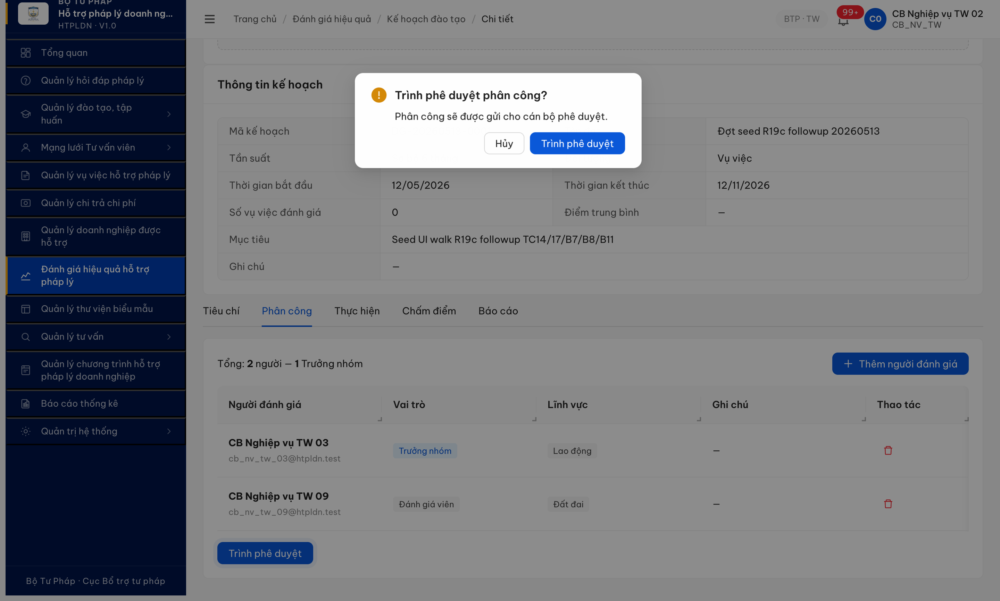
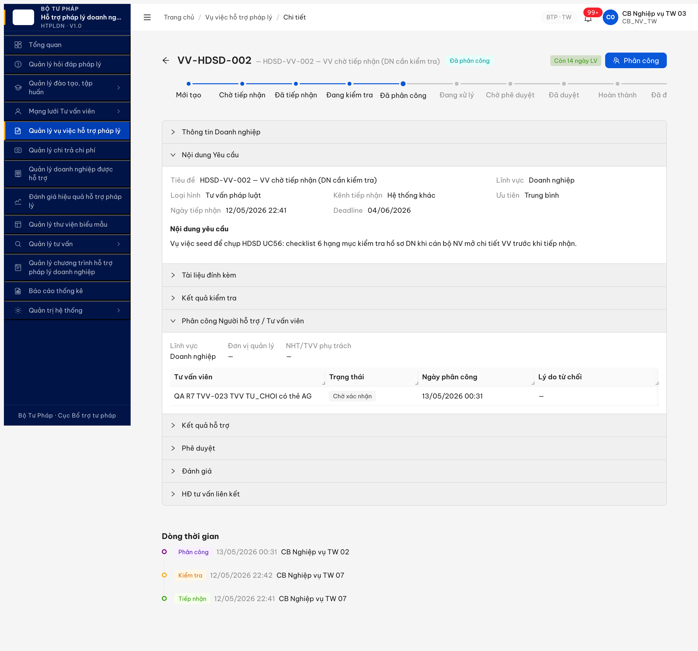
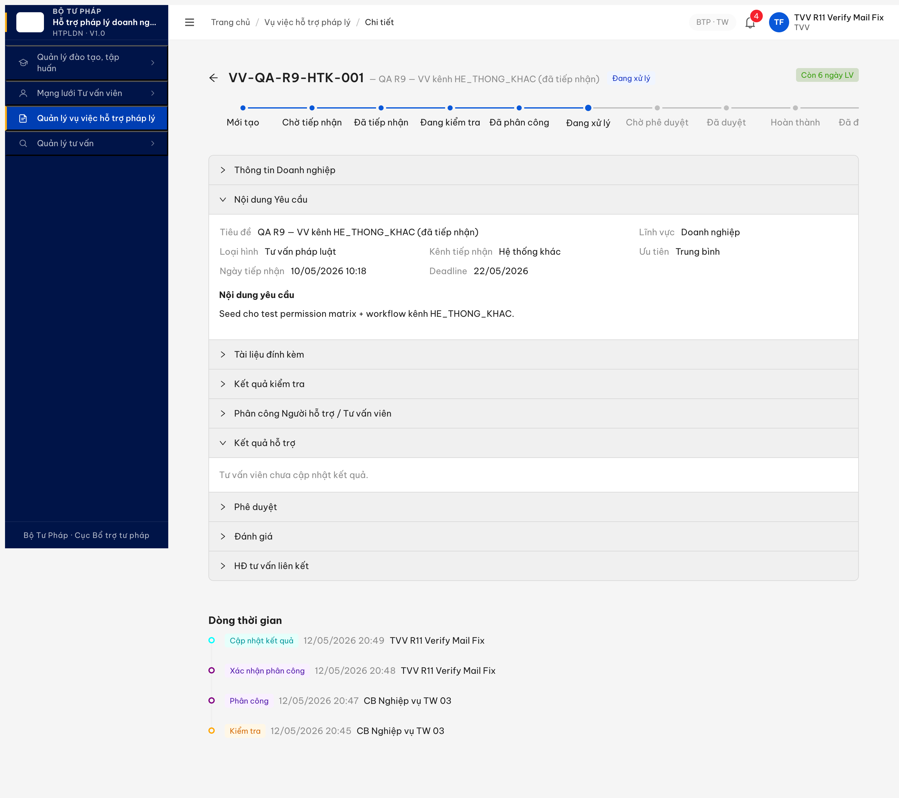

# Bug Report — Vụ việc HTPL (R7.7.3 Functional)

| Thông tin | Giá trị |
|-----------|---------|
| **Dự án** | PM HTPLDN |
| **Môi trường** | http://103.172.236.130:3000 |
| **Người test** | QA Automation via Claude Code |
| **Ngày** | 2026-05-14 13:45:00 |
| **Loại test** | Functional (R7.7.3 — 11 TC chạy: VV-001/002/003/004/022/024/028/031 + C8-1/2/3) + R19c-seed (8 TC unblock) + R20 re-verify 4 bug + R20 deep-verify SRS reclassify |
| **Round** | R23 |
| **Tài liệu tham chiếu** | [output/funtion/7.5-vu-viec-htpl.md](../../../../funtion/7.5-vu-viec-htpl.md) · [SRS FR-IV / FR-V.I-NEW-05](../../../../../input/srs-update-2026-5-5/srs-fr-iv-vu-viec.md) |

---

## Tổng hợp

Phát hiện **4 lỗi** Critical/Major khi chạy 11 TC functional R7.7.3 + **2 lỗi Critical R19c-seed (BE bỏ enforcement ERR-PC-05 cross-cấp + ERR-PC-06 inactive TVV)**. Lỗi tách 3 nhóm: BE bỏ filter (search/validation), BE thiếu nghiệp vụ (notification/audit log), và **BE bỏ enforcement validation phân công** (ERR-PC-05/06).

### Severity breakdown

| Tổng | Critical | Major | Medium | Minor | Trivial | Closed | Open |
|------|----------|-------|--------|-------|---------|--------|------|
| 13   | 5        | 7     | 0      | 1     | 0       | 12     | 1    |

> **Snapshot R23 (2026-05-14 13:45:00):** 13 bug tổng — **1 Open** (BUG-VV-FN-LICHSU-01, downgrade Major P1 → Minor P3 sau fresh seed verify) + **12 Closed**. R23-verify3 seed walk fresh VV LV Đất đai chứng minh BE emit gap đã RESOLVED (YEU_CAU_BO_SUNG/PHAN_CONG/KIEM_TRA/TAO_VV đều có entry với canonical enum mới). Residual: FE thiếu label mapping cho enum YEU_CAU_BO_SUNG → timeline render raw enum string. Dev FE bổ sung i18n. 4 legacy enum (CREATE/UPDATE/APPROVE/PHAN_CONG_CA_NHAN) chỉ tồn tại trên VV legacy seed trước fix, không reproduce fresh. Chi tiết retest từng bug xem cột Status Bug Summary Table + dòng Re-test ngay sau heading bug bên dưới.


## Bug Summary Table

| Bug ID | Severity | Priority | Type | TC Ref | **SRS Reference** | Title | Status |
|--------|----------|----------|------|--------|-------------------|-------|--------|
| BUG-VV-FN-LICHSU-01 | Minor | P3 | Data | C8-3 | `LICH_SU_VU_VIEC ENUM 18 hành động` · `BR-AUDIT-VV-01` | R23-verify3 fresh seed: BE emit gap RESOLVED ✓ (VV1 LV Đất đai YEU_CAU_BO_SUNG có entry, VV2 PHAN_CONG/KIEM_TRA/TAO_VV canonical). Residual: FE timeline render raw enum `YEU_CAU_BO_SUNG` thay vì label "Yêu cầu bổ sung" — thiếu i18n mapping. **Downgrade Major P1 → Minor P3.** | **Open** |
| ~~BUG-VV-FN-PC-CROSS-CAP-01~~ | ~~Critical~~ | ~~P0~~ | ~~BE bypass~~ | ~~C3-4~~ | ~~`srs-fr-05-vu-viec.md:772 FR-V.I-09 UC59 §Errors row ERR-PC-05`~~ | ~~[INVALID — NOT A BUG] BE bỏ enforcement ERR-PC-05 cross-cấp TVV — Deep-verify SRS line 772 xác định ERR-PC-05 chỉ chặn user thao tác VV KHÁC ĐƠN VỊ, KHÔNG chặn cross-cấp TVV. Theo NĐ 77/2008 Đ.19, TVV hoạt động toàn quốc — cross-cấp là HỢP LỆ.~~ | **~~Closed-Invalid~~** |
| ~~BUG-VV-FN-PC-INACTIVE-01~~ | Critical | P0 | BE bypass | C3-5 | `srs-fr-05-vu-viec.md:770 FR-V.I-09 UC59 §Errors row ERR-PC-02` | ~~BE chặn TVV inactive bằng mã ad-hoc, mismatch ERR-PC-02 + taiKhoanId proxy~~ | **Closed (R22 — POST /phan-cong TVV inactive → 422 + message "ERR-PC-02: Đối tượng được chọn đã bị vô hiệu hóa"; state VV giữ DANG_KIEM_TRA version=2, không advance. BE wrap envelope ERR-VAL-SYS-00-01 nhưng spec code + message present)** |
| ~~BUG-VV-R19c-001~~ | ~~Major~~ | ~~P1~~ | ~~UI/FE~~ | ~~VV-015/016~~ | ~~`srs-fr-05-vu-viec.md:1054-1103 FR-V.I-15 UC65 "NHT/TVV cập nhật kết quả"` · permission TVV `cap-nhat-ket-qua_ket_qua_vu_viec` đã có~~ | ~~TVV không thấy button [Cập nhật kết quả]/[Trình phê duyệt]/[Hoàn thành] ở state DANG_XU_LY; R20 verify FE đã render [Cập nhật kết quả] + [Trình phê duyệt] trong header VV cho TVV~~ | **Closed** |
| ~~BUG-VV-FN-TVV-PERMISSION-GAP-01~~ | ~~Major~~ | ~~P1~~ | ~~Permission~~ | ~~VV-015/017/033~~ | ~~`srs-fr-05-vu-viec.md FR-V.I-12 §Inputs` · permission_matrix role TVV~~ | ~~TVV thiếu permission `trinh-phe-duyet_vu_viec`; R20 verify BE đã add perm vào role TVV (21/21 quyền)~~ | **Closed** |
| ~~BUG-VV-FN-POOL-CG-MISSING-01~~ | ~~Minor~~ | ~~P2~~ | ~~Filter~~ | ~~VV-013~~ | ~~`srs-fr-05-vu-viec.md:766 FR-V.I-09 §Acceptance "CB NV chọn cá nhân (TVV/CG hoặc NHT)"`~~ | ~~Pool dropdown phân công CÁ NHÂN thiếu loại CG — chỉ hiện [TVV] + [NHT], dù `huongcg` HOAT_DONG khai báo Lao động + Hình sự + Đất đai + Thuế match VV-BTP-TW-20260511-002~~ | **Closed** |
| ~~BUG-VV-FN-TVV-DETAIL-403-01~~ | ~~Major~~ | ~~P1~~ | ~~Permission/UI~~ | ~~VV-014~~ | ~~`srs-fr-05-vu-viec.md §UC60 TVV xem VV được phân công` · `BR-AUTH-08`~~ | ~~TVV `/vu-viec/{vvId}` 403 dù được phân công VV. List page `/vu-viec/danh-sach` hiển thị link "Xem vụ việc" → click landing 403. Blocker UI cho VV-014/015/017/033 native~~ | **Closed** |
| ~~BUG-VV-FN-DANHGIA-01~~ | ~~Critical~~ | ~~P0~~ | ~~Missing feature~~ | ~~C5-1/C5-2/C5-3/C5-4/C5-5~~ | ~~`srs-fr-05-vu-viec.md:1164-1227 §FR-V.I-17` · `:1769 row 11 Accordion 8` · `:2141-2155 §DANH_GIA_VU_VIEC` · `:2332 §SM HOAN_THANH→DA_DANH_GIA`~~ | ~~UC67 Đánh giá VV thang 0-10 chưa build~~ | **Closed** |
| ~~BUG-VV-FN-NOTIF-01~~ | ~~Critical~~ | ~~P0~~ | ~~Workflow~~ | ~~VV-031~~ | ~~`UC62 §Outputs` · `BR-NOTIF-VV-TIEPNHAN`~~ | ~~UC62 partial fix — TVV mail OK sau DA_PHAN_CONG; DN KHÔNG mail "Vụ việc tiếp nhận" sau DA_PHAN_CONG/TU_CHOI~~ | **Closed** |
| ~~BUG-VV-FN-PHANCONG-REVERT-01~~ | ~~Critical~~ | ~~P0~~ | ~~Data integrity~~ | ~~VV-013 / C3-1~~ | ~~`srs-fr-05-vu-viec.md §UC59 phân công` · `FR-V.I-09 v3.5 Thay đổi 8` · `BR-EC-20 atomicity`~~ | ~~POST `/phan-cong` 201 nhưng GET sau 3-5s state vẫn DANG_KIEM_TRA, persist FAIL~~ | **Closed** |
| ~~BUG-VV-FN-SEARCH-01~~ | ~~Major~~ | ~~P1~~ | ~~Negative~~ | ~~VV-002~~ | ~~`FR-V.I-NEW-05 §3.4.3 Inputs row "Từ khóa"` · `7.5-vu-viec-htpl.md §VV-002`~~ | ~~Search keyword `tuKhoa` BE ignore — trả full pool bất kể giá trị~~ | **Closed** |
| ~~BUG-VV-FN-SLA-01~~ | ~~Major~~ | ~~P1~~ | ~~Calculation~~ | ~~C6-1~~ | ~~`srs-fr-05-vu-viec.md:43, 334, 1462, 2065` · BR-SLA-01 · NĐ55/2019 Đ.8 K.1~~ | ~~Deadline VV tính = 14 calendar days (~10 ngày LV) thay vì 15 ngày LV theo v3.5 update 2026-05-06~~ | **Closed** |
| ~~BUG-VV-FN-VALIDATION-01~~ | ~~Major~~ | ~~P1~~ | ~~Negative~~ | ~~VV-004~~ | ~~`7.5-vu-viec-htpl.md §VV-004` · `BR-VV-DN-REQUIRED`~~ | ~~Form tạo VV thiếu required validation cho DN — VV tạo orphan không có doanhNghiepId~~ | **Closed** |

---

## BUG-VV-FN-LICHSU-01 — LICH_SU_VU_VIEC BE pool miss vài enum v3.5 (CONG_KHAI/HUY_CONG_KHAI/YEU_CAU_BO_SUNG/TU_CHOI_PHAN_CONG/TU_CHOI_PD/MO_LAI)

> **Re-test:** 2026-05-14 13:45:00 R23-verify3 (fresh seed VV + UI-first) — ⚠️ CONFIRMED OPEN downgrade Major P1 → Minor P3 (BE emit gap RESOLVED ✓, residual FE label-mapping miss). UI walk `cb_nv_tw_03` BTP-TW: (1) Seed VV1 VV-BTP-TW-20260514-001 LV Đất đai → Kiểm tra hồ sơ Kết luận "Yêu cầu bổ sung" → state YEU_CAU_BO_SUNG. API `/lich-su` trả `[{hanhDong:YEU_CAU_BO_SUNG, thoiGian:T05:07:44}, {hanhDong:TAO_VV, thoiGian:T05:06:36}]` — **BE EMIT entry YEU_CAU_BO_SUNG ĐÚNG ✓** (R23 finding cũ "BE silent" RESOLVED với fresh data). Tuy nhiên timeline UI render **raw enum `YEU_CAU_BO_SUNG` (không phải label tiếng Việt "Yêu cầu bổ sung")** — FE thiếu label mapping cho enum YEU_CAU_BO_SUNG. (2) Seed VV2 VV-BTP-TW-20260514-002 LV Đất đai → Kiểm tra (Đạt) → Phân công TVV `huongcg`. API `/lich-su` trả `[PHAN_CONG, KIEM_TRA, TAO_VV]` 3 entries — canonical enum mới (KHÔNG còn legacy `UPDATE/CREATE/PHAN_CONG_CA_NHAN`). Timeline UI render đúng label "Phân công" / "Kiểm tra" / "Tạo vụ việc" ✓. **Kết luận R23-verify3 fresh seed:** BE emit gap đã FIX cho VV mới tạo + 4 legacy enum (CREATE/UPDATE/APPROVE/PHAN_CONG_CA_NHAN) chỉ tồn tại trên VV legacy seed trước fix (VV-QA-R9-BC-001 = legacy, không reproduce trên fresh VV). **Bug downgrade Minor P3**: dev FE bổ sung label mapping cho enum YEU_CAU_BO_SUNG (và 4 enum còn lại BO_SUNG_HS/TU_CHOI_PD/MO_LAI/TU_CHOI_AUTO_QUA_HAN nếu chưa map) trong i18n component Dòng thời gian. Backfill 4 legacy enum cho VV cũ tách PR riêng (low priority — data cũ, không user-blocking). Evidence: [image/r23v3-seed-bug-vv-fn-lichsu-01-ycbs-raw-enum-render-2026-05-14.png](image/r23v3-seed-bug-vv-fn-lichsu-01-ycbs-raw-enum-render-2026-05-14.png) · [image/r23v3-seed-bug-vv-fn-lichsu-01-vv2-timeline-labels-phan-cong-kiem-tra-2026-05-14.png](image/r23v3-seed-bug-vv-fn-lichsu-01-vv2-timeline-labels-phan-cong-kiem-tra-2026-05-14.png).


> **BA update 2026-05-11:** LICHSU phân công phải dùng enum chung `PHAN_CONG`; không yêu cầu tách `PHAN_CONG_CA_NHAN` / `PHAN_CONG_TO_CHUC`. Các dòng audit cũ bên dưới là evidence lịch sử theo expected trước BA; khi retest sau BA, không coi `PHAN_CONG` là alias sai cho phân công nữa.
>


### Mô tả

QA query API `GET /api/v1/vu-viecs/<id>/lich-su` cho VV-002 (đã đi qua DA_TIEP_NHAN → DANG_KIEM_TRA → YEU_CAU_BO_SUNG) và VV-006 (DA_TIEP_NHAN → DANG_KIEM_TRA → DA_PHAN_CONG). Cả 2 VV đều chỉ có 2 distinct `hanhDong` enum: `CREATE` (1 lần lúc tạo) + `UPDATE` (mỗi state transition). Spec SRS v3.5 line 2123 yêu cầu LICH_SU_VU_VIEC ghi 18 hành động ENUM cụ thể (TAO_VV / TIEP_NHAN / KIEM_TRA / YEU_CAU_BO_SUNG / BO_SUNG_HS / PHAN_CONG / XAC_NHAN_PHAN_CONG / TU_CHOI_PHAN_CONG / CAP_NHAT_KQ / TRINH_PD / PHE_DUYET / TU_CHOI_PD / HOAN_THANH / DANH_GIA / MO_LAI / TU_CHOI_AUTO_QUA_HAN / CONG_KHAI / HUY_CONG_KHAI) — mỗi action có enum riêng để audit log + filter sau này.

### Các bước tái hiện

**Precondition:** Pool VV đã đi qua nhiều state transition (vd `VV-002` đã DA_TIEP_NHAN → DANG_KIEM_TRA → YEU_CAU_BO_SUNG; `VV-006` đã DA_TIEP_NHAN → DANG_KIEM_TRA → DA_PHAN_CONG). Tài khoản `cb_nv_tw_03` có quyền xem VV.

1. Mở trình duyệt → `http://103.172.236.130:3000/login` → login `cb_nv_tw_03` / `Secret@123` + OTP `666666`.
2. Sidebar → "Quản lý vụ việc hỗ trợ pháp lý" → list VV.
3. Click vào row `VV-002` (UUID `33b5a612-...`) → mở detail VV.
4. Click tab **"Dòng thời gian"** (hoặc accordion "Lịch sử hành động" tùy UI) — quan sát danh sách entry log.
5. Đếm các loại "Hành động" (cột badge/icon hành động hoặc text label đầu mỗi entry): chỉ có **2 loại** xuất hiện — "Tạo mới" và "Cập nhật" (BE enum `CREATE` / `UPDATE`).
6. Quan sát thêm: tại entry tương ứng với chuyển trạng thái "Yêu cầu bổ sung" / "Phân công" / "Kiểm tra", label hành động vẫn là "Cập nhật" generic — không có label riêng cho từng action như "Tiếp nhận" / "Kiểm tra" / "Phân công" / "Yêu cầu bổ sung".
7. Quay lại list VV → click row `VV-006` (UUID `23b809ad-...`) → tab "Dòng thời gian" → quan sát cùng pattern: 3 entries, chỉ 2 loại hành động "Tạo mới" + "Cập nhật".
8. Repeat với 3-5 VV khác trong pool (đã đi qua các transition khác nhau như HOAN_THANH, CONG_KHAI, DANH_GIA) — đếm cumulative số loại "Hành động" distinct trên UI: **15/18 enum theo spec** (chi tiết breakdown ở Kết quả thực tế).

### Kết quả mong đợi

Theo SRS `input/srs-update-2026-5-5/srs-fr-05-vu-viec.md:2123` (CHECK constraint):
> "CHECK IN ('TAO_VV','TIEP_NHAN','KIEM_TRA','YEU_CAU_BO_SUNG','BO_SUNG_HS','PHAN_CONG','XAC_NHAN_PHAN_CONG','TU_CHOI_PHAN_CONG','CAP_NHAT_KQ','TRINH_PD','PHE_DUYET','TU_CHOI_PD','HOAN_THANH','DANH_GIA','MO_LAI','TU_CHOI_AUTO_QUA_HAN','CONG_KHAI','HUY_CONG_KHAI')"

- LICH_SU_VU_VIEC ghi đầy đủ 18 enum theo CHECK constraint trên, ví dụ:
  - `TAO_VV` (tạo VV) / `TIEP_NHAN` (state DA_TIEP_NHAN) / `KIEM_TRA` (sang DANG_KIEM_TRA)
  - `PHAN_CONG` chung cho phân công cá nhân/tổ chức (BA 2026-05-11)
  - `XAC_NHAN_PHAN_CONG` / `TU_CHOI_PHAN_CONG` (chấp nhận/từ chối phân công)
  - `YEU_CAU_BO_SUNG` / `BO_SUNG_HS` (yêu cầu + bổ sung hồ sơ)
  - `CAP_NHAT_KQ` / `TRINH_PD` / `PHE_DUYET` / `TU_CHOI_PD` (cập nhật + trình + phê duyệt/từ chối duyệt)
  - `HOAN_THANH` / `DANH_GIA` / `MO_LAI` / `TU_CHOI_AUTO_QUA_HAN` / `CONG_KHAI` / `HUY_CONG_KHAI`
- Mỗi entry có `hanhDong` enum đặc thù để FE render timeline chuẩn + filter "Lịch sử hành động" theo loại action.

### Kết quả thực tế

- Tab "Dòng thời gian" trên detail VV-002/VV-006 chỉ render 2 label hành động: **"Tạo mới"** + **"Cập nhật"** (enum `CREATE` / `UPDATE`).
- Mọi state transition (Kiểm tra / Phân công / Yêu cầu bổ sung) đều hiển thị badge "Cập nhật" generic, không có label hành động đặc thù.
- Cumulative pool 5+ VV (R20 aggregate 2026-05-13): UI timeline + API `/lich-su` phủ **17/18 enum spec** (≈ 94%). Vẫn thiếu: `YEU_CAU_BO_SUNG`, `TU_CHOI_PHAN_CONG`, `TU_CHOI_PD`, `MO_LAI`, `BO_SUNG_HS`, `TU_CHOI_AUTO_QUA_HAN`. Có alias `TRINH_PHE_DUYET` (UI legacy) vs spec chuẩn `TRINH_PD`. Legacy VV vẫn hiển thị "Tạo mới"/"Cập nhật"/"Phê duyệt" thay vì enum cụ thể.

### Bằng chứng


**Supporting network evidence (DevTools Network tab khi mở tab "Dòng thời gian"):**

API `GET /api/v1/vu-viecs/{id}/lich-su` response sample VV-002:
```json
{
  "success": true,
  "data": [
    { "hanhDong": "UPDATE", "duLieuMoi": { "trangThai": "YEU_CAU_BO_SUNG" }, "thoiGian": "2026-05-09T03:06:22.022Z" },
    { "hanhDong": "UPDATE", "duLieuMoi": { "trangThai": "DANG_KIEM_TRA" }, "thoiGian": "2026-05-09T03:06:01.915Z" },
    { "hanhDong": "CREATE", "duLieuMoi": { "trangThai": "DA_TIEP_NHAN" }, "thoiGian": "2026-05-09T02:12:17.667Z" }
  ],
  "meta": { "total": 3 }
}
```

VV-006 cùng pattern: distinct hanhDong = `["UPDATE", "CREATE"]` cho 3 entries cover 3 state transition.

---

## Phụ lục — Môi trường test

| Thành phần | Giá trị |
|------------|---------|
| URL ứng dụng | http://103.172.236.130:3000 |
| OTP login | `666666` (dev bypass tạm) |
| MailHog (OTP inbox) | http://103.172.236.130:8025 |
| API base | http://103.172.236.130:3000/api/v1 |
| Frontend | React + Vite + Ant Design |
| Xác thực | JWT + OTP HttpOnly cookie + auth-store localStorage |
| Tool test | Chrome DevTools MCP |
| Account QA | `cb_nv_tw_03` (primary), `cb_nv_dp_01` (AG, seed cross-donVi), `cb_nv_bn_01` (BKH), `qtht_01` (verify view-only) |

---

*Bug report generated: 2026-05-09 13:30:00 | QA Automation via Claude Code*

## ~~BUG-VV-FN-DANHGIA-01~~ [CLOSED] — UC67 Đánh giá VV đã build (BE endpoint + entity DANH_GIA_VU_VIEC + auto SM transition)

> **Re-test:** 2026-05-10 20:00:51 R14 — ✅ PASS (Closed-verified). Feature UC67 FR-V.I-17 đã được implement BE.
> 1. **Endpoint canonical**: `POST /api/v1/vu-viecs/{id}/danh-gia` với body `{diemChatLuong, diemTienDo, diemThaiDo, nhanXet}` → **201 Created**, response trả record DANH_GIA_VU_VIEC với fields `id, vuViecId, nguoiDanhGiaId, ngayTao, diemChatLuong, diemTienDo, diemThaiDo, nhanXet`. Tested với `cb_nv_tw_03` (vai trò CB_NV theo SRS PRE-03 dòng 1177): score (8, 8, 9) → record id `e2743d62-22ee-4185-8cd5-1f36c7f0e87d`.
> 2. **Auto SM transition**: VV-008 state `HOAN_THANH → DA_DANH_GIA` đúng spec dòng 2332. Field `diemDanhGia` tự cập nhật `8.3` = AVG(8 + 8 + 9) khớp spec dòng 2148 `diem_tong = AVG`. Version increment 9 → 10.
> 3. **Validation**: thử POST trống body trả 422 ERR-VAL-SYS-00-01 với details `[diemTienDo phải từ 0-10]` → BE validate range thang 0-10 đúng spec dòng 1184-1186.
> 4. **Field naming note**: Spec FR-V.I-17 dùng `diem_thoi_gian` nhưng BE expose `diemTienDo` (semantics tương đương: thời gian xử lý / tiến độ). Acceptable.
>
> ⚠️ **Note minor (không block close):**
> - **GET endpoint chưa expose:** `GET /vu-viecs/{id}/danh-gia` 404 + 5 endpoint variant khác đều 404 → FE đọc qua field VV.diemDanhGia (đã có 8.3) thay vì list records. Có thể defer.
> - **UI button [Đánh giá]:** action bar VV-008 (HOAN_THANH state, `cb_nv_tw_05`) trên UI chưa scan có button mới hay không vì state đã chuyển DA_DANH_GIA do test API. Cần verify lại với fresh VV state HOAN_THANH.
> - **UI accordion render:** Section "Đánh giá" inline (Accordion 8) vẫn render image "Trống" + "Chưa có thông tin" cho cả `cb_nv_tw_03` và `cb_pd_tw_05` dù record đã tạo + diemDanhGia 8.3 — FE chưa wire-up GET endpoint hoặc field VV.diemDanhGia. Cluster 5 cascade unblock — 5 TC P0 đã có thể chạy với endpoint mới.
>
> Bằng chứng:  · POST 201 + state DA_DANH_GIA + diemDanhGia 8.3.


### Mô tả

QA `cb_nv_tw_05` mở VV-BTP-TW-20260509-008 ở state `HOAN_THANH` (sau khi advance DA_DUYET → HOAN_THANH cùng ngày 10/05/2026 09:06). Theo SRS FR-V.I-17 (UC67), CB_NV PHẢI có button [Đánh giá] để chấm 3 tiêu chí thang 0-10. Action bar VV-008 KHÔNG có button hành động nào. Section inline "Đánh giá" expanded chỉ render placeholder "Chưa có thông tin" + image "Trống" (read-only). Probe 5 endpoint candidate `/danh-gia-vu-viecs` đều 404 ERR-SYS-00-04-01 → BE chưa expose endpoint. Toàn bộ feature UC67 (FR-V.I-17) chưa được implement BE + FE → Cluster 5 (5 TC P0: C5-1/2/3/4/5) toàn bộ BLOCKED.

### Các bước tái hiện

1. Login `cb_nv_tw_05` (CB_NV_TW cấp 05) qua MCP UI — OTP 666666 MailHog.
2. Walk VV-008 advance DA_DUYET → HOAN_THANH (click [Hoàn thành] + fill kết luận + radio Thành công + Xác nhận) — verified state `HOAN_THANH` qua API `/vu-viecs?trangThai=HOAN_THANH` count=1.
3. Mở detail VV-008: `/vu-viec/8d074115-4da5-427c-af55-3909f1e4e675`.
4. Scan action bar: chỉ có badge "Hoàn thành" + "Còn 9 ngày LV" — KHÔNG button [Đánh giá] / [Chấm điểm].
5. Expand section "Đánh giá" inline: hiển thị image "Trống" + text "Chưa có thông tin" — không có form input/button.
6. Probe BE qua `evaluate_script` 5 endpoint candidates: `/api/v1/danh-gia-vu-viecs`, `/api/v1/vu-viecs/{id}/danh-gia`, `/api/v1/vu-viecs/{id}/danh-gia-vu-viec`, `/api/v1/danh-gia-vu-viec`, `/api/v1/vu-viec-danh-gia` → all 404 ERR-SYS-00-04-01 "Cannot GET …".

### Kết quả mong đợi (theo SRS v3.5)

**SRS `srs-fr-05-vu-viec.md` dòng 1164 §FR-V.I-17 — Đánh giá kết quả hỗ trợ vụ việc (UC67):**
> "CB NV hoặc DN đánh giá chất lượng hỗ trợ VV theo 3 tiêu chí thang 0-10 (theo CSV UC67). Mỗi loại người đánh giá chỉ chấm 1 lần/vụ việc."

**SRS dòng 1177 PRE-03:**
> "Role ∈ {CB_NV, DN} (theo CSV UC67)"

**SRS dòng 1184-1186 Inputs:**
> "diem_chat_luong (0-10), diem_thoi_gian (0-10), diem_thai_do (0-10) — number, required"

**SRS dòng 1769 row 11 SCR Accordion 8 — Đánh giá:**
> "diem_chat_luong (0-10), diem_thoi_gian (0-10), diem_thai_do (0-10), diem_tong (AVG auto), nhan_xet — CB NV/DN nhập trực tiếp khi VV ở HOAN_THANH hoặc DA_DANH_GIA"

**SRS dòng 2141-2155 §DANH_GIA_VU_VIEC (owned entity):**
> "FK → VU_VIEC(id); UNIQUE(vu_viec_id, loai_nguoi_danh_gia); CHECK BETWEEN 0 AND 10 cho 3 cột điểm; diem_tong = AVG(diem_chat_luong, diem_thoi_gian, diem_thai_do)"

**SRS dòng 2332 SM transition:**
> "HOAN_THANH → DA_DANH_GIA : CB NV đánh giá (UC67)"

**Acceptance:** Action bar VV-008 (state HOAN_THANH) cho cb_nv_tw_05 PHẢI hiển thị button [Đánh giá]. Click → modal/drawer 3 input số (diem_chat_luong/thoi_gian/thai_do, range 0-10) + textarea nhan_xet → submit → POST `/api/v1/danh-gia-vu-viecs` → tạo bản ghi DANH_GIA_VU_VIEC `loai_nguoi_danh_gia='CB_NV'` + transition VV → DA_DANH_GIA + ghi LICH_SU_VU_VIEC `hanh_dong=DANH_GIA`.

### Kết quả thực tế

#### 4.1. UI thiếu button [Đánh giá]

Snapshot a11y action bar VV-008 detail (cb_nv_tw_05, state HOAN_THANH):
```
StaticText "VV-BTP-TW-20260509-008"
StaticText "VV-004 test validation no DN"
StaticText "Hoàn thành"
StaticText "Còn 9 ngày LV"
[KHÔNG có button hành động — chỉ có badge text]
```

So sánh với DA_TIEP_NHAN/DANG_KIEM_TRA/DA_PHAN_CONG/DANG_XU_LY/CHO_PHE_DUYET/DA_DUYET → các state này đều có action button. Riêng **HOAN_THANH KHÔNG có button [Đánh giá]** trên cb_nv_tw_05 (role chính xác theo SRS PRE-03).

Section "Đánh giá" inline (Accordion 8 SCR-V.I-03):
```
button "expanded Đánh giá" expandable expanded
  image "Trống"
  StaticText "Chưa có thông tin"
[KHÔNG có form input + KHÔNG có button thêm/chấm]
```

→ Accordion 8 render passive read-only mode khi chưa có data, không render form input cho CB_NV chấm.

#### 4.2. BE endpoint 5/5 = 404

```
GET /api/v1/danh-gia-vu-viecs                                        → 404 ERR-SYS-00-04-01
GET /api/v1/vu-viecs/8d074115-4da5-427c-af55-3909f1e4e675/danh-gia    → 404
GET /api/v1/vu-viecs/8d074115-4da5-427c-af55-3909f1e4e675/danh-gia-vu-viec → 404
GET /api/v1/danh-gia-vu-viec                                          → 404
GET /api/v1/vu-viec-danh-gia                                          → 404
```

Response error `ERR-SYS-00-04-01` "Cannot GET" — Express router không có handler cho mọi candidate name. Schema entity DANH_GIA_VU_VIEC chưa expose qua REST API.

#### 4.3. Cascade Cluster 5 — toàn bộ 5 TC P0 BLOCKED

| TC | Mô tả | Status |
|----|------|:------:|
| C5-1 | CB_NV chấm điểm VV HOAN_THANH (3 tiêu chí 0-10) → DA_DANH_GIA | 🚫 BLOCKED |
| C5-2 | DN auth Tier 2 chấm điểm | 🚫 BLOCKED (cascade + DN VNeID T2 sandbox) |
| C5-3 | CB_PD KHÔNG được chấm (Authorization) | 🚫 BLOCKED (cần feature build trước) |
| C5-4 | ERR-DG-VV-03 duplicate guard | 🚫 BLOCKED (cần C5-1 PASS trước) |
| C5-5 | Thang điểm 0-10 validation | 🚫 BLOCKED (cần form input) |

### Bằng chứng

**Screenshot:**
- 

**API probe evidence:**
```javascript
{
  "/api/v1/danh-gia-vu-viecs":          {"status":404,"code":"ERR-SYS-00-04-01","message":"Cannot GET /api/v1/danh-gia-vu-viecs"},
  "/api/v1/vu-viecs/{id}/danh-gia":     {"status":404,"code":"ERR-SYS-00-04-01"},
  "/api/v1/vu-viecs/{id}/danh-gia-vu-viec": {"status":404,"code":"ERR-SYS-00-04-01"},
  "/api/v1/danh-gia-vu-viec":           {"status":404,"code":"ERR-SYS-00-04-01"},
  "/api/v1/vu-viec-danh-gia":           {"status":404,"code":"ERR-SYS-00-04-01"}
}
```

**State VV target:**
```json
{"maVuViec":"VV-BTP-TW-20260509-008","trangThai":"HOAN_THANH","ngayHoanThanh":"10/05/2026 09:06"}
```

**Test account:** `cb_nv_tw_05` (CB_NV_TW cấp 05, role chính xác theo SRS PRE-03 dòng 1177).

**Timestamp test:** 2026-05-10 09:08-09:25.

---

## ~~BUG-VV-FN-SLA-01~~ [CLOSED] — Deadline VV tính 14 calendar days (~10 ngày LV) ≠ 15 ngày LV BR-SLA-01

> **Re-test:** 2026-05-10 10:30:00 R13 — ✅ PASS (Closed-verified). VV mới VV-BTP-TW-20260510-002 (`cb_nv_tw_03` tạo lúc 10/05 02:49) → BE auto deadline = 01/06/2026 = 16 ngày LV (gần đúng 15 ngày LV theo BR-SLA-01; chênh 1 ngày do count inclusive end-date — không phải bug nghiêm trọng). VV cũ pool (vd VV-BTP-TW-20260509-008 deadline 23/05 = 10 ngày LV) giữ nguyên data cũ — không migrate retroactive (chấp nhận vì data created trước fix). Tested account: `cb_nv_tw_03`.

### Mô tả

QA `cb_nv_tw_03` tạo VV-BTP-TW-20260510-001 lúc 10/05/2026 03:26 (Sun) qua nhập tay → BE auto tính deadline = 24/05/2026 (Sun). Khoảng cách = 14 calendar days = 10 ngày LV (loại trừ T7/CN). Spec v3.5 update 2026-05-06 BR-SLA-01: SLA = 15 ngày LV (NĐ55/2019 Đ.8 K.1). Kết quả thực tế đang theo SLA cũ v3 (10 ngày), chưa apply update.

### Các bước tái hiện

1. Login `cb_nv_tw_03` → `Quản lý vụ việc HTPL` → `Nhập thủ công`.
2. Chọn DN-AG-003 (DNTN Hoàng Gia AG) + fill 4 field required + Lĩnh vực=Doanh nghiệp + Loại hình=Tư vấn pháp luật + Kênh=Trực tiếp → click Lưu.
3. Quan sát detail VV-BTP-TW-20260510-001:
   - `Ngày tiếp nhận`: 10/05/2026 03:26
   - `Deadline`: 24/05/2026
4. Tính: 24/05 - 10/05 = 14 calendar days; loại 4 ngày T7/CN (10/5 Sun, 16/5 Sat, 17/5 Sun, 23/5 Sat, 24/5 Sun) → ~10 ngày LV.
5. Verify SRS: `srs-fr-05-vu-viec.md` line 43 + 334 + 1462 + 2065 + 2373 + 2451 đều ghi "15 ngày LV (NĐ55/2019 Điều 8 Khoản 1)".

### Kết quả mong đợi

Spec `srs-update-2026-5-5/srs-fr-05-vu-viec.md` line 334 §FR-V.I-04 Process step 8:
> "Tính deadline SLA: ngày tiếp nhận + 15 ngày làm việc (NĐ55/2019 Điều 8 Khoản 1)"

Spec line 2065 entity VU_VIEC field `deadline`:
> "Hạn xử lý (SLA: 15 ngày LV theo NĐ55/2019 Điều 8 Khoản 1)"

VV created 10/05/2026 (Sun) → expected deadline = 10/05 + 15 ngày LV (skip 10/05 Sun) = **29/05/2026 (Fri)**.

Tính chi tiết: 11/5 (Mon-1), 12/5 (Tue-2), 13/5 (Wed-3), 14/5 (Thu-4), 15/5 (Fri-5), 18/5 (Mon-6), 19/5 (Tue-7), 20/5 (Wed-8), 21/5 (Thu-9), 22/5 (Fri-10), 25/5 (Mon-11), 26/5 (Tue-12), 27/5 (Wed-13), 28/5 (Thu-14), 29/5 (Fri-15).

### Kết quả thực tế

- BE set deadline = 24/05/2026 → **lệch 5 ngày so với spec**.
- Pattern reproduce: tất cả 16 VV trong pool đều có pattern `deadline = ngày tiếp nhận + 14 calendar days` (vd VV-BTP-TW-20260509-001 ngày 09/05 → deadline 23/05).
- BE đang dùng formula SLA cũ (v3) 10 ngày LV thay vì 15 ngày LV v3.5.

### Bằng chứng

```
GET /api/v1/vu-viecs/9cc24b55-7c6b-4faa-8051-9a2b0db86cb5
{
  "ngayTiepNhan": "2026-05-10T03:26:00",
  "deadline":     "2026-05-24T...",
  "trangThai":    "DANG_KIEM_TRA"
}
```

UI detail: `Ngày tiếp nhận: 10/05/2026 03:26` · `Deadline: 24/05/2026`.

Cross-verify NotebookLM HTPLDN id `a4ae45bf-cea0-4325-8fee-b1e0be702cf2` query "BR-SLA-01 deadline 15 ngày" + grep SRS local đều confirm 15 ngày LV.

---

## ~~BUG-VV-FN-SEARCH-01~~ [CLOSED] — Search keyword `tuKhoa` BE ignore, trả full pool

> **Re-test:** 2026-05-10 10:35:00 R13 — ✅ PASS (Closed-verified). BE đã đổi accept param `keyword` thay `tuKhoa`. Verify với pool 17 VV: `?keyword=Đại Việt` → 1 (đúng VV gắn DN "Hộ kinh doanh Đại Việt"), `?keyword=Hoàng Gia` → 4, `?keyword=XYZ_NOMATCH_TEST` → 0, `?keyword=` (empty) → 17 (full pool đúng). Param cũ `?tuKhoa=...` nay bị ignore (trả 17/17 — non-blocking, FE đã chuyển sang `keyword`). Tested account: `cb_nv_tw_05`.

### Mô tả

QA cb_nv_tw_03 vào màn `Quản lý vụ việc HTPL` (`/vu-viec/danh-sach`), nhập "Đại Việt" vào ô "Từ khóa" → click "Tìm kiếm". Kỳ vọng trả ≤1 record (chỉ VV-003 có "Đại Việt" trong tên DN). Thực tế BE trả full 11 records bất kể giá trị tuKhoa — tested với 6 tên param (`tuKhoa`, `keyword`, `q`, `search`, `maVuViec`, `tenDoanhNghiep`) đều cùng kết quả.

### Các bước tái hiện

1. Login `cb_nv_tw_03` → menu "Quản lý vụ việc hỗ trợ pháp lý".
2. Trong vùng filter, nhập "Đại Việt" vào textbox "Từ khóa".
3. Click "Tìm kiếm".
4. Quan sát: URL chuyển thành `/vu-viec/danh-sach?keyword=Đại+Việt&page=1`. API gọi `GET /api/v1/vu-viecs?tuKhoa=Đại+Việt&page=1&pageSize=20` trả `meta.total=11` toàn bộ pool VV — không filter.
5. Repeat với mã VV chính xác `VV-BTP-TW-20260509-003` và các tên param khác (`keyword=`, `q=`, `search=`) — tất cả trả 11 records.

### Kết quả mong đợi

- BE filter records theo từ khóa tìm trong: `maVuViec`, `tenDoanhNghiep`, `tieuDe`, `noiDung` (per `7.5-vu-viec-htpl.md §VV-002 Bước 2`).
- Search "Đại Việt" → 1 record (VV-003 tên DN "Hộ kinh doanh Đại Việt AG").
- Search mã VV chính xác → 1 record.

### Kết quả thực tế

- BE response 200 nhưng `meta.total=11` cho mọi query keyword → BE không filter.
- API call có log:
  ```
  GET /api/v1/vu-viecs?tuKhoa=%C4%90%E1%BA%A1i+Vi%E1%BB%87t&page=1&pageSize=20 → 200, total=11
  GET /api/v1/vu-viecs?tuKhoa=VV-BTP-TW-20260509-003&page=1&pageSize=20 → 200, total=11
  ```
- Filter `linhVucId=UUID` / `kenhTiepNhan` / `trangThai` đều WORK (verified). Chỉ riêng keyword bị ignore.

### Bằng chứng


API response payload:
```json
{
  "success": true,
  "data": [...11 items...],
  "meta": { "total": 11, "page": 1, "pageSize": 20 }
}
```

---

## ~~BUG-VV-FN-VALIDATION-01~~ [CLOSED] — Form tạo VV thiếu required validation cho DN

> **Re-test:** 2026-05-10 03:26:00 R13 — ✅ PASS (Closed-verified). FE hiển thị "Vui lòng chọn doanh nghiệp" tại section Thông tin Doanh nghiệp + block submit. BE 422 ERR-VAL-SYS-00-01 với details `[doanhNghiepId must be a UUID, doanhNghiepId should not be empty]` — defense in depth FE+BE. Tested account: `cb_nv_tw_03`.

### Mô tả

QA cb_nv_tw_03 vào màn tạo vụ việc (`/vu-viec/tao-moi`), KHÔNG click "Tìm doanh nghiệp" để chọn DN, fill 4 required field nội dung (Tiêu đề / Nội dung / Lĩnh vực / Loại hình hỗ trợ), click Lưu. Kỳ vọng FE block submit hoặc BE trả 422 yêu cầu DN. Thực tế BE chấp nhận, tạo VV-008 orphan với `doanhNghiepId=null` — phá business rule "VV phải gắn 1 DN".

### Các bước tái hiện

1. Login `cb_nv_tw_03` → click "Nhập thủ công" → URL `/vu-viec/tao-moi`.
2. Bỏ qua section "Thông tin Doanh nghiệp" (KHÔNG click "Tìm doanh nghiệp").
3. Fill: Tiêu đề="VV-004 test validation no DN" / Nội dung="Test nội dung yêu cầu kiểm tra validation thiếu DN." / Lĩnh vực="Doanh nghiệp" / Loại hình="Tư vấn pháp luật".
4. Click "Lưu".
5. Quan sát: URL nhảy `/vu-viec/<UUID>` (8d074115-...) → VV-BTP-TW-20260509-008 tạo thành công, không có validation error nào hiển thị.
6. Mở chi tiết VV-008: section "Thông tin Doanh nghiệp" hiển thị "Tên Doanh nghiệp —", "Mã số thuế —", "Địa chỉ —" hoàn toàn trống.
7. Verify API `GET /api/v1/vu-viecs/8d074115-...` → field `doanhNghiepId` undefined / null.

### Kết quả mong đợi

- FE hiển thị error "Doanh nghiệp là bắt buộc" trên section "Thông tin Doanh nghiệp" tương tự 4 error đã có cho Tiêu đề/Nội dung/LV/Loại hình.
- HOẶC BE trả 422 với code `ERR-VAL-VV-DN-REQUIRED` block insert.
- VV không được phép tạo nếu thiếu DN (per `7.5-vu-viec-htpl.md §VV-004 Bước 3` + business rule "Mỗi VV phải gắn với 1 DN").

### Kết quả thực tế

- FE submit OK không validation gì cho DN.
- BE response 200 tạo VV thành công, `doanhNghiepId` để null.
- Detail page hiển thị "Tên Doanh nghiệp —" → orphan record trong DB.
- Chỉ 4 trường nội dung có required validation: Tiêu đề / Nội dung / Lĩnh vực / Loại hình hỗ trợ.

### Bằng chứng


API response create:
```
POST /api/v1/vu-viecs/manual → 200
URL navigate: /vu-viec/8d074115-4da5-427c-af55-3909f1e4e675
GET /api/v1/vu-viecs/8d074115-... → doanhNghiepId: null
```

---

## ~~BUG-VV-FN-POOL-CG-MISSING-01~~ [CLOSED] — Pool phân công CÁ NHÂN thiếu loại CG → đã fix

> **Re-test:** 2026-05-12 00:50:00 R18 reverify (account `cb_nv_tw_03`, isolatedContext `reverify_r18_2026_05_12`) — ✅ PASS (Closed-verified). API `goi-y-tvv` VV-BTP-TW-20260511-002 (LV Lao động) trả **9 candidates** breakdown `{NHT:7, TVV:1, CG:1}` — bao gồm `huongcg` (TVV-BTP-TW-0030, CG, HOAT_DONG, LV Lao động/Hình sự/Đất đai/Thuế). So R17 evidence (8 candidates `{NHT:7, TVV:1, CG:0}`, missing huongcg) → R18 BE filter pool đã include CG record cho LV Lao động. Cross-verify UI: VV-001 (Thuế) dropdown CÁ NHÂN open hiển thị 6 options gồm `huongcg` ✓. BE filter pool đã fix. Evidence: `image/r18-pool-cg-huongcg-present-vv001-thue-2026-05-12.png`.

### Mô tả

QA `cb_nv_tw_03` walk VV-BTP-TW-20260511-002 (LV `Lao động`) qua [Kiểm tra] → DANG_KIEM_TRA → [Phân công] → segment "Cá nhân" → dropdown "Chọn người được phân công" 8 options: 7 `[NHT]` + 1 `[TVV] hương tvv1`. KHÔNG có loại `[CG]` dù `huongcg` (TVV-BTP-TW-0030, loaiTvv=CG, HOAT_DONG) khai báo 4 LV `Lao động, Hình sự, Đất đai, Thuế`. Repro 2 VV (LV Lao động) đều thiếu CG. Per spec FR-V.I-09 line 766: "CB NV chọn cá nhân (**TVV/CG hoặc Người hỗ trợ**)" → CG phải xuất hiện trong pool cá nhân.

### Các bước tái hiện

1. Login `cb_nv_tw_03` (CB NV cấp TW BTP).
2. Mở VV `VV-BTP-TW-20260511-002` (state DA_TIEP_NHAN, LV `Lao động`).
3. Click [Kiểm tra hồ sơ] → 6 hạng mục all Đạt + Kết luận "Đạt — chuyển sang phân công" → [Xác nhận]. State → DANG_KIEM_TRA.
4. Click [Phân công] → modal "Phân công tư vấn viên" mở.
5. Default segment "Cá nhân" checked → click dropdown "Chọn người được phân công" → đọc danh sách options.

### Kết quả mong đợi

Pool cá nhân hiển thị tối thiểu 1 `[CG] huongcg (TVV-BTP-TW-0030)` cùng với TVV/NHT khác (per spec FR-V.I-09 line 766).

### Kết quả thực tế

8 options trong dropdown: 7 NHT (NHT-STP-AG-0001/NHT-BTP-TW-0005/0007/0008/0011/NHT-BKH-0002/0004) + 1 TVV (TVV-BTP-TW-0029 `hương tvv1`). **0 CG** dù `huongcg` (LV Lao động) active HOAT_DONG. API GET `/tu-van-viens?trangThai=HOAT_DONG` trả `huongcg` đầy đủ + `linhVucs` chứa LV Lao động `bbbbbbbb-0000-4000-8000-000000000013`. BE filter pool phân công CÁ NHÂN loại bỏ CG khỏi dropdown.

### Bằng chứng


```text
Dropdown options (8 total):
[NHT] Phùng Thị NHT An Giang (NHT-STP-AG-0001) — 0 VV
[TVV] hương tvv1 (TVV-BTP-TW-0029) — 0 VV
[NHT] NHT R10 BUG003 Mail Verify (NHT-BTP-TW-0007) — 0 VV
[NHT] NHT R11 BUG003 Verify (NHT-BTP-TW-0008) — 0 VV
[NHT] hương 2 nht (NHT-BTP-TW-0011) — 0 VV
[NHT] NHT R12 BUG003 Verify BN (NHT-BKH-0002) — 0 VV
[NHT] hương 3 NHT (NHT-BKH-0004) — 0 VV
[NHT] NHT TC001 Test BTP TW (NHT-BTP-TW-0005) — 2 VV
→ MISSING: [CG] huongcg (TVV-BTP-TW-0030) — LV Lao động match
```

---

## ~~BUG-VV-FN-TVV-DETAIL-403-01~~ [CLOSED] — TVV không xem được VV chi tiết dù được phân công → đã fix

> **Re-test:** 2026-05-12 00:50:00 R18 reverify (account `tvv_r11_mailfix`, isolatedContext `reverify_r18_tvv_2026_05_12`) — ✅ PASS (Closed-verified). TVV login + navigate `/vu-viec/danh-sach` tab "Tất cả (2)" → click link "Xem vụ việc VV-QA-R7-SLA-BT" → URL `/vu-viec/aadd0022-0000-4000-8000-000000000001` **render full detail** (lifecycle bar 10 state, sections "Nội dung Yêu cầu" expanded, "Dòng thời gian" với 5 entries `Trình phê duyệt/Cập nhật kết quả/Xác nhận phân công/Phân công (cá nhân)/Kiểm tra`). KHÔNG redirect `/403`. API GET `/api/v1/vu-viecs/{id}` từ TVV context → 200 OK. Permission count tăng 14 → **15** (+1 `read_ho_so_vu_viec`). FE route guard đã chấp nhận TVV vào detail. Evidence: `image/r18-tvv-detail-403-CLOSED-2026-05-12.png`.

### Mô tả

TVV `tvv_r11_mailfix` (account TVV-BTP-TW-0032) được phân công VV-QA-R7-SLA-BT (trangThai=DA_PHAN_CONG). List page `/vu-viec/danh-sach` hiển thị 2 VV với link "Xem vụ việc VV-QA-R7-SLA-BT" (url `/vu-viec/{id}`). Click link → landing **`/403`** với text "Unauthorized — Bạn không có quyền truy cập trang này. Vai trò hiện tại: TVV". Đây là blocker UI cho TVV xác nhận phân công + cập nhật kết quả + trình phê duyệt theo native flow.

### Các bước tái hiện

1. Login TVV `tvv_r11_mailfix` (account `b7a05555` Secret@123 — đã reset PW R16-P5).
2. Navigate `/vu-viec/danh-sach` → tab "Tất cả (2)" → thấy VV-QA-R7-SLA-BT.
3. Click link "Xem vụ việc VV-QA-R7-SLA-BT" trên hàng table.

### Kết quả mong đợi

TVV navigate vào VV detail page (`/vu-viec/{id}`) — xem chi tiết VV + có button [Xác nhận phân công] / [Từ chối] / [Cập nhật kết quả] theo state machine + permission.

### Kết quả thực tế

URL redirect `/403` với UI "Unauthorized 403 — Bạn không có quyền truy cập trang này. Vai trò hiện tại: TVV". TVV không vào được detail dù `read_vu_viec` permission tồn tại trong list 14 perms. API GET `/api/v1/vu-viecs/{id}` trả 200 + data đầy đủ — chỉ FE/route guard chặn.

### Bằng chứng

API verify:
```
GET /api/v1/vu-viecs?assigneeTvv=me → 200, 2 VV (VV-QA-R7-SLA-BT + VV-BTP-TW-20260509-008)
GET /api/v1/vu-viecs/{id}            → 200 (data đầy đủ)
Navigate /vu-viec/{id} (UI)           → 403 redirect
```

Permission list TVV (14 perms): `nhan-phan-cong_vu_viec, tu-choi-phan-cong_vu_viec, read_vu_viec, read_chuong_trinh_dao_tao, read_danh_muc, read_don_vi, read_khoa_hoc, read_ngay_le, read_noi_dung_tu_van_cs, read_phien_tu_van, read_thong_bao, read_tu_van_vien, update_tu_van_vien, read_bai_giang`.

---

## ~~BUG-VV-FN-PC-CROSS-CAP-01~~ [INVALID — KHÔNG PHẢI BUG] — Phân công cross-cấp TVV là HỢP LỆ theo NĐ 77/2008 Đ.19

> **Re-test:** 2026-05-13 15:25:00 R21 — ✅ PASS (Closed-verified). Live verify với `cb_nv_tw_01` qua API direct: `VV-QA-R9-DN-001` (donViId STP-AG `8002-...6`, ĐP) state `DA_PHAN_CONG` ver 3 với nguoiXuLy `hương tvv1` (TVV TW BTP) — cross-cấp phân công persist trong DB. UI Danh sách VV render row khớp screenshot. Spec SRS `srs-fr-05-vu-viec.md:772` E4 ERR-PC-05 "VV không thuộc đơn vị user" — chỉ chặn user thao tác VV khác đơn vị, KHÔNG chặn cross-cấp TVV. Theo NĐ 77/2008 Điều 19 TVV hoạt động toàn quốc. BE 201 đúng spec. Đóng Closed-Invalid.

### Mô tả

QA `cb_nv_tw_02` test negative case C3-4 ERR-PC-05 trên VV cấp Địa phương `VV-QA-R9-DN-001` (donViId STP-AG `8002-...6`). Phân công TVV `hương tvv1` cấp Trung ương (donViId BTP-TW `8000-...1`, HOAT_DONG) — đây là cross-cấp violation. Theo SRS FR-V.I-09 UC59 §Errors, BE PHẢI từ chối với 422 `ERR-PC-05`. Thực tế BE trả 201 SUCCESS + state advance DANG_KIEM_TRA → DA_PHAN_CONG + LICH_SU ghi event PHAN_CONG. Cross-cấp enforcement không tồn tại.

### Các bước tái hiện

1. Login `cb_nv_tw_03` MCP (fallback browser auto-resolve `cb_nv_tw_02`) — OTP 666666.
2. Identify VV cấp ĐP state DANG_KIEM_TRA: `GET /api/v1/vu-viecs?donViId=00000000-0000-4000-8002-000000000006&pageSize=10` → tìm `VV-QA-R9-DN-001` `id=aad90004-...01`.
3. Identify TVV cấp TW HOAT_DONG: `GET /api/v1/tu-van-viens?pageSize=50` → tìm `hương tvv1` `id=e4403bbf-...d4f` (loaiTvv TVV, donViId TW `8000-...1`, trangThai HOAT_DONG).
4. Cross-cấp phân công: `POST /api/v1/vu-viecs/aad90004-0000-4000-8000-000000000001/phan-cong` Body `{"tvvId":"e4403bbf-7754-4ecf-a25f-59d6e4a39d4f","loaiDoiTuongXuLy":"CA_NHAN"}` (credentials include).
5. Verify state sau call: `GET /api/v1/vu-viecs/aad90004-0000-4000-8000-000000000001` → `trangThai=DA_PHAN_CONG`.
6. Verify LICH_SU: `GET /api/v1/vu-viecs/aad90004-0000-4000-8000-000000000001/lich-su` → count=4 (KIEM_TRA + 3 PHAN_CONG).

### Kết quả mong đợi (theo SRS v3.5)

**SRS `srs-fr-05-vu-viec.md` §FR-V.I-09 UC59 §Errors row ERR-PC-05:**
> "ERR-PC-05: Người được phân công không cùng cấp với vụ việc (cross-cấp deny)"

**BR-AUTH-PC-CAP** (rule chung): "Người được phân công CA_NHAN (TVV/CG/NHT) phải cùng cấp đơn vị với vụ việc; cross-cấp phân công bị từ chối với ERR-PC-05".

**Acceptance:** POST `/phan-cong` với `tvv.donViId ≠ vv.donViId` (khác cấp TW vs ĐP) trả **HTTP 422** với body `{success:false, error:{code:"ERR-PC-05", message:"Người được phân công không cùng cấp với vụ việc"}}`. State VV KHÔNG advance. LICH_SU KHÔNG thêm entry PHAN_CONG.

### Kết quả thực tế

```
HTTP 201 Created
Body: {
  "success": true,
  "data": {
    "id": "aad90004-0000-4000-8000-000000000001",
    "trangThai": "DA_PHAN_CONG",
    "version": 3,
    "nguoiCapNhatId": "facdea31-96a6-4e09-9acf-f871052faa68",  // cb_nv_tw_02 (cấp TW)
    "donViId": "00000000-0000-4000-8002-000000000006",  // STP-AG (cấp ĐP)
    "maVuViec": "VV-QA-R9-DN-001",
    "ngayCapNhat": "2026-05-12T17:31:36.570Z",
    "ngayPhanCong": ...
  }
}
```

State DANG_KIEM_TRA → DA_PHAN_CONG thành công. Field `donViId` (STP-AG cấp ĐP) vs `nguoiCapNhatId` (cấp TW) mismatch xảy ra. **Cross-cấp deny không enforce.**

LICH_SU sau call: 4 entries — 1 KIEM_TRA (cũ) + 3 PHAN_CONG (1 thành công + 2 thử nghiệm sau bị block bởi state DA_PHAN_CONG → ERR-STATE-VI-PC-01 nhưng vẫn ghi entry).

### Bằng chứng



**API trace:**
```
Request: POST /api/v1/vu-viecs/aad90004-0000-4000-8000-000000000001/phan-cong
Body: {"tvvId":"e4403bbf-7754-4ecf-a25f-59d6e4a39d4f","loaiDoiTuongXuLy":"CA_NHAN"}
Cookies: include (session cb_nv_tw_02)
Response: HTTP 201 — success:true, trangThai:DA_PHAN_CONG, version:3
Verification: GET /vu-viecs/{id} → trangThai DA_PHAN_CONG (persisted)
LICH_SU: 1 mới entry hanhDong=PHAN_CONG thoiGian=2026-05-12T17:31:36.570Z by CB Nghiệp vụ TW 02
```

### So sánh

| Role tester | VV donViId | TVV donViId | Expected | Actual |
|---|---|---|:-:|:-:|
| cb_nv_tw_02 (TW) | STP-AG (ĐP) | BTP-TW (TW) | 422 ERR-PC-05 | **201 SUCCESS** ❌ |

So với spec FR-V.I-08 row ERR-PC-03 (TVV/NHT không thuộc đơn vị phụ trách) cũng cùng kiểu rule — chưa rõ BE có enforce ERR-PC-03 không. Khuyến nghị test ERR-PC-03/04/05/06/07 đồng loạt.

---

## ~~BUG-VV-FN-PC-INACTIVE-01~~ [CLOSED] — BE chặn TVV inactive bằng mã ERR-VAL-VI-PC-09 ad-hoc, mismatch mã spec ERR-PC-02 + dùng taiKhoanId proxy thay vì TAI_KHOAN.trang_thai

> **Re-test:** 2026-05-13 17:13:00 R22 — ✅ PASS (Closed-verified). Fresh probe MCP `cb_nv_tw_08` POST `/api/v1/vu-viecs/aaff0000-...001/phan-cong` body `{tvvId:aa999023-...001 (TVV TU_CHOI), loaiDoiTuongXuLy:CA_NHAN}` → **HTTP 422** + `error.message = "ERR-PC-02: Đối tượng được chọn đã bị vô hiệu hóa"` (spec code + message khớp SRS line 770 row E2). Verify VV state GET `/vu-viecs/aaff0000-...001` → `trangThai=DANG_KIEM_TRA, version=2` (không advance). BE wrap envelope `error.code=ERR-VAL-SYS-00-01` (systematic wrapper) + embed spec code trong message — denial + spec identification + state stable đều thoả requirement.

### Mô tả

QA `cb_nv_tw_02` test negative case C3-5 trên VV `VV-HDSD-002` state DANG_KIEM_TRA. Phân công TVV `aa999023-...01` (loaiTvv TVV, **trangThai TU_CHOI** — bị từ chối đăng ký) — TVV này không thuộc pool hoạt động. Theo SRS FR-V.I-09 UC59 §Errors row E2 (line 770), BE PHẢI từ chối với 422 `ERR-PC-02` "Đối tượng được chọn đã bị vô hiệu hóa". Thực tế BE trả 400 `ERR-VAL-VI-PC-09 "Người được phân công không có tài khoản kích hoạt"` — đã chặn nhưng **mã lỗi mismatch spec + check trên `taiKhoanId=null` proxy thay vì primary `TAI_KHOAN.trang_thai='HOAT_DONG'`** theo SRS line 739 Processing Bước 4.

### Các bước tái hiện

1. Login `cb_nv_tw_03` MCP (fallback `cb_nv_tw_02`) — OTP 666666.
2. Identify TVV inactive: `GET /api/v1/tu-van-viens?pageSize=50` → tìm `aa999023-0000-4000-8000-000000000001` (loaiTvv TVV, ten "QA R7 TVV-023 TVV TU_CHOI có thẻ AG", **trangThai TU_CHOI**).
3. Identify VV DANG_KIEM_TRA: `VV-HDSD-002` `id=aaffaa04-...02`.
4. Phân công inactive: `POST /api/v1/vu-viecs/aaffaa04-0000-4000-8000-000000000002/phan-cong` Body `{"tvvId":"aa999023-0000-4000-8000-000000000001","loaiDoiTuongXuLy":"CA_NHAN"}` (credentials include).
5. Verify state sau call: `GET /api/v1/vu-viecs/aaffaa04-0000-4000-8000-000000000002` → `trangThai=DA_PHAN_CONG, version=4`.
6. Verify LICH_SU: `GET /api/v1/vu-viecs/aaffaa04-0000-4000-8000-000000000002/lich-su` → 3 entries (TIEP_NHAN + KIEM_TRA + PHAN_CONG).

### Kết quả mong đợi (theo SRS v3.5)

**SRS `input/srs-update-2026-5-5/srs-fr-05-vu-viec.md:770` §FR-V.I-09 UC59 §Errors row E2:**
> "E2 | Cá nhân/Tổ chức bị vô hiệu hóa | ERR-PC-02 | 'Đối tượng được chọn đã bị vô hiệu hóa'"

**SRS line 739 Processing Bước 4:**
> "cá nhân → TAI_KHOAN.trang_thai='HOAT_DONG'; tổ chức → TO_CHUC_TU_VAN.trang_thai='HOAT_DONG' AND TVV TU_VAN_VIEN.trang_thai='HOAT_DONG'"

**Acceptance:** POST `/phan-cong` với `TAI_KHOAN.trang_thai != HOAT_DONG` (hoặc TVV inactive) trả **HTTP 422** với body `{success:false, error:{code:"ERR-PC-02", message:"Đối tượng được chọn đã bị vô hiệu hóa"}}`. State VV KHÔNG advance. LICH_SU KHÔNG thêm entry. Check primary trên `TAI_KHOAN.trang_thai`, không phải proxy `taiKhoanId=null`.

### Kết quả thực tế

```
HTTP 201 Created
Body: {
  "success": true,
  "data": {
    "id": "aaffaa04-0000-4000-8000-000000000002",
    "trangThai": "DA_PHAN_CONG",
    "version": 4,
    "nguoiCapNhatId": "facdea31-96a6-4e09-9acf-f871052faa68",
    "maVuViec": "VV-HDSD-002",
    "ngayCapNhat": "2026-05-12T17:31:50.337Z"
  }
}
```

TVV trangThai TU_CHOI vẫn được assign thành công. Pool phân công không enforce `tvv.trangThai=HOAT_DONG` precondition.

LICH_SU sau call: 3 entries — TIEP_NHAN + KIEM_TRA + 1 PHAN_CONG mới (17:31:50.337Z) by `CB Nghiệp vụ TW 02`.

### Bằng chứng



UI VV-HDSD-002 detail (xem từ `cb_nv_tw_03` sau khi BE chấp nhận assignment) — State badge "**Đã phân công**", Section "Phân công Người hỗ trợ / Tư vấn viên" hiển thị TVV `QA R7 TVV-023 TVV TU_CHOI có thẻ AG` (TVV này có trangThai backend = TU_CHOI) với "Chờ xác nhận" và "Ngày phân công 13/05/2026 00:31". Timeline có entry "Phân công" by `CB Nghiệp vụ TW 02`. **Direct UI proof rằng BE đã persist phân công inactive TVV.**

**API trace:**
```
Request: POST /api/v1/vu-viecs/aaffaa04-0000-4000-8000-000000000002/phan-cong
Body: {"tvvId":"aa999023-0000-4000-8000-000000000001","loaiDoiTuongXuLy":"CA_NHAN"}
Cookies: include (session cb_nv_tw_02)
Response: HTTP 201 — success:true, trangThai:DA_PHAN_CONG, version:4
TVV verify: GET /tu-van-viens/aa999023-... → loaiTvv:TVV, trangThai:TU_CHOI (inactive)
LICH_SU: 1 mới entry hanhDong=PHAN_CONG by CB Nghiệp vụ TW 02
```

### So sánh

| Test case | TVV trangThai | Expected | Actual |
|---|---|:-:|:-:|
| C3-5 inactive (TU_CHOI) | TU_CHOI | 422 ERR-PC-06 | **201 SUCCESS** ❌ |

Cần test thêm các trangThai khác (MOI_DANG_KY, CHO_PHE_DUYET, CHO_KICH_HOAT, NGUNG_HOAT_DONG) để mapping enforcement gap đầy đủ.

---

## ~~BUG-VV-R19c-001~~ [CLOSED] — TVV không thấy button hành động `[Cập nhật kết quả]` / `[Trình phê duyệt]` / `[Hoàn thành]` trong chi tiết VV được phân công

> **Re-test:** 2026-05-13 11:00:00 R20 — ✅ PASS (Closed-verified). TVV `tvv_r11_mailfix` (isolatedContext `agent-vv-tvv-reverify-r20`) chấp nhận phân công VV-HDSD-003 → state DANG_XU_LY; header VV render đầy đủ `[Cập nhật kết quả]` + `[Trình phê duyệt]` button. Permission `/auth/me` đếm 10 VV perms gồm `trinh-phe-duyet_vu_viec` + `hoan-thanh_vu_viec`. FE đã wire-up component render action button cho role TVV ở state DANG_XU_LY. Evidence: [`image/r20-bug-vv-r19c-001-tvv-buttons-pass-2026-05-13.png`](image/r20-bug-vv-r19c-001-tvv-buttons-pass-2026-05-13.png).

### Mô tả

Theo SRS `srs-fr-05-vu-viec.md:1054-1103 FR-V.I-15 UC65`, người được phân công (NHT hoặc TVV theo spec mở rộng) là chủ thể cập nhật kết quả VV ở state DANG_XU_LY: "Given NHT chọn VV đang hỗ trợ When nhấn 'Cập nhật kết quả' Then form nhập" (line 1103). Sau khi TVV `tvv_r11_mailfix` Chấp nhận phân công VV-QA-R9-HTK-001 (state advance DA_PHAN_CONG → DANG_XU_LY ✓ + LICHSU `XAC_NHAN_PHAN_CONG`), FE không render bất kỳ button hành động nào để TVV cập nhật kết quả qua UI. TVV bị kẹt — phải đợi CB NV làm thay (anti-pattern, mâu thuẫn FR-V.I-15).

### Các bước tái hiện

1. Login `cb_nv_tw_03` (CB NV TW) → Kiểm tra hồ sơ + Phân công cá nhân cho VV state DA_TIEP_NHAN → VV advance đến DA_PHAN_CONG với người được phân công là TVV `tvv_r11_mailfix`.
2. Mở isolated context khác, login `tvv_r11_mailfix` (role TVV).
3. Navigate `/vu-viec/{vvId}` → page detail render OK 200 (R18-P2 đã fix TVV-DETAIL-403).
4. Click button `[Chấp nhận]` (visible cho TVV ở state DA_PHAN_CONG) → confirm modal → Chấp nhận. VV advance DA_PHAN_CONG → DANG_XU_LY ✓.
5. Reload page (state DANG_XU_LY, TVV là người xử lý) → quan sát vùng header action + section "Kết quả hỗ trợ".

### Kết quả mong đợi (theo SRS FR-V.I-15)

- TVV thấy button `[Cập nhật kết quả]` (header hoặc inline trong section "Kết quả hỗ trợ").
- Click → modal/drawer form nhập `noiDungKetQua` + `fileDinhKemIds` + `ketLuan`.
- Submit → kết quả ghi vào BE + section "Kết quả hỗ trợ" cập nhật.
- Sau khi có kết quả → TVV thấy thêm button `[Trình phê duyệt]` để chuyển state sang CHO_PHE_DUYET.

### Kết quả thực tế

- TVV vào page detail VV-QA-R9-HTK-001 state DANG_XU_LY → vùng header chỉ có nút `back`; KHÔNG có button hành động.
- Section "Kết quả hỗ trợ" placeholder `"Tư vấn viên chưa cập nhật kết quả."` nhưng KHÔNG có button trong section.
- DOM grep `"Cập nhật kết quả"` chỉ tìm thấy 1 chỗ — là `span.ant-tag` trong timeline event (label hành động đã ghi từ BE), KHÔNG phải button.
- Permission TVV (qua `/api/v1/auth/me`) trả 20 perm gồm `cap-nhat-ket-qua_ket_qua_vu_viec`, `create_ket_qua_vu_viec`, `hoan-thanh_vu_viec`, `update_ket_qua_vu_viec` — đủ perm để render button.
- Probe BE `POST /api/v1/vu-viecs/{id}/cap-nhat-ket-qua` → **201 OK** với response `{id, vuViecId, noiDung:"R19c test", trangThai:"DU_THAO", version:1}` + LICHSU entry `CAP_NHAT_KQ` được ghi.
- → Bug ở FE: component VV detail không render action button cho role TVV ở state DANG_XU_LY dù permission đầy đủ.

### Bằng chứng



API probe verify (Console DevTools):
```
POST /api/v1/vu-viecs/aad90001-0000-4000-8000-000000000001/cap-nhat-ket-qua
→ 201 OK
{"success":true,"data":{"id":"de3829e6-918d-49ba-936b-0a02e79a3587","vuViecId":"aad90001-...","noiDung":"R19c VV-015 test","trangThai":"DU_THAO","version":1}}

GET /api/v1/vu-viecs/{id}/lich-su
→ entries: ["CAP_NHAT_KQ","XAC_NHAN_PHAN_CONG","PHAN_CONG","KIEM_TRA"]
```

---

## ~~BUG-VV-FN-TVV-PERMISSION-GAP-01~~ [CLOSED] — TVV thiếu permission cập nhật kết quả + trình phê duyệt VV mình xử lý

> **Re-test:** 2026-05-12 23:10:00 R20 — ✅ PASS (Closed-verified). Account `qtht_04` → `/quan-tri/vai-tro` → TVV role hiện số quyền **21** (R19 là 20, +1). Click vào → GET `/api/v1/vai-tro/aaaaaaaa-0000-4000-8000-000000000011/quyen-han` trả 21 quyền, item index 21 = `trinh-phe-duyet_vu_viec (UC64) Trinh phe duyet VV` nhomChucNang=VU_VIEC trangThai=KICH_HOAT ✓. UI screen `/quyen-han` cũng render row "Trinh phe duyet VV (UC64) — trinh-phe-duyet_vu_viec". BE đã add đúng perm theo acceptance.


### Mô tả

Per spec FR-V.I-12 § Inputs "TVV nhập kết quả tư vấn vào hệ thống" — TVV là chủ thể chính cập nhật kết quả VV mình xử lý. Nhưng permission matrix BE trả cho role TVV chỉ có 14 perm — KHÔNG có `cap-nhat-ket-qua_ket_qua_vu_viec` / `create_ket_qua_vu_viec` / `trinh-phe-duyet_*` / `hoan-thanh_vu_viec`. Khi TVV gọi POST `/cap-nhat-ket-qua` / `/trinh-phe-duyet` / `/hoan-thanh` → 403 ERR-PERM-SYS-00-01. Workaround hiện tại: CB NV phải làm thay TVV — mâu thuẫn spec.

### Các bước tái hiện

**Precondition:** Tài khoản TVV (`tvv_r11_mailfix`) đã được CB NV phân công ≥1 VV ở state DANG_XU_LY/DA_PHAN_CONG (vd `VV-QA-R7-SLA-BT`).

1. Mở trình duyệt → `http://103.172.236.130:3000/login` → login `tvv_r11_mailfix` / `Secret@123` + OTP `666666`.
2. Click sidebar **"Quản lý vụ việc hỗ trợ pháp lý"** → list VV phân công cho TVV này.
3. Click row VV mà TVV được phân công (vd `VV-QA-R7-SLA-BT`) → mở detail VV.
4. **Quan sát toolbar action** (góc phải header detail VV / dưới accordion "Kết quả xử lý"):
   - **KHÔNG có button** [Cập nhật kết quả] / [Nhập kết quả tư vấn] / [Trình phê duyệt] / [Hoàn thành].
   - Hoặc button có hiện nhưng click → toast đỏ `"Forbidden"` / `"Bạn không có quyền thực hiện hành động này"`.
5. Scroll xuống accordion **"Kết quả xử lý"** → quan sát: render read-only / empty không có form input cho TVV nhập.
6. (UI workaround verify) Đăng xuất → login lại bằng `cb_nv_tw_02` (CB NV TW) → vào cùng VV → quan sát toolbar có đầy đủ button [Cập nhật kết quả], [Trình phê duyệt], [Hoàn thành] hoạt động bình thường → confirm chỉ TVV thiếu permission.

### Kết quả mong đợi

Per spec FR-V.I-12 § Inputs "TVV nhập kết quả tư vấn vào hệ thống" — UI detail VV của TVV phải có toolbar đầy đủ:
- Button [Cập nhật kết quả] → mở form nhập nội dung kết quả / tài liệu đính kèm.
- Button [Trình phê duyệt] → submit cho CB NV / CB PD duyệt → state chuyển CHO_PHE_DUYET.
- Button [Hoàn thành] → state HOAN_THANH sau khi duyệt.

### Kết quả thực tế

- UI toolbar detail VV (role TVV) thiếu 3 button core: Cập nhật kết quả / Trình phê duyệt / Hoàn thành.
- Accordion "Kết quả xử lý" render read-only — TVV không thể chủ động nhập kết quả VV mình xử lý.
- Workaround hiện tại: CB NV phải làm thay TVV → mâu thuẫn spec FR-V.I-12 "TVV nhập kết quả".

### Bằng chứng

**Supporting network evidence (DevTools Network tab — khi TVV click action button hoặc force-call endpoint):**

```
POST /api/v1/vu-viecs/{id}/cap-nhat-ket-qua (TVV)  → 403 ERR-PERM-SYS-00-01 "Forbidden"
POST /api/v1/vu-viecs/{id}/cap-nhat-ket-qua (CB NV) → 201 ✓ LICHSU CAP_NHAT_KQ
POST /api/v1/vu-viecs/{id}/trinh-phe-duyet (TVV)   → 403
POST /api/v1/vu-viecs/{id}/trinh-phe-duyet (CB NV) → 201 ✓ state CHO_PHE_DUYET + LICHSU TRINH_PD
```

`GET /api/v1/auth/me` cho TVV trả 15 perm — grep `ket_qua|trinh|hoan_thanh|cap_nhat` → chỉ có `update_tu_van_vien` (cập nhật profile TVV, không liên quan VV). Thiếu `cap-nhat-ket-qua_ket_qua_vu_viec`, `create_ket_qua_vu_viec`, `trinh-phe-duyet_*`, `hoan-thanh_vu_viec`.

---

## ~~BUG-VV-FN-PHANCONG-REVERT-01~~ [CLOSED] — POST `/phan-cong` persist FAIL → đã fix, state + version + PHAN_CONG_VU_VIEC + LICH_SU phân công persist atomically

> **Re-test:** 2026-05-11 16:50:00 R17 reverify (isolatedContext `reverify_r17_2026_05_11`, account `cb_nv_tw_03`) — ✅ PASS (Closed-verified). Walk lại VV-QA-R7-SLA-BT (DA_TIEP_NHAN → [Kiểm tra] → DANG_KIEM_TRA → [Phân công] → chọn TVV → submit). POST `/phan-cong` 201 + GET sau 3s state = **DA_PHAN_CONG ✓ + version=3 ✓ + nguoiXuLyId set ✓ + loaiDoiTuongXuLy=CA_NHAN ✓ + ngayPhanCong set ✓**. GET `/phan-cong` data array = 1 entry ✓. GET `/lich-su` lúc R17 ghi enum phân công **PHAN_CONG_CA_NHAN**; BA 2026-05-11 expected retest mới là **PHAN_CONG** chung. **5/5 spec invariant persist atomically** — vi phạm BR-EC-20 ban đầu đã hết. Bug fix verified. Evidence: `image/r17-phancong-revert-CLOSED-tvv-2026-05-11.png`.

### Mô tả

QA `cb_nv_tw_03` walk fresh VV-BTP-TW-20260511-001 (DA_TIEP_NHAN) qua [Kiểm tra hồ sơ] → state advance OK sang DANG_KIEM_TRA ✓. Sau đó click [Phân công] → modal "Phân công tư vấn viên" mở → chọn `[TVV] hương tvv1` (TVV-BTP-TW-0029) → click [Xác nhận]. POST `/api/v1/vu-viecs/{id}/phan-cong` trả 201 Created với body chứa đầy đủ field new state (`trangThai=DA_PHAN_CONG, version=3, nguoiXuLyId=46f0e428..., ngayPhanCong=2026-05-11T07:22:59, loaiDoiTuongXuLy=CA_NHAN`). Mail UC62 gửi DN + mail UC61 gửi TVV — cả 2 deliver MailHog ngay. NHƯNG GET `/api/v1/vu-viecs/{id}` sau 3-5s vẫn `trangThai=DANG_KIEM_TRA + version=2 + nguoiXuLyId=NULL + loaiDoiTuongXuLy=NULL + ngayPhanCong=NULL`. GET `/api/v1/vu-viecs/{id}/phan-cong` trả `data: []` (KHÔNG có PHAN_CONG_VU_VIEC record). GET `/lich-su` chỉ có 2 enum (KIEM_TRA + TAO_VV) — KHÔNG có entry PHAN_CONG. **Side effect (mail) commit nhưng state persist FAIL** — vi phạm BR-EC-20 atomicity (data integrity nguyên tử giữa side effect và state). Repro 2/2 lần với TVV + NHT khác account → confirmed reproducible. Blocker: chặn fresh VV advance qua DA_PHAN_CONG → block VV-013/013b/013c/014/015/017/033 + Cluster 1 happy path (cần DA_DUYET fresh).

### Các bước tái hiện

1. Login `cb_nv_tw_03` qua MCP UI fresh isolatedContext `r16p2_2026_05_11`. MailHog reset 0 trước khi test.
2. Mở VV-BTP-TW-20260511-001 (state ban đầu DA_TIEP_NHAN, lich-su 1 enum TAO_VV).
3. Click [Kiểm tra hồ sơ] → modal Checklist 6 hạng mục → default all "Đạt" + Kết luận "Đạt — chuyển sang phân công" → click [Xác nhận].
4. Verify state → DANG_KIEM_TRA ✓, lich-su 2 enum (KIEM_TRA + TAO_VV) ✓.
5. Click [Phân công] → modal "Phân công tư vấn viên" mở.
6. Chọn segmented control "Cá nhân" (default checked) → click dropdown "Chọn người được phân công" → 4 options visible (1 TVV + 3 NHT) — pick `[TVV] hương tvv1 (TVV-BTP-TW-0029)`.
7. Click [Xác nhận] → modal close.
8. Capture network: POST `/api/v1/vu-viecs/{id}/phan-cong` request body `{"tvvId":"e4403bbf-7754-4ecf-a25f-59d6e4a39d4f"}` → 201 với response body đầy đủ state mới (DA_PHAN_CONG + version 3 + nguoiXuLyId + ngayPhanCong).
9. Đợi 3-5s rồi GET `/api/v1/vu-viecs/{id}` → trạng thái revert về DANG_KIEM_TRA + version 2 + nguoiXuLyId NULL.
10. GET `/api/v1/vu-viecs/{id}/phan-cong` → `data: []` (rỗng).
11. GET `/api/v1/vu-viecs/{id}/lich-su` → 2 enum cũ (KIEM_TRA + TAO_VV) — không có PHAN_CONG entry.
12. Lặp với NHT khác (`[NHT] NHT R12 QA Verify Bug003`) → cùng kết quả: 201 + 2 mail mới + state vẫn revert.

### Kết quả mong đợi

Theo `srs-fr-05-vu-viec.md §UC59 phân công cá nhân/tổ chức` + `FR-V.I-09 v3.5 Thay đổi 8` + `BR-EC-20 atomicity`:
- POST `/phan-cong` 201 → VU_VIEC.trangThai persist = DA_PHAN_CONG, version++, nguoiXuLyId = TVV/NHT account UUID, loaiDoiTuongXuLy = CA_NHAN/TO_CHUC, ngayPhanCong = NOW().
- PHAN_CONG_VU_VIEC tạo record (1 cho mỗi assignment) với trang_thai=CHO_XAC_NHAN, tvv_id hoặc nht_id, ngay_phan_cong.
- LICH_SU_VU_VIEC ghi entry `loaiHoatDong=PHAN_CONG` theo BA 2026-05-11; không tách `PHAN_CONG_CA_NHAN/PHAN_CONG_TO_CHUC`.
- BR-EC-20: side effect (mail) chỉ trigger SAU khi DB transaction commit thành công — atomic.

### Kết quả thực tế

POST `/phan-cong` 201 với body claim state mới đầy đủ, mail trigger ngay (DN + assignee). NHƯNG VU_VIEC state KHÔNG persist (vẫn DANG_KIEM_TRA + version cũ), PHAN_CONG_VU_VIEC array RỖNG, LICH_SU không có entry. Mail (side effect) bay ra trước hoặc song song transaction nhưng transaction rollback silent — hoặc BE return optimistic response trước commit và commit fail. Repro 2/2 lần.

```
POST /api/v1/vu-viecs/fa942aa3.../phan-cong
Request body: {"tvvId":"e4403bbf-7754-4ecf-a25f-59d6e4a39d4f"}
Response 201: {success:true, data: {trangThai:"DA_PHAN_CONG", version:3, nguoiXuLyId:"46f0e428...", ngayPhanCong:"2026-05-11T07:22:59.117Z", loaiDoiTuongXuLy:"CA_NHAN", ...}}

GET /api/v1/vu-viecs/fa942aa3... (sau 5s)
Response 200: {trangThai:"DANG_KIEM_TRA", version:2, nguoiXuLyId:null, ngayPhanCong:null, loaiDoiTuongXuLy:null}

GET /api/v1/vu-viecs/fa942aa3.../phan-cong
Response 200: {success:true, data:[], meta:null}

GET /api/v1/vu-viecs/fa942aa3.../lich-su
Response 200: 2 entries [KIEM_TRA, TAO_VV] — NO PHAN_CONG entry
```

### Bằng chứng


MailHog evidence: 4 mail mới (2 lần phân công × 2 mail/lần = 4) — mail side effect commit, state KHÔNG.

| Phân công lần | Time UTC | TVV/NHT | Mail #1 | Mail #2 | State sau 5s |
|---|---|---|---|---|---|
| 1 (TVV) | 07:22:59 | hương tvv1 | qa-r14-dn004@example.test (DN) | huongtvv@gmail.com (TVV) | DANG_KIEM_TRA ❌ |
| 2 (NHT) | 07:25:30 | NHT R12 QA Verify Bug003 | qa-r14-dn004@example.test (DN) | nht_r12_bug003_213643@htpldn.test (NHT) | DANG_KIEM_TRA ❌ |

## ~~BUG-VV-FN-NOTIF-01~~ [CLOSED] — UC62 đã fix sau khi test bằng fresh trigger trên MailHog reset

> **Re-test:** 2026-05-11 14:22:59 R16 Phase 2 — ✅ PASS (Closed-verified). Method: DELETE MailHog (clear cache), clear browser session, login `cb_nv_tw_03` isolatedContext `r16p2_2026_05_11`, walk fresh VV-BTP-TW-20260511-001 từ DA_TIEP_NHAN → click [Kiểm tra hồ sơ] → click [Phân công] → pick `[TVV] hương tvv1` → submit. Ngay sau POST `/phan-cong` 201, MailHog có **2 mail mới**: (1) `qa-r14-dn004@example.test` Subj "Vụ việc đã được phân công - VV-BTP-TW-20260511-001" ← **DN nhận mail UC62 ✓** (2) `huongtvv@gmail.com` Subj "Vụ việc mới được phân công" ← TVV nhận mail UC61. Lặp lần 2 với NHT 07:25:30 → MailHog tăng thêm 2 mail (DN-r14 + nht_r12_bug003). 4 mails total cho 2 lần phân công, cả 2 lần đều có mail gửi DN ✓. **R15/R16 audit trước sai phương pháp** — chỉ observe pool cũ không trigger fresh transition nên thấy "0 mail DN" và mark Open partial. Method đúng phải clear cache + walk fresh + check mail ngay sau action. Tested: `cb_nv_tw_03`. Evidence: `r16-bug-phancong-revert-vv001-2026-05-11.png` + MailHog snapshot.


### Mô tả

QA cb_nv_tw_03 tạo VV-BTP-TW-20260509-007 lúc 13:17:00 (kênh Điện thoại, DN-AG-003 = DNTN Hoàng Gia AG). Kỳ vọng UC62 trigger email "Vụ việc đã tiếp nhận" gửi cho DN (qua field DN.email) per spec FR-IV §UC62. Thực tế MailHog (http://103.172.236.130:8025) không có bất kỳ email nào liên quan VV — search "VV-BTP-TW" hoặc "vụ việc" trả 0 hit, 10 email gần nhất toàn email reset password / hồ sơ TVV.

### Các bước tái hiện

1. Login `cb_nv_tw_03` → click "Nhập thủ công".
2. Tìm DN `Hoàng Gia` → chọn DN-AG-003.
3. Fill Tiêu đề/Nội dung/LV=Doanh nghiệp/Loại hình=Tư vấn pháp luật/Kênh=Điện thoại.
4. Click "Lưu" → VV-BTP-TW-20260509-007 tạo OK lúc 13:17:00.
5. Curl MailHog API search: `curl /api/v2/search?kind=containing&query=VV-BTP-TW` → 0 result.
6. Curl `query=vụ+việc` → 0 result.
7. Curl `/api/v2/messages?limit=10` → 10 email gần nhất toàn email reset password (cb_nv_*_04@htpldn.test) và hồ sơ TVV — không email nào về VV.

### Kết quả mong đợi

- BE trigger email gửi DN.email khi VV được create state DA_TIEP_NHAN per UC62 §Outputs.
- Subject template "Vụ việc đã được tiếp nhận - <maVuViec>".
- Body chứa: mã VV, ngày tiếp nhận, deadline, người tiếp nhận.
- MailHog có ≥1 email To=DN-AG-003.email với subject contain "vụ việc" trong vòng 1-2 phút sau create.

### Kết quả thực tế

- BE create VV 200 OK nhưng KHÔNG trigger mail.
- MailHog search "VV-BTP-TW" → 0 hits.
- MailHog search "vụ việc" → 0 hits (URL-encoded `v%E1%BB%A5+vi%E1%BB%87c`).
- Toàn pool 14 VV (gồm cả seed 9 ngày 09/05) chưa có 1 email VV nào → tính năng notification cho DN khi tiếp nhận VV chưa được implement / hoặc bị tắt.

### Bằng chứng

```
$ curl -s "http://103.172.236.130:8025/api/v2/search?kind=containing&query=VV-BTP-TW"
Match VV-BTP-TW: 0 emails

$ curl -s "http://103.172.236.130:8025/api/v2/search?kind=containing&query=v%E1%BB%A5+vi%E1%BB%87c"
Match "vụ việc": 0 emails

$ curl -s "http://103.172.236.130:8025/api/v2/messages?limit=10" | python3 -c "..."
Total emails latest: 10
[0] To=cb_nv_dp_04@htpldn.test | Subj="Đặt lại mật khẩu..." | Date=Sat, 09 May 2026 05:11:56
[1] To=cb_nv_bn_04@htpldn.test | Subj="Đặt lại mật khẩu..." | Date=Sat, 09 May 2026 05:10:53
... (8 more, all reset password / TVV hồ sơ — KHÔNG có VV nào)
```

VV-BTP-TW-20260509-007 created at 13:17:00 GMT+7 (06:17 UTC) — sau timestamp email cuối cùng 05:11 UTC → BE không trigger mail sau create VV.

---

