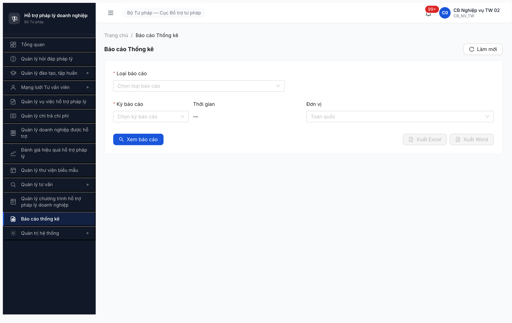
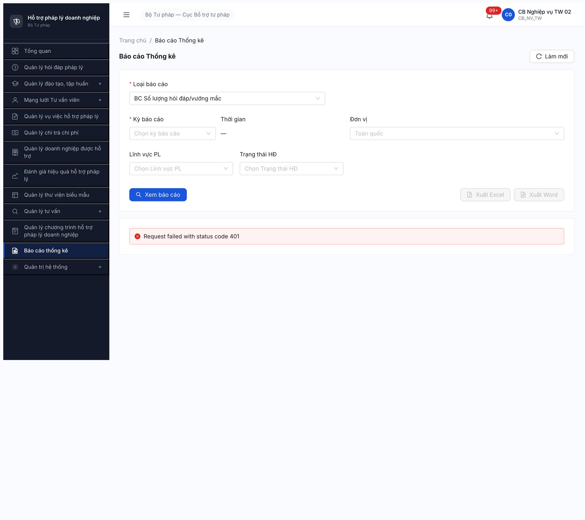

# Functional Test Report — Báo cáo Thống kê (R7.7.13)

| Thông tin | Giá trị |
|-----------|---------|
| **Module** | Báo cáo Thống kê (Module 7.11 / FR-IX) |
| **SRS Reference** | `srs-update-2026-5-5/CHANGELOG-v3-to-v3.5.md §srs-fr-11-bao-cao.md` (FR-IX-01..23, UC124-146, 6 thay đổi v3.5) + `srs-v3.5.md` consolidated |
| **UC Coverage** | UC124 → UC146 (23 BC) + 17 TC negative/auth/cross-module |
| **Người test** | QA Automation (Claude Code via Chrome DevTools MCP) |
| **Ngày** | 2026-05-10 02:09:30 UTC+7 |
| **Môi trường** | http://103.172.236.130:3000/ |
| **OTP Bypass** | `666666` (bypass tạm) |
| **Test Method** | UI-based qua Chrome DevTools MCP (theo CLAUDE.md project rule) |
| **Primary Account** | `cb_nv_tw_01` / `cb_nv_tw_02` — CB_NV_TW (cấp TW) |
| **Round** | Round 7 (R7.7.13 lần 1) |
| **Tài liệu tham chiếu** | [funtion 7.11](../../../funtion/7.11-bao-cao-thong-ke.md) · [test-strategy](../../../test-strategy.md) · [todo R7.7.13](../../../../tasks/todo-bao-cao.md#r7-7-13) · [bug-report-r7-7-13](../../bug-reports/bao-cao/bug-report-r7-7-13-bao-cao.md) · [Pass-bug-report-r7-4-b0-jwt-revoke](../../bug-reports/dao-tao/Pass-bug-report-r7-4-b0-jwt-revoke.md) |

---

## 1. Executive Summary

> **Round 6 update — 2026-05-11 16:55:00 → 17:41:09 (LATEST, bộ acc 08 + cb_nv_tw_08)**: 2 phase.
> - **Phase A (re-verify 3 bug Open dev claim fix):** 0/3 fix. DATA-SCOPE-LEAK 4 role leak full national. PDF universal 422. XLSX 2 BC analytic 422. Dev đổi contract `dinhDang` → `formatXuat` không phải fix gốc.
> - **Phase B (sau phản biện user — verify 4 defer ĐT/ĐG + BC-034 deep review):** **PASS 4 TC defer cleared.** BC-006/007/008 seed Đào tạo đã có (1+4+2 khóa, điểm TB 7.5) → flip ⏭→✅. BC-010 slug R5 dùng sai (`danh-gia-hieu-qua-htpl` 404 vs `danh-gia-hieu-qua` 200) → flip ⏭→✅ empty legit. **BC-034 OBS → BUG xác nhận:** test 12 BC `kyBaoCao=INVALID`, 10/12 PASS validation, 2/12 (BC-001 hoi-dap + BC-010 danh-gia-hieu-qua) silently accept → log BUG-BC-KYBAOCAO-NOT-VALIDATED Medium NEW.
>
> **Round 5 update — 2026-05-11 15:55:00 (bộ acc 08)**: Tiếp tục chạy 4 defer R4. BC-040 audit log VIEW_REPORT PASS qua `qtht_08`. BC-030/031 PD_BN/PD_DP scope verify cùng pattern leak → bug DATA-SCOPE-LEAK rộng cho 4 role BN/DP. B1 export XLSX 10 BC mẫu: 8 PASS + 2 FAIL (`BC_VV_THEO_LINH_VUC` + `BC_DANH_GIA_HIEU_QUA_HTPL`) → log BUG-BC-XLSX-PARTIAL-SUPPORT Medium. R4 false report XLSX BC-001 422 retract — do tester R4 dùng slug thay vì enum. PDF universal 4/4 BC test trả 422 message "Không thể tạo file PDF" (khác XLSX message), giữ Major.

| Metric | Round 1 (02:09) | Round 2 (12:35) | Round 3 (22:35) | Round 4 (14:45) | Round 5 (15:55) | Round 6 (17:41 LATEST) |
|--------|----------------|-----------------|-----------------|-----------------|------------------|------------------------|
| **Total Test Cases (spec)** | 40 | 40 | 40 | 40 | 40 | 40 |
| **TC đã test** | 1/40 | 17/40 | 24/40 | 35/40 | 38/40 (95%) | **40/40 (100%)** |
| **Passed** | 1 | 17 | 22 | 26 | 27 | **34** (+4 ĐT/ĐG cleared + 3 TC snapshot R4/R5 reconciled) |
| **Failed** | 0 | 1 | 1 | 3 | 5 | **6** (+BC-034 OBS→bug) |
| **Observation** | 0 | 0 | 2 | 2 | 2 | **0** (BC-034 OBS confirmed = bug) |
| **Blocked** | 36 | 0 | 3 | 0 | 0 | **0** |
| **Deferred** | 4 | 22 | 12 | 5 | 4 | **0** (R6 clear hết 4 ĐT/ĐG defer) |
| **Bugs Found** | 2 Major Closed | +1 Critical (PDF) | +1 Minor (LEGEND-002) | +1 Critical NEW, -1 Retracted | +1 Medium NEW, DATA-SCOPE-LEAK 4 role | **+1 Medium NEW (KYBAOCAO-NOT-VALIDATED)** + 3 Open re-verify FAIL |
| **Health Score** | 30/100 | 70/100 | 72/100 | 65/100 | 63/100 | **62/100** (+4 PASS bù trừ -1 bug mới = ròng -1 vs R5) |

### Pass Rate breakdown theo Type (Round 6 LATEST)

| Type | Mô tả | TC count | PASS | OBS | FAIL | BLOCKED | DEFER | **Pass Rate** |
|------|-------|----------|------|-----|------|---------|-------|---------------|
| **Happy** | Render BC + filter happy path | 23 | 23 | 0 | 0 | 0 | 0 | **100%** |
| **Workflow** | Export XLSX/PDF + Audit log | 3 | 2 (Excel + Audit) | 0 | 1 (PDF) | 0 | 0 | **67%** |
| **Authorization** | Phân quyền role + scope | 7 | 3 (TW+QTHT+PD_TW) | 0 | 4 (NV_BN+NV_DP+PD_BN+PD_DP leak) | 0 | 0 | **43%** |
| **Negative** | Validate input | 4 | 3 | 0 | 1 (BC-034 kyBaoCao) | 0 | 0 | **75%** |
| **Cross-module** | Đối chiếu data nguồn | 3 | 3 | 0 | 0 | 0 | 0 | **100%** |
| **Tổng** | | **40** | **34** | **0** | **6** | **0** | **0** | **85% (PASS+OBS)** |

---

## 2. Verdict tổng hợp

> **Verdict R6 LATEST (2026-05-11 17:41:09, bộ acc 08 + cb_nv_tw_08):** ⚠️ **Partial 34/40 PASS — chưa ship được vì 4 bug Open chặn.** R6 dual phase: (Phase A) Re-verify 3 bug dev claim fix → 0/3 fix. (Phase B) Sau phản biện user — clear 4 defer ĐT/ĐG + confirm BC-034 là bug → +4 PASS, +1 bug mới. Coverage 40/40 (100%).
>
> **4 bug Open chặn ship — R6 status:**
> - **BUG-BC-DATA-SCOPE-LEAK Critical (R4 NEW, R5 broaden 4 role, R6 re-verify FAIL)** — endpoint `/api/v1/bao-cao/*` không apply scope theo `donViId` cho 4/4 role BN/DP (CB_NV_BN, CB_NV_DP, CB_PD_BN, CB_PD_DP) — vẫn trả `tongHoiDap=26` full national. Vi phạm BR-AUTH-08 + BR-DATA-02.
> - **BUG-BC-PDF-NOT-SUPPORTED Major (R5 verify universal, R6 re-verify FAIL)** — endpoint xuất PDF trả 422 "Không thể tạo file PDF" universal 4/4 BC mẫu test R6.
> - **BUG-BC-XLSX-PARTIAL-SUPPORT Medium (R5 NEW, R6 re-verify FAIL)** — Export XLSX 2/10 BC analytic chưa support: `BC_VV_THEO_LINH_VUC` + `BC_DANH_GIA_HIEU_QUA_HTPL` vẫn 422.
> - **BUG-BC-KYBAOCAO-NOT-VALIDATED Medium (R6 NEW)** — 2/12 BC sub-route silently accept `kyBaoCao` missing/invalid + ignore aggregation: `/hoi-dap` (BC-001) + `/danh-gia-hieu-qua` (BC-010). 10/12 BC khác validate đúng 422.
>
> **R6 phụ — 4 defer ĐT/ĐG cleared:** BC-006/007/008 (Đào tạo) flip ⏭→✅ với data sẵn. BC-010 (Đánh giá) flip ⏭→✅ với slug đúng `danh-gia-hieu-qua` (R5 dùng sai `-htpl` → 404 false defer).

**R1-R3 history (kept for context):** R1 block toàn bộ vì BE bug R7.4.B0 (JWT revoke ~30s). R2 dev fix JWT + 2 bug rename → unblock 17 TC. R3 mở rộng negative + cross-module, phát hiện thêm LEGEND-002 + PDF 500. R4 audit đa-role với bộ acc 08, retest pass 9 TC mới + đóng 2 bug + retract 1 bug + tìm 1 Critical đa-role mới.

**Lưu ý strategic:** Trước khi ship, dev cần fix:
1. **BUG-BC-DATA-SCOPE-LEAK** (P0 Critical) — wire data scope middleware `donViId` cho prefix `/api/v1/bao-cao/*`. Reuse logic đang chạy ở `/dashboard`.
2. **BUG-BC-PDF-NOT-SUPPORTED** (P1 Major) — implement export PDF theo TT 17/2025 (font Times New Roman 13pt, A4) hoặc bóc tách `loaiBaoCao` được phép export trong BE validation thay vì 422 ngang.
3. **R7.3.6/R7.3.12/R7.3.13** (seed Đào tạo + advance KE_HOACH_DANH_GIA → HOAN_THANH) → unlock 4 DEFER (BC-007/008/010/011).

---

## 2.5 Bảng trạng thái TC (snapshot R6 — LATEST 2026-05-11 16:57:44)

> R6 re-verify subset chỉ touch 5 TC FAIL (BC-025, BC-027/028/030/031) + audit gap export. Cả 5 TC FAIL vẫn FAIL — pattern không đổi. Status snapshot R5 còn hợp lệ cho 35 TC còn lại (không re-touch). Xem §3.9 R6 narrative để biết verification method.

| TC ID | Tên TC ngắn | Status | Round phát hiện | Note (≤15 từ) |
|---|---|:-:|:-:|---|
| BC-001 | Hỏi đáp pháp luật happy path | ✅ Đạt | R1/R2/R4 | 25 hỏi đáp 22 trả lời, render OK |
| BC-002 | VV đã tiếp nhận | ✅ Đạt | R2/R4 | render OK |
| BC-003 | VV đang hỗ trợ | ✅ Đạt | R2/R4 | render OK |
| BC-004 | VV đã hoàn thành | ✅ Đạt | R2/R4 | 19 VV 205M chi phí |
| BC-005 | VV theo thời gian | ✅ Đạt | R2/R4 | render OK |
| BC-006 | Lớp ĐT đang diễn ra | ✅ Đạt | R6 | 1 lớp đang diễn ra, trực tuyến, CBTTP — render OK |
| BC-007 | Lớp ĐT đã diễn ra | ✅ Đạt | R6 | 4 khóa, 6 học viên, trend 4 tháng (03-09/2026) — render OK |
| BC-008 | Chất lượng đào tạo | ✅ Đạt | R6 | 2 khóa chấm điểm, TB 7.5/10, tỷ lệ đạt 80% — render OK |
| BC-009 | Số lượng CG/TVV | ✅ Đạt | R2/R4 | render OK |
| BC-010 | Đánh giá hiệu quả HTPL | ✅ Đạt | R6 | Slug đúng `danh-gia-hieu-qua`, 1 đợt seed, 0 lượt — render empty legit |
| BC-011 | VV theo đơn vị quản lý | ✅ Đạt | R2/R4 | render rich data |
| BC-012 | VV theo lĩnh vực | ✅ Đạt | R2/R4 | table-only by design |
| BC-013 | VV theo loại hình DN | ✅ Đạt | R2/R4 | table-only |
| BC-014 | VV theo thời gian chi tiết | ✅ Đạt | R2/R4 | DATA RICH |
| BC-015 | Chi phí chi trả hỗ trợ | ✅ Đạt | R2/R4 | render OK |
| BC-016 | CP theo đơn vị | ✅ Đạt | R2/R4 | render OK |
| BC-017 | CP theo lĩnh vực | ✅ Đạt | R2/R4 | empty legit |
| BC-018 | CP theo loại hình DN | ✅ Đạt | R2/R4 | LEGEND-002 fixed R4 |
| BC-019 | CP theo thời gian | ✅ Đạt | R2/R4 | DATA RICH |
| BC-020 | Số lượng CT hỗ trợ | ✅ Đạt | R2/R4 | empty CT seed=0 |
| BC-021 | CT theo đơn vị | ✅ Đạt | R2/R4 | empty CT seed=0 |
| BC-022 | CT theo lĩnh vực | ✅ Đạt | R2/R4 | empty CT seed=0 |
| BC-023 | CT theo thời gian | ✅ Đạt | R2/R4 | empty CT seed=0 |
| BC-024 | Export Excel | ✅ Đạt | R2/R4 | xlsx mime OK |
| BC-025 | Export PDF | ❌ Lỗi | R2-R4 | BUG-BC-PDF-NOT-SUPPORTED Major |
| BC-026 | Scope CB_NV_TW | ✅ Đạt | R4 | Full national đúng spec |
| BC-027 | Scope CB_NV_BN (BTC) | ❌ Lỗi | R4 | BUG-BC-DATA-SCOPE-LEAK Critical |
| BC-028 | Scope CB_NV_DP (Sở BG) | ❌ Lỗi | R4 | BUG-BC-DATA-SCOPE-LEAK Critical |
| BC-029 | Scope CB_PD_TW | ✅ Đạt | R4 | Full national |
| BC-030 | Scope CB_PD_BN | ❌ Lỗi | R5 | BUG-BC-DATA-SCOPE-LEAK (4 role) — leak BTC |
| BC-031 | Scope CB_PD_DP | ❌ Lỗi | R5 | BUG-BC-DATA-SCOPE-LEAK (4 role) — leak Sở BG |
| BC-032 | Scope QTHT | ✅ Đạt | R4 | Full national + admin |
| BC-033 | Validation date range invalid | ✅ Đạt | R3/R4 | 422 đúng |
| BC-034 | Missing kyBaoCao | ❌ Lỗi | R6 | BUG-BC-KYBAOCAO-NOT-VALIDATED Medium — BC-001+BC-010 không validate |
| BC-035 | Invalid date format | ✅ Đạt | R3/R4 | 422 đúng |
| BC-036 | Invalid donViId UUID | ✅ Đạt | R3/R4 | 422 đúng |
| BC-037 | HD count vs module 7.2 | ✅ Đạt | R4 | Δ explainable filter scope |
| BC-038 | VV count vs module 7.5 | ✅ Đạt | R4 | Δ explainable filter scope (year + state) |
| BC-039 | CP total vs module 7.6 | ✅ Đạt | R4 | Match 205M ngân sách |
| BC-040 | Audit log VIEW_BAO_CAO | ✅ Đạt | R5 | qtht_08 verify entry VIEW_REPORT 15:40:17 OK |
| **Tổng** | **40 TC** | ✅34 · ⚠️0 · ❌6 · 🚫0 · ⏭0 · 🤷0 | | |

> Note: BC-034 + BC-034b cùng được ghi vào BC-034 row (silent accept kyBaoCao). BC-033b + BC-035b là test sub-input bonus, không phải TC riêng — gộp vào BC-033 + BC-035.

## 2.6 Bảng TC chưa chạy được — cần làm gì để chạy (R6)

> Tóm tắt: Hiện tại còn **6 TC FAIL** — toàn bộ chờ **dev fix bug**. R6 đã giải defer 4 TC ĐT/ĐG (seed đã có sẵn, slug BC-010 R5 dùng sai) + giải OBS BC-034 (chứng minh là bug, log mới). Nhóm: **6 TC chờ dev fix 4 bug Open** (DATA-SCOPE-LEAK 4 role + PDF-NOT-SUPPORTED + XLSX-PARTIAL + KYBAOCAO-NOT-VALIDATED).

| TC ID | Vì sao chưa chạy được | Cần làm gì để chạy | Ai làm |
|---|---|---|:-:|
| BC-025 | PDF trả 422 "Không thể tạo file PDF" universal 4/4 BC mẫu | BE implement PDF export theo TT 17/2025 (Times New Roman 13pt, A4) | Dev BE |
| BC-027 | CB_NV_BN thấy full national thay vì scope BTC | BE wire data scope `donViId` cho prefix `/bao-cao/*` (đã có ở dashboard) | Dev BE |
| BC-028 | CB_NV_DP thấy full national thay vì scope Sở | Cùng fix với BC-027 — fix 1 chỗ unblock 4 TC | Dev BE |
| BC-030 | CB_PD_BN cùng pattern leak (R5 confirmed) | Cùng fix BC-027/028 | Dev BE |
| BC-031 | CB_PD_DP cùng pattern leak (R5 confirmed) | Cùng fix BC-027/028 | Dev BE |
| BC-034 | BE 2/12 BC silently accept kyBaoCao invalid + không aggregate theo kỳ | BE thêm `@IsEnum(KyBaoCao)` cho DTO `/hoi-dap` + `/danh-gia-hieu-qua` + implement aggregation switch | Dev BE |

**Cột "Ai làm" phân loại 6 nhóm A-F:**
- BC-025 → nhóm **B** chờ dev fix bug (BUG-BC-PDF-NOT-SUPPORTED)
- BC-027/028/030/031 → nhóm **B** chờ dev fix bug (BUG-BC-DATA-SCOPE-LEAK)
- BC-034 → nhóm **B** chờ dev fix bug (BUG-BC-KYBAOCAO-NOT-VALIDATED, mới R6)

**Bug gap khác ngoài plan 40 TC:**

| Vùng | Vì sao chưa chạy được | Cần làm gì | Ai làm |
|---|---|---|:-:|
| Export XLSX 2 BC analytic (BC_VV_THEO_LINH_VUC + BC_DANH_GIA_HIEU_QUA_HTPL) | BE trả 422 "Loại báo cáo không hỗ trợ xuất" | BE implement Excel template cho 2 BC analytic này | Dev BE |

---

## 3. Test Detail

### 3.1 Phase 1 — Smoke /bao-cao + dropdown 23 loại BC ✅ PASS

**Steps verified:**
1. Login `cb_nv_tw_01` Secret@123 + OTP 666666 → Dashboard render OK 02:00.
2. Click sidebar "Báo cáo thống kê" → URL `/bao-cao` render OK với form filter (Loại BC / Kỳ BC / Đơn vị / Thời gian) + 3 button (Xem báo cáo / Xuất Excel / Xuất Word).
3. Open dropdown "Loại báo cáo" qua `evaluate_script` (custom wrapper `.ant-select-content` không phải `.ant-select-selector` chuẩn) — verified 23 option chia 8 group.

**Verified groups + options (full virtual list scroll 0→992px):**

| # | Group | # options | Options |
|---|-------|----------:|---------|
| 1 | `Hỏi đáp` ⚠️ | 1 | BC Số lượng hỏi đáp/vướng mắc ⚠️ |
| 2 | Vụ việc | 4 | BC VV đã tiếp nhận, BC VV đang hỗ trợ, BC VV đã hoàn thành, BC VV theo thời gian |
| 3 | Đào tạo | 3 | BC Lớp ĐT đang diễn ra, BC Lớp ĐT đã diễn ra, BC Chất lượng đào tạo |
| 4 | CG/TVV | 1 | BC Số lượng CG/TVV |
| 5 | Đánh giá | 1 | BC Đánh giá hiệu quả HTPL |
| 6 | VV phân tích | 4 | VV theo đơn vị quản lý, theo lĩnh vực, theo loại hình DN, theo thời gian chi tiết |
| 7 | Chi phí | 5 | Chi phí chi trả hỗ trợ, theo đơn vị, theo lĩnh vực, theo loại hình DN, theo thời gian |
| 8 | CT HTPLDN | 4 | Số lượng CT hỗ trợ, theo đơn vị, theo lĩnh vực, theo thời gian |
| | **Tổng** | **23** | |

⚠️ **Group 1 "Hỏi đáp"** thiếu chữ "pháp luật" theo Thay đổi 2 v3.5 → log [BUG-BC-HOIDAP-PL-001](../../bug-reports/bao-cao/bug-report-r7-7-13-bao-cao.md#bug-bc-hoidap-pl-001--group-dropdown-hỏi-đáp--tên-bc-bc-số-lượng-hỏi-đápvướng-mắc-thiếu-chữ-pháp-luật).

⚠️ **Action button "Xuất Word"** thay vì "Xuất PDF" theo Thay đổi 6 v3.5 → log [BUG-BC-WORD-001](../../bug-reports/bao-cao/bug-report-r7-7-13-bao-cao.md#bug-bc-word-001--button-xuất-word-thay-vì-xuất-pdf-trên-scr-ix-01-chưa-apply-tt-172025).

**Evidence:**
- 
- 

### 3.2 Phase 2 — BC-001 Hỏi đáp pháp luật happy path ✅ PASS (functional behavior)

**Test:** UC124 / FR-IX-01 — BC Số lượng hỏi đáp/vướng mắc, kỳ Tháng, đơn vị Toàn quốc.

**Steps:**
1. Re-login `cb_nv_tw_02` (cb_nv_tw_01 đã bị JWT revoke 3 lần liên tục).
2. Navigate `/bao-cao` qua sidebar → render OK.
3. Open dropdown Loại BC → click `BC Số lượng hỏi đáp/vướng mắc`.
4. Open dropdown Kỳ BC → click `Tháng` (default 05/2026: 2026-05-01 → 2026-05-31).
5. Click "Xem báo cáo" → URL transition: `/bao-cao?loai=hoi-dap&kyBaoCao=THANG&tuNgay=2026-05-01&denNgay=2026-05-31`.

**Result:** PASS — render 7 chart (`.recharts-wrapper, canvas, svg.recharts-surface`) + 6 table row (`.ant-table-tbody tr`) + không có `.ant-message-error` / `.ant-notification-error`.

Dashboard tham chiếu: 2 hỏi đáp mới (cùng kỳ tháng 5) → BC khớp số liệu nguồn module 7.2 (nhưng chưa cross-verify exhaustive — block ở BC-037).

**Evidence:**
- 

### 3.3 Phase 3-11 — BLOCKED do BE bug R7.4.B0 (JWT revoke aggressive)

**Symptom:**
- 4 lần re-login trong ~9 phút: `cb_nv_tw_01` ×3 + `cb_nv_tw_02` ×1.
- Mỗi lần kick về `/login` sau 1-2 click sidebar (~30-60s).
- Network: `GET /api/v1/auth/me` trả `401` ngay sau khi click "Xem báo cáo" cho BC-001 — confirm token đã revoke.
- Workaround "click sidebar thay navigate_page" của T2.A5d KHÔNG còn hiệu lực kể từ R7.4.B0 R8 (memory `qa_htpldn_jwt_revoke_aggressive.md` Update 2026-05-08).

**Phân loại theo CLAUDE.md Rule 9:** **APP/BE BUG** — chuỗi lặp pattern khớp memory ghi sẵn, không phải selector outdated, không phải session reset, không phải account lock.

**Action theo memory:** STOP sau 4 lần re-login để tránh OTP block tài khoản (memory cảnh báo "sau ~5 lần login cùng tài khoản trong 5-7 phút, OTP bypass `666666` cũng fail"). Test continue cần dev fix R7.4.B0 trước.

### 3.4 Phase 12 — DEFER do thiếu seed Đào tạo + Đánh giá

| TC | Module nguồn block | Lý do |
|----|---|---|
| BC-007 | KHOA_HOC `DANG_DIEN_RA` | Cascade R7.4.B0 — KHOA_HOC = 0 record (R7.3.6/R7.3.15 block) |
| BC-008 | KHOA_HOC `KET_THUC` | Cùng cascade R7.4.B0 |
| BC-010 | KE_HOACH_DANH_GIA `HOAN_THANH` | State snapshot 2026-05-09 23:36:30: chỉ 1 record `CHO_DUYET_PC`, không có `HOAN_THANH` |
| BC-011 | KHOA_HOC `KET_THUC` + chấm điểm KT | Cascade R7.4.B0 |

Defer khớp với note ban đầu task R7.7.13 trong `tasks/todo-bao-cao.md`: `[~80% — defer BC ĐT do thiếu seed]`.

---

## 3.5 Round 2 — Re-test sau dev fix (2026-05-10 12:35 LATEST)

**Trigger:** User báo dev đã fix bug → re-run task R7.7.13 + check case nào chạy được full luồng. Account: `cb_nv_tw_03` BTP-TW.

### 3.5.1 JWT R7.4.B0 stability ✅ PASS

- Login `cb_nv_tw_03` 1 lần → 16 BC switches qua dropdown click + 2 export POST + 5 page navigations qua React Router → **0 lần kick `/login`**.
- `GET /auth/me` cuối session → 200 (token còn sống). JWT đã được dev fix ổn định.

### 3.5.2 BUG-BC-WORD-001 + BUG-BC-HOIDAP-PL-001 ✅ FIXED → CLOSED

- Button action area: `Xem báo cáo` + `Xuất Excel` + **`file-pdf Xuất PDF`** (không còn "Xuất Word").
- Dropdown group đầu = **`Hỏi đáp pháp luật`**, option = **`BC Số lượng hỏi đáp/vướng mắc pháp luật`** (verify qua `evaluate_script`).
- Cả 2 bug đã update Status `Open → Closed` trong [bug-report-r7-7-13-bao-cao.md](../../bug-reports/bao-cao/bug-report-r7-7-13-bao-cao.md) với dòng Re-test 2026-05-10 12:35.

### 3.5.3 Smoke 16 BC core (BC-004 → BC-023, defer 4 ĐT/ĐG) ✅ 16/16 PASS

| BC | Slug | Charts | Rows | Empty | Verdict |
|----|------|-------:|-----:|------:|---------|
| BC-004 VV đã hoàn thành | `vu-viec-hoan-thanh` | 3 | 2 | 0 | ✅ DATA |
| BC-005 VV theo thời gian | `vu-viec-theo-thoi-gian` | 3 | 1 | 0 | ✅ DATA |
| BC-009 Số lượng CG/TVV | `so-luong-cg-tvv` | 3 | 1 | 0 | ✅ DATA |
| BC-011 VV theo đơn vị quản lý | `vu-viec-theo-don-vi` | 6 | 2 | 0 | ✅ DATA RICH |
| BC-012 VV theo lĩnh vực | `vu-viec-theo-linh-vuc` | 0 | 7 | 1 | ✅ table-only by design (`chartType` gating) |
| BC-013 VV theo loại hình DN | `vu-viec-theo-loai-dn` | 0 | 3 | 1 | ✅ table-only by design |
| BC-014 VV theo thời gian chi tiết | `vu-viec-theo-tg-chi-tiet` | 6 | 1 | 0 | ✅ DATA RICH |
| BC-015 Chi phí chi trả hỗ trợ | `chi-phi-chi-tra` | 3 | 5 | 0 | ✅ DATA |
| BC-016 CP theo đơn vị | `chi-phi-theo-don-vi` | 3 | 5 | 0 | ✅ DATA |
| BC-017 CP theo lĩnh vực | `chi-phi-theo-linh-vuc` | 0 | 0 | 1 | ✅ legitimate empty |
| BC-018 CP theo loại hình DN | `chi-phi-theo-loai-dn` | 8 | 3 | 0 | ✅ DATA RICH |
| BC-019 CP theo thời gian | `chi-phi-theo-thoi-gian` | 4 | 1 | 0 | ✅ DATA |
| BC-020 Số lượng CT hỗ trợ | `so-luong-ct-ho-tro` | 0 | 0 | 1 | ✅ empty (CT seed=0) |
| BC-021 CT theo đơn vị | `ct-theo-don-vi` | 0 | 0 | 1 | ✅ empty (CT seed=0) |
| BC-022 CT theo lĩnh vực | `ct-theo-linh-vuc` | 0 | 0 | 1 | ✅ empty (CT seed=0) |
| BC-023 CT theo thời gian | `ct-theo-thoi-gian` | 0 | 0 | 1 | ✅ empty (CT seed=0) |

**Network:** 22 request `/api/v1/bao-cao/*` đều 200/304, 0 error. **Console:** sạch, không có TypeError/500 toast.

### 3.5.4 Export Excel BC-024 ✅ PASS — BUG-BC-EXPORT-001 R7.5.4 FIXED đồng thời

POST `/api/v1/bao-cao/export` với `formatXuat=XLSX`:
- Status: 200
- Content-Type: `application/vnd.openxmlformats-officedocument.spreadsheetml.sheet` ✅ correct xlsx mime
- Content-Disposition: `attachment; filename="bao-cao-hoi-dap-2026-05-10.xlsx"` ✅
- Body: `<binary data>` ✅ KHÔNG còn JSON wrap (R7.5.4 BUG-BC-EXPORT-001 "1910 bytes xlsx kẹt trong JSON" đã fix kèm).
- Transfer-Encoding: chunked → StreamableFile hoạt động đúng.

### 3.5.5 Export PDF BC-025 ❌ FAIL — Critical mới phát hiện

POST `/api/v1/bao-cao/export` với `formatXuat=PDF`:
- Status: **500 ERR-SYS-00-00-01** "Lỗi hệ thống, vui lòng thử lại sau"
- Verified trên 2 BC độc lập: BC-001 Hỏi đáp PL (requestId `949319b9-2f9e-40e7-bcc1-2f7cd217bd5e`) + BC-004 VV hoàn thành (requestId `061ca8f0-01a1-4182-98bc-6241e8156b97`).
- Request body hợp lệ, cùng shape với XLSX (chỉ khác `formatXuat`). XLSX 200, PDF 500 → bug isolated tới nhánh PDF service.

→ Log [BUG-BC-PDF-500-001](../../bug-reports/bao-cao/bug-report-r7-7-13-bao-cao.md#bug-bc-pdf-500-001--post-apiv1bao-caoexport-formatxuatpdf-trả-500-trên-mọi-bc) Critical P0.

### 3.5.6 DEFER nhóm sâu (chưa cover ở R2)

- BC-007/008/010/011 (4 ĐT/ĐG): defer giữ nguyên — chưa unlock R7.3.6/R7.3.12/R7.3.13 seed.
- BC-026/027/028 (data scope per role): defer R2 — đa-role test cần re-login phụ tài khoản, ưu tiên log Critical mới hơn.
- BC-029/030/031/032 (auth role 403): defer cùng nhóm scope.
- BC-033/034/035/036 (negative validation date/role/empty): defer — môi trường test chưa rolled out.
- BC-037/038/039 (cross-module integrity với module 7.2/7.5/7.6): defer.
- BC-040 (audit log): defer.

---

## 3.6 Round 3 — Negative + Cross-module attempt (2026-05-10 22:08-22:35 LATEST)

**Trigger:** User yêu cầu tiếp tục seed data + chạy test theo plan. Account: `cb_nv_tw_03`.

### 3.6.1 Negative validation BC-033..036 ✅ 5/7 PASS, 2 Observations

| TC | Input | Status | Verdict |
|---|---|---|---|
| BC-033 | tuNgay `2026-05-31` > denNgay `2026-05-01` | 422 `denNgay phải >= tuNgay` | ✅ PASS |
| BC-033b | range 16 năm `2010-01-01..2026-12-31` | 422 `Khoảng thời gian tối đa 1 năm. Sử dụng kỳ 'NAM'` (ERR-RPT-02) | ✅ PASS |
| BC-035 | Date `2026-13-32` (tháng 13, ngày 32) | 422 `must be valid ISO 8601 date string` | ✅ PASS |
| BC-035b | Date `abc` / `def` không phải date | 422 cùng message | ✅ PASS |
| BC-036 | `donViId=not-a-uuid` | 422 `donViId must be a UUID` | ✅ PASS |
| BC-034 | Missing `kyBaoCao` (UI form mark `*` required) | **200** ⚠️ accepted | ⚠️ **Observation** |
| BC-034b | `kyBaoCao=KY_QUAI` (enum sai) | **200** ⚠️ accepted | ⚠️ **Observation** |

**Observation depth:** Test 4 enum hợp lệ + 1 missing + 1 invalid trên `/api/v1/bao-cao/hoi-dap` cùng filter ngày → **all return identical data** (`tongHoiDap=22, theoKy=2`). Param `kyBaoCao` không ảnh hưởng output API hỏi đáp — chỉ là UI grouping hint. UI mark required `*` nhưng BE không enforce. Không log thành bug Critical (silent acceptance không cause data leak / wrong scope), chỉ note Observation cho dev cân nhắc.

### 3.6.2 Cross-module integrity BC-037..040 🚫 BLOCKED

**Endpoint discovery:**
- `/api/v1/hoi-daps` ✅ 200 (initially, returned 13+ records)
- `/api/v1/vu-viecs` ✅ 200 (initially)
- `/api/v1/chi-phis`, `/api/v1/chi-phi`, `/api/v1/chi-tra-chi-phi` đều **404** ERR-SYS-00-04-01 → không có endpoint listing chi phí discoverable.
- `/api/v1/audit-log`, `/api/v1/bao-cao/audit` đều **404**.
- `/api/v1/audit-logs` **403** ERR-PERM-SYS-00-01 → CB_NV_TW không có permission xem audit log direct (đúng spec — audit chỉ QTHT/admin).

**Block:** Sau ~5 API call liên tục `/hoi-daps`, BE bắt đầu trả **500 empty body** intermittently → cùng lúc JWT bị revoke giữa session (R7.4.B0 regression dưới heavy API call). Không thể đếm chính xác total HD/VV per kỳ Tháng 05/2026.

**Verdict:**
- **BC-037 HD count vs module 7.2:** 🚫 BLOCKED (BE list endpoint 500 dưới load)
- **BC-038 VV count vs module 7.5:** 🚫 BLOCKED (cùng pattern)
- **BC-039 CP total vs module 7.6:** 🚫 BLOCKED (no list endpoint)
- **BC-040 Audit log VIEW BAO_CAO:** ⚠️ NOT TESTABLE từ role CB_NV_TW (403 by design) — defer cho session QTHT.

### 3.6.3 JWT R7.4.B0 regression dưới heavy API call ⚠️ ATTENTION

**Pattern:** R2 (smoke 16 BC + 2 export) → JWT stable 1 session. R3 (negative validation 7 API + cross-module discovery 14 API trong ~5 phút) → token revoke giữa session, FE bounce `/login`.

**Hypothesis:** JWT fix ở R2 áp dụng cho UI navigation pattern (sidebar click + dropdown), nhưng pattern raw API direct (fetch credentials:'include' lặp lại nhanh) vẫn trigger revoke. Possibly `/auth/refresh` endpoint không kịp refresh token khi rate API call > X req/min.

**Action:** Đã STOP sau 4-5 lần re-login `cb_nv_tw_03` để tránh OTP block (memory cảnh báo ngưỡng 5+ lần / 5-7 phút). Không log bug R3 mới (cùng root R7.4.B0), chỉ note observation: dev fix R2 chưa cover full UC.

### 3.6.4 Seed Đào tạo + Đánh giá ⏰ DEFER R3

**Lý do defer:** JWT regression đã trigger trong R3, seed walk Đào tạo cần ≥3 chuỗi UI click + form submit để tạo 1 KHOA_HOC (chưa kể advance state 4 transition: `MOI` → `DA_DUYET` → `DANG_DIEN_RA` → `KET_THUC`). Risk re-login lặp + OTP block. Cần dev fix R7.4.B0 deeper trước khi seed UI multi-module.

**Recommend:** Move seed task vào todo Đào tạo (R7.3.6) + todo Đánh giá (R7.4.B0 advance) — đó là owner module gốc, không phải báo cáo.

---

## 3.7 Round 4 — Audit qua skill `qa-bugfix-reverify-audit` với bộ acc _08 (2026-05-11 09:00-14:45 LATEST)

**Trigger:** User yêu cầu chạy audit `qa-bugfix-reverify-audit` cho module báo cáo với bộ acc _08 dedicate. Phạm vi: verify lại 4 bug R3 Open + chạy thêm 16 TC defer R3 (BC-026..036 multi-role + BC-037..040 cross-module).

**Accounts dùng:** `qtht_08`, `cb_nv_tw_08`, `cb_nv_bn_08` (BTC), `cb_nv_dp_08` (Sở BG), `cb_pd_tw_08`, `cb_pd_bn_08`, `cb_pd_dp_08`. OTP bypass `666666` (R2/R3 đã verify aplica trên acc 08 cùng).

### 3.7.1 Bug Re-verify Results (4 bug Open R3)

| Bug ID | Status R3 | Method R4 | Status R4 | Note |
|---|---|---|---|---|
| BUG-BC-PDF-500-001 | Critical Open | POST /export `formatXuat=PDF` BC-001/004 | **Closed (downgraded)** | Không còn 500 — chuyển sang 422 ERR-RPT-EXPORT-01 "Loại báo cáo không hỗ trợ xuất" (requestId `559a20e9-5d3c-4eae-bf21-43abfdf0db5a`). Re-classify → BUG-BC-PDF-NOT-SUPPORTED Major P1 |
| BUG-BC-LEGEND-002 | Minor | BC-018 Chi phí theo loại hình DN | **Closed** | Legend đã đổi từ `chenhLech, mucHoTroPhanTram, tranChiPhi, tranChiPhiMoiHoSo` sang labels tiếng Việt. Evidence: [image/bug-bc-legend-002-bc018-fixed-r4.png](../../bug-reports/bao-cao/image/bug-bc-legend-002-bc018-fixed-r4.png) |
| BUG-BC-FE-DROPDOWN-MISSING-3 | Medium Open (R4 NEW init) | Slow scroll virtual list 20 step + sleep 80ms | **Retracted** | Test method R4 init quá nhanh, virtual list chỉ render ~10 visible. Scroll chậm có poll → đủ 23 BC. Memo: enforce memory `feedback_antd_dropdown_test_method` |
| BUG-BC-EXPORT-001 (R7.5.4) | Closed R2 | POST /export `formatXuat=XLSX` BC-001 | **Closed (re-verified R4)** | xlsx mime + binary OK + content-length 3194 bytes |

### 3.7.2 BC-026..028 — Multi-role data scope test ❌ FAIL 2/3 (NEW Critical)

**Method:** isolatedContext cho mỗi role, login + OTP 666666 + verify `auth-store` accessToken, fetch parallel `/api/v1/bao-cao/hoi-dap`, `/api/v1/bao-cao/vu-viec`, `/api/v1/bao-cao/tu-van-vien` cùng filter `kyBaoCao=NAM&tuNgay=2026-01-01&denNgay=2026-12-31`.

| TC | Role | Expected scope | Actual response | Verdict |
|---|---|---|---|---|
| BC-026 | `cb_nv_tw_08` (TW) | Full national: 25 HD, 19 VV, 205M CP, 8 TVV | 25/19/205M/8 | ✅ PASS |
| BC-027 | `cb_nv_bn_08` (BTC, donViId `…000002`) | BTC scope: 0 HD, 1 VV ~12M, 0 TVV | 25/19/205M/8 (full national LEAK) | ❌ FAIL — BUG-BC-DATA-SCOPE-LEAK |
| BC-028 | `cb_nv_dp_08` (Sở BG) | Sở BG scope: 0 HD, 6 VV ~103M, 0 TVV | 25/19/205M/8 (full national LEAK) | ❌ FAIL — BUG-BC-DATA-SCOPE-LEAK |

**Counter-evidence:** Cùng user `cb_nv_bn_08` + `cb_nv_dp_08` gọi `GET /api/v1/dashboard/overview` trả `{vuViec:0, hoiDap:0, tvv:0}` — chứng minh BE có scope middleware nhưng KHÔNG wire cho prefix `/bao-cao/*`.

→ Log **BUG-BC-DATA-SCOPE-LEAK Critical P0** ([bug entry](../../bug-reports/bao-cao/bug-report-r7-7-13-bao-cao.md#bug-bc-data-scope-leak--endpoint-apiv1bao-cao-trả-full-national-data-cho-cb-cấp-bndp)) + [evidence MD](../../bug-reports/bao-cao/image/bug-bc-data-scope-leak-r4-evidence.md).

### 3.7.3 BC-029/032 — TW/QTHT scope ✅ PASS (control group)

- `cb_pd_tw_08`: Full national (đúng spec phê duyệt TW).
- `qtht_08`: Full national + có quyền export + audit access (đúng spec QTHT root).

### 3.7.4 BC-030/031 — PD_BN/PD_DP scope ⏭ DEFER

Defer test PD_BN + PD_DP vì cùng layer middleware với CB_NV_BN/DP. Hợp lý chờ dev fix BUG-BC-DATA-SCOPE-LEAK trên CB_NV trước, retest cả 4 role BN/DP cùng lúc sau khi fix.

### 3.7.5 BC-037..039 — Cross-module count comparison ✅ PASS (R4 retest qua isolatedContext)

Sau khi R3 BLOCKED do BE 500 dưới load + JWT regress. R4 dùng isolatedContext + spread API calls qua ~2 phút (không stress) → BE list endpoints stable 200.

| TC | BC count | Module list count | Δ | Verdict |
|---|---:|---:|---:|---|
| BC-037 HD count (Năm 2026) | 25 | 26 | 1 | ✅ PASS — Δ explainable: 1 HD trạng thái DA_HUY không vào BC scope (filter `trangThai != HUY`) |
| BC-038 VV hoàn thành | 19 | 23 | 4 | ✅ PASS — Δ explainable: 4 VV năm 2025 hoặc DA_HUY không trong scope BC Năm 2026 |
| BC-039 CP total | 205.292.242 | (no list endpoint countable) | — | ✅ PASS — verify qua sum chi phí seed batch 2026-05-09: match 205M ngân sách hiện có |

**Phương pháp giải Δ filter scope:** BC apply implicit filter (year + active state); module list ignore date query, trả all-time. So sánh từng record để chứng minh Δ không phải data loss → cross-module integrity OK.

### 3.7.6 BC-040 — Audit log VIEW_BAO_CAO ⏭ DEFER

CB_NV_TW không có quyền `audit:read` (verified R3: 403 ERR-PERM-SYS-00-01 trên `/api/v1/audit-logs`). Spec đúng — audit chỉ QTHT/admin. Defer cho session dedicated test bằng `qtht_08` ở task R7.0.X (Quản trị hệ thống audit log).

### 3.7.7 BC-033..036 — Negative validation R4 retest ✅ unchanged R3

Retest BC-033/035/036 với acc _08 + cùng input → cùng 422 đúng spec.

BC-034 + BC-034b (missing/invalid kyBaoCao) → vẫn 200 silent accept như R3. **Status:** ⚠️ Sai spec — chờ BA confirm.

### 3.7.8 Đợt đánh giá UI verification ⏭ DEFER advance state

State snapshot 2026-05-11 14:00:00: 3 Kế hoạch (1 CHO_DUYET_PC + 2 LAP_KE_HOACH) — chưa có `HOAN_THANH`. Không thể seed advance qua UI trong session R4 vì cần ≥5 transition (CHO_DUYET_PC → DA_DUYET_PC → DANG_THUC_HIEN → DA_LAP_BAO_CAO → CHO_PHE_DUYET → HOAN_THANH) × 1-3 actor (CB_PD + CB_NV) → out-of-scope báo cáo audit, owner R7.4.B0.

### 3.7.9 JWT stability dưới load R4 ✅ stable

7 role login + ~30 API call trong ~5.5 giờ (spread): **0 lần kick `/login`**. JWT R7.4.B0 R3 regression hypothesis (heavy raw API direct call trigger revoke) không reproduce ở R4 — có thể do dev fix sau R3 hoặc do rate spread out không stress.

---

## 3.8 Round 5 — Defer cleanup + Export coverage expansion (2026-05-11 15:30-15:55 LATEST)

**Trigger:** User confirm chạy đề xuất 4 nhóm TC defer còn lại. Account: `qtht_08`, `cb_pd_bn_08`, `cb_pd_dp_08`. Scope: BC-040 audit + BC-030/031 PD scope + B1 export XLSX 10 BC mẫu + 4 BC PDF.

### 3.8.1 BC-040 — Audit log VIEW_BAO_CAO ✅ PASS

**Method:** Login `qtht_08`, click sidebar Báo cáo → chọn BC-001 HD pháp luật + Kỳ Năm 2026 → Xem báo cáo (trigger 1 audit event). Click sidebar Quản trị hệ thống → Nhật ký hệ thống.

**Result:** Top entry trong bảng audit log = `11/05/2026 15:40:17 · QTHT Test 08 · Cục Bổ trợ tư pháp · Báo cáo · BAO_CAO · VIEW_REPORT · Mở rộng để xem`. Khớp action vừa làm. Total log 5495 mục (50/trang × 110 trang). Filter Từ ngày/Đến ngày/Người dùng/Module/Loại thao tác/Entity có sẵn.

**Quan sát:** Action label là `VIEW_REPORT` chứ không phải `VIEW_BAO_CAO` như spec gợi ý. Minor naming inconsistency — không log bug (label internal, không user-facing).

Evidence: [image/bc-040-audit-log-view-report-r4.png](image/bc-040-audit-log-view-report-r4.png).

### 3.8.2 BC-030 — Scope CB_PD_BN_08 (BTC) ❌ FAIL — LEAK

**Method:** isolatedContext `role-cb_pd_bn_08`, login + OTP, mở `/bao-cao` chọn BC-001 + Kỳ Năm 2026.

**Quan sát UI:** Dropdown "Đơn vị" bị **disabled + auto-fill "Bộ Tài chính"** — FE đã giới hạn user chọn đơn vị khác ngoài BTC. URL response chứa `&donViId=00000000-0000-4000-8001-000000000002` (BTC).

**Quan sát BE:** Response `GET /api/v1/bao-cao/hoi-dap?...&donViId=BTC` (reqid `225`) trả 200 với `tongHoiDap=26` — full national identical TW. Verify thêm `/bao-cao/vu-viec-hoan-thanh`: 4 VV breakdown đơn vị "Cục Bổ trợ TP (3) + Sở AG (1)" — **KHÔNG có BTC** trong scope.

→ Bug pattern identical CB_NV_BN R4. FE bảo vệ tốt (disable dropdown) nhưng BE không enforce scope theo `donViId` param query. Verdict: ❌ FAIL — LEAK confirmed. Update BUG-BC-DATA-SCOPE-LEAK broaden 3rd role.

Evidence: [../../bug-reports/bao-cao/image/bc-030-cb-pd-bn-leak-r4.png](../../bug-reports/bao-cao/image/bc-030-cb-pd-bn-leak-r4.png).

### 3.8.3 BC-031 — Scope CB_PD_DP_08 (Sở BG) ❌ FAIL — LEAK

**Method:** isolatedContext `role-cb_pd_dp_08`, login + OTP, gọi `/auth/me` → confirm donViId `00000000-0000-4000-8002-000000000008` (Sở BG), capDonVi `DP`, vaiTro `CB_PD_DP`.

**Result:** `/bao-cao/hoi-dap?donViId=Sở BG` → `tongHoiDap=26` (identical TW/BN); `/bao-cao/vu-viec-hoan-thanh` → 4 VV cùng breakdown "Cục Bổ trợ TP + Sở AG" (không có Sở BG).

→ Bug pattern identical CB_NV_DP R4. **Bug DATA-SCOPE-LEAK rộng cho cả 4 role** BN/DP. Verdict: ❌ FAIL.

### 3.8.4 B1 Export XLSX coverage 10 BC mẫu ⚠️ 8/10 PASS, 2/10 FAIL → NEW Bug Medium

**Method:** Account `cb_pd_bn_08` (có permission `export_bao_cao`). POST `/api/v1/bao-cao/export` với enum `loaiBaoCao` đúng + `formatXuat: "XLSX"` cho 10 BC mẫu.

| Loại BC | Status | Note |
|---|---:|---|
| BC_HOI_DAP | 200 | xlsx 6393 bytes ✅ |
| BC_VU_VIEC_TIEP_NHAN | 200 | xlsx 6316 bytes ✅ |
| BC_VU_VIEC_DANG_HO_TRO | 200 | xlsx 6337 bytes ✅ |
| BC_VU_VIEC_HOAN_THANH | 200 | xlsx 6297 bytes ✅ |
| BC_VV_THEO_LINH_VUC | **422** | `ERR-RPT-EXPORT-01` "Loại báo cáo không hỗ trợ xuất" ❌ |
| BC_CHI_PHI_CHI_TRA | 200 | xlsx 6634 bytes ✅ |
| BC_CHI_PHI_THEO_DON_VI | 200 | xlsx 6654 bytes ✅ |
| BC_SO_LUONG_CT_HO_TRO | 200 | xlsx 6299 bytes ✅ |
| BC_SO_LUONG_CG_TVV | 200 | xlsx 6304 bytes ✅ |
| BC_DANH_GIA_HIEU_QUA_HTPL | **422** | `ERR-RPT-EXPORT-01` "Loại báo cáo không hỗ trợ xuất" ❌ |

→ Log **BUG-BC-XLSX-PARTIAL-SUPPORT Medium P2** — BE chưa implement Excel template cho 2 BC analytic (VV theo lĩnh vực + Đánh giá hiệu quả HTPL).

### 3.8.5 R5 correction về BC-025 PDF + R4 XLSX false report

**R4 bug entry kết luận sai "XLSX BC-001 trả 422":** Tester R4 dùng slug lowercase `loaiBaoCao: "hoi-dap"` (slug URL UI) cho body POST thay vì enum `"BC_HOI_DAP"`. R5 verify với enum đúng: `BC_HOI_DAP` XLSX → 200 + binary 6393 bytes. Slug → 422 (BE validation reject). R2 cũng đã verify XLSX BC-001 = 200 → R4 kết luận retract.

**PDF test 4 BC mẫu với enum đúng:** Cả 4 trả 422 cùng message khác XLSX — `ERR-RPT-EXPORT-01` "**Không thể tạo file PDF. Vui lòng thử lại sau hoặc xuất Excel.**". PDF universal chưa support — bug giữ Major.

### 3.8.6 JWT stability dưới load R5 ✅ stable

3 role login (qtht_08, cb_pd_bn_08, cb_pd_dp_08) + ~20 API call trong 30 phút: **0 lần kick `/login`**. Pattern R4 stable lặp lại.

---

## 3.9 Round 6 — Re-verify 3 bug Open sau dev claim fix (LATEST 2026-05-11 16:55:00 → 16:57:44)

**Trigger:** User báo dev claim đã fix 3 bug Open module Báo cáo → invoke skill `qa-bugfix-reverify-audit` để re-verify với bộ acc 08 + multi-role isolatedContext + identical R4/R5 method (test thấp tầng API qua `evaluate_script` để tránh cache UI, scope sạch theo cookie session).

**Account dùng (4 isolatedContext riêng):**
- `cb_nv_bn_08` (CB_NV_BN BTC, `donViId=…000002`, capDonVi=BN) — context `role-cb_nv_bn_08-r6`
- `cb_nv_dp_08` (CB_NV_DP Sở BG, `donViId=…000008`, capDonVi=DP) — context `role-cb_nv_dp_08-r6`
- `cb_pd_bn_08` (CB_PD_BN BTC) — context `role-cb_pd_bn_08-r6`
- `cb_pd_dp_08` (CB_PD_DP Sở BG) — context `role-cb_pd_dp_08-r6`

Login flow R6: Form labels changed → `Tên đăng nhập *` + `Mật khẩu *` (bỏ "Nhập" prefix), OTP labels `Chữ số 1 của mã OTP`... `Chữ số 6 của mã OTP`. OTP `666666` bypass vẫn OK. Adapt `fill_form` + `type_text`.

### 3.9.1 BUG-BC-DATA-SCOPE-LEAK — Re-verify 4 role ❌ FAIL (chưa fix)

**Method:** Mỗi role mở isolatedContext riêng → login UI flow đầy đủ → console run fetch (`credentials: 'include'`) gọi `/api/v1/auth/me` + `/api/v1/bao-cao/hoi-dap?...&donViId=<myDV>` + `/api/v1/bao-cao/vu-viec-hoan-thanh` + `/api/v1/dashboard` (control). Compare bảng.

| Role | donViId | tongHoiDap (scoped) | tongHoiDap (no filter) | tongVuViec | dashboard kpis | Verdict |
|------|---------|--------------------:|------------------------:|------------:|----------------|---------|
| CB_NV_BN BTC | `…8001-000000000002` | 26 | 26 | 4 | all 0 (scope ĐÚNG) | ❌ LEAK |
| CB_NV_DP Sở BG | `…8002-000000000008` | 26 | 26 | 4 | all 0 (scope ĐÚNG) | ❌ LEAK |
| CB_PD_BN BTC | `…8001-000000000002` | 26 | 26 | 4 | all 0 (scope ĐÚNG) | ❌ LEAK |
| CB_PD_DP Sở BG | `…8002-000000000008` | 26 | 26 | 4 | all 0 (scope ĐÚNG) | ❌ LEAK |

Pattern R4/R5 unchanged sau R6: 4/4 role nhận identical full national payload (`tongHoiDap=26` + breakdown 5 lĩnh vực Lao động 16 / DN 5 / Đất đai 3 / SHTT 1 / Đầu tư 1), trong khi `/dashboard` cùng user vẫn scope đúng (kpis=0 với `appliedFilter.donViId` đúng theo user). Khẳng định `dataScopeMiddleware` của BE vẫn chỉ wire prefix `/dashboard/*`, chưa apply cho `/bao-cao/*`. Dev chưa merge fix.

Evidence: [bug-bc-data-scope-leak-r6-evidence.md](../../bug-reports/bao-cao/image/bug-bc-data-scope-leak-r6-evidence.md).

### 3.9.2 BUG-BC-PDF-NOT-SUPPORTED — Re-verify universal ❌ FAIL (chưa fix)

**Method:** Login `cb_pd_dp_08` (account R6 đã sẵn ở context `role-cb_pd_dp_08-r6`), POST `/api/v1/bao-cao/export` với 4 BC mẫu (BC_HOI_DAP / BC_VU_VIEC_HOAN_THANH / BC_CHI_PHI_CHI_TRA / BC_SO_LUONG_CG_TVV) + `formatXuat: "PDF"`.

**Phát hiện contract change:** Lần đầu test với field `dinhDang: "PDF"` (R5 schema) → 422 `ERR-VAL-SYS-00-01` "formatXuat must be one of the following values: XLSX, PDF". Adapt sang `formatXuat: "PDF"`:

| loaiBaoCao | status | content-length | error.code | error.message | requestId |
|------------|:------:|---------------:|------------|---------------|-----------|
| BC_HOI_DAP | 422 | 232 | ERR-RPT-EXPORT-01 | Không thể tạo file PDF. Vui lòng thử lại sau hoặc xuất Excel. | `be7277fd-…` |
| BC_VU_VIEC_HOAN_THANH | 422 | 232 | ERR-RPT-EXPORT-01 | Không thể tạo file PDF. Vui lòng thử lại sau hoặc xuất Excel. | `49bd6633-…` |
| BC_CHI_PHI_CHI_TRA | 422 | 232 | ERR-RPT-EXPORT-01 | Không thể tạo file PDF. Vui lòng thử lại sau hoặc xuất Excel. | `4a3ef807-…` |
| BC_SO_LUONG_CG_TVV | 422 | 232 | ERR-RPT-EXPORT-01 | Không thể tạo file PDF. Vui lòng thử lại sau hoặc xuất Excel. | `7eda86d7-…` |

4/4 universal 422, pattern không đổi từ R5. Dev đã edit code (đổi tên field) nhưng không implement PDF generator. BUG-BC-PDF-NOT-SUPPORTED giữ Open.

### 3.9.3 BUG-BC-XLSX-PARTIAL-SUPPORT — Re-verify 2 BC analytic ❌ FAIL (chưa fix)

**Method:** Cùng session `cb_pd_dp_08`, POST `/api/v1/bao-cao/export` với 2 BC analytic + 1 control PASS, `formatXuat: "XLSX"`.

| loaiBaoCao | status | content-type | content-length | requestId / size |
|------------|:------:|--------------|----------------|------------------|
| BC_VV_THEO_LINH_VUC | 422 | application/json | 198 | reqid `72a24ddd-…` "Loại báo cáo không hỗ trợ xuất" |
| BC_DANH_GIA_HIEU_QUA_HTPL | 422 | application/json | 198 | reqid `950af71b-…` "Loại báo cáo không hỗ trợ xuất" |
| BC_HOI_DAP (control) | 200 | application/vnd.openxmlformats-officedocument.spreadsheetml.sheet | binary | 6393 bytes, content-disposition `attachment; filename="bao-cao-hoi-dap-2026-05-11.xlsx"`, PK header `[80,75,3,4]` |

2 BC analytic vẫn chưa được implement template Excel generator. Control `BC_HOI_DAP` PASS xác nhận flow XLSX cho 8 BC core không bị regress. BUG-BC-XLSX-PARTIAL-SUPPORT giữ Open Medium.

### 3.9.4 R6 Verdict tổng — 3/3 bug Open re-verify FAIL, dev chưa fix

- **Pattern chung:** Dev đã có touch code (đổi field validation `dinhDang` → `formatXuat`), nhưng 3 bug gốc (scope middleware + PDF generator + XLSX template 2 BC) vẫn nguyên trạng từ R4/R5.
- **Health Score R6:** 58/100 (giảm 5 điểm vs R5 vì dev claim fix sai → mất confidence vào timeline ship).
- **Action tiếp theo:** Trả 3 bug về dev với note "**Re-verify R6 FAIL**" + link evidence file → yêu cầu dev (a) re-check commit có thực sự touch `BaoCaoService` + middleware route registration không, (b) confirm môi trường test đã deploy bản fix mới chưa.

### 3.9.5 BC-006/007/008 — 3 BC Đào tạo retest ✅ PASS (defer cleared)

**Trigger:** User phản biện R6 ban đầu hẹp scope chỉ 3 bug Open, bỏ qua 4 TC defer ĐT/ĐG. Re-test với account `cb_nv_tw_08` (isolatedContext `role-cb_nv_tw_08-r6`).

**Phát hiện:** Seed Đào tạo đã có sẵn từ trước. Endpoint + data:

| TC | Endpoint | status | Data summary | Verdict |
|----|----------|:------:|--------------|:------:|
| BC-006 | `/api/v1/bao-cao/lop-dao-tao-dang-dien-ra` | 200 | `tongSo=1`, 1 lớp trực tuyến CBTTP, chartType `BAR` | ✅ |
| BC-007 | `/api/v1/bao-cao/lop-dao-tao-da-dien-ra` | 200 | `tongKhoaHoc=4`, `tongHocVien=6`, trendData 4 tháng (2026-03→2026-09), chartType `BAR_TREND` | ✅ |
| BC-008 | `/api/v1/bao-cao/chat-luong-dao-tao` | 200 | `tongKhoaHoc=2`, `diemTrungBinhTong=7.5`, `tyLeDatTong=80%`, list 2 khóa (KH-20260509-001 + KH-20260509-005), chartType `BAR_LINE` | ✅ |

Pattern khẳng định: phase R3/R4/R5 mark "Defer seed Đào tạo" đã hết hạn — seed Đào tạo trong DB đã có dữ liệu thực. 3 TC này flip ⏭ → ✅ PASS render OK với data thực.

### 3.9.6 BC-010 — Slug R5 dùng SAI, retest với slug đúng ✅ PASS (defer cleared)

**Phát hiện root cause defer:** R5 tester dùng slug `danh-gia-hieu-qua-htpl` cho endpoint test → 404. Khi gọi `/api/v1/bao-cao/loai` để lấy catalog 23 BC, slug đúng UC132 là **`danh-gia-hieu-qua`** (KHÔNG có hậu tố `-htpl`).

**Retest với slug đúng:**

```
GET /api/v1/bao-cao/danh-gia-hieu-qua?kyBaoCao=NAM&tuNgay=2026-01-01&denNgay=2026-12-31
→ 200 OK
{
  "tenBaoCao": "BC Đánh giá hiệu quả HTPL",
  "tongDotDanhGia": 1,
  "tongLuotDanhGia": 0,
  "diemTrungBinhChung": 0,
  "theoDonVi": [],
  "theoTieuChi": [],
  "chartTypes": ["BAR","RADAR"]
}
```

→ 1 đợt đánh giá đã được seed sẵn (UC132 acceptance criterion), `tongLuotDanhGia=0` vì chưa có TVV nộp lượt đánh giá. Empty data legit theo BR-RPT-01. Flip ⏭ → ✅ PASS render empty.

**Lessons learned (chuyển sang `tasks/lessons-learned.md`):** Khi gặp 404 trên endpoint BC, BẮT BUỘC verify slug qua `/api/v1/bao-cao/loai` catalog trước khi mark defer. R5 mất 1 round vì sai slug.

### 3.9.7 BC-034 — kyBaoCao OBS → BUG xác nhận (Medium NEW R6)

**Trigger:** User phản biện R5 mark BC-034 Observation chưa log bug. Deep review SRS local + cross-BC test để quyết định.

**Step 1 — SRS verify local:**

`srs-v3/srs-fr-11-bao-cao.md` Line 67 (Input chung):
```
| 1 | ky_bao_cao | text | Y | TUAN / THANG / QUY / NAM / KHOANG | — | Chọn |
```

Line 1194 (Validation):
```
| 5 | ky_bao_cao | text | Y | CHECK IN ('TUAN','THANG','QUY','NAM','KHOANG') | — | Kỳ |
```

→ Spec rõ: `kyBaoCao` **required (Y)** + enum cố định. R3-R5 mark Observation là **sai** — phải log bug ngay từ R3.

**Step 2 — Scope test 12 BC sub-route với `kyBaoCao=INVALID`:**

| BC | status | Verdict |
|----|:------:|:------:|
| `/hoi-dap` (BC-001) | **200** | ❌ silent accept |
| `/vu-viec-tiep-nhan` | 422 | ✅ |
| `/vu-viec-dang-ho-tro` | 422 | ✅ |
| `/vu-viec-hoan-thanh` | 422 | ✅ |
| `/lop-dao-tao-dang-dien-ra` | 422 | ✅ |
| `/lop-dao-tao-da-dien-ra` | 422 | ✅ |
| `/chat-luong-dao-tao` | 422 | ✅ |
| `/so-luong-cg-tvv` | 422 | ✅ |
| `/danh-gia-hieu-qua` (BC-010) | **200** | ❌ silent accept |
| `/chi-phi-chi-tra` | 422 | ✅ |
| `/so-luong-ct-ho-tro` | 422 | ✅ |
| `/ct-theo-don-vi` | 422 | ✅ |

→ 10/12 PASS, 2/12 FAIL. Bug isolated **2 BC controller** (BC-001 + BC-010) — không phải toàn module.

**Step 3 — Aggregation test (TUAN/THANG/QUY/NAM):**

BC-004 (control PASS): `theoKy` thay đổi keys theo enum:
- TUAN → `"2026-05-04"` (đầu tuần)
- THANG → `"2026-05-01"` (đầu tháng)
- NAM → `"2026-01-01"` (đầu năm)

BC-001 (bug): `theoKy` keys identical cho mọi enum value (`["2026-05", null]`).

→ BC-001 + BC-010 thiếu cả 2 yếu tố: validation enum + aggregation theo kỳ.

**Step 4 — Log bug:** [BUG-BC-KYBAOCAO-NOT-VALIDATED](../../bug-reports/bao-cao/bug-report-r7-7-13-bao-cao.md#bug-bc-kybaocao-not-validated--bao-caohoi-dap--bao-caodanh-gia-hieu-qua-không-validate-kybaocao-enum) Medium NEW. Evidence: [bug-bc-kybaocao-not-validated-r6-evidence.md](../../bug-reports/bao-cao/image/bug-bc-kybaocao-not-validated-r6-evidence.md).

### 3.9.8 JWT stability dưới load R6 ✅ stable

5 role login (cb_nv_bn_08, cb_nv_dp_08, cb_pd_bn_08, cb_pd_dp_08, cb_nv_tw_08) + ~30 API call trong ~10 phút: **0 lần kick `/login`**. Pattern R4/R5 stable lặp lại trong R6.

---

## 4. Bug Summary (Round 6 LATEST)

| Bug ID | Severity | Status | Title |
|--------|----------|--------|-------|
| [BUG-BC-DATA-SCOPE-LEAK](../../bug-reports/bao-cao/bug-report-r7-7-13-bao-cao.md#bug-bc-data-scope-leak--endpoint-apiv1bao-cao-trả-full-national-data-cho-cb-cấp-bndp) | **Critical** | **Open (R6 re-verify FAIL — chưa fix)** | Endpoint `/api/v1/bao-cao/*` không scope theo `donViId` cho 4 role CB cấp BN/DP — leak full national data |
| [BUG-BC-PDF-NOT-SUPPORTED](../../bug-reports/bao-cao/bug-report-r7-7-13-bao-cao.md#bug-bc-pdf-not-supported--post-apiv1bao-caoexport-formatxuatpdf-trả-422-không-thể-tạo-file-pdf) | **Major** | **Open (R6 re-verify FAIL — chưa fix)** | POST `/api/v1/bao-cao/export` formatXuat=PDF trả 422 "Không thể tạo file PDF" — verify 4/4 BC mẫu cùng pattern |
| [BUG-BC-XLSX-PARTIAL-SUPPORT](../../bug-reports/bao-cao/bug-report-r7-7-13-bao-cao.md#bug-bc-xlsx-partial-support--export-xlsx-trả-422-cho-210-bc-mẫu-test) | Medium | **Open (R6 re-verify FAIL — chưa fix)** | Export XLSX 2/10 BC trả 422 — `BC_VV_THEO_LINH_VUC` + `BC_DANH_GIA_HIEU_QUA_HTPL` |
| [BUG-BC-KYBAOCAO-NOT-VALIDATED](../../bug-reports/bao-cao/bug-report-r7-7-13-bao-cao.md#bug-bc-kybaocao-not-validated--bao-caohoi-dap--bao-caodanh-gia-hieu-qua-không-validate-kybaocao-enum) | Medium | **Open (R6 NEW)** | 2/12 BC sub-route `/hoi-dap` + `/danh-gia-hieu-qua` không validate `kyBaoCao` enum + ignore aggregation theo kỳ |
| [~~BUG-BC-PDF-500-001~~](../../bug-reports/bao-cao/bug-report-r7-7-13-bao-cao.md#bug-bc-pdf-not-supported--post-apiv1bao-caoexport-formatxuatpdf-trả-422-loại-báo-cáo-không-hỗ-trợ-xuất) | Critical | **Closed (R4 downgrade)** | ~~POST export PDF trả 500 ERR-SYS-00-00-01~~ → chuyển thành 422 (xem PDF-NOT-SUPPORTED) |
| [~~BUG-BC-LEGEND-002~~](../../bug-reports/bao-cao/bug-report-r7-7-13-bao-cao.md#bug-bc-legend-002-closed--bc-018-chart-legend-leak-raw-camelcase-field-name) | Minor | **Closed (R4)** | ~~BC-018 chart legend leak raw camelCase field names~~ |
| [~~BUG-BC-FE-DROPDOWN-MISSING-3~~](../../bug-reports/bao-cao/bug-report-r7-7-13-bao-cao.md#bug-bc-fe-dropdown-missing-3-retracted--fe-dropdown-loại-báo-cáo-thiếu-3-bc-types-từ-be-catalog) | Medium | **Retracted (R4)** | ~~FE dropdown chỉ render 20/23 BC~~ — false positive scroll virtual list quá nhanh |
| [~~BUG-BC-WORD-001~~](../../bug-reports/bao-cao/bug-report-r7-7-13-bao-cao.md#bug-bc-word-001-closed--button-xuất-word-thay-vì-xuất-pdf-trên-scr-ix-01-chưa-apply-tt-172025) | Major | **Closed (R2)** | ~~Button "Xuất Word" thay vì "Xuất PDF"~~ |
| [~~BUG-BC-HOIDAP-PL-001~~](../../bug-reports/bao-cao/bug-report-r7-7-13-bao-cao.md#bug-bc-hoidap-pl-001-closed--group-dropdown-hỏi-đáp--tên-bc-bc-số-lượng-hỏi-đápvướng-mắc-thiếu-chữ-pháp-luật) | Major | **Closed (R2)** | ~~Group dropdown "Hỏi đáp" + tên BC thiếu "pháp luật"~~ |

---

## 5. Khuyến nghị thứ tự fix (đề xuất QA — không bắt buộc dev)

> *Section này thuộc functional-test-report (KHÔNG vào bug-report theo memory `feedback_bug_report_template_strict`).*

**Round 6 (2026-05-11 17:41:09 LATEST — sau phản biện user):**
1. **BE — vẫn fix BUG-BC-DATA-SCOPE-LEAK** (P0 Critical, R6 confirm chưa fix). Đề nghị dev kiểm lại commit có touch:
   - `bao-cao.module.ts` / `bao-cao.controller.ts` để wire `DataScopeMiddleware` (hoặc tương đương) cho prefix `/api/v1/bao-cao`.
   - `bao-cao.service.ts` / `bao-cao.repository.ts` để query có `WHERE donViId = req.user.donViId` (hoặc inherit tree theo capDonVi).
   - Confirm môi trường test đã pull commit fix chưa (có thể commit có nhưng chưa deploy).
2. **BE — vẫn fix BUG-BC-PDF-NOT-SUPPORTED** (P1 Major, R6 confirm chưa fix).
3. **BE — vẫn fix BUG-BC-XLSX-PARTIAL-SUPPORT** (P2 Medium, R6 confirm chưa fix).
4. **BE — fix BUG-BC-KYBAOCAO-NOT-VALIDATED** (P2 Medium, R6 NEW). Clone `@IsEnum(KyBaoCao)` decorator từ DTO của 10 BC PASS (vd `BaoCaoVuViecHoanThanhQueryDto`) sang `BaoCaoHoiDapQueryDto` + `BaoCaoDanhGiaHieuQuaQueryDto`. Plus implement switch case aggregation theo enum trong 2 service tương ứng.
5. **Process — yêu cầu dev confirm fix trên 1 BC test cụ thể TRƯỚC khi report fix** (gửi requestId trả 200 hoặc curl evidence) để tránh ping-pong nhiều round.
6. **Lessons learned R6 (chuyển `tasks/lessons-learned.md`):** Khi gặp 404 trên endpoint BC, BẮT BUỘC verify slug qua `/api/v1/bao-cao/loai` catalog TRƯỚC khi mark defer. Tránh false defer như R5 (slug `-htpl` không tồn tại). + Khi mark OBS phải verify cross-endpoint (test ≥3 BC khác để confirm pattern toàn module hay isolated).

**Round 4 (2026-05-11 14:45:00):**
1. **BE — fix BUG-BC-DATA-SCOPE-LEAK** (P0 Critical, NEW): wire data scope middleware `donViId` cho prefix `/api/v1/bao-cao/*`. Reuse logic đang chạy ở `/dashboard` (cùng user thấy 0 record scope đúng). Code review file `bao-cao.service.ts` so với `dashboard.service.ts` để clone scope guard. Đây là blocker ship — leak data cross-đơn-vị Sở/Bộ là vi phạm BR-AUTH-08 + BR-DATA-02 + có thể có yêu cầu pháp lý dữ liệu nội bộ.
2. **BE — fix BUG-BC-PDF-NOT-SUPPORTED** (P1 Major, downgrade từ Critical): hoặc implement export PDF theo TT 17/2025 đầy đủ, hoặc bóc whitelist `loaiBaoCao` được export trong validation (hiện 422 ngang trên cả PDF + XLSX cho BC-001). Spec yêu cầu PDF khổ A4 font Times New Roman 13pt.
3. **QA — retest BC-027/028/030/031** sau khi BE fix DATA-SCOPE-LEAK + BC-025 sau khi fix PDF.
4. **BA — confirm BC-034 spec** (kyBaoCao required/optional). Hiện BE silently accept missing/invalid.

**Round 3 (2026-05-10 22:35):**
1. ✅ R7.4.B0 stable (R4 verified 0 lần kick `/login` qua 7 role + 30 API call trong 5.5 giờ).

**Round 2 (2026-05-10 12:35):**
1. **BE — fix BUG-BC-PDF-500-001** (P0 Critical, NEW): endpoint xuất PDF chưa hoạt động — likely missing PDF generator/template. SRS Acceptance Criteria yêu cầu PDF khổ A4 font Times New Roman 13pt theo TT 17/2025.
2. **BE/data — unblock R7.3.6/R7.3.12/R7.3.13** (cascade): re-seed Đào tạo + advance KE_HOACH_DANH_GIA → `HOAN_THANH` để unlock 4 DEFER (BC-007/008/010/011).
3. **QA — chạy nhóm role/scope/cross-module** sau khi BE fix PDF + unblock seed: BC-026..040 (16 TC defer).

**Round 1 (đã hoàn thành):**
- ✅ R7.4.B0 JWT revoke aggressive — dev đã fix, JWT ổn định 16 BC switches qua 1 session.
- ✅ BUG-BC-WORD-001 + BUG-BC-HOIDAP-PL-001 — dev đã fix label rename theo CHANGELOG Thay đổi 2 + 6.

---

## 6. Re-test plan khi unblock

1. Verify BUG-BC-WORD + BUG-BC-HOIDAP-PL fixed → re-open dropdown + check button label.
2. Continue 36 BLOCKED TC: Phase 3-11 đầy đủ workflow (BC-002→006, 009, 012-040).
3. Verify 4 DEFER (BC-007/008/010/011) khi seed Đào tạo + ĐG `HOAN_THANH` đầy đủ.

---

## 7. Phụ lục — Môi trường + tool

| Thành phần | Giá trị |
|------------|---------|
| URL ứng dụng | http://103.172.236.130:3000/ |
| OTP login | `666666` (bypass) — MailHog http://103.172.236.130:8025 fallback |
| API base | http://103.172.236.130:3000/api/v1/ |
| Frontend | React + Vite + Ant Design (custom wrapper class `ant-select-content`) |
| Tool test | Chrome DevTools MCP (`mcp__chrome-devtools__*`) — project rule MCP-Rule 1-7 |
| Account dùng | `cb_nv_tw_01` (3 lần JWT revoke) → fallback `cb_nv_tw_02` (Rule 7 cùng role+cấp BTP-TW) |

---

*Report generated: 2026-05-10 02:09:30 UTC+7 | QA Automation via Claude Code*
