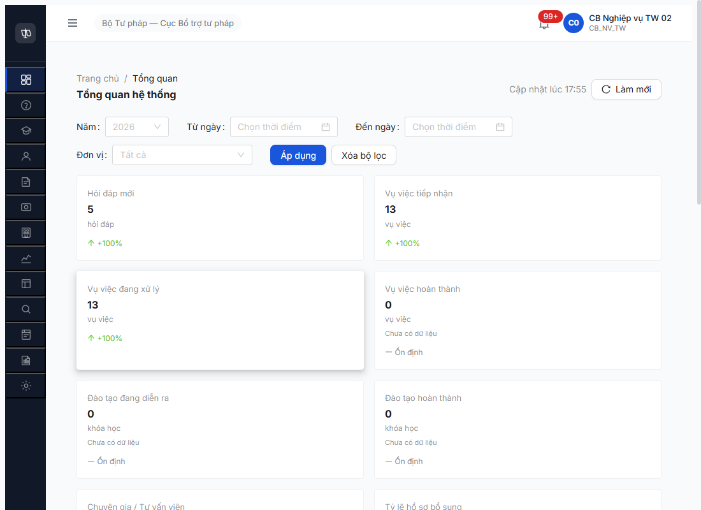
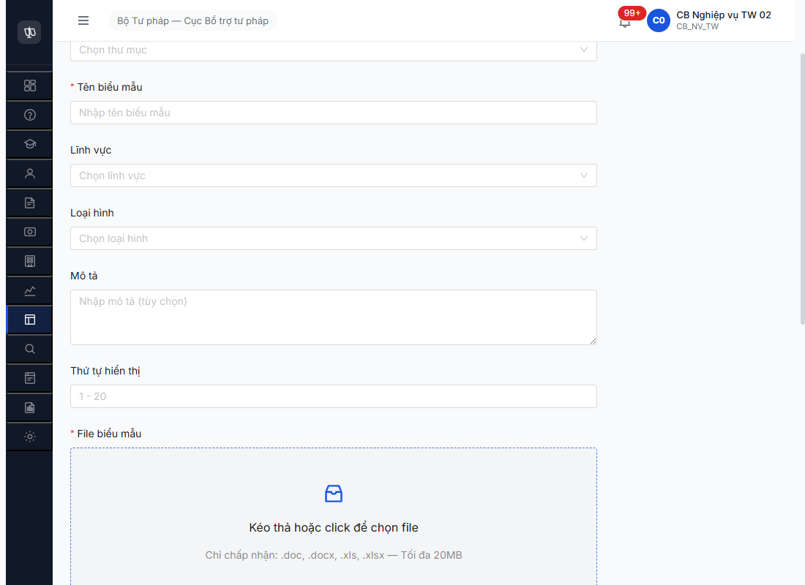

# Functional Test Report — Thư viện Biểu mẫu (Module 7.9 v3.5) — R7.7.10 R8 lần 2 + addendum R8 lần 3

| Thông tin | Giá trị |
|-----------|---------|
| **Module** | Thư viện Biểu mẫu — Module 7.9 |
| **SRS Reference** | [`srs-update-2026-5-5/_DELTA-MAP-FR09.md`](../../../../../input/srs-update-2026-5-5/_DELTA-MAP-FR09.md) + [`CHANGELOG-v3-to-v3.5.md` line 1010-1117](../../../../../input/srs-update-2026-5-5/CHANGELOG-v3-to-v3.5.md) |
| **Người test** | QA Automation (Claude Code MCP) |
| **Ngày** | 2026-05-09 17:42-18:00 (R8 lần 2) + 19:55 (R8 lần 3 addendum) |
| **Môi trường** | http://103.172.236.130:3000/ |
| **Round** | R7.7.10 R8 lần 2 — re-verify 2 critical bug + smoke regression 5 TC + R8 lần 3 verify dev claim BUG-BM-007/008 |
| **Account** | `cb_nv_tw_02` (BUG-BM-007/008) + `cb_nv_tw_01` (smoke regression sau session reset) |
| **Round trước** | [`functional-test-report-r7-7-10-bm.md`](functional-test-report-r7-7-10-bm.md) (R7 22/47 PASS, 11 BLOCKED, 14 DEFER) |

---

## 0. Addendum R8 lần 3 — 2026-05-09 19:55 (cập nhật sau dev claim fix)

> **Reason:** Dev báo đã fix BUG-BM-007 + BUG-BM-008. Re-test với cache clear toàn diện (caches.delete + SW unregister + localStorage/sessionStorage clear + logout API + reload `ignoreCache=true` + fresh login `cb_nv_tw_02`) per memory `feedback_clear_cache_before_verify_fe_fix`.
>
> **Kết quả tóm tắt R8 lần 3:**
>
> | Bug | Severity | Trước (R8 lần 2) | Sau (R8 lần 3) | Note |
> |---|:-:|:-:|:-:|---|
> | BUG-BM-007 MinIO `localhost:9000` | Critical | Open | ❌ **VẪN OPEN** (dev claim sai) | reqid=804 GET `/download` 302 → reqid=805 GET `http://localhost:9000/htpldn/...` → `net::ERR_ABORTED`. BE config `MINIO_PUBLIC_HOST` chưa đổi. |
> | BUG-BM-008 silent reject `.txt` | Medium | Open | ❌ **VẪN OPEN** (dev claim sai) | Upload `.txt` → 0 toast/error/file item (DOM check exhaustive). Evidence: `../../bug-reports/bm/image/r8l3-bm-008-still-silent.png`. |
> | **BUG-BM-001 Switch (bonus)** | Critical | Open partial | ✅ **CLOSED** | Phát hiện ngoài scope dev claim — Switch "Công khai trên Cổng PLQG" (uid `6_63` role `switch`) đã được FE add. 4/4 CR-01 fields đầy đủ. Evidence: `../../bug-reports/bm/image/r8l3-bm-001-switch-full-fix.png`. |
>
> **Impact lên 11 BLOCKED của R8 lần 2:**
> - 10 TC CR-01 (BM-041..050) **UNBLOCKED** sau R8 lần 3 do BUG-BM-001 closed → cần re-test riêng trong R8 lần 4 hoặc R9.
> - 1 TC BM-026 (BR-PUBLIC-02) đã unblock từ R8 lần 1 (BUG-BM-002 closed).
> - **Net:** Status "11 BLOCKED" trong R8 lần 2 giờ giảm còn ~0 BLOCKED nhưng 10 CR-01 chuyển sang "Pending re-test", chưa PASS thực tế.
>
> **Test report sections 1-5 dưới đây giữ nguyên là snapshot R8 lần 2 (historical truth).** Mọi câu chữ "vẫn BLOCKED chờ Switch BUG-BM-001" trong sections 1-5 phản ánh state R8 lần 2 (17:42-18:00). State hiện tại sau R8 lần 3 dùng addendum này làm reference.

---

---

## 1. Scope R8 lần 2

R8 lần 2 chỉ chạy **regression-light** thay vì full 47 TC re-test do:
- **10 TC CR-01 (BM-041..050)** BLOCKED bởi BUG-BM-001 partial fix Switch chưa add **tại thời điểm R8 lần 2** (đã verify trong R7.4.C1 R8 lần 2 + R7.3.7 R8 seed). → **Update R8 lần 3: BUG-BM-001 closed, các TC này UNBLOCKED chờ test riêng — xem [§0 Addendum](#0-addendum-r8-lần-3--2026-05-09-1955-cập-nhật-sau-dev-claim-fix).**
- **5 TC Authorization (BM-032..036)** defer do session-reset risk khi switch account multi-role (cần test riêng với account NHT/TVV/CG/QTHT).
- **Import bulk + mTLS Postman + audit log** (BM-028/029/038/040) defer do env limit.

**Scope thực tế R8 lần 2:**
1. Re-verify 2 bug R7.7.10 từ R7: BUG-BM-007 (MinIO) + BUG-BM-008 (silent reject).
2. Smoke regression 5 critical PASS TC (BM-001 list/filter, BM-005 search, BM-012 detail, BM-013 negative whitespace, BM-014 negative duplicate).

---

## 2. Kết quả

| TC ID | UC | Tên | Status R7 | **Status R8 lần 2** | Note |
|-------|-----|-----|:-:|:-:|------|
| BM-007 | UC95 | Preview online doc/docx → PDF | ❌ | ❌ | [BUG-BM-007](../../bug-reports/bm/bug-report-function-bm-r7-7-10.md#bug-bm-007--preview--download-biểu-mẫu-trỏ-minio-localhost9000-không-reachable) reproduced R8 lần 2 — `GET /download` 302 → `localhost:9000/...` `ERR_CONNECTION_REFUSED` |
| BM-008 | UC95 | Tải BM về | ❌ | ❌ | BUG-BM-007 cùng root cause — MinIO public host vẫn `localhost:9000` |
| BM-016 | UC95 | Upload file `.txt` (sai format) | ❌ | ❌ | [BUG-BM-008](../../bug-reports/bm/bug-report-function-bm-r7-7-10.md#bug-bm-008--form-thêm-bm-silent-reject-file-invalid-không-có-toasterror) reproduced R8 lần 2 — upload `test-bm-invalid.txt` → 0 toast/error/file item, silent reject |
| BM-001 | UC92 | List TM phân trang + filter trạng thái | ✅ | ✅ | API: total=4, AN:1, NHAP:2, CONG_KHAI:1 — match expected sau R7.4.C1 R8 lần 2 |
| BM-005 | UC96 | Search BM theo keyword | ✅ | ✅ | `?search=re-seed` → 3 (BM-20260509-001/002/003 R7.3.7 R8). `?search=NotExistsXYZ` → 0 |
| BM-012 | UC95 | Xem chi tiết BM | ✅ | ✅ | GET BM-20260509-001 trả đầy đủ field, `trangThai=CONG_KHAI`, đúng state post-R7.4.C1 R8 lần 2 SM T3 |
| BM-013 | UC92 | TM tên trống/whitespace | ✅ | ✅ | POST `tenThuMuc='   '` → 422 "Tên thư mục không được chỉ chứa khoảng trắng" (Vietnamese msg) |
| BM-014 | UC92 | Tạo TM trùng tên | ✅ | ⚠️ | POST `tenThuMuc='Biểu mẫu SHTT'` → 422 nhưng msg "linhVucId must be a UUID" (validation order: linhVucId UUID format checked trước duplicate name). Observation đã note R7. Vẫn reject 4xx đúng intent. |

### Pass rate R8 lần 2

| Loại | Run | PASS | FAIL | PARTIAL | Pass% |
|---|:-:|:-:|:-:|:-:|:-:|
| Re-verify bug | 3 (BM-007/008/016) | 0 | 3 | 0 | 0% |
| Regression smoke | 5 (BM-001/005/012/013/014) | 4 | 0 | 1 | 80% |
| **Tổng R8 lần 2** | **8** | **4** | **3** | **1** | **50%** |

### Cumulative status (R7 → R8 lần 2)

- 22 PASS R7 → smoke 5/5 verified vẫn PASS R8 lần 2 (regression-free).
- 3 FAIL R7 (BM-007/008/016) → 3 FAIL R8 lần 2 (cùng root cause, BUG-BM-007/-008 vẫn Open).
- 11 BLOCKED R7 → BLOCKED do BUG-BM-001 Switch chưa fix **tại thời điểm R8 lần 2** (verified R7.4.C1 R8 lần 2). **Update R8 lần 3:** BUG-BM-001 closed → 10 CR-01 unblocked chờ test riêng (xem [§0 Addendum](#0-addendum-r8-lần-3--2026-05-09-1955-cập-nhật-sau-dev-claim-fix)).
- 14 DEFER R7 → vẫn DEFER (env limit + multi-account).

**Conclusion (snapshot R8 lần 2 — xem §0 Addendum cho R8 lần 3 update):** Module BM v3.5 chưa thể release — cần dev fix:
1. **BUG-BM-007** Critical — đổi MinIO public host từ `localhost:9000` sang IP `103.172.236.130:9000` hoặc subdomain (P0, blocks 3 TC + cascade BM-010). → **R8 lần 3: vẫn Open, dev claim fix sai.**
2. ~~**BUG-BM-001** Critical — add Switch component vào form Thêm/Sửa BM (P0, unblocks 10 TC CR-01).~~ → **R8 lần 3: ✅ Closed (Switch added), 10 CR-01 unblocked chờ test riêng.**
3. **BUG-BM-005/-008** Medium — FE bắt 409/validation lỗi → toast (P2, UX consistency). → **R8 lần 3: BUG-BM-008 vẫn Open, BUG-BM-005 chưa test lại R8 lần 3.**

---

## 3. Bằng chứng (R8 lần 2)

### BUG-BM-007 — Preview/Download localhost:9000 reproduced

```text
GET /api/v1/bieu-maus/8a7211a6-7368-49d1-bb39-e9b5078b1037/download
→ 302 Found
Location: http://localhost:9000/htpldn/00000000-0000-4000-8000-000000000001/2026/05/f39d316d-bf34-4f8b-9d35-3f989ada4c8f/test-bm-r7-4-c1.docx?X-Amz-Algorithm=AWS4-HMAC-SHA256&...

GET http://localhost:9000/htpldn/...
→ net::ERR_CONNECTION_REFUSED  (browser của user)
→ net::ERR_ABORTED              (lần redirect kế tiếp)
```



### BUG-BM-008 — Upload .txt silent reject reproduced

```text
upload `test-bm-invalid.txt` (36B) → field `File biểu mẫu`
DOM check 1.5s sau upload:
{
  toastCount: 0,
  toastTexts: [],
  errCount: 0,
  errTexts: [],
  fileItemCount: 0,
  fileItems: []
}
```



### Smoke 5 TC API result

```text
GET /api/v1/thu-muc-bieu-maus → meta.total=4
  &trangThai=AN     → data.length=1 (Biểu mẫu Thuế)
  &trangThai=NHAP   → data.length=2 (HĐ Dân sự-TM + HĐ Lao động)
  &trangThai=CONG_KHAI → data.length=1 (Biểu mẫu SHTT, sau R7.4.C1 R8 lần 2 SM T3)

GET /bieu-maus?search=re-seed → 3 BM (BM-20260509-001/002/003)
GET /bieu-maus?search=NotExistsXYZ → 0 BM
GET /bieu-maus/8a7211a6-... → ma=BM-20260509-001, trangThai=CONG_KHAI

POST /thu-muc-bieu-maus {tenThuMuc:'   '} → 422 "Tên thư mục không được chỉ chứa khoảng trắng"
POST /thu-muc-bieu-maus {tenThuMuc:'Biểu mẫu SHTT'} → 422 "linhVucId must be a UUID" (English, observation R7)
```

---

## 4. Bug Linkage

| Bug ID | Severity | Status R7 | **Status R8 lần 2** | TC chặn |
|--------|----------|---|---|---|
| BUG-BM-007 | Critical | Open | ❌ **Open** (R8 lần 1 + R8 lần 2 reproduced) | BM-007, BM-008 (preview + download) |
| BUG-BM-008 | Medium | Open | ❌ **Open** (R8 lần 2 reproduced) | BM-016 (upload silent reject) |

> **Update R8 lần 3 (2026-05-09 19:55):** BUG-BM-007 vẫn Open (reqid=804/805 reproduced). BUG-BM-008 vẫn Open (silent reject `.txt` reproduced). **Bonus:** BUG-BM-001 (cross-link bug-report-flow) Closed — Switch added → 10 TC CR-01 (BM-041..050) UNBLOCKED chờ test riêng. Xem [§0 Addendum](#0-addendum-r8-lần-3--2026-05-09-1955-cập-nhật-sau-dev-claim-fix).

---

## 5. Recommended Next Round

1. **Dev fix BUG-BM-007** trước — đổi BE config `MINIO_PUBLIC_HOST=103.172.236.130:9000` (hoặc subdomain). 1-line fix, unblocks 3 TC P0. → **R8 lần 3: dev claim fix sai, vẫn Open.**
2. ~~**Dev add Switch BUG-BM-001** — form Thêm/Sửa BM. Sau fix → re-test R8 lần 3 sẽ unblock 10 TC CR-01.~~ → **R8 lần 3: ✅ Done — Switch added, 10 CR-01 ready để test trong R8 lần 4.**
3. **R8 lần 4 scope (cập nhật cho round tiếp sau)** sau dev fix lại BUG-BM-007/008:
   - Re-run BM-007/008 preview+download (chờ dev fix lại MinIO config + verify restart).
   - **Re-run 10 CR-01 TC (BM-041..050) — sẵn sàng test ngay R8 lần 4 vì BUG-BM-001 đã closed R8 lần 3.**
   - Multi-account run BM-032..036 (Authorization).
   - Postman mTLS BM-038.

---

*R8 lần 2 | QA Automation via Claude Code MCP | 2026-05-09 18:00 — Addendum R8 lần 3 thêm 19:55 cùng ngày sau dev claim fix BUG-BM-007/008 (kết quả: dev claim sai 2/2; bonus BUG-BM-001 closed).*
