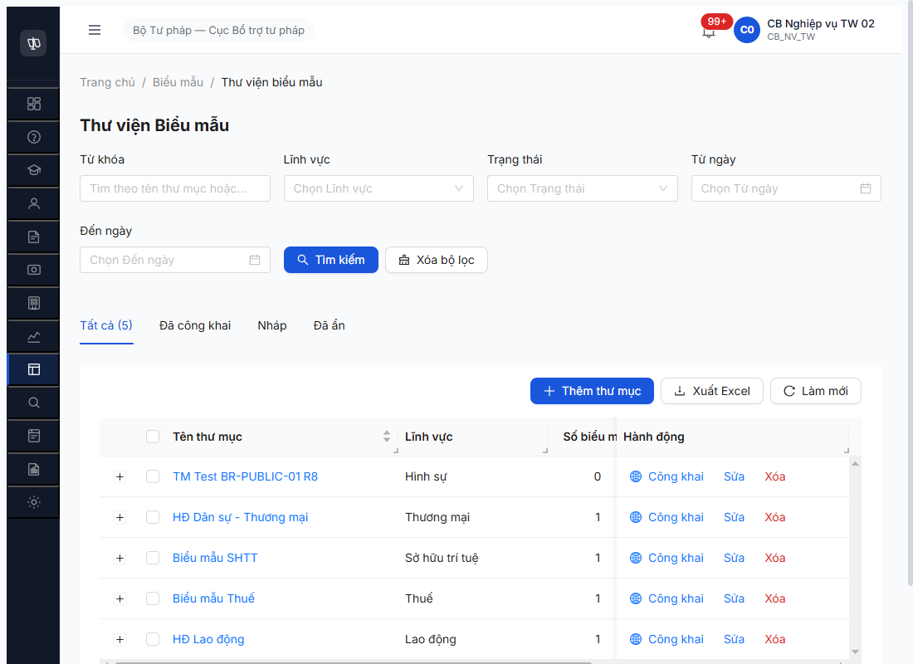
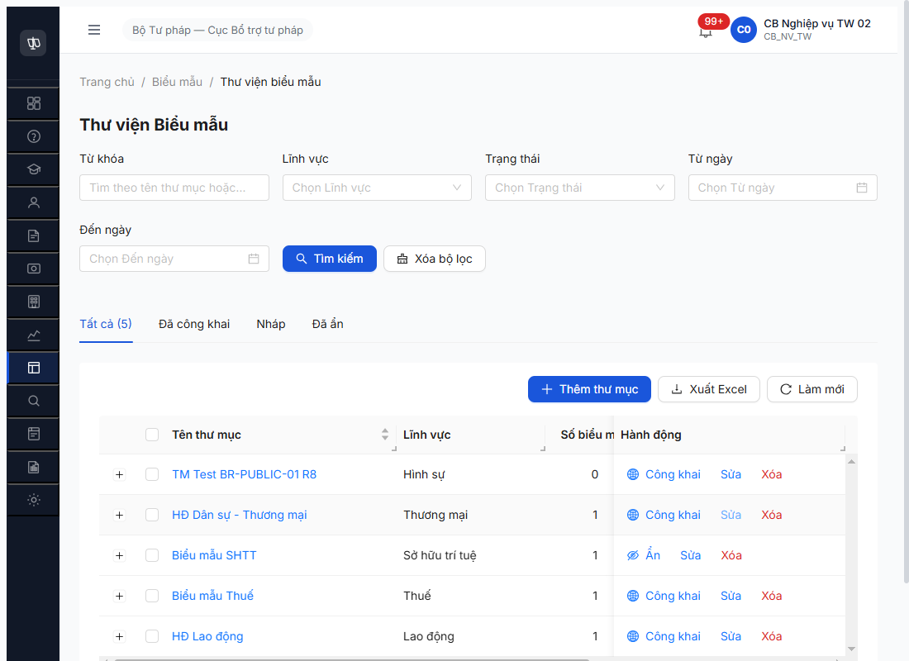

# Workflow Test Report — Biểu mẫu (FR-VII v3.5) — R7.4.C1 R8 lần 2

> **Module:** Thư viện Biểu mẫu — SM-BIEUMAU 3 transition + 4 trường công khai + BR-PUBLIC-01/02/03 · **SRS:** [`_DELTA-MAP-FR09.md`](../../../../../input/srs-update-2026-5-5/_DELTA-MAP-FR09.md) + [`CHANGELOG-v3-to-v3.5.md` line 1010-1117](../../../../../input/srs-update-2026-5-5/CHANGELOG-v3-to-v3.5.md) + [`srs-fr-12-tv-chuyen-sau.md` line 1597-1613 (BR-PUBLIC-01/02/03)](../../../../../input/srs-update-2026-5-5/srs-fr-12-tv-chuyen-sau.md) · **Round:** R8 lần 2 · **Date:** 2026-05-09 · **Tester:** QA Automation (Claude Code MCP)
> **Bug:** [`bug-reports/bm/bug-report-flow-bm-r7-4-c1.md`](../../bug-reports/bm/bug-report-flow-bm-r7-4-c1.md)
> **Round trước:** [`workflow-test-report-r7-4-c1-bm.md`](workflow-test-report-r7-4-c1-bm.md) (R7 5/8 PASS)

---

## Kết luận

✅ **PASS-WITH-NOTE — 7/8 checkpoint PASS, 1 BUG vẫn Open (UI silent), 2 BUG Critical đóng regression PASS**

- ✅ **3/3 SM-BIEUMAU transition** PASS ở thư mục (NHAP→CONG_KHAI→AN→CONG_KHAI). Timestamp `thoiGianDangTai` lần re-publish KHÁC lần đầu (`10:39:41` → null → `10:41:22`) — BR-PUBLIC-03 "lần bật mới nhất" đúng.
- ✅ **BR-PUBLIC-01** BE PASS — TM rỗng reject 409 + `ERR-CK-01` "Thư mục rỗng — không thể công khai khi chưa có biểu mẫu".
- ❌ **BUG-BM-005** vẫn Open — UI silent (0 toast/notification/alert) khi BE trả 409. Pattern lặp R8 lần 2.
- ✅ **BR-PUBLIC-02** PASS — `thoiGianDangTai = null` sau khi BM chuyển AN. Regression confirmed → **BUG-BM-002 closed persist**.
- ✅ **BR-PUBLIC-03** PASS — `congKhai=true` + `thoiGianDangTai="2026-05-09T10:39:41.228Z"` auto-fill khi NHAP→CONG_KHAI lần đầu, mới `10:41:22.146Z` lần re-publish.
- ✅ **BUG-BM-003 closed persist** — API trả `congKhai`, `thoiGianDangTai` (KHÔNG còn `laCongKhai`/`ngayCongKhai`).
- ✅ **BUG-BM-004 closed persist** — 3 fields v3.5 hiện diện: `anhDaiDien`, `moTaCongKhai`, `fileDinhKemCongKhai` (`'fieldName' in obj === true`).
- ⚠️ **BUG-BM-001 vẫn Open partial** — Form Thêm BM render heading "Nội dung công khai trên Cổng PLQG" + 3/4 fields (Ảnh đại diện + Mô tả công khai + File đính kèm công khai) **NHƯNG vẫn THIẾU Switch "Công khai trên Cổng PLQG"** (`evaluate_script` đếm `button[role="switch"]` = 0).
- 🆕 **BUG-BM-006 candidate close** — Cột "Số biểu mẫu" trên list TM auto-update =1 mỗi TM sau seed, KHÔNG phải 0 như R7.

> **Test data:** TM SHTT id `4dc8d54d-12d2-4bcf-b26c-d9f9331fb656` + BM id `8a7211a6-7368-49d1-bb39-e9b5078b1037` (BM-20260509-001) — vừa seed R7.3.7 R8 cùng session.
> **TM tạm:** TM Test BR-PUBLIC-01 R8 id `2d3dfbe9-7bf5-4e0f-8911-aad6228c0150` (Hình sự, 0 BM) — đã xóa cleanup cuối session.

---

## Bảng kiểm tra workflow

| # | Bước (transition / kiểm tra) | Actor | Sample | Status | Bug / Note |
|:-:|---|---|---|:-:|---|
| 1 | Login + navigate `/bieu-mau/thu-muc` | `cb_nv_tw_02` | — | ✅ | List 4 TM (sau cleanup), tab "Tất cả (4)" |
| 2 | Form **Thêm BM** check 4 trường công khai (Switch + Ảnh + Mô tả + File CK) | `cb_nv_tw_02` | `/bieu-mau/them-moi` | ⚠️ | 3/4 fields render OK, **Switch vẫn THIẾU** → [BUG-BM-001](../../bug-reports/bm/bug-report-flow-bm-r7-4-c1.md#bug-bm-001--form-thêmsửa-biểu-mẫu-thiếu-4-trường-công-khai-theo-srs-v35) Open partial |
| 3 | **BR-PUBLIC-01** — Công khai TM rỗng (TM Hình sự 0 BM) | `cb_nv_tw_02` | TM `2d3dfbe9` | ⚠️ | BE PASS 409 ERR-CK-01 đúng spec · UI FAIL silent → [BUG-BM-005](../../bug-reports/bm/bug-report-flow-bm-r7-4-c1.md#bug-bm-005--ui-silent-fail-khi-be-trả-409-err-ck-01-công-khai-thư-mục-rỗng) Open |
| 4 | **SM T1** — TM SHTT NHAP→CONG_KHAI + BR-PUBLIC-03 auto-fill | `cb_nv_tw_02` | TM `4dc8d54d` | ✅ | POST `/cong-khai` 200 · TM `trangThai=CONG_KHAI`, `syncStatus=SYNCED` · BM `congKhai=true`, `thoiGianDangTai="2026-05-09T10:39:41.228Z"` |
| 5 | **SM T2** — TM SHTT CONG_KHAI→AN + BR-PUBLIC-02 clear timestamp | `cb_nv_tw_02` | TM `4dc8d54d` | ✅ | POST `/an` 200 · BM `trangThai=AN`, `congKhai=false`, **`thoiGianDangTai=null`** (BUG-BM-002 closed regression confirmed) · Toast "Đã ẩn thư mục khỏi Cổng PLQG" hiện |
| 6 | **SM T3** — TM SHTT AN→CONG_KHAI re-publish | `cb_nv_tw_02` | TM `4dc8d54d` | ✅ | POST `/cong-khai` 200 · BM `trangThai=CONG_KHAI`, `congKhai=true`, `thoiGianDangTai="2026-05-09T10:41:22.146Z"` (NEW timestamp khác T1, BR-PUBLIC-03 "lần bật mới nhất" đúng) |
| 7 | **Verify entity rename** (`la_cong_khai → cong_khai` + `ngay_cong_khai → thoi_gian_dang_tai`) | API check | `/bieu-maus/{id}` | ✅ | `congKhai`, `thoiGianDangTai` keys present · `laCongKhai`, `ngayCongKhai` keys absent → [BUG-BM-003](../../bug-reports/bm/bug-report-flow-bm-r7-4-c1.md#bug-bm-003--be-bieu_mau-chưa-rename-lacongkhai--congkhai--ngaycongkhai--thoigiandangtai) closed persist R8 lần 2 |
| 8 | **Verify 3 fields công khai mới** (`anh_dai_dien`, `mo_ta_cong_khai`, `file_dinh_kem_cong_khai`) | API check | `/bieu-maus/{id}` | ✅ | All 3 keys present (`'fieldName' in obj === true`) → [BUG-BM-004](../../bug-reports/bm/bug-report-flow-bm-r7-4-c1.md#bug-bm-004--be-bieu_mau-entity-thiếu-3-fields-công-khai-mới) closed persist R8 lần 2 |
| 9 | **Cột "Số biểu mẫu" trên list TM** auto-update sau seed BM | UI check | List TM | ✅ | 4 TM đều hiển thị `1` (đúng số BM thực tế) → [BUG-BM-006](../../bug-reports/bm/bug-report-flow-bm-r7-4-c1.md#bug-bm-006--cột-số-biểu-mẫu-trên-list-thư-mục-không-cập-nhật-sau-khi-thêm-bm) candidate close R8 lần 2 |

> Icon: ✅ pass · ❌ fail · ⚠️ partial / pass-with-note · 🚫 blocked

---

## Lịch sử round

| Round | Date | Kết quả tóm tắt |
|---|---|---|
| R7 (lần 1) | 2026-05-07 | 5/8 PASS + 6 bug. SM 3/3 PASS · BR-PUBLIC-01 BE OK / UI silent · BR-PUBLIC-02 FAIL · BR-PUBLIC-03 BE OK · 4 trường công khai BLOCKED. |
| R8 lần 1 | 2026-05-08 | Dev fix BUG-BM-002/003/004 → PASS. BUG-BM-001 partial fix (3/4 fields). BUG-BM-005/006/007/008 vẫn Open. |
| **R8 lần 2** | **2026-05-09 17:30-17:42** | **7/8 PASS + 1 partial.** SM 3/3 PASS regression. BR-PUBLIC-01/02/03 PASS BE. BUG-BM-002/003/004 closed persist confirmed. BUG-BM-006 candidate close (counter auto-update). BUG-BM-001 vẫn partial (Switch missing). BUG-BM-005 vẫn Open silent. |

---

## Bằng chứng (R8 lần 2)

### Step 3 — BR-PUBLIC-01 BE PASS / UI FAIL silent

```text
POST /api/v1/thu-muc-bieu-maus/2d3dfbe9-7bf5-4e0f-8911-aad6228c0150/cong-khai (TM rỗng, Hình sự)
Status: 409
Body:
{
  "success": false,
  "error": {
    "code": "ERR-CK-01",
    "message": "Thư mục rỗng — không thể công khai khi chưa có biểu mẫu",
    "timestamp": "2026-05-09T10:39:02.233Z",
    "requestId": "4587bb07-32bb-4737-9802-a5aff924ee1e"
  }
}
DOM check sau POST: { toastCount: 0, errCount: 0, bodyHasErrCK01: false }
```



### Step 4 — SM T1 NHAP→CONG_KHAI + BR-PUBLIC-03 PASS

```text
GET /api/v1/bieu-maus/8a7211a6-7368-49d1-bb39-e9b5078b1037 (sau Công khai)
{
  "ma": "BM-20260509-001",
  "trangThai": "CONG_KHAI",
  "congKhai": true,
  "thoiGianDangTai": "2026-05-09T10:39:41.228Z",
  "fields_v3_5": { "anhDaiDien": true, "moTaCongKhai": true, "fileDinhKemCongKhai": true },
  "has_old_keys": { "laCongKhai": false, "ngayCongKhai": false }
}
```


### Step 5 — SM T2 CONG_KHAI→AN + BR-PUBLIC-02 PASS (BUG-BM-002 closed regression)

```text
GET /api/v1/bieu-maus/8a7211a6-7368-49d1-bb39-e9b5078b1037 (sau Ẩn)
{
  "ma": "BM-20260509-001",
  "trangThai": "AN",
  "congKhai": false,
  "thoiGianDangTai": null,           ← PASS (cleared theo BR-PUBLIC-02)
  "syncStatus": "SUCCESS"
}
```


### Step 6 — SM T3 AN→CONG_KHAI re-publish, NEW timestamp

```text
GET /api/v1/bieu-maus/8a7211a6-7368-49d1-bb39-e9b5078b1037 (sau Công khai lần 2)
{
  "ma": "BM-20260509-001",
  "trangThai": "CONG_KHAI",
  "congKhai": true,
  "thoiGianDangTai": "2026-05-09T10:41:22.146Z",  ← NEW timestamp (khác T1 10:39:41)
  "syncStatus": "SUCCESS"
}
```



---

## Bugs status — sau R8 lần 2

| Bug ID | Severity | Status R7 | Status R8 lần 1 | **Status R8 lần 2** | Note |
|---|---|---|---|---|---|
| BUG-BM-001 | Critical | Open | Open partial | ⚠️ **Open partial** | 3/4 CR-01 fields render OK, vẫn THIẾU Switch |
| BUG-BM-002 | Critical | Open | Closed | ✅ **Closed persist** | BR-PUBLIC-02 timestamp clear OK regression |
| BUG-BM-003 | Major | Open | Closed | ✅ **Closed persist** | Field rename congKhai/thoiGianDangTai OK regression |
| BUG-BM-004 | Major | Open | Closed | ✅ **Closed persist** | 3 fields v3.5 present OK regression |
| BUG-BM-005 | Medium | Open | Open | ❌ **Open** | UI silent fail 409 vẫn lặp R8 lần 2 |
| BUG-BM-006 | Medium | Open | Open | 🆕 **Closed candidate** | Counter auto-update =1/TM verified, cần re-test workflow chính thức |

---

*R8 lần 2 | QA Automation via Claude Code MCP | 2026-05-09 17:42*
