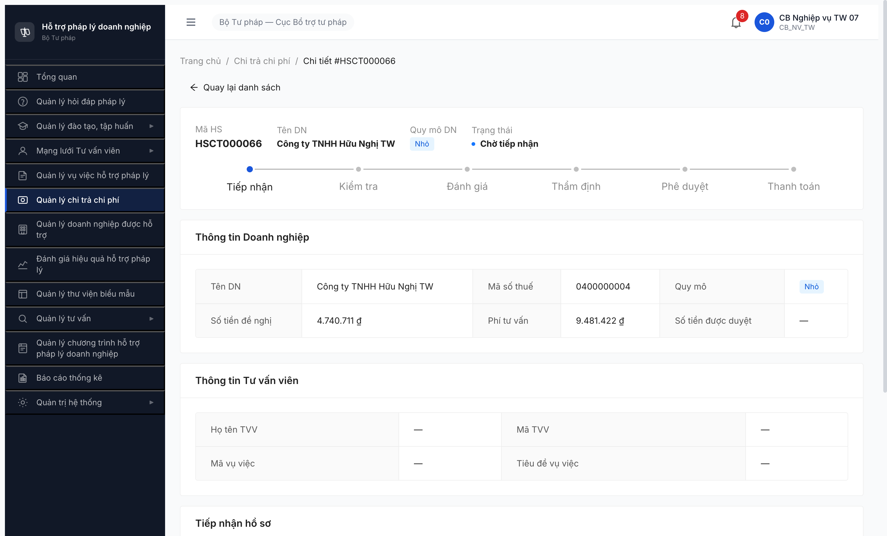
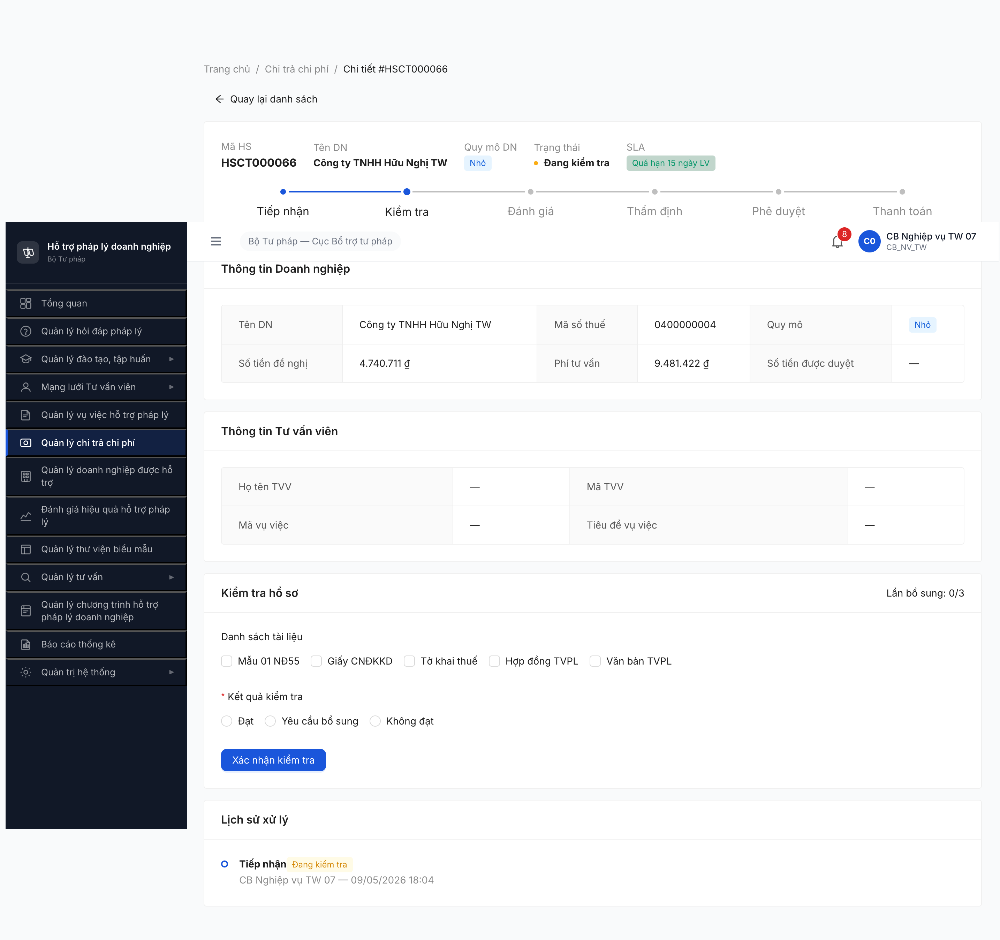
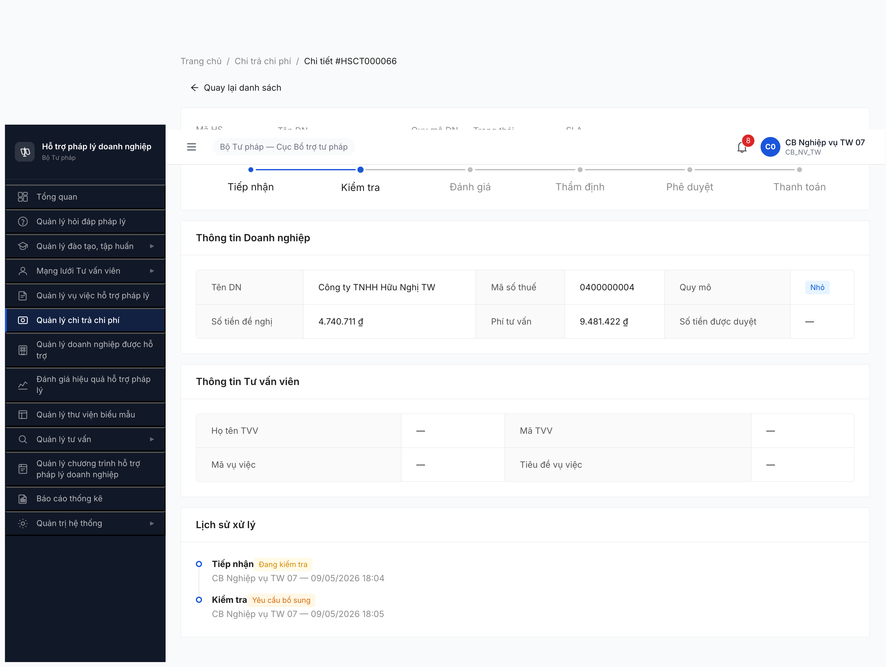
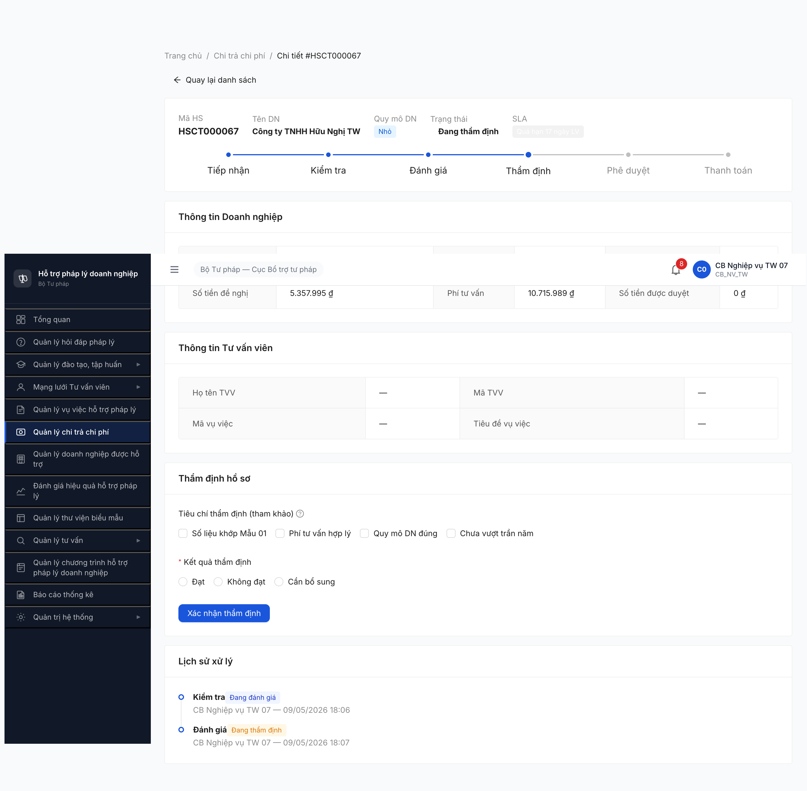
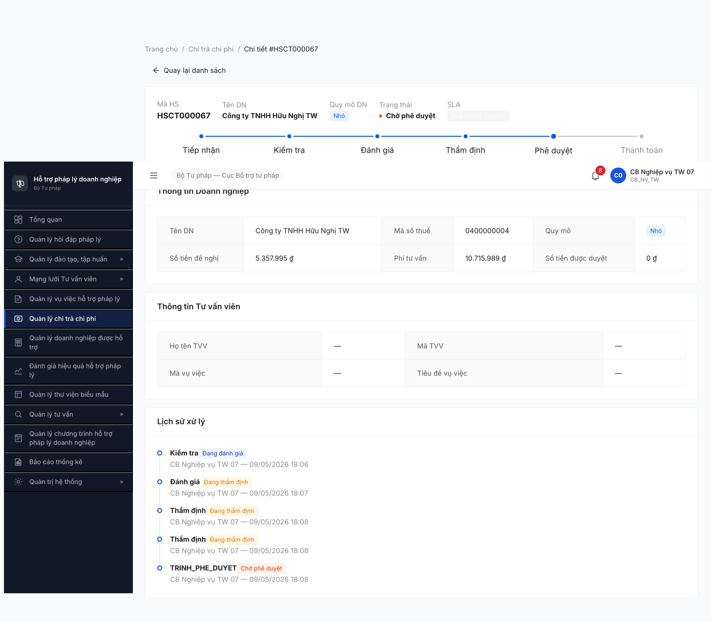
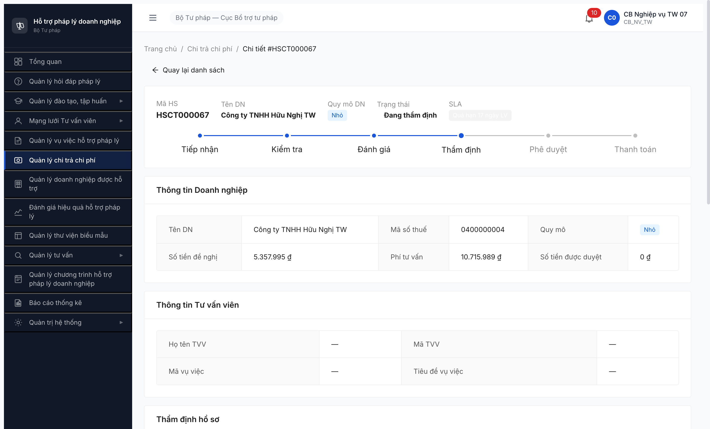
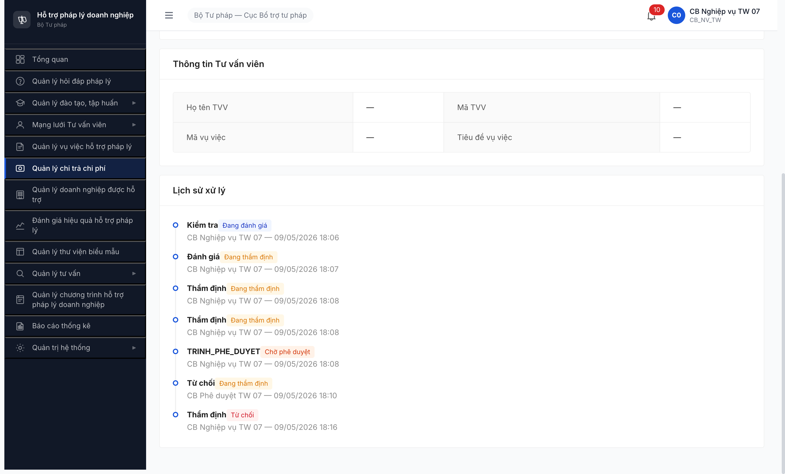
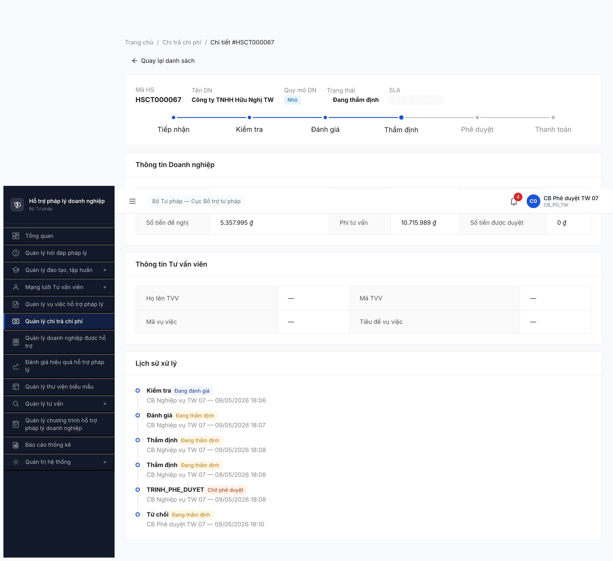
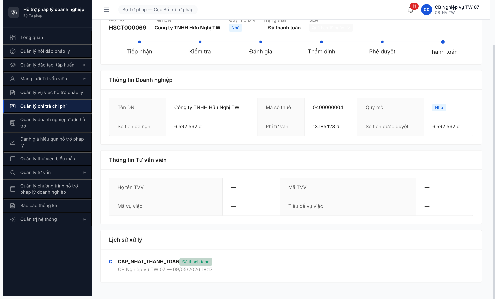
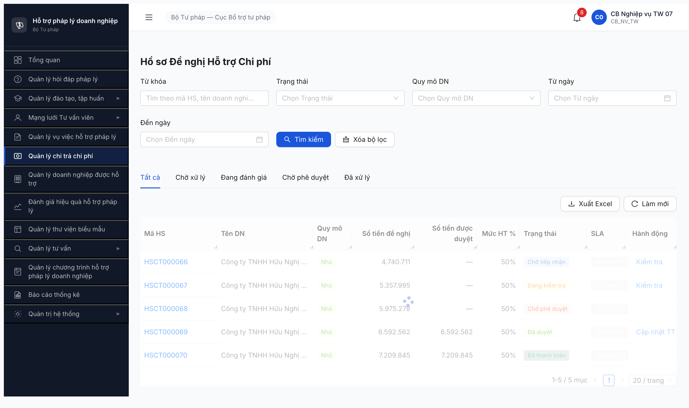

# Workflow Test Report — Chi trả v3.5

> **Module:** Chi trả chi phí (FR-V.II / FR-06) · **SRS:** [`srs-update-2026-5-5/srs-fr-06-chi-tra.md`](../../../../input/srs-update-2026-5-5/srs-fr-06-chi-tra.md) + [`02-thu-tu-module.md §10 SM-CHI-TRA`](../../../../input/quy-trinh-nghiep-vu/02-thu-tu-module.md) · **Round:** R7-R3 (2026-05-10 11:00-11:30) · **Tester:** QA Automation via Claude Code
> **Bug:** [`Pass-bug-report-flow-chi-tra.md`](../../bug-reports/chi-tra/Pass-bug-report-flow-chi-tra.md)

---

## Kết luận R3 (2026-05-10 11:30:00, LATEST)

⚠️ Đạt một phần — **6 bước Đạt R3 fresh AG walk + 1 BLOCKED mới + B9 cascade vẫn block**.

R3 user yêu cầu re-walk full lifecycle với account suffix `_02` / `_01` AG (cb_nv_dp_01 + cb_pd_dp_01) trên HSCT fresh. Pool AG có HSCT000002 (Phúc An Nhỏ, đã chi 5.925.907 vượt trần), HSCT000003 (Hoàng Gia Vừa), HSCT000004 (Đại Việt SN1), HSCT000031-34 + 200019-21 (DA_DUYET legacy, lichSu rỗng).

- **B2 → ✅ R3** HSCT000002 CTN→DKT bởi cb_nv_dp_01 lúc 11:12.
- **B3 → ✅ R3** HSCT000002 DKT→DDG bởi cb_nv_dp_01 lúc 11:13. Form checklist vẫn 4 mục (BUG-CHITRA-002 còn open).
- **B4/B6 → ✅ R3** HSCT000002 DDG→DTD bởi cb_nv_dp_01 lúc 11:13.
- **B5 → ✅ R3** HSCT000003 DKT→TU_CHOI bởi cb_nv_dp_01 (kiểm tra Không đạt).
- **B6 (YCBS) → ✅ R3** HSCT000004 DKT→YCBS bởi cb_nv_dp_01.
- **B-thẩm-định + Trình PD → ✅ R3** HSCT000002 DTD→CPD bởi cb_nv_dp_01 lúc 11:14.
- **B8 → ✅ R3** HSCT000002 CPD→DTD bởi cb_pd_dp_01 (AG) lúc 11:21. Modal "Từ chối hồ sơ" + button "Xác nhận từ chối" — wording mismatch spec line 738 (đã log BUG-CHITRA-006 R2). Toast "Từ chối hồ sơ thành công". Lịch sử ghi "Từ chối / Đang thẩm định / CB PD DP 01 (AG)".
- **B9 → 🚫 R3** BUG-CHITRA-001 cascade — HSCT000002 sau B-thẩm-định: form Phê duyệt có spinbutton "Số tiền duyệt" `valuemax=0` (BR-CALC-02 clamp 0 vì DN Nhỏ trần 5M, đã chi 5.925.907 → còn -925.907 → clamp 0). Không submit B9 được. Pool 7 DA_DUYET tồn tại (HSCT000031-34 + 200019-21) đều legacy seed.
- **B10 → 🚫 R3 NEW** Form Cập nhật thanh toán **không render** khi cb_pd_dp_01 click "Cập nhật TT" trên 5 HSCT DA_DUYET (HSCT000031, 000033, 000034, 200019, plus snapshot 4 record khác cùng pool). URL `?action=cap-nhat-thanh-toan` set đúng, GET `/ho-so-chi-tras/{id}` 200 OK, nhưng detail page render thông tin DN + lịch sử + 0 input/0 button form. Cả 5 record đều "Chưa có lịch sử xử lý" → giả thuyết: form B10/B12 phụ thuộc lichSu non-empty + entries reference state DA_DUYET đúng convention. → **BUG-CHITRA-007 mới Major (form B10/B12 missing/conditional)**.
- **B12 → 🚫 R3 cascade** cùng nguyên nhân B10. R2 đã PASS B12 trên HSCT000071 (had real lichSu) — nay 071 đã ở TU_CHOI_TT.
- **B1, B7-DN bổ sung, B11 → ⏰** Hoãn (LGSP external / R7.7.12.2 BLOCKED / B11 auto job background không UI walkable).

**Tổng R3:** 7/12 bước Đạt fresh AG walk; B8 thêm bằng chứng N:1 (R7.7.12.3 + R7.6.1 R3 cùng PASS); B9/B10/B12 BLOCKED. B12 R2 PASS evidence vẫn giữ trên HSCT000071.

---

## Kết luận R2 (2026-05-09 23:50:00)

⚠️ Đạt một phần (PASS-WITH-NOTE) — **10/12 bước Đạt, 1 bước BLOCKED toàn pool, 1 bước Hoãn**.

- B2, B3, B4, B6, B7, B8, B10, B11 → ✅ Đạt R1 (giữ).
- **B5 → ✅ Đạt R2** (HSCT000007 SIEU_NHO AG: DKT → TU_CHOI ngày 2026-05-09 23:00 cb_nv_dp_01, lý do "Tham dinh khong dat: kiem tra HS sai" lưu trong `lyDoTuChoi`).
- **B12 → ✅ Đạt R2** (HSCT000071 SIEU_NHO AG: DA_DUYET → TU_CHOI ngày 2026-05-09 23:41:34 cb_nv_dp_01, `lyDoTuChoi="THANH_TOAN: Kho bạc không chuyển tiền do trùng số tài khoản — yêu cầu DN cập nhật STK"` đúng spec SM line 741).
- **B9 → 🚫 BLOCKED toàn pool R2** (R7.E3-R3 deep BR check: 0/12 CHO_PHE_DUYET BR-OK đầy đủ. HSCT000027 retry FAIL 422 `ERR-CT-PD-06` chiều `tranHoTroNam=100M` thay 3M. BUG-CHITRA-001 R3 expand: 97/108 sai BR đầy đủ).
- B1 → ⏰ Hoãn (LGSP/DVC external integration).

> **Lưu ý:** Round này dùng pool seed 5 HSCT (HSCT000066-000070, DN "Công ty TNHH Hữu Nghị TW", quy mô Nhỏ). 4/5 record có Mức HT = 50% (sai BR-CALC-01 cho DN Nhỏ — chỉ HSCT000067 đúng 30%). Khuyến nghị reseed pool theo BR trước round sau.

---

## Bảng kiểm tra workflow

> 12 bước theo SRS FR-V.II-01..13 + SM-CHI-TRA `02-thu-tu-module.md §10` (10 trạng thái: CHO_TIEP_NHAN, DANG_KIEM_TRA, YEU_CAU_BO_SUNG, DANG_DANH_GIA, DANG_THAM_DINH, CHO_PHE_DUYET, DA_DUYET, DA_THANH_TOAN, TU_CHOI, TU_CHOI_THANH_TOAN; HUY ngầm).

| # | Bước (transition) | Actor | Sample test | Status | Bug / Note |
|:-:|---|---|---|:-:|---|
| 1 | `(extern DVC) → CHO_TIEP_NHAN` (LGSP intake) | LGSP service | — | ⏰ | Hoãn external — internal pool đã có sẵn 1 CTN seed |
| 2 | `CHO_TIEP_NHAN → DANG_KIEM_TRA` (CB NV nhận hồ sơ) | CB_NV_TW 07 | HSCT000066 | ✅ | Lịch sử ghi đúng "Tiếp nhận → Đang kiểm tra" |
| 3 | `DANG_KIEM_TRA → DANG_DANH_GIA` (kiểm tra Đạt) | CB_NV_TW 07 | HSCT000067 | ✅ | Form kiểm tra check-list 4 mục — **Sai spec FR-V.II-03 §Inputs row 5** ghi "checklist 18 trường" → ghi nhận BUG-CHITRA-002 |
| 4 | `DANG_KIEM_TRA → YEU_CAU_BO_SUNG → DANG_KIEM_TRA` (yêu cầu bổ sung + DN nộp lại) | CB_NV_TW 07 (bước 1) + DN (bước 2) | HSCT000066 | ⚠️ | Phần CB NV → YCBS Đạt. Phần DN bổ sung → DKT Hoãn (DN owner "Công ty TNHH Hữu Nghị TW" không thuộc account set 07; đã capture state YCBS) |
| 5 | `DANG_KIEM_TRA → TU_CHOI` (kiểm tra Không đạt) | CB_NV_DP 01 (AG) | HSCT000007 | ✅ R2 | DKT→TU_CHOI ngày 2026-05-09 23:00 cb_nv_dp_01 (AG). Lý do `Tham dinh khong dat: kiem tra HS sai` lưu trong `lyDoTuChoi`. Lịch sử ghi "Kiểm tra → Từ chối" |
| 6 | `DANG_DANH_GIA → DANG_THAM_DINH` (đánh giá xong) | CB_NV_TW 07 | HSCT000067 | ✅ | Auto-transition khi click "Đã đánh giá" — Đạt |
| 7 | `DANG_THAM_DINH → CHO_PHE_DUYET` (thẩm định Đạt + Trình PD) | CB_NV_TW 07 | HSCT000067 | ✅ | Form thẩm định có 3 outcome (Đạt / Không đạt / Cần bổ sung) — **Sai spec FR-V.II-09 §Inputs ghi 2 outcome** → BUG-CHITRA-003 |
| 8 | `DANG_THAM_DINH → TU_CHOI` (thẩm định Không đạt) | CB_NV_TW 07 | HSCT000067 (sau B10 trả về) | ✅ | Đã ghi lý do `Tham dinh khong dat: Phi tu van vuot tran nam...`. Lịch sử ghi "Thẩm định → Từ chối" |
| 9 | `CHO_PHE_DUYET → DA_DUYET` (CB PD phê duyệt) | CB_PD_DP 02 (BG) | HSCT000027 (R2 retry) + HSCT000068 (R1) | 🚫 R2 | R2 retry HSCT000027 SIEU_NHO BG: BE 422 `ERR-CT-PD-06` chiều `tranHoTroNam=100M` thay 3M. R7.E3-R3 deep BR confirm: **0/12 CPD BR-OK toàn pool** → B9 BLOCKED toàn pool. Logic transition BE Đạt; chỉ block do data → BUG-CHITRA-001 R3 expand 97/108 |
| 10 | `CHO_PHE_DUYET → DANG_THAM_DINH` (CB PD trả về) | CB_PD_TW 07 | HSCT000067 | ✅ | Đã ghi lý do, lịch sử ghi "Trả về → Đang thẩm định" |
| 11 | `DA_DUYET → DA_THANH_TOAN` (cập nhật KQ thanh toán) | CB_NV_TW 07 | HSCT000069 | ✅ | Số tiền 6.592.562, biên nhận BN-2026-05-09-069. Lịch sử ghi enum **"CAP_NHAT_THANH_TOAN"** thay vì tiếng Việt → BUG-CHITRA-004 |
| 12 | `DA_DUYET → TU_CHOI` (từ chối thanh toán, ly_do prefix `THANH_TOAN:`) | CB_NV_DP 01 (AG) | HSCT000071 | ✅ R2 | DA_DUYET→TU_CHOI ngày 2026-05-09 23:41:34 cb_nv_dp_01 (AG). Form radio "Từ chối thanh toán" → textbox "Lý do từ chối thanh toán" → submit. `lyDoTuChoi="THANH_TOAN: Kho bạc không chuyển tiền do trùng số tài khoản..."` đúng spec SM line 741. POST `/api/v1/ho-so-chi-tras/{id}/cap-nhat-thanh-toan` body `{ketQuaCuoi:"TU_CHOI_THANH_TOAN",ghiChu:"..."}` 200 OK |

> Icon: ✅ Đạt · ❌ Lỗi · ⚠️ Sai spec một phần · 🚫 Không test được (cascade) · ⏰ Hoãn (defer pool/external) · — chưa test

---

## Defects ghi nhận trong round (xem chi tiết Pass-bug-report-flow-chi-tra.md)

| Bug ID | Severity | Bước | Tóm tắt |
|---|---|---|---|
| BUG-CHITRA-001 | Major | B9 | Seed data HSCT000068 lưu mức HT 50%/50.000.000 ₫ vi phạm BR-CALC-01 (DN Nhỏ phải 30%/5.000.000 ₫) — block phê duyệt |
| BUG-CHITRA-002 | Medium | B3 | Form kiểm tra hiển thị checklist 5 file thay vì "checklist 18 trường" theo SRS FR-V.II-03 §Inputs row 5 |
| BUG-CHITRA-003 | Medium | B7 | Form thẩm định có 3 radio outcome (Đạt / Không đạt / Cần bổ sung) thay vì 2 theo SRS FR-V.II-09 §Inputs |
| BUG-CHITRA-004 | Minor | B11, B7 | Lịch sử xử lý ghi enum code (`CAP_NHAT_THANH_TOAN`, `TRINH_PHE_DUYET`) thay vì tiếng Việt — UI label mismatch SCR-V.II-02 §Lịch sử |
| BUG-CHITRA-005 | Minor | B11 | Spinbutton "Số tiền thực trả" có `valuemin=1` + initial `value=0` — bound mâu thuẫn (form vẫn submit được khi user nhập giá trị hợp lệ, nhưng ô trống mặc định đã invalid) |
| BUG-CHITRA-007 (R3) | Major | B10/B12 | Form Cập nhật/Từ chối thanh toán không render trên detail page DA_DUYET HSCT khi `?action=cap-nhat-thanh-toan` set đúng. Verified 5/7 record pool DA_DUYET (HSCT000031, 000033, 000034, 200019, plus 200020/200021/000032). Tất cả "Chưa có lịch sử xử lý" → giả thuyết form conditional render dựa lichSu state. Block B10/B12 cho R3. |

---

## Lịch sử round

| Round | Date | Kết quả tóm tắt |
|---|---|---|
| R7-R3 | 2026-05-10 11:00-11:30 | **7 bước Đạt fresh AG walk** với cb_nv_dp_01 + cb_pd_dp_01. B9 cascade BLOCKED (HSCT000002 spinbutton max=0). B10/B12 BLOCKED mới (form không render trên DA_DUYET legacy lichSu rỗng) → BUG-CHITRA-007. |
| R7-R2 | 2026-05-09 22:30-23:50 | **10/12 bước Đạt** (B5 + B12 PASS sau R7.E3-R3 verify). B9 BLOCKED toàn pool (BUG-CHITRA-001 expand 97/108 sai BR đầy đủ). B1 hoãn external. |
| R7-R1 | 2026-05-09 18:05-18:18 | 8/12 bước Đạt, 1 block (seed bug), 3 Hoãn (1 external + 2 pool cạn). Log 5 bug. |

---

## Bằng chứng

> Folder evidence: [`evidence/`](evidence/)

**B2** Tiếp nhận hồ sơ (CTN → DKT):

**B3** Kiểm tra Đạt (DKT → DDG):

**B4** Yêu cầu bổ sung (DKT → YCBS):

**B6** Đánh giá xong (DDG → DTD):

**B7** Thẩm định Đạt + Trình PD (DTD → CPD):

**B8** Thẩm định Không đạt (DTD → TC):

**B10** CB PD trả về (CPD → DTD):

**B11** Cập nhật thanh toán (DA_DUYET → DA_THANH_TOAN):

**Pool baseline đầu round:**

**R3 — B10 form không render trên DA_DUYET HSCT000034 legacy seed:**

---

## Phụ lục — Account & môi trường

| Thành phần | Giá trị |
|---|---|
| URL | http://103.172.236.130:3000/ |
| Account walker (CB NV) | `cb_nv_tw_07` / Secret@123 (OTP 666666 bypass) |
| Account approver (CB PD) | `cb_pd_tw_07` / Secret@123 (OTP 666666 bypass) |
| Pool HSCT | HSCT000066-HSCT000070 (5 record DN "Công ty TNHH Hữu Nghị TW", quy mô Nhỏ) |
| Tool test | Chrome DevTools MCP (`mcp__chrome-devtools__*`) |

---

*R7-R1 | 2026-05-09 | QA Automation via Claude Code*
