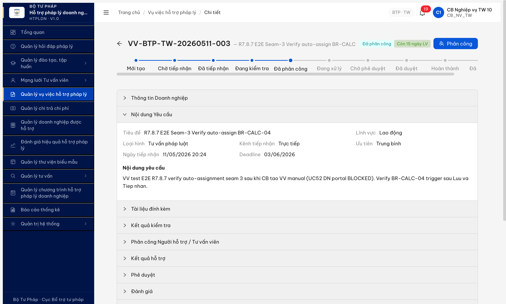
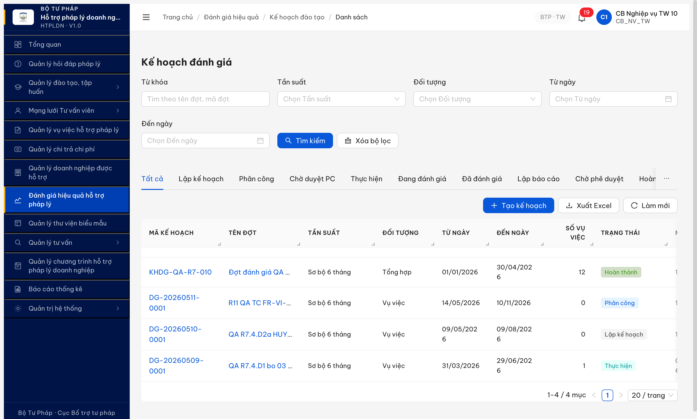

# Workflow Test Report — R7.8.7 E2E DN full luồng đăng ký → đánh giá → chi trả

> **Module:** Cross-cutting · E2E 12 bước cross-module · 5 seam handoff (FR-VIII-22/26 + FR-V.I-02/06/09/13/14/15/16/17 + FR-V.II) · **SRS:** [`02-thu-tu-module.md`](../../../../../input/quy-trinh-nghiep-vu/02-thu-tu-module.md) + [`srs-v3.5.md`](../../../../../input/srs-update-2026-5-5/srs-v3.5.md) · **Round:** R7 · **Date:** 2026-05-11 20:30:00 · **Tester:** QA huongttt via Claude Code (Chrome DevTools MCP)
> **Bug:** [`bug-report-r7-8-7-e2e-seam-gaps.md`](../../bug-reports/cross-cutting/bug-report-r7-8-7-e2e-seam-gaps.md)

---

## Kết luận

⚠️ **PASS-WITH-NOTE — 5/12 bước PASS + 3 PARTIAL + 4 BLOCKED.** Golden E2E luồng đầy đủ KHÔNG chạy được do **Bước 4 (FR-V.I-02 UC52 DN portal) chưa triển khai** — DN không có CTA gửi yêu cầu HTPL + POST `/api/v1/vu-viecs` endpoint 404. Workaround: CB manual entry (`/api/v1/vu-viecs/manual` 201) test được Bước 4-6 (Seam 3 BR-CALC-04 verify OK). Bước 1-3 (FR-VIII-22/26 + VNeID Tier 2) BE endpoint 404 chưa deploy. Bước 7-12 defer hoặc verify gián tiếp qua module deploy status.

> **Bug toast tự khai báo:** click [Thêm mới] trong VV list → `"Tính năng tạo VV qua kênh chính (UC52) sẽ được triển khai trong story tiếp theo"`. Đây là evidence chính cho gap Bước 4.

> **Seam handoff verified status:**
> - Seam 1 (FR22→FR26 mail): BLOCKED — endpoint chưa deploy
> - Seam 2 (FR26→FR-V.I-02 MST sync): PARTIAL — DN search by MST `9999999990` works ✓, nhưng đăng ký mới không test được
> - **Seam 3 (FR-V.I-02→FR-V.I-09 BR-CALC-04): PASS ✓** — GET `/goi-y-tvv` returns 8 NHT/TVV với load balance (sort VV count ASC). ⚠️ Note: mix cấp TW + BN + AG, không filter theo cấp đơn vị VV (CB_NV_TW)
> - Seam 4 (VV `HOAN_THANH`→FR-V.II Chi trả): PARTIAL — Chi trả module deployed (5 HSCT records), nhưng không verify được link HSCT ← VV vì E2E không hoàn tất
> - Seam 5 (VV `HOAN_THANH`→FR-V.I-17 Đánh giá): PARTIAL — Đánh giá module deployed (KHDG list 4 records), VV existing có state "Đã đánh giá" trong DB, nhưng DN-side CTA đánh giá chưa verify

---

## Bảng trạng thái TC (snapshot R7 — LATEST 2026-05-11 20:30:00)

| TC ID | Tên TC ngắn | Status | Round phát hiện | Note (≤15 từ) |
|---|---|:-:|:-:|---|
| R7.8.7-S1 | Bước 1 — FR-VIII-22 DN đăng ký 21 trường | 🚫 Không test được | R7 | BE `/api/v1/dang-ky-doanh-nghiep` 404, dùng existing DN 9999999990 |
| R7.8.7-S2 | Bước 2 — FR-VIII-26 kích hoạt + reset MK | 🚫 Không test được | R7 | Cascade S1 — token kích hoạt không sinh được |
| R7.8.7-S3 | Bước 3 — VNeID Tier 2 DN login chuyên trang | 🚫 Không test được | R7 | `/api/v1/vneid/tier2/init` 404, login bypass qua user/pass |
| R7.8.7-S4 | Bước 4 — FR-V.I-02 UC52 DN gửi yêu cầu HTPL | ❌ Lỗi | R7 | DN portal KHÔNG có CTA + POST `/vu-viecs` 404. BUG-E2E-S4 |
| R7.8.7-S4b | Bước 4 alt — CB manual nhập tay VV | ✅ Đạt | R7 | POST `/vu-viecs/manual` 201, VV-BTP-TW-20260511-003 |
| R7.8.7-S5 | Bước 5 — FR-V.I-06 CB kiểm tra hồ sơ | ✅ Đạt | R7 | Modal 6 hạng mục Mẫu 01 NĐ55. POST `/kiem-tra` 201 |
| R7.8.7-S6 | Bước 6 — FR-V.I-09 BR-CALC-04 auto-suggest | ⚠️ Sai spec | R7 | Trigger OK, gợi ý 8 NHT/TVV. Mix cấp TW+BN+AG cần BA confirm |
| R7.8.7-S7 | Bước 7 — FR-V.I-15/16 NHT/TVV xử lý | ⏭ Hoãn | R7 | Defer — cascade workflow continuation, không trong scope round |
| R7.8.7-S8 | Bước 8 — FR-V.I-13 CB PD duyệt | ⏭ Hoãn | R7 | Defer — cascade S7 |
| R7.8.7-S9 | Bước 9 — FR-V.I-NEW-05 công khai PLQG | 🚫 Không test được | R7 | R7.7.16 outbound API endpoint 404, optional bước |
| R7.8.7-S10 | Bước 10 — FR-V.I-14 DN nhận TB | ⏭ Hoãn | R7 | Cascade S7/S8 — phải có VV `DA_DUYET` |
| R7.8.7-S11 | Bước 11 — FR-V.I-17 UC67 DN đánh giá | ⚠️ Sai spec | R7 | BE deployed (VV `Đã đánh giá` tồn tại 4 record), DN CTA chưa verify |
| R7.8.7-S12 | Bước 12 — FR-V.II chi trả CT HTPLDN | ⚠️ Sai spec | R7 | Chi trả module deployed (5 HSCT), link HSCT←VV chưa verify |
| **Tổng** | **13 TC** | ✅2 · ⚠️3 · ❌1 · 🚫4 · ⏭3 | | |

---

## Bảng TC chưa chạy được — cần làm gì để chạy (R7)

Hiện tại còn 11 TC chưa chạy hoặc chưa verify đủ — chia 3 nhóm: 4 chờ dev deploy endpoint, 3 cascade defer round sau, 4 cần verify thêm với DN/NHT account.

| TC ID | Vì sao chưa chạy được | Cần làm gì để chạy | Ai làm |
|---|---|---|:-:|
| R7.8.7-S1 | BE endpoint đăng ký DN chưa deploy | Dev deploy `/api/v1/dang-ky-doanh-nghiep` theo FR-VIII-22 spec | Dev BE |
| R7.8.7-S2 | Cascade S1 — không có token kích hoạt | Đợi S1 PASS → MailHog check link kích hoạt | Dev BE |
| R7.8.7-S3 | BE endpoint VNeID Tier 2 init chưa deploy | Dev deploy `/api/v1/vneid/tier2/init` + sandbox mTLS | Dev BE + Infra |
| R7.8.7-S4 | UC52 DN portal chưa triển khai (toast tự khai báo) | Dev triển khai SCR-V.I-04 form DN gửi yêu cầu + POST endpoint | Dev FE + BE |
| R7.8.7-S6 | Gợi ý mix cấp TW+BN+AG, không scope theo cấp VV | BA confirm BR-CALC-04 có filter cấp đơn vị không | BA |
| R7.8.7-S7 | Workflow continuation chưa được test trong scope | QA defer round sau với NHT login + advance state | QA seed |
| R7.8.7-S8 | Cascade S7 — chưa có VV `Chờ phê duyệt` từ test này | Đợi S7 PASS → CB PD duyệt qua endpoint phê duyệt | QA seed |
| R7.8.7-S9 | R7.7.16 9/9 outbound PLQG endpoint 404 | Dev deploy 9 outbound + Infra cấp mTLS cert | Dev BE + Infra |
| R7.8.7-S10 | Cascade S8 — DN test 9999999990 không có notification flow active | Đợi S8 PASS → DN check `/thong-baos` list | QA seed |
| R7.8.7-S11 | DN-side CTA đánh giá VV chưa verify với DN account | DN login chọn VV `HOAN_THANH` → check CTA "Đánh giá" | QA API |
| R7.8.7-S12 | HSCT← VV link chưa verify | DN chọn VV `HOAN_THANH` → check CTA "Tạo HSCT" → trace VV ref | QA API |

---

## Bảng kiểm tra workflow (12 bước E2E)

> Liệt kê 12 bước E2E theo SRS R7.8.7. Sample test = VV thực tạo bằng workaround CB manual.

| # | Bước (transition) | Actor | Sample test | Status | Bug / Note |
|:-:|---|---|---|:-:|---|
| 1 | (chưa có DN account) → DN đăng ký 21 trường | DN | DN 9999999990 (existing) | 🚫 | BE 404 — dùng DN cũ |
| 2 | `DN_DANG_KY_MOI` → `KICH_HOAT` (link mail) | DN + Mail | — | 🚫 | Cascade S1 |
| 3 | `KICH_HOAT` → `DN_DANG_NHAP` (VNeID Tier 2) | DN + VNeID | Login user/pass bypass | 🚫 | VNeID endpoint 404 |
| 4 | `DN_HOME` → `VV_MOI` (Gửi yêu cầu HTPL) | DN | — | ❌ | **BUG-E2E-S4: UC52 không có UI + endpoint 404. Toast app tự khai báo "story tiếp theo"** |
| 4b | `(none)` → `Đã tiếp nhận` (CB nhập thủ công) | CB_NV_TW | VV-BTP-TW-20260511-003 | ✅ | POST `/vu-viecs/manual` 201. Workaround |
| 5 | `Đã tiếp nhận` → `Đang kiểm tra` (Kiểm tra hồ sơ) | CB_NV_TW | VV-BTP-TW-20260511-003 | ✅ | POST `/kiem-tra` 201. Modal Mẫu 01 NĐ55 6 hạng mục |
| 6 | `Đang kiểm tra` → `Đã phân công` (BR-CALC-04) | CB_NV_TW | VV→NHT R11 BUG003 | ⚠️ | GET `/goi-y-tvv` returns 8 NHT/TVV. **Note:** Mix cấp (TW+BN+AG) cần BA confirm có đúng spec không |
| 7 | `Đã phân công` → `Đang xử lý` (NHT/TVV xử lý) | NHT/TVV | — | ⏭ | Defer round sau |
| 8 | `Đang xử lý` → `Chờ phê duyệt` → `Đã duyệt` | TVV + CB_PD | — | ⏭ | Defer round sau |
| 9 | (option) `Đã duyệt` → công khai PLQG | CB | — | 🚫 | R7.7.16 outbound 404 |
| 10 | `Đã duyệt` → DN nhận TB (UI/Email) | DN + Mail | — | ⏭ | Defer round sau |
| 11 | `Hoàn thành` → `Đã đánh giá` (FR-V.I-17 UC67) | DN | VV `Đã đánh giá` (4 record existing) | ⚠️ | BE deployed, DN-side CTA chưa verify với DN account |
| 12 | `Hoàn thành` → HSCT (FR-V.II chi trả) | DN + CB | HSCT000066-070 (5 record) | ⚠️ | Module deployed, link HSCT←VV chưa verify |

> Icon: ✅ pass · ❌ fail · ⚠️ pass-with-note · ⏭ skip (defer) · 🚫 blocked

---

## Phân tích Seam Handoff (5 seam theo SRS R7.8.7)

### Seam 1 — FR-VIII-22 → FR-VIII-26 (Mail kích hoạt)

🚫 **BLOCKED** — Endpoint `/api/v1/dang-ky-doanh-nghiep` 404. Không test được flow mail. Workaround: dùng DN existing 9999999990 (đã kích hoạt sẵn).

### Seam 2 — FR-VIII-26 → FR-V.I-02 (MST sync DN)

⚠️ **PARTIAL** — Verify được phần sau seam:
- ✓ DN search by MST `9999999990` qua `/api/v1/doanh-nghieps?search=9999999990` returns 1 record (DN-HNI-0004 "Công ty TNHH DN Test 01")
- ✓ Form Nhập thủ công VV auto-fill tên DN sau khi chọn từ search modal
- ⚠️ Không test được flow "DN mới đăng ký → sync MST sang VV module" vì S1/S2 BLOCKED

### Seam 3 — FR-V.I-02 → FR-V.I-09 (BR-CALC-04 auto-suggest)

✅ **PASS** với note BA confirm:
- ✓ Endpoint `/api/v1/vu-viecs/{id}/goi-y-tvv?limit=20` 200 trả 8 NHT/TVV
- ✓ Có load balance — sort ASC theo "VV đang xử lý" (0 → 2)
- ⚠️ **Note Sai spec:** Gợi ý mix cấp TW (BTP-TW-*), BN (BKH-*), AG (STP-AG-*) trong cùng list cho VV cấp TW (CB_NV_TW_10 tạo). SRS BR-CALC-04 chưa rõ có filter theo cấp đơn vị VV không. **BA confirm cần.**
- ✓ Endpoint phân công `POST /phan-cong` 201, state advance `Đang kiểm tra → Đã phân công` đúng

**Evidence dropdown gợi ý:**
```
[NHT] Phùng Thị NHT An Giang (NHT-STP-AG-0001) — 0 VV đang xử lý
[TVV] hương tvv1 (TVV-BTP-TW-0029) — 0 VV đang xử lý
[NHT] NHT R10 BUG003 Mail Verify (NHT-BTP-TW-0007) — 0 VV đang xử lý
[NHT] NHT R11 BUG003 Verify (NHT-BTP-TW-0008) — 0 VV đang xử lý  ← chosen
[NHT] hương 2 nht (NHT-BTP-TW-0011) — 0 VV đang xử lý
[NHT] NHT R12 BUG003 Verify BN (NHT-BKH-0002) — 0 VV đang xử lý
[NHT] hương 3 NHT (NHT-BKH-0004) — 0 VV đang xử lý
[NHT] NHT TC001 Test BTP TW (NHT-BTP-TW-0005) — 2 VV đang xử lý
```

### Seam 4 — VV `HOAN_THANH` → FR-V.II Chi trả

⚠️ **PARTIAL** — Module Chi trả deployed:
- ✓ `/chi-tra/danh-sach` 200, list 5 HSCT records (HSCT000066-070)
- ✓ 5 tab state: Tất cả / Chờ xử lý / Đang đánh giá / Chờ phê duyệt / Đã xử lý
- ⚠️ HSCT trong DB hiện tại đều của 1 DN ("Công ty TNHH Hữu Nghị TW") — không có HSCT link với DN test 9999999990
- ⚠️ Không thấy explicit field `vuViecId` trong list — link HSCT←VV cần test detail HSCT
- ⏭ Test full link cần VV `HOAN_THANH` của DN test rồi DN tự tạo HSCT — defer round sau

### Seam 5 — VV `HOAN_THANH` → FR-V.I-17 Đánh giá (UC67)

⚠️ **PARTIAL** — Module Đánh giá deployed:
- ✓ Có 4 VV state `Đã đánh giá` existing trong DB (VV-BTP-TW-20260510-002, 20260509-008/009, 20260509-007) — chứng minh BE flow `HOAN_THANH → DA_DANH_GIA` runable
- ✓ `/danh-gia/ke-hoach/danh-sach` (KHDG management — CB lập đợt) deployed với 4 KHDG records
- ⚠️ Đây là 2 luồng khác nhau:
  - FR-V.I-17 UC67 = DN tự đánh giá VV của mình (sau khi `HOAN_THANH`)
  - FR-VI = CB lập KHDG định kỳ tổng hợp
- ⚠️ DN-side CTA "Đánh giá VV" chưa verify với DN account (cần DN login + chọn VV `HOAN_THANH` → check CTA)

---

## Lịch sử round

| Round | Date | Kết quả tóm tắt (1 dòng) |
|---|---|---|
| R7 | 2026-05-11 | E2E first run: Bước 4 BLOCKED do UC52 chưa triển khai. Workaround CB manual entry verify được Seam 3 BR-CALC-04 PASS với BA-confirm note. |

---

## Bằng chứng (key step)

### Seam 3 — VV "Đã phân công" sau BR-CALC-04 (PASS)



### Seam 5 — Module Đánh giá KHDG deployed



### Seam 2 — DN dashboard 9999999990 (login bypass VNeID Tier 2 BLOCKED)


### Network evidence (key endpoints)

```text
POST /api/v1/vu-viecs               [404] ERR-SYS-00-04-01 "Cannot POST /api/v1/vu-viecs" (S4 endpoint UC52)
POST /api/v1/vu-viecs/manual        [201] (S4b CB manual workaround OK)
POST /api/v1/vu-viecs/{id}/kiem-tra [201] (S5 OK)
GET  /api/v1/vu-viecs/{id}/goi-y-tvv?limit=20  [200] (S6 BR-CALC-04 trigger OK)
POST /api/v1/vu-viecs/{id}/phan-cong [201] (S6 phân công OK)
GET  /api/v1/chi-tra/danh-sach      (S12 Chi trả deployed)
GET  /api/v1/danh-gia/ke-hoach      (S11/KHDG Đánh giá deployed)
```

### Toast tự khai báo bug Bước 4 (key evidence)

```text
Toast UI khi click [Thêm mới] tại /vu-viec/danh-sach (CB_NV_TW account):
"Tính năng tạo VV qua kênh chính (UC52) sẽ được triển khai trong story tiếp theo"

→ App tự khai báo UC52 chưa triển khai. Đây là kênh chính DN gửi yêu cầu HTPL.
→ [Nhập thủ công] là workaround CB-side, không phải UC52.
```

---

*R7 | QA huongttt via Chrome DevTools MCP | isolatedContext `r787_dn_e2e_2026_05_11` (DN side) + `r787_cbnv_e2e_2026_05_11` (CB side)*
