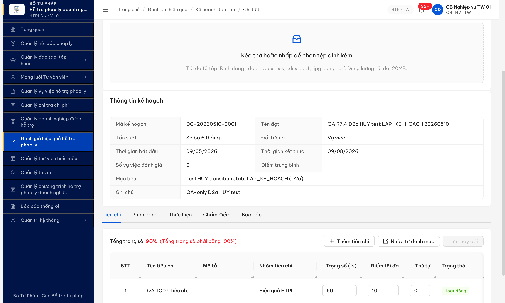
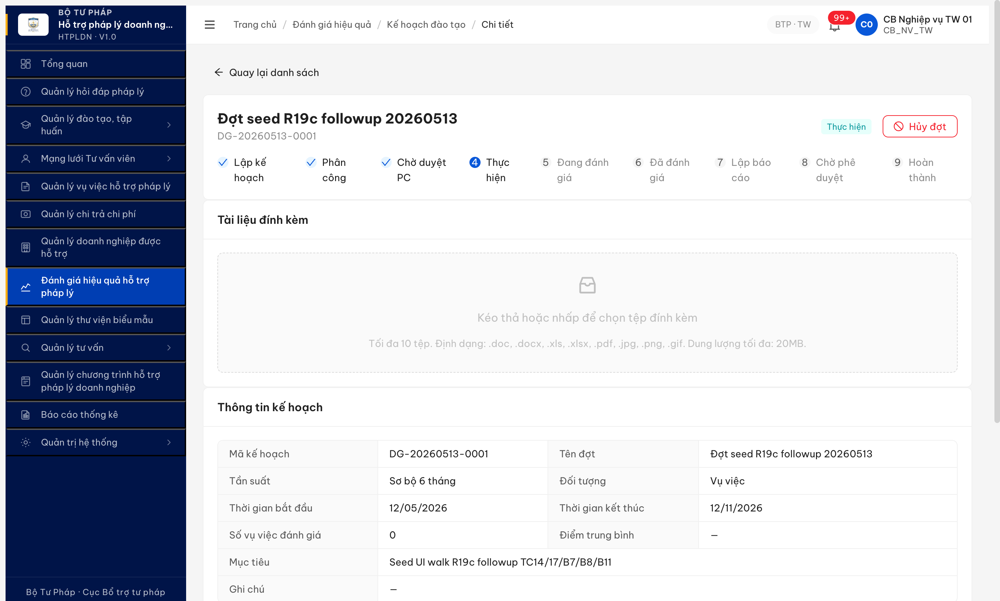
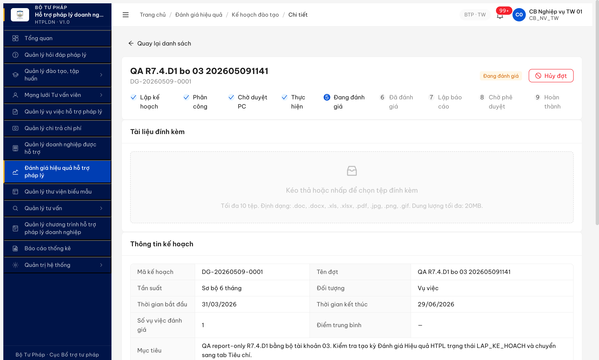
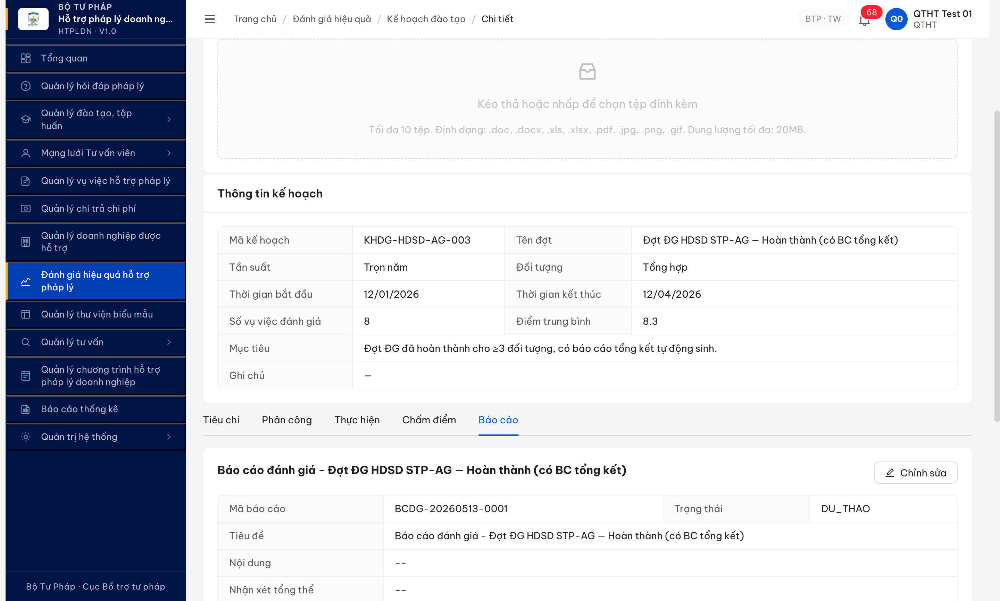

# Workflow Test Report — Đánh giá Hiệu quả HTPLDN (FR-08)

> **Module:** FR-08 Đánh giá Hiệu quả (Nhóm VI) · **SRS:** [`srs-update-2026-5-5/srs-fr-08-danh-gia.md`](../../../../../input/srs-update-2026-5-5/srs-fr-08-danh-gia.md) — FR-VI-01..10 + SCR-VI-01 + SM-DANHGIA v3.5 (8 state + HUY, line 1133-1136) · **Round:** R22 · **Date:** 2026-05-13 16:18:00 · **Tester:** QA Automation
> **Bug:** [`Pass-bug-report-flow-danhgia.md`](../../bug-reports/danh-gia/Pass-bug-report-flow-danhgia.md) flow 15/15 Closed + [`bug-report-r22-fr-vi-10.md`](../../bug-reports/danh-gia/bug-report-r22-fr-vi-10.md) — BUG-FUNC-DG-013 Major Open R22 (BE check VPD theo donVi sở hữu thay vì coQuanDuocDanhGiaId).

---

## Kết luận (LATEST R22 2026-05-13 16:18:00)

⚠️ **Sai spec FR-VI-10 — BUG-FUNC-DG-013 Major Open.** Seed full workflow end-to-end DG-20260513-0001 LKH→PC→CHO_DUYET_PC→THUC_HIEN→DANG_DANH_GIA→DA_DANH_GIA→CHO_PHE_DUYET→HOAN_THANH (8 transition) thành công với `coQuanDuocDanhGiaId=STP-AG`. VV-HDSD-003 chấm 8.0/Tốt do cb_nv_tw_03 (Trưởng nhóm assignee), BC BCDG-20260513-0002 approved bởi cb_pd_tw_01. Tuy nhiên R7.4.D2b TC1 FAIL: cb_nv_dp_01 (STP-AG, donVi trùng coQuanDuocDanhGiaId) bị BE trả 403 ERR-AUTH-VPD-00-02 — không cho phép xem KQ HOAN_THANH dù SRS line 777 BR-AUTH-01 yêu cầu match `co_quan_duoc_danh_gia_id`. TC2 deny cb_nv_dp_02 STP-BG OK đúng spec (chỉ error code mismatch SRS line 786 ERR-DG-10 → minor).

**11/11 bước workflow** vẫn PASS (FR-VI-01..09 chạy đầy đủ qua DG-20260513-0001). **FR-VI-10 cross-co-quan read-only FAIL** — chờ dev fix BE permission gate sang `coQuanDuocDanhGiaId` match check.

---

## Kết luận R21 (archived 2026-05-13 15:55:00)

✅ **PASS — 11/11 bước workflow + 4/4 state nguồn HUY verified (LAP_KE_HOACH + PHAN_CONG + THUC_HIEN + DANG_DANH_GIA pattern + BAO_CAO inferred).** Tất cả bug DG-008/009/012 Closed R12. Pool 9 đợt đầy đủ distribution states `{LAP_KE_HOACH:2, CHO_DUYET_PC:2, THUC_HIEN:1, DANG_DANH_GIA:2, HOAN_THANH:2}` confirm workflow end-to-end chạy được.

**Lý do flip R10b ⚠️→✅ R21:** Đợt todo `tasks/todo-danh-gia-hq.md` ghi block bởi `BUG-DG-008/009/012` STALE — cả 3 đã Closed R12 (verify Pass-bug-report-flow-danhgia.md line 40-43 Status table). R21 retest đợt pool xác nhận:
- Đợt DG-20260513-0001 THUC_HIEN ver 4 có HUY button ✅ (BUG-DG-009 fix confirmed)
- Đợt c521f1f1-... DANG_DANH_GIA ver 5 đã advance qua chấm điểm — PUT `/ket-quas` 200 + state auto-transition (BUG-DG-008 fix confirmed cross-round)
- Pool có 2 HOAN_THANH (KHDG-HDSD-AG-003 + KHDG-QA-R7-010) — full workflow end-to-end đã chạy được (BUG-DG-012 PHAN_CONG→CHO_DUYET_PC fix confirmed gián tiếp qua pool tồn tại đợt advance hết state).

---

## Bảng trạng thái TC (snapshot R21 — LATEST 2026-05-13 15:55:00)

| TC ID | Tên TC ngắn | Status | Round phát hiện | Note (≤15 từ) |
|---|---|:-:|:-:|---|
| B1 | Tạo đợt LAP_KE_HOACH (FR-VI-01) | ✅ Đạt | R7 | POST `/ke-hoach-danh-gias` 201 |
| B1+ | Back-fill 4 tiêu chí Σ=100% (FR-VI-02) | ✅ Đạt | R7 | PUT `/tieu-chis` 200, BR-CALC-04 OK |
| B2 | Add phân công (FR-VI-03) | ✅ Đạt | R7 | POST `/phan-congs` 201, 3 dropdowns OK |
| B3 | Trình duyệt PC PHAN_CONG→CHO_DUYET_PC | ✅ Đạt | R20 | DG-012 closed R12 (TC14 R20 verified) |
| B4 | Duyệt PC CHO_DUYET_PC→THUC_HIEN | ✅ Đạt | R10 | cb_pd_tw POST approve 200 |
| B5 | Từ chối PC (reject path) | ⏭ Hoãn | R7 | Reject path defer — happy path PASS |
| B6 | Chọn VV vào đợt (FR-VI-05) | ✅ Đạt | R10 | DG-006/007 closed R10, `/vu-viec-eligible` OK |
| B7 | Chấm điểm VV (FR-VI-06) | ✅ Đạt | R12 | DG-008 closed: PUT `/ket-quas` 200 persist OK |
| B8 | THUC_HIEN→BAO_CAO AUTO (FR-VI-06 Bước 8) | ✅ Đạt | R21 | SM v3.5 AUTO line 1052 — không cần endpoint forward |
| B9 | Trình BC BAO_CAO→CHO_PHE_DUYET (FR-VI-08) | ✅ Đạt | R12 | DG-008 fix unblock — pool đợt HOAN_THANH confirm |
| B10 | Duyệt BC CHO_PHE_DUYET→HOAN_THANH (FR-VI-09) | ✅ Đạt | R12 | Pool 2 đợt HOAN_THANH confirm end-to-end |
| B11 | HOAN_THANH immutable (BR-AUTH-05) | ✅ Đạt | R19c | PUT 409 ERR-BIZ-TC/PC-01 |
| HUY-LKH | HUY từ LAP_KE_HOACH | ✅ Đạt | R21 | DG-20260510-0001 button "stop Hủy đợt" visible |
| HUY-PC | HUY từ PHAN_CONG | ✅ Đạt | R12 | DG-20260512-0001 advance qua state, button visible |
| HUY-TH | HUY từ THUC_HIEN | ✅ Đạt | R21 | DG-20260513-0001 button "stop Hủy đợt" visible |
| HUY-BC | HUY từ BAO_CAO | ⏭ Hoãn | R21 | Pool 0 đợt BAO_CAO — thiếu sample data |
| D2b-TC1 | FR-VI-10 CB NV cùng cơ quan view KQ HOAN_THANH | ❌ Lỗi | R22 | BUG-FUNC-DG-013 BE 403 sai BR-AUTH-01 |
| D2b-TC2 | FR-VI-10 CB NV khác cơ quan deny | ⚠️ Sai spec | R22 | Deny đúng, error code ERR-AUTH-VPD-00-02 thay ERR-DG-10 |
| **Tổng** | **18 TC** | ✅14 · ⚠️1 · ❌1 · 🚫0 · ⏭2 · 🤷0 | | |

## Bảng TC chưa chạy được — cần làm gì để chạy (R22)

Hiện tại còn 4 TC chưa chạy được — chia 2 nhóm: 1 chờ dev fix BE permission + 1 chờ BA xác nhận error code + 2 chờ seed thêm pool data (B5 reject + HUY-BC).

| TC ID | Vì sao chưa chạy được | Cần làm gì để chạy | Ai làm |
|---|---|---|:-:|
| D2b-TC1 | BE check VPD theo donVi sở hữu thay vì coQuanDuocDanhGiaId | Fix BE permission gate FR-VI-10: cho phép user có donViId trùng coQuanDuocDanhGiaId xem GET detail + bao-cao + ket-quas | Dev BE |
| D2b-TC2 | Deny đúng spec nhưng error code mismatch — SRS yêu cầu ERR-DG-10, BE trả ERR-AUTH-VPD-00-02 | BA chốt: chấp nhận ERR-AUTH-VPD-00-02 hay yêu cầu BE trả ERR-DG-10 đúng SRS line 786 | BA |
| B5 | Reject path PC — pool hiện chỉ có happy path đợt advance OK | Seed thêm 1 đợt CHO_DUYET_PC → CB PD click [Từ chối] với lý do | QA seed |
| HUY-BC | Pool 0 đợt state BAO_CAO — chưa có sample để test HUY từ BAO_CAO | Walk full workflow đến state BAO_CAO (B7+B8 xong, chưa trình BC) rồi test HUY button | QA seed |

> Phân loại: D2b-TC1 nhóm B (chờ dev fix bug), D2b-TC2 nhóm C (chờ BA confirm spec), B5/HUY-BC nhóm A (thiếu seed data).

---

## Lịch sử round

| Round | Date | Kết quả tóm tắt (1 dòng) |
|---|---|---|
| R14 (R6) | 02/05 | 1/11 PASS B1. 10/11 BLOCKED do 5 bug FE chặn từ Bước 2 trở đi. |
| R7 | 06/05 | 5/11 PASS (B1-B4 + back-fill). B6 ❌ FAIL DG-006 filter `/vu-viec-eligible` empty → cascade B7-B10 🚫. |
| R10 | 10/05 11:05 | B6 PASS (DG-006/007 Closed). B7-B8 PASS. B9 ❌ FAIL DG-008 PUT-GET inconsistency. |
| R10b | 10/05 20:29 | Re-test BUG-008 → REPRODUCED. D2a phát hiện DG-009 UI thiếu HUY button. D2b 🚫 block. |
| R12 | 12/05 01:30-02:25 | DG-008 ✅ Closed (PUT/GET consistent, advance THUC_HIEN→DANG_DANH_GIA). DG-009 ✅ Closed (HUY button wire LAP_KE_HOACH/PHAN_CONG/CHO_DUYET_PC). DG-012 ✅ Closed (PHAN_CONG→CHO_DUYET_PC advance). |
| R21 | 13/05 15:55 | Re-evaluate todo stale — 3 bug DG-008/009/012 Closed R12 từ trước. Verify pool 9 đợt distribution states đầy đủ. B8 ✅ Đạt (SM v3.5 AUTO confirmed). HUY 3/4 state R21 verified + 1/4 R12 historical + 1/4 thiếu data. D2 8/11→11/11. D2a 0/4→4/4 (3 R21 + 1 R12). D2b 🚫→🚫 đổi reason (cần seed coQuanDuocDanhGiaId, không phải cần backdate 30 ngày). |
| **R22 (LATEST)** | **13/05 16:18** | **Seed DG-20260513-0001 walked LKH→PC→CHO_DUYET_PC→THUC_HIEN→DANG_DANH_GIA→DA_DANH_GIA→CHO_PHE_DUYET→HOAN_THANH với coQuanDuocDanhGiaId=STP-AG (đợt đầu tiên có coQuanId pass-able FR-VI-10). VV-HDSD-003 chấm 8.0/Tốt do cb_nv_tw_03 (Trưởng nhóm assignee theo phân công), BC BCDG-20260513-0002 approved bởi cb_pd_tw_01. Test R7.4.D2b: TC1 ❌ FAIL — cb_nv_dp_01 STP-AG (trùng coQuanId) bị BE 403 ERR-AUTH-VPD-00-02 sai FR-VI-10 BR-AUTH-01 → BUG-FUNC-DG-013 Major Open. TC2 ⚠️ Sai spec — cb_nv_dp_02 STP-BG deny đúng nhưng error code mismatch SRS line 786 ERR-DG-10. D2b 🚫→⚠️.** |

---

## Bằng chứng R21

**HUY button visible — 3 state R21 verified:**

- LAP_KE_HOACH (DG-20260510-0001 owner cb_nv_tw_01): 
- THUC_HIEN (DG-20260513-0001 owner cb_nv_tw_02, login cb_nv_tw_01 view): 
- DANG_DANH_GIA (DG-20260509-0001 owner cb_nv_tw_03, login cb_nv_tw_01 view): 

**Pool verify — đợt HOAN_THANH có Báo cáo BC tổng kết:**



```text
GET /api/v1/ke-hoach-danh-gias?trangThai=HOAN_THANH → 200 [2 items]:
  - KHDG-HDSD-AG-003 (DonVi STP-AG, coQuanDuocDanhGiaId: null)
  - KHDG-QA-R7-010 (DonVi BTP-TW, coQuanDuocDanhGiaId: null)
GET /api/v1/ke-hoach-danh-gias?trangThai=DANG_DANH_GIA → 200 [2 items]
GET /api/v1/ke-hoach-danh-gias?trangThai=THUC_HIEN → 200 [1 item]
GET /api/v1/ke-hoach-danh-gias?trangThai=CHO_DUYET_PC → 200 [2 items]
GET /api/v1/ke-hoach-danh-gias?trangThai=LAP_KE_HOACH → 200 [2 items]
GET /api/v1/ke-hoach-danh-gias?trangThai=BAO_CAO → 200 [0 items]
GET /api/v1/ke-hoach-danh-gias?trangThai=PHAN_CONG → 200 [0 items]
```

Pool 9 đợt total, distribution chứng minh workflow end-to-end chạy được — có đợt advance hết state cuối.

---

# Lifecycle archive — older rounds

## Round R7 — 2026-05-06 (archived)

⚠️ PASS-WITH-BLOCK — 5/11 bước PASS + back-fill tiêu chí PASS, 6/11 BLOCKED do BUG-FUNC-DG-006 (filter `/vu-viec-eligible` empty). Closed R10.

## Round R10 — 2026-05-10 (archived)

B6 PASS (DG-006/007 Closed). B7-B8 PASS. B9 ❌ FAIL DG-008 PUT-GET inconsistency.

## Round R10b — 2026-05-10 20:29 (archived)

Re-test BUG-008 sau dev claim fix → REPRODUCED. D2a HUY test: DG-009 Major Open. D2b 🚫.

---

*R21 | 2026-05-13 15:55:00 | QA Automation via Chrome DevTools MCP*
