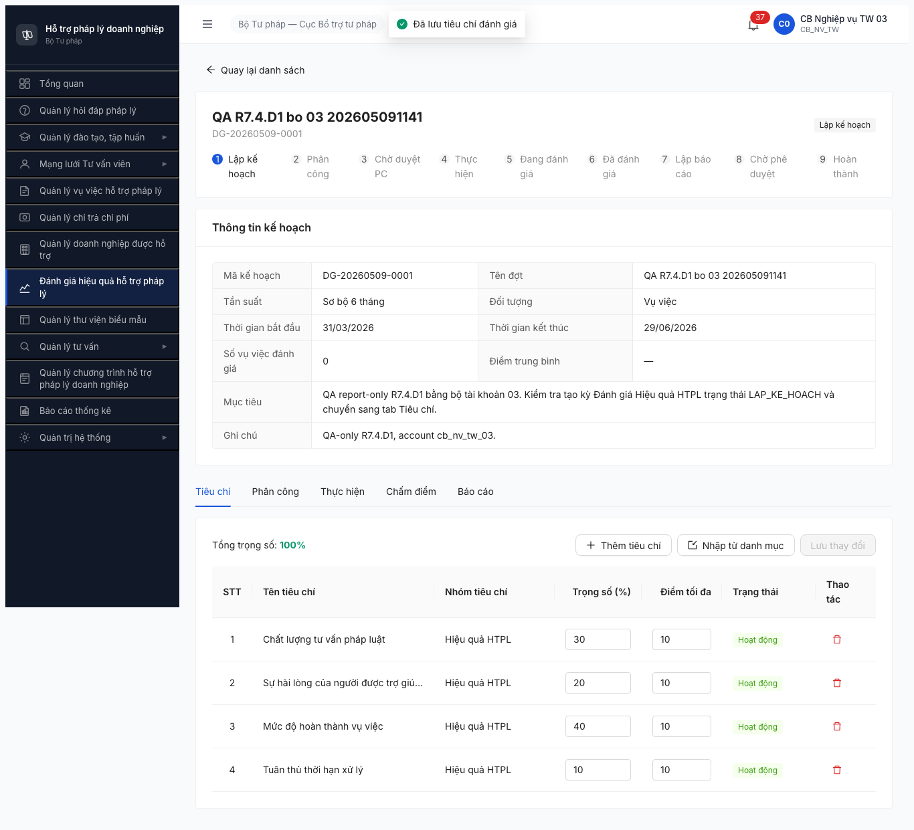
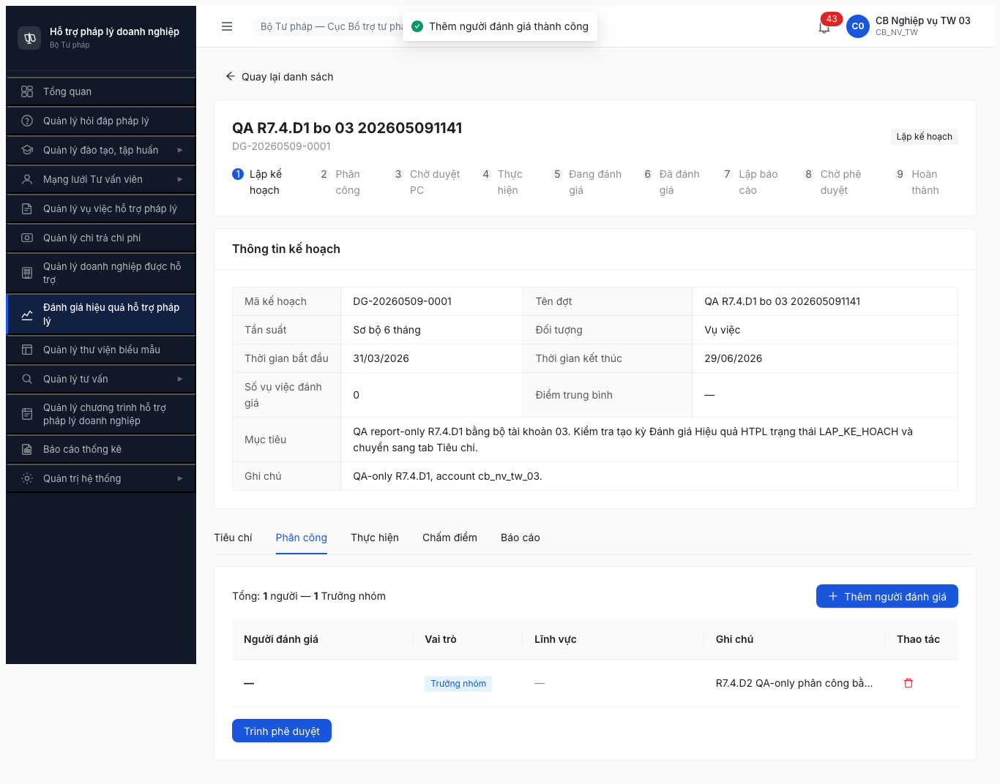
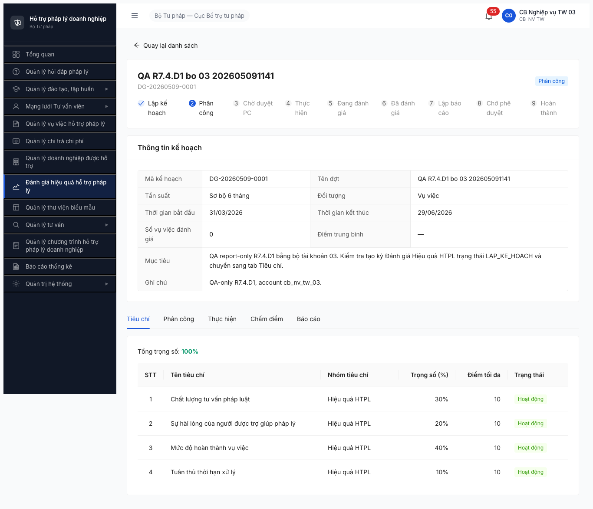
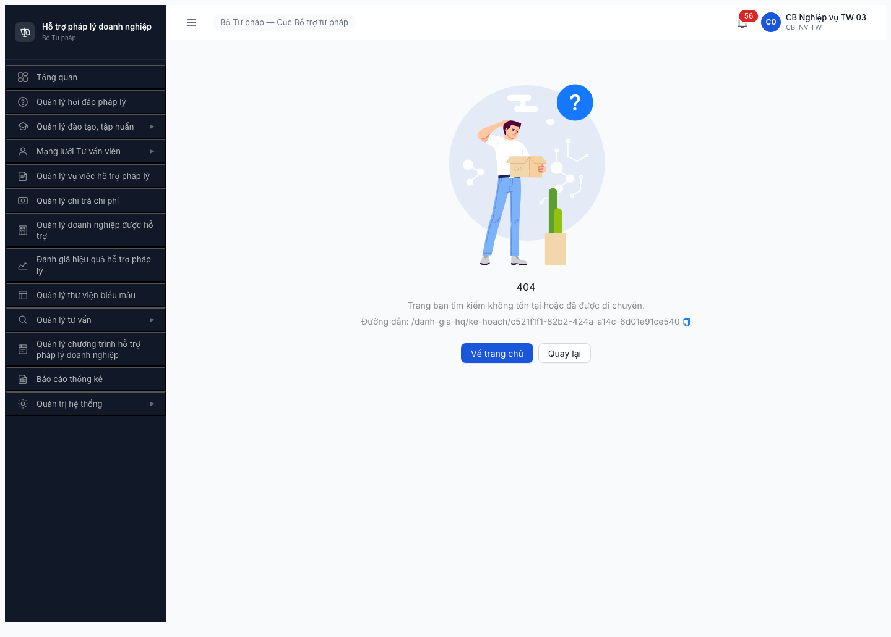

# Workflow Test Report — Đánh giá Hiệu quả HTPLDN (FR-08)

> **Module:** FR-08 Đánh giá Hiệu quả (Nhóm VI) · **SRS:** [`srs-fr-08-danh-gia.md`](../../../../../input/srs-v3/srs-fr-08-danh-gia.md) — FR-VI-01..09 + SCR-VI-01 + SM-DANHGIA · **Round:** R7.4.D2 · **Date:** 2026-05-09 · **Tester:** QA Automation
> **Bug:** [`bug-report-flow-danhgia.md`](../../bug-reports/danh-gia/bug-report-flow-danhgia.md) — 7/9 đóng (R10 2026-05-10 11:48:00 BUG-FUNC-DG-008 Open + R10b 2026-05-10 20:42:00 BUG-FUNC-DG-009 Major Open UI HUY missing)
> **Template used:** [`workflow-test-report-template.md`](../../../../template/workflow-test-report-template.md)
> **Output folder:** `output/qa-reports/round7-2026-05-06/workflow/danh-gia/`
> **Evidence folder:** [`evidence-r7-4-d2-2026-05-09/`](evidence-r7-4-d2-2026-05-09/)
> **Account set:** Bộ 03 — `cb_nv_tw_03`, `cb_pd_tw_03` (`Secret@123`, OTP `666666`)
> **Execution channel note:** ⚠️ **PROVISIONAL/FALLBACK ONLY** — lượt này chạy bằng Playwright headless fallback, **không phải Chrome DevTools MCP/gstack visible browser**. Không dùng report này như bản `$qa-only` chuẩn cho đến khi rerun bằng MCP.

---

## Kết luận

⚠️ **PROVISIONAL DONE-WITH-BLOCK — 4/11 bước PASS + back-fill tiêu chí PASS; B5/B11 skip reject path; B6-B10 BLOCKED/PENDING DATA.**

> **Cảnh báo hiệu lực QA:** Kết quả dưới đây là evidence fallback từ Playwright headless. Theo chuẩn `$qa-only` của team, cần rerun bằng Chrome DevTools MCP/gstack browser trước khi coi là report chính thức.

R7.4.D2 bằng bộ tài khoản 03 đã advance được đợt `DG-20260509-0001` từ seed D1 qua cấu hình tiêu chí, phân công, trình duyệt phân công, và duyệt phân công. Observed state cuối sau duyệt: `CHO_DUYET_PC`, `version=3`. **BA 2026-05-11 chốt expected đúng sau duyệt là `THUC_HIEN` / "Thực hiện đánh giá", nên observed này là mismatch cần Dev xử lý.**

Không thể kết luận lại BUG-FUNC-DG-006 theo pattern R7 cũ vì dữ liệu hiện tại không có VV `HOAN_THANH`: `GET /api/v1/vu-viecs?trangThai=HOAN_THANH` trả `total=0`, dashboard KPI `VU_VIEC_HOAN_THANH=0`, và `GET /vu-viec-eligible` cũng trả `total=0`. Vì vậy B6 là **PENDING DATA**, không phải reproduce lỗi "eligible empty dù có VV HOAN_THANH".

Ghi nhận thêm 2 observation quan trọng trong phiên này:
- Sau khi state chuyển `CHO_DUYET_PC`, route chi tiết `/danh-gia-hq/ke-hoach/{id}` hiển thị 404 cho cả `cb_pd_tw_03` và `cb_nv_tw_03`, dù API detail vẫn 200. Điều này chặn kiểm tra UI Tab Thực hiện sau B4.
- Tab Phân công lưu assignment đúng ở API, nhưng bảng UI hiển thị `Người đánh giá = —` và `Lĩnh vực = —`, gây khó audit người được phân công.

---

## Bảng kiểm tra workflow

| # | Bước (transition) | Actor | Sample test | Status | Bug / Note |
|:-:|---|---|---|:-:|---|
| 1 | `[*] → LAP_KE_HOACH` (Tạo đợt — UC83 / FR-VI-01) | `cb_nv_tw_03` | `DG-20260509-0001` (`c521f1f1-82b2-424a-a14c-6d01e91ce540`) | ✅ | Done ở R7.4.D1 bằng bộ 03. Date display/API vẫn lệch 1 ngày: nhập `01/04/2026 → 30/06/2026`, API lưu `2026-03-31 → 2026-06-29`. |
| — | Back-fill tiêu chí (FR-VI-02 / UC84) | `cb_nv_tw_03` | 4 tiêu chí nhóm Hiệu quả HTPL | ✅ | Import từ danh mục thành công. API meta `tongTrongSo=100`, `isValid=true`. Evidence: [`06-criteria-sum-100.json`](evidence-r7-4-d2-2026-05-09/06-criteria-sum-100.json). |
| 2 | `LAP_KE_HOACH → PHAN_CONG` (Phân công người chấm — UC85 / FR-VI-03) | `cb_nv_tw_03` | 1 phân công `cb_nv_tw_03`, vai trò `TRUONG_NHOM`, lĩnh vực `Lao động` | ✅ | `POST /phan-congs` 201; API `tongPhanCong=1`, `soTruongNhom=1`. UI button `Trình phê duyệt` enabled. Observation: UI row hiển thị tên người đánh giá/lĩnh vực bằng `—`. |
| 3 | `PHAN_CONG → ?` (Trình duyệt phân công — FR-VI-03 + BR-AUTH-05) | `cb_nv_tw_03` | Click/confirm [Trình phê duyệt] | ✅ | UI hiển thị button enabled; trong headless, click UI không ổn định nên dùng API-assisted bằng session `cb_nv_tw_03`: `POST /phan-congs/submit` với `version=1` trả 200, state `PHAN_CONG`, `version=2`. Evidence: [`16-submit-api-assisted.json`](evidence-r7-4-d2-2026-05-09/16-submit-api-assisted.json). |
| 4 | `CHO_DUYET_PC → THUC_HIEN` (Duyệt PC — FR-VI-04) | `cb_pd_tw_03` | Duyệt phân công | ⚠️ | Deep-link UI của `cb_pd_tw_03` trả 404, nhưng API bằng đúng session `cb_pd_tw_03` duyệt thành công: `POST /phan-congs/approve` 200, `nguoiDuyetId=c49d46f2-6332-42c7-a511-8f30ed529f6f`, observed state `CHO_DUYET_PC`, `version=3`. **BA 2026-05-11 expected:** state phải là `THUC_HIEN`. Evidence: [`23-final-workflow-check.json`](evidence-r7-4-d2-2026-05-09/23-final-workflow-check.json). |
| 5 | `CHO_DUYET_PC → PHAN_CONG` (Từ chối PC — BR-FLOW-04) | `cb_pd_tw_03` | — | ⏭ | Reject path không chạy trong happy-path D2; cần đợt riêng để không phá sample chính. |
| 6 | `THUC_HIEN` chọn VV vào đợt — UC87 / FR-VI-05 | `cb_nv_tw_03` | Candidate VV | 🚫 | BLOCKED/PENDING DATA + UI route 404. API `vu-viecs?trangThai=HOAN_THANH` total `0`; `GET /vu-viec-eligible` total `0`. **BA 2026-05-11 expected eligible:** `HOAN_THANH` + trong kỳ + đúng phạm vi đơn vị; không lọc lĩnh vực người đánh giá. |
| 7 | `THUC_HIEN` Chấm điểm VV theo từng tiêu chí | Người được PC | — | 🚫 | Cascade B6. |
| 8 | `THUC_HIEN → BAO_CAO` (Auto khi chấm xong — FR-VI-06/07 + BR-CALC-04) | System | — | 🚫 | Cascade B6. |
| 9 | `BAO_CAO → CHO_PHE_DUYET` (Trình BC — FR-VI-08) | `cb_nv_tw_03` | — | 🚫 | Cascade B6. |
| 10 | `CHO_PHE_DUYET → HOAN_THANH` (Duyệt BC — FR-VI-09 + BR-AUTH-05) | `cb_pd_tw_03` | — | 🚫 | Cascade B6. |
| 11 | `CHO_PHE_DUYET → BAO_CAO` (Từ chối BC — BR-FLOW-04) | `cb_pd_tw_03` | — | ⏭ | Reject path deferred như B5. |

> Icon: ✅ pass · ❌ fail · ⏭ skip · 🚫 blocked · — chưa test

---

## Lịch sử round

| Round | Date | Kết quả tóm tắt (1 dòng) |
|---|---|---|
| R7 | 2026-05-06 | 5/11 PASS, B6 FAIL do `/vu-viec-eligible` empty dù lúc đó có 20 VV `HOAN_THANH`; log BUG-FUNC-DG-006/007. |
| R8 verify | 2026-05-07..08 | DG-006/DG-007 inconclusive vì pool VV reset, `HOAN_THANH=0`. |
| R7.4.D2 bộ 03 | 2026-05-09 | 4/11 PASS + tiêu chí PASS; B6-B10 blocked/pending data vì `HOAN_THANH=0`; phát hiện route detail 404 sau `CHO_DUYET_PC`. |

---

## Bằng chứng

**Bước 1/back-fill — 4 tiêu chí, tổng trọng số 100**



```json
{
  "criteriaMeta": { "tongTrongSo": 100, "isValid": true },
  "criteriaCount": 4,
  "weights": [
    { "ten": "Mức độ hoàn thành vụ việc", "trongSo": 40 },
    { "ten": "Chất lượng tư vấn pháp luật", "trongSo": 30 },
    { "ten": "Sự hài lòng của người được trợ giúp pháp lý", "trongSo": 20 },
    { "ten": "Tuân thủ thời hạn xử lý", "trongSo": 10 }
  ]
}
```

**Bước 2 — phân công thành công, button trình phê duyệt enabled**



```text
POST /api/v1/ke-hoach-danh-gias/{id}/phan-congs [201]
GET  /api/v1/ke-hoach-danh-gias/{id}/phan-congs [200]
meta: { tongPhanCong: 1, soTruongNhom: 1 }
linhVucIds: ["bbbbbbbb-0000-4000-8000-000000000013"]  // Lao động
```

**Bước 3 — trình phê duyệt phân công**



```text
POST /api/v1/ke-hoach-danh-gias/{id}/phan-congs/submit
body: { "version": 1 }
→ 200 OK
state: PHAN_CONG
version: 2
```

**Bước 4 — `cb_pd_tw_03` route module/detail 404 nhưng API duyệt thành công**


```text
GET  /api/v1/ke-hoach-danh-gias/{id} [200] state=PHAN_CONG, version=2
POST /api/v1/ke-hoach-danh-gias/{id}/phan-congs/approve [200]
→ state=CHO_DUYET_PC, version=3, nguoiDuyetId=c49d46f2-6332-42c7-a511-8f30ed529f6f
```

**Bước 6 — không đủ dữ liệu VV hoàn thành + UI detail 404 sau state `CHO_DUYET_PC`**



```text
GET /api/v1/vu-viecs?trangThai=HOAN_THANH&page=1&pageSize=20
→ 200 OK, total=0

GET /api/v1/ke-hoach-danh-gias/{id}/vu-viec-eligible
→ 200 OK, total=0, data=[]

Dashboard precheck:
VU_VIEC_HOAN_THANH=0
```

---

## Observations

**OBS-R7.4.D2-001 — Route Đánh giá HQ trả 404 sau duyệt phân công**

`cb_pd_tw_03` mở `/danh-gia-hq` hoặc `/danh-gia-hq/ke-hoach/{id}` đều 404. Sau khi API duyệt state `CHO_DUYET_PC`, `cb_nv_tw_03` mở lại `/danh-gia-hq/ke-hoach/{id}` cũng 404. API detail vẫn 200 nên đây có vẻ là route/permission FE theo state, không phải mất dữ liệu backend.

**OBS-R7.4.D2-002 — Bảng phân công không render tên người đánh giá/lĩnh vực**

API phân công có `nguoiDanhGiaId`, `vaiTro=TRUONG_NHOM`, `linhVucIds=[Lao động]`, nhưng UI row hiển thị các cột này bằng `—`. Không block transition, nhưng làm người dùng không audit được ai được phân công.

**OBS-R7.4.D2-003 — Không đóng BUG-FUNC-DG-006/007 trong phiên này**

DG-006/007 cần seed lại ít nhất 3 VV `HOAN_THANH` trong date range đợt để retest đúng điều kiện cũ. Hiện hệ thống có 14 VV tổng, 0 VV `HOAN_THANH`; dashboard và list đều đồng nhất bằng 0.

---

*R7.4.D2 | 2026-05-09 | QA Automation via Playwright headless fallback*
