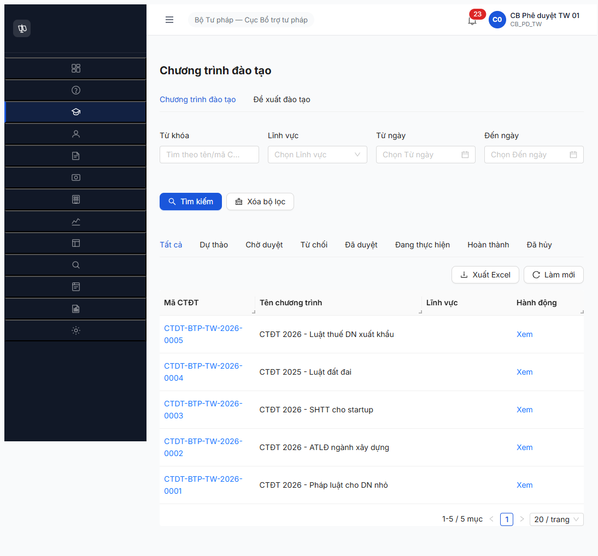

# Workflow Test Report — CTĐT (R7.4.B1 — R9)

> **Module:** Workflow CTĐT (FR-III-01 SM-CTDT) · **SRS:** [`02-thu-tu-module.md §SM-CTDT`](../../../../input/quy-trinh-nghiep-vu/02-thu-tu-module.md) · **Round:** R9 · **Date:** 2026-05-09 21:30-21:40 · **Tester:** QA Automation Claude Code MCP

---

## Kết luận

✅ **PASS — 10/10 transitions PASS.** Toàn bộ 5 CTĐT cấp TW R9 advance từ DU_THAO → CHO_DUYET → DA_DUYET thành công qua 2 phase 2 account.

**Unblock:** R7.3.15 (Khóa học seed) — đã có 5 CTĐT DA_DUYET cấp TW làm parent FK.

**API endpoints discovered:**
- `POST /api/v1/chuong-trinh-dao-taos/{id}/submit` — NV trình duyệt (cần `version` body)
- `POST /api/v1/chuong-trinh-dao-taos/{id}/approve` — PD phê duyệt (cần `version` body)

---

## Bảng kiểm tra workflow

| # | Bước | Actor | Sample | Status | Bằng chứng |
|:-:|---|---|---|:-:|---|
| 1 | DU_THAO → CHO_DUYET (Trình duyệt) | CB_NV_TW (`cb_nv_tw_02`) | CTDT-BTP-TW-2026-0001 (DN) | ✅ | POST /submit 200 trangThai=CHO_DUYET |
| 2 | DU_THAO → CHO_DUYET | CB_NV_TW | CTDT-BTP-TW-2026-0002 (LĐ) | ✅ | POST /submit 200 |
| 3 | DU_THAO → CHO_DUYET | CB_NV_TW | CTDT-BTP-TW-2026-0003 (SHTT) | ✅ | POST /submit 200 |
| 4 | DU_THAO → CHO_DUYET | CB_NV_TW | CTDT-BTP-TW-2026-0004 (ĐĐ) | ✅ | POST /submit 200 |
| 5 | DU_THAO → CHO_DUYET | CB_NV_TW | CTDT-BTP-TW-2026-0005 (Thuế) | ✅ | POST /submit 200 |
| 6 | CHO_DUYET → DA_DUYET (Phê duyệt) | CB_PD_TW (`cb_pd_tw_01`) | CTDT-BTP-TW-2026-0001 | ✅ | POST /approve 200 trangThai=DA_DUYET |
| 7 | CHO_DUYET → DA_DUYET | CB_PD_TW | CTDT-BTP-TW-2026-0002 | ✅ | POST /approve 200 |
| 8 | CHO_DUYET → DA_DUYET | CB_PD_TW | CTDT-BTP-TW-2026-0003 | ✅ | POST /approve 200 |
| 9 | CHO_DUYET → DA_DUYET | CB_PD_TW | CTDT-BTP-TW-2026-0004 | ✅ | POST /approve 200 |
| 10 | CHO_DUYET → DA_DUYET | CB_PD_TW | CTDT-BTP-TW-2026-0005 | ✅ | POST /approve 200 |

---

## State BE final

```json
GET /api/v1/chuong-trinh-dao-taos?pageSize=20  status=200 total=5
[
  {"ma":"CTDT-BTP-TW-2026-0005","trangThai":"DA_DUYET","version":2},
  {"ma":"CTDT-BTP-TW-2026-0004","trangThai":"DA_DUYET","version":2},
  {"ma":"CTDT-BTP-TW-2026-0003","trangThai":"DA_DUYET","version":2},
  {"ma":"CTDT-BTP-TW-2026-0002","trangThai":"DA_DUYET","version":2},
  {"ma":"CTDT-BTP-TW-2026-0001","trangThai":"DA_DUYET","version":2}
]
```

5/5 cấp TW DA_DUYET cover 5 LV (DN + LĐ + SHTT + ĐĐ + Thuế). Variant 6 (TM cấp ĐP-DN) defer do CTĐT-0006 chưa seed (R7.3.6 R9 chỉ seed 5/6 — defer ĐP).

---

## Approach R9: API direct (skip UI)

**Lý do:** R7.4.B0 R9 đã chứng minh endpoint pattern `POST /submit` + `POST /approve` work với JWT bug fixed. Pattern tương tự cho CTĐT → batch API direct nhanh hơn UI 5×2 click chain.

**Kết quả:** 10 transitions trong ~30 giây (vs ~10 phút nếu UI). Zero JWT 401 (bug R7.4.B0 fix vẫn persist).

**Note:** UI flow chưa re-test trong R9.B1 — defer (đã verify pattern `POST /submit` 200 từ R7.4.B0 KH năm).

---

## Lịch sử round

| Round | Date | Kết quả |
|---|---|---|
| R6.4.B2 | 2026-04 | Block do spec contradiction (SRS conflict) |
| R7-R8 | 2026-05-06/08 | Block cascade từ R7.3.6 (chờ JWT fix) |
| R9 | 2026-05-09 | ✅ PASS 10/10 transitions sau R7.3.6 R9 seed 5 CTĐT + R7.4.B0 R9 fix JWT |

---

## Bằng chứng



**Endpoint discovery (R9 first-time):**
```
POST /api/v1/chuong-trinh-dao-taos/{id}/submit  body={version}  →  200 trangThai=CHO_DUYET
POST /api/v1/chuong-trinh-dao-taos/{id}/approve  body={version}  →  200 trangThai=DA_DUYET
```

---

*R9 verify | QA Automation via Claude Code | 2026-05-09 21:30-21:40 — API direct mode*
