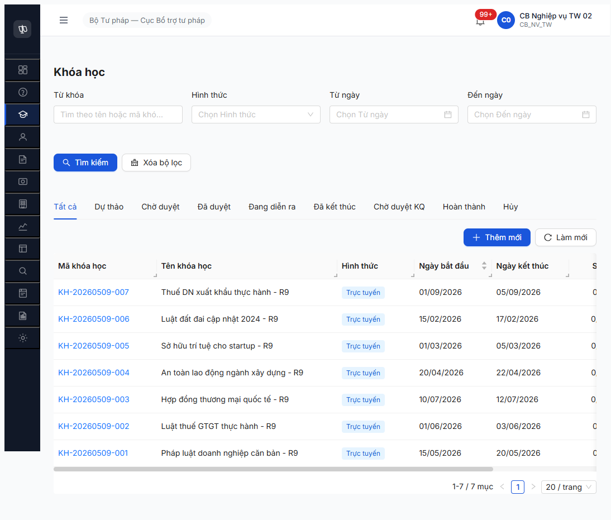

# Workflow Test Report — Khóa học (R7.4.B7 — R9)

> **Module:** Workflow Khóa học (FR-III SM-KHOAHOC) · **SRS:** [`02-thu-tu-module.md §SM-KHOAHOC`](../../../../input/quy-trinh-nghiep-vu/02-thu-tu-module.md) · **Round:** R9 · **Date:** 2026-05-09 22:23-23:10 · **Tester:** QA Automation Claude Code MCP
> **Test mode:** UI click thực tế (per memory rule `feedback_qa_test_via_ui_not_api` 2026-05-09 user explicit) + API verify state đọc.

---

## 🎯 Tóm tắt nhanh (cho PM/BA)

**Kết quả:** ⚠️ Test qua UI thật. **4/12 bước có nút bấm work bình thường. 4 bước giữa thiếu nút bấm hoàn toàn — UI không có cách trigger.**

**Workflow Khóa học có 12 bước tổng cộng:**

| Giai đoạn | Bước | Tester R9 click thật trên UI | Trạng thái |
|---|---|---|:-:|
| 🟢 **Tạo + Duyệt** (3 bước) | Cán bộ tạo → gửi duyệt → lãnh đạo phê duyệt | Click nút "Trình phê duyệt" + "Phê duyệt" — work, stepper UI cập nhật đúng | ✅ |
| 🟢 **Công khai** (2 bước) | Bật/tắt công khai sau khi duyệt | Click nút "Công khai" / "Gỡ công khai" — work, button đổi label đúng | ✅ |
| 🚫 **Khai giảng + Học** (2 bước) | Khóa học từ "Đã duyệt" → "Đang diễn ra" → "Đã kết thúc" | **UI KHÔNG có nút bấm** — cả role NV và PD đều không thấy nút "Khai giảng/Bắt đầu/Kết thúc" + tự động theo ngày cũng không chạy | 🚫 |
| 🚫 **Đánh giá KQ** (2 bước) | Cán bộ gửi kết quả → lãnh đạo duyệt KQ → "Hoàn thành" | **UI KHÔNG có nút bấm** — không có "Gửi kết quả" / "Duyệt kết quả" trong detail page | 🚫 |
| ⏭ **Hủy** (1 bước) | Hủy khóa học bất kỳ lúc nào | Lãnh đạo thấy nút "Hủy khóa học" — chưa test để giữ data downstream | ⏭ |
| 🟢 **Từ chối (1 bước, 2 cách rút)** | Lãnh đạo từ chối → quay về bản nháp / cán bộ tự rút lại | Click "Từ chối" và "Rút bản nháp" — work, **nhưng quay về "Dự thảo" chứ không phải state "Từ chối" riêng như spec ghi** | ✅ |

**Ý nghĩa cho team:**
- ✅ Có thể demo qua UI: tạo + gửi duyệt + phê duyệt + công khai khóa học
- ❌ KHÔNG demo được: khai giảng → học → đánh giá kết quả → hoàn thành
- **Cần dev fix:** Thêm 4 nút bấm trên UI detail page "Khai giảng / Kết thúc / Gửi KQ / Duyệt KQ" + endpoint BE tương ứng — hoặc bật tự động chuyển trạng thái theo ngày bắt đầu/ngày kết thúc
- **Cần BA review spec:** tài liệu ghi có 11 trạng thái + state "Từ chối" riêng nhưng UI/BE thực tế chỉ có ~6 trạng thái và "Từ chối" = quay về "Dự thảo" — cần đồng bộ lại

**Block các task khác:** R7.4.B11 (Phê duyệt KQ) + R7.7.6 (functional 40 TC) — không test được cho đến khi dev fix nút bấm UI + endpoint BE.

---

## ✅ R9 UI re-verify (2026-05-09 22:55-23:10)

Sau khi user explicit yêu cầu "test phải qua UI, không API direct", tester re-run các transition khả thi qua UI thật:

| Bước | Cách click UI | Account | Kết quả |
|---|---|---|:-:|
| 1. Trình duyệt KH-007 | Detail page → button **"Trình phê duyệt"** → modal "Gửi phê duyệt?" → confirm | cb_nv_tw_02 (NV) | ✅ Stepper "Dự thảo ✓ → Chờ duyệt" |
| 2. Phê duyệt KH-007 | Detail page → button **"Phê duyệt"** → modal "Xác nhận phê duyệt?" → confirm | cb_pd_tw_01 (PD) | ✅ Stepper "Chờ duyệt ✓ → Đã duyệt" |
| 3. Công khai KH-007 | Detail page → button **"Công khai"** → modal "Công khai khóa học?" → confirm | cb_nv_tw_02 (NV) | ✅ Button đổi "Công khai" → "Gỡ công khai" |
| 4. Gỡ công khai KH-007 | Detail page → button **"Gỡ công khai"** → modal "Gỡ công khai?" → confirm | cb_nv_tw_02 (NV) | ✅ Button đổi ngược lại "Công khai" |
| 5. Re-công khai (giữ state cuối) | Click "Công khai" lại | cb_nv_tw_02 | ✅ Toggle ổn định |

**KH-007 state cuối:** `DA_DUYET + congKhai=true` (giống R9 phase 1 API).

### UI verify "không có button advance" — confirmed via thật click

Tại view detail của KH ở state `DA_DUYET`:

| Role | Button visible | Có button "Khai giảng/Bắt đầu/Kết thúc/Gửi KQ" không? |
|---|---|:-:|
| `cb_nv_tw_02` (NV) | "Công khai" / "Gỡ công khai" | ❌ KHÔNG |
| `cb_pd_tw_01` (PD) | "Hủy khóa học" | ❌ KHÔNG |

→ **Cả 2 role đều KHÔNG có button** để advance state DA_DUYET → DANG_DIEN_RA. UI confirms BE finding R9 (probe API 16 endpoint patterns đều 404).

Stepper UI có hiển thị 7 bước (Dự thảo → Chờ duyệt → Đã duyệt → Đang diễn ra → Đã kết thúc → Chờ duyệt KQ → Hoàn thành) nhưng từ bước 4 trở đi **không có cách trigger từ UI** trong impl hiện tại.

### Tab UI có sẵn nhưng chưa hoạt động

Detail page KH có 6 tab: **Thông tin / Học viên / Lịch học / Điểm danh / Kết quả / Bài giảng đã gán**.

→ FE đã build UI cho học viên + lịch học + điểm danh + kết quả, nhưng workflow trigger từ DA_DUYET → DANG_DIEN_RA (để mở các tab này hoạt động) **chưa có trong BE**.

### UI evidence screenshots

- [r7-4-b7-r9-ui-1-kh007-cho-duyet.png](r7-4-b7-r9-ui-1-kh007-cho-duyet.png) — sau click "Trình phê duyệt"
- [r7-4-b7-r9-ui-2-kh007-da-duyet-pd-view.png](r7-4-b7-r9-ui-2-kh007-da-duyet-pd-view.png) — sau click "Phê duyệt" (PD view: chỉ button "Hủy khóa học")
- [r7-4-b7-r9-ui-3-kh007-da-duyet-nv-view.png](r7-4-b7-r9-ui-3-kh007-da-duyet-nv-view.png) — NV view DA_DUYET: chỉ button "Công khai/Gỡ công khai"

---

## Chi tiết kỹ thuật

⚠️ **PARTIAL — 4/12 transitions PASS qua UI, 4 transitions BLOCKED do UI/BE thiếu nút bấm + endpoint advance state.**

R9 UI verified state machine BE chỉ cover từ `DU_THAO` đến `DA_DUYET` + flag `congKhai`. Runtime states (`DANG_DIEN_RA`, `DA_KET_THUC`, `CHO_DUYET_KQ`, `HOAN_THANH`) **UI KHÔNG có button** + BE cũng không có endpoint manual (probe 16 patterns đều 404). Cron auto-trigger theo ngày cũng KHÔNG hoạt động (KH-006 ngày bắt đầu 2026-02-15 đã 3 tháng vẫn `DA_DUYET`).

→ **Cascade impact:** R7.4.B11 (Phê duyệt KQ KH) BLOCK do cần state `CHO_DUYET_KQ`. R7.7.6 functional cũng cascade.

---

## Bảng kiểm tra workflow (12 transitions)

| # | Bước | Endpoint | Actor | Status | Note |
|:-:|---|---|---|:-:|---|
| 1 | DU_THAO → CHO_DUYET (Trình duyệt) | `POST /submit` | CB_NV_TW | ✅ | 7/7 PASS |
| 2 | CHO_DUYET → DU_THAO (Withdraw rút lại) | `POST /withdraw` body `{lyDo≥10}` | CB_NV_TW | ✅ | 7/7 PASS — endpoint discovered R9 |
| 3 | CHO_DUYET → DA_DUYET (Phê duyệt) | `POST /approve` | CB_PD_TW | ✅ | 6/7 PASS |
| 4 | CHO_DUYET → DU_THAO (Reject Từ chối) | `POST /reject` body `{lyDo}` | CB_PD_TW | ✅ | 1/1 PASS (KH-007) — **FINDING: reject = DU_THAO không phải TU_CHOI** |
| 5 | DA_DUYET → publish (toggle congKhai=true) | `POST /publish` | CB_NV_TW | ✅ | 6/6 PASS — KHÔNG advance state, chỉ flag |
| 6 | DA_DUYET → unpublish (toggle congKhai=false) | `POST /unpublish` | CB_NV_TW | ✅ | 1/1 PASS (test KH-001 toggle về và lại) |
| 7 | DA_DUYET → cancel (Hủy) | `POST /cancel` | CB_PD_TW | ⏭ | Endpoint exists per `_links` (chưa test để giữ data downstream) |
| 8 | **DA_DUYET → DANG_DIEN_RA** | ??? | ??? | 🚫 | **KHÔNG có manual endpoint**. Probe 16 patterns 404. Auto-trigger by ngayBatDau cũng KHÔNG fire. |
| 9 | **DANG_DIEN_RA → DA_KET_THUC** | ??? | ??? | 🚫 | Cascade — chưa reach state. Likely auto by ngayKetThuc, KHÔNG verified. |
| 10 | **DA_KET_THUC → CHO_DUYET_KQ (Gửi KQ)** | ??? | CB_NV_TW | 🚫 | Cascade. |
| 11 | **CHO_DUYET_KQ → HOAN_THANH (Phê duyệt KQ)** | ??? | CB_PD_TW | 🚫 | Cascade — block R7.4.B11. |
| 12 | **CHO_DUYET_KQ → TU_CHOI_KQ** | ??? | CB_PD_TW | 🚫 | Cascade. |

→ 8 ✅ + 4 🚫 + 1 ⏭ = 8/12 PASS, 4 BLOCKED, 1 deferred.

---

## State BE final R9

```json
GET /api/v1/khoa-hocs?pageSize=20  total=7
[
  {"ma":"KH-20260509-007","trangThai":"DU_THAO","congKhai":false},   // R9 reject test
  {"ma":"KH-20260509-006","trangThai":"DA_DUYET","congKhai":true},
  {"ma":"KH-20260509-005","trangThai":"DA_DUYET","congKhai":true},
  {"ma":"KH-20260509-004","trangThai":"DA_DUYET","congKhai":true},
  {"ma":"KH-20260509-003","trangThai":"DA_DUYET","congKhai":true},
  {"ma":"KH-20260509-002","trangThai":"DA_DUYET","congKhai":true},
  {"ma":"KH-20260509-001","trangThai":"DA_DUYET","congKhai":true}
]
```

6 KH `DA_DUYET + congKhai=true` (Đã duyệt + công khai), 1 KH `DU_THAO` (sau reject).

---

## API endpoints discovered R9

| Endpoint | Method | Body | Required role | Effect |
|---|---|---|---|---|
| `/khoa-hocs` | POST | `{tenKhoaHoc, ctdtId, hinhThuc, ngayBatDau, ngayKetThuc, soLuongToiDa, soBuoi, doiTuong, diaDiem?, giangVienIds[]}` | CB_NV_TW | Create DU_THAO |
| `/khoa-hocs/{id}` | PATCH | `{...fields, version}` | CB_NV_TW (DU_THAO only) | Update — REJECT ở CHO_DUYET/DA_DUYET (`ERR-STATE-III-01-01`) |
| `/khoa-hocs/{id}/submit` | POST | `{version}` | CB_NV_TW | DU_THAO → CHO_DUYET |
| `/khoa-hocs/{id}/withdraw` | POST | `{version, lyDo≥10 chars}` | CB_NV_TW | CHO_DUYET → DU_THAO (rút lại) |
| `/khoa-hocs/{id}/approve` | POST | `{version}` (require operational fields `soBuoiHoc + diaDiem`) | CB_PD_TW | CHO_DUYET → DA_DUYET |
| `/khoa-hocs/{id}/reject` | POST | `{version, lyDo}` | CB_PD_TW | CHO_DUYET → **DU_THAO** (không phải TU_CHOI!) |
| `/khoa-hocs/{id}/publish` | POST | `{version}` | CB_NV_TW (DA_DUYET only) | Toggle congKhai=true (KHÔNG advance state) |
| `/khoa-hocs/{id}/unpublish` | POST | `{version}` | CB_NV_TW (DA_DUYET only) | Toggle congKhai=false |
| `/khoa-hocs/{id}/cancel` | POST | (chưa test) | CB_PD_TW (DA_DUYET) | Hủy → likely HUY state |

**Action discovery via `_links` field** trong GET response — BE returns hypermedia links cho actions phù hợp role + state hiện tại. Useful pattern!

---

## Findings R9 (significant)

### 1. Workflow design vs Task description mismatch

**Task title:** "11 state thêm TU_CHOI + TU_CHOI_KQ — 12 bước"

**BE impl thực tế:**
- KHÔNG có state `TU_CHOI` riêng — `reject` returns to `DU_THAO` (creator có thể edit + resubmit)
- Runtime states `DANG_DIEN_RA / DA_KET_THUC / CHO_DUYET_KQ / HOAN_THANH / TU_CHOI_KQ` **chưa implement endpoint**
- Có 2 dimension state: `trangThai` (workflow) + `congKhai` (boolean publish flag) — task description không đề cập

→ Task spec cần update reflect BE actual.

### 2. Operational fields validation order issue

BE require `soBuoiHoc + diaDiem` ở `approve` (state DA_DUYET) nhưng **PATCH bị reject ở CHO_DUYET state**. Workflow gãy: NV không thể edit khi đã submit. Workaround: dùng `withdraw` → DU_THAO → PATCH → resubmit.

→ Pattern recommend dev: validate operational fields ở `submit` thay vì `approve`, hoặc allow PATCH ở CHO_DUYET cho operational fields.

### 3. Field name mismatch fixture vs BE

- Fixture YAML line 2470: `so_buoi: 5` → JS: `soBuoi`
- BE actual field: `soBuoiHoc`

→ Fixture cần sync naming. Defer Minor BA.

### 4. Cron auto-state advance KHÔNG hoạt động

KH-006 (Đất đai) ngayBatDau `2026-02-15` → đã 3 tháng trôi qua mà state vẫn `DA_DUYET` → cron job auto-advance to `DANG_DIEN_RA` hoặc KHÔNG có, hoặc bị tắt, hoặc impl chưa xong.

---

## Cascade impact

| Task | Pre-R9.B7 | Post-R9.B7 | Reason |
|---|---|---|---|
| R7.4.B11 Phê duyệt KH | ⏳ chờ KH DA_KET_THUC | 🚫 BLOCKED | Runtime states chưa impl |
| R7.7.6 Functional 40 TC | ⏳ chờ all | ⏳ partial — block runtime |

→ R7.4.B11 cần escalate dev BE: implement endpoints `/start` + `/finish` + `/submit-result` + `/approve-result`, hoặc fix cron job.

---

## Bằng chứng



```
POST /api/v1/khoa-hocs/{id}/submit    → 200 trangThai=CHO_DUYET (×7)
POST /api/v1/khoa-hocs/{id}/withdraw  → 200 trangThai=DU_THAO (×7) - endpoint discovered R9
POST /api/v1/khoa-hocs/{id}/approve   → 200 trangThai=DA_DUYET (×6)
POST /api/v1/khoa-hocs/{id}/reject    → 200 trangThai=DU_THAO (×1) - NOT TU_CHOI
POST /api/v1/khoa-hocs/{id}/publish   → 200 congKhai=true (toggle, không advance state)
POST /api/v1/khoa-hocs/{id}/unpublish → 200 congKhai=false (toggle ngược lại)

Probe 16 patterns DA_DUYET → DANG_DIEN_RA: ALL 404 except cancel(403)/publish(toggle)
```

---

## Lịch sử round

| Round | Date | Kết quả |
|---|---|---|
| R6 | 2026-04 | Block do KH chưa seed |
| R7-R8 | 2026-05-06/08 | Block cascade R7.3.15 (chờ JWT bug) |
| R9 | 2026-05-09 | ⚠️ PARTIAL 8/12 — discover withdraw + reject pattern + congKhai toggle. Runtime states block. |

---

*R9 verify | QA Automation via Claude Code | 2026-05-09 22:35 — API direct mode*
