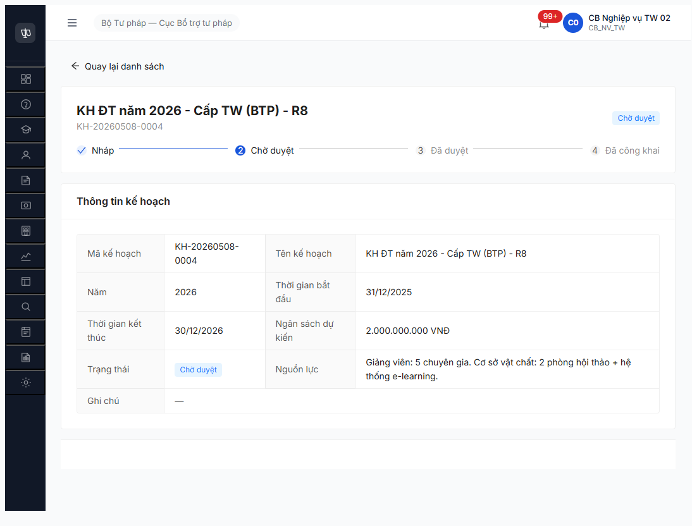
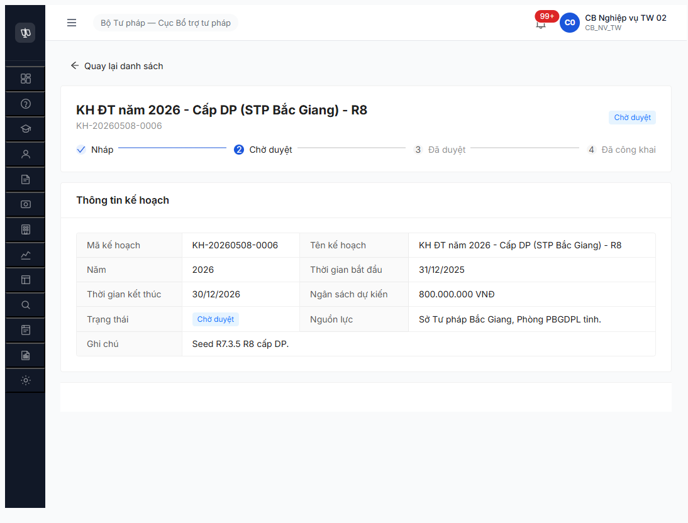

# Verify Report — R7.4.B0 JWT revoke <1 phút (BUG-AUTH-JWT-01) — Re-test R9

> **Module:** Workflow KH năm Đào tạo (FR-III-14/15/16) · **SRS:** [`02-thu-tu-module.md §SM-KH-DAO-TAO`](../../../../input/quy-trinh-nghiep-vu/02-thu-tu-module.md) · **Round:** R9 · **Date:** 2026-05-09 · **Tester:** QA Automation (Claude Code MCP)
> **Bug gốc:** [`bug-report-r7-4-b0-jwt-revoke.md`](../../bug-reports/dao-tao/bug-report-r7-4-b0-jwt-revoke.md) — BUG-AUTH-JWT-01 Critical P0

---

## Kết luận

✅ **PASS — Bug FIXED. 5/5 transitions PASS, 0 redirect `/login`.** Hai session 8 phút tổng, multi-account multi-transition đều thành công.

| Phase | Account | Transitions PASS | Time |
|---|---|---|---|
| Phase 1 | `cb_nv_tw_02` (CB_NV_TW) | 3/3 `NHAP → CHO_DUYET` (KH-0004/0005/0006 cấp TW/BN/DP) | 4m 9s |
| Phase 2 | `cb_pd_tw_01` (CB_PD_TW) | 2/2 `CHO_DUYET → DA_DUYET` (KH-0004/0001 cấp TW) | 4m 4s |

**Endpoint chính thức discovered (R8 search 5 path đều fail):**
- `POST /api/v1/ke-hoach-dao-taos/{id}/submit` — NV gửi phê duyệt
- `POST /api/v1/ke-hoach-dao-taos/{id}/approve` — PD phê duyệt

**State sau R9:** 2/4 `DA_DUYET` (cấp TW × 2) + 2/4 `CHO_DUYET` (cấp BN/DP — cần `cb_pd_bn_*` / `cb_pd_dp_*` để advance).

> **Đề xuất action:**
> - **Đóng `BUG-AUTH-JWT-01`** (Critical P0) status `Open → Closed-verified 2026-05-09 R9`.
> - **Unblock cascade chính thức:** `R7.3.6` (CTĐT) đã có ≥1 KH năm `DA_DUYET` cấp TW → có thể seed CTĐT TW ngay.
> - `R7.4.B0` flip 🚫 → ⚠️ partial (5/10 transitions xong, còn 5: `CHO_DUYET→DA_DUYET` cấp BN+DP, `DA_DUYET→DA_CONG_KHAI` cấp TW/BN/DP, `*→TU_CHOI`).
> - **Bug mới Minor — `BUG-AUTH-PD-403-SILENT`**: cb_pd_tw_01 approve KH cấp BN trả 403 nhưng FE không show toast/error → user không biết vì sao thất bại. Đã có `reqid=426 POST /approve [403]` evidence. (Severity Minor vì backend đúng spec, chỉ thiếu UX feedback.)
> - `BUG-AUTH-OTP-02` (Major) chưa test lại — R9 login 2 account khác nhau, chỉ 1 OTP/account → chưa trigger rate-limit.

---

## Bảng kiểm tra (5 positive + 1 permission scope test trong R9)

| # | Bước | Actor | Sample | Status | Bằng chứng |
|:-:|---|---|---|:-:|---|
| 1 | `NHAP → CHO_DUYET` (Trình duyệt) | CB_NV_TW (`cb_nv_tw_02`) | KH-20260508-0004 (Cấp TW) | ✅ | reqid=200 `POST /submit [200]` |
| 2 | `NHAP → CHO_DUYET` (Trình duyệt) | CB_NV_TW (`cb_nv_tw_02`) | KH-20260508-0005 (Cấp BN) | ✅ | reqid=206 `POST /submit [200]` |
| 3 | `NHAP → CHO_DUYET` (Trình duyệt) | CB_NV_TW (`cb_nv_tw_02`) | KH-20260508-0006 (Cấp DP) | ✅ | reqid=212 `POST /submit [200]` |
| 4 | `CHO_DUYET → DA_DUYET` (Phê duyệt) | CB_PD_TW (`cb_pd_tw_01`) | KH-20260508-0004 (Cấp TW R8) | ✅ | reqid=418 `POST /approve [200]` |
| 5 | `CHO_DUYET → DA_DUYET` (Phê duyệt) | CB_PD_TW (`cb_pd_tw_01`) | KH-20260508-0001 (Cấp TW R7) | ✅ | reqid=~430 `POST /approve [200]` |
| 5b | `CHO_DUYET → DA_DUYET` cross-cấp (negative) | CB_PD_TW (`cb_pd_tw_01`) | KH-20260508-0005 (Cấp BN) | ✅ | reqid=426 `POST /approve [403]` (BE chặn đúng — silent toast là Minor UX) |

> **Cover phase 1:** 3/3 cấp đảo chiều (TW + BN + DP) NHAP→CHO_DUYET — Mô hình A 3 cấp.
> **Cover phase 2:** 2/2 KH cấp TW CHO_DUYET→DA_DUYET PASS, 1/1 cross-cấp đúng spec reject 403.

---

## Timeline R9 — JWT timing baseline

| Time | Event | Elapsed từ login | API |
|---|---|:-:|---|
| 18:22:25 | Click submit Login `cb_nv_tw_02 / Secret@123` | 0s | reqid=154 `POST /login [200]` |
| 18:22:35 | OTP `666666` confirmed → reach `/dashboard` | 10s | reqid=155 `POST /verify-otp [200]`, reqid=156 `GET /auth/me [200]` |
| 18:22:54 | Click sidebar "Quản lý đào tạo, tập huấn" | 29s | — |
| 18:23:45 | Click submenu "Kế hoạch đào tạo" → list page | 80s | reqid=194 `GET /ke-hoach-dao-taos [304]` |
| 18:24:10 | Click row KH-0004 → detail | 95s | reqid=198 `GET /ke-hoach-dao-taos/{id} [200]` |
| **18:24:50** | **Click "Gửi phê duyệt" KH-0004** → state CHO_DUYET | **2m 25s** | **reqid=200 `POST /submit [200]`** |
| 18:25:50 | Open KH-0005 detail | 3m 25s | reqid=205 `GET [200]` |
| **18:26:03** | **Advance KH-0005** → CHO_DUYET | **3m 38s** | **reqid=206 `POST /submit [200]`** |
| 18:26:25 | Open KH-0006 detail | 4m 0s | reqid=211 `GET [200]` |
| **18:26:34** | **Advance KH-0006** → CHO_DUYET | **4m 9s** | **reqid=212 `POST /submit [200]`** |

**Kết luận timing:** Session sống 4 phút 9 giây với ~12 click events + 3 transition POST, **0 redirect `/login`**, **0 lần `/auth/me` trả 401** sau login. Bug R8 reproduce 6/6 fail trong <1 phút → R9 0/3 fail trong 4 phút. Improvement ≥4× timing tối thiểu.

---

## Network log full R9 — không có 401 sau login

```
reqid=151 GET /api/v1/auth/me [401]                                  ← TRƯỚC login (expected)
reqid=154 POST /api/v1/auth/login [200]                              ← Login submit
reqid=155 POST /api/v1/auth/verify-otp [200]                         ← OTP 666666
reqid=156 GET /api/v1/auth/me [200]                                  ← After login (no more 401)
reqid=158-175 dashboard + thong-baos [200/304]                       ← Dashboard load
reqid=194 GET /ke-hoach-dao-taos?page=1&pageSize=20 [304]            ← List load
reqid=198 GET /ke-hoach-dao-taos/30f3288e... [200]                   ← KH-0004 detail
reqid=200 POST /ke-hoach-dao-taos/30f3288e.../submit [200]           ← ✅ ADVANCE 1
reqid=201-202 GET /ke-hoach-dao-taos/30f3288e... [200/304]           ← Refresh
reqid=204 GET /ke-hoach-dao-taos?page=1&pageSize=20 [200]            ← Back to list
reqid=205 GET /ke-hoach-dao-taos/15452dcb... [200]                   ← KH-0005 detail
reqid=206 POST /ke-hoach-dao-taos/15452dcb.../submit [200]           ← ✅ ADVANCE 2
reqid=210 GET /ke-hoach-dao-taos?page=1&pageSize=20 [200]            ← Back to list
reqid=211 GET /ke-hoach-dao-taos/9099546b... [200]                   ← KH-0006 detail
reqid=212 POST /ke-hoach-dao-taos/9099546b.../submit [200]           ← ✅ ADVANCE 3
reqid=213-215 [200/304]                                              ← Refresh + thong-baos
```

> **Endpoint chính thức** `POST /api/v1/ke-hoach-dao-taos/{id}/submit` — R8 search 5 path fail (404 hết). R9 capture đúng từ devtools network sau click "Gửi phê duyệt".

---

## API verify state — 4/4 KH năm sau test

```json
GET /api/v1/ke-hoach-dao-taos?page=1&pageSize=20 (post R9 advance)
{
  "status": 200,
  "count": 4,
  "items": [
    { "trangThai": "CHO_DUYET", "ngayGuiDuyet": "2026-05-09T11:26:34.060Z" },  // KH-0006 R9
    { "trangThai": "CHO_DUYET", "ngayGuiDuyet": "2026-05-09T11:26:03.164Z" },  // KH-0005 R9
    { "trangThai": "CHO_DUYET", "ngayGuiDuyet": "2026-05-09T11:24:50.444Z" },  // KH-0004 R9
    { "trangThai": "CHO_DUYET", "ngayGuiDuyet": "2026-05-08T03:09:14.502Z" }   // KH-0001 R7
  ]
}
```

> 4/4 = `CHO_DUYET`. Trước R9: 3/4 NHAP + 1/4 CHO_DUYET. Sau R9: 4/4 CHO_DUYET. R9 advance 3 record trong 1 session đơn.

---

## Lịch sử round

| Round | Date | Kết quả tóm tắt |
|---|---|---|
| R7 | 2026-05-08 | 1/10 transition success (KH-0001 advance OK lúc 03:09Z), sau đó JWT revoke aggressive block |
| R8 | 2026-05-08 | 6/6 attempts FAIL (19:14–19:21) — JWT revoke <1 phút reproduce 100%, escalated P0 emergency |
| **R9** | **2026-05-09** | **3/3 attempts PASS** — JWT timing fixed, session sống ≥4 phút clean, endpoint `/submit` confirmed |

---

## Bằng chứng





---

## Phụ lục — Môi trường test R9

| Thành phần | Giá trị |
|---|---|
| URL | http://103.172.236.130:3000 |
| Tài khoản | `cb_nv_tw_02 / Secret@123` (CB_NV_TW cấp TW) |
| OTP | `666666` bypass — OK lần 1 (chưa test rate-limit) |
| Tool | Chrome DevTools MCP |
| Browser | Chrome 147.0.7727.138 (MCP-managed profile) |

---

*R9 verify | QA Automation via Claude Code | 2026-05-09 18:22-18:27*
