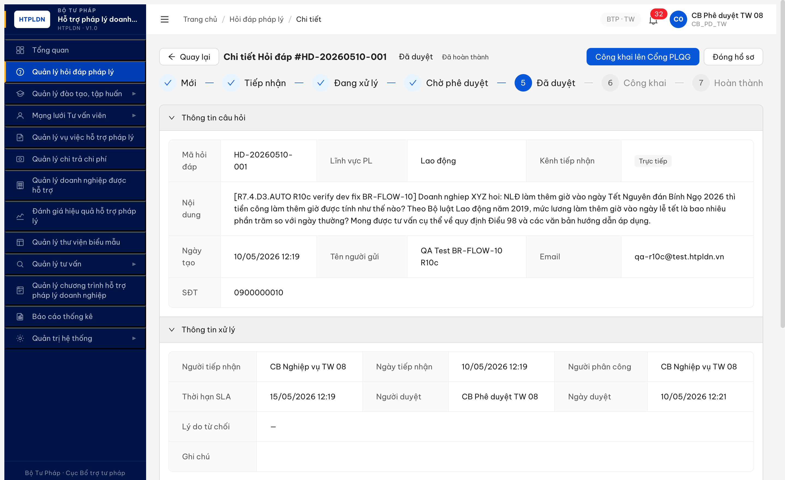
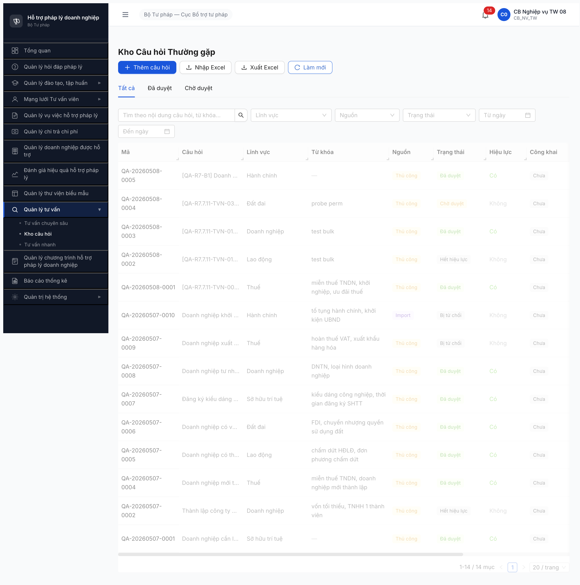

# Workflow Test Report — Kho QA · BR-FLOW-10 auto-feed (R7.4.D3.AUTO)

> **Module:** Kho câu hỏi (FR-13) — auto-feed từ Hỏi đáp (FR-02) · **SRS:** [`02-thu-tu-module.md` line 769-783 (FR-13 BR-FLOW-10)](../../../../input/quy-trinh-nghiep-vu/02-thu-tu-module.md) · **Round:** R10d (LATEST) · **Date:** 2026-05-10 20:38:31 · **Tester:** QA Automation
> **Bug:** [`Pass-bug-report-r7-4-d3-auto-br-flow-10.md`](../../bug-reports/kho-qa/Pass-bug-report-r7-4-d3-auto-br-flow-10.md) — 1/1 đóng (BUG-KHOQA-AUTO-001 Closed-verified R10d sau dev fix lần 2)
> **Accounts:** `cb_nv_tw_08` (lifecycle HD MOI→CHO_PHE_DUYET) + `cb_pd_tw_08` (CHO_PHE_DUYET→DA_DUYET)
> **HD seeded:** R10 `HD-20260509-010` (3577bfb6) · R10c `HD-20260510-001` (8753d1ff) · R10d `HD-20260510-006` (2d373db6)

---

## Kết luận

✅ **Đạt 6/6 bước (re-test R10d xác nhận BR-FLOW-10 fix)** — Sau dev fix lần 2, fresh HD-20260510-006 lifecycle MOI→DA_DUYET hoàn tất 20:38:31, BE auto trigger BR-FLOW-10 → tạo record QA-20260510-0005 `nguon=TU_DONG` `hoiDapGocId=2d373db6` đúng spec FR-13 line 781 + SM-HOIDAP line 509. Pool tăng 18→19 ngay ~1s sau APPROVE. BUG-KHOQA-AUTO-001 Closed-verified.

---

## Round R10d (LATEST) — Re-verify sau dev fix lần 2 — PASS

**Mục đích:** Verify lại sau khi dev fix lần 2 BUG-KHOQA-AUTO-001 (sau R10c FAIL).

**Phương pháp:** Seed FRESH HD-20260510-006 lifecycle full qua API + UI với 2 isolated context riêng cho 2 account.

| # | Bước | Actor | Sample | Status |
|:-:|---|---|---|:-:|
| 1 | POST `/api/v1/hoi-daps` tạo HD MOI | `cb_nv_tw_08` | HD-20260510-006 (UUID 2d373db6…) lĩnh vực Lao động | ✅ |
| 2 | TIEP_NHAN → DANG_XU_LY (PHAN_CONG self) | `cb_nv_tw_08` | API direct, version=1→3 | ✅ |
| 3 | Tạo phan-hoi 362 ký tự nội dung NĐ 145/2020 Đ.57 | `cb_nv_tw_08` | POST `/api/v1/hoi-daps/.../phan-hois` → DU_THAO | ✅ |
| 4 | UI click [Gửi phản hồi] → confirm dialog → CHO_PHE_DUYET | `cb_nv_tw_08` | HD chuyển `Chờ phê duyệt` lúc 20:37 | ✅ |
| 5 | UI cb_pd_tw_08 click [Phê duyệt] → confirm dialog | `cb_pd_tw_08` | HD chuyển `Đã duyệt` lúc 2026-05-10T13:38:31.420Z | ✅ |
| 6 | **BR-FLOW-10 auto-feed Kho QA TU_DONG** | System | Pool=18 trước → **19 sau APPROVE ~1s với QA-20260510-0005 nguon=TU_DONG hoiDapGocId=2d373db6** | ✅ |

**Verify pool ngay sau APPROVE + chờ thêm 30s:**
- `GET /api/v1/kho-cau-hois?nguon=TU_DONG` → `total=1, data=[QA-20260510-0005]`
- Record fields đầy đủ: `cauHoi`, `cauTraLoi`, `linhVucId` (Lao động), `trangThai=DA_DUYET`, `hieuLuc=true`, `nguoiDuyetId` (cb_pd_tw_08), `ngayTao`/`ngayDuyet` ≈ `2026-05-10T13:38:31.4Z`
- UI Kho câu hỏi `/tv-nhanh/kho-cau-hoi`: row đầu QA-20260510-0005 cột Nguồn = "Tự động", Trạng thái = "Đã duyệt", Hiệu lực = "Có"
- Pool tăng đúng 1 record (18→19), không có duplicate

**Kết luận R10d:** ✅ Dev fix lần 2 thành công. BR-FLOW-10 hoạt động đúng spec. BUG-KHOQA-AUTO-001 Closed-verified.

**Bằng chứng R10d:**


---

## Round R10c (archive) — Re-verify sau dev fix lần 1 — FAIL

**Mục đích:** Verify lại sau khi dev báo đã fix BUG-KHOQA-AUTO-001.

**Phương pháp:** Seed FRESH HD lifecycle full qua UI + API (không tái dùng HD-20260509-010 cũ vì lo ngại BE chỉ fix forward-only).

| # | Bước | Actor | Sample | Status |
|:-:|---|---|---|:-:|
| 1 | POST `/api/v1/hoi-daps` tạo HD MOI | `cb_nv_tw_08` | HD-20260510-001 (UUID 8753d1ff…) lĩnh vực Lao động | ✅ |
| 2 | TIEP_NHAN → DANG_XU_LY (PHAN_CONG self) | `cb_nv_tw_08` | API direct, version=1→3 | ✅ |
| 3 | Tạo phan-hoi 473 ký tự nội dung BLLĐ Đ.98 | `cb_nv_tw_08` | POST `/api/v1/hoi-daps/.../phan-hois` → DU_THAO | ✅ |
| 4 | UI click [Gửi phản hồi] → confirm dialog → DA_DUYET phan-hoi | `cb_nv_tw_08` | HD chuyển `Chờ phê duyệt` (CHO_PHE_DUYET) | ✅ |
| 5 | UI cb_pd_tw_08 click [Phê duyệt] → confirm dialog | `cb_pd_tw_08` | HD chuyển `Đã duyệt` (DA_DUYET) tại 2026-05-10T05:21:48Z | ✅ |
| 6 | BR-FLOW-10 auto-feed Kho QA TU_DONG | System | Pool=14 trước → kỳ vọng 15 với record `nguon=TU_DONG` + `hoiDapGocId=8753d1ff…` | ❌ |

**Verify pool sau APPROVE + chờ 30s:**
- `GET /api/v1/kho-cau-hois?nguon=TU_DONG` → `total=0, data=[]`
- `GET /api/v1/kho-cau-hois?page=1&pageSize=50` → 14 records (THU_CONG:13, IMPORT:1, TU_DONG:0)
- `match_by_hd_goc_id` (HD-001 + HD-010) = 0
- HD-001 detail: `khoCauHoiId=null`
- UI Kho câu hỏi `/tv-nhanh/kho-cau-hoi`: `1-14 / 14 mục`, không có cột Nguồn = `Tự động`

**Kết luận R10c:** Dev chưa fix BR-FLOW-10. BUG-KHOQA-AUTO-001 vẫn Open Major P1.

**Bằng chứng R10c:**




---

## Round R10 (archive)

---

## Bảng kiểm tra workflow

| # | Bước (transition) | Actor | Sample test | Status | Bug / Note |
|:-:|---|---|---|:-:|---|
| 1 | `MOI → TIEP_NHAN` (Tiếp nhận) | `cb_nv_tw_08` | HD-20260509-010 | ✅ | — |
| 2 | `TIEP_NHAN → DA_PHAN_CONG` (Phân công CB) | `cb_nv_tw_08` | tự phân công cho `cb_nv_tw_08` (workload 0) | ✅ | — |
| 3 | `DA_PHAN_CONG → DA_TRA_LOI` (Trả lời) | `cb_nv_tw_08` | Phản hồi 300+ ký tự BLLĐ Đ.98 | ✅ | — |
| 4 | `DA_TRA_LOI → CHO_PHE_DUYET` (auto BR-FLOW-01) | System | (tự động sau Bước 3) | ✅ | — |
| 5 | `CHO_PHE_DUYET → DA_DUYET` (Phê duyệt) | `cb_pd_tw_08` | UI confirm "Đã duyệt" + BE `trangThai=DA_DUYET` | ✅ | — |
| 6 | `DA_DUYET → auto tạo Kho QA TU_DONG` (BR-FLOW-10) | System | pool 14 → kỳ vọng 15 với record `nguon=TU_DONG` + `hoi_dap_goc_id` | ❌ | BUG-KHOQA-AUTO-001 |

> Icon: ✅ pass · ❌ fail · ⏭ skip · 🚫 blocked

---

## Lịch sử round

| Round | Date | Kết quả tóm tắt (1 dòng) |
|---|---|---|
| R10d | 10/05 20:38:31 | Re-verify sau dev fix lần 2 — fresh HD-006 lifecycle 6/6 PASS, BR-FLOW-10 trigger đúng → QA-20260510-0005 TU_DONG → BUG-KHOQA-AUTO-001 Closed-verified |
| R10c | 10/05 12:21:48 | Re-verify sau dev fix lần 1 — fresh HD-001 lifecycle 5/5 PASS, BR-FLOW-10 vẫn FAIL → BUG vẫn Open |
| R10 | 10/05 03:23:00 | Lifecycle 5/5 PASS, BR-FLOW-10 FAIL — log BUG-KHOQA-AUTO-001 |

---

## Bằng chứng

**HD-20260509-010 đã DA_DUYET (cb_pd_tw_08 phê duyệt 2026-05-09T20:19:47Z):**


**Pool Kho QA vẫn 14 records sau khi HD DA_DUYET (kỳ vọng 15):**



```text
GET /api/v1/hoi-daps/3577bfb6-ec53-4a0c-8858-b0507afb3472
→ 200 { trangThai: "DA_DUYET", ngayDuyet: "2026-05-09T20:19:47.473Z" }

GET /api/v1/kho-cau-hois?nguon=TU_DONG&page=1&pageSize=20
→ 200 { success: true, data: [], total: 0 }
```

---

*R10 | QA Automation*
