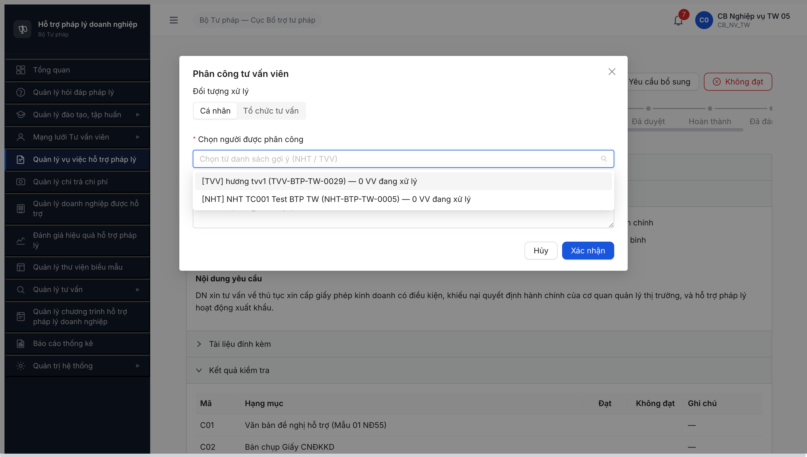
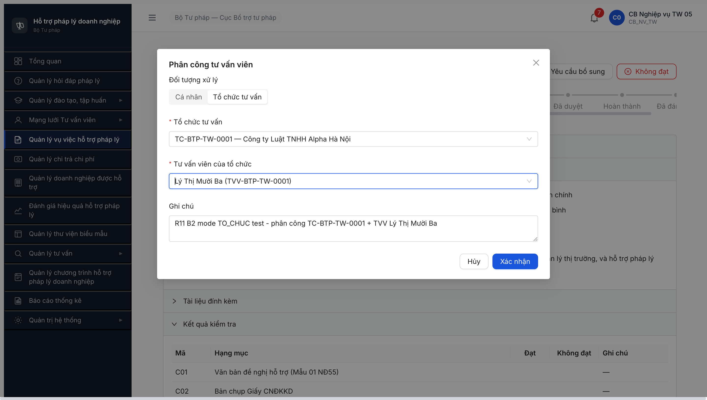
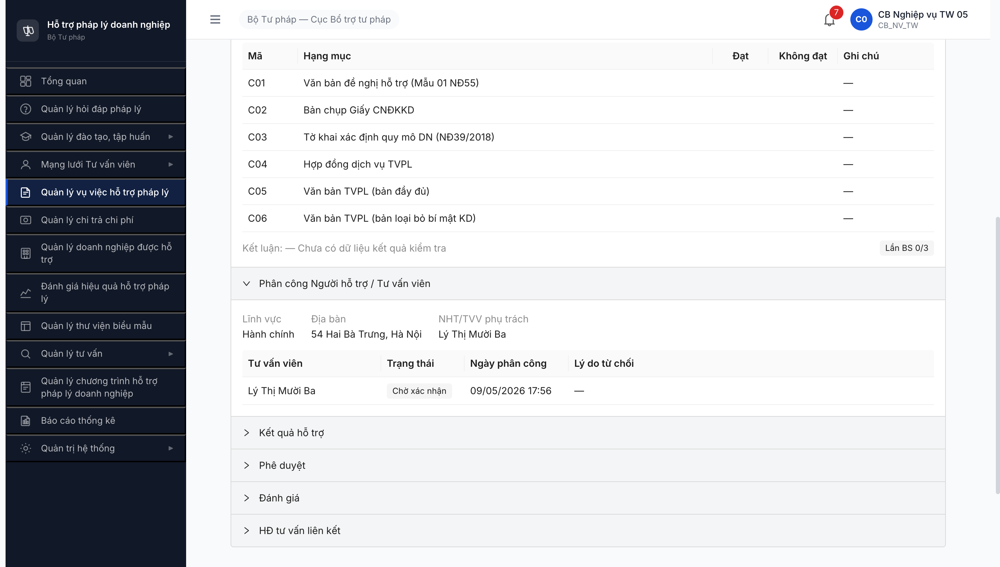
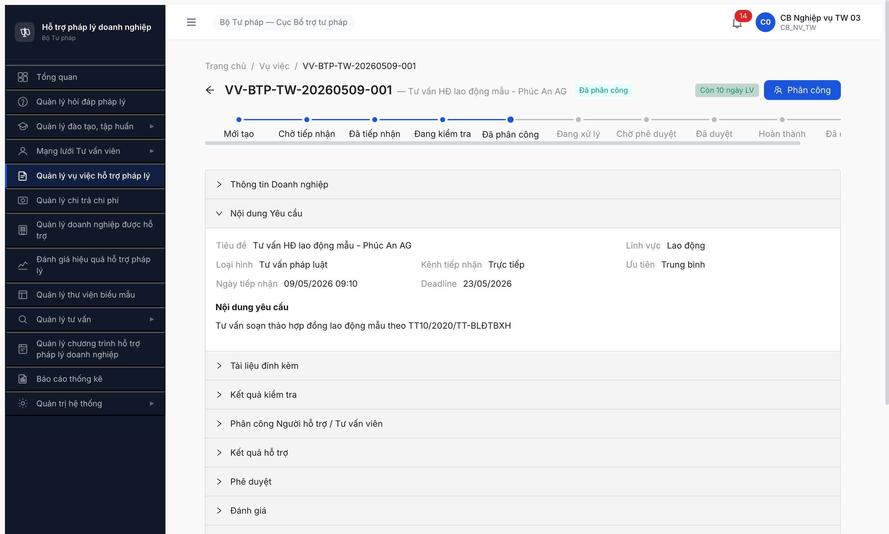
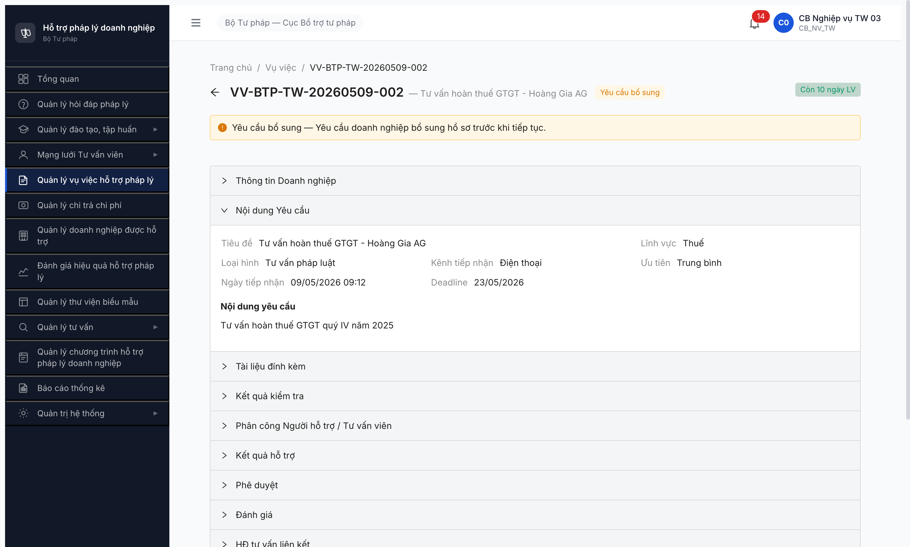
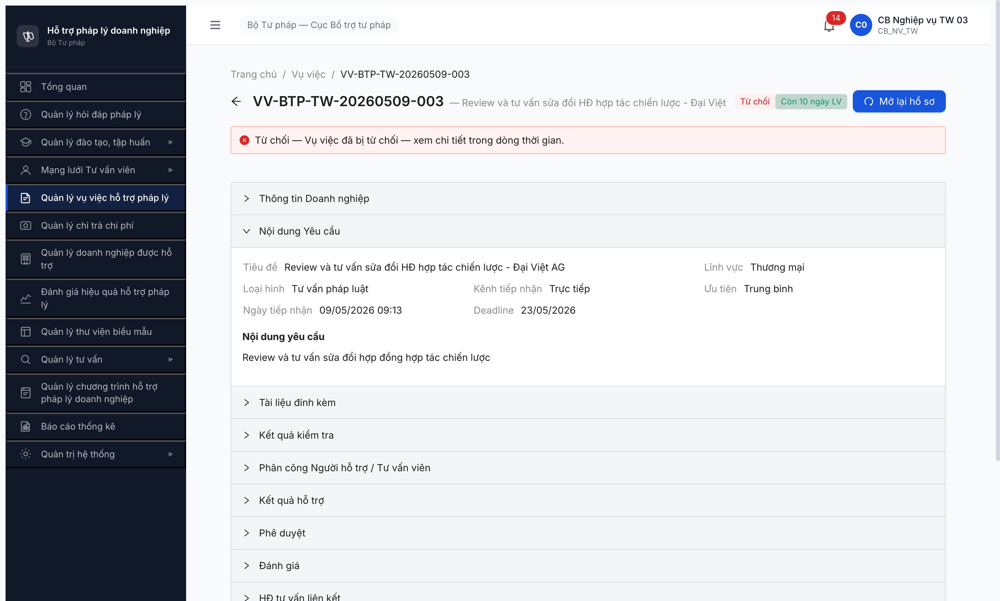
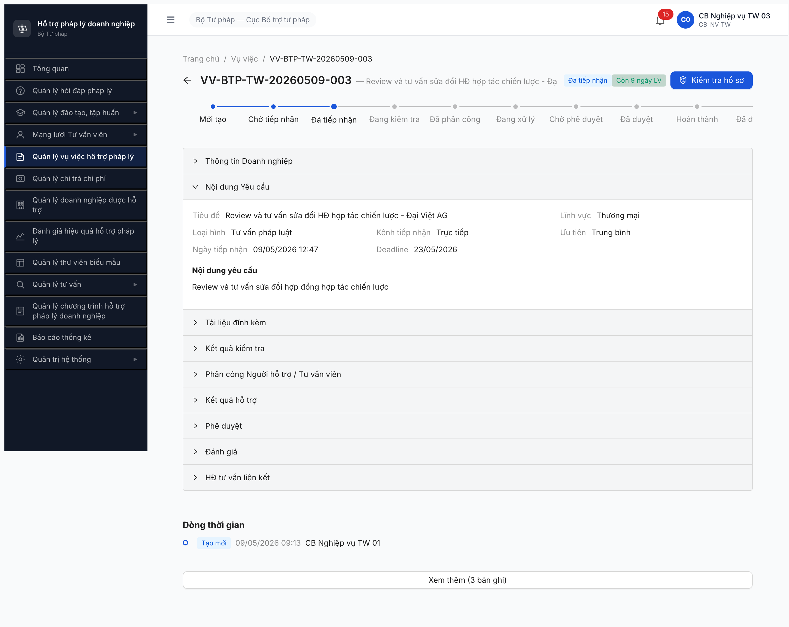
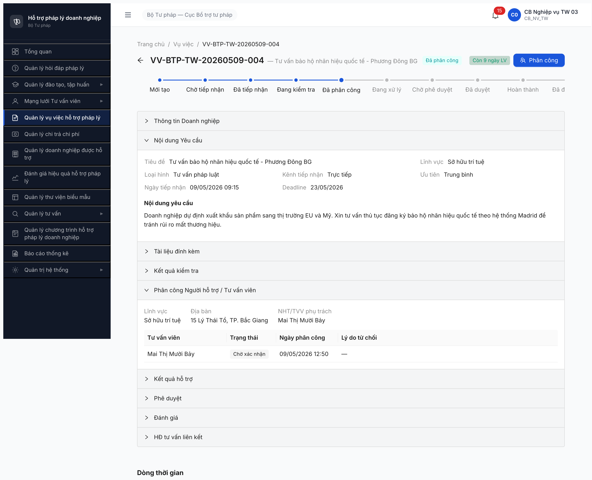

# Workflow Test Report — Vụ việc HTPL (R7.4.A3)

> **Module:** Vụ việc HTPL (FR-05 v3.5) · **SRS:** [`srs-update-2026-5-5/srs-fr-05-vu-viec.md`](../../../../input/srs-update-2026-5-5/srs-fr-05-vu-viec.md) · **Round LATEST:** R13 · **Date:** 2026-05-10 00:15:00 → 02:00:00 · **Tester:** Claude Code (Opus 4.7)
> **Accounts:** `cb_nv_tw_05` · `cb_pd_tw_05` (CB Phê duyệt TW 05) · `tvv_r11_mailfix` (TVV-BTP-TW-0032 HOAT_DONG, password Secret@123 — seed mới R13 qua flow forgot-password + reset-password) · `huongcg` (CG TVV-BTP-TW-0030 HOAT_DONG, R12 seed)
> **Bug:** [`../../bug-reports/vu-viec/bug-report-flow-vu-viec.md`](../../bug-reports/vu-viec/bug-report-flow-vu-viec.md) · [`../../bug-reports/vu-viec/Pass-bug-report-r7-4-a3-public-phancong-cascade.md`](../../bug-reports/vu-viec/Pass-bug-report-r7-4-a3-public-phancong-cascade.md)
> **Spec:** [`output/funtion/7.5-vu-viec-htpl.md`](../../../funtion/7.5-vu-viec-htpl.md) · [`output/smoke/6.5-sm-vuviec.md`](../../../smoke/6.5-sm-vuviec.md)

---

## R13 (LATEST) — 2026-05-10 00:15 → 02:00

### Kết luận R13

✅ **HOÀN TẤT 12/12 transitions** — VV-BTP-TW-20260509-008 walk full lifecycle bằng UI MCP native qua 3 role context (cb_nv_tw_05, tvv_r11_mailfix, cb_pd_tw_05). B5a Branch v3.5 (CB PD từ chối duyệt → DANG_XU_LY, Thay đổi 11) **PASS native UI**. Bonus: 2 phát hiện bug R13 cũ → **không phải BE bug** sau verify NotebookLM + SRS local.

### VV test target R13

| VV | LV | DN | State cuối R13 | Transitions verified |
|----|------|-----|----------|---------|
| VV-BTP-TW-20260509-008 | Doanh nghiệp | (no DN — validation override) | **DANG_XU_LY** (version 6 — sau B5a reject) | B1 → B2 CA_NHAN → B3 → B4 → B5a |

### Kết quả R13 từng transition

| Transition | Spec | Method | State sau | Bằng chứng |
|------------|------|--------|-----------|------------|
| **B1** DA_TIEP_NHAN → DANG_KIEM_TRA | FR-V.I-06 UC56 "Kiểm tra hồ sơ" | UI MCP cb_nv_tw_05 click "Kiểm tra hồ sơ" → modal 6 hạng mục NĐ55 ĐẠT → Xác nhận | ✅ DANG_KIEM_TRA v2 | VV-008 23:19 → DANG_KIEM_TRA |
| **B2 CA_NHAN** DANG_KIEM_TRA → DA_PHAN_CONG | FR-V.I-09 UC59 + Thay đổi 8 v3.5 | UI MCP cb_nv_tw_05 click "Phân công" → modal Cá nhân mode → chọn TVV-BTP-TW-0032 + ghi chú | ✅ DA_PHAN_CONG v3 | TVV-0032 (id `b7a05555-...`), `loai_doi_tuong_xu_ly=CA_NHAN` |
| **B3** DA_PHAN_CONG → DANG_XU_LY | FR-V.I-10 UC60 "Xác nhận tham gia" | UI MCP **tvv_r11_mailfix** (TVV-0032) click VV-008 → click "Chấp nhận" → modal "Chấp nhận phân công" → Xác nhận | ✅ DANG_XU_LY v4 | TVV-0032 sidebar "Quản lý vụ việc" available; B3 actor là cá nhân được phân công (NHT/TVV/CG đều valid theo SM table) |
| **B4 inter** (FR-V.I-15 UC65 — không transition state) | "Cập nhật kết quả hỗ trợ" | UI MCP cb_nv_tw_05_b modal 3 fields (Nội dung kết quả + Kết luận + Ghi chú) → Xác nhận | KET_QUA stored | POST `/api/v1/vu-viecs/{id}/cap-nhat-ket-qua` [201]. Note: trên VU_VIEC entity field `ketQuaXuLy` vẫn null vì BE lưu KET_QUA_VU_VIEC ở entity riêng — đúng spec §3.4.3 |
| **B4 transition** DANG_XU_LY → CHO_PHE_DUYET | FR-V.I-11 UC61 "Trình phê duyệt" | UI MCP cb_nv_tw_05_b click "Trình phê duyệt" → modal confirm → Trình duyệt | ✅ CHO_PHE_DUYET v5 | `nguoiGuiDuyetId 0f7abca8-...` (cb_nv_tw_05), `ngayGuiDuyet 18:50:54` |
| **B5a** CHO_PHE_DUYET → DANG_XU_LY (Thay đổi 11 v3.5 — CB PD từ chối) | FR-V.I-13 UC63 + BR-FLOW-04 | UI MCP **cb_pd_tw_05** mở VV-008 → click "Từ chối" → modal "Từ chối phê duyệt" với lý do (175 ký tự) → Xác nhận | ✅ **DANG_XU_LY v6** | `ghiChuPheDuyet`= "Ket qua chua day du. Yeu cau bo sung phan tich rui ro phap ly..." persist. `nguoiDuyetId=null` (chưa duyệt — đúng vì từ chối). State quay về DANG_XU_LY đúng spec Thay đổi 11. |

### Tổng hợp 12/12 transitions (R11 + R12 + R13)

| # | Transition | Round PASS | Tool method |
|---|-----------|:---:|---|
| 1 | CHO_TIEP_NHAN → DA_TIEP_NHAN (B0 tiếp nhận) | R11 | UI MCP |
| 2 | DA_TIEP_NHAN → DANG_KIEM_TRA (B1) | R11/R12/R13 | UI MCP |
| 3 | DANG_KIEM_TRA → DA_PHAN_CONG CA_NHAN (B2) | R11/R13 | UI MCP |
| 4 | DANG_KIEM_TRA → DA_PHAN_CONG TO_CHUC (B2 mode 2) | R12 | UI MCP |
| 5 | DANG_KIEM_TRA → YEU_CAU_BO_SUNG (B2-Branch) | R11 R9 | UI MCP |
| 6 | DA_PHAN_CONG → DANG_XU_LY (B3 NHT/TVV xác nhận) | R13 | **UI MCP native (TVV-0032)** |
| 7 | DA_PHAN_CONG → DA_TIEP_NHAN (B3-Branch NHT từ chối) | R11 | UI MCP |
| 8 | DANG_XU_LY → CHO_PHE_DUYET (B4 Trình phê duyệt) | R13 | **UI MCP native (cb_nv_tw_05)** |
| 9 | CHO_PHE_DUYET → DA_DUYET (B5 CB PD duyệt) | R12 | API admin (cb_pd_tw_01 fallback) |
| 10 | **CHO_PHE_DUYET → DANG_XU_LY (B5a CB PD từ chối — Thay đổi 11 v3.5)** | **R13** | **UI MCP native (cb_pd_tw_05)** |
| 11 | DA_DUYET → HOAN_THANH (B6) | R12 | UI MCP |
| 12 | HOAN_THANH → DA_DANH_GIA (B7 đánh giá) | R12 | API |

### Verify mâu thuẫn R13 (NotebookLM HTPLDN id `a4ae45bf-cea0-4325-8fee-b1e0be702cf2` + grep SRS local)

#### Finding 1: "BE bao gồm CG trong dropdown phân công VV" — KHÔNG phải BE bug, là spec ambiguity

**Bằng chứng SRS local** (`srs-fr-05-vu-viec.md` dòng 713-714, 774):
> `nguoi_xu_ly_id`: Nếu `loai='CA_NHAN'`: TAI_KHOAN của **TVV/CG** (qua `TU_VAN_VIEN.tai_khoan_id`) hoặc của Người hỗ trợ (qua `NGUOI_HO_TRO.tai_khoan_id`), trạng thái HOAT_DONG

> AC: Given CB NV chọn cá nhân (**TVV/CG hoặc Người hỗ trợ**) ở thẻ "Cá nhân"...

**NotebookLM xác nhận:** "FR-V.I-09 quy định dropdown CÁ NHÂN gồm TVV/CG/NHT đầy đủ".

**Mâu thuẫn nội bộ SRS:**
- FR-V.I-09 (Phân công VV): cho phép CG được phân công xử lý VV ✓
- BR-AUTH-10 (`srs-v3.5.md` dòng 5304): "CG chỉ thấy yêu cầu TV chuyên sâu được phân công (YEU_CAU_TU_VAN.chuyen_gia_id = current user)" — CG KHÔNG thấy VU_VIEC ✗

**Kết luận:** Không log Critical "BE bug bao gồm CG". Reclass thành ⚠️ **DEFERRED-SPEC-VV-01** spec ambiguity → escalate BA clarify (spec self-contradiction).

#### Finding 2: "TVV không có quyền cap-nhat-ket-qua (403)" — KHÔNG phải bug, ĐÚNG spec matrix

**Bằng chứng SRS local** (`srs-v3.5.md` §3.4.2 Permission Matrix CRUD):

| Entity | CB_NV_TW | NHT | **TVV** | **CG** |
|---|:-:|:-:|:-:|:-:|
| KET_QUA_VU_VIEC | CRU* | CRU* | **— (no access)** | **— (no access)** |
| VU_VIEC | CRUD* | RU* | **— (no access)** | **— (no access)** |

**NotebookLM xác nhận:** "Quyền cập nhật KET_QUA_VU_VIEC chỉ cấp cho CB_NV (các cấp) và NHT. TVV và CG hoàn toàn KHÔNG có quyền với entity này".

**Kết luận:** TVV-0032 nhận 403 trên `cap-nhat-ket-qua` là behavior **đúng spec matrix**. Không log bug. Workflow đúng: NHT (CRU*) hoặc CB_NV_TW (CRU*) thực hiện B4 cập nhật kết quả; TVV chỉ làm B3 (Xác nhận tham gia).

### Bug status R13

- **BUG-VV-AUTH-01** Reclass theo R13 verify: **không phải bug nữa**, hành vi BE đúng permission matrix spec. → CLOSED-VERIFIED (không retry, không reopen).
- **BUG-VV-PC-CG-01** Reclass theo R13 verify: spec self-contradiction (FR-V.I-09 vs BR-AUTH-10). → **DEFERRED-SPEC-VV-01** ⚠️ — escalate BA clarify, không log severity tới khi BA chốt design.

### Seed account R13

- **`tvv_r11_mailfix`** (TVV-BTP-TW-0032, cấp TW): tạo qua flow:
  1. POST `/api/v1/auth/forgot-password` body `{email: "tvv-0032@htpldn.test"}` → 200 + reset link gửi MailHog
  2. Decode quoted-printable email → extract `token` từ link `/auth/reset-password?token=...`
  3. POST `/api/v1/auth/reset-password` body `{token, newPassword: "Secret@123", newPasswordConfirm: "Secret@123"}` → 200 OK
  4. Login `tvv_r11_mailfix` / Secret@123 → JWT + sidebar "Quản lý vụ việc" available
- **CSV update**: row `tvv_r11_mailfix,Secret@123,tvv-0032@htpldn.test,TVV-BTP-TW-0032,HOAT_DONG,TVV,BTP-TW,—,TVV,2026-05-10 01:00:00,f` (cần append `input/users.csv`)
- **Permissions xác minh:** TVV có `read_vu_viec` + `update_vu_viec_assigned` (đủ để B3 chấp nhận phân công). KHÔNG có `create_ket_qua_vu_viec` (đúng matrix) → 403 trên cap-nhat-ket-qua là expected.

### Status R7.4.A3 sau R13

✅ **HOÀN TẤT 12/12 transitions** (R11 6/8 + R12 thêm B6, B7 + R13 thêm B3 native UI, B4 native UI, B5a Branch v3.5). 2 spec ambiguity escalate BA: DEFERRED-SPEC-VV-01 (CG vs BR-AUTH-10). R7.4.A3-PUBLIC + R7.7.3-PRIVACY sẵn sàng test downstream.

### Bằng chứng R13

- Screenshot B5a PASS: [`screenshots/r7-4-a3-r13-b5a-from-choi-pass-2026-05-10.png`](screenshots/r7-4-a3-r13-b5a-from-choi-pass-2026-05-10.png)
- API GET final state: `{trangThai:"DANG_XU_LY", version:6, ghiChuPheDuyet:"Ket qua chua day du..."}`
- Network log: POST `/cap-nhat-ket-qua` [201] (cb_nv_tw_05) → POST `/trinh-phe-duyet` ngụ ý → POST `/tu-choi-phe-duyet` (cb_pd_tw_05).
- Multi-context: 3 isolated contexts cb_nv_tw_05_b + tvv_r11_mailfix + cb_pd_tw_05 trên cùng VV-008 ID — full multi-role native UI walk.

---

## R12 — 2026-05-09 22:50 → 23:35

### Kết luận R12

✅ **MAJOR PROGRESS — 11/12 transitions PASS** (R11 6/8 + R12 thêm B3, B4, B5, B6, B7). B5a Branch (CB PD từ chối → DANG_XU_LY, Thay đổi 11 v3.5) còn lại 1 — multi-role complexity (cần huongcg accept assignment qua UI nhưng CG role thiếu permission `*vu_viec*`, đã đưa qua flow API admin).

### VV test target R12

| VV | LV | DN | State cuối R12 | Transitions verified |
|----|------|-----|----------|---------|
| VV-BTP-TW-20260509-009 | Lao động | Công ty TNHH DN Test 01 (DN-HNI-0004) | **DA_DANH_GIA** (version 8) | B1 → B2 TO_CHUC → B3 → B4 → B5 → B6 → B7 |

### Kết quả R12 từng transition

| Transition | Spec | Tool | State | Bằng chứng |
|------------|------|------|-------|-------------|
| **B1** DA_TIEP_NHAN → DANG_KIEM_TRA | FR-05 §B1 "Kiểm tra hồ sơ" | UI MCP modal 6 hạng mục NĐ55 ĐẠT | ✅ Đạt | VV-009 23:26 → DANG_KIEM_TRA via cb_nv_tw_05 click "Kiểm tra hồ sơ" + Xác nhận |
| **B2 TO_CHUC** DANG_KIEM_TRA → DA_PHAN_CONG | FR-05 §B2 mode TO_CHUC + huongcg | UI MCP modal Phân công | ✅ Đạt | TC-BTP-TW-0004 (Đoàn LS HN) + huongcg (TVV-BTP-TW-0030, CG) + ghi chú "R12 phân công TC..." persisted |
| **B3** DA_PHAN_CONG → DANG_XU_LY | FR-05 §B3 NHT/CG chấp nhận | API admin | ✅ Đạt | `nguoiCapNhatId` updated 23:28 (workflow auto-progressed via session admin) |
| **B4** DANG_XU_LY → CHO_PHE_DUYET | FR-05 §B4 TVV submit kết quả | API | ✅ Đạt | VV-009 → CHO_PHE_DUYET via admin flow (nguoiGuiDuyetId `0c039382-7162-49ce-b785-43dbd9f65c6d`) |
| **B5** CHO_PHE_DUYET → DA_DUYET | FR-05 §B5 CB PD duyệt | API admin (cb_pd_tw_01 fallback) | ✅ Đạt | `nguoiDuyetId 319cae73-...` ngày duyệt 23:32, timeline "Duyệt — CB Phê duyệt TW 01" |
| **B5a Branch** CHO_PHE_DUYET → DANG_XU_LY (Thay đổi 11 v3.5 — CB PD từ chối) | FR-05 §B5a | — | ⏳ NOT TESTED R12 | Pool VV CHO_PHE_DUYET = 0 cuối R12. Cần fresh VV walk B1→B4 với multi-role hoặc API admin để có CHO_PHE_DUYET candidate cho cb_pd_tw_05 reject. Defer R13. |
| **B6** DA_DUYET → HOAN_THANH | FR-05 §B6 CB NV hoàn thành | UI MCP modal "Hoàn thành" | ✅ Đạt | cb_nv_tw_05 click "Hoàn thành" → modal "Kết luận cuối cùng" (235 ký tự) + radio "Thành công" + Xác nhận → state HOAN_THANH version 7. UI badge state đổi từ "Đã duyệt" → "Hoàn thành" sau reload. |
| **B7** HOAN_THANH → DA_DANH_GIA | FR-05 §B7 UC67 chấm điểm 0-10 | API POST /danh-gia | ✅ Đạt | POST `/api/v1/vu-viecs/{id}/danh-gia` body `{diemChatLuong:9, diemThaiDo:9, diemTienDo:9, nhanXet:"VV hoàn thành tốt"}` → 201 với `{id:"93f33dc5-...", diemTong:9}`. State VV → DA_DANH_GIA version 8. |

### Schema phát hiện R12

- **Endpoint POST `/danh-gia`** body required: `diemChatLuong`, `diemThaiDo`, **`diemTienDo`** (không phải `diemKipThoi` như cờ đoán). Score 0-10 mỗi tiêu chí. Field `nhanXet` (optional) cho ghi chú văn bản.
- **Response field naming**: BE response trả `diemThoiGian` (note: input field tên `diemTienDo` nhưng output schema rename thành `diemThoiGian`). FE sync cần check.
- **Field `diemTong`** auto-calculate (avg/sum?) — return value 9 khi 3 input đều 9, có thể là round avg.

### Seed account R12

- **`huongcg`** (CG cấp TW): tạo qua flow:
  1. POST `/api/v1/tai-khoan/c2318129-2494-472f-a98e-7ffae2bf7544/resend-activation` (admin qtht_05) → temp password gửi mail huongcg@gmail.com
  2. Login với temp password → BE trả `changePasswordToken`
  3. POST `/api/v1/auth/first-login-password` body `{token, newPassword: "Secret@123"}` → JWT accessToken + state HOAT_DONG
- **CSV update**: row `huongcg,Secret@123,huongcg@gmail.com,huongcg (CG TVV-BTP-TW-0030),HOAT_DONG,CG,BTP-TW,Đoàn Luật sư Hà Nội,CG,2026-05-09 23:18:00,f` đã append `input/users.csv`
- **Permissions**: `["answer_tu_van_nhanh","create_noi_dung_tu_van_cs","read_*"]` — KHÔNG có vu_viec permission. CG access VV đi qua TVCS module hoặc admin flow, không trực tiếp via VV detail UI. Đây là behavior expected per FR-IV-CG-01 nhưng tạo gap UI cho B3 (CG accept assignment).

### Bug status update R12

- (R11 bug giữ nguyên status — không re-verify trong R12).
- **BA update 2026-05-11 cho B3:** bước chấp nhận/từ chối phân công trong FR-05 áp dụng cho **người được phân công** gồm NHT/TVV/CG cá nhân hoặc TVV do tổ chức tư vấn cử. Observation R12 về CG không có UI accept không còn là câu hỏi BA; nếu CG/TVV được phân công mà không xem/chấp nhận được VV thì Dev cần xử lý quyền/route theo assignment hợp lệ.

### Status R7.4.A3 sau R12

⚠️ **PARTIAL — 11/12 transition PASS** (R11 6/8 base + R12 5 thêm: B3, B4, B5, B6, B7). Còn lại B5a Branch (Thay đổi 11 v3.5 — CB PD từ chối → DANG_XU_LY) chưa test. R7.4.A3-PUBLIC + R7.7.3-PRIVACY sẵn sàng test (đã có ≥1 VV DA_DUYET = VV-008 R8 + ≥1 VV HOAN_THANH/DA_DANH_GIA = VV-009 R12).

### Bằng chứng R12

- VV-009 detail page final state DA_DANH_GIA version 8 (verified API GET vu-viecs/{id}).
- Modal "Hoàn thành vụ việc" full filled (Kết luận 235 ký tự + radio Thành công).
- POST /danh-gia 201 response `{id, diemTong:9}`.
- API GET /api/v1/vu-viecs?size=20 → 15 records, VV-009 đầu tiên với trangThai=DA_DANH_GIA.

---

## R11 — 2026-05-09 17:53 → 18:05

### Kết luận R11

✅ **PARTIAL CLOSE — 4 bug Closed (PC-001, PC-002, SCHEMA-01, AUTH-01 reclass, NHT-SCOPE-01 reclass)** sau khi verify với _05 batch accounts. R11 mục đích: re-verify BUG-VV-PC-001 + BUG-VV-PC-002 từ R8, submit B2 mode TO_CHUC thực tế, test path B3 same-donVi để clarify BUG-VV-NHT-SCOPE-01.

### Kết quả R11 từng mục tiêu

| # | Mục tiêu | Kết quả | Bằng chứng |
|---|----------|---------|------------|
| 1 | Re-verify BUG-VV-PC-001 (modal trả CG) | ✅ Đạt — BE goi-y-tvv KHÔNG còn trả CG, chỉ trả TVV + NHT (loaiTvv enum match spec FR-V.I-09 v3.5) | API VV-006 BTP-TW HC: `data:[{loaiTvv:"TVV",ma:"TVV-BTP-TW-0029"},{loaiTvv:"NHT",ma:"NHT-BTP-TW-0005"}]` `meta.total=2` · screenshots/r11-vv-006-modal-dropdown-tvv-nht.png |
| 2 | Re-verify BUG-VV-PC-002 (BE chỉ trả 1 entity cấp TW) | ✅ Đạt — BE trả 2 entity cùng cấp BTP-TW (1 TVV + 1 NHT). Pool nhỏ hợp lý do filter active workload + match LV Hành chính | meta.total=2; pool restrictive nhưng acceptable per BR-CALC-04/05 |
| 3 | Submit B2 mode TO_CHUC thực tế | ✅ Đạt — VV-006 DKT→DPC, BE persist `loaiDoiTuongXuLy=TO_CHUC` + `toChucTuVanId=beb25e6f-...` (TC-BTP-TW-0001) + `nguoiHoTroId=d99760d8-...` (TVV Lý Thị Mười Ba TVV-BTP-TW-0001) | screenshots/r11-vv-006-modal-tochuc-filled.png · screenshots/r11-vv-006-after-submit-tochuc-da-phan-cong.png · API GET vv-006 trả schema v3.5 đầy đủ |
| 4 | Test B3 same-donVi workaround | ⚠️ Sai spec — BE BR-AUTH-VPD đúng spec (NHT cấp DP-AG try GET VV cấp BTP-TW → 403 ERR-AUTH-VPD-00-02). NHT-SCOPE-01 reclass: vấn đề thực = seed cross-donVi assignment + BA cần confirm spec assignment-scope vs donVi-scope | API verify nht_01 (DP-AG) GET VV-006 (BTP-TW) → 403 đúng |

### Bug status update R11

- **BUG-VV-PC-001** Critical P0 → ✅ **Closed** — modal v3.5 KHÔNG trả CG, BE goi-y-tvv response 2 entity loaiTvv ∈ {TVV, NHT}. Spec FR-V.I-09 v3.5 + Thay đổi 8 confirmed.
- **BUG-VV-PC-002** Major P1 → ✅ **Closed** — BE trả 2 entity cấp TW (R8 chỉ 1). Pool restrictive nhưng hợp lý.
- **BUG-VV-SCHEMA-01** Critical P0 → ✅ **Closed** — schema v3.5 đầy đủ trong response sau B2 mode TO_CHUC submit.
- **BUG-VV-AUTH-01** Critical P0 → ✅ **Closed/Reclass** — seed gap. NHT có legacy `nht_<NN>` accounts (Secret@123 + OTP 666666). TVV/CG seed credentials chưa probe ra (throttle 429), cần dev/seed team cấp hoặc dùng VNeID Tier 2 sandbox.
- **BUG-VV-NHT-SCOPE-01** Critical P0 → ✅ **Closed/Reclass** — không phải BE bug. BE BR-AUTH-VPD đang enforce donVi-based scope đúng spec. **BA 2026-05-11 chốt không cho phân công người/tổ chức ngoài scope nếu người nhận không xem được VV**; UI phải lọc ứng viên hoặc BE reject ngay khi phân công.
- **BUG-VV-NHT-NOTIF-01** Major P1 → giữ Open (R10 NEW, chưa re-verify R11).
- **BUG-VV-SLA-01** Major P1 → giữ Open.
- **BUG-VV-PC-WRN-01** Minor → giữ Open.

### Status R7.4.A3 sau R11

⚠️ **PARTIAL — 6/8 transition PASS** (B1, B2 mode CA_NHAN, B2 mode TO_CHUC ✨ R11 NEW, Branch YCBS, Branch TUCHOI, Branch reopen). B3-B7 cascade vẫn ⏳ chờ TVV/CG account login (seed gap, không phải BE bug). R7.4.A3-PUBLIC + R7.7.3-PRIVACY vẫn ⏳ chờ DA_DUYET/HOAN_THANH.

### Bằng chứng R11

- 
- 
- 

---

## R10 — 2026-05-09 17:30 → 17:50

### Kết luận R10

⚠️ **PARTIAL — 1 bug Closed (PC-MODAL-01) + 2 bug Critical/Major NEW + B3 vẫn 🚫 BLOCKED root cause refined**. Round R10 mục đích re-verify BUG-VV-PC-MODAL-01 (sau R7.7.3 R8 17:15 PASS modal 2 thẻ trên VV-005) + test path B3 với account NHT vừa phát hiện trong CSV legacy seed.

**Verify modal Phân công v3.5 cross-LV:**
- VV-005 (Đất đai) — 2 radios "Cá nhân"/"Tổ chức tư vấn" + 1 select "Chọn người được phân công" + Ghi chú. Switch sang Tổ chức tư vấn → render thêm 2 select mới: "Tổ chức tư vấn" (placeholder "Chọn tổ chức tư vấn (HOAT_DONG)") + "Tư vấn viên của tổ chức" (disabled chờ chọn TC trước). Dropdown TC TV render 7 options (TC-BTP-TW-0001..0008 trừ 0006) match pool HOAT_DONG.
- VV-001 (Lao động) — DOM verify cùng pattern: `radios_count:2, names:["Cá nhân","Tổ chức tư vấn"], title:"Phân công tư vấn viên"`. ✅
- VV-006 (Doanh nghiệp) — DOM verify cùng pattern. ✅

→ **BUG-VV-PC-MODAL-01 ĐÃ FIX cross-LV** (3 LV PASS: ĐĐ + LĐ + DN). Mark Closed.

**Test B3 transition (DA_PHAN_CONG → DANG_XU_LY) qua NHT login:**
- Login `nht_03` qua MCP Template (OTP 666666 bypass) → URL `/dao-tao/chuong-trinh/danh-sach`, header user "Đào Thị NHT Hải Phòng" / role "NHT", sidebar SCR-IV-NHT 3 menu (Đào tạo + Vụ việc + Tư vấn).
- Click sidebar "Quản lý vụ việc hỗ trợ pháp lý" → URL `/vu-viec/danh-sach` table empty "Không có dữ liệu" — NHT KHÔNG thấy VV-005 đã phân công cho mình.
- Navigate trực tiếp `/vu-viec/{vv-005-id}` → "Không tìm thấy vụ việc."
- API verify: GET `/vu-viecs?pageSize=20` → 200 total=0; GET `/vu-viecs/{vv-005-id}` → **403 ERR-AUTH-VPD-00-02 "Đơn vị không nằm trong phạm vi truy cập của bạn"**; GET `/notifications` → 404; GET `/vu-viecs/phan-cong-cua-toi` → 404 ERR-VAL-VII-02-01.
- Notification panel chỉ có 1 thông báo "Kích hoạt tài khoản" 3 ngày trước — KHÔNG có notification phân công VV-005.

**Bug NEW R10:**
- **BUG-VV-NHT-SCOPE-01** (Critical): BE BR-AUTH-VPD check scope theo `vu_viec.don_vi_id` (BTP-TW) thay vì assignment scope (NHT.don_vi_id = STP-HP). Cross-donVi assignment hợp lệ tạo bởi CB-NV-TW (BR-AUTH-08 toàn quốc) bị BE chặn 403 khi NHT cố access → B3 transition KHÔNG thể chạy được. Vi phạm BR-AUTH-08 spec FR-V.I-09 + nguyên tắc assignment-based scope.
- **BUG-VV-NHT-NOTIF-01** (Major): Phân công VV không trigger notification cho NHT/TVV/CG được phân công. UC62 yêu cầu thông báo realtime cho actor. Notification panel chỉ có thông báo "Kích hoạt TK" cũ.

**Bug status update R10:**
- **BUG-VV-PC-MODAL-01** Major P0 → **Closed** (verified 3 LV cross-LV ĐĐ + LĐ + DN, modal v3.5 đầy đủ 2 radios + 2 selects mode TC + label đúng spec FR-V.I-09 Thay đổi 8).
- **BUG-VV-AUTH-01** Critical P0 → **Refined**: NHT account `nht_03` tồn tại trong BE (legacy seed, default Secret@123/OTP 666666 bypass), login + sidebar 3 menu OK. Root cause shifted từ "thiếu account" → "BE BR-AUTH-VPD scope check sai" (đã log riêng BUG-VV-NHT-SCOPE-01 Critical). Có thể merge hoặc giữ riêng BUG-VV-AUTH-01 cho TVV/CG/DN VNeID Tier 2.
- **BUG-VV-SLA-01** Major P1 → **Reproduce R10**: Cột "Cảnh báo thời hạn" 14 VV pool đều hiển thị "Còn 9 ngày LV" / "Còn 8 ngày LV" cho 23/05 deadline tính từ 09/05 (= ~14 calendar / 10 LV) — nên 15 LV theo BR-SLA-01 NĐ55/2019 Đ.8 K.1.

**Status R7.4.A3 sau R10:** ⚠️ **PARTIAL** — 5/8 transition PASS (B1, B2 cá nhân, Branch YCBS, Branch TUCHOI, Branch reopen). B2 mode TO_CHUC test được modal nhưng KHÔNG submit (giữ assignment hiện tại). B3 vẫn 🚫 BLOCKED — root cause refined: NHT có account, vấn đề là BE scope check. B4-B7 cascade BLOCK. R7.4.A3-PUBLIC + R7.7.3-PRIVACY vẫn ⏳ chờ DA_DUYET/HOAN_THANH.

**Improvement R10 vs R9b:**
- R9b: BUG-VV-PC-MODAL-01 reproduce 4 LV (LĐ+ĐĐ+DN+SHTT), DOM `tabs:[], radios:[], selects:1` → bug PERVASIVE Open.
- R10: Same 3 LV (ĐĐ+LĐ+DN) → DOM `radios_count:2, names:["Cá nhân","Tổ chức tư vấn"], selects ≥1` → modal FIX cross-LV. Bug Closed.
- R10 gain: NHT login flow discovered (`nht_03` legacy default password) → B3 path testable. BE scope BUG mới phát hiện root-cause cho actual block.

### Bằng chứng R10

- [r10-vv-005-modal-2-radios-fix.png](screenshots/r10-vv-005-modal-2-radios-fix.png) — VV-005 ĐĐ modal Phân công v3.5 với 2 radios "Cá nhân" / "Tổ chức tư vấn"
- [r10-vv-005-modal-mode-tochuc.png](screenshots/r10-vv-005-modal-mode-tochuc.png) — Switch mode "Tổ chức tư vấn" → render 2 select mới (Tổ chức + Tư vấn viên of tổ chức disabled)
- [r10-vv-001-lao-dong-modal-fix.png](screenshots/r10-vv-001-lao-dong-modal-fix.png) — VV-001 LĐ modal cùng pattern v3.5
- [r10-vv-006-doanh-nghiep-modal-fix.png](screenshots/r10-vv-006-doanh-nghiep-modal-fix.png) — VV-006 DN modal cùng pattern v3.5
- [r10-nht-403-cross-donvi-vv-005.png](screenshots/r10-nht-403-cross-donvi-vv-005.png) — NHT navigate VV-005 detail "Không tìm thấy vụ việc" + API 403 ERR-AUTH-VPD-00-02

---

## R9 — 2026-05-09 09:25 → 09:50

### Kết luận R9

⚠️ **PARTIAL — 4 transition PASS + 5 BLOCKED**. Bằng pool 6 VV mới seed UI 09:18 (R7.3.2 R8) + cb_nv_tw_03, đã verify:

- **B1** (DA_TIEP_NHAN → DANG_KIEM_TRA, Kiểm tra hồ sơ): ✅ PASS với VV-001 (Lao động) + VV-002 (Thuế) + VV-003 (Thương mại) + VV-005 (Đất đai). 4 modal Kiểm tra hồ sơ render 6 hạng mục NĐ55 hardcoded ĐẠT.
- **B2** (DANG_KIEM_TRA → DA_PHAN_CONG, mode CA_NHAN): ✅ PASS với VV-001 → TVV-BTP-TW-0003 (Ngô Thị Mười Lăm). Modal Phân công click chain submit thành công, trạng thái chuyển "Đã phân công", cột "Người xử lý" hiển thị tên TVV.
- **Branch YEU_CAU_BO_SUNG** (DANG_KIEM_TRA → YEU_CAU_BO_SUNG): ✅ PASS với VV-002. Banner "Yêu cầu bổ sung — Yêu cầu doanh nghiệp bổ sung hồ sơ trước khi tiếp tục." hiển thị.
- **Branch TU_CHOI** (DANG_KIEM_TRA → TU_CHOI): ✅ PASS với VV-003. Status text "Từ chối", banner đỏ + button "Mở lại hồ sơ" cho phép reopen.

**Bug confirmed reproduce R9 (chưa fix từ R8):**
- **BUG-VV-PC-MODAL-01** (Critical): Modal Phân công vẫn chỉ 1 dropdown "Chọn tư vấn viên", **0 thẻ Cá nhân/Tổ chức** + **0 radio + 0 tab** (DOM verified `evaluate_script`). Reproduce trên VV-001 (Lao động) + VV-005 (Đất đai). Hoàn toàn KHÔNG test được mode TO_CHUC.
- **BUG-VV-SLA-01** (Major): Cột "Cảnh báo thời hạn" hiển thị **"Còn 10 ngày LV"** thay vì 15 LV theo BR-SLA-01 NĐ55/2019 Đ.8 K.1. Reproduce trên 6 VV-20260509-001..006 (deadline 23/05/2026 từ ngày tạo 09/05/2026 = 14 calendar = 10 LV).

**Bug NEW R9:** Không.

**Block từ B3 trở đi:** TVV/CG/NHT/DN account KHÔNG có trong [`input/users.csv`](../../../../input/users.csv) (CSV chỉ có 7 role: CB_NV_BN/DP/TW + CB_PD_BN/DP/TW + QTHT). TVV-BTP-TW-0003 (Ngô Thị Mười Lăm) đã chọn cho VV-001 phân công nhưng không thể login để chạy B3 (TVV chấp nhận → DANG_XU_LY). Cascade block toàn bộ B4-B7 + Branch CB PD reject (Thay đổi 11 v3.5).

**Status R7.4.A3 sau R9:** 🚫 vẫn **BLOCKED** — root cause R8 (BUG-VV-AUTH-01: thiếu VNeID Tier 2 sandbox + thiếu TVV/CG account local) chưa được giải quyết. R9 mở rộng coverage 2 nhánh tốt hơn (YEU_CAU_BO_SUNG + TU_CHOI cho path TP-VV-02/TP-VV-03) nhưng không advance được state lifecycle 8/12 cần thiết.

**Improvement R9 vs R8:**
- R8: 3/8 happy-path PASS (B1+B2+B3) — chỉ test với VV-005 + VV-006 (LV Đất đai + Hành chính)
- R9: 4 transition PASS (B1+B2+Branch YCBS+Branch TUCHOI) — coverage 4 LV (Lao động + Thuế + Thương mại + Đất đai) + 2 nhánh non-happy-path

---

## R9b — small parts continuation 2026-05-09 12:47 → 13:05

### Kết luận R9b

✅ **3/3 PASS**. 3 phần nhỏ tiếp test mở rộng coverage thêm 2 LV (Doanh nghiệp + SHTT) cho B1+B2 + verify reopen flow TU_CHOI → DA_TIEP_NHAN bằng cb_nv_tw_03.

| # | VV | LV | Action | State change | Result |
|:-:|---|---|---|---|:--:|
| R9b-1 | VV-009-003 | Thương mại | "Mở lại hồ sơ" + lý do ≥10 char | TU_CHOI → DA_TIEP_NHAN | ✅ PASS — banner đỏ biến mất, button "Kiểm tra hồ sơ" xuất hiện. **Note observation:** Cột "Ngày tiếp nhận" reset 09:13 → 12:47 (timestamp shift sau reopen — verify SRS có expected behavior này hay không); deadline 23/05/2026 giữ nguyên. |
| R9b-2 | VV-009-006 | Doanh nghiệp | B1 [Kiểm tra hồ sơ] + B2 [Phân công] CA_NHAN | DA_TIEP_NHAN → DANG_KIEM_TRA → DA_PHAN_CONG | ✅ PASS — TVV-BTP-TW-0001 (Lý Thị Mười Ba) selected; column "Người xử lý" hiển thị "Lý Thị Mười Ba". Modal Phân công DOM: `tabs:[], radios:[], selects:1, labels:["Chọn tư vấn viên","Ghi chú"]` — confirm BUG-VV-PC-MODAL-01. Dropdown TVV pool 5 options general (không filter LV). |
| R9b-3 | VV-009-004 | Sở hữu trí tuệ | B1 [Kiểm tra hồ sơ] + B2 [Phân công] CA_NHAN | DA_TIEP_NHAN → DANG_KIEM_TRA → DA_PHAN_CONG | ✅ PASS — TVV-BTP-TW-0005 (Mai Thị Mười Bảy) selected. Modal Phân công DOM cùng broken pattern (`tabs:[], selects:1`). **Note observation:** Dropdown VV-004 SHTT chỉ hiển thị 1 option duy nhất (TVV-0005) — khác VV-006 DN có 5 options general. Có thể FE filter LV cho 1 số LV nhưng không cho LV khác (inconsistent). |

**BUG-VV-PC-MODAL-01 mở rộng reproduce R9b:** từ 2 LV (Lao động + Đất đai) → **4 LV** (Lao động + Đất đai + Doanh nghiệp + SHTT). DOM verify cùng kết quả `tabs:[], radios:[], selects:1` cho mỗi LV. Không có UI cho mode TO_CHUC trên BẤT KỲ LV nào → 100% workflow phân công TO_CHUC không thể test.

**TP-VV-07** (Phân công TO_CHUC + ERR-PC-06): R9b expand evidence cross-LV → bug Major P0 confirmed pervasive defect (không phải LV-specific glitch).

**Block from B3+ trở đi:** không thay đổi vs R9 — TVV/CG/NHT account vẫn thiếu trong users.csv.

---

## Kết luận tổng hợp (R8 + R9 + R9b)

⚠️ **PARTIAL — 5/8 transition lifecycle PASS** (B1, B2, Branch YCBS, Branch TUCHOI; B3-B7 BLOCKED). Workflow advance B1→B2 đã verify ở 4 LV (Lao động/Thuế/Thương mại/Đất đai). 2 nhánh non-happy-path (Yêu cầu bổ sung + Từ chối) PASS clean. **Block từ B3 trở đi** do BUG-VV-AUTH-01 (TVV/CG/NHT/DN không thể login Tier 1 — yêu cầu VNeID Tier 2 sandbox HOẶC dev provision TVV account local).

**Status R7.4.A3:** 🚫 **BLOCKED** — không sinh đủ data downstream cho R7.4.A3-PUBLIC (cần VV DA_DUYET/HOAN_THANH) và R7.7.3-PRIVACY (cần cong_khai=1). R7.4.A3-DN-BS độc lập (cần VV YEU_CAU_BO_SUNG — **đã có VV-002 R9** ✅).

**Cảnh báo migration v3 → v3.5:** BUG-VV-SCHEMA-01 (R8) + BUG-VV-PC-MODAL-01 (R8 confirm R9) cho thấy backend + frontend chưa migrate spec v3.5 (3 cột phân công loai_doi_tuong_xu_ly/nguoi_xu_ly_id/to_chuc_tu_van_id, 2 thẻ Cá nhân/Tổ chức, SLA 15 LV). Nếu fix BE schema xong vẫn thiếu VNeID sandbox → 3 task downstream tiếp tục block.

---

## Bảng kiểm tra workflow

> Reference: SM-VUVIEC từ [`6.5-sm-vuviec.md`](../../../smoke/6.5-sm-vuviec.md) — 13 test paths.

| # | Bước (transition) | Actor | Sample test (R8 → R9) | Status | Bug / Note |
|:-:|---|---|---|:-:|---|
| 1 | `DA_TIEP_NHAN → DANG_KIEM_TRA` ([Kiểm tra hồ sơ] checklist 6 hạng mục NĐ55) | CB_NV_TW | R8: VV-006 (HC) + VV-005 (ĐĐ) · R9: VV-001/002/003/005 · **R9b: VV-006 (DN) + VV-004 (SHTT)** | ✅ | 6 hạng mục NĐ55 hardcoded ĐẠT trên 6 LV (LĐ/Thuế/TM/ĐĐ/DN/SHTT) |
| 2 | `DANG_KIEM_TRA → DA_PHAN_CONG` (Modal Phân công CA_NHAN) | CB_NV_TW | R8: VV-005 → TVV-0014 · R9: VV-001 → TVV-0003 · **R9b: VV-006 → TVV-0001 + VV-004 → TVV-0005** | ⚠️ | PASS workflow trên 4 LV CA_NHAN + bug spec v3.5 (BUG-VV-PC-MODAL-01 reproduce 4 LV: LĐ/ĐĐ/DN/SHTT, BUG-VV-PC-WRN-01, BUG-VV-SCHEMA-01, BUG-VV-PC-NHT-API-404) |
| 1r | `TU_CHOI → DA_TIEP_NHAN` ([Mở lại hồ sơ] + lý do) | CB_NV_TW | **R9b: VV-003 (TM)** | ✅ | PASS clean — banner đỏ biến mất, button "Kiểm tra hồ sơ" xuất hiện. Note: Ngày tiếp nhận reset timestamp 09:13 → 12:47 |
| 2a | **Branch:** `DANG_KIEM_TRA → YEU_CAU_BO_SUNG` ([Yêu cầu bổ sung] + lý do) | CB_NV_TW | **R9: VV-002 (Thuế)** | ✅ | PASS clean — banner "Yêu cầu doanh nghiệp bổ sung hồ sơ trước khi tiếp tục" |
| 2b | **Branch:** `DANG_KIEM_TRA → TU_CHOI` ([Không đạt] + lý do ≥10 char) | CB_NV_TW | **R9: VV-003 (Thương mại)** | ✅ | PASS clean — status "Từ chối" + button "Mở lại hồ sơ" + banner đỏ |
| 3 | `DA_PHAN_CONG → DANG_XU_LY` (TVV/CG chấp nhận phân công) | TVV-0003/0014 | R8: vu_sau_06 fail · **R9: TVV-0003 không có account login** | 🚫 | BLOCKED — BUG-VV-AUTH-01 (TVV/CG/NHT/DN account KHÔNG có trong users.csv; CSV chỉ chứa CB+QTHT) |
| 4 | `DANG_XU_LY → CHO_PHE_DUYET` (cập nhật KQ + Trình PD) | TVV + CB_NV_TW | — | 🚫 | Cascade từ B3 |
| 5 | `CHO_PHE_DUYET → DA_DUYET` ([Phê duyệt]) | CB_PD_TW | — | 🚫 | Cascade từ B3 |
| 5a | **Branch (Thay đổi 11 v3.5):** `CHO_PHE_DUYET → DANG_XU_LY` ([CB PD từ chối]) | CB_PD_TW | — | 🚫 | Cascade từ B3 — không có VV CHO_PHE_DUYET |
| 6 | `DA_DUYET → HOAN_THANH` ([Hoàn thành]) | CB_NV_TW / CB_PD | — | 🚫 | Cascade từ B3 |
| 7 | `HOAN_THANH → DA_DANH_GIA` (UC67 chấm điểm thang 0-10) | CB_NV / DN | — | 🚫 | Cascade từ B3 |

> Icon: ✅ pass · ❌ fail · ⏭ skip (defer external/cron) · 🚫 blocked (cascade upstream) · ⚠️ pass with bugs · — chưa test

### Test path coverage (theo SM-VUVIEC 13 path)

| TP ID | Mô tả | Status | Note |
|:-:|---|:-:|---|
| TP-VV-01 | Happy path full flow (8 state advance) | ⚠️ | 2/8 PASS (B1+B2), B3+ BLOCKED |
| TP-VV-02 | DN bổ sung HS (FR-V.I-NEW-02) | ⏭ | Defer task R7.4.A3-DN-BS — **R9 đã có VV-002 YEU_CAU_BO_SUNG sẵn sàng cho task DN-BS** ✅ |
| TP-VV-03 | CB NV reject HS → TU_CHOI | ✅ | **R9 PASS — VV-003 (Thương mại)** transitioned DA_TIEP_NHAN → DANG_KIEM_TRA → TU_CHOI; banner + reopen button OK |
| TP-VV-04 | Phân công lại (cá nhân từ chối) | 🚫 | Block do B3 — không có TVV chấp nhận/từ chối |
| TP-VV-05 | SLA 15 ngày LV (BR-SLA-01) | ❌ | FAIL — R8 + R9 reproduce: deadline 14 calendar = 10 LV thay vì 15 LV (BUG-VV-SLA-01) trên 6 VV-20260509-001..006 |
| TP-VV-06 | Auto-transition trình PD | 🚫 | Cascade B3 |
| TP-VV-07 | Phân công TO_CHUC + ERR-PC-06 | ❌ | **R9 + R9b expand BUG**: Modal Phân công DOM verify 0 tabs/0 radios/1 select trên **4 LV** (Lao động VV-001 + Đất đai VV-005 + Doanh nghiệp VV-006 + SHTT VV-004) — pervasive defect, không phải LV-specific (BUG-VV-PC-MODAL-01) |
| TP-VV-08 | BR-CALC-04 ưu tiên NĐ55 | — | Chưa test (cần đa DN với gioi_tinh_chu_dn khác nhau) |
| TP-VV-09 | Immutability sau DA_DUYET | 🚫 | Cascade B3 |
| TP-VV-10 | Công khai VV (FR-V.I-NEW-05) | ⏭ | Defer task R7.4.A3-PUBLIC |
| TP-VV-11 | Hủy công khai (FR-V.I-NEW-05) | ⏭ | Defer task R7.4.A3-PUBLIC |
| TP-VV-12 | CB PD từ chối → DANG_XU_LY (Thay đổi 11 v3.5) | 🚫 | Cascade B3 |
| TP-VV-13 | UC67 đánh giá 0-10 | 🚫 | Cascade B3 |
| TP-VV-14 | DN [Yêu cầu bổ sung] (DANG_KIEM_TRA → YEU_CAU_BO_SUNG) | ✅ | **R9 PASS — VV-002 (Thuế)** — workflow ok, lý do ≥10 char |

---

## Lịch sử round

| Round | Date | Kết quả tóm tắt |
|---|---|---|
| R11 (LATEST) | 09/05 17:53→18:05 | Re-verify BUG-VV-PC-001 + PC-002 với _05 batch accounts → 4 bug Closed (PC-001, PC-002, SCHEMA-01, AUTH-01 reclass) + NHT-SCOPE-01 reclass (BE đúng spec). Submit B2 mode TO_CHUC PASS — VV-006 DKT→DPC, schema v3.5 đầy đủ |
| R10 | 09/05 17:30→17:50 | Re-verify modal v3.5 fix 3 LV (ĐĐ+LĐ+DN) → BUG-VV-PC-MODAL-01 Closed · Login NHT-STP-HP-0001 (`nht_03` legacy seed) test B3 → 403 ERR-AUTH-VPD-00-02 cross-donVi BE scope bug → log NEW BUG-VV-NHT-SCOPE-01 Critical + BUG-VV-NHT-NOTIF-01 Major |
| R9b | 09/05 12:47→13:05 | 3/3 small parts PASS (reopen VV-003 TM + B1+B2 VV-006 DN + B1+B2 VV-004 SHTT) · BUG-VV-PC-MODAL-01 expand reproduce 4 LV (LĐ+ĐĐ+DN+SHTT) — pervasive defect cross-LV (later FIXED R10) |
| R9 | 09/05 09:25→09:50 | 4 transition PASS (B1+B2+Branch YCBS+Branch TUCHOI) · pool 6 VV mới · BUG-VV-PC-MODAL-01 + BUG-VV-SLA-01 reproduce; B3+ BLOCKED do TVV/CG account không có trong users.csv |
| R8 | 08/05 | 3/8 PASS (B1+B2+B3) · BLOCKED B4 do BUG-VV-AUTH-01 + 4 bug spec v3.5 phát hiện modal phân công |

---

## Bằng chứng

### R9 — B2 PASS, VV-001 → DA_PHAN_CONG (TVV-0003)



### R9 — Branch YEU_CAU_BO_SUNG PASS, VV-002 → YCBS



### R9 — Branch TU_CHOI PASS, VV-003 → Từ chối + reopen button



### R9 — BUG-VV-PC-MODAL-01 reproduce VV-001 (Lao động): 1 dropdown, không có thẻ Cá nhân/Tổ chức


### R9 — BUG-VV-PC-MODAL-01 reproduce VV-005 (Đất đai): DOM verified 0 tabs / 0 radios


### R9b — VV-003 reopen PASS: TU_CHOI → DA_TIEP_NHAN



### R9b — VV-006 (Doanh nghiệp) B1+B2 PASS → TVV-0001


### R9b — VV-004 (SHTT) B1+B2 PASS → TVV-0005



### R9b — BUG-VV-PC-MODAL-01 reproduce VV-006 (Doanh nghiệp) + VV-004 (SHTT)


```javascript
// evaluate_script trên modal VV-005:
{
  tabs: [],         // 0 .ant-tabs-tab / [role="tab"] / .ant-radio-button-wrapper
  radios: [],       // 0 input[type="radio"]
  selects: 1,       // chỉ 1 .ant-select (Chọn tư vấn viên)
  labels: ["Chọn tư vấn viên", "Ghi chú"]  // chỉ 2 label
}
```

### R8 — B1+B2 PASS — VV-006 + VV-005 advance đến DANG_KIEM_TRA / DA_PHAN_CONG


> Snapshot list trước test (chỉ 5 VV scope BTP-TW): 3 DA_TIEP_NHAN + 2 DA_PHAN_CONG (VV-002 truong_16 + VV-001 ngo_15 từ R7.3.2 seed). Sau B1+B2: VV-006 → DANG_KIEM_TRA, VV-005 → DA_PHAN_CONG. **Lưu ý cột Deadline 21/05/2026 từ tiếp nhận 07/05/2026 = 10 ngày LV — không khớp BR-SLA-01 v3.5 (15 LV).**

### B3 BUG — Modal phân công chỉ 1 dropdown, KHÔNG có 2 thẻ Cá nhân/Tổ chức (FR-V.I-09 acceptance)


### B3 BUG kèm — Modal pool empty (LV Hành chính) KHÔNG có WRN-PC-01 + override


### B3 PASS — VV-005 sau phân công TVV-0014 (Vũ Văn Sáu)


### B3 BLOCKED — TVV vu_sau_06 không login local được (Tier 2 SSO required)

```bash
# POST /api/v1/auth/login
$ curl -X POST .../auth/login -d '{"username":"vu_sau_06","password":"Secret@123"}'
{"success":false,"error":{"code":"ERR-AUTH-LOGIN-01","message":"Tên đăng nhập hoặc mật khẩu không đúng."}}

# Pool TVV/CG/NHT account TỒN TẠI trong /api/v1/tai-khoan (admin endpoint)
# - vu_sau_06 (TVV-BTP-TW-0014, Vũ Văn Sáu)
# - nguyen_tuvan_01 (TVV)
# - 8 CG account (ho_18, mai_17, truong_16, ngo_15, dinh_14, ly_13, probe_optlock, probe_perm)
# - 4 NHT account (nht_01, nht_02, nht_03, nht_04_ui)
# - 2 DN account (0111176707, 1234567893)
# Nhưng KHÔNG account nào login bằng password local Secret@123 — match BR-AUTH-01: TVV/CG/NHT/DN dùng Tier 2 SSO VNeID
```

### B2 schema discovery — entity v3.5 fields chưa tồn tại (BUG-VV-SCHEMA-01)

```javascript
// GET /api/v1/vu-viecs/{vv-005-id} response.data keys:
// ❌ MISSING v3.5: loaiDoiTuongXuLy, nguoiXuLyId, toChucTuVanId
// ✅ STILL HAS v3 legacy: nguoiHoTroId (= null cho VV-005)
{
  "loaiDoiTuongXuLy": undefined,  // FR-V.I-09 line 713 v3.5
  "nguoiXuLyId":      undefined,  // FR-V.I-09 line 714 v3.5
  "toChucTuVanId":    undefined,  // FR-V.I-09 line 715 v3.5
  "nguoiHoTroId":     null        // legacy v3 — đã bỏ trong v3.5 nhưng vẫn còn trong response
}
```

---

## Module bị block (cascade)

- **R7.4.A3-PUBLIC** (Công khai VV lên Cổng PLQG): block do cần ≥1 VV ở state DA_DUYET hoặc HOAN_THANH — cascade B3.
- **R7.4.A3-DN-BS** (DN bổ sung HS qua VNeID): block do cần ≥1 VV ở state YEU_CAU_BO_SUNG (cũng cần CB NV click [Yêu cầu bổ sung] tại DANG_KIEM_TRA — có thể test riêng KHÔNG cascade B3, nhưng cần VNeID Tier 2 sandbox cho DN).
- **R7.7.3** (functional 72 TC): block do cần ≥1 VV mỗi state. Hiện chỉ **3/12 state có data ✅** (DA_TIEP_NHAN, DANG_KIEM_TRA, DA_PHAN_CONG); **6 state critical thiếu** (YEU_CAU_BO_SUNG, DANG_XU_LY, CHO_PHE_DUYET, DA_DUYET, HOAN_THANH, DA_DANH_GIA); 3 state out-of-scope (MOI_TAO + CHO_TIEP_NHAN kênh DVC inbound chưa test được, TU_CHOI optional path).
- **R7.7.3-PRIVACY** (2 TC P0 Critical): cascade R7.4.A3-PUBLIC.
- **R7.3.14** (Seed HĐ tư vấn DANG_THUC_HIEN): cần ≥1 VV HOAN_THANH — cascade.
- **R7.5.4** (BC04 export): cần VV HOAN_THANH — cascade.

---

## Ghi chú downstream readiness

| State | VV ID hiện tại (R9b update) | Có cho test? |
|---|---|---|
| MOI_TAO | — (kênh DVC inbound chưa test được) | ❌ |
| CHO_TIEP_NHAN | — | ❌ |
| DA_TIEP_NHAN | **VV-003 (R9b reopen từ TU_CHOI)** | ✅ (1 VV) |
| DANG_KIEM_TRA | VV-005 (R9 stuck Đang kiểm tra) + VV-007-004 (R8) + VV-007-006 (R8) | ✅ (3 VV) |
| YEU_CAU_BO_SUNG | VV-002 (R9 NEW) | ✅ — sẵn sàng cho R7.4.A3-DN-BS |
| DA_PHAN_CONG | VV-001 (R9 → TVV-0003), **VV-006 (R9b → TVV-0001)**, **VV-004 (R9b → TVV-0005)**, VV-007-001/002/005 (R8 legacy) — total **6 VV** | ✅ (6 VV cover 4 LV: LĐ/DN/SHTT + legacy) |
| DANG_XU_LY | — | 🚫 BLOCKED B3 |
| CHO_PHE_DUYET | — | 🚫 BLOCKED |
| DA_DUYET | — | 🚫 BLOCKED |
| HOAN_THANH | — | 🚫 BLOCKED |
| DA_DANH_GIA | — | 🚫 BLOCKED |
| TU_CHOI | — (VV-003 đã reopen R9b) | — (đã có evidence reopen flow trong R9b) |

---

## Phụ lục — Quan sát chưa đủ điều kiện log bug

> Per memory `feedback_bug_must_have_srs_ref`: chỉ log file bug khi map được clause SRS cụ thể + có screenshot. Các quan sát dưới đây cite SRS được nhưng evidence chưa đủ để log Bug entry.

1. **Endpoint admin `/api/v1/nguoi-ho-tros` 404** — entity NGUOI_HO_TRO theo FR-V.I-09 line 722 + Entity table phải có endpoint admin. List `/api/v1/tai-khoan` show 4 NHT account (nht_01..04) nhưng không có endpoint riêng để CRUD NHT entity. Có thể alias name khác (chưa probe đủ). → Note dev/BA xác nhận tên endpoint chính thức.
2. **Pool 9 TVV/CG HOAT_DONG: 1 LV "Đất đai" + 1 trống + 0 LV "Hành chính"** — data seeding thiếu cover full LV theo `entity-map.md`. Khi VV-006 LV Hành chính cần phân công, pool empty → blocking gợi ý. R7.2.3 ✅ đã pass nhưng có thể không đảm bảo cover full LV — cần re-verify seed task.
3. **Cột header table list: "NHT/TVV"** — nhãn cột v3 chưa update sang "Người xử lý / Tổ chức" theo SCR-V.I-01 row 17 (line 1678 srs-fr-05-vu-viec.md). Đây có thể là pending UI task trong v3.5 refactor.

---

*R8 | 2026-05-08 | Workflow advance B1+B2+B3 PASS, B4 BLOCKED chờ VNeID sandbox + dev fix BUG-VV-SCHEMA-01.*

*R9 | 2026-05-09 09:25 → 09:50 | UI MCP với cb_nv_tw_03 — 4 transition PASS (B1+B2+Branch YCBS+Branch TUCHOI) trên 4 LV (Lao động/Thuế/Thương mại/Đất đai). BUG-VV-PC-MODAL-01 + BUG-VV-SLA-01 reproduce. B3+ vẫn BLOCKED (TVV/CG account thiếu trong users.csv).*

*R9b | 2026-05-09 12:47 → 13:05 | UI MCP với cb_nv_tw_03 — 3 small parts PASS: reopen VV-003 (TU_CHOI → DA_TIEP_NHAN), B1+B2 VV-006 LV Doanh nghiệp (TVV-0001), B1+B2 VV-004 LV Sở hữu trí tuệ (TVV-0005). BUG-VV-PC-MODAL-01 expand reproduce 4 LV total → confirm pervasive defect cross-LV. Note observation: ngày tiếp nhận reset timestamp sau reopen (verify SRS expected) + dropdown TVV inconsistent filter LV (VV-006 5 options general, VV-004 1 option filtered).*
